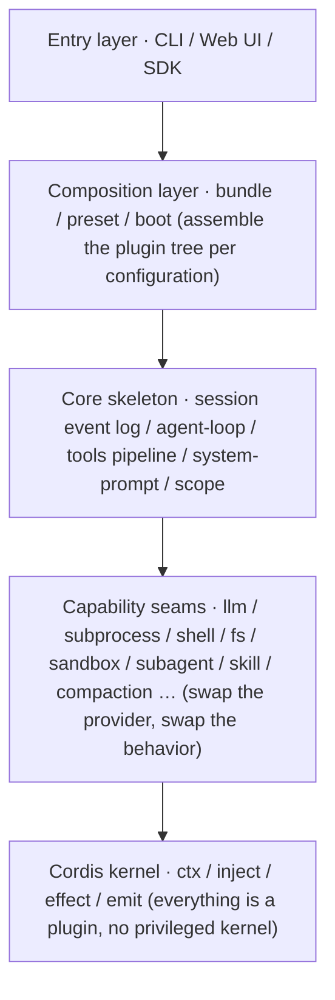

# DeepSeek Harness (dsh) Source-Study Tutorial

> Language: [中文](README_zh.md) | [English](README.md)

**17 chapters. One mechanism at a time. Every chapter runnable.** Deconstruct the DeepSeek Harness engineering skeleton — from the minimal agent loop "one message in, one reply out" all the way to multi-agent delegation, context compaction, human collaboration, and cross-process RPC.

> A progressive set of source-study documents: across 17 chapters, dsh is built up from the minimal closed loop of "how one message becomes one reply", chapter by chapter, into the complete end-to-end form of "multi-agent delegation + context compaction + human collaboration + cross-process RPC".

## Quick Start (3 minutes)

```bash
git clone https://github.com/ChenYu1991ppak/deepseek-harness-anatomy.git
cd deepseek-harness-anatomy
python3 ch02/code/main.py
```

No dependencies, no API keys — Python 3 standard library only. You'll see one full turn of "a question in, a reply out":


Then open [Chapter 2](ch02/ch02-agent-loop_en.md) and thicken the loop chapter by chapter along the roadmap:


## Who Should Read This

- **You're building your own agent framework** and want to reference DeepSeek's design decisions — the seam triple-role, event-stream persistence, and Cordis plugin container are explained mechanism by mechanism
- **You read the dsh source but couldn't get a grip** — this tutorial provides a 17-chapter progressive map with `file:line` source references
- **You're a Python developer** who doesn't want to read TypeScript source — every chapter has runnable Python teaching code (standard library only)
- **You teach or write about agent architecture** — each chapter is a self-contained module with runnable demos, ready to be cited or adapted

```mermaid
flowchart LR
  subgraph S1["Foundation"]
    direction LR
    C01["1 · Cordis kernel"] --> C02["2 · minimal agent-loop"] --> C03["3 · session persistence"]
  end
  subgraph S2["Capability build-up"]
    direction LR
    C04["4 · tools pipeline"] --> C05["5 · capability seam"] --> C06["6 · execution world"] --> C07["7 · LLM adaptation"] --> C08["8 · system-prompt"]
  end
  subgraph S3["Advanced mechanisms"]
    direction LR
    C09["9 · scope"] --> C10["10 · compaction"] --> C11["11 · subagent"] --> C12["12 · skill"]
  end
  subgraph S4["Governance & composition"]
    direction LR
    C13["13 · web & lsp"] --> C14["14 · interaction & permission"] --> C15["15 · preset / bundle"]
  end
  subgraph S5["End-to-end"]
    direction LR
    C16["16 · cross-process RPC"] --> C17["17 · workflow e2e"]
  end
  S1 --> S2 --> S3 --> S4 --> S5
```



## What This Tutorial Is

[DeepSeek Harness](https://github.com/deepseek-ai/deepseek-harness) (command `dsh`) is an **agent harness** open-sourced by DeepSeek AI — the entire engineering skeleton outside the model: session logging, tool execution, context compaction, subagent delegation, permission guards, persistence... Its core philosophy is **"everything is a plugin"**, driven underneath by the vendored Cordis framework.

Reading source code of this scale head-on is hard to get a grip on, so this tutorial breaks it down into a set of **progressive chapters**:

- **17 strictly progressive chapters**: each chapter adds exactly one mechanism on top of the previous one; each chapter ends with a preview of the next, and cross-chapter dependencies are explicitly marked "see Chapter X";
- **Each chapter comes with runnable Python teaching code**: `chNN/code/` is self-contained and uses only the standard library; run `python3 chNN/code/main.py` directly — reproduce the output first, then read the mechanism breakdown;
- **Mechanism-level narrative rather than API-usage level**: it explains "why it is designed this way"; every teaching simplification is marked `[teaching simplification]`; each chapter ends with a `file:line` mapping table to the real source.

The entire tutorial was produced by the Source Decomposition Expert Team (a multi-role AI collaboration framework): the architect builds the map, the explorer reads the source chapter by chapter to produce material, the writer writes, and the reviewer nitpicks and revises chapter by chapter.

## What You Get from Reading This Tutorial

- **A complete mental model of the agent harness**: starting from the minimal closed loop of "how one message becomes one reply", thickening chapter by chapter into the end-to-end full picture of multi-agent delegation, context compaction, human collaboration, and cross-process RPC;
- **The "why" behind design decisions**: mechanism-level narrative — why "everything is a plugin", why the seam splits into three roles, why persistence is done via an event stream; see the design thinking of a first-class framework, not just a feature list;
- **Landing points from concept to implementation**: each mechanism comes with runnable teaching code (reproduce the output first, then read the breakdown) and a chapter-end `file:line` source mapping table; you can always go back and verify against the real source;
- **A unified concept vocabulary**: the terminology naming table and each chapter's quick-reference table align the naming of concepts like seam, scope, and compaction, so afterwards — reading source, looking things up, or discussing with others — you no longer get stuck on terms.

## What Else It's Useful for Beyond Reading

1. **Use it directly as a template**: each chapter's teaching code is a self-contained, standard-library-only minimal agent framework — from the minimal closed loop of `ch02` to the end-to-end form of `ch17`, take it and turn it into your own toy agent or internal tool skeleton, no need to build from scratch;
2. **Design reference for building your own harness**: patterns like the seam triple-role (definition/implementation/consumption), event stream + persistence projection, scope, and the guard pipeline can all be borrowed directly into your own project;
3. **Concept quick-reference manual**: the terminology naming table in [ch00/outline_en.md](ch00/outline_en.md) + each chapter's appendix quick-reference table + the chapter-end source mapping tables can serve as a dictionary of agent-domain concepts, ready to look up anytime.

## dsh Overview

In one sentence: **agent = model + harness**. The model only produces "the next step"; the harness handles orchestration and side effects such as session logging, tool execution, scoping, persistence, and guards; a running `dsh` is a Cordis plugin tree assembled layer by layer at startup — the model adapter, the tool registry, the session log, and the agent loop itself are all plugins, all replaceable via configuration.

The most macroscopic layered view:



Four core design philosophies run through the entire tutorial: **everything is a plugin, no privileged kernel**; **agent = model + harness**; **registration is effect** (installation is reversible and rollback-able); **the seam triple-role** (swap one provider, swap the entire behavior).

## Chapter Navigation

| Chapter | Topic | Key Concepts |
|---|---|---|
| [0](ch00/outline_en.md) | Progressive outline of the whole book | Terminology naming table |
| [1](ch01/ch01-cordis-kernel_en.md) | The Cordis container kernel | Everything is a plugin |
| [2](ch02/ch02-agent-loop_en.md) | The minimal agent-loop closed loop | One message in, one reply out |
| [3](ch03/ch03-session-persistence_en.md) | Session persistence | Event stream, persistence projection |
| [4](ch04/ch04-tools-pipeline_en.md) | The tools execution pipeline | tools registration, guard execution |
| [5](ch05/ch05-capability-seam-triple-role_en.md) | The capability seam | Definition/implementation/consumption triple-role |
| [6](ch06/ch06-execution-world_en.md) | The execution world | subprocess / shell / fs / sandbox |
| [7](ch07/ch07-llm-adaptation-streaming_en.md) | LLM adaptation | Adapter seam, streaming output |
| [8](ch08/ch08-system-prompt-context_en.md) | system-prompt and context | Prompt assembly, context injection |
| [9](ch09/ch09-scope_en.md) | scope scoped registration | Minting/lineage/shadowing/dispatch |
| [10](ch10/ch10-compaction_en.md) | Context compaction | compaction, token pressure |
| [11](ch11/ch11-subagent_en.md) | subagent delegation | Multiple transport providers |
| [12](ch12/ch12-skill_en.md) | skill loading | Rank ladder, layered shadowing |
| [13](ch13/ch13-web-lsp_en.md) | web and lsp capabilities | Web retrieval, lsp code semantics |
| [14](ch14/ch14-interaction-permission-goal-plan_en.md) | Interaction and governance | interaction / permission / goal / plan |
| [15](ch15/ch15-preset-bundle-profile_en.md) | Configuration composition | preset / bundle / profile |
| [16](ch16/ch16-typert-api-sdk_en.md) | Cross-process RPC | typert / api / sdk |
| [17](ch17/ch17-workflow-ralph-python-e2e_en.md) | Workflow and end-to-end | workflow / Ralph loop, end-to-end chain |

> Chapters 1–2 were split from the original s01 (which carried both the "container kernel" and the "agent-loop closed loop" mechanism clusters); Chapters 3–17 correspond to old Chapters 2–16, with chapter numbers shifted by one overall; the old drafts have been cleaned up and rewritten chapter by chapter following [ch00/outline_en.md](ch00/outline_en.md).

## Recommended Reading Order

1. **Read the map first**: [ch00/outline_en.md](ch00/outline_en.md) shows the progressive arc of the 17 chapters and the terminology naming table — build the global mental model.
2. **Read chapter by chapter in order**: `ch01` → `ch17`, strictly progressive — each chapter opens by picking up the mechanism added in the previous chapter and closes with a preview of the next; cross-chapter dependencies are marked "see Chapter X". Skipping chapters is not recommended.
3. **Read and run**: each chapter's teaching code lives in `chNN/code/` (`ch02`–`ch17` enter via `main.py`; `ch01` via `hello.py`), and `python3 chNN/code/main.py` runs directly; first reproduce the chapter-end "full run output", then read the mechanism breakdown.

## Companion Files

| File | Purpose |
|---|---|
| `ch00/` | The outline directory: `outline_en.md` is the progressive outline of the 17 chapters (topic / new mechanisms / source modules / prerequisite chapters) + the terminology naming table; `outline_zh.md` is the corresponding Chinese version |
| `ch01/` … `ch17/` | One directory per chapter: `chNN-*_en.md` is the chapter's final body text (epigraph / questions this chapter answers / body / full run output / source mapping / summary & preview / appendix quick-reference table), `chNN-*_zh.md` is the corresponding Chinese version, and `code/` is the chapter's runnable Python teaching code (accumulated incrementally per chapter) |

## Architecture Comparison

### How dsh compares to other agent frameworks

| Dimension | DeepSeek Harness (dsh) | LangChain | CrewAI | AutoGen |
|---|---|---|---|---|
| Philosophy | Everything is a plugin | Chain composition | Role-based agents | Multi-agent conversation |
| Core container | Cordis (plugin kernel) | No kernel | No kernel | No kernel |
| Seam/replaceability | Triple-role (def/provider/consumer) | Components | Limited | Limited |
| Agent loop | Built-in react loop | Custom chains | Built-in | Built-in |
| Context compaction | Built-in (threshold-triggered) | External | External | External |
| Session persistence | Append-only event log + projections | Manual | Limited | Limited |
| Token metering | Real provider-returned usage | Estimates | Estimates | Estimates |
| Plugin isolation | Scoped layers (per-agent) | No | No | No |
| Cross-process RPC | Built-in (Ralph/ACP) | No | No | No |
| Learning curve | Steep (full-featured) | High (many abstractions) | Medium | Medium |
| Best for | Production agent systems | Rapid prototyping | Role-based tasks | Research experiments |

### Why this tutorial focuses on dsh

dsh is unique among agent frameworks in that it has a **real plugin kernel** (Cordis) rather than a library of components. This means every capability — model calls, tool execution, session logging, compaction — is a plugin that can be swapped, composed, and scoped. Understanding this architecture gives you a mental model that applies beyond dsh: it's the same pattern used by VS Code, Kubernetes controllers, and webpack.

This tutorial is the only resource that deconstructs dsh mechanism by mechanism, from the minimal agent loop to the full end-to-end system. The companion [pydsh](https://github.com/ChenYu1991ppak/Pydsh) project provides a runnable Python implementation of the same architecture.
