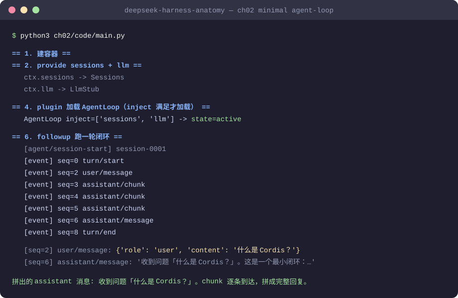
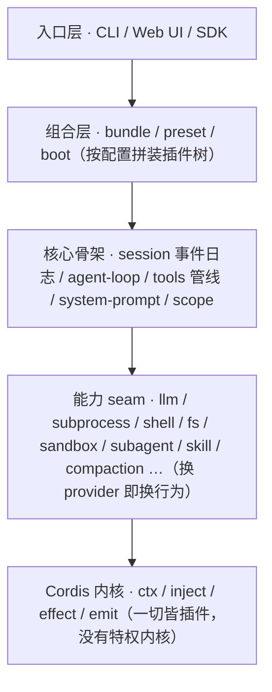

# DeepSeek Harness（dsh）源码学习教程

> 语言：[中文](README_zh.md) | [English](README.md)

**17 章渐进式拆解。每章只加一个机制。每章代码可直接运行。** 从「一条消息如何变成一条回复」的最小闭环，逐章加厚到多 agent 委派、上下文压缩、人类协作与跨进程 RPC 的完整端到端形态。

> 一套递进式源码学习文档：用 17 个章节把 dsh 从「一条消息如何变成一条回复」的最小闭环，逐章加厚到「多 agent 委派 + 上下文压缩 + 人类协作 + 跨进程 RPC」的完整端到端形态。

## 快速开始（3 分钟）

```bash
git clone https://github.com/ChenYu1991ppak/deepseek-harness-anatomy.git
cd deepseek-harness-anatomy
python3 ch02/code/main.py
```

无依赖、无需 API key，仅 Python 3 标准库。你会看到一轮完整的「一条消息进，一条回复出」：



然后打开[第 2 章](ch02/ch02-agent-loop_zh.md)，沿下面的路线图逐章加厚：


## 谁该读这个教程

- **你在写自己的 agent 框架**，想参考 DeepSeek 的设计决策——seam 三角色、事件流持久化、Cordis 插件容器，逐机制拆解
- **你看了 dsh 源码但没看懂**——这份教程提供 17 章递进地图，每章末尾附 `file:line` 源码对照表
- **你是 Python 开发者**，不想啃 TypeScript 源码——每章附带仅用标准库的可运行 Python 教学代码
- **你在教或写 agent 架构相关内容**——每章都是独立模块，附可运行 demo，可直接引用或改编

```mermaid
flowchart LR
  subgraph S1["打地基"]
    direction LR
    C01["1 · Cordis 内核"] --> C02["2 · 最小 agent-loop"] --> C03["3 · session 持久化"]
  end
  subgraph S2["能力加厚"]
    direction LR
    C04["4 · tools 管线"] --> C05["5 · capability seam"] --> C06["6 · 执行世界"] --> C07["7 · LLM 适配"] --> C08["8 · system-prompt"]
  end
  subgraph S3["进阶机制"]
    direction LR
    C09["9 · scope"] --> C10["10 · 上下文压缩"] --> C11["11 · subagent"] --> C12["12 · skill"]
  end
  subgraph S4["治理与组合"]
    direction LR
    C13["13 · web 与 lsp"] --> C14["14 · 交互与权限"] --> C15["15 · preset / bundle"]
  end
  subgraph S5["端到端"]
    direction LR
    C16["16 · 跨进程 RPC"] --> C17["17 · workflow 端到端"]
  end
  S1 --> S2 --> S3 --> S4 --> S5
```



## 这个教程是什么

[DeepSeek Harness](https://github.com/deepseek-ai/deepseek-harness)（命令 `dsh`）是 DeepSeek AI 开源的 **agent harness**——模型之外的那一整层工程骨架：会话日志、工具执行、上下文压缩、子代理委派、权限守卫、持久化……核心理念是**「一切皆插件」**，底层由 vendored 的 Cordis 框架驱动。

直接啃这样规模的源码很难下手，所以这个教程把它拆成一套**渐进式章节**：

- **17 章严格递进**：每章只在前一章基础上新增一个机制，章末预告下一章，跨章依赖显式标注「详见第 X 章」；
- **每章配可运行的 Python 教学代码**：`chNN/code/` 自包含、仅用标准库，`python3 chNN/code/main.py` 直接跑，先复现输出再读机制拆解；
- **机制层叙事而非 API 使用层**：讲「为什么这样设计」，每个教学简化都标注 `[教学简化]`；章末附与真实源码的 `file:line` 对照表。

全教程由源码拆解专家团（一套多角色 AI 协作框架）产出：架构师建图、勘探员逐章读源码出素材、作者撰写、评审员逐章找茬修订。

## 阅读本教程能获得什么

- **一套完整的 agent harness 心智模型**：从「一条消息如何变成一条回复」的最小闭环出发，逐章加厚到多 agent 委派、上下文压缩、人类协作、跨进程 RPC 的端到端全貌；
- **设计决策背后的「为什么」**：机制层叙事——为什么「一切皆插件」、为什么 seam 要分三角色、为什么用事件流做持久化，看懂一流框架的设计思路而不只是功能清单；
- **从概念到实现的落点**：每个机制配可运行教学代码（先复现输出再读拆解）与章末 `file:line` 源码对照表，随时可回真实源码核对；
- **统一的概念词汇**：术语命名表与每章速查表把 seam、scope、compaction 等概念的命名对齐，此后读源码、查资料、与人讨论不再卡在名词上。

## 除了阅读还能有什么用

1. **直接当模板改**：每章教学代码是自包含、仅标准库的最小 agent 框架——从 `ch02` 的最小闭环到 `ch17` 的端到端形态，拿去改造成自己的 toy agent 或内部工具骨架，不用从零搭；
2. **自研 harness 的设计参照**：seam 三角色（定义/实现/消费）、事件流 + 持久化投影、scope 作用域、守卫管线等模式均可直接借鉴到自己的项目；
3. **概念速查手册**：[ch00/outline_zh.md](ch00/outline_zh.md) 的术语命名表 + 每章附录速查表 + 章末源码对照表，可作为 agent 领域概念的词典，随用随查。

## dsh 总览

一句话：**agent = model + harness**。模型只产出「下一步」，harness 负责会话日志、工具执行、作用域、持久化、守卫等编排与副作用；一个运行中的 `dsh` 就是一棵启动时按层序拼装的 Cordis 插件树——模型适配器、工具注册表、会话日志、agent 循环本身都是插件，皆可被配置替换。

最宏观的分层视图：



四条核心设计思想贯穿全教程：**一切皆插件，没有特权内核**；**agent = model + harness**；**注册即效应**（安装可逆回滚）；**seam 三角色**（换一个 provider 即换整体行为）。

## 目录导航

| 章节 | 主题 | 关键概念 |
|---|---|---|
| [0](ch00/outline_zh.md) | 全书递进大纲 | 术语命名表 |
| [1](ch01/ch01-cordis-kernel_zh.md) | Cordis 容器内核 | 一切皆插件 |
| [2](ch02/ch02-agent-loop_zh.md) | 最小 agent-loop 闭环 | 一条消息进，一条回复出 |
| [3](ch03/ch03-session-persistence_zh.md) | session 持久化 | 事件流、持久化投影 |
| [4](ch04/ch04-tools-pipeline_zh.md) | tools 执行管线 | tools 注册、守卫执行 |
| [5](ch05/ch05-capability-seam-triple-role_zh.md) | capability seam | 定义/实现/消费三角色 |
| [6](ch06/ch06-execution-world_zh.md) | 执行世界 | subprocess / shell / fs / sandbox |
| [7](ch07/ch07-llm-adaptation-streaming_zh.md) | LLM 适配 | 适配器 seam、流式输出 |
| [8](ch08/ch08-system-prompt-context_zh.md) | system-prompt 与 context | prompt 组装、context 注入 |
| [9](ch09/ch09-scope_zh.md) | scope 作用域 | 铸造/谱系/遮蔽/分发 |
| [10](ch10/ch10-compaction_zh.md) | 上下文压缩 | compaction、token 压力 |
| [11](ch11/ch11-subagent_zh.md) | subagent 委派 | 多 transport provider |
| [12](ch12/ch12-skill_zh.md) | skill 加载 | rank 阶梯、分层 shadowing |
| [13](ch13/ch13-web-lsp_zh.md) | web 与 lsp 能力 | web 检索、lsp 代码语义 |
| [14](ch14/ch14-interaction-permission-goal-plan_zh.md) | 交互与治理 | interaction / permission / goal / plan |
| [15](ch15/ch15-preset-bundle-profile_zh.md) | 配置组合 | preset / bundle / profile |
| [16](ch16/ch16-typert-api-sdk_zh.md) | 跨进程 RPC | typert / api / sdk |
| [17](ch17/ch17-workflow-ralph-python-e2e_zh.md) | workflow 与端到端 | workflow / Ralph 循环、端到端链路 |

> 第 1–2 章由原 s01（同时承载「容器内核」与「agent-loop 闭环」两个机制簇）拆分而来；第 3–17 章对应旧版第 2–16 章，章号整体顺延一位，原稿已清理，按 [ch00/outline_zh.md](ch00/outline_zh.md) 逐章重写。

## 推荐阅读顺序

1. **先读地图**：[ch00/outline_zh.md](ch00/outline_zh.md) 看 17 章递进脉络与术语命名表，建立全局心智模型。
2. **按编号逐章读**：`ch01` → `ch17` 严格递进——每一章开头承接前一章新增的机制，结尾预告下一章，跨章依赖用「详见第 X 章」标注。不建议跳读。
3. **边读边跑**：每章教学代码位于 `chNN/code/`（`ch02`–`ch17` 以 `main.py` 为入口，`ch01` 为 `hello.py`），`python3 chNN/code/main.py` 可直接运行；先复现章末「完整运行输出」，再读机制拆解。

## 配套文件说明

| 文件 | 作用 |
|---|---|
| `ch00/` | 大纲目录：`outline_zh.md` 为 17 章递进大纲（主题 / 新增机制 / 源码模块 / 依赖前章）+ 术语命名表，`outline_en.md` 为对应英文版 |
| `ch01/` … `ch17/` | 每章一个目录：`chNN-*_zh.md` 为该章正文终稿（题记 / 本章回答的问题 / 正文 / 完整运行输出 / 源码对照 / 小结与预告 / 附录速查表），`chNN-*_en.md` 为对应英文版，`code/` 为该章可运行 Python 教学代码（按章增量累积） |
