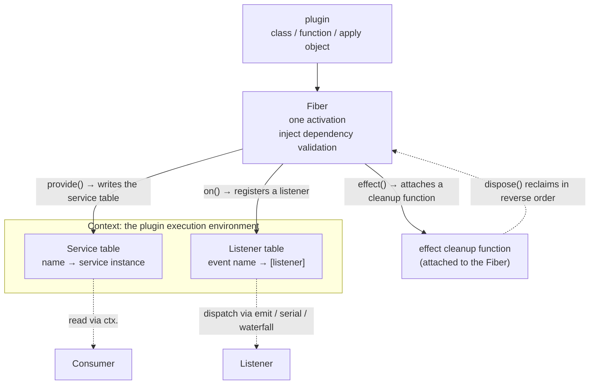

# Chapter 1: The Cordis Container Kernel (Everything Is a Plugin)

> At the gate, no one is asked where they come from; once inside, everyone is a plugin.

## Questions this chapter answers

- How is a plugin container assembled? — How are context, services, reversible registration, and event dispatch unified under a single `Context`?
- What are a context (`Context`) and a service (`Service`)? How does a capability go from being a "global variable" to a "service registered in the container"?
- What is reversible registration (`effect` / `Fiber`)? How does registration become revocable and rollback-able?
- What is event dispatch (`on` / `emit` / `serial` / `waterfall`)? How can services collaborate without knowing each other?

What this book delivers is a harness for assembling AI agents on top of **Cordis**: `agent = model + harness`. The model provides reasoning ability; the harness provides the framework that organizes those abilities. The foundation of that framework is the subject of this chapter — the **Cordis plugin container kernel**.

Cordis's worldview fits in one sentence, which is also this chapter's opening epigraph: **everything is a plugin**. The container does not care whether what is being installed is a "model adapter", a "session log", or a "prompt template" — they are all treated as plugins: registered into the container, declaring dependencies, reversibly unloadable, and collaborating through events.

This chapter only builds the container; no business logic. What does it look like when it runs? `ch01/code/hello.py` is only 41 lines, and running it prints three lines:

```text
[event] hello, cordis
hello, cordis
after dispose: ctx.greeting has been rolled back
```

These three lines correspond to three core assertions about the container: **capabilities are services** (no global variables), **registrations are effects** (rollback-able), and **interactions are events** (callers and listeners don't know each other). As for where the dependencies come from — the full implementation of the container kernel lives in `vendor/cordis/src/` (originally the TypeScript `@cordisjs/core`); this chapter reimplements its minimal subset in pure Python in `ch01/code/cordis.py`. The one-to-one correspondence between symbols and source locations is in §9 "Source mapping" of this chapter.

This chapter only delivers the container kernel; installing the session, the prompt, and the conversation loop into this container and running the closed loop of "one message in, one reply out" is the job of the next chapter, "The Minimal agent-loop Closed Loop".

## 1. The Plight Without a Container

Before introducing Cordis, let's look at how broken a multi-agent system without a container gets.

### 1.1 A runnable counterexample: a shared global message list

Save as `ch01/code/bad_example.py` and run directly with `python3 bad_example.py` (standard library only):

```python
"""Chapter 1 counterexample: what happens without a container.

Two agents share one global message list and a hard-coded "model call";
their conversation histories contaminate each other. Run: python3 bad_example.py
"""
messages = []  # global message list: shared by all agents


def ask(agent, question):
    messages.append({"role": "user", "content": question})
    reply = f"{agent} received: " + "".join(m["content"] for m in messages)
    messages.append({"role": "assistant", "content": reply})
    print(f"[{agent}] {reply}")


ask("support agent", "How do I change my ticket?")
ask("shopping agent", "Recommend a mechanical keyboard")
```

Actual output:

```text
[support agent] support agent received: How do I change my ticket?
[shopping agent] shopping agent received: How do I change my ticket?support agent received: How do I change my ticket?Recommend a mechanical keyboard
```

The second line is the accident scene: mixed into what the shopping agent "received" are the support agent's question and reply — the global list is shared by all agents, and whoever writes to it contaminates everyone.

### 1.2 The root of the problem: capabilities, dependencies, lifecycle, and collaboration are all unmanaged

This example is only a dozen lines, yet it exposes three problems that inevitably appear without a container; a fourth emerges when we try to solve the first three:

1. **Capabilities are global variables**. `messages` sits in the global scope: anyone can write to it, no one is responsible for it. In a real system, model adapters, session logs, and prompt templates all become module-level singletons like this — who provides them, who consumes them, and when they get cleaned up all rely on tacit agreement.
2. **Dependencies are invisible**. `ask` implicitly depends on `messages`, but this dependency appears in no declaration; a missing dependency or a wrong order only surfaces as a runtime error.
3. **No lifecycle**. When you want to "cleanly unload an agent", there is nowhere to start — the global state is still there, and no one can say which resources should be reclaimed.
4. **Services need to collaborate** (this is the new problem that emerges after the first three are solved). Once capabilities no longer hang off the global scope but become mutually isolated **services**, services still need to call each other — and if they call each other directly, the "who knows whom" coupling is reintroduced.

This chapter solves this problem chain layer by layer; each step corresponds to a set of container mechanisms:

| Problem | Mechanism | In one sentence |
|------|------|--------|
| ① Capabilities are global variables | `Context` + `Service` | Capabilities become services registered in the container (§4) |
| ② Dependencies are invisible | `plugin` + `inject` | Dependencies become declarations, validated at load time (§5) |
| ③ No lifecycle | `effect` + `Fiber` | Registrations become reversible effects, reclaimed LIFO (§6) |
| ④ Services need to collaborate | `on`/`emit`/`serial`/`waterfall` | All interactions are events (§7) |

Before unpacking them one by one, let's first see what the minimal closed loop looks like with the container installed (§2), then give an overview diagram of the container structure (§3).

## 2. The Minimal Runnable Closed Loop: hello.py (the simplest example first)

Before dissecting the mechanisms piece by piece, let's state three assertions first, then verify them with a minimal example.

### 2.1 Three assertions

Cordis's worldview can be condensed into three assertions:

**Assertion 1: Every capability is a service.** Model calls, session storage, prompt assembly — all of them are services registered on the container, read via `ctx.<name>`. No module-level singletons, no global state.

**Assertion 2: Every registration is a plugin.** A service is not simply `new`-ed up and done; it is registered into the container through a plugin. Plugins come in three shapes (function / class / apply object), and the container loads them uniformly. The act of registration itself is an "effect": trackable and rollback-able.

**Assertion 3: Every interaction is an event.** Services don't call each other directly; they communicate through events. The caller only `emit`s; the listener only recognizes the event name; no one needs to know who the other party is.

### 2.2 The minimal example: three assertions in one file

Compress the three assertions of 2.1 into one file. Save as `ch01/code/hello.py`; `cordis.py` is the teaching-version container implemented in this chapter, already in place in the same directory, and `python3 hello.py` runs directly (see §4–§7 for the piece-by-piece breakdown of the implementation):

```python
"""Chapter 1 §2.2 minimal example: three assertions in one file.

Run: python3 hello.py (same directory as cordis.py, standard library only).
"""
from cordis import Context, Service, ServiceNotFoundError

ctx = Context()  # Create the container: internally there are a service table and a listener table; all later capabilities are registered here

# Register a listener for the "greet" event: from now on, whenever anyone emit("greet", name), this lambda is called.
# The listener only recognizes the event name; it doesn't know who is emitting.
ctx.on("greet", lambda name: print(f"[event] hello, {name}"))


# Define a capability Greeter: provides a greet method that greets and emits an event.
class Greeter(Service):
    def __init__(self, ctx, config=None):
        # Construction is registration: Service.__init__ internally calls ctx.provide("greeting", self),
        # writing this instance into the service table; from now on ctx.greeting points to it.
        super().__init__(ctx, "greeting")

    def greet(self, name):
        # Emit an event: the container calls, in order, every listener registered on "greet".
        # greet doesn't know who is listening — callers and listeners only recognize the event name and don't know each other (Assertion 3).
        self.ctx.emit("greet", name)
        return f"hello, {name}"


# Register Greeter as a plugin into the container: the container instantiates Greeter(ctx, config)
# and records this registration as an "effect" — rollback-able on unload (Assertion 2).
ctx.plugin(Greeter)

# Use the capability: look up the service by the name "greeting" in the service table and call its greet method;
# no global variables anywhere (Assertion 1).
print(ctx.greeting.greet("cordis"))

# Registration is an effect: dispose rolls back in reverse registration order, removing the service from the service table.
ctx.dispose()
try:
    ctx.greeting  # Read once more: the service has been rolled back, raising ServiceNotFoundError
except ServiceNotFoundError:
    print("after dispose: ctx.greeting has been rolled back")
```

Run output:

```text
[event] hello, cordis
hello, cordis
after dispose: ctx.greeting has been rolled back
```

The three output lines correspond to the three assertions:

1. **Every capability is a service**: the second line `hello, cordis` comes from `ctx.greeting.greet(...)` — the capability hangs off the container and is read via `ctx.<name>`; no global variables anywhere, in contrast to the global `messages` in Section 1. `ctx.greeting` is not an ordinary attribute; `__getattr__` acts as a fallback that treats the failed attribute name as a service name and looks it up in the service table (see §4); reading a service that was never provided or has been rolled back raises `ServiceNotFoundError` (which inherits from `AttributeError`, so `getattr(ctx, name, default)` still works) — "missing" is exposed explicitly.
2. **Every registration is plugin-ized**: `Greeter` is not assigned to the container directly but registered via `ctx.plugin(...)`; the act of registration itself is an effect — at `dispose()` time, the container removes services from the service table in reverse registration order. The third output line is the evidence.
3. **Every interaction is event-ized**: the first line `[event] hello, cordis` is printed by the lambda at the top of the file, but it was never called directly — it was triggered by `emit("greet", ...)` inside `greet`. The emitter (`Greeter.greet`) and the listener (the lambda) never reference each other; they connect only through the event name `"greet"`. Swap the listener for log-writing or notification-sending, and `greet` doesn't need a single line changed.

Two more notes on pitfalls beginners often hit: registration always goes through explicit `provide()` (that is exactly what `Service`'s constructor does internally) — `ctx.greeting = ...` is just an ordinary attribute assignment and won't enter the service table (see §4, teaching decision G6); a service can be any object — in a real system, model adapters, session storage, and the agent-loop are all registered the same way.

Each of the mechanisms above is dissected piece by piece in §4–§7.

## 3. Container Structure Overview (relationships first)

Before dissecting piece by piece, let's build the big picture with one diagram: inside the container there are only **one service table** and **one listener table**, plus a stack of **Fibers** that record the lifecycle. Plugins write services, register listeners, and attach cleanup functions through Fibers; consumers read the service table, listeners receive events, and `dispose()` reclaims in reverse Fiber order.



The three subsystems correspond to the three problems of Section 1 (unpacked one by one in §4–§7):

- **Service table** (§4): solves "capabilities are global variables" — capabilities are collected into the service table via `provide()`, read via `ctx.<name>`; no global singletons.
- **Fiber stack** (§5, §6): solves "dependencies are invisible" and "no lifecycle" — each `plugin()` produces a Fiber, declares `inject` dependencies (§5), attaches `effect()` cleanup functions to the Fiber, and `dispose()` reclaims in reverse order (§6).
- **Listener table + dispatch** (§7): solves "services need to collaborate" — `on()` registers listeners, `emit/serial/waterfall` dispatch; services only recognize event names.

The order of dissection follows this diagram from bottom to top: first set up `Context` and the service table (§4), then see how plugins come in with `inject` (§5) and leave with `effect` (§6), and finally see how they collaborate through events (§7).

## 4. Context + Service

The `messages` in Section 1 hangs off the global scope; anyone can write to it. Cordis's solution: collect capabilities into **services** registered on the `Context`; who provides, who consumes, and when to remove are all managed by the container.

### 4.1 Context: one service table + one __getattr__

```python
# cordis.py — Context construction and service resolution (excerpt)
class Context:
    def __init__(self):
        setattr(self, Symbols.services, {})    # service table: name → instance
        setattr(self, Symbols.events, {})      # listener table: event name → [listener]
        setattr(self, Symbols.dispose, False)  # dispose flag
        self._fibers = []      # all fibers (in registration order)
        self._pending = []     # fibers whose dependencies are unsatisfied, waiting to load
        self._disposers = []   # cleanup functions of root-level effects

    def __getattr__(self, name):
        """Called only when ordinary attribute lookup fails: every non-internal attribute is read as a service.

        Corresponds to the Proxy get trap routing to ReflectService.get (reflect.ts:133/136).
        """
        if name.startswith("_"):
            raise AttributeError(name)
        services = getattr(self, Symbols.services)
        if name in services:
            return services[name]
        raise ServiceNotFoundError(name)

    def provide(self, name, value):
        """Register a service; returns the "unregister" disposer (reflect.ts:237-243).

        After registration, triggers service/provide and settles fibers waiting on dependencies.
        """
        services = getattr(self, Symbols.services)
        services[name] = value
        self.emit("service/provide", {"name": name})
        self._settle_pending()

        def dispose():
            if services.get(name) is value:
                del services[name]
                self.emit("service/dispose", {"name": name})

        return dispose
```

Key names like `Symbols.services` and `Symbols.events` come from the `Symbols` class at the top of `cordis.py`: a set of double-underscore string constants (`Symbols.services` is exactly `"__cordis_services__"`), corresponding to the source's `Symbol.for('cordis.*')` (vendor/cordis/src/utils.ts:50-73; there is no symbols.ts in the whole repo), used as key names for the container's internal fields.

Every mechanism of Context is built on two tables: the service table (name → instance) and the listener table (event name → list of listeners). `__getattr__` is Python's fallback method for attribute access — called only when normal lookup fails — and it treats the failed attribute name as a service name to look up in the table; internal fields starting with `_` bypass the service table to avoid false hits. `provide` writes `value` into the service table, returns a `dispose` closure that can remove it, emits the `service/provide` event, and settles plugins waiting on dependencies (see §5).

Why it is designed this way:

- **`__getattr__` instead of `__setattr__`**: `__getattr__` fires only when an attribute is missing, so internal fields (`_fibers`, etc.) are unaffected; `__setattr__` would intercept every assignment and easily cause false hits. [Teaching decision G6] TS's Proxy intercepts both get and set; Python only intercepts missing reads, so service registration always goes through explicit `provide()`.
- **`ServiceNotFoundError` inherits from `AttributeError`**: the default-value pattern `getattr(ctx, name, default)` still works. [Teaching decision G1] The source material did not specify the error type; this is a teaching choice.
- **Same-name `provide` silently overwrites**: `services[name] = value` directly replaces the old instance (`cordis.py:92`) without error — the teaching version keeps it simple; when to replace a service is left to the caller's judgment.

### 4.2 Service: construction is registration

```python
# cordis.py — the Service base class
class Service:
    """Service base class: construction is registration.

    Corresponds to vendor/cordis/src/service.ts:11: constructor :42-59 calls ctx.reflect.provide (:57)
    to attach the instance to ctx.<key> (r7 ruling, notes §13 D3).
    The teaching version uses ctx.effect to express "unload means remove" explicitly — registration itself is a reversible effect.
    """

    def __init__(self, ctx, name=None):
        self.ctx = ctx
        self.service_name = name
        if name is not None:
            dispose = ctx.provide(name, self)
            ctx.effect(lambda: dispose, label=f"service:{name}")
```

The single line `Greeter(ctx, "greeting")` accomplishes three things: "construction + registration + unload registration". Registration is not assignment but an effect: when the container is destroyed, the cleanup function registered via `ctx.effect` removes the service from the service table (see §6 for the full mechanism of `effect`).

**Recap**: this section solved problem ① — capabilities went from global variables to services registered in the container; who provides, who consumes, and when to remove are all managed by `Context`. But `Greeter`'s dependencies are still implicit: what services it needs and whether they are ready can only be guessed by reading the code. That is exactly problem ②, solved by `plugin` + `inject` in the next section.

### 4.3 Source mapping

- `Context` `vendor/cordis/src/context.ts:42`
- Property reads: TS uses a Proxy get trap to route to the service table (`context.ts:16/:42` → `reflect.ts:133`); Python uses the `__getattr__` fallback
- `provide` returns the unregister disposer: `reflect.ts:237-243`
- `Service` `vendor/cordis/src/service.ts:11`; constructor `:42-59`, the registration statement ctx.reflect.provide `:57` (r7 ruling, notes §13 D3)

## 5. plugin + inject

The `ask` in Section 1 implicitly depends on the global `messages`; this dependency is written in no declaration. Cordis's solution: dependencies become `inject` declarations on the plugin, validated by the container at load time — if the declaration is not satisfied, it does not load.

### 5.1 Three plugin shapes: normalized to "a function that receives ctx"

```python
# cordis.py — Context.plugin and Fiber's three-shape normalization (excerpt)
    def plugin(self, callback, config=None):
        """Register a plugin: the three shapes — function / class / apply object — are normalized here; returns the Fiber for this activation.

        Corresponds to RegistryService's (registry.ts:195) plugin method (:316).
        """
        return Fiber(self, callback, config)


class Fiber:
    def __init__(self, ctx, callback, config=None):
        self.ctx = ctx
        self.config = config
        self.state = self.PENDING
        self.disposers = []
        self.inject = list(getattr(callback, "inject", None) or [])
        self._body = self._normalize(callback, config)
        ctx._fibers.append(self)
        if self.deps_satisfied():  # load only when satisfied (fiber.ts:249-251)
            self.activate()
        else:
            ctx._pending.append(self)

    @staticmethod
    def _normalize(callback, config):
        """Normalize three shapes:

        class → instantiate cls(ctx, config); apply object → take its apply(ctx); function → call fn(ctx) as-is.
        """
        if isinstance(callback, type):
            return lambda ctx: callback(ctx, config)
        apply_ = getattr(callback, "apply", None)
        if callable(apply_):
            return lambda ctx: apply_(ctx)
        return callback
```

Plugins come in three shapes: function, class, and object with an `apply` method. `ctx.plugin()` normalizes them into "a function that receives ctx", then creates a Fiber — one activation of the plugin. The Fiber is the host of effects: every effect registered during the plugin body's execution has its cleanup function collected on this Fiber (see §6).

### 5.2 inject: dependency declarations and "load only when satisfied"

```python
# cordis.py — Fiber's dependency check and activation (excerpt)
# [Teaching simplification] Real cordis uses AsyncLocalStorage to find the host fiber;
# the teaching version is synchronous and single-threaded, so a module-level variable marking "the fiber currently being activated" suffices.
_current_fiber: "Fiber | None" = None


class Fiber:
    def deps_satisfied(self):
        """The inject "load only when satisfied" check: load only when every declared service has been provided.

        events is a built-in capability of the container and doesn't count as an external dependency.
        """
        services = getattr(self.ctx, Symbols.services)
        return all(name in services for name in self.inject if name != "events")

    def activate(self):
        """Execute the plugin body; during execution the host fiber points to self (the collection target for effects)."""
        global _current_fiber
        self.state = self.ACTIVE
        parent = _current_fiber
        _current_fiber = self
        try:
            self._body(self.ctx)
        finally:
            _current_fiber = parent
```

A plugin expresses "I need the `logger` service" by declaring `inject = ['logger']` on the class. `Fiber.__init__` reads this declaration with `getattr(callback, 'inject', None)`; `deps_satisfied` checks whether all these names already appear in the service table — `events` is a built-in capability of the container and doesn't count as an external dependency. If dependencies are satisfied, `activate()` immediately; if not, hang it on `ctx._pending`, and after each `provide`, `_settle_pending` rechecks them one by one, activating only when satisfied (this recheck logic was already seen in §4.1's `provide`).

The semantics of `inject` is "**load only when satisfied**", not "inject into constructor parameters": dependencies are declared explicitly and validated at load time; who depends on whom no longer relies on human memory. The teaching version replaces real cordis's `AsyncLocalStorage` with a module-level global `_current_fiber`; the boundary is that only one plugin loads at a time.

**Recap**: this section solved problem ② — dependencies went from implicit to `inject` declarations, validated by the container at load time. But "registration" itself still cannot be undone: how to cleanly unload after a plugin is loaded, and how to reclaim resources, still has no answer. That is exactly problem ③, solved by `effect` + `Fiber` in the next section.

### 5.3 Source mapping

- `ctx.plugin` → the plugin method `:316` of `RegistryService` (`vendor/cordis/src/registry.ts:195`); three-shape normalization `:92/:121/:126/:131`, normalize `:71-79`
- `Fiber` `vendor/cordis/src/fiber.ts:184`; load only when satisfied `:249-251`; reload on dependency change `_unload/_reload` `:588-609/:646-696` (G8: this chapter only implements "load only when satisfied", not "reload on change")

## 6. effect + Fiber

In Section 1, "cleanly unloading an agent" had nowhere to start. Cordis's solution: the act of registration itself becomes an **effect**, and on unload, they are reclaimed one by one in reverse registration order.

### 6.1 effect: execute immediately, reclaim in reverse order

```python
# cordis.py — Context's effect registration and dispose reverse order (excerpt)
    def effect(self, execute, label="anonymous"):
        """Register an effect: execute `execute` immediately and collect the cleanup function it returns.

        Cleanup functions run in reverse order on unload (fiber.ts:415/418/431) — later-registered ones are cleaned up first.
        The label parameter aligns with the real API; the teaching version doesn't consume it.
        """
        disposer = execute()
        if disposer is None:
            disposer = lambda: None  # noqa: E731  use a no-op placeholder when there is no cleanup function
        if _current_fiber is not None:
            _current_fiber.disposers.append(disposer)
        else:
            self._disposers.append(disposer)
        return disposer

    def dispose(self):
        """Destroy the container: unload all fibers in reverse registration order, then run root-level effects in reverse.

        [Teaching simplification] The real code's dispose is async with a settle timeout.
        """
        if getattr(self, Symbols.dispose):
            return
        setattr(self, Symbols.dispose, True)
        for fiber in reversed(self._fibers):
            fiber.dispose()
        for disposer in reversed(self._disposers):
            disposer()


class Fiber:
    def dispose(self):
        """Unload: run cleanup functions in reverse order (fiber.ts:431)."""
        if self.state == self.DISPOSED:
            return
        for disposer in reversed(self.disposers):
            disposer()
        self.disposers.clear()
        self.state = self.DISPOSED
```

The contract of effect: `execute()` runs immediately and returns a cleanup function; cleanup functions run in **reverse order** on unload — later-registered ones are cleaned up first. This is the "register takes effect, unload reclaims" lifecycle: there is no global state that can never be cleaned up, because every registration carries its own reversible cleanup.

### 6.2 Hosts: Fiber-level vs container-level

Effects have hosts: effects registered during the plugin body's execution attach to the current Fiber (unloaded with the Fiber); those registered at the container top level attach to `ctx._disposers` (cleaned up with `ctx.dispose()`).

Going back to §2's `hello.py`, we can verify exactly this LIFO chain:

1. `ctx.on("greet", ...)` runs at the container top level and internally goes through `self.effect(setup, ...)` — at this moment no Fiber is active, so the cleanup function attaches to `ctx._disposers`.
2. `ctx.plugin(Greeter)` creates a Fiber and `activate()`s it; inside `Greeter.__init__`, `super().__init__(ctx, "greeting")` calls `ctx.provide(...)` and then `ctx.effect(lambda: dispose, ...)` — at this moment `_current_fiber` points to Greeter's Fiber, so the cleanup function attaches to `fiber.disposers`.
3. `ctx.dispose()` first unloads Greeter's Fiber via `reversed(self._fibers)` (removing `"greeting"` from the service table), then unregisters the `"greet"` listener via `reversed(self._disposers)`.

So the third output line `after dispose: ctx.greeting has been rolled back` is exactly the evidence that §6.2's Fiber-level cleanup function (the `dispose` returned by `provide`) runs in reverse order inside `fiber.dispose()`.

**Recap**: this section solved problem ③ — registrations became reversible effects, and `dispose()` reclaims in reverse registration order. But once capabilities are collected into mutually isolated services, services need to collaborate, and direct mutual calls would bring coupling back. That is exactly problem ④, solved by event dispatch in the next section.

### 6.3 Source mapping

- `effect` `vendor/cordis/src/context.ts:231-234`
- Cleanup functions run in reverse order: `fiber.ts:415/:418/:431`
- dispose is async with a settle timeout (the teaching version simplifies to synchronous; the async details' line numbers await later chapter material)

## 7. on / emit / serial / waterfall

After capabilities are collected into services, services still need to collaborate. If `Greeter` directly imports `Logger` and calls it, the "who knows whom" coupling is reintroduced. Cordis's solution: every interaction goes through events; the caller only `emit`s, and the listener only recognizes the event name.

### 7.1 Four kinds of dispatch

```python
# cordis.py — Context's four dispatch methods (excerpt)
    def on(self, event, listener):
        """Register a listener; returns the off disposer (events.ts:288-302; r7 ruling).

        Registration itself is an effect: when the host fiber unloads, it is automatically unregistered (events.ts:254 register → fiber.effect).
        """
        listeners = getattr(self, Symbols.events).setdefault(event, [])

        def setup():
            listeners.append(listener)

            def off():
                if listener in listeners:
                    listeners.remove(listener)

            return off

        return self.effect(setup, label=f"on:{event}")

    def emit(self, event, *args):
        """Synchronous dispatch: call in registration order, don't wait for return values (events.ts:194; r7 ruling, :183 is parallel)."""
        for listener in list(getattr(self, Symbols.events).get(event, [])):
            listener(*args)

    def serial(self, event, *args):
        """[Teaching simplification] Simplified serial (~5 lines): call in order, return immediately upon a bail value.

        The real serial awaits in order (events.ts:204-209); bail check: not None and not False
        (isBailed, events.ts:13). This chapter uses it for the turn-stopping agent/turn-stopping (agent.ts:296).
        """
        for listener in list(getattr(self, Symbols.events).get(event, [])):
            result = listener(*args)
            if result is not None and result is not False:
                return result
        return None

    def waterfall(self, event, value):
        """[Teaching simplification] Simplified waterfall: thread the return value through; returning None means pass-through.

        The real waterfall is middleware-style: listeners wrap the next continuation, outermost takes priority (events.ts:234).
        [Teaching decision G4] With no listeners, returns the initial value as-is.
        """
        for listener in list(getattr(self, Symbols.events).get(event, [])):
            result = listener(value)
            if result is not None:
                value = result
        return value
```

The division of labor among the four dispatch methods:

| API | Semantics | Use case in this chapter |
|-----|------|---------|
| `on` | Register a listener (itself an effect, unloaded with its host) | `ctx.on("greet", ...)` in hello.py registers the printer |
| `emit` | Synchronous broadcast, doesn't wait for return values | `emit("greet", name)` inside `greet` in hello.py |
| `serial` | Ask in order, return immediately upon a bail value (not None and not False) | Teaching-version implementation; the real use case turn-stopping belongs to Chapter 2 |
| `waterfall` | Thread a value through listeners one by one for processing, return the final value | Teaching-version implementation; the real use case pre-step prompt assembly belongs to Chapter 2 |

The semantics of the two "teaching simplification" methods, each in one sentence:

- `serial` is like knocking on doors one by one asking "who can handle this?"; the first listener that returns something that is not `None` and not `False` counts, and the rest are not asked — for arbitration scenarios of "adopt whoever answers first".
- `waterfall` is like an assembly line: each listener processes the same value, handing its return value to the next, finally returning the final value — for scenarios of "multiple modules completing the same object in turn".

Note that `on`'s registration itself is an effect: listeners are automatically unregistered when the host Fiber unloads — event subscriptions also have a lifecycle (this is exactly the §6 mechanism reused on the event side).

**Recap**: this section solved problem ④ — collaboration goes through events; services only recognize event names. At this point all four problems are closed: capabilities are services, dependencies are declarations, registrations are effects, collaboration is events. The five mechanism groups of the container kernel (§4–§7) together deliver on the opening epigraph "everything is a plugin".

### 7.2 Source mapping

- `on` `vendor/cordis/src/events.ts:288-302`, `emit` `:194`, `serial` `:204-209`, `waterfall` `:234` (verified against source: emit's `:183` is actually parallel)
- bail check `isBailed`: not None and not False (`events.ts:13`)
- [Teaching decision G3] emit with no listeners is a no-op; [Teaching decision G4] waterfall with no listeners returns the initial value as-is

## 8. Full Run Output

Run under `ch01/code/` (`python3 hello.py`, standard library only); the full output is:

```text
[event] hello, cordis
hello, cordis
after dispose: ctx.greeting has been rolled back
```

Line by line against the three assertions:

1. `[event] hello, cordis` — event dispatch (§7). It is printed by the `lambda` at the top of the file, but that `lambda` is never called directly: it is triggered by `self.ctx.emit("greet", name)` inside `greet`. The emitter and the listener never reference each other; they connect only through the event name `"greet"` (Assertion 3).
2. `hello, cordis` — service read (§4). It is the return value of `print(ctx.greeting.greet("cordis"))`: `ctx.greeting` goes through `__getattr__`, looks up the service table to get the `Greeter` instance, then calls `greet`. No global variables anywhere (Assertion 1).
3. `after dispose: ctx.greeting has been rolled back` — lifecycle (§6). `ctx.dispose()` unloads Fibers in reverse order, removing `"greeting"` from the service table; reading `ctx.greeting` again raises `ServiceNotFoundError`, caught by `except` and printed. Registration is reversible (Assertion 2).

Contrast with the counterexample: the two output lines of `bad_example.py` are in §1; in the second line, mixed into what the shopping agent "received" are the support agent's question and reply — that is exactly the scene of global states contaminating each other without a container. With the container installed, capabilities, dependencies, lifecycle, and collaboration each have their place, and every output line maps to a mechanism.

## 9. Source Mapping

The correspondence between this chapter's teaching version `cordis.py` and the real source (`vendor/cordis/src/`, originally the TypeScript `@cordisjs/core`):

| Container mechanism | Source location (vendor/cordis/src/) | Teaching-version difference in brief |
|------|------|------|
| `Context` | `context.ts:42` (interface `:16`; Proxy get trap → `reflect.ts:133`) | TS Proxy intercepts both get and set → Python's `__getattr__` only intercepts missing reads; registration goes through explicit `provide()` (G6) |
| `Service` | `service.ts:11` (constructor `:42-59`, registration `ctx.reflect.provide` `:57`) | Uses `ctx.effect` to express "unload means remove" explicitly — registration itself is a reversible effect (r7 ruling, notes §13 D3) |
| `Fiber` | `fiber.ts:184` | Six states (PENDING/LOADING/ACTIVE/FAILED/DISPOSED/UNLOADING) → three states; only implements "load only when satisfied", not "reload on change" (G8) |
| `Context.plugin` | the plugin method (`:316`) of `RegistryService` (`registry.ts:195`) | The three-shape normalization logic stays the same |
| `effect` | `context.ts:231-234` (reverse-order reclamation `fiber.ts:415/418/431`) | dispose async + settle timeout → synchronous |
| `on`/`emit`/`serial`/`waterfall` | `events.ts:288-302` / `:194` / `:204-209` / `:234` | serial/waterfall are teaching simplifications; emit is synchronous and doesn't wait for return values (r7 ruling, `:183` is actually parallel) |

Two supplementary points:

- **Symbol mapping**: `Symbol.for('cordis:*')` (`utils.ts:50-73`; there is no standalone symbols.ts in the whole repo) → the teaching version's double-underscore string constants (`Symbols.services` is exactly `"__cordis_services__"`). See notes §6 for the full TS→Python mapping.
- **Teaching trade-offs**: `AsyncLocalStorage` for finding the host fiber → module-level variable `_current_fiber` (synchronous single-threaded, only one plugin loads at a time); `ServiceNotFoundError` inherits from `AttributeError` (G1) to preserve the `getattr(ctx, name, default)` default-value pattern; emit with no listeners is a no-op (G3), waterfall with no listeners returns as-is (G4).

## 10. Summary and Preview

This chapter delivered five mechanisms of the container kernel, all built on `Context`'s two tables (service table + listener table):

| Mechanism | In one sentence | Source location |
|------|--------|---------|
| `Context` | Service table + listener table; `__getattr__` as the fallback for reading services | `context.ts:42` |
| `Service` | Construction is registration; unregistration is an effect | `service.ts:11` |
| `plugin` + `inject` | Three-shape normalization; dependencies "load only when satisfied" | `registry.ts:195/:316`, `fiber.ts:184` |
| `effect` + `Fiber` | Registration executes immediately; LIFO reverse-order reclamation | `context.ts:231-234` |
| `on`/`emit`/`serial`/`waterfall` | Registration itself is an effect; four dispatch methods each play their role | `events.ts:288/:194/:204/:234` |

The problem chain is now closed: capabilities went from global variables to services (§4), dependencies from implicit to declarations (§5), registrations from "irrevocable" to reversible effects (§6), collaboration from "direct mutual calls" to events (§7). The five source excerpts add up to about a hundred lines, yet they form the minimal skeleton of any plugin system.

In the next chapter, "The Minimal agent-loop Closed Loop", we install `Session` (conversation history), `SystemPromptService` (prompt assembly), and `AgentLoop` (the conversation loop) as three plugins into this chapter's container, running the closed loop of "one message in, one reply out". By then, `serial`'s turn-stopping and `waterfall`'s pre-step — dispatch methods whose semantics are only explained in this chapter — will finally be put to real use.

## 11. Appendix: Quick Reference for Key Concepts

### 11.1 Concept quick reference (layered by dependency)

| Layer | Concept | Role | Key point |
|----|------|------|--------|
| 0 | `harness` | The framework layer of the agent | `agent = model + harness`; the container is the foundation of the harness |
| 1 | `Context` | The plugin execution environment | Holds the service table + listener table; `__getattr__` treats missing attributes as service names to look up |
| 1 | `Service` | The service base class | Construction is registration (`provide` + `effect`); read via `ctx.<name>` |
| 1 | `plugin` | The entry point for registering plugins | Normalizes the three shapes — function / class / apply object; returns a Fiber |
| 1 | `inject` | Dependency declaration | Declares dependent services as a class attribute; "load only when satisfied", hangs on `_pending` if not |
| 2 | `Fiber` | One activation of a plugin | The host of effects; holds `disposers`, reclaimed in reverse order on unload |
| 2 | `effect` | Reversible registration | Executes immediately, returns a cleanup function; LIFO reclamation |
| 2 | `provide` | Register a service | Writes the service table, triggers `service/provide`, returns the unregister disposer |
| 2 | `on`/`emit`/`serial`/`waterfall` | The four-piece event dispatch set | Broadcast / arbitration (stops on bail) / pipeline (value processed one by one); registration itself is an effect |
| 2 | `ServiceNotFoundError` | Missing exposed explicitly | Inherits from `AttributeError`, preserving the `getattr(ctx, name, default)` usage |

### 11.2 Symbol mapping (teaching version → source)

| Teaching-version symbol | Source location (vendor/cordis/src/) |
|-----------|------|
| `Context` | `context.ts:42` |
| `Service` | `service.ts:11` |
| `Fiber` | `fiber.ts:184` |
| `Context.plugin` | `registry.ts:195` (plugin `:316`) |
| `Context.effect` | `context.ts:231-234` |
| `Context.provide` | `reflect.ts:237-243` |
| `on`/`emit`/`serial`/`waterfall` | `events.ts:288-302` / `:194` / `:204-209` / `:234` |
| `Symbols.services` etc. | `Symbol.for('cordis.*')`, `utils.ts:50-73` |
