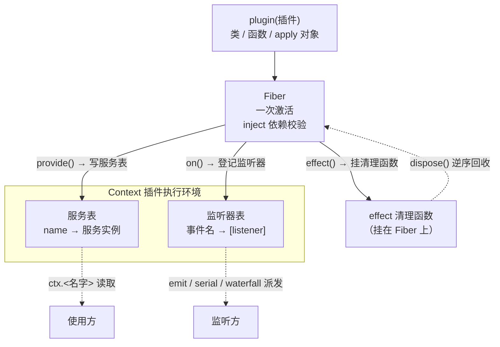

# 第 1 章 Cordis 容器内核（一切皆插件）

> 堂前不问来处，进门皆是插件。

## 本章回答的问题

- 一个插件容器如何装配？——上下文、服务、可逆注册、事件派发这四件事，是如何被一个 `Context` 统一起来的？
- 什么是上下文（`Context`）与服务（`Service`）？能力如何从「全局变量」变成「注册进容器的服务」？
- 什么是可逆注册（`effect` / `Fiber`）？注册如何变得可撤销、可回滚？
- 什么是事件派发（`on` / `emit` / `serial` / `waterfall`）？服务之间如何不互相认识却仍能协作？

本书要交付的是一套用 **Cordis** 装配 AI agent 的 harness：`agent = model + harness`，model 提供推理能力，harness 提供把能力组织起来的框架。这个框架的地基，就是本章的主角——**Cordis 插件容器内核**。

Cordis 的世界观只有一句话，也是本章开篇的题记：**一切皆插件**。容器不关心装进来的是「模型适配器」「会话日志」还是「提示词模板」，它们统统被当成插件：注册进容器、声明依赖、可逆卸载、靠事件互相协作。

本章只搭容器，不写业务。跑起来长什么样？`ch01/code/hello.py` 只有 41 行，运行后输出三行：

```text
[event] hello, cordis
hello, cordis
dispose 之后：ctx.greeting 已被回滚
```

这三行对应容器的三条核心论断：**能力是服务**（不靠全局变量）、**注册是效应**（可以回滚）、**交互是事件**（调用方和监听器互不认识）。至于依赖从哪来——容器内核的完整实现位于 `vendor/cordis/src/`（原为 TypeScript 的 `@cordisjs/core`），本章在 `ch01/code/cordis.py` 里用纯 Python 复刻了它的最小集，符号与源码位置的一一对应见本章 §9「源码对照」。

本章只交付容器内核；把会话、提示词、对话循环装进这个容器、跑出「一条消息进、一条回复出」的闭环，是下一章《最小 agent-loop 闭环》的事。

## 1. 没有容器时的困境

在介绍 Cordis 之前，先看一个没有容器的多 agent 系统会坏成什么样。

### 1.1 可运行的反面例子：共享的全局消息列表

保存为 `ch01/code/bad_example.py`，`python3 bad_example.py` 直接运行（仅标准库）：

```python
"""第 1 章反面示例：没有容器时会发生什么。

两个 agent 共享一个全局消息列表、硬编码的"模型调用"，
彼此的对话历史互相污染。运行：python3 bad_example.py
"""
messages = []  # 全局消息列表：所有 agent 共享


def ask(agent, question):
    messages.append({"role": "user", "content": question})
    reply = f"{agent} 收到: " + "".join(m["content"] for m in messages)
    messages.append({"role": "assistant", "content": reply})
    print(f"[{agent}] {reply}")


ask("客服 agent", "怎么改签车票？")
ask("导购 agent", "推荐一款机械键盘")
```

实际输出：

```text
[客服 agent] 客服 agent 收到: 怎么改签车票？
[导购 agent] 导购 agent 收到: 怎么改签车票？客服 agent 收到: 怎么改签车票？推荐一款机械键盘
```

第二行就是事故现场：导购 agent「收到」的内容里，混进了客服 agent 的问题和回复——全局列表被所有 agent 共享，谁写入都会污染所有人。

### 1.2 问题的根源：能力、依赖、生命周期、协作都无人管理

这个例子只有十几行，却暴露了没有容器时必然出现的三个问题；而第四个问题，会在我们试图解决前三个时浮现出来：

1. **能力是全局变量**。`messages` 挂在全局，谁都能写、谁都不负责。真实系统里，模型适配器、会话日志、提示词模板都会变成这样的模块级单例——谁提供、谁消费、何时清理，全靠默契。
2. **依赖不可见**。`ask` 隐式依赖 `messages`，但这条依赖没有出现在任何声明里；依赖缺失或顺序颠倒，只能等运行时报错才知道。
3. **没有生命周期**。想「干净地卸载一个 agent」时无从下手——全局状态还在，谁也说不清哪些资源该回收。
4. **服务要协作**（这是把前三个问题解决后才浮现的新问题）。一旦能力不再挂在全局、而是变成彼此隔离的**服务**，服务之间又要互相调用——如果直接互调，就重新引入了「谁认识谁」的耦合。

本章顺着这条问题链逐层求解，每一步都对应容器的一组机制：

| 问题 | 机制 | 一句话 |
|------|------|--------|
| ① 能力是全局变量 | `Context` + `Service` | 能力变成注册进容器的服务（§4） |
| ② 依赖不可见 | `plugin` + `inject` | 依赖变成声明，加载期校验（§5） |
| ③ 没有生命周期 | `effect` + `Fiber` | 注册变成可逆效应，LIFO 回收（§6） |
| ④ 服务要协作 | `on`/`emit`/`serial`/`waterfall` | 一切交互皆事件（§7） |

在逐条拆解之前，先看装上容器后的最小闭环长什么样（§2），再给一张容器结构总览图（§3）。

## 2. 最小可运行闭环：hello.py（先给最简示例）

在逐段拆解机制之前，先立三条论断，再用一个最小例子验证它们。

### 2.1 三条论断

Cordis 的世界观可以浓缩为三条论断：

**论断一：一切能力都是服务。** 模型调用、会话存储、提示词组装——全部是注册在容器上的服务，通过 `ctx.<name>` 读取。没有模块级单例，没有全局状态。

**论断二：一切注册都是插件。** 服务不是直接 `new` 出来就完事，而是通过插件注册到容器。插件有三种形态（函数 / 类 / apply 对象），容器统一加载。注册动作本身是「效应」：可追踪、可回滚。

**论断三：一切交互都是事件。** 服务之间不直接互相调用，而是通过事件通信。调用方只负责 `emit`，监听方只认事件名，谁都不需要知道对方是谁。

### 2.2 最小例子：一个文件装下三条论断

把 2.1 的三条论断压缩进一个文件。保存为 `ch01/code/hello.py`；`cordis.py` 是本章实现的教学版容器，已在同目录就位，`python3 hello.py` 直接可跑（实现见 §4–§7 逐段拆解）：

```python
"""第 1 章 §2.2 最小例子：一个文件装下三条论断。

运行：python3 hello.py（与 cordis.py 同目录，仅标准库）。
"""
from cordis import Context, Service, ServiceNotFoundError

ctx = Context()  # 创建容器：内部有一张服务表和一张监听器表，后面的能力都注册到这里

# 为 "greet" 事件登记一个监听器：此后任何人 emit("greet", name)，这个 lambda 都会被调用。
# 监听器只认事件名，不知道是谁在 emit。
ctx.on("greet", lambda name: print(f"[event] hello, {name}"))


# 定义一个能力 Greeter：提供 greet 方法，打招呼并发出一个事件。
class Greeter(Service):
    def __init__(self, ctx, config=None):
        # 构造即注册：Service.__init__ 内部调 ctx.provide("greeting", self)，
        # 把这个实例写进服务表，此后 ctx.greeting 就指向它。
        super().__init__(ctx, "greeting")

    def greet(self, name):
        # 发出事件：容器会依次调用所有登记在 "greet" 上的监听器。
        # greet 不知道谁在监听——调用方和监听器只认事件名，互不认识（论断三）。
        self.ctx.emit("greet", name)
        return f"hello, {name}"


# 把 Greeter 作为插件注册进容器：容器负责实例化 Greeter(ctx, config)，
# 并把这次登记记为一笔「效应」——卸载时可以回滚（论断二）。
ctx.plugin(Greeter)

# 使用能力：按名字 "greeting" 从服务表里查出服务，调用它的 greet 方法，
# 全程没有全局变量（论断一）。
print(ctx.greeting.greet("cordis"))

# 注册是效应：dispose 按注册逆序回滚，把服务从服务表移除。
ctx.dispose()
try:
    ctx.greeting  # 再读一次：服务已被回滚，抛 ServiceNotFoundError
except ServiceNotFoundError:
    print("dispose 之后：ctx.greeting 已被回滚")
```

运行输出：

```text
[event] hello, cordis
hello, cordis
dispose 之后：ctx.greeting 已被回滚
```

三行输出对应三条论断：

1. **一切能力皆服务**：第二行 `hello, cordis` 来自 `ctx.greeting.greet(...)`——能力挂在容器上，通过 `ctx.<名字>` 读取，全程没有全局变量，对照第 1 节的全局 `messages`。`ctx.greeting` 不是普通属性，而是 `__getattr__` 兜底把属性名当服务名去服务表里查（见 §4）；读未提供或已回滚的服务抛 `ServiceNotFoundError`（继承 `AttributeError`，`getattr(ctx, name, default)` 仍可用）——「缺失」显式暴露。
2. **一切注册皆插件化**：`Greeter` 不是直接赋值给容器，而是通过 `ctx.plugin(...)` 注册；注册动作本身是效应——`dispose()` 时容器按注册逆序把服务从服务表移除。第三行输出就是证据。
3. **一切交互皆事件化**：第一行 `[event] hello, cordis` 由文件开头的 lambda 打印，但它不是被直接调用的，而是被 `greet` 内部的 `emit("greet", ...)` 触发——发出方（`Greeter.greet`）与监听者（lambda）互不引用，只靠事件名 `"greet"` 衔接；把监听器换成写日志、发通知，`greet` 一行都不用改。

再补两句新手容易踩的：注册一律走显式 `provide()`（`Service` 的构造器内部就是这么做的）——`ctx.greeting = ...` 只是普通属性赋值，不会进服务表（见 §4 教学决策 G6）；服务可以是任何对象——真实系统里模型适配器、会话存储、agent-loop 都同样注册。

以上每个机制都在 §4–§7 逐段拆解。

## 3. 容器结构总览（关系总览先行）

在逐段拆解之前，先用一张图建立整体视角：容器内部只有**一张服务表**和**一张监听器表**，以及一叠记录生命周期的 **Fiber**。插件通过 Fiber 写入服务、登记监听、挂清理函数；使用方读服务表，监听方收事件，`dispose()` 时按 Fiber 逆序回收。



三个子系统对应第 1 节的三个问题（§4–§7 逐个拆解）：

- **服务表**（§4）：解决「能力是全局变量」——能力被 `provide()` 收编进服务表，`ctx.<名字>` 读取，没有全局单例。
- **Fiber 栈**（§5、§6）：解决「依赖不可见」与「没有生命周期」——每次 `plugin()` 产生一个 Fiber，声明 `inject` 依赖（§5），把 `effect()` 的清理函数挂在 Fiber 上，`dispose()` 逆序回收（§6）。
- **监听器表 + 派发**（§7）：解决「服务要协作」——`on()` 登记监听，`emit/serial/waterfall` 派发，服务之间只认事件名。

拆解顺序即这张图从下往上：先立 `Context` 与服务表（§4），再看插件如何带着 `inject` 进来（§5）、如何带 `effect` 离开（§6），最后看它们如何靠事件协作（§7）。

## 4. Context + Service

第 1 节的 `messages` 挂在全局、谁都能写。Cordis 的解法：把能力收编为注册在 `Context` 上的**服务**，谁提供、谁消费、何时移除，都由容器管理。

### 4.1 Context：一张服务表 + 一个 __getattr__

```python
# cordis.py —— Context 的构造与服务解析（节选）
class Context:
    def __init__(self):
        setattr(self, Symbols.services, {})    # 服务表：name → 实例
        setattr(self, Symbols.events, {})      # 监听器表：事件名 → [listener]
        setattr(self, Symbols.dispose, False)  # dispose 标记
        self._fibers = []      # 全部 fiber（按注册顺序）
        self._pending = []     # 依赖未满足、等待加载的 fiber
        self._disposers = []   # 根级 effect 的清理函数

    def __getattr__(self, name):
        """普通属性查找失败时才调用：一切非内部属性都按服务读取。

        对应 Proxy get 陷阱路由到 ReflectService.get（reflect.ts:133/136）。
        """
        if name.startswith("_"):
            raise AttributeError(name)
        services = getattr(self, Symbols.services)
        if name in services:
            return services[name]
        raise ServiceNotFoundError(name)

    def provide(self, name, value):
        """注册服务，返回「注销」disposer（reflect.ts:237-243）。

        注册后触发 service/provide，并结算等待依赖的 fiber。
        """
        services = getattr(self, Symbols.services)
        services[name] = value
        self.emit("service/provide", {"name": name})
        self._settle_pending()

        def dispose():
            if services.get(name) is value:
                del services[name]
                self.emit("service/dispose", {"name": name})

        return dispose
```

`Symbols.services`、`Symbols.events` 等键名来自 `cordis.py` 顶部的 `Symbols` 类：一组双下划线字符串常量（`Symbols.services` 就是 `"__cordis_services__"`），对应源码的 `Symbol.for('cordis.*')`（vendor/cordis/src/utils.ts:50-73；全仓无 symbols.ts），用作容器内部字段的键名。

Context 的全部机制都建立在两张表上：服务表（name → 实例）与监听器表（事件名 → listener 列表）。`__getattr__` 是 Python 的属性访问兜底方法——常规查找失败才调用——它把失败的属性名当服务名查表；`_` 开头的内部字段不走服务表，避免误伤。`provide` 把 `value` 写进服务表，返回一个能把它删掉的 `dispose` 闭包，并派发 `service/provide` 事件、结算等待依赖的插件（见 §5）。

为什么这样设计：

- **`__getattr__` 而非 `__setattr__`**：`__getattr__` 只在属性缺失时触发，内部字段（`_fibers` 等）不受影响；`__setattr__` 会拦截一切赋值，容易误伤。[教学决策 G6] TS 的 Proxy 同时拦截 get/set；Python 只拦截缺失读取，因此服务注册一律走显式 `provide()`。
- **`ServiceNotFoundError` 继承 `AttributeError`**：`getattr(ctx, name, default)` 的缺省值写法仍然可用。[教学决策 G1] 素材未给定错误类型，此为教学选择。
- **同名 `provide` 静默覆盖**：`services[name] = value` 直接替换旧实例（`cordis.py:92`），不报错——教学版从简，服务的替换时机由调用方自己把握。

### 4.2 Service：构造即注册

```python
# cordis.py —— Service 基类
class Service:
    """服务基类：构造即注册。

    对应 vendor/cordis/src/service.ts:11：构造器 :42-59 调 ctx.reflect.provide（:57）把实例挂到 ctx.<key>
    （r7 裁定，notes §13 D3）。
    教学版用 ctx.effect 显式表达「卸载即移除」——注册本身就是可逆效应。
    """

    def __init__(self, ctx, name=None):
        self.ctx = ctx
        self.service_name = name
        if name is not None:
            dispose = ctx.provide(name, self)
            ctx.effect(lambda: dispose, label=f"service:{name}")
```

`Greeter(ctx, "greeting")` 一行就完成了「构造 + 注册 + 卸载登记」三件事。注册不是赋值，而是一个效应：容器销毁时，`ctx.effect` 登记的清理函数会把服务从服务表移除（`effect` 的完整机制见 §6）。

**回溯**：这一节解决了问题 ①——能力从全局变量变成了注册进容器的服务，谁提供、谁消费、何时移除都由 `Context` 管理。但 `Greeter` 的依赖关系仍是隐式的：它需要什么服务、依赖是否就绪，只能靠读代码去猜。这正是问题 ②，由下一节的 `plugin` + `inject` 解决。

### 4.3 源码对照

- `Context` `vendor/cordis/src/context.ts:42`
- 属性读取：TS 用 Proxy get 陷阱路由到服务表（`context.ts:16/:42` → `reflect.ts:133`）；Python 用 `__getattr__` 兜底
- `provide` 返回注销 disposer：`reflect.ts:237-243`
- `Service` `vendor/cordis/src/service.ts:11`；构造器 `:42-59`，注册语句 ctx.reflect.provide `:57`（r7 裁定，notes §13 D3）

## 5. plugin + inject

第 1 节的 `ask` 隐式依赖全局 `messages`，这条依赖不写在任何声明里。Cordis 的解法：依赖变成插件上的 `inject` 声明，容器在加载期校验——声明不满足就不加载。

### 5.1 插件三形态：归一化为「接收 ctx 的函数」

```python
# cordis.py —— Context.plugin 与 Fiber 的三形态归一化（节选）
    def plugin(self, callback, config=None):
        """注册插件：函数 / 类 / apply 对象三形态在此归一化，返回本次激活的 Fiber。

        对应 RegistryService（registry.ts:195）plugin 方法（:316）。
        """
        return Fiber(self, callback, config)


class Fiber:
    def __init__(self, ctx, callback, config=None):
        self.ctx = ctx
        self.config = config
        self.state = self.PENDING
        self.disposers = []
        self.inject = list(getattr(callback, "inject", None) or [])
        self._body = self._normalize(callback, config)
        ctx._fibers.append(self)
        if self.deps_satisfied():  # 满足才加载（fiber.ts:249-251）
            self.activate()
        else:
            ctx._pending.append(self)

    @staticmethod
    def _normalize(callback, config):
        """三形态归一：

        类 → 实例化 cls(ctx, config)；apply 对象 → 取其 apply(ctx)；函数 → 原样调用 fn(ctx)。
        """
        if isinstance(callback, type):
            return lambda ctx: callback(ctx, config)
        apply_ = getattr(callback, "apply", None)
        if callable(apply_):
            return lambda ctx: apply_(ctx)
        return callback
```

插件有三种形态：函数、类、带 `apply` 方法的对象。`ctx.plugin()` 把它们归一化为「接收 ctx 的函数」，然后创建 Fiber——插件的一次激活。Fiber 是 effect 的宿主：插件体执行期间注册的所有 effect，清理函数都收集在这个 Fiber 上（见 §6）。

### 5.2 inject：依赖声明与「满足才加载」

```python
# cordis.py —— Fiber 的依赖检查与激活（节选）
# [教学简化] 真实 cordis 用 AsyncLocalStorage 找到宿主 fiber；
# 教学版同步单线程，用模块级变量标记「当前正在激活的 fiber」即可。
_current_fiber: "Fiber | None" = None


class Fiber:
    def deps_satisfied(self):
        """inject「满足才加载」检查：声明的服务全部已提供才加载。

        events 是容器内置能力，不计入外部依赖。
        """
        services = getattr(self.ctx, Symbols.services)
        return all(name in services for name in self.inject if name != "events")

    def activate(self):
        """执行插件体；执行期间的宿主 fiber 指向 self（effect 的收集目标）。"""
        global _current_fiber
        self.state = self.ACTIVE
        parent = _current_fiber
        _current_fiber = self
        try:
            self._body(self.ctx)
        finally:
            _current_fiber = parent
```

插件通过在类上声明 `inject = ['logger']` 来表达「我需要 `logger` 这个服务」。`Fiber.__init__` 用 `getattr(callback, 'inject', None)` 读出这份声明；`deps_satisfied` 检查这些名字是否都已出现在服务表里——`events` 是容器内置能力，不计入外部依赖。依赖满足，立即 `activate()`；不满足，挂进 `ctx._pending`，等每次 `provide` 后由 `_settle_pending` 逐个复查，满足才激活（这个复查逻辑已在 §4.1 的 `provide` 里见过）。

`inject` 的语义是「**满足才加载**」，不是「注入到构造函数参数里」：依赖是显式声明、加载期校验的，谁依赖谁不再靠人脑记忆。教学版以模块级全局变量 `_current_fiber` 替代真实 cordis 的 `AsyncLocalStorage`，边界是同一时刻只加载一个插件。

**回溯**：这一节解决了问题 ②——依赖从隐式变成了 `inject` 声明，容器在加载期校验。但「注册」本身还不能撤销：插件加载后如何干净卸载、资源如何回收，尚无答案。这正是问题 ③，由下一节的 `effect` + `Fiber` 解决。

### 5.3 源码对照

- `ctx.plugin` → `RegistryService`（`vendor/cordis/src/registry.ts:195`）的 plugin 方法 `:316`；三形态归一 `:92/:121/:126/:131`，normalize `:71-79`
- `Fiber` `vendor/cordis/src/fiber.ts:184`；满足才加载 `:249-251`；依赖变化重载 `_unload/_reload` `:588-609/:646-696`（G8：本章只实现「满足才加载」，不实现「变化即重载」）

## 6. effect + Fiber

第 1 节里「干净卸载一个 agent」无从下手。Cordis 的解法：注册动作本身变成一笔**效应**，卸载时按注册逆序逐一回收。

### 6.1 effect：立即执行，逆序回收

```python
# cordis.py —— Context 的 effect 注册与 dispose 逆序（节选）
    def effect(self, execute, label="anonymous"):
        """注册 effect：立即执行 execute，收集其返回的清理函数。

        清理函数在卸载时逆序执行（fiber.ts:415/418/431）——后注册的先清理。
        label 参数对齐真实 API，教学版不消费它。
        """
        disposer = execute()
        if disposer is None:
            disposer = lambda: None  # noqa: E731  无清理函数时用 no-op 占位
        if _current_fiber is not None:
            _current_fiber.disposers.append(disposer)
        else:
            self._disposers.append(disposer)
        return disposer

    def dispose(self):
        """销毁容器：按注册逆序卸载全部 fiber，再逆序执行根级 effect。

        [教学简化] 真实代码 dispose 异步且带 settle 超时。
        """
        if getattr(self, Symbols.dispose):
            return
        setattr(self, Symbols.dispose, True)
        for fiber in reversed(self._fibers):
            fiber.dispose()
        for disposer in reversed(self._disposers):
            disposer()


class Fiber:
    def dispose(self):
        """卸载：逆序执行清理函数（fiber.ts:431）。"""
        if self.state == self.DISPOSED:
            return
        for disposer in reversed(self.disposers):
            disposer()
        self.disposers.clear()
        self.state = self.DISPOSED
```

effect 的契约：`execute()` 立即执行，返回清理函数；清理函数在卸载时**逆序**执行——后注册的先清理。这就是「注册即生效、卸载即回收」的生命周期：没有永远清不掉的全局状态，因为每笔注册都自带一笔可逆的清理。

### 6.2 宿主之分：Fiber 级 vs 容器级

effect 有宿主之分：插件体执行期间注册的 effect 挂在当前 Fiber 上（随 Fiber 卸载）；容器顶层注册的挂在 `ctx._disposers`（随 `ctx.dispose()` 清理）。

回到 §2 的 `hello.py`，正好能验证这条 LIFO 链：

1. `ctx.on("greet", ...)` 在容器顶层执行，内部走 `self.effect(setup, ...)`——此时没有 Fiber 在激活，清理函数挂到 `ctx._disposers`。
2. `ctx.plugin(Greeter)` 创建一个 Fiber 并 `activate()`；`Greeter.__init__` 里 `super().__init__(ctx, "greeting")` 调 `ctx.provide(...)` 再 `ctx.effect(lambda: dispose, ...)`——此时 `_current_fiber` 指向 Greeter 的 Fiber，清理函数挂到 `fiber.disposers`。
3. `ctx.dispose()` 先 `reversed(self._fibers)` 卸载 Greeter 的 Fiber（把 `"greeting"` 从服务表移除），再 `reversed(self._disposers)` 注销 `"greet"` 监听器。

所以第三行输出 `dispose 之后：ctx.greeting 已被回滚`，正是 §6.2 的 Fiber 级清理函数（`provide` 返回的 `dispose`）在 `fiber.dispose()` 里被逆序执行的证据。

**回溯**：这一节解决了问题 ③——注册变成可逆效应，`dispose()` 按注册逆序回收。但能力收编成彼此隔离的服务后，服务之间要协作，直接互调又会让耦合卷土重来。这正是问题 ④，由下一节的事件派发解决。

### 6.3 源码对照

- `effect` `vendor/cordis/src/context.ts:231-234`
- 清理函数逆序执行：`fiber.ts:415/:418/:431`
- dispose 异步且带 settle 超时（教学版同步简化；异步细节行号待后续章节素材补充）

## 7. on / emit / serial / waterfall

能力收编成服务之后，服务之间总要协作。如果 `Greeter` 直接 import `Logger` 再调用，就重新引入了「谁认识谁」的耦合。Cordis 的解法：一切交互都走事件，调用方只 `emit`，监听方只认事件名。

### 7.1 四种派发

```python
# cordis.py —— Context 的四种派发（节选）
    def on(self, event, listener):
        """注册监听器，返回 off disposer（events.ts:288-302；r7 裁定）。

        注册本身是 effect：宿主 fiber 卸载时自动注销（events.ts:254 register → fiber.effect）。
        """
        listeners = getattr(self, Symbols.events).setdefault(event, [])

        def setup():
            listeners.append(listener)

            def off():
                if listener in listeners:
                    listeners.remove(listener)

            return off

        return self.effect(setup, label=f"on:{event}")

    def emit(self, event, *args):
        """同步派发：按注册顺序调用，不等返回值（events.ts:194；r7 裁定，:183 是 parallel）。"""
        for listener in list(getattr(self, Symbols.events).get(event, [])):
            listener(*args)

    def serial(self, event, *args):
        """[教学简化] 简化 serial（约 5 行）：顺序调用，遇 bail 值立即返回。

        真实 serial 顺序 await（events.ts:204-209）；bail 判定：非 None 且非 False
        （isBailed，events.ts:13）。本章用于 turn-stopping agent/turn-stopping（agent.ts:296）。
        """
        for listener in list(getattr(self, Symbols.events).get(event, [])):
            result = listener(*args)
            if result is not None and result is not False:
                return result
        return None

    def waterfall(self, event, value):
        """[教学简化] 简化 waterfall：把返回值穿下去，返回 None 视为放行。

        真实 waterfall 是中间件式：监听器包裹 next 续体、最外层优先（events.ts:234）。
        [教学决策 G4] 无监听器时原样返回初始 value。
        """
        for listener in list(getattr(self, Symbols.events).get(event, [])):
            result = listener(value)
            if result is not None:
                value = result
        return value
```

四种派发的分工：

| API | 语义 | 本章用例 |
|-----|------|---------|
| `on` | 注册监听器（本身是 effect，随宿主卸载） | hello.py 里 `ctx.on("greet", ...)` 注册打印器 |
| `emit` | 同步广播，不等返回值 | hello.py 里 `greet` 内部的 `emit("greet", name)` |
| `serial` | 顺序询问，遇 bail 值（非 None 且非 False）立即返回 | 教学版实现；真实用例 turn-stopping 属第 2 章 |
| `waterfall` | 把值逐个穿给监听器加工，返回最终值 | 教学版实现；真实用例 pre-step 提示词组装属第 2 章 |

两个「教学简化」派的语义，用一句话说清：

- `serial` 像逐个敲门问「谁能处理这件事」，第一个返回非 `None` 且非 `False` 的监听器作数，后面的不再问——用于「谁先给出答复就采用谁」的仲裁场景。
- `waterfall` 像一条流水线，每个监听器对同一个值加工，前一个的返回值交给下一个，最后返回最终值——用于「多个模块依次补全同一个对象」的场景。

注意 `on` 的注册本身是 effect：监听器随宿主 Fiber 卸载而自动注销——事件订阅也有生命周期（这正是 §6 机制在事件侧的复用）。

**回溯**：这一节解决了问题 ④——协作走事件、服务只认事件名。至此四条问题全部闭合：能力是服务、依赖是声明、注册是效应、协作是事件，容器内核的五段机制（§4–§7）共同兑现了「一切皆插件」的开篇题记。

### 7.2 源码对照

- `on` `vendor/cordis/src/events.ts:288-302`、`emit` `:194`、`serial` `:204-209`、`waterfall` `:234`（已与源码核对：emit 的 `:183` 实为 parallel）
- bail 判定 `isBailed`：非 None 且非 False（`events.ts:13`）
- [教学决策 G3] emit 无监听器是 no-op；[教学决策 G4] waterfall 无监听器原样返回初始 value

## 8. 完整运行输出

在 `ch01/code/` 下运行（`python3 hello.py`，仅标准库），完整输出如下：

```text
[event] hello, cordis
hello, cordis
dispose 之后：ctx.greeting 已被回滚
```

逐行对照三条论断：

1. `[event] hello, cordis`——事件派发（§7）。它由文件开头的 `lambda` 打印，但那个 `lambda` 从没被直接调用：是 `greet` 内部的 `self.ctx.emit("greet", name)` 触发的。发出方与监听者互不引用，只靠事件名 `"greet"` 衔接（论断三）。
2. `hello, cordis`——服务读取（§4）。它是 `print(ctx.greeting.greet("cordis"))` 的返回值：`ctx.greeting` 走 `__getattr__` 查服务表拿到 `Greeter` 实例，再调 `greet`。全程没有全局变量（论断一）。
3. `dispose 之后：ctx.greeting 已被回滚`——生命周期（§6）。`ctx.dispose()` 逆序卸载 Fiber，把 `"greeting"` 从服务表移除；再次读 `ctx.greeting` 抛 `ServiceNotFoundError`，被 `except` 捕获后打印。注册是可逆的（论断二）。

对照反面例子：`bad_example.py` 的两行输出见 §1，第二行里导购 agent「收到」的内容混进了客服 agent 的问题与回复——那正是没有容器时全局状态互相污染的现场；装上容器后，能力、依赖、生命周期、协作各自有了落点，输出里每一行都能对应到一个机制。

## 9. 源码对照

本章教学版 `cordis.py` 与真实源码（`vendor/cordis/src/`，原为 TypeScript 的 `@cordisjs/core`）的对应关系：

| 容器机制 | 源码位置（vendor/cordis/src/） | 教学版差异概括 |
|------|------|------|
| `Context` | `context.ts:42`（接口 `:16`；Proxy get 陷阱 → `reflect.ts:133`） | TS Proxy 同时拦截 get/set → Python `__getattr__` 只拦截缺失读取，注册走显式 `provide()`（G6） |
| `Service` | `service.ts:11`（构造器 `:42-59`，注册 `ctx.reflect.provide` `:57`） | 用 `ctx.effect` 显式表达「卸载即移除」——注册本身是可逆效应（r7 裁定，notes §13 D3） |
| `Fiber` | `fiber.ts:184` | 六态（PENDING/LOADING/ACTIVE/FAILED/DISPOSED/UNLOADING）→ 三态；只实现「满足才加载」，不实现「变化即重载」（G8） |
| `Context.plugin` | `RegistryService`（`registry.ts:195`）plugin 方法（`:316`） | 三形态归一逻辑保持一致 |
| `effect` | `context.ts:231-234`（逆序回收 `fiber.ts:415/418/431`） | dispose 异步 + settle 超时 → 同步 |
| `on`/`emit`/`serial`/`waterfall` | `events.ts:288-302` / `:194` / `:204-209` / `:234` | serial/waterfall 教学简化；emit 同步不等返回值（r7 裁定，`:183` 实为 parallel） |

两点补充：

- **符号映射**：`Symbol.for('cordis:*')`（`utils.ts:50-73`，全仓无独立 symbols.ts）→ 教学版双下划线字符串常量（`Symbols.services` 即 `"__cordis_services__"`）。完整 TS→Python 映射见 notes §6。
- **教学取舍**：`AsyncLocalStorage` 找宿主 fiber → 模块级变量 `_current_fiber`（同步单线程，同一时刻只加载一个插件）；`ServiceNotFoundError` 继承 `AttributeError`（G1）以保留 `getattr(ctx, name, default)` 缺省写法；emit 无监听器为 no-op（G3）、waterfall 无监听器原样返回（G4）。

## 10. 小结与预告

本章交付了容器内核的五个机制，全部建立在 `Context` 的两张表（服务表 + 监听器表）之上：

| 机制 | 一句话 | 源码位置 |
|------|--------|---------|
| `Context` | 服务表 + 监听器表，`__getattr__` 兜底读服务 | `context.ts:42` |
| `Service` | 构造即注册，注销是一个 effect | `service.ts:11` |
| `plugin` + `inject` | 三形态归一化；依赖「满足才加载」 | `registry.ts:195/:316`、`fiber.ts:184` |
| `effect` + `Fiber` | 注册即执行，LIFO 逆序回收 | `context.ts:231-234` |
| `on`/`emit`/`serial`/`waterfall` | 注册本身是 effect；四种派发各司其职 | `events.ts:288/:194/:204/:234` |

问题链至此闭合：能力从全局变量变成了服务（§4），依赖从隐式变成了声明（§5），注册从「无法撤销」变成了可逆效应（§6），协作从「直接互调」变成了事件（§7）。五段源码加起来约百行，却构成了一切插件系统的最小骨架。

下一章《最小 agent-loop 闭环》，我们把 `Session`（会话历史）、`SystemPromptService`（提示词组装）、`AgentLoop`（对话循环）作为三个插件装进本章的容器，跑出「一条消息进、一条回复出」的闭环。到那时，`serial` 的 turn-stopping、`waterfall` 的 pre-step 这些本章只讲语义的派发，会第一次真正派上用场。

## 11. 附录：关键概念速查表

### 11.1 概念速查（按依赖分层）

| 层 | 概念 | 作用 | 关键点 |
|----|------|------|--------|
| 0 | `harness` | agent 的框架层 | `agent = model + harness`，容器是 harness 的地基 |
| 1 | `Context` | 插件执行环境 | 持有服务表 + 监听器表；`__getattr__` 把缺失属性当服务名查表 |
| 1 | `Service` | 服务基类 | 构造即注册（`provide` + `effect`）；`ctx.<名字>` 读取 |
| 1 | `plugin` | 注册插件入口 | 函数 / 类 / apply 对象三形态归一化，返回 Fiber |
| 1 | `inject` | 依赖声明 | 类属性声明依赖服务；「满足才加载」，不满足挂 `_pending` |
| 2 | `Fiber` | 插件的一次激活 | effect 的宿主；持有 `disposers`，卸载时逆序回收 |
| 2 | `effect` | 可逆注册 | 立即执行、返回清理函数；LIFO 回收 |
| 2 | `provide` | 注册服务 | 写服务表、触发 `service/provide`、返回注销 disposer |
| 2 | `on`/`emit`/`serial`/`waterfall` | 事件派发四件套 | 广播 / 仲裁（遇 bail 即止）/ 流水线（值逐个加工）；注册本身是 effect |
| 2 | `ServiceNotFoundError` | 缺失显式暴露 | 继承 `AttributeError`，保留 `getattr(ctx, name, default)` 用法 |

### 11.2 符号映射（教学版 → 源码）

| 教学版符号 | 源码位置（vendor/cordis/src/） |
|-----------|------|
| `Context` | `context.ts:42` |
| `Service` | `service.ts:11` |
| `Fiber` | `fiber.ts:184` |
| `Context.plugin` | `registry.ts:195`（plugin `:316`） |
| `Context.effect` | `context.ts:231-234` |
| `Context.provide` | `reflect.ts:237-243` |
| `on`/`emit`/`serial`/`waterfall` | `events.ts:288-302` / `:194` / `:204-209` / `:234` |
| `Symbols.services` 等 | `Symbol.for('cordis.*')`，`utils.ts:50-73` |
