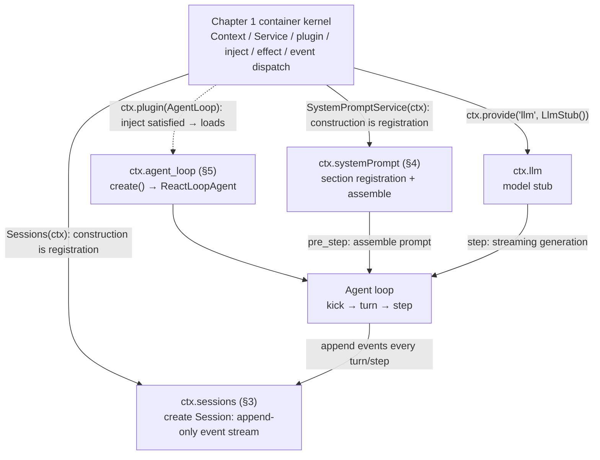
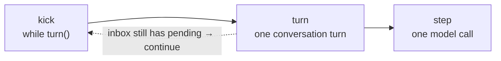
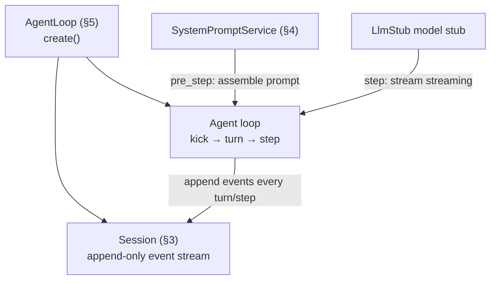
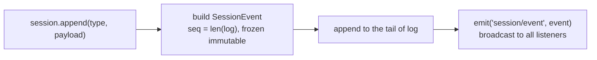
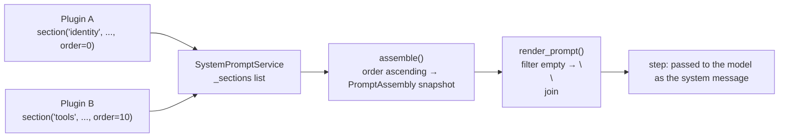
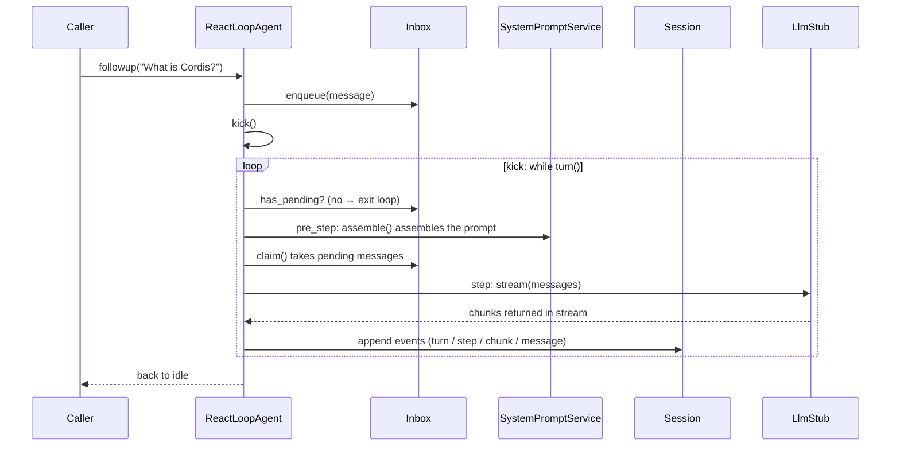

# Chapter 2: The Minimal agent-loop Closed Loop (One Message In, One Reply Out)

> One word comes in, one word goes out; the loop turns on its own, turn after turn.

## Questions this chapter answers

- Where does an agent's conversation state live, and how do we guarantee it is the single source of truth?
- When calling the model, where does the system prompt come from, and how can third parties inject content into it?
- Who drives the conversation loop: after a message goes in, who pushes it forward, and how does the reply come out?
- How is an agent "assembled" by Chapter 1's container?

Chapter 1 delivered the container kernel: `Context` holds two tables (service table + listener table), `Service` registers on construction, `plugin` + `inject` make plugins "load only when dependencies are satisfied", `effect` + `Fiber` make registration a reversible effect, and the four dispatch methods `on`/`emit`/`serial`/`waterfall` carry collaboration. But the container is only a skeleton; by itself it does not answer "how does an agent hold a conversation".

This chapter installs three services as plugins into this skeleton: `Sessions` (conversation state), `SystemPromptService` (prompt assembly), `AgentLoop` (conversation loop). At the end of Chapter 1 we said that `serial`'s turn-stopping and `waterfall`'s pre-step were at that time "semantics only"; in this chapter they finally get put to real use for the first time (appearing in §5.4 and §5.5 respectively).

Code relationships: this chapter incrementally reuses Chapter 1's `ch01/code/cordis.py` (`main.py` imports only `Context` from it, `agent_loop.py` imports only `Service`; not re-pasted), and adds two new files under `ch02/code/`: `agent_loop.py` (teaching-version agent-loop) and `main.py` (runnable assembly entry point). Running `python3 ch02/code/main.py` shows the complete closed loop of "one message in, one reply out"; the full output is in §6.

## 1. Scattered Messages, Hard-Coded Prompts, and a Loop Nobody Drives

Without any framework, hand-writing a "conversable agent" hits a wall within three steps.

**Wall 1: conversation state has no single source of truth.** The most intuitive way to write it is to hang history on a function-local variable:

```python
# Counterexample: conversation messages scattered across local variables
def chat(user_text):
    history = []  # Hang the conversation history inside the function; it vanishes when the call ends
    history.append({"role": "user", "content": user_text})
    reply = call_model(history)  # call_model is an illustrative pseudo-function
    history.append({"role": "assistant", "content": reply})
    return reply

# Want to replay this turn? Want to persist it to disk? history is scattered inside the function, nowhere to export from.
```

Once messages are scattered across local variables, global lists, or various callers, there is no single answer to "what actually happened in this turn", and replay and persistence are both out of the question.

**Wall 2: hard-coded system prompt.** To call the model you first need a system prompt; the most intuitive way to write it is to hard-code a string:

```python
# Counterexample: hard-coded system prompt
SYSTEM_PROMPT = "You are an assistant."  # Hard-coded at module top level

def build_prompt(user_text):
    # If a third party wants to add a "current time" or "tool description" segment, they have to come back and edit this concatenation line
    return SYSTEM_PROMPT + "\n" + user_text
```

A hard-coded prompt is not extensible: a third-party plugin can neither inject its own segment nor take the segment away when it unloads.

**Wall 3: nobody drives the loop.** State exists, prompt exists, but between "one message in, one reply out" there is still a long chain of actions: fetch messages, assemble prompt, call model, collect streaming chunks, assemble reply, write back to state, decide whether to continue — who is responsible for pushing it forward?

```python
# Counterexample: hand-written driving, every step scattered inside a while
while True:
    msg = wait_user_input()        # Who is responsible for receiving messages?
    prompt = build_prompt(msg)     # Who is responsible for assembling the prompt?
    chunks = model.stream(prompt)  # Who is responsible for collecting the stream?
    reply = "".join(chunks)        # Who is responsible for assembling the reply, writing back to state, deciding whether to continue?
```

So this chapter's problem chain is:

- **Problem ①**: an agent's conversation state must have a single source of truth (messages scattered everywhere, replay/persistence out of the question) → mechanism: `Session` (append-only event stream), solved in §3;
- **Problem ②**: when calling the model, where does the system prompt come from (hard-coding is not extensible, third parties cannot inject) → mechanism: `SystemPromptService` (section registration + assemble), solved in §4;
- **Problem ③**: who drives the conversation loop (message in, reply out, who pushes forward in between) → mechanism: `AgentLoop` + `ReactLoopAgent` + kick/turn/step, closed in §5.

## 2. Assembly Overview: Three Plugins Mounted into the Container

Before dissecting mechanism by mechanism, first build the overall view with three diagrams: **Figure 1** is the assembly overview, showing how the three plugins are mounted into Chapter 1's container and get the loop running; **Figure 2** zooms into the loop trunk itself; **Figure 3** shows the data flow between the loop and each collaborating module.

**Figure 1 · Assembly overview: three plugins mounted into Chapter 1's container**



Chapter 1's container kernel, through `provide` registering services and `inject` declaring dependencies, assembles three runtime services: `Sessions` and `SystemPromptService` register on construction as `Service` subclasses (Chapter 1 mechanism), `LlmStub` is a plain object, explicitly `provide`d, and `AgentLoop` declares `inject = ["sessions", "llm"]` and loads only after dependencies are satisfied. `AgentLoop.create()` builds the Session and this loop; once running, the loop fetches the prompt from `SystemPromptService` at `pre_step`, calls `LlmStub` for streaming generation at `step`, and appends every step as an event into the `Session`.

**Figure 2 · loop trunk: kick → turn → step**



The trunk is a three-stage loop: `kick` repeatedly drives `turn`, each `turn` calls `step` once (one model call); as long as the inbox still has unprocessed messages, `turn` returns "continue", and `kick` enters the next turn. This chapter has no tools, so one message runs only one turn.

**Figure 3 · loop and collaborating modules: how data flows**



The order of dissection follows dependencies from bottom to top: first look at `Session` (§3, where the loop writes state), then `SystemPromptService` (§4, where the loop fetches the prompt), and finally how `AgentLoop` wires the two together with the model stub into the kick → turn → step closed loop (§5).

## 3. Session: Append-Only Event Stream

### 3.1 Concept introduction: minimal example

What Problem ① asks for is "one single place to store conversation state". The minimal form is an append-only list:

```python
# Minimal example: append-only conversation log (self-contained, runnable)
log = []  # The single storage location for conversation state

def append(type_, payload):
    # Use the current log length as the sequence number: seq is naturally contiguous, no gaps
    event = {"seq": len(log), "type": type_, "payload": payload}
    log.append(event)  # Append only, never modify, never delete
    return event

append("user/message", {"text": "What is Cordis?"})
append("assistant/chunk", {"text": "Question received."})
print([e["seq"] for e in log])  # [0, 1]
print(log[0]["type"])           # user/message
```

This list is the minimal form of a **Session**. To generalize it into a framework mechanism, three things need to be added: event entries are immutable, sequence numbers have a contract, and every append is broadcast outward.

### 3.2 Internal implementation

Definition of **Session**: **an append-only event log, the single source of truth for an agent's conversation state.** Each record in the log is a **SessionEvent**, with four fields: `session_id` (which session it belongs to), `seq` (sequence number), `type` (event type), `payload` (the payload).

The complete sequence of actions for one `append`:



The diagram corresponds to the code line by line: first build the event entry with the current log length as the sequence number, append it to the tail of `log`, and finally broadcast the event through Chapter 1's `emit` — any plugin that wants to observe the session (logging, telemetry, persistence) only needs `on("session/event", ...)`, without intruding into Session itself.

Session has three iron rules:

1. **append-only**: append only, never modify, never delete. Want to "retract" a message? That too is appending a new retraction event; the history itself is untouched.
2. **seq == len(log)**: the sequence number is the log length before appending, naturally incrementing contiguously from 0, no gaps. In §6's output, `seq=0` through `seq=8` are all present without a single one missing, thanks to this contract.
3. **events are immutable**: `SessionEvent` uses `@dataclass(frozen=True)`; after creation no field can be changed — once written, frozen.

Session itself is not a service; it is created and looked up by **Sessions** (the session registry service, mounted at `ctx.sessions`): `create()` allocates an incrementing id like `session-0001` and registers it, `get()` retrieves by id. One container can have multiple mutually independent sessions, each with its own state.

### 3.3 Python reconstruction

The teaching version lands the above mechanisms on three symbols in `agent_loop.py`: `SessionEvent`, `Session`, `Sessions`.

```python
# ch02/code/agent_loop.py (new in this chapter; Service comes from Chapter 1's cordis.py)
# ---------- session: append-only event log ----------


@dataclass(frozen=True)
class SessionEvent:
    """append-only event entry, corresponds to SessionEvent (packages/core/session/src/types.ts:404).

    [Teaching simplification] Real events also carry timestamp and surface metadata; frozen corresponds to deepFreeze.
    """

    session_id: str
    seq: int
    type: str
    payload: dict


class Session:
    """append-only event log, corresponds to Session (packages/core/session/src/index.ts:425)."""

    def __init__(self, ctx, session_id):
        self.ctx = ctx
        self.id = session_id
        self.log: list[SessionEvent] = []

    def append(self, type, payload):
        """Append one event: seq == len(log) (index.ts:604-653), event immutable (deepFreeze, index.ts:627).

        [Teaching simplification] Omits JSON validation (inside append) and surface/surfaceOp (Chapter 10 mechanism, G9).
        """
        event = SessionEvent(self.id, len(self.log), type, payload)
        self.log.append(event)
        self.ctx.emit("session/event", event)
        return event


class Sessions(Service):
    """Session registry service ctx.sessions, corresponds to SessionStore (packages/core/session/src/index.ts:792).

    [Teaching simplification] The real version has two-phase prepare/commitPrepared creation and enter/announce registration; here we create directly.
    """

    def __init__(self, ctx, config=None):
        super().__init__(ctx, "sessions")
        self._sessions = {}
        self._next_id = 0

    def create(self):
        self._next_id += 1
        session = Session(self.ctx, f"session-{self._next_id:04d}")
        self._sessions[session.id] = session
        return session

    def get(self, session_id):
        return self._sessions.get(session_id)
```

`Sessions` inherits Chapter 1's `Service`; the single line `super().__init__(ctx, "sessions")` completes "construction is registration" — after `Sessions(ctx)` in `main.py`, it can be read via `ctx.sessions`.

### 3.4 Recap: state has a single source of truth; where does the prompt come from

Problem ① solved: conversation state converges to one place, `session.log`; replay is just re-reading the log, persistence is just writing the log to disk (the subject of Chapter 3). But one thing is still missing for the loop to run — when `step` calls the model it needs a system prompt; where does it come from? Hard-coding is not extensible (Problem ②); the next section solves it.

## 4. SystemPromptService: Section Registration + assemble

### 4.1 Concept introduction: minimal example

What Problem ② asks for is "don't hard-code the prompt; anyone can inject a segment". Minimal form: a public list of segments, registration records the order, assembly sorts and concatenates:

```python
# Minimal example: register prompt sections, then assemble in order (self-contained, runnable)
sections = []  # Public registry for prompt sections

def section(name, text, order=0):
    # Register one section: name identifies the source, order determines assembly order
    sections.append({"name": name, "order": order, "text": text})

def assemble():
    # Sort by order ascending, filter empty sections, join with blank lines
    ordered = sorted(sections, key=lambda s: s["order"])
    return "\n\n".join(s["text"] for s in ordered if s["text"])

section("identity", "You are a helpful assistant.", order=0)
section("time", "Current time: 2026-08-18.", order=10)
print(assemble())
```

Output:

```text
You are a helpful assistant.

Current time: 2026-08-18.
```

The two registrants don't know each other; each registers its own section, and the assembly result is determined by `order` — this is the minimal form of "third-party injectable".

### 4.2 Internal implementation

Definition of **SystemPromptService** (system prompt service, container service name `ctx.systemPrompt`): **the registration and assembly hub for the system prompt.** Three symbols revolve around it:

- **PromptSection** (prompt section): `name` (who registered it) + `order` (what position) + `text` (content);
- **PromptAssembly** (assembly snapshot): the finalized result of one `assemble()`, holding the sections list sorted by order — snapshot means subsequent `step`s only read, never modify;
- **render_prompt(assembly)**: renders the snapshot into a text block, filtering empty sections, joining with `\n\n`.

The full picture of registration and assembly:



The key mechanism is **`section()` registration is an effect**: the registration action is wrapped in Chapter 1's `ctx.effect`, setup adds the section to the list, teardown removes the section. Thus any plugin can inject its own prompt section, and when the plugin unloads the section is automatically taken away — prompt registration also has a lifecycle. This is exactly the answer to Problem ②: what a hard-coded string cannot do — "injectable, retractable" — is underwritten by the effect mechanism.

### 4.3 Python reconstruction

The teaching version corresponds to four symbols in `agent_loop.py`: `PromptSection`, `PromptAssembly`, `SystemPromptService`, `render_prompt`.

```python
# ch02/code/agent_loop.py (new in this chapter; Service/effect come from Chapter 1's cordis.py)
# ---------- system-prompt: sections assembly ----------


@dataclass
class PromptSection:
    """Prompt section, corresponds to PromptSection (packages/core/system-prompt/src/index.ts:53)."""

    name: str
    order: int
    text: str


@dataclass
class PromptAssembly:
    """Assembly snapshot, corresponds to PromptAssembly (packages/core/system-prompt/src/index.ts:115).

    [Teaching simplification] The real snapshot also contains variables/tools/contexts.
    """

    sections: list[PromptSection] = field(default_factory=list)


class SystemPromptService(Service):
    """Minimal version of ctx.systemPrompt, corresponds to the real project's SystemPromptService (packages/core/system-prompt/src/index.ts:338).

    [Teaching simplification] The real version has four kinds of registration: section/variable/tool/context; here only section is kept.
    """

    def __init__(self, ctx, config=None):
        super().__init__(ctx, "systemPrompt")
        self._sections: list[PromptSection] = []

    def section(self, name, text, order=0):
        """Register one section (index.ts:381). Registration is an effect: automatically removed on unload."""
        entry = PromptSection(name, order, text)

        def setup():
            self._sections.append(entry)
            return lambda: self._sections.remove(entry)

        return self.ctx.effect(setup, label=f"section:{name}")

    def assemble(self):
        """Assemble by order ascending, corresponds to assemble (index.ts:467).

        [Teaching simplification] The real version also dispatches waterfall('system-prompt/assemble') (:467) and merges variables/tools.
        """
        assembly = PromptAssembly()
        assembly.sections = sorted(self._sections, key=lambda s: s.order)
        return assembly


def render_prompt(assembly):
    """sections → filter empty → \\n\\n join, corresponds to renderPrompt (index.ts:212-217).

    [Teaching simplification] Omits {{variable}} interpolation.
    """
    return "\n\n".join(section.text for section in assembly.sections if section.text)
```

Paragraph 3 of `main.py` constructs `SystemPromptService(ctx)` and registers one `identity` section, then immediately `assemble()` + `render_prompt()` prints the assembly result — the "Assembly result" line in §6 output paragraph 3 is its product. The registration action itself is silent: `section()` goes through `ctx.effect(setup)`, setup executes immediately, appending the section to `_sections`, and returns the "remove on unload" cleanup function (Chapter 1 effect semantics).

### 4.4 Recap: the prompt is extensible now; who drives the loop

Problem ② solved: the prompt is no longer hard-coded; any plugin can inject sections via `section()`, automatically taken away on unload. Note that this chapter has two paths feeding context into `step`: `identity` goes through section registration (registered once, valid long-term, leaves with plugin unload), while paragraph 5 of `main.py` injects the time context via the `agent/pre-step` waterfall (computed fresh at every step) — how the two converge inside `step` is exactly the content of the next section. Now only Problem ③ remains: who drives the "message in, reply out" loop.

## 5. Closing the Assembly Loop: AgentLoop → ReactLoopAgent → kick/turn/step

The previous two sections built the event stream (§3) and prompt assembly (§4). This section assembles them with the model stub into a running agent-loop: first meet the model stub being called (§5.1), then see how the container assembles the `AgentLoop` service (§5.2), then dissect layer by layer the driver `ReactLoopAgent`'s kick (§5.3), turn (§5.4), pre_step (§5.5), step (§5.6), and finally overview one message's complete journey with a sequence diagram (§5.7).

### 5.1 LlmStub: the model stub

`step` ultimately calls the model. This chapter does not connect a real model; a streaming stub stands in — it works according to the real `LlmRuntime.stream` calling convention: receives `messages` and `system_prompt`, yields a series of chunks.

```python
# ch02/code/agent_loop.py (new in this chapter)
# ---------- llm stub: streaming service without a real model ----------


class LlmStub:
    """[Teaching simplification] Stub for the ctx.llm service: no real model needed.

    stream() is a generator, yielding 3 hard-coded text chunks + 1 finish,
    corresponding to LlmRuntime.stream (packages/llm/llm/src/index.ts:913 → streamWithRegistration :917) and the StreamChunk protocol (types.ts:291).
    [Teaching decision G7] The real version is an async stream; the teaching version uses a synchronous generator, mechanism semantics unchanged.
    """

    def stream(self, messages, system_prompt=None, **options):
        user_text = messages[-1]["content"] if messages else ""
        for piece in (
            f'Received the question "{user_text}". ',
            "This is a minimal closed loop: ",
            "chunks arrive one by one and are assembled into a complete reply.",
        ):
            yield {"type": "text-delta", "text": piece}
        yield {"type": "finish", "stop_reason": "end-turn"}
```

Note that `stream` is a generator: it first takes the text from the last entry of `messages` and echoes it into the first chunk (so in §6's output you can see 'Received the question "What is Cordis?".'), then yields two hard-coded text segments, and finally a `finish` chunk carrying `stop_reason="end-turn"` (the teaching version's `step` only consumes `text-delta`, skipping `finish` as-is). Paragraph 2 of `main.py` mounts it into the container with `ctx.provide("llm", LlmStub())` — it is a plain object, not a `Service` subclass, so it goes through explicit `provide` (one of Chapter 1's two registration methods).

The chunks ultimately need to be assembled into one complete assistant message, relying on the module-level function `create_assistant_message`:

```python
# ch02/code/agent_loop.py (new in this chapter)
# ---------- assistant message: the endpoint of chunk assembly ----------


def create_assistant_message(text, source_event_seqs):
    """Streaming text → immutable assistant message, corresponds to createAssistantMessage (packages/llm/llm/src/message.ts:206-217).

    [Teaching simplification] The real version receives ContentBlock[] and source; here we receive already-assembled text.
    [Teaching decision G10] Omits BlockAssembler block normalization (assembler.ts:134-139), concatenating text directly.
    """
    return {
        "role": "assistant",
        "content": [{"type": "text", "text": text}],
        "source": {"kind": "model"},
        "source_event_seqs": tuple(source_event_seqs),
    }
```

`source_event_seqs` records which chunk events' seqs this message was assembled from (the local variable inside `step` is called `chunk_seqs`) — the traceability chain between message and event stream; the assistant/message's `source_event_seqs: (3, 4, 5)` in §6's output is exactly it.

### 5.2 AgentLoop: a service assembled by the container

**AgentLoop** (the agent-loop service, container service name `ctx.agent_loop`) is the only service in this chapter loaded via `plugin`: it declares dependencies with the class attribute `inject`, and the container loads it only after dependencies are satisfied (Chapter 1's plugin + inject mechanism).

```python
# ch02/code/agent_loop.py (new in this chapter; Service comes from Chapter 1's cordis.py)
# ---------- AgentLoop: a service assembled by the container ----------


class AgentLoop(Service):
    """agent-loop service, corresponds to AgentLoop (packages/core/agent-loop/src/index.ts:296).

    The inject declaration corresponds to static inject (index.ts:296-297): loads only after both sessions/llm are provided.
    [Teaching simplification] The real version has two phases, create() and publish() (create :589; publish :556-570:
    sessions.enter → agents.enter → announce → broadcast); the teaching version merges them into one create().
    """

    inject = ["sessions", "llm"]

    def __init__(self, ctx, config=None):
        super().__init__(ctx, "agent_loop")  # [Teaching decision G2] teaching service name agent_loop (not fixed in the material, see notes §11)
        self.agents = {}

    def create(self, **options):
        """create + publish ([Teaching simplification] two phases merged): build Session → build ReactLoopAgent → register → broadcast agent/session-start."""
        session = self.ctx.sessions.create()
        agent = ReactLoopAgent(self.ctx, session, options)
        self.agents[session.id] = agent
        # The real publish() broadcasts agent/session-start after sessions.enter/agents.enter/announce (index.ts:556-570)
        self.ctx.emit("agent/session-start", {"session_id": session.id, "agent": agent})
        return agent
```

`inject = ["sessions", "llm"]` is a class-attribute-form dependency declaration: it loads only after both `sessions` and `llm` are provided. In paragraph 4 of `main.py`, `ctx.plugin(AgentLoop)` immediately becomes active, precisely because paragraphs 1 and 2 have already prepared both dependencies.

The order of `create()` is worth noting: first build the Session, then build the Agent, register, and only then broadcast `agent/session-start`. Broadcasting is the last step — when listeners receive the event, everything is already ready.

### 5.3 Inbox and ReactLoopAgent: send / wake_driver / kick

The driver built by `AgentLoop.create()` is **ReactLoopAgent** (the reactive loop driver). It comes with an **Inbox** (pending message queue): `enqueue` enqueues, `claim()` takes all at once at step boundaries, `has_pending` checks whether any remain.

```python
# ch02/code/agent_loop.py (new in this chapter)
# ---------- inbox: pending queue ----------


class Inbox:
    """Pending queue, corresponds to Inbox (packages/core/agent-loop/src/inbox.ts:25).

    [Teaching simplification] Only implements next_turn; next_step (steer/inject, agent.ts:126/:130) is not expanded in this chapter.
    """

    def __init__(self):
        self.next_turn: deque = deque()

    def enqueue(self, message):
        self.next_turn.append(message)

    def claim(self):
        """Take all pending messages at once at step boundaries (inbox.ts claim)."""
        claimed = list(self.next_turn)
        self.next_turn.clear()
        return claimed

    @property
    def has_pending(self):
        return bool(self.next_turn)
```

The driver's entry is a three-piece set: `send` enqueues and wakes, `wake_driver` is the only entry into the running phase, `kick` is the outermost driving loop. Below is the first half of `ReactLoopAgent` (class definition through `kick`; `turn`/`pre_step`/`step` in §5.4–§5.6):

```python
# ch02/code/agent_loop.py lines 226-284 (contiguous excerpt; full class at lines 229-337)
# ---------- ReactLoopAgent: reactive loop driver ----------


class ReactLoopAgent:
    """Reactive loop driver, corresponds to ReactLoopAgent (packages/core/agent-loop/src/agent.ts:64).

    [Teaching simplification] The real code's phase is a discriminated union (idle/running/..., agent.ts:217-221);
    the teaching version uses a string field to express the two phases idle/running.
    """

    def __init__(self, ctx, session, options=None):
        self.ctx = ctx
        self.session = session
        self.options = options or {}
        self.inbox = Inbox()
        self.phase = "idle"
        self._wake_requested = False

    # -- enqueue entry (agent.ts:113-132; steer/inject omitted in this chapter) --

    def send(self, message, wakeup=True):
        """Enqueue + wake (agent.ts:113-118).

        [Teaching simplification] Omits the wakingAfterAbort branch (agent.ts:114-117).
        """
        if isinstance(message, str):
            message = {"role": "user", "content": message}
        self.inbox.enqueue(message)
        if wakeup:
            self.wake_driver()

    def followup(self, message):
        """User follow-up: enters next_turn and wakes immediately (agent.ts:121)."""
        self.send(message, wakeup=True)

    # -- driving loop --

    def wake_driver(self):
        """The only entry into the running phase (agent.ts:172)."""
        if self.phase == "running":
            self._wake_requested = True
            return
        self.phase = "running"
        try:
            self.kick()
        finally:
            self.phase = "idle"
            # Real code kick finally: wakeRequested and inbox.hasPending → wakeDriver again (agent.ts:215-222)
            if self._wake_requested and self.inbox.has_pending:
                self._wake_requested = False
                self.wake_driver()

    def kick(self):
        """kick() → while (await turn()) {} (agent.ts:210-223).

        [Teaching simplification] The real code's catch swallows already-reported errors at the driving boundary (agent.ts:212-213).
        """
        while self.turn():
            pass
```

`kick` has only a one-line loop: `while self.turn()`. If turn says continue, it continues — the criterion for "continue" is whether the inbox still has pending. `wake_driver` guarantees only one kick runs at any moment: when already running, it only records one "wake request", and decides whether to re-enter after the current kick wraps up.

### 5.4 turn(): one conversation turn and turn-stopping

**turn** (one conversation turn) is the unit of the kick loop. Within one turn, in order: `turn/start` → `step/start` → `user/message` one by one → `step` → `step/end` → turn-stopping query → `turn/end`.

```python
# ch02/code/agent_loop.py lines 286-305 (contiguous excerpt)
    def turn(self):
        """One turn: turn/start → pre_step → step/start → user/message → step → step/end
        → turn-stopping → turn/end (turn() agent.ts:246-330).

        Returns whether to continue. [Teaching decision G5] The criterion is "whether the inbox still has pending".
        """
        if not self.inbox.has_pending:
            return False
        self.session.append("turn/start", {})
        snapshot = self.pre_step()
        # Real source order: step/start (:279) → user/message one by one (:283) → step() call (:287) (within agent.ts:246-330)
        self.session.append("step/start", {})
        for message in snapshot["claimed"]:
            self.session.append("user/message", {"message": message})
        self.step(snapshot)
        self.session.append("step/end", {})
        # turn-stopping: the real code, when there is no next-step pending, breaks after serial('agent/turn-stopping') (agent.ts:296)
        stop = self.ctx.serial("agent/turn-stopping", self)
        self.session.append("turn/end", {"reason": stop or "completed"})
        return self.inbox.has_pending
```

When Chapter 1 introduced `serial` it only gave the semantics — "listeners execute in order; as soon as any returns a non-empty value, stop and return that value". Here it is finally put to real use for the first time: **the turn-stopping query**. After `step` ends, turn asks all listeners via `serial("agent/turn-stopping", self)` "should we stop": whoever returns a non-empty string (e.g. an error reason), turn wraps up with that reason; if nobody intercepts, `stop` is `None`, and `turn/end`'s reason lands as `"completed"`. The `[seq=8] turn/end: {'reason': 'completed'}` at the end of §6's output is the product of this path.

turn's return value decides whether to continue: if the inbox still has pending, return `True`, and kick enters the next turn; this chapter sends only one message, so after one turn the inbox is empty and the loop exits.

### 5.5 pre_step(): the prelude to step and waterfall

The first action after turn starts work is `pre_step()`: assemble the prompt, take away messages, pass through the waterfall for interception.

```python
# ch02/code/agent_loop.py lines 307-315 (contiguous excerpt)
    def pre_step(self):
        """step prelude: take messages → assemble prompt → waterfall('agent/pre-step') pass-through interception (agent.ts:225-243)."""
        assembly = self.ctx.systemPrompt.assemble()
        snapshot = {
            "claimed": self.inbox.claim(),
            "assembly": assembly,
            "additional_contexts": [],
        }
        return self.ctx.waterfall("agent/pre-step", snapshot)
```

When Chapter 1 introduced `waterfall` it also only gave the semantics — "the initial value passes through listeners in order, each listener returns a new value". Here it is finally put to real use for the first time: **pre-step pass-through interception**. The `snapshot` dictionary is this step's input snapshot, with three keys: `claimed` (the message list just taken from the inbox), `assembly` (§4's prompt assembly result), `additional_contexts` (contexts that can be appended along the waterfall). The snapshot passes through listeners on `agent/pre-step`; each listener can modify it and pass it to the next — the time context registered in paragraph 5 of `main.py` is appended into `additional_contexts` right here.

Two context paths converge here: the section-registered `identity` is in `assembly` (registered once, valid long-term), and the waterfall-injected time is in `additional_contexts` (computed fresh at every step).

### 5.6 step(): one model call

**step** (one model call) is the innermost layer of the loop, divided into three stages: assemble input, consume stream, assemble and write back.

```python
# ch02/code/agent_loop.py lines 317-337 (contiguous excerpt)
    def step(self, snapshot):
        """One model call (agent.ts:332-401).

        [Teaching simplification] The real code can loop multiple steps within one turn (tool-call driven); this chapter has no tools, one turn one step.
        """
        claimed = snapshot["claimed"]
        assembly = snapshot["assembly"]
        system_text = render_prompt(assembly)
        # [Teaching simplification] The real code derives model messages via deriveMessages (session/src/index.ts:726-747)
        messages = [{"role": "user", "content": text} for text in snapshot["additional_contexts"]]
        messages += [{"role": "user", "content": m["content"]} for m in claimed]

        text_parts, chunk_seqs = [], []
        for chunk in self.ctx.llm.stream(messages, system_prompt=system_text):
            if chunk["type"] == "text-delta":
                event = self.session.append("assistant/chunk", {"chunk": chunk})
                chunk_seqs.append(event.seq)
                text_parts.append(chunk["text"])
        message = create_assistant_message("".join(text_parts), chunk_seqs)
        self.session.append("assistant/message", {"message": message})
        return "completed"  # no tool-call → this turn ends (agent.ts:332-401)
```

Dissecting the three stages one by one:

1. **Assemble input**: `render_prompt(assembly)` renders §4's snapshot into `system_text`; `additional_contexts` (the waterfall-injected time context) and `claimed` (user messages) are concatenated into `messages`.
2. **Consume stream**: `ctx.llm.stream(...)` returns chunk by chunk; each `text-delta` is immediately `append`ed as one `assistant/chunk` event — chunks are not written after accumulating, but enter the event stream as they stream; `event.seq` is recorded into `chunk_seqs`, text into `text_parts`.
3. **Assemble and write back**: `create_assistant_message` concatenates the text into a complete message (`chunk_seqs` lands as the message's `source_event_seqs` field), `append`ed as an `assistant/message` event.

Note that in `turn()`, `self.step(snapshot)` discards the return value: the teaching version's `step` always returns `"completed"` — without tools there is no "next step", and turn doesn't need to read it; in the real source, step may also return states like `waiting_approval`, and turn decides whether to continue based on it (tool-driven multi-step loops in Chapter 4). Another detail: the `finish` chunk yielded last by `LlmStub` carries this turn's stop_reason; the teaching version's step only consumes `text-delta`, not reading finish.

### 5.7 Sequence diagram: one message's complete journey



The diagram only draws the trunk journey: message enqueued → `kick` drives the loop → each `turn` assembles the prompt, takes messages, calls the model, writes events into Session → exits when no pending messages. Internal details like `waterfall` / `serial` / `render_prompt` and the seq numbers of each `append` are not in this diagram — for the former see each method's code above, for the complete sequence of nine events see §6's actual output, and for the correspondence between event types and source code see §7 source mapping.

Now Problem ③ is solved: what drives the loop is not the caller's hand-written while, but the container-assembled `AgentLoop` → `ReactLoopAgent` → kick/turn/step three-layer loop. Messages go in through `followup`, replies land in Session as events; one message in, one reply out.

## 6. Full Run Output

### 6.1 Actual output

This chapter's runnable entry point is `main.py`, demonstrating the assembly closed loop in 6 stages: create container → provide sessions + llm → register identity prompt section → plugin-load AgentLoop → register listeners → followup runs one closed-loop turn. Full text below:

```python
# ch02/code/main.py (this chapter's runnable entry point)
"""Chapter 2 demo: the minimal agent-loop closed loop (one message in, one reply out).

Standard library only, Python 3.10+. Run: python3 main.py

Demo stages (focused on the agent-loop assembly closed loop, not re-performing Chapter 1's mechanism teaching segments):
1. Create the container
2. provide sessions + llm
3. Register the identity prompt section (section registration is an effect)
4. plugin-load AgentLoop (loads only when inject is satisfied)
5. Register listeners: session/event printer + session-start printer + pre-step injection
6. followup runs one closed-loop turn: event stream + assembled assistant message
"""
import os
import sys

_HERE = os.path.dirname(os.path.abspath(__file__))
_CH01 = os.path.abspath(os.path.join(_HERE, "..", "ch01"))
for _p in (_HERE, _CH01):
    if _p not in sys.path:
        sys.path.insert(0, _p)

from cordis import Context  # noqa: E402
from agent_loop import AgentLoop, LlmStub, Sessions, SystemPromptService, render_prompt  # noqa: E402


def main():
    # -- 1. Create the container --
    print("== 1. Create the container ==")
    ctx = Context()

    # -- 2. provide sessions + llm --
    print("\n== 2. provide sessions + llm ==")
    Sessions(ctx)  # Service subclass: construction registers as ctx.sessions
    ctx.provide("llm", LlmStub())  # Plain object: explicit provide
    print(f"  ctx.sessions -> {type(ctx.sessions).__name__}")
    print(f"  ctx.llm      -> {type(ctx.llm).__name__}")

    # -- 3. Register the identity prompt section --
    print("\n== 3. Register the identity prompt section ==")
    SystemPromptService(ctx)  # Construction registers as ctx.systemPrompt
    ctx.systemPrompt.section("identity", "You are a minimal teaching agent, using only the standard library, with no tools.", order=0)
    print(f"  Assembly result: {render_prompt(ctx.systemPrompt.assemble())}")

    # -- 4. plugin-load AgentLoop (loads only when inject is satisfied) --
    print("\n== 4. plugin-load AgentLoop (loads only when inject is satisfied) ==")
    fiber = ctx.plugin(AgentLoop)  # inject = ["sessions", "llm"] both ready → loads immediately
    print(f"  AgentLoop inject={AgentLoop.inject} -> state={fiber.state}")
    print(f"  ctx.agent_loop -> {type(ctx.agent_loop).__name__}")

    # -- 5. Register listeners --
    print("\n== 5. Register listeners ==")
    ctx.on("session/event", lambda ev: print(f"  [event] seq={ev.seq} {ev.type}"))
    ctx.on("agent/session-start", lambda info: print(f"  [agent/session-start] {info['session_id']}"))

    def time_context(snapshot):
        # waterfall('agent/pre-step') listener: injects time context before every step (computed fresh each time)
        print("  [pre-step] injecting time context")
        snapshot["additional_contexts"].append("Current time: 2026-08-18")
        return snapshot

    ctx.on("agent/pre-step", time_context)

    # -- 6. followup runs one closed-loop turn --
    print("\n== 6. followup runs one closed-loop turn ==")
    agent = ctx.agent_loop.create()
    print(f"  session={agent.session.id}")
    agent.followup("What is Cordis?")

    print("\n  -- session log (append-only, seq == len(log)) --")
    for ev in agent.session.log:
        print(f"  [seq={ev.seq}] {ev.type}: {ev.payload}")
    assistant = next(
        ev.payload["message"]["content"][0]["text"]
        for ev in agent.session.log
        if ev.type == "assistant/message"
    )
    print(f"\n  Assembled assistant message: {assistant}")


if __name__ == "__main__":
    main()
```

How to run (from the repository root):

```bash
python3 ch02/code/main.py
```

Actual output (captured from a real run, unedited):

```text
== 1. Create the container ==

== 2. provide sessions + llm ==
  ctx.sessions -> Sessions
  ctx.llm      -> LlmStub

== 3. Register the identity prompt section ==
  Assembly result: You are a minimal teaching agent, using only the standard library, with no tools.

== 4. plugin-load AgentLoop (loads only when inject is satisfied) ==
  AgentLoop inject=['sessions', 'llm'] -> state=active
  ctx.agent_loop -> AgentLoop

== 5. Register listeners ==

== 6. followup runs one closed-loop turn ==
  [agent/session-start] session-0001
  session=session-0001
  [event] seq=0 turn/start
  [pre-step] injecting time context
  [event] seq=1 step/start
  [event] seq=2 user/message
  [event] seq=3 assistant/chunk
  [event] seq=4 assistant/chunk
  [event] seq=5 assistant/chunk
  [event] seq=6 assistant/message
  [event] seq=7 step/end
  [event] seq=8 turn/end

  -- session log (append-only, seq == len(log)) --
  [seq=0] turn/start: {}
  [seq=1] step/start: {}
  [seq=2] user/message: {'message': {'role': 'user', 'content': 'What is Cordis?'}}
  [seq=3] assistant/chunk: {'chunk': {'type': 'text-delta', 'text': 'Received the question "What is Cordis?". '}}
  [seq=4] assistant/chunk: {'chunk': {'type': 'text-delta', 'text': 'This is a minimal closed loop: '}}
  [seq=5] assistant/chunk: {'chunk': {'type': 'text-delta', 'text': 'chunks arrive one by one and are assembled into a complete reply.'}}
  [seq=6] assistant/message: {'message': {'role': 'assistant', 'content': [{'type': 'text', 'text': 'Received the question "What is Cordis?". This is a minimal closed loop: chunks arrive one by one and are assembled into a complete reply.'}], 'source': {'kind': 'model'}, 'source_event_seqs': (3, 4, 5)}}
  [seq=7] step/end: {}
  [seq=8] turn/end: {'reason': 'completed'}

  Assembled assistant message: Received the question "What is Cordis?". This is a minimal closed loop: chunks arrive one by one and are assembled into a complete reply.
```

### 6.2 Reading the output segment by segment

Below we follow the `== N. ==` segments in the output; every output line can find its corresponding print or event source in `main.py` above.

**Segment 1: create the container.** One `Context()`, two internal tables (service table + listener table) in place. Except for a one-line segment title confirming arrival, the container itself has no presence.

**Segment 2: provide sessions + llm.** `Sessions(ctx)` registers on construction (§3.3); `LlmStub` is a plain object, going through explicit `provide` (§5.1) — Chapter 1's two registration methods are each used once here. Two print lines verify both services can be read from `ctx`.

**Segment 3: register the identity prompt section.** `SystemPromptService(ctx)` registers on construction, `section("identity", ...)` registers the section (§4.3) — registration itself is silent, and the immediately following `assemble() + render_prompt()` prints the assembly result: "You are a minimal teaching agent...". This line is the first appearance of §4's mechanism.

**Segment 4: plugin-load AgentLoop.** `AgentLoop`'s declared `inject = ["sessions", "llm"]` was already prepared in segment 2; `ctx.plugin(AgentLoop)` immediately becomes `state=active`, and `ctx.agent_loop` is readable (§5.2).

**Segment 5: register listeners.** All three `on` registrations produce no output — registration and triggering are separated, which is exactly the benefit of event dispatch (Chapter 1). The `session/event` printer is the source of every `[event]` line in segment 6; the `agent/session-start` printer appears when `create()` broadcasts; the `agent/pre-step` listener is only triggered when segment 6's turn starts work.

**Segment 6: followup runs one closed-loop turn.** The showpiece of the whole chapter. `ctx.agent_loop.create()` broadcasts `[agent/session-start] session-0001` (§5.2); `followup("What is Cordis?")` → enqueue → wake_driver → kick → turn (§5.3). Every `[event] seq=N` line comes from `session.append → emit('session/event')` → the printer registered in segment 5. Note that `[pre-step] injecting time context` appears between seq=0 and seq=1 — it is `pre_step`'s waterfall (§5.5), not a session event. Nine events seq 0–8 correspond one-to-one with §5.7's sequence diagram.

The second half prints the session log itself: append-only, `seq == len(log)`, events freeze once written (§3). The first chunk echoes the user question — that is `LlmStub.stream` taking the text of `messages[-1]` (§5.1); assistant/message's `source_event_seqs: (3, 4, 5)` records which three chunk events this message was assembled from — the traceability chain is complete (§5.1). `turn/end`'s `reason=completed` comes from the path where turn-stopping has no interceptor (§5.4). Finally the code looks up the `assistant/message` event from the event stream in reverse, taking the complete reply from `content[0]["text"]` — one message in, one reply out.

### 6.3 Reader exercises

1. Comment out the `ctx.on("agent/pre-step", time_context)` line in paragraph 5 of `main.py`, re-run: the `[pre-step]` output disappears, and the nine events are all present without a single one missing — experience how waterfall passes through as-is when there are no listeners (Chapter 1 waterfall semantics).
2. Add another listener to `agent/turn-stopping` that returns `"user-stop"`, and observe what `turn/end`'s reason becomes (hint: serial returns immediately upon a bail value, see Chapter 1).
3. Count: the number of `[event]` lines in segment 6's output, the number of session log entries, the seq range (0–8) — the three should agree (9 events).

## 7. Source Mapping

This chapter's mechanisms are based on the `/home/chenyu/deepseek-harness` source (git HEAD `abe560f81e`, release 0.1.0-rc.5). The event type vocabulary is taken from `SessionEventMap` (`packages/core/session/src/types.ts:236`, members: turn/start :243, turn/end :252, step/start :254, step/end :256, user/message :264, assistant/chunk :266, assistant/message :273); this chapter's event sequence is a subset of that vocabulary.

| Runtime mechanism | Source location | Teaching-version difference in brief |
|-----------|---------|---------------|
| Session (append-only event log) | `packages/core/session/src/index.ts:425`; `append()` :604-653; event broadcast `session/event` :76 | Omits JSON validation, timestamp, surface/surfaceOp; keeps seq == len(log) and event immutability (frozen dataclass corresponds to deepFreeze) |
| SessionEvent (event entry) | `packages/core/session/src/types.ts:404` | Teaching version keeps only the four fields session_id/seq/type/payload |
| Sessions (ctx.sessions) | `SessionStore` `packages/core/session/src/index.ts:792` | Omits two-phase prepare/commitPrepared creation and enter/announce registration, creates directly |
| SystemPromptService | `packages/core/system-prompt/src/index.ts:338`; `section` :381-390; `assemble` :467; `renderPrompt` :212-217 | Real version has four kinds of registration: section/variable/tool/context; teaching version keeps only section; omits `{{variable}}` interpolation |
| PromptSection / PromptAssembly | `packages/core/system-prompt/src/index.ts:53` (PromptSection) / `:115` (PromptAssembly) | Teaching-version snapshot contains only sections (real version also contains variables/tools/contexts) |
| AgentLoop | `packages/core/agent-loop/src/index.ts:296`; static inject :296-297; create :589; publish :556-570 | create + publish two phases merged; teaching service name `agent_loop` (teaching decision G2) |
| ReactLoopAgent | `packages/core/agent-loop/src/agent.ts:64`; send :113-118; followup :121; wakeDriver :172; kick :210-223; turn :246-330; preStep :225-243; step :332-401 | phase simplified to two phases idle/running; no tools, one turn one step; step always returns completed |
| Inbox | `packages/core/agent-loop/src/inbox.ts:25` | Only implements next_turn; omits next_step (steer/inject, agent.ts:126/:130) |
| turn-stopping / pre-step dispatch | serial('agent/turn-stopping') agent.ts:296; waterfall('agent/pre-step') agent.ts:225-243 | Dispatch points kept as-is; listener side demonstrated by main.py |
| LlmStub (teaching stub, no such class in source) | `LlmRuntime.stream` `packages/llm/llm/src/index.ts:913` → streamWithRegistration :917 (dispatches waterfall('llm/stream')); `StreamChunk` `types.ts:291` | Stub yields chunks directly, without going through waterfall interception |
| create_assistant_message | `createAssistantMessage` `packages/llm/llm/src/message.ts:206-217` | Receives already-assembled text instead of ContentBlock[]; omits BlockAssembler normalization and usage computation; traceability field source_event_seqs |

## 8. Summary and Preview

### 8.1 Chapter summary

| Mechanism | In one sentence | Source |
|------|-----------|------|
| Session | append-only: seq == len(log), events immutable | packages/core/session/src/index.ts:425 |
| SystemPromptService | section registration is an effect, assemble assembles by order ascending | packages/core/system-prompt/src/index.ts:338 |
| AgentLoop | A service assembled by the container: loads only when inject is satisfied, create() builds Session + Agent | packages/core/agent-loop/src/index.ts:296 |
| kick → turn → step | One message in, one reply out | agent.ts:210/:246/:332 |

This chapter used 445 lines of standard-library Python (agent_loop.py 364 + main.py 81, no third-party dependencies, no async) to get the agent-loop running; adding the reused Chapter 1 cordis.py's 284 lines, the two chapters total 729 lines of runnable code. §1's three problems each land: conversation state converges to Session, this append-only event stream (Problem ①); the system prompt is assembled via SystemPromptService's section registration + assemble, third-party plugins can inject and retract (Problem ②); the loop is driven by the container-assembled AgentLoop → ReactLoopAgent → kick/turn/step (Problem ③). Every mechanism can find its corresponding line in §6's output.

### 8.2 Next chapter preview

This chapter's session log only lives in memory; it vanishes when the process exits. The next chapter, "Session Event Stream and Persistence Projections", picks up this append-only log: how events land on disk through seams (seams: injection points where behavior can be replaced) (surviving power loss, cold-readable), and after landing on disk, how projections fold them into queryable views. Multi-step loops and tool-call (step no longer always returns completed) are left to Chapter 4.

## 9. Appendix: Quick Reference for Key Concepts

Concepts come in two layers: layer 1 is the Chapter 1 container symbols reused in this chapter (the runtime is built on top of them), layer 2 is the runtime concepts new in this chapter. When stuck on some concept in the body, come back to this table to locate which layer it belongs to.

**Layer 1 · Reused container symbols (Chapter 1, the foundation of this chapter's runtime)**

| Concept | One-sentence definition |
|------|-----------|
| Context | Plugin execution environment: service table + listener table, `__getattr__` as the fallback for reading services (Chapter 1) |
| Service | Service base class that registers on construction: Sessions / SystemPromptService / AgentLoop all mount into the container through it (Chapter 1) |
| plugin / inject | Load only when dependencies are satisfied: AgentLoop declares `inject = ["sessions", "llm"]` (Chapter 1) |
| effect | Registration executes immediately, unload rolls back: `section()` registration-is-an-effect is built on top of it (Chapter 1) |
| on / emit | Event registration and synchronous dispatch: the mechanism behind the `session/event` broadcast (Chapter 1) |
| serial | Serial interception: stops as soon as any listener returns non-empty; used in this chapter for turn-stopping (Chapter 1) |
| waterfall | Waterfall processing: value passes through listeners in order; used in this chapter for pre-step pass-through interception (Chapter 1) |

**Layer 2 · Runtime (the agent closed loop assembled in this chapter)**

| Concept | One-sentence definition |
|------|-----------|
| Session | append-only event log: seq == len(log), events immutable, single source of truth for conversation state |
| SessionEvent | Event entry: session_id / seq / type / payload, frozen and unchangeable |
| Sessions | Session registry service ctx.sessions: create() allocates session-NNNN and registers |
| PromptSection / PromptAssembly | Prompt section (name/order/text) / snapshot finalized by one assembly |
| SystemPromptService | Registration and assembly hub for the system prompt: section() registers sections, assemble() sorts by order ascending |
| render_prompt | Renders snapshot into text: filters empty sections, joins with `\n\n` |
| AgentLoop | Service assembled by the container: loads only when inject is satisfied, create() builds Session + Agent and broadcasts |
| ReactLoopAgent | Reactive loop driver: send / wake_driver / kick, comes with Inbox |
| Inbox | Pending message queue: enqueue enqueues, claim() takes all at once at step boundaries, has_pending checks remainder |
| kick | `while(turn())`: outermost driving loop, continues if turn says continue |
| turn | One conversation turn: turn/start → step/start → user/message → step → step/end → turn-stopping → turn/end; returns whether to continue |
| pre_step | step prelude: assemble prompt → take messages → waterfall('agent/pre-step') pass-through interception |
| step | One model call: render prompt → collect streaming chunks, append one by one → assemble assistant message |
| LlmStub | Streaming model stub: yields chunks according to the LlmRuntime.stream calling convention (teaching stub, no such class in source) |
