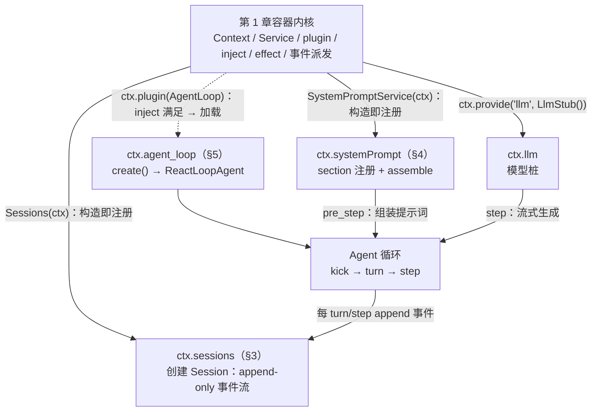
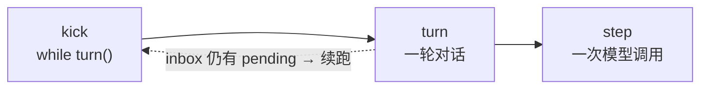
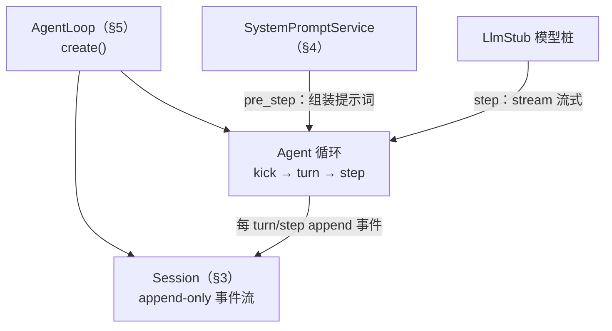
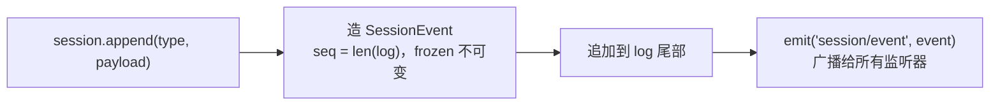
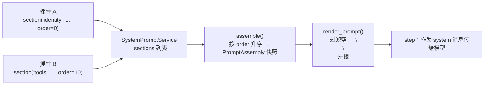
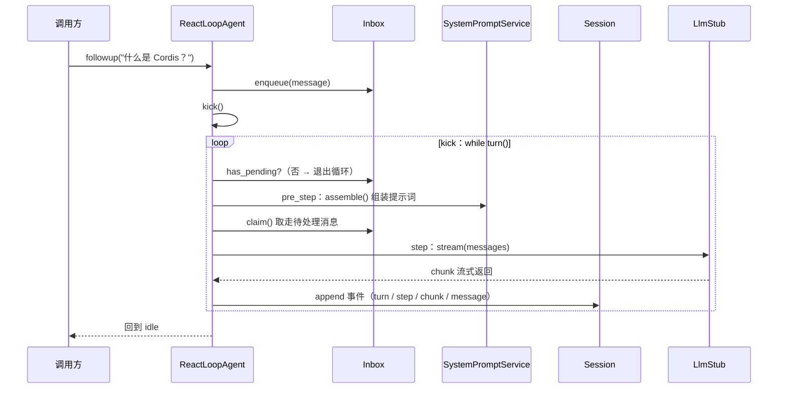

# 第 2 章 最小 agent-loop 闭环（一条消息进，一条回复出）

> 一言进门，一语出门；循环自转，回合不断。

## 本章回答的问题

- agent 的对话状态放在哪里，如何保证它是唯一事实来源？
- 调模型时 system prompt 从哪来，第三方如何往里注入内容？
- 谁来驱动对话循环：消息进去后谁推进、回复怎么出来？
- 一个 agent 如何被第 1 章的容器「拼装」出来？

第 1 章交付了容器内核：`Context` 握着两张表（服务表 + 监听器表），`Service` 构造即注册，`plugin` + `inject` 让插件「依赖满足才加载」，`effect` + `Fiber` 让注册成为可逆效应，`on`/`emit`/`serial`/`waterfall` 四种派发承担协作。但容器只是骨架，它本身不回答「一个 agent 怎么对话」。

本章把三个服务作为插件装进这副骨架：`Sessions`（对话状态）、`SystemPromptService`（提示词组装）、`AgentLoop`（对话循环）。第 1 章结尾说过，`serial` 的 turn-stopping、`waterfall` 的 pre-step 当时「只讲语义」，本章它们会第一次真正派上用场（分别在 §5.4 与 §5.5 出场）。

代码关系：本章增量复用第 1 章的 `ch01/code/cordis.py`（`main.py` 只 import 其中的 `Context`，`agent_loop.py` 只 import `Service`，不重复粘贴），新增 `ch02/code/` 下两个文件：`agent_loop.py`（教学版 agent-loop）与 `main.py`（可运行装配入口）。运行 `python3 ch02/code/main.py` 即可看到「一条消息进，一条回复出」的完整闭环，输出全文见 §6。

## 1. 消息散落、提示词硬编码、循环无人驱动

不用任何框架，手写一个「能对话的 agent」，三步就会撞墙。

**第一步撞墙：对话状态没有唯一事实来源。** 最直觉的写法是把历史挂在函数局部变量里：

```python
# 反面示例：对话消息散落在局部变量
def chat(user_text):
    history = []  # 把对话历史挂在函数内部，调用结束即消失
    history.append({"role": "user", "content": user_text})
    reply = call_model(history)  # call_model 为示意伪函数
    history.append({"role": "assistant", "content": reply})
    return reply

# 想回放这轮对话？想落盘持久化？history 散落在函数里，无处可导出。
```

消息一旦散落在局部变量、全局列表或各个调用方手里，「这轮对话到底发生过什么」就没有唯一答案，回放与持久化都无从谈起。

**第二步撞墙：system prompt 硬编码。** 要调模型就得先有 system prompt，最直觉的写法是写死一个字符串：

```python
# 反面示例：硬编码的 system prompt
SYSTEM_PROMPT = "你是一个助手。"  # 写死在模块顶层

def build_prompt(user_text):
    # 第三方想加一段「当前时间」或「工具说明」，只能回来改这行拼接
    return SYSTEM_PROMPT + "\n" + user_text
```

硬编码的 prompt 不可扩展：第三方插件既无法注入自己的片段，也无法在自己卸载时把片段带走。

**第三步撞墙：没有人驱动循环。** 状态有了、prompt 有了，「一条消息进、一条回复出」中间还有一长串动作：取消息、组 prompt、调模型、收流式 chunk、拼回复、写回状态、判断要不要继续——谁来负责推进？

```python
# 反面示例：手写驱动，每一步都散落在 while 里
while True:
    msg = wait_user_input()        # 谁负责收消息？
    prompt = build_prompt(msg)     # 谁负责组 prompt？
    chunks = model.stream(prompt)  # 谁负责收流？
    reply = "".join(chunks)        # 谁负责拼回复、写回状态、判断续跑？
```

于是本章的问题链条是：

- **问题 ①**：agent 的对话状态必须有一个唯一事实来源（消息散落各处，回放/持久化无从谈起）→ 机制：`Session`（append-only 事件流），§3 解决；
- **问题 ②**：调模型时 system prompt 从哪来（硬编码不可扩展，第三方无法注入）→ 机制：`SystemPromptService`（section 注册 + assemble），§4 解决；
- **问题 ③**：谁来驱动对话循环（消息进、回复出，中间谁负责推进）→ 机制：`AgentLoop` + `ReactLoopAgent` + kick/turn/step，§5 收口。

## 2. 装配总览：三个插件挂进容器

逐机制拆解之前，先用三张图建立整体视角：**图 1** 是装配总览图，看三个插件如何挂进第 1 章的容器并跑起循环；**图 2** 放大循环主干本身；**图 3** 看循环与各协作模块之间的数据流。

**图 1 · 装配总览：三个插件挂进第 1 章容器**



第 1 章的容器内核通过 `provide` 注册服务、`inject` 声明依赖，把三个运行时服务装配出来：`Sessions` 与 `SystemPromptService` 以 `Service` 子类构造即注册（第 1 章机制），`LlmStub` 是普通对象、显式 `provide`，`AgentLoop` 声明 `inject = ["sessions", "llm"]`、依赖满足后才加载。`AgentLoop.create()` 建出 Session 与这条 loop；跑起来后，loop 在 `pre_step` 向 `SystemPromptService` 取提示词、在 `step` 调 `LlmStub` 流式生成，并把每一步作为事件 append 进 `Session`。

**图 2 · loop 主干：kick → turn → step**



主干是一个三段循环：`kick` 反复驱动 `turn`，每个 `turn` 调一次 `step`（一次模型调用）；只要 inbox 还有未处理消息，`turn` 就返回「继续」，`kick` 进入下一轮。本章无工具，一条消息只跑一轮。

**图 3 · loop 与协作模块：数据怎么流**



拆解顺序按依赖从底向上：先看 `Session`（§3，循环往哪里写状态），再看 `SystemPromptService`（§4，循环从哪里取提示词），最后看 `AgentLoop` 如何把两者与模型桩串成 kick → turn → step 的闭环（§5）。

## 3. Session：append-only 事件流

### 3.1 概念引入：最小示例

问题 ① 要的是「一个唯一的地方存放对话状态」。最小的形态就是一个只追加的列表：

```python
# 最小示例：append-only 的对话日志（自包含，可运行）
log = []  # 对话状态唯一存放处

def append(type_, payload):
    # 用当前日志长度当序号：seq 天然连续、无空洞
    event = {"seq": len(log), "type": type_, "payload": payload}
    log.append(event)  # 只追加，不修改、不删除
    return event

append("user/message", {"text": "什么是 Cordis？"})
append("assistant/chunk", {"text": "收到问题。"})
print([e["seq"] for e in log])  # [0, 1]
print(log[0]["type"])           # user/message
```

这个列表就是 **Session** 的最小形态。把它推广成框架机制，需要补上三件事：事件条目不可变、序号有契约、每次追加都对外广播。

### 3.2 内部实现

**Session**（会话）的定义：**一条 append-only 事件日志，是 agent 对话状态的唯一事实来源。** 日志里的每条记录是一个 **SessionEvent**（会话事件），带四个字段：`session_id`（属于哪个会话）、`seq`（序号）、`type`（事件类型）、`payload`（载荷）。

一次 `append` 的完整动作：



图与代码逐行对应：先以当前日志长度为序号造出事件条目，追加到 `log` 尾部，最后通过第 1 章的 `emit` 把事件广播出去——任何想旁观会话的插件（日志、遥测、持久化）只需 `on("session/event", ...)`，无需侵入 Session 本身。

Session 有三条铁律：

1. **append-only**：只追加，不修改、不删除。想「撤回」一条消息？那也是追加一条新的撤回事件，历史本身不动。
2. **seq == len(log)**：序号就是追加前的日志长度，天然从 0 连续递增、无空洞。§6 的输出里 `seq=0` 到 `seq=8` 一条不缺，靠的就是这条契约。
3. **事件不可变**：`SessionEvent` 用 `@dataclass(frozen=True)`，创建后任何字段不可改——写进去就冻住。

Session 本身不是服务，它由 **Sessions**（会话注册表服务，挂在 `ctx.sessions`）负责创建与查找：`create()` 分配 `session-0001` 这样的递增 id 并登记，`get()` 按 id 取回。一个容器可以有多个互不干扰的会话，状态各自独立。

### 3.3 Python 重构

教学版把上面的机制落在 `agent_loop.py` 的三个符号上：`SessionEvent`、`Session`、`Sessions`。

```python
# ch02/code/agent_loop.py（本章新增；Service 来自第 1 章 cordis.py）
# ---------- session：append-only 事件日志 ----------


@dataclass(frozen=True)
class SessionEvent:
    """append-only 事件条目，对应 SessionEvent（packages/core/session/src/types.ts:404）。

    [教学简化] 真实事件还带 timestamp 与 surface 元数据；frozen 对应 deepFreeze。
    """

    session_id: str
    seq: int
    type: str
    payload: dict


class Session:
    """append-only 事件日志，对应 Session（packages/core/session/src/index.ts:425）。"""

    def __init__(self, ctx, session_id):
        self.ctx = ctx
        self.id = session_id
        self.log: list[SessionEvent] = []

    def append(self, type, payload):
        """追加一条事件：seq == len(log)（index.ts:604-653），事件不可变（deepFreeze，index.ts:627）。

        [教学简化] 省略 JSON 校验（append 内）与 surface/surfaceOp（第 10 章机制，G9）。
        """
        event = SessionEvent(self.id, len(self.log), type, payload)
        self.log.append(event)
        self.ctx.emit("session/event", event)
        return event


class Sessions(Service):
    """会话注册表服务 ctx.sessions，对应 SessionStore（packages/core/session/src/index.ts:792）。

    [教学简化] 真实版本有 prepare/commitPrepared 两段式创建与 enter/announce 登记；此处直接创建。
    """

    def __init__(self, ctx, config=None):
        super().__init__(ctx, "sessions")
        self._sessions = {}
        self._next_id = 0

    def create(self):
        self._next_id += 1
        session = Session(self.ctx, f"session-{self._next_id:04d}")
        self._sessions[session.id] = session
        return session

    def get(self, session_id):
        return self._sessions.get(session_id)
```

`Sessions` 继承第 1 章的 `Service`，`super().__init__(ctx, "sessions")` 一行即完成「构造即注册」——`main.py` 里 `Sessions(ctx)` 之后就能用 `ctx.sessions` 读到它。

### 3.4 回溯：状态有了唯一事实来源，提示词从哪来

问题 ① 解决：对话状态收敛到 `session.log` 这一个地方，回放就是重读日志，持久化就是把日志落盘（第 3 章的主题）。但循环要跑起来还缺一样东西——`step` 调模型时需要 system prompt，它从哪来？硬编码不可扩展（问题 ②），下一节解决。

## 4. SystemPromptService：section 注册 + assemble

### 4.1 概念引入：最小示例

问题 ② 要的是「prompt 不写死，谁都能注入一段」。最小形态：一个公共的片段列表，注册时登记顺序，组装时排序拼接：

```python
# 最小示例：注册提示词片段，再按序组装（自包含，可运行）
sections = []  # 提示词片段的公共登记处

def section(name, text, order=0):
    # 注册一个片段：name 标识来源，order 决定组装顺序
    sections.append({"name": name, "order": order, "text": text})

def assemble():
    # 按 order 升序排序，过滤空片段，用空行拼接
    ordered = sorted(sections, key=lambda s: s["order"])
    return "\n\n".join(s["text"] for s in ordered if s["text"])

section("identity", "你是一个有帮助的助手。", order=0)
section("time", "当前时间：2026-08-18。", order=10)
print(assemble())
```

输出：

```text
你是一个有帮助的助手。

当前时间：2026-08-18。
```

两个注册方互不认识，各自登记自己的片段，组装结果由 `order` 决定——这就是「第三方可注入」的最小形态。

### 4.2 内部实现

**SystemPromptService**（系统提示词服务，容器服务名 `ctx.systemPrompt`）的定义：**系统提示词的注册与组装中心。** 围绕它有三个符号：

- **PromptSection**（提示词片段）：`name`（谁注册的）+ `order`（排第几）+ `text`（内容）；
- **PromptAssembly**（组装快照）：一次 `assemble()` 的定型结果，持有按 order 排好的 sections 列表——快照意味着后续 `step` 只读不改；
- **render_prompt(assembly)**：把快照渲染成一段文本，过滤空片段、`\n\n` 拼接。

注册与组装的全景：



关键机制是 **`section()` 注册即效应**：注册动作包在第 1 章的 `ctx.effect` 里，setup 把片段加入列表，teardown 把片段移除。于是任何插件都能注入自己的提示词片段，插件卸载时片段自动随之带走——提示词的注册也有生命周期。这正是问题 ② 的答案：硬编码字符串做不到的「可注入、可撤回」，由效应机制兜底。

### 4.3 Python 重构

教学版对应 `agent_loop.py` 的四个符号：`PromptSection`、`PromptAssembly`、`SystemPromptService`、`render_prompt`。

```python
# ch02/code/agent_loop.py（本章新增；Service/effect 来自第 1 章 cordis.py）
# ---------- system-prompt：sections 组装 ----------


@dataclass
class PromptSection:
    """提示词片段，对应 PromptSection（packages/core/system-prompt/src/index.ts:53）。"""

    name: str
    order: int
    text: str


@dataclass
class PromptAssembly:
    """组装快照，对应 PromptAssembly（packages/core/system-prompt/src/index.ts:115）。

    [教学简化] 真实快照还含 variables/tools/contexts。
    """

    sections: list[PromptSection] = field(default_factory=list)


class SystemPromptService(Service):
    """ctx.systemPrompt 最小版，对应真实项目 SystemPromptService（packages/core/system-prompt/src/index.ts:338）。

    [教学简化] 真实版有 section/variable/tool/context 四种注册；此处只保留 section。
    """

    def __init__(self, ctx, config=None):
        super().__init__(ctx, "systemPrompt")
        self._sections: list[PromptSection] = []

    def section(self, name, text, order=0):
        """注册一个片段（index.ts:381）。注册即效应：卸载时自动移除。"""
        entry = PromptSection(name, order, text)

        def setup():
            self._sections.append(entry)
            return lambda: self._sections.remove(entry)

        return self.ctx.effect(setup, label=f"section:{name}")

    def assemble(self):
        """按 order 升序组装，对应 assemble（index.ts:467）。

        [教学简化] 真实版还会派发 waterfall('system-prompt/assemble')（:467）并合并 variables/tools。
        """
        assembly = PromptAssembly()
        assembly.sections = sorted(self._sections, key=lambda s: s.order)
        return assembly


def render_prompt(assembly):
    """sections → 过滤空 → \\n\\n 拼接，对应 renderPrompt（index.ts:212-217）。

    [教学简化] 省略 {{variable}} 插值。
    """
    return "\n\n".join(section.text for section in assembly.sections if section.text)
```

`main.py` 第 3 段构造 `SystemPromptService(ctx)` 并注册一个 `identity` 片段，随即 `assemble()` + `render_prompt()` 把组装结果打印出来——§6 输出第 3 段的「组装结果」一行就是它的产物。注册动作本身是静默的：`section()` 走 `ctx.effect(setup)`，setup 立即执行、把片段追加进 `_sections`，并返回「卸载时移除」的清理函数（第 1 章 effect 语义）。

### 4.4 回溯：提示词可扩展了，谁来驱动循环

问题 ② 解决：prompt 不再写死，任何插件都能用 `section()` 注入片段，卸载时自动带走。注意本章有两条路径向 `step` 输送上下文：`identity` 走 section 注册（一次注册、长期有效、随插件卸载），而 `main.py` 第 5 段的时间上下文走 `agent/pre-step` waterfall 注入（每次 step 现算）——两者如何在 `step` 里汇合，正是下一节的内容。至此只剩问题 ③：谁来驱动「消息进、回复出」的循环。

## 5. 装配闭环：AgentLoop → ReactLoopAgent → kick/turn/step

前面两节搭好了事件流（§3）与提示词组装（§4）。这一节把它们与模型桩装配成会跑的 agent-loop：先认识被调用的模型桩（§5.1），再看容器如何装配出 `AgentLoop` 服务（§5.2），然后逐层拆开驱动器 `ReactLoopAgent` 的 kick（§5.3）、turn（§5.4）、pre_step（§5.5）、step（§5.6），最后用一张时序图总览一条消息的完整旅程（§5.7）。

### 5.1 LlmStub：模型桩

`step` 最终要调用模型。本章不接真实模型，用一个流式桩代替——它按真实 `LlmRuntime.stream` 的调用约定工作：接收 `messages` 与 `system_prompt`，yield 一串 chunk。

```python
# ch02/code/agent_loop.py（本章新增）
# ---------- llm stub：无真实模型的流式服务 ----------


class LlmStub:
    """[教学简化] ctx.llm 服务的桩：无需真实模型。

    stream() 是生成器，yield 3 个写死的文本 chunk + 1 个 finish，
    对应 LlmRuntime.stream（packages/llm/llm/src/index.ts:913 → streamWithRegistration :917）与 StreamChunk 协议（types.ts:291）。
    [教学决策 G7] 真实版是 async 流；教学版用同步生成器，机制语义不变。
    """

    def stream(self, messages, system_prompt=None, **options):
        user_text = messages[-1]["content"] if messages else ""
        for piece in (
            f"收到问题「{user_text}」。",
            "这是一个最小闭环：",
            "chunk 逐条到达，拼成完整回复。",
        ):
            yield {"type": "text-delta", "text": piece}
        yield {"type": "finish", "stop_reason": "end-turn"}
```

注意 `stream` 是生成器：它先从 `messages` 最后一条取文本回显进第一个 chunk（所以 §6 输出里能看到「收到问题「什么是 Cordis？」。」），再 yield 两段写死的文本，最后一个 `finish` chunk 携带 `stop_reason="end-turn"`（教学版 `step` 只消费 `text-delta`，`finish` 原样略过）。`main.py` 第 2 段用 `ctx.provide("llm", LlmStub())` 把它挂进容器——它是普通对象而非 `Service` 子类，所以走显式 `provide`（第 1 章两种注册方式之一）。

chunk 最终要被拼装成一条完整的 assistant 消息，靠的是模块级函数 `create_assistant_message`：

```python
# ch02/code/agent_loop.py（本章新增）
# ---------- assistant message：chunk 拼装终点 ----------


def create_assistant_message(text, source_event_seqs):
    """流式文本 → 不可变 assistant 消息，对应 createAssistantMessage（packages/llm/llm/src/message.ts:206-217）。

    [教学简化] 真实版接收 ContentBlock[] 与 source；此处接收已拼好的文本。
    [教学决策 G10] 省略 BlockAssembler 块归一化（assembler.ts:134-139），直接拼接文本。
    """
    return {
        "role": "assistant",
        "content": [{"type": "text", "text": text}],
        "source": {"kind": "model"},
        "source_event_seqs": tuple(source_event_seqs),
    }
```

`source_event_seqs` 记录这条消息由哪些 chunk 事件的 seq 拼成（`step` 里的局部变量叫 `chunk_seqs`）——消息与事件流之间的溯源链，§6 输出里 assistant/message 的 `source_event_seqs: (3, 4, 5)` 就是它。

### 5.2 AgentLoop：被容器装配出来的服务

**AgentLoop**（agent-loop 服务，容器服务名 `ctx.agent_loop`）是本章唯一以 `plugin` 方式加载的服务：它用类属性 `inject` 声明依赖，容器在依赖满足后才加载它（第 1 章的 plugin + inject 机制）。

```python
# ch02/code/agent_loop.py（本章新增；Service 来自第 1 章 cordis.py）
# ---------- AgentLoop：被容器装配出来的服务 ----------


class AgentLoop(Service):
    """agent-loop 服务，对应 AgentLoop（packages/core/agent-loop/src/index.ts:296）。

    inject 声明对应 static inject（index.ts:296-297）：sessions/llm 都提供后才加载。
    [教学简化] 真实版 create() 与 publish() 两段（create :589；publish :556-570：
    sessions.enter → agents.enter → announce → 广播）；教学版合并为一个 create()。
    """

    inject = ["sessions", "llm"]

    def __init__(self, ctx, config=None):
        super().__init__(ctx, "agent_loop")  # [教学决策 G2] 教学服务名 agent_loop（素材未定，见 notes §11）
        self.agents = {}

    def create(self, **options):
        """create + publish（[教学简化] 两段合一）：建 Session → 建 ReactLoopAgent → 登记 → 广播 agent/session-start。"""
        session = self.ctx.sessions.create()
        agent = ReactLoopAgent(self.ctx, session, options)
        self.agents[session.id] = agent
        # 真实 publish() 在 sessions.enter/agents.enter/announce 后广播 agent/session-start（index.ts:556-570）
        self.ctx.emit("agent/session-start", {"session_id": session.id, "agent": agent})
        return agent
```

`inject = ["sessions", "llm"]` 是类属性形式的依赖声明：`sessions` 与 `llm` 都提供后才加载。`main.py` 第 4 段里 `ctx.plugin(AgentLoop)` 立即 active，正是因为第 1、2 段已经把两个依赖备齐了。

`create()` 的顺序值得注意：先建 Session，再建 Agent，登记后才广播 `agent/session-start`。广播是最后一步——监听器收到事件时，一切已就绪。

### 5.3 Inbox 与 ReactLoopAgent：send / wake_driver / kick

`AgentLoop.create()` 建出的驱动器是 **ReactLoopAgent**（反应式循环驱动器）。它自带一个 **Inbox**（待处理消息队列）：`enqueue` 入队、`claim()` 在 step 边界一次性取走全部、`has_pending` 判断是否还有剩余。

```python
# ch02/code/agent_loop.py（本章新增）
# ---------- inbox：待处理队列 ----------


class Inbox:
    """待处理队列，对应 Inbox（packages/core/agent-loop/src/inbox.ts:25）。

    [教学简化] 只实现 next_turn；next_step（steer/inject，agent.ts:126/:130）本章不展开。
    """

    def __init__(self):
        self.next_turn: deque = deque()

    def enqueue(self, message):
        self.next_turn.append(message)

    def claim(self):
        """在 step 边界一次性取走全部待处理消息（inbox.ts claim）。"""
        claimed = list(self.next_turn)
        self.next_turn.clear()
        return claimed

    @property
    def has_pending(self):
        return bool(self.next_turn)
```

驱动器的入口是三件套：`send` 入队并唤醒、`wake_driver` 是进入 running 相位的唯一入口、`kick` 是最外层驱动循环。下面展示 `ReactLoopAgent` 的前半部分（类定义到 `kick`，`turn`/`pre_step`/`step` 见 §5.4–§5.6）：

```python
# ch02/code/agent_loop.py 行 226-284（连续摘录；完整类见行 229-337）
# ---------- ReactLoopAgent：反应式循环驱动器 ----------


class ReactLoopAgent:
    """反应式循环驱动器，对应 ReactLoopAgent（packages/core/agent-loop/src/agent.ts:64）。

    [教学简化] 真实代码的 phase 是判别联合（idle/running/...，agent.ts:217-221）；
    教学版用一个字符串字段表达 idle/running 两相。
    """

    def __init__(self, ctx, session, options=None):
        self.ctx = ctx
        self.session = session
        self.options = options or {}
        self.inbox = Inbox()
        self.phase = "idle"
        self._wake_requested = False

    # -- 入队口（agent.ts:113-132；steer/inject 本章省略） --

    def send(self, message, wakeup=True):
        """入队 + 唤醒（agent.ts:113-118）。

        [教学简化] 省略 wakingAfterAbort 分支（agent.ts:114-117）。
        """
        if isinstance(message, str):
            message = {"role": "user", "content": message}
        self.inbox.enqueue(message)
        if wakeup:
            self.wake_driver()

    def followup(self, message):
        """用户追问：入 next_turn 并立即唤醒（agent.ts:121）。"""
        self.send(message, wakeup=True)

    # -- 驱动循环 --

    def wake_driver(self):
        """进入 running 相位的唯一入口（agent.ts:172）。"""
        if self.phase == "running":
            self._wake_requested = True
            return
        self.phase = "running"
        try:
            self.kick()
        finally:
            self.phase = "idle"
            # 真实代码 kick finally：wakeRequested 且 inbox.hasPending → 再 wakeDriver（agent.ts:215-222）
            if self._wake_requested and self.inbox.has_pending:
                self._wake_requested = False
                self.wake_driver()

    def kick(self):
        """kick() → while (await turn()) {}（agent.ts:210-223）。

        [教学简化] 真实代码 catch 在驱动边界吞掉已上报错误（agent.ts:212-213）。
        """
        while self.turn():
            pass
```

`kick` 只有一行循环：`while self.turn()`。turn 说继续就继续——「继续」的判定标准是 inbox 是否仍有 pending。`wake_driver` 则保证同一时刻只有一个 kick 在跑：已在 running 时只登记一次「唤醒请求」，等当前 kick 收尾再决定是否重入。

### 5.4 turn()：一轮对话与 turn-stopping

**turn**（一轮对话）是 kick 循环的单位。一轮里依次发生：`turn/start` → `step/start` → 逐条 `user/message` → `step` → `step/end` → turn-stopping 询问 → `turn/end`。

```python
# ch02/code/agent_loop.py 行 286-305（连续摘录）
    def turn(self):
        """一个 turn：turn/start → pre_step → step/start → user/message → step → step/end
        → turn-stopping → turn/end（turn() agent.ts:246-330）。

        返回是否续跑。[教学决策 G5] 判定取「inbox 是否仍有 pending」。
        """
        if not self.inbox.has_pending:
            return False
        self.session.append("turn/start", {})
        snapshot = self.pre_step()
        # 真实源码顺序：step/start（:279）→ 逐条 user/message（:283）→ step() 调用（:287）（agent.ts:246-330 内）
        self.session.append("step/start", {})
        for message in snapshot["claimed"]:
            self.session.append("user/message", {"message": message})
        self.step(snapshot)
        self.session.append("step/end", {})
        # turn-stopping：真实代码在无 next-step 待处理时 serial('agent/turn-stopping') 后 break（agent.ts:296）
        stop = self.ctx.serial("agent/turn-stopping", self)
        self.session.append("turn/end", {"reason": stop or "completed"})
        return self.inbox.has_pending
```

第 1 章讲 `serial` 时只给了语义——「监听器依次执行，任一返回非空值即停止并返回该值」。这里它第一次真正派上用场：**turn-stopping 询问**。`step` 结束后，turn 通过 `serial("agent/turn-stopping", self)` 问所有监听器「要不要停下」：谁返回非空字符串（比如错误原因），turn 就以该原因收尾；没人拦截，`stop` 为 `None`，`turn/end` 的 reason 落为 `"completed"`。§6 输出末尾 `[seq=8] turn/end: {'reason': 'completed'}` 就是这条路径的产物。

turn 的返回值决定是否续跑：inbox 仍有 pending 就返回 `True`，kick 进入下一轮；本章只发一条消息，一轮后 inbox 为空，循环退出。

### 5.5 pre_step()：step 的前奏与 waterfall

turn 开工后的第一个动作是 `pre_step()`：组装 prompt、取走消息、经 waterfall 放行拦截。

```python
# ch02/code/agent_loop.py 行 307-315（连续摘录）
    def pre_step(self):
        """step 前奏：取消息 → 组装 prompt → waterfall('agent/pre-step') 放行拦截（agent.ts:225-243）。"""
        assembly = self.ctx.systemPrompt.assemble()
        snapshot = {
            "claimed": self.inbox.claim(),
            "assembly": assembly,
            "additional_contexts": [],
        }
        return self.ctx.waterfall("agent/pre-step", snapshot)
```

第 1 章讲 `waterfall` 时也只给了语义——「初始值依次穿过监听器，每个监听器返回新值」。这里它第一次真正派上用场：**pre-step 放行拦截**。`snapshot` 字典是本 step 的输入快照，三个键：`claimed`（刚从 inbox 取走的消息列表）、`assembly`（§4 的 prompt 组装结果）、`additional_contexts`（waterfall 沿途可追加的上下文）。快照穿过 `agent/pre-step` 上的监听器，每个监听器可以修改它再传给下一个——`main.py` 第 5 段注册的时间上下文就在这里被追加进 `additional_contexts`。

两条上下文路径在此汇合：section 注册的 `identity` 在 `assembly` 里（一次注册、长期有效），waterfall 注入的时间在 `additional_contexts` 里（每次 step 现算）。

### 5.6 step()：一次模型调用

**step**（一次模型调用）是循环的最内层，分三段：组装输入、流式消费、拼装写回。

```python
# ch02/code/agent_loop.py 行 317-337（连续摘录）
    def step(self, snapshot):
        """一次模型调用（agent.ts:332-401）。

        [教学简化] 真实代码一个 turn 内可循环多个 step（tool-call 驱动）；本章无工具，一 turn 一 step。
        """
        claimed = snapshot["claimed"]
        assembly = snapshot["assembly"]
        system_text = render_prompt(assembly)
        # [教学简化] 真实代码经 deriveMessages 派生模型消息（session/src/index.ts:726-747）
        messages = [{"role": "user", "content": text} for text in snapshot["additional_contexts"]]
        messages += [{"role": "user", "content": m["content"]} for m in claimed]

        text_parts, chunk_seqs = [], []
        for chunk in self.ctx.llm.stream(messages, system_prompt=system_text):
            if chunk["type"] == "text-delta":
                event = self.session.append("assistant/chunk", {"chunk": chunk})
                chunk_seqs.append(event.seq)
                text_parts.append(chunk["text"])
        message = create_assistant_message("".join(text_parts), chunk_seqs)
        self.session.append("assistant/message", {"message": message})
        return "completed"  # 无 tool-call → 本轮结束（agent.ts:332-401）
```

三段逐一拆开：

1. **组装输入**：`render_prompt(assembly)` 把 §4 的快照渲染成 `system_text`；`additional_contexts`（waterfall 注入的时间上下文）与 `claimed`（用户消息）拼成 `messages`。
2. **流式消费**：`ctx.llm.stream(...)` 逐 chunk 返回，每个 `text-delta` 立即 `append` 成一条 `assistant/chunk` 事件——chunk 不是攒完再写，而是边流边进事件流；`event.seq` 记入 `chunk_seqs`，文本记入 `text_parts`。
3. **拼装写回**：`create_assistant_message` 把文本拼成完整消息（`chunk_seqs` 落为消息的 `source_event_seqs` 字段），`append` 成 `assistant/message` 事件。

注意 `turn()` 里 `self.step(snapshot)` 丢弃了返回值：教学版 `step` 固定返回 `"completed"`——没有工具就没有「下一步」，turn 不需要读它；真实源码里 step 还可能返回 `waiting_approval` 等状态，由 turn 据此决定是否继续（工具驱动的多步循环见第 4 章）。另一个细节：`LlmStub` 最后 yield 的 `finish` chunk 携带本轮 stop_reason，教学版 step 只消费 `text-delta`，不读 finish。

### 5.7 时序图：一条消息的完整旅程



图只画主干旅程：消息入队 → `kick` 驱动循环 → 每轮 `turn` 里组装提示词、取消息、调模型、把事件写进 Session → 无待处理消息时退出。`waterfall` / `serial` / `render_prompt` 等内部细节与逐条 `append` 的 seq 号不在此图——前者见上方各方法代码，九个事件的完整序列见 §6 的实际输出，事件类型与源码的对应见 §7 源码对照。

至此问题 ③ 解决：驱动循环的不是调用方的手写 while，而是容器装配出的 `AgentLoop` → `ReactLoopAgent` → kick/turn/step 三层循环。消息从 `followup` 进去，回复以事件的形式落进 Session，一条消息进、一条回复出。

## 6. 完整运行输出

### 6.1 实际输出

本章的可运行入口是 `main.py`，按 6 个环节演示装配闭环：建容器 → provide sessions + llm → 注册 identity 提示词片段 → plugin 加载 AgentLoop → 注册监听器 → followup 跑一轮闭环。全文如下：

```python
# ch02/code/main.py（本章可运行入口）
"""第 2 章演示：最小 agent-loop 闭环（一条消息进，一条回复出）。

仅标准库，Python 3.10+。运行：python3 main.py

演示环节（聚焦 agent-loop 装配闭环，不复演第 1 章机制教学段）：
1. 建容器
2. provide sessions + llm
3. 注册 identity 提示词片段（section 注册即效应）
4. plugin 加载 AgentLoop（inject 满足才加载）
5. 注册监听器：session/event 打印 + session-start 打印 + pre-step 注入
6. followup 跑一轮闭环：事件流 + 拼出 assistant 消息
"""
import os
import sys

_HERE = os.path.dirname(os.path.abspath(__file__))
_CH01 = os.path.abspath(os.path.join(_HERE, "..", "ch01"))
for _p in (_HERE, _CH01):
    if _p not in sys.path:
        sys.path.insert(0, _p)

from cordis import Context  # noqa: E402
from agent_loop import AgentLoop, LlmStub, Sessions, SystemPromptService, render_prompt  # noqa: E402


def main():
    # -- 1. 建容器 --
    print("== 1. 建容器 ==")
    ctx = Context()

    # -- 2. provide sessions + llm --
    print("\n== 2. provide sessions + llm ==")
    Sessions(ctx)  # Service 子类：构造即注册为 ctx.sessions
    ctx.provide("llm", LlmStub())  # 普通对象：显式 provide
    print(f"  ctx.sessions -> {type(ctx.sessions).__name__}")
    print(f"  ctx.llm      -> {type(ctx.llm).__name__}")

    # -- 3. 注册 identity 提示词片段 --
    print("\n== 3. 注册 identity 提示词片段 ==")
    SystemPromptService(ctx)  # 构造即注册为 ctx.systemPrompt
    ctx.systemPrompt.section("identity", "你是一个最小教学 agent，只用标准库，没有工具。", order=0)
    print(f"  组装结果: {render_prompt(ctx.systemPrompt.assemble())}")

    # -- 4. plugin 加载 AgentLoop（inject 满足才加载） --
    print("\n== 4. plugin 加载 AgentLoop（inject 满足才加载） ==")
    fiber = ctx.plugin(AgentLoop)  # inject = ["sessions", "llm"] 已备齐 → 立即加载
    print(f"  AgentLoop inject={AgentLoop.inject} -> state={fiber.state}")
    print(f"  ctx.agent_loop -> {type(ctx.agent_loop).__name__}")

    # -- 5. 注册监听器 --
    print("\n== 5. 注册监听器 ==")
    ctx.on("session/event", lambda ev: print(f"  [event] seq={ev.seq} {ev.type}"))
    ctx.on("agent/session-start", lambda info: print(f"  [agent/session-start] {info['session_id']}"))

    def time_context(snapshot):
        # waterfall('agent/pre-step') 监听器：每次 step 前注入时间上下文（每次现算）
        print("  [pre-step] 注入时间上下文")
        snapshot["additional_contexts"].append("当前时间：2026-08-18")
        return snapshot

    ctx.on("agent/pre-step", time_context)

    # -- 6. followup 跑一轮闭环 --
    print("\n== 6. followup 跑一轮闭环 ==")
    agent = ctx.agent_loop.create()
    print(f"  session={agent.session.id}")
    agent.followup("什么是 Cordis？")

    print("\n  -- session 日志（append-only，seq == len(log)） --")
    for ev in agent.session.log:
        print(f"  [seq={ev.seq}] {ev.type}: {ev.payload}")
    assistant = next(
        ev.payload["message"]["content"][0]["text"]
        for ev in agent.session.log
        if ev.type == "assistant/message"
    )
    print(f"\n  拼出的 assistant 消息: {assistant}")


if __name__ == "__main__":
    main()
```

运行方式（在仓库根目录）：

```bash
python3 ch02/code/main.py
```

实际输出（实跑截取，未做删改）：

```text
== 1. 建容器 ==

== 2. provide sessions + llm ==
  ctx.sessions -> Sessions
  ctx.llm      -> LlmStub

== 3. 注册 identity 提示词片段 ==
  组装结果: 你是一个最小教学 agent，只用标准库，没有工具。

== 4. plugin 加载 AgentLoop（inject 满足才加载） ==
  AgentLoop inject=['sessions', 'llm'] -> state=active
  ctx.agent_loop -> AgentLoop

== 5. 注册监听器 ==

== 6. followup 跑一轮闭环 ==
  [agent/session-start] session-0001
  session=session-0001
  [event] seq=0 turn/start
  [pre-step] 注入时间上下文
  [event] seq=1 step/start
  [event] seq=2 user/message
  [event] seq=3 assistant/chunk
  [event] seq=4 assistant/chunk
  [event] seq=5 assistant/chunk
  [event] seq=6 assistant/message
  [event] seq=7 step/end
  [event] seq=8 turn/end

  -- session 日志（append-only，seq == len(log)） --
  [seq=0] turn/start: {}
  [seq=1] step/start: {}
  [seq=2] user/message: {'message': {'role': 'user', 'content': '什么是 Cordis？'}}
  [seq=3] assistant/chunk: {'chunk': {'type': 'text-delta', 'text': '收到问题「什么是 Cordis？」。'}}
  [seq=4] assistant/chunk: {'chunk': {'type': 'text-delta', 'text': '这是一个最小闭环：'}}
  [seq=5] assistant/chunk: {'chunk': {'type': 'text-delta', 'text': 'chunk 逐条到达，拼成完整回复。'}}
  [seq=6] assistant/message: {'message': {'role': 'assistant', 'content': [{'type': 'text', 'text': '收到问题「什么是 Cordis？」。这是一个最小闭环：chunk 逐条到达，拼成完整回复。'}], 'source': {'kind': 'model'}, 'source_event_seqs': (3, 4, 5)}}
  [seq=7] step/end: {}
  [seq=8] turn/end: {'reason': 'completed'}

  拼出的 assistant 消息: 收到问题「什么是 Cordis？」。这是一个最小闭环：chunk 逐条到达，拼成完整回复。
```

### 6.2 逐段读输出

以下按输出中的 `== N. ==` 分段，每行输出都能在上面 `main.py` 里找到对应的 print 或事件源。

**第 1 段：建容器。** 一个 `Context()`，两张内部表（服务表 + 监听器表）就位。除了一行段标题确认到达，容器本身没有存在感。

**第 2 段：provide sessions + llm。** `Sessions(ctx)` 构造即注册（§3.3）；`LlmStub` 是普通对象，走显式 `provide`（§5.1）——第 1 章的两种注册方式在这里各用一次。两行 print 验证两个服务都能从 `ctx` 读到。

**第 3 段：注册 identity 提示词片段。** `SystemPromptService(ctx)` 构造即注册，`section("identity", ...)` 注册片段（§4.3）——注册本身静默，紧随其后的 `assemble() + render_prompt()` 把组装结果打印出来：「你是一个最小教学 agent……」。这一行就是 §4 机制的第一次现身。

**第 4 段：plugin 加载 AgentLoop。** `AgentLoop` 声明的 `inject = ["sessions", "llm"]` 已在第 2 段备齐，`ctx.plugin(AgentLoop)` 立即 `state=active`，`ctx.agent_loop` 可读（§5.2）。

**第 5 段：注册监听器。** 三个 `on` 注册都没有输出——注册与触发分离，正是事件派发的好处（第 1 章）。`session/event` 打印机是第 6 段每一行 `[event]` 的来源；`agent/session-start` 打印机在 `create()` 广播时现身；`agent/pre-step` 监听器要到第 6 段 turn 开工时才触发。

**第 6 段：followup 跑一轮闭环。** 全章的戏眼。`ctx.agent_loop.create()` 广播 `[agent/session-start] session-0001`（§5.2）；`followup("什么是 Cordis？")` → enqueue → wake_driver → kick → turn（§5.3）。每一行 `[event] seq=N` 都来自 `session.append → emit('session/event')` → 第 5 段注册的打印机。注意 `[pre-step] 注入时间上下文` 出现在 seq=0 与 seq=1 之间——它是 `pre_step` 的 waterfall（§5.5），不是 session 事件。九个事件 seq 0–8，与 §5.7 的时序图一一对应。

后半段打印 session 日志本身：append-only，`seq == len(log)`，事件写进去就冻住（§3）。第一个 chunk 回显了用户问题——那是 `LlmStub.stream` 取 `messages[-1]` 的文本（§5.1）；assistant/message 的 `source_event_seqs: (3, 4, 5)` 记下这条消息由哪三个 chunk 事件拼成——溯源链完整（§5.1）。`turn/end` 的 `reason=completed` 来自 turn-stopping 无人拦截的路径（§5.4）。最后代码从事件流反查 `assistant/message` 事件，从 `content[0]["text"]` 取出完整回复——一条消息进，一条回复出。

### 6.3 读者练习

1. 把 `main.py` 第 5 段的 `ctx.on("agent/pre-step", time_context)` 一行注释掉，重跑：`[pre-step]` 输出消失，九个事件一个不少——体会 waterfall 无监听器时原样放行（第 1 章 waterfall 语义）。
2. 给 `agent/turn-stopping` 再加一个返回 `"user-stop"` 的监听器，观察 `turn/end` 的 reason 变成什么（提示：serial 遇 bail 值立即返回，见第 1 章）。
3. 数一数：第 6 段输出的 `[event]` 行数、session 日志条数、seq 范围（0–8）——三者应该一致（9 个事件）。

## 7. 源码对照

本章机制基于 `/home/chenyu/deepseek-harness` 源码（git HEAD `abe560f81e`，release 0.1.0-rc.5）。事件类型词汇取自 `SessionEventMap`（`packages/core/session/src/types.ts:236`，成员：turn/start :243、turn/end :252、step/start :254、step/end :256、user/message :264、assistant/chunk :266、assistant/message :273），本章事件序列是该词汇的子集。

| 运行时机制 | 源码位置 | 教学版差异概括 |
|-----------|---------|---------------|
| Session（append-only 事件日志） | `packages/core/session/src/index.ts:425`；`append()` :604-653；事件广播 `session/event` :76 | 省略 JSON 校验、timestamp、surface/surfaceOp；保留 seq == len(log) 与事件不可变（frozen dataclass 对应 deepFreeze） |
| SessionEvent（事件条目） | `packages/core/session/src/types.ts:404` | 教学版只保留 session_id/seq/type/payload 四字段 |
| Sessions（ctx.sessions） | `SessionStore` `packages/core/session/src/index.ts:792` | 省略 prepare/commitPrepared 两段式创建与 enter/announce 登记，直接创建 |
| SystemPromptService | `packages/core/system-prompt/src/index.ts:338`；`section` :381-390；`assemble` :467；`renderPrompt` :212-217 | 真实版有 section/variable/tool/context 四种注册，教学版只保留 section；省略 `{{variable}}` 插值 |
| PromptSection / PromptAssembly | `packages/core/system-prompt/src/index.ts:53`（PromptSection）/ `:115`（PromptAssembly） | 教学版快照只含 sections（真实版还含 variables/tools/contexts） |
| AgentLoop | `packages/core/agent-loop/src/index.ts:296`；static inject :296-297；create :589；publish :556-570 | create + publish 两段合一；教学服务名 `agent_loop`（教学决策 G2） |
| ReactLoopAgent | `packages/core/agent-loop/src/agent.ts:64`；send :113-118；followup :121；wakeDriver :172；kick :210-223；turn :246-330；preStep :225-243；step :332-401 | phase 简化为 idle/running 两相；无工具、一 turn 一 step；step 固定返回 completed |
| Inbox | `packages/core/agent-loop/src/inbox.ts:25` | 只实现 next_turn；省略 next_step（steer/inject，agent.ts:126/:130） |
| turn-stopping / pre-step 派发 | serial('agent/turn-stopping') agent.ts:296；waterfall('agent/pre-step') agent.ts:225-243 | 派发点原样保留，监听器侧由 main.py 演示 |
| LlmStub（教学桩，源码无此类） | `LlmRuntime.stream` `packages/llm/llm/src/index.ts:913` → streamWithRegistration :917（派发 waterfall('llm/stream')）；`StreamChunk` `types.ts:291` | 桩直接 yield chunks，不经 waterfall 拦截 |
| create_assistant_message | `createAssistantMessage` `packages/llm/llm/src/message.ts:206-217` | 接收已拼好的文本而非 ContentBlock[]；省略 BlockAssembler 归一化与 usage 计算；溯源字段 source_event_seqs |

## 8. 小结与预告

### 8.1 本章小结

| 机制 | 一句话要点 | 源码 |
|------|-----------|------|
| Session | append-only：seq == len(log)，事件不可变 | packages/core/session/src/index.ts:425 |
| SystemPromptService | section 注册即效应，assemble 按 order 升序组装 | packages/core/system-prompt/src/index.ts:338 |
| AgentLoop | 被容器装配出来的服务：inject 满足才加载，create() 建 Session + Agent | packages/core/agent-loop/src/index.ts:296 |
| kick → turn → step | 一条消息进，一条回复出 | agent.ts:210/:246/:332 |

本章用 445 行标准库 Python（agent_loop.py 364 + main.py 81，无第三方依赖、无异步）让 agent-loop 跑了起来，加上复用的第 1 章 cordis.py 284 行，两章合计 729 行可运行代码。§1 的三个问题分别落地：对话状态收敛到 Session 这条 append-only 事件流（问题 ①），system prompt 由 SystemPromptService 的 section 注册 + assemble 组装、第三方插件可注入可撤回（问题 ②），循环由容器装配出的 AgentLoop → ReactLoopAgent → kick/turn/step 驱动（问题 ③）。每个机制都能在 §6 的输出里找到对应的那一行。

### 8.2 下一章预告

本章的 session 日志只活在内存里，进程退出就没了。下一章《session 事件流与持久化投影》接住这条 append-only 日志：事件如何经 seam（接缝：可被替换行为的注入点）落盘（断电不丢、可冷读），落盘后又如何被 projection 折算成可查询的视图。多步循环与 tool-call（step 不再固定返回 completed）留给第 4 章。

## 9. 附录：关键概念速查表

概念分两层：第 1 层是本章复用的第 1 章容器符号（运行时建立在它之上），第 2 层是本章新增的运行时概念。前文某个概念卡住时，回到这张表定位它属于哪一层。

**第 1 层 · 复用的容器符号（第 1 章，本章运行时的地基）**

| 概念 | 一句话定义 |
|------|-----------|
| Context | 插件执行环境：服务表 + 监听器表，`__getattr__` 兜底读服务（第 1 章） |
| Service | 构造即注册的服务基类：Sessions / SystemPromptService / AgentLoop 都靠它挂进容器（第 1 章） |
| plugin / inject | 依赖满足才加载：AgentLoop 声明 `inject = ["sessions", "llm"]`（第 1 章） |
| effect | 注册即执行、卸载即回滚：`section()` 注册即效应就建在它上面（第 1 章） |
| on / emit | 事件注册与同步派发：`session/event` 广播的机制（第 1 章） |
| serial | 串行拦截：任一监听器返回非空即停，本章用于 turn-stopping（第 1 章） |
| waterfall | 瀑布加工：值依次穿过监听器，本章用于 pre-step 放行拦截（第 1 章） |

**第 2 层 · 运行时（本章装配出的 agent 闭环）**

| 概念 | 一句话定义 |
|------|-----------|
| Session | append-only 事件日志：seq == len(log)，事件不可变，对话状态的唯一事实来源 |
| SessionEvent | 事件条目：session_id / seq / type / payload，frozen 冻住不可改 |
| Sessions | 会话注册表服务 ctx.sessions：create() 分配 session-NNNN 并登记 |
| PromptSection / PromptAssembly | 提示词片段（name/order/text）/ 一次组装定型的快照 |
| SystemPromptService | 系统提示词的注册与组装中心：section() 注册片段，assemble() 按 order 升序 |
| render_prompt | 快照渲染成文本：过滤空片段、`\n\n` 拼接 |
| AgentLoop | 被容器装配出来的服务：inject 满足才加载，create() 建 Session + Agent 并广播 |
| ReactLoopAgent | 反应式循环驱动器：send / wake_driver / kick，自带 Inbox |
| Inbox | 待处理消息队列：enqueue 入队、claim() 在 step 边界一次性取走、has_pending 判剩余 |
| kick | `while(turn())`：最外层驱动循环，turn 说继续就继续 |
| turn | 一轮对话：turn/start → step/start → user/message → step → step/end → turn-stopping → turn/end；返回是否续跑 |
| pre_step | step 前奏：组装 prompt → 取走消息 → waterfall('agent/pre-step') 放行拦截 |
| step | 一次模型调用：渲染 prompt → 流式收 chunk 逐条 append → 拼 assistant 消息 |
| LlmStub | 流式模型桩：按 LlmRuntime.stream 调用约定 yield chunks（教学桩，源码无此类） |
