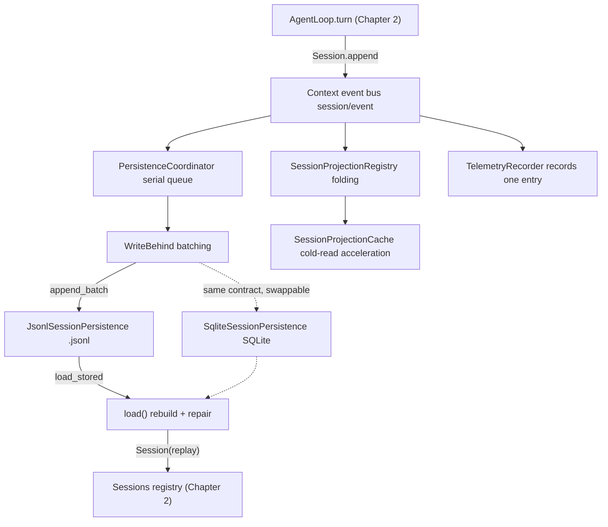
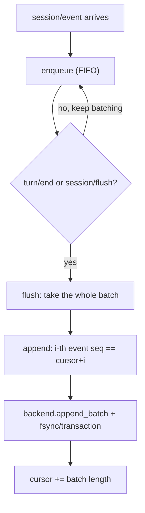
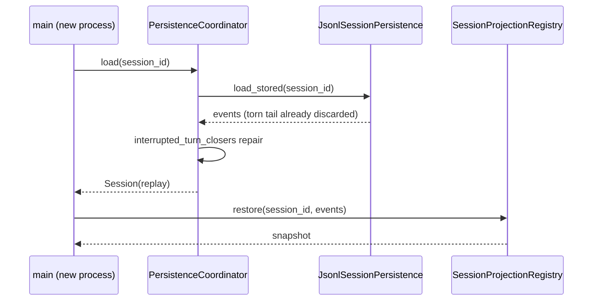

# Chapter 3: Session Event Stream and Persistence Projections (Silent on Write, Traceable on Cold Read)

> Silent on write, traceable on cold read.

## Questions this chapter answers

- After the session event stream lands on disk, how do we guarantee "no loss on power failure, no duplication on retry"?
- After a process restart, how do we read the session back from disk (cold read), and how do we handle half lines and unclosed turns?
- How can the same persistence contract switch between different physical storages (JSONL file / SQLite database)?
- After a cold read, how do we fold the event stream into ready-to-use views like title and telemetry?

The session event stream is an append-only log: writing does not disturb the running loop, and reading can rebuild the session from disk after a process restart. This chapter wires Chapter 2's in-memory event stream to disk — through a replaceable persistence seam (seam: an injection point whose behavior can be swapped out), then uses projections to fold the event stream into queryable views.

Chapter 2 completed the minimal closed loop: one user message in, one assistant reply out, the whole process recorded by `Session.log` as 9 append-only events. But at the end of that chapter, these events only lived in memory — gone when the process exits, and no way for a new process to read them back. This chapter picks up this event log and answers three things: how events land on disk without disturbing the running loop; how to rebuild the session from disk after a process restart (cold read), and how to clean up the mess left by a power failure; how the event stream folds into ready-to-use views like title and telemetry.

Code relationships: this chapter reuses `ch01/code/cordis.py` (`Context`, `Service`) and `ch02/code/agent_loop.py` (`SessionEvent`, `Session`, `Sessions`, `AgentLoop`, `LlmStub`, `SystemPromptService`), and adds `bad_example.py` (counterexample), `session_persistence.py` (persistence and projections), `main.py` (assembly entry point).

## 1. Process Exits, Session Vanishes

First the counterexample: two functions simulate two process lifecycles — the first runs one conversation turn with events going only into the in-memory log; the second tries to cold-read the same session with a brand-new container:

```python
# ch03/code/bad_example.py lines 21-45 (contiguous excerpt; docstring and cross-chapter import path handling at lines 1-19)
def run_first_process():
    """Process 1: assemble the container, run one conversation turn, all events stay in the in-memory log."""
    ctx = Context()
    Sessions(ctx)
    ctx.provide("llm", LlmStub())
    SystemPromptService(ctx)
    ctx.plugin(AgentLoop)
    agent = ctx.agent_loop.create()
    agent.followup("What is Cordis?")
    print(f"Process 1: session={agent.session.id}, in-memory log {len(agent.session.log)} events")
    print("Process 1: process exits — container destroyed, log gone with it")
    return agent.session.id


def run_second_process(session_id):
    """Process 2: brand-new container, tries to cold-read the session left by the previous process."""
    ctx = Context()
    Sessions(ctx)
    session = ctx.sessions.get(session_id)
    print(f"Process 2: cold read {session_id} -> {session}")
    print("Process 2: registry is empty — that conversation 'never happened'")


if __name__ == "__main__":
    run_second_process(run_first_process())
```

Run output (`python3 bad_example.py`):

```text
Process 1: session=session-0001, in-memory log 9 events
Process 1: process exits — container destroyed, log gone with it
Process 2: cold read session-0001 -> None
Process 2: registry is empty — that conversation 'never happened'
```

The second process gets `None`: `Sessions` is just an in-memory dictionary, and the container is destroyed with the process. This leads to this chapter's three problems:

- **Problem ①: the event stream only lives in memory, lost when the process exits, with no way to read it back.** We need a seam to wire events to disk, and to rebuild the session from disk after restart (§3 seam, §4 write path, §5 cold read).
- **Problem ②: disk writes can be interrupted by power failure.** How to guarantee "no loss on power failure, no duplication on retry, no reading torn half-line data"? (§4 seq continuity contract and commit, §5 torn tail discard and interrupted turn repair)
- **Problem ③: what cold read brings back is an event stream, not ready-made views.** Views like title and telemetry must be recomputed event by event. (§7 projection folding)

## 2. Assembly Overview: Write Path and Cold-Read Path

Figure 1 shows this chapter's assembly relationships: Chapter 2's `Session.append` emits `session/event` onto the `Context` event bus, and this chapter hangs three kinds of consumers on this bus — the write path (`PersistenceCoordinator` → `WriteBehind` → backend), the projection registry, and telemetry; the cold-read path goes the other way, from backend back to `Session` and snapshots.



Figure 1: this chapter's assembly overview — the write path goes from the event bus to disk, the cold-read path goes from disk back to sessions and snapshots

Reading order: first the contract (§3), then how to write (§4), how to read (§5), how to swap storage (§6), and finally how views fold (§7).

## 3. seam: Two Replaceable Contracts

The literal meaning of seam is the stitching between two pieces of fabric; in software, a seam means **an injection point whose behavior can be swapped out**: the caller depends only on one contract (a set of method signatures), the concrete implementation is injected from outside and can be replaced wholesale, while the call site doesn't change a single line. Problem ① in §1 needs to wire the event stream to disk, but if business code directly calls "write a JSONL file", it gets nailed to this one storage form: can't switch to SQLite, can't switch to an in-memory fake implementation in tests either. So we leave a seam between "business" and "storage": business code only asks the contract "what to do" (append a batch of events, read back a session); "how to store" is injected from outside, swappable at any time — only then do we have the prerequisites for landing on disk, swapping storage, and testing.

An analogy to build intuition: appliances depend only on the socket specification (two pins, 220V), not on whether the power plant behind the socket is hydro or wind — swap the power plant, and the appliance doesn't change a single line. The seam is the "socket" between business code and storage implementation: the contract is the socket specification, the concrete storage is the swappable "power plant".

### 3.1 Minimal example: same contract, two storages, zero business code changes

The minimal example below demonstrates this assertion: the same append/load contract, two storage forms, the same business function (inline self-contained example, directly runnable; this chapter's formal contract is in §3.2):

```python
# Inline minimal example (self-contained, runnable; not part of the chNN/code/ teaching codebase; formal contract in §3.2)
import json

class MemoryPersistence:                # Storage form 1: events stored in an in-memory dict
    def __init__(self): self.rows = {}
    def append(self, sid, events): self.rows.setdefault(sid, []).extend(events)
    def load(self, sid): return list(self.rows.get(sid, []))

class FilePersistence:                  # Storage form 2: events appended to a disk file, one JSON per line
    def __init__(self, path): self.path = path
    def append(self, sid, events):
        with open(self.path, "a", encoding="utf-8") as f:
            for e in events: f.write(json.dumps([sid, e]) + "\n")
    def load(self, sid):
        with open(self.path, encoding="utf-8") as f:
            return [e for s, e in (json.loads(line) for line in f) if s == sid]

def run_session(persistence, sid):      # Business code: depends only on the contract's "what to do" (append/load)
    persistence.append(sid, [{"type": "user/message"}, {"type": "assistant/message"}])
    return persistence.load(sid)        # Swap in any same-contract implementation, zero changes here

print("Memory form:", run_session(MemoryPersistence(), "s1"))
print("File form:", run_session(FilePersistence("/tmp/seam-demo.jsonl"), "s1"))
```

Run output (first run; the file form is append-only, repeated runs read back accumulated events):

```text
Memory form: [{'type': 'user/message'}, {'type': 'assistant/message'}]
File form: [{'type': 'user/message'}, {'type': 'assistant/message'}]
```

The two `run_session` calls didn't change a single line: it depends only on the two names append/load, neither knowing nor caring whether events went into a dict or a disk file. §6's SQLite replacement is the real-combat version of the same idea — only the contract becomes §3.2's formal `SessionPersistence`/`PersistenceBackend`.

### 3.2 SessionPersistence and PersistenceBackend

This chapter splits this seam into two contract layers: `SessionPersistence` faces business, providing session-level append/load/list; `PersistenceBackend` faces storage, providing batch-level append_batch/load_stored/commit_repair/list. §4's `PersistenceCoordinator` stands between the two layers, translating session-level calls into batch-level writes:

```python
# ch03/code/session_persistence.py lines 33-53 (contiguous excerpt; full module at lines 1-526)
class SessionPersistence(ABC):
    """sessionPersistence seam: the persistence Service Definition (session-persistence/src/index.ts:84).

    The real contract has 11 methods: create/append/load/inspect/readFrom/list/locate etc. (:96-:240);
    [Teaching simplification] the teaching version keeps three:
    - append: append a batch of seq-contiguous events; the first seq must equal the storage's next-seq (:143)
    - load: cold read — read the session back from storage (:183)
    - list: enumerate persisted sessions (:228)
    """

    @abstractmethod
    def append(self, session_id, events):
        """Append a batch of events to storage."""

    @abstractmethod
    def load(self, session_id):
        """Cold-read a session; return None if it doesn't exist."""

    @abstractmethod
    def list(self):
        """Enumerate the list of persisted session_ids."""
```

```python
# ch03/code/session_persistence.py lines 56-77 (contiguous excerpt)
class PersistenceBackend(ABC):
    """Storage adapter contract (PersistenceBackend, coordinator.ts:127).

    The real interface also has locate/close; [Teaching simplification] the teaching version keeps four:
    append_batch / load_stored / commit_repair / list (:184/:144/:193/:199).
    """

    @abstractmethod
    def append_batch(self, session_id, events):
        """Write a batch of events to storage."""

    @abstractmethod
    def load_stored(self, session_id):
        """Read the event list out of storage; return None if it doesn't exist."""

    @abstractmethod
    def commit_repair(self, session_id, events):
        """Persist the repaired event sequence (truncate + rewrite)."""

    @abstractmethod
    def list(self):
        """Enumerate the list of persisted session_ids."""
```

The serialization boundary is also drawn clearly: `event_to_dict`/`dict_to_event` (lines 80-92) are the only two functions that know the `SessionEvent` structure; what backends see is always plain dicts — whether switching to JSONL or SQLite, event modeling is untouched.

### 3.3 Recap

The first half of Problem ① solved: "write in, read back" became a replaceable contract. But the contract doesn't answer "how to write without losing" — that's the write path's job.

## 4. Write Path: write-behind and the seq Continuity Contract

### 4.1 WriteBehind: batching

If every event were written to disk synchronously, the loop would be blocked by disk IO; this chapter uses write-behind (deferred write): events are enqueued first, and taken away as a whole batch at flush time:

```python
# ch03/code/session_persistence.py lines 99-117 (contiguous excerpt)
class WriteBehind:
    """Deferred-write buffer (SessionWriteBehind, session-persistence/src/write-behind.ts:22).

    Events are enqueued first, taken away as a whole batch at flush time.
    [Teaching simplification] The real version flushes in batches on a fixed period (default 200ms, coordinator.ts:30);
    the teaching version is single-threaded synchronous, using "turn/end trigger + session/flush barrier" instead of a timer.
    """

    def __init__(self):
        self.queue = []  # FIFO queue of events pending disk write

    def enqueue(self, event):
        """Enqueue an event (the queue semantics of write-behind.ts:22)."""
        self.queue.append(event)

    def take(self):
        """Take the whole batch out of the queue, returning the event list and clearing it (the batch-taking action of flush)."""
        batch, self.queue = self.queue, []
        return batch
```

### 4.2 PersistenceCoordinator: serial queue and cursor

The coordinator subscribes to `session/event` and enqueues one by one; turn/end or session/flush triggers flush; after flush takes the batch it delegates to `append`, and the seq continuity contract lives inside `append` — the i-th event in the batch must be exactly cursor+i, otherwise it is rejected on the spot (this is the basis for "no duplication on retry"). The whole write path is shown in Figure 2:

```python
# ch03/code/session_persistence.py lines 120-165 (contiguous excerpt; load and interrupted turn repair in §5.1)
class PersistenceCoordinator(Service, SessionPersistence):
    """Persistence coordinator: the hub from event stream to disk (coordinator.ts:588), bound as ctx.sessionPersistence.

    Write path: installWritePath subscribes to session/event (:1086/:1123) → events enter the WriteBehind queue
    → flush takes the batch (:1325) → appendCore validates seq continuity (:682/:698-702) → backend.append_batch.
    Read path: load cold read (:756) → backend.load_stored → repair interrupted turns (prepareCore :892).
    """

    def __init__(self, ctx, backend):
        super().__init__(ctx, "sessionPersistence")  # Real binding name (session-persistence/src/index.ts:86)
        self.backend = backend
        self.cursors = {}  # session_id -> highest persisted seq boundary (cursor, appendCore :705-708)
        self.writes = {}   # session_id -> WriteBehind queue
        self.install_write_path()

    def install_write_path(self):
        """Subscribe to session events, steering the event stream toward disk (installWritePath, coordinator.ts:1086)."""
        self.ctx.on("session/event", self._on_event)   # Every event enqueued (:1123-1126)
        self.ctx.on("session/flush", self.flush)       # session/flush = immediate disk-write barrier (:1129)

    def _on_event(self, event):
        """On receiving session/event: enqueue, and trigger batch disk write when the turn ends."""
        queue = self.writes.setdefault(event.session_id, WriteBehind())
        queue.enqueue(event)
        if event.type == "turn/end":
            # [Teaching decision] Use turn/end as the batch boundary; the real version uses a fixed 200ms period (coordinator.ts:30)
            self.flush(event.session_id)

    def flush(self, session_id):
        """flush: take all events in the queue, write to disk in batch (coordinator.ts:1325)."""
        queue = self.writes.get(session_id)
        batch = queue.take() if queue else []
        if batch:
            self.append(session_id, batch)

    def append(self, session_id, events):
        """appendCore: seq continuity contract + transactional cursor (coordinator.ts:682)."""
        cursor = self.cursors.get(session_id, 0)
        for i, event in enumerate(events):
            # seq continuity assertion: the i-th event in the batch must be exactly cursor+i (:698-702)
            if event.seq != cursor + i:
                raise ValueError(
                    f"append seq broken in {session_id!r}: expected {cursor + i}, got {event.seq}"
                )
        self.backend.append_batch(session_id, events)      # Delegate disk write to the adapter (:704)
        self.cursors[session_id] = cursor + len(events)    # Advance cursor only after disk write succeeds (:705-708)
```



Figure 2: write path — events are enqueued first, batch-flushed when the trigger condition is met, and the cursor advances only after the disk write succeeds

### 4.3 Recap

The three promises of Problem ② land here: **no loss on power failure** — JSONL's `append_batch` fsyncs after appending (lines 230-248), SQLite returns only after the transaction commits; **no duplication on retry** — the seq contract rejects already-written ranges; **loop not blocked** — write-behind separates enqueuing from disk writing, and the loop only does one enqueue per event.

## 5. Cold-Read Path: load, Torn Tail, and Interrupted Turn Repair

### 5.1 load: rebuilding Session from disk

```python
# ch03/code/session_persistence.py lines 167-186 (contiguous excerpt; class PersistenceCoordinator at lines 120-165)
    def load(self, session_id):
        """Cold read: load_stored → repair interrupted turns → rebuild Session via replay (load :756, prepareCore :892)."""
        events = self.backend.load_stored(session_id)
        if events is None:
            return None
        closers = interrupted_turn_closers(events)
        if closers:
            # Synthesize closing events for unclosed turns, and persist them together with the repair (commitRepair)
            next_seq = len(events)
            repaired = events + [
                SessionEvent(session_id, next_seq + i, c["type"], c["payload"])
                for i, c in enumerate(closers)
            ]
            self.backend.commit_repair(session_id, repaired)
            events = repaired
        session = Session(self.ctx, session_id)
        # [Teaching simplification] replay writes log directly instead of going through append — avoids re-broadcasting session/event and causing a second disk write
        session.log.extend(events)
        self.cursors[session_id] = len(events)  # adopt: align cursor with disk (adopt :1036)
        return session
```

Three steps: `load_stored` reads events back → `interrupted_turn_closers` detects unclosed turns and synthesizes closing events, persisting them together with the repair via `commit_repair` → `Session` is rebuilt via replay. Note that replay writes `log` directly instead of going through `append` — avoiding re-broadcasting `session/event` and causing a second disk write.

### 5.2 Two repair rules

The mess left by power failure comes in two forms, handled at different layers respectively (Figure 3 gives the complete sequence):

**Torn tail (half line) is discarded at the storage layer.** JSONL's `load_stored` parses line by line; if the last line's JSON is incomplete, it stops right there — that event was never successfully written in the first place:

```python
# ch03/code/session_persistence.py lines 250-267 (contiguous excerpt; class JsonlSessionPersistence at lines 213-285)
    def load_stored(self, session_id):
        """Line-by-line scan + torn tail recovery (loadStored, jsonl/index.ts:209).

        [Teaching simplification] The real version decodes zstd frames and scans with SessionLogScanner; torn tail frames
        are recovered via tornMarker (:348/:407-410); the teaching version is plaintext line-by-line: the last half line
        that fails to parse is discarded as a torn tail.
        """
        path = self.log_path(session_id)
        if not path.exists():
            return None
        events = []
        for line in path.read_text(encoding="utf-8").splitlines():
            if not line.strip():
                continue
            try:
                events.append(dict_to_event(json.loads(line)))
            except json.JSONDecodeError:
                break  # Torn tail: stop here (corresponds to tornMarker.truncateTo semantics)
        return events
```

**Interrupted turns are repaired at the seam layer.** If the last turn has turn/start but no turn/end, synthesize one turn/end (reason=interrupted):

```python
# ch03/code/session_persistence.py lines 193-206 (contiguous excerpt)
def interrupted_turn_closers(events):
    """Detect unclosed turns, returning the closing events to synthesize (prepareCore, coordinator.ts:892).

    [Teaching simplification] The real version synthesizes multiple closers such as turn/end and step/end; the teaching version only patches turn/end.
    """
    open_turn = False
    for event in events:
        if event.type == "turn/start":
            open_turn = True
        elif event.type == "turn/end":
            open_turn = False
    if not open_turn:
        return []
    return [{"type": "turn/end", "payload": {"reason": "interrupted"}}]
```



Figure 3: cold-read sequence — the storage layer discards the torn tail, the seam layer repairs interrupted turns, the projection layer rebuilds the snapshot

### 5.3 Recap

The second half of Problem ① solved: cold read not only brings back the event stream, but also cleans up the two kinds of mess left by power failure along the way, handing over a well-formed session.

## 6. SQLite Backend: Same Contract, Different Physical Form

The value of the seam is proven by "swappability": replace `append_batch` with a SQLite transaction, and the upper-layer coordinator doesn't change a single line:

```python
# ch03/code/session_persistence.py lines 316-333 (contiguous excerpt; class SqliteSessionPersistence at lines 288-314)
    def append_batch(self, session_id, events):
        """Single-transaction batch write: BEGIN → INSERT events → revision+1 → COMMIT (appendBatch, sqlite/index.ts:284)."""
        with self.conn:  # sqlite3's with block is exactly a single transaction: commit on success, rollback on failure
            self.conn.execute(
                "INSERT INTO sessions (session_id) VALUES (?) ON CONFLICT(session_id) DO NOTHING",
                (session_id,),
            )
            self.conn.executemany(
                "INSERT INTO events (session_id, seq, type, payload) VALUES (?, ?, ?, ?)",
                [
                    (e.session_id, e.seq, e.type, json.dumps(e.payload, ensure_ascii=False))
                    for e in events
                ],
            )
            self.conn.execute(
                "UPDATE sessions SET revision = revision + 1 WHERE session_id = ?",
                (session_id,),
            )
```

The seq contract is unchanged (still validated by the coordinator's `append`); the commit switches from fsync to transaction COMMIT, and `load_stored` switches from line-by-line parsing to `ORDER BY seq` (lines 335-351). The stage 7 output in §8 verifies this replacement: 12 events written and read back, `list()` enumerates session-0001.

## 7. Projections: Folding the Event Stream into Queryable Views

### 7.1 SessionProjectionRegistry: register, drive, restore

Problem ③: what cold read brings back is an event stream, but what the UI wants is a view like `{"title": ...}`. The registry splits views into projection units (init/apply/view), folding event by event:

```python
# ch03/code/session_persistence.py lines 390-396 (contiguous excerpt; class SessionProjectionRegistry at lines 375-388)
    def register(self, key, init, apply, view):
        """Register one projection unit (register, index.ts:194)."""
        self._definitions[key] = {"init": init, "apply": apply, "view": view}

    def _on_event(self, event):
        """On receiving session/event: drive all projection units of that session."""
        self.drive(event.session_id, event)
```

```python
# ch03/code/session_persistence.py lines 398-425 (contiguous excerpt)
    def drive(self, session_id, event):
        """Fold one event into each unit's state (private drive, index.ts:405)."""
        states = self._states.setdefault(session_id, {})
        for key, definition in self._definitions.items():
            state = states.get(key)
            if state is None:
                state = definition["init"]()  # init before the first drive
            states[key] = definition["apply"](state, event)

    def restore(self, session_id, events):
        """Cold read: rebuild the snapshot by folding from the beginning of the event sequence (restore, index.ts:355)."""
        states = {}
        for key, definition in self._definitions.items():
            state = definition["init"]()
            for event in events:
                state = definition["apply"](state, event)
            states[key] = state
        self._states[session_id] = states
        return self.snapshot(session_id)

    def snapshot(self, session_id):
        """Compose each unit's view into a snapshot map (snapshot, index.ts:248; SessionProjectionMap, types.ts:17)."""
        states = self._states.get(session_id, {})
        return {
            key: definition["view"](states[key])
            for key, definition in self._definitions.items()
            if key in states
        }
```

`drive` is live folding (one event at a time), `restore` is cold-read folding (replay from the beginning), `snapshot` composes each unit's state into a map. apply is a pure synchronous function: same input always yields same output, which guarantees live folding and cold-read folding produce the same result.

### 7.2 Cache, title unit, and telemetry

Cold read doesn't have to fold from scratch every time: `SessionProjectionCache` (lines 428-460) force-writes the cache at `turn/end`; cold read first checks `cached_snapshot`, and on miss `cold_snapshot` builds it once and writes it back. The title unit is the first projection unit; `title_apply` (lines 472-480) only does last-wins folding on `session/title` events:

```python
# ch03/code/session_persistence.py lines 472-480 (contiguous excerpt)
def title_apply(state, event):
    """The title unit's apply: only does last-wins folding on session/title events.

    Corresponds to foldSessionTitle (session-title/src/index.ts:191);
    apply is a pure synchronous function (index.ts:42); other events return the state unchanged.
    """
    if event.type == "session/title":
        return event.payload["title"]  # last-wins: a later title overwrites the earlier one
    return state
```

The snippet above is the full picture of title folding: when a `session/title` event arrives, the new title overwrites the old state; other events return unchanged. The title itself is also an event — `SessionTitleService.generate` (lines 500-508) truncates the first user message to generate the title, then enters the stream as a `session/title` event, landing on disk and folding together with the rest of the events, with no special channel opened along the way. Telemetry (`TelemetryRecorder`, lines 511-526) is just another `session/event` consumer, recording one entry per event.

### 7.3 Recap

Problem ③ solved: views are not stored as a separate copy, but folded out of the event stream — as long as the event stream exists, any view can be rebuilt.

## 8. Full Run Output

### 8.1 Actual output

Run command: `cd ch03/code && python3 main.py` (entry point `main.py` is 133 lines in total, 8 stages; the output below is the actual run result, unedited):

Stage 1 first wires up seam/backend/coordinator/projections/cache/title/telemetry, then registers `Sessions`/`llm`/`systemPrompt` and mounts the `AgentLoop` plugin:

```python
# ch03/code/main.py lines 43-58 (stage 1 assembly; full 8 stages in ch03/code/main.py)
    # -- 1. Assembly: seam + JSONL backend + write path --
    print("== 1. Assembly: seam + JSONL backend + write path ==")
    ctx = Context()
    backend = JsonlSessionPersistence(root)
    coordinator = PersistenceCoordinator(ctx, backend)  # Bound as ctx.sessionPersistence
    registry = SessionProjectionRegistry(ctx)
    SessionTitleService(ctx, registry)                  # Registers the title projection unit
    cache = SessionProjectionCache(ctx, registry)
    telemetry = TelemetryRecorder(ctx)
    Sessions(ctx)
    ctx.provide("llm", LlmStub())
    SystemPromptService(ctx)
    ctx.systemPrompt.section("identity", "You are a minimal teaching agent, standard library only, no tools.", order=0)
    ctx.plugin(AgentLoop)
    print("  ctx.sessionPersistence -> PersistenceCoordinator(backend=JsonlSessionPersistence)")
    print("  Write path: session/event -> WriteBehind enqueue -> turn/end batch flush")
```

```text
== 1. Assembly: seam + JSONL backend + write path ==
  ctx.sessionPersistence -> PersistenceCoordinator(backend=JsonlSessionPersistence)
  Write path: session/event -> WriteBehind enqueue -> turn/end batch flush

== 2. Run one conversation turn: event stream flows to disk ==
  session=session-0001: 9 events in memory (seq 0-8)
  turn/end triggers batch flush: cursor=9
  9 lines on disk (one JSON event per line)
  First line: {"session_id": "session-0001", "seq": 0, "type": "turn/start", "payload": {}}
  Last line: {"session_id": "session-0001", "seq": 8, "type": "turn/end", "payload": {"reason": "completed"}}

== 3. Generate title: session/title enters the event stream ==
  Generated title: 'What is Cordis' (session/title seq=9, enqueued, not yet flushed)
  10 lines on disk after session/flush
  Live snapshot: {'title': 'What is Cordis'}

== 4. Cold read: simulating process restart ==
  Cold read: rebuilt session=session-0001, 10 events (replayed from disk)
  Cache lookup: None
  cold_snapshot built: {'title': 'What is Cordis'}
  Cache lookup again: hit=True

== 5. Interrupted turn repair: power failure leaves an unclosed turn ==
  Manually appended turn/start (seq=10); cold read repairs to 12 events
  Synthesized closer: turn/end {'reason': 'interrupted'}
  commitRepair persisted: 12 lines on disk

== 6. Torn write: half-line tail discarded ==
  After manually appending a half line, load_stored reads back 12 events (half line discarded)

== 7. Switch to SQLite: same contract, different storage ==
  append_batch writes to sessions.db: 12 events
  load_stored reads back 12 events (ORDER BY seq)
  list(): ['session-0001']

== 8. Telemetry: yet another session/event consumer ==
  10 telemetry records in total
  Last record: {'session_id': 'session-0001', 'seq': 9, 'type': 'session/title'}
```

### 8.2 Reading the output segment by segment

1. **Stages 1-3 (assembly, write path, title)**: the coordinator is injected as `ctx.sessionPersistence` (backend JSONL, seam in place); 9 events (seq 0-8) land on disk via the turn/end flush with cursor=9; `session/title` (seq=9) enters the stream as an event, 10 lines on disk after session/flush, and the live snapshot folds out the title — corresponding to §4, §7.
2. **Stages 4-6 (cold read and repair)**: cold read rebuilds 10 events; after a cache miss, `cold_snapshot` builds it and hits again; manually appending turn/start simulates power failure, cold read repairs to 12 events and persists via commitRepair; the torn half-line tail is discarded, and the read-back is still 12 events — corresponding to §5, §5.2, §7.2.
3. **Stage 7 (storage swap)**: SQLite round-trips 12 events, `list()` enumerates session-0001 — corresponding to §6.
4. **Stage 8 (telemetry)**: 10 records in total (9 turn events + 1 session/title), and the last record is exactly session/title seq=9 — corresponding to §7.2.

### 8.3 Reader exercises

1. Remove `session/flush` in stage 3, and observe when the title event lands on disk (hint: WriteBehind's trigger conditions).
2. Change the manually appended event in stage 5 to `assistant/message`, and observe whether `interrupted_turn_closers` still synthesizes a closing event.
3. Add a new projection unit `count` to the registry (apply accumulates the event count), and verify that the live snapshot and the cold-read snapshot agree.

## 9. Source Mapping

| Mechanism | Source location | Teaching-version difference |
|------|----------|----------------|
| Event modeling | packages/core/session/src/types.ts:404/:236 | TS uses discriminated union + JSON validation on append + deep freeze; teaching version uses dataclass + typed dict |
| Session.append | packages/core/session/src/index.ts:604 | TS has snapshot validation + post-commit dispatch + observer failure isolation; teaching version uses append + synchronous callbacks |
| seam abstraction | packages/session/session-persistence/src/index.ts:84 | TS contract has 11 methods: create/append/load/inspect/readFrom/list/locate etc.; teaching version keeps append/load/list |
| write-behind | packages/session/session-persistence/src/write-behind.ts:22 | TS default period 200ms + retention on failure; teaching version uses turn/end + session/flush instead of a timer |
| Coordinator | packages/session/session-persistence/src/coordinator.ts:588 | TS per-id serialization + seq assertion (:698-702) + cursor advance (:705-708) + prepareCore repair (:892); teaching version keeps serial queue + cursor contract + closer patching |
| JSONL materialization | packages/session/session-persistence-jsonl/src/index.ts:514/:529 | TS first write goes through temp+fsync → atomic publish via hard link → directory fsync; teaching version appends plaintext lines directly, no atomic publish step |
| JSONL append | packages/session/session-persistence-jsonl/src/index.ts:651 | TS appends zstd frames + fsync + rollback file size on failure (:681); teaching version appends plaintext + flush, keeping rollback semantics |
| JSONL cold read | packages/session/session-persistence-jsonl/src/index.ts:209/:348 | TS stable read + frame-by-frame decoding + torn tail frame recovery (tornMarker); teaching version discards the last incomplete line |
| SQLite persistence | packages/session/session-persistence-sqlite/src/index.ts:284 | TS single-transaction INSERT + revision+1; teaching version likewise uses transactional batch INSERT |
| Cold-read repair | packages/session/session-persistence/src/coordinator.ts:892; jsonl :436; sqlite :309 | TS synthesizes closers → commitRepair truncate + fill; teaching version detects unclosed turns and patches turn/end |
| Projection apply | packages/session/session-projection/src/index.ts:42 | TS init/apply/view pure synchronous + same reference means no change + eager drive (:181/:405); teaching version uses init/apply/view + registry |
| Projection cache | packages/session/session-projection-cache/src/index.ts:71 | TS persisted checkpoint (ver/seq/val) + count/time throttling (:201-239); teaching version keeps the cache in memory |
| Title projection | packages/session/session-title/src/index.ts:261/:191/:308 | TS provider is replaceable and can call a model to generate; teaching version truncates the first user message |

## 10. Summary and Preview

### 10.1 Chapter summary

| Mechanism | In one sentence | Source |
|------|-----------|------|
| SessionPersistence seam | Business only sees append/load/list; the storage form is swappable | session-persistence/src/index.ts:84 |
| PersistenceBackend | The four-piece set append_batch/load_stored/commit_repair/list | coordinator.ts:127 |
| WriteBehind | Events are enqueued and batched first; turn/end and session/flush trigger flush | write-behind.ts:22 |
| PersistenceCoordinator | Serial queue + seq continuity contract; cursor advances only after disk write succeeds | coordinator.ts:588 |
| load cold read | load_stored → repair → replay, without triggering the event bus | coordinator.ts:756 |
| Interrupted turn repair | Unclosed turns synthesize turn/end(interrupted) and commit_repair | coordinator.ts:892 |
| SessionProjectionRegistry | init/apply/view fold the event stream into snapshots | session-projection/src/index.ts:171 |
| SessionProjectionCache | Force-write the cache at turn/end; cold read checks the cache first | session-projection-cache/src/index.ts:71 |

This chapter used 704 lines of standard-library Python (session_persistence.py 526 + main.py 133 + bad_example.py 45) to complete the closed loop of "silent on write, traceable on cold read". §1's three problems each land: the event stream is wired to disk through the seam and can be cold-read (Problem ①); write-behind + seq contract + commit guarantee no loss on power failure and no duplication on retry, while torn tail discard and interrupted turn repair clean up the aftermath of power failure (Problem ②); projections fold the event stream into queryable views like title and telemetry (Problem ③). Every mechanism can find its corresponding line in §8's output.

### 10.2 Next chapter preview

This chapter's loop is still "one message in, one reply out": the model can only reply, not act. The next chapter, "Tool Registration and Execution Pipeline", gives the model tools to acquire and invoke: `ctx.tools` scoped registration, tool schema injection into system-prompt, and the guard execution pipeline (pre-execute/execute/post-execute). Multi-step loops (step no longer always returns completed) will be completed in later chapters.

## 11. Appendix: Quick Reference for Key Concepts

Arranged by this chapter's four-layer dependency order (contract layer → write path → cold-read path → projection layer):

| Layer | Concept | Definition | First appearance |
|------|------|------|----------|
| Contract layer | seam | An injection point whose behavior can be swapped out: business depends on the contract, not the implementation | §3 |
| Contract layer | SessionPersistence | Business-facing persistence contract: append/load/list | §3.2 |
| Contract layer | PersistenceBackend | Storage-facing adapter contract: append_batch/load_stored/commit_repair/list | §3.2 |
| Contract layer | event_to_dict/dict_to_event | Serialization boundary: the only two functions that know the SessionEvent structure | §3.2 |
| Write path | write-behind (deferred write) | Events are enqueued first, written to disk in batch when the trigger condition is met | §4.1 |
| Write path | cursor | The highest persisted seq boundary; advances only after disk write succeeds | §4.2 |
| Write path | seq continuity contract | The i-th event in the batch must be exactly cursor+i, otherwise rejected — the basis for no duplication on retry | §4.2 |
| Cold-read path | cold read | Rebuilding the session from storage after a process restart | §5.1 |
| Cold-read path | replay | Rebuilding Session by writing log directly, without going through append or re-broadcasting events | §5.1 |
| Cold-read path | torn tail | A half-line write left by power failure; discarded when parsing fails at the storage layer | §5.2 |
| Cold-read path | interrupted turn repair | Unclosed turns synthesize turn/end(reason=interrupted) and persist it | §5.2 |
| Projection layer | projection unit | The init/apply/view three-piece set: views are folded out of the event stream | §7.1 |
| Projection layer | drive/restore | Live folding (event by event) and cold-read folding (replay from the beginning) | §7.1 |
| Projection layer | snapshot | The snapshot map composed of each unit's view | §7.1 |
| Projection layer | last-wins | Later state overwrites earlier — the folding semantics of the title unit | §7.2 |
