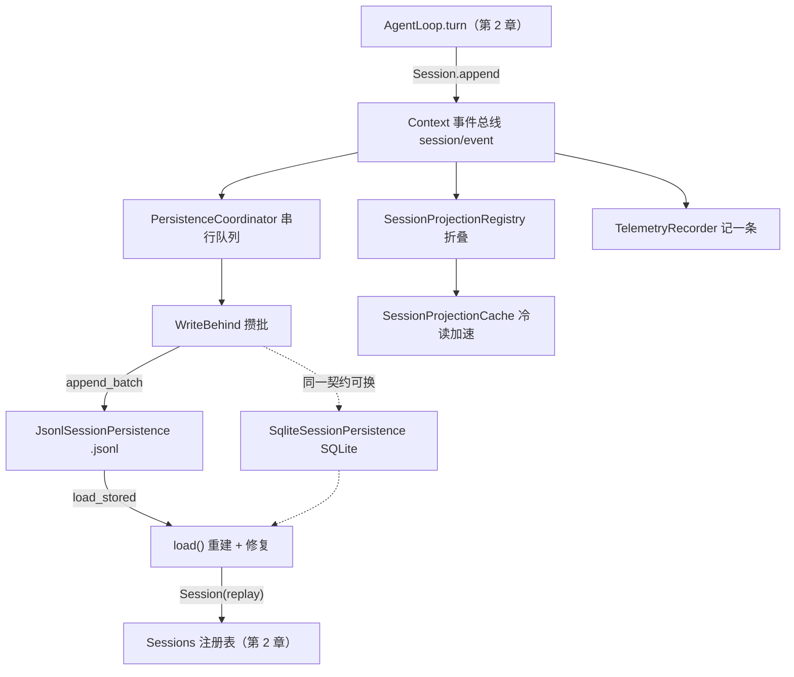
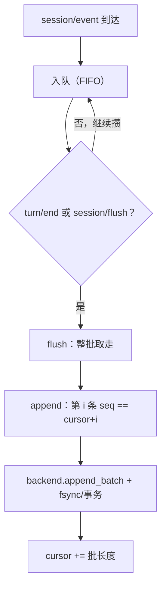
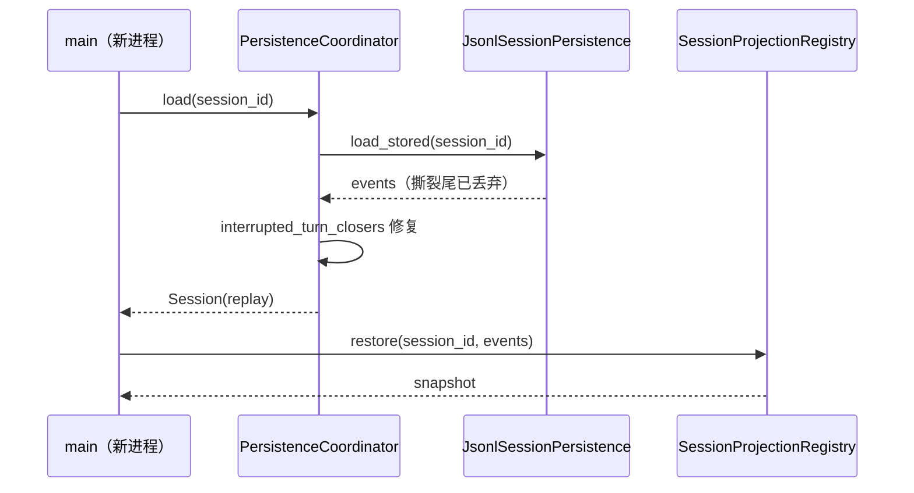

# 第 3 章 session 事件流与持久化投影（写时无声，冷读有迹）

> 写时无声，冷读有迹。

## 本章回答的问题

- 会话事件流落盘后，如何保证「断电不丢、重试不重」？
- 进程重启后，如何把会话从磁盘读回来（冷读），半行与未闭合的 turn 怎么处理？
- 同一份持久化契约，如何换用不同的物理存储（JSONL 文件 / SQLite 数据库）？
- 冷读之后，如何把事件流折叠成标题、遥测等可直接使用的视图？

会话事件流是一条 append-only 日志：写的时候不打扰运行中的循环，读的时候能在进程重启后从磁盘把会话重建回来。本章把第 2 章的内存事件流接上磁盘——经由一个可替换的持久化 seam（seam：可被替换行为的注入点），再用投影把事件流折叠成可查询的视图。

第 2 章完成了最小闭环：一条用户消息进，一条助手回复出，整个过程被 `Session.log` 以 9 条 append-only 事件记下。但那一章结束时，这些事件只活在内存里——进程退出即丢，新进程也无从读回。本章接住这条事件日志，回答三件事：事件如何不打扰运行循环地落盘；进程重启后如何从磁盘重建会话（冷读），断电留下的烂摊子如何收拾；事件流如何折叠成标题、遥测等可直接使用的视图。

代码关系：本章复用 `ch01/code/cordis.py`（`Context`、`Service`）与 `ch02/code/agent_loop.py`（`SessionEvent`、`Session`、`Sessions`、`AgentLoop`、`LlmStub`、`SystemPromptService`），新增 `bad_example.py`（反面示例）、`session_persistence.py`（持久化与投影）、`main.py`（装配入口）。

## 1. 进程退出，会话消失

先看反面示例：用两个函数模拟两次进程生命周期——第一个跑一轮对话，事件只进内存日志；第二个用全新容器冷读同一个会话：

```python
# ch03/code/bad_example.py 第 21-45 行（连续摘录；docstring 与跨章导入路径处理见第 1-19 行）
def run_first_process():
    """进程 1：装配容器、跑一轮对话，事件全部留在内存日志。"""
    ctx = Context()
    Sessions(ctx)
    ctx.provide("llm", LlmStub())
    SystemPromptService(ctx)
    ctx.plugin(AgentLoop)
    agent = ctx.agent_loop.create()
    agent.followup("什么是 Cordis？")
    print(f"进程 1：session={agent.session.id}，内存日志 {len(agent.session.log)} 条事件")
    print("进程 1：进程退出——容器销毁，日志随之消失")
    return agent.session.id


def run_second_process(session_id):
    """进程 2：全新容器，尝试冷读上一个进程留下的会话。"""
    ctx = Context()
    Sessions(ctx)
    session = ctx.sessions.get(session_id)
    print(f"进程 2：冷读 {session_id} -> {session}")
    print("进程 2：注册表空空如也——那场对话「从未发生过」")


if __name__ == "__main__":
    run_second_process(run_first_process())
```

运行输出（`python3 bad_example.py`）：

```text
进程 1：session=session-0001，内存日志 9 条事件
进程 1：进程退出——容器销毁，日志随之消失
进程 2：冷读 session-0001 -> None
进程 2：注册表空空如也——那场对话「从未发生过」
```

第二个进程拿到 `None`：`Sessions` 只是内存字典，容器随进程销毁。由此引出本章三个问题：

- **问题 ①：事件流只活在内存，进程退出即丢，且无从读回。** 需要一条 seam 把事件接到磁盘，并能在重启后从磁盘重建会话（§3 seam、§4 写路径、§5 冷读）。
- **问题 ②：磁盘写入可能被断电打断。** 如何保证「断电不丢、重试不重、不读出半行撕裂数据」？（§4 seq 连续契约与提交、§5 撕裂尾丢弃与中断 turn 修复）
- **问题 ③：冷读拿回的是事件流，不是现成视图。** 标题、遥测等视图要逐事件重算。（§7 投影折叠）

## 2. 装配总览：写路径与冷读路径

图 1 是本章的装配关系：第 2 章的 `Session.append` 把 `session/event` 发到 `Context` 事件总线，本章在这条总线上挂了三类消费者——写路径（`PersistenceCoordinator` → `WriteBehind` → 后端）、投影注册表、遥测；冷读路径则反向，从后端回到 `Session` 与快照。



图 1：本章装配总览——写路径从事件总线到磁盘，冷读路径从磁盘回到会话与快照

阅读顺序：先看契约（§3），再看怎么写（§4）、怎么读（§5）、怎么换存储（§6），最后看视图怎么折叠（§7）。

## 3. seam：两个可替换的契约

seam 本义「接缝」——两块布料之间的缝合处；软件里的 seam 指**可被替换行为的注入点**：调用方只依赖一份契约（一组方法签名），具体实现从外部注入、可以整体更换，而调用处一行不动。§1 的问题 ① 要把事件流接上磁盘，但若业务代码直接调用「写 JSONL 文件」，就被钉死在这一种存储形态上：换不了 SQLite，测试时也换不成内存假实现。因此在「业务」与「存储」之间留一条 seam：业务代码只问契约的「做什么」（追加一批事件、读回一个会话），「怎么存」由外部注入、随时可换——这才有了能落盘、能换存储、能测试的前提。

打个比方建立直觉：家电只依赖插座的规格（两孔、220V），不依赖插座背后的电厂是水电还是风电——换了电厂，家电一行不用改。seam 就是业务代码与存储实现之间的「插座」：契约是插座规格，具体存储是可换的「电厂」。

### 3.1 最小示例：同一契约换两种存储，业务代码零改动

下面的最小示例演示这个论断：同一份 append/load 契约、两种存储形态、同一个业务函数（行内自包含示例，可直接运行；本章正式契约见 §3.2）：

```python
# 行内最小示例（自包含、可运行；不属于 chNN/code/ 教学代码库；正式契约见 §3.2）
import json

class MemoryPersistence:                # 存储形态 1：事件存进内存字典
    def __init__(self): self.rows = {}
    def append(self, sid, events): self.rows.setdefault(sid, []).extend(events)
    def load(self, sid): return list(self.rows.get(sid, []))

class FilePersistence:                  # 存储形态 2：事件追加到磁盘文件，一行一个 JSON
    def __init__(self, path): self.path = path
    def append(self, sid, events):
        with open(self.path, "a", encoding="utf-8") as f:
            for e in events: f.write(json.dumps([sid, e]) + "\n")
    def load(self, sid):
        with open(self.path, encoding="utf-8") as f:
            return [e for s, e in (json.loads(line) for line in f) if s == sid]

def run_session(persistence, sid):      # 业务代码：只依赖契约的「做什么」（append/load）
    persistence.append(sid, [{"type": "user/message"}, {"type": "assistant/message"}])
    return persistence.load(sid)        # 换成任何同契约实现，此处零改动

print("内存形态:", run_session(MemoryPersistence(), "s1"))
print("文件形态:", run_session(FilePersistence("/tmp/seam-demo.jsonl"), "s1"))
```

运行输出（首次运行；文件形态是 append-only，重复运行会读回累积的事件）：

```text
内存形态: [{'type': 'user/message'}, {'type': 'assistant/message'}]
文件形态: [{'type': 'user/message'}, {'type': 'assistant/message'}]
```

两次 `run_session` 调用一行未改：它只依赖 append/load 两个名字，不知道也不关心事件进了字典还是磁盘文件。§6 的 SQLite 替换就是同一思路的实战版——只是契约换成了 §3.2 的正式 `SessionPersistence`/`PersistenceBackend`。

### 3.2 SessionPersistence 与 PersistenceBackend

本章把这条 seam 拆成两层契约：`SessionPersistence` 面向业务，给会话级的 append/load/list；`PersistenceBackend` 面向存储，给批级的 append_batch/load_stored/commit_repair/list。§4 的 `PersistenceCoordinator` 站在两层之间，把会话级调用翻译成批级写入：

```python
# ch03/code/session_persistence.py 第 33-53 行（连续摘录；完整模块见第 1-526 行）
class SessionPersistence(ABC):
    """sessionPersistence seam：持久化的 Service Definition（session-persistence/src/index.ts:84）。

    真实契约有 create/append/load/inspect/readFrom/list/locate 等 11 个方法（:96-:240）；
    [教学简化] 教学版保留三个：
    - append：追加一批 seq 连续的事件，首条 seq 必须等于存储的 next-seq（:143）
    - load：冷读——从存储把会话读回来（:183）
    - list：枚举已持久化的会话（:228）
    """

    @abstractmethod
    def append(self, session_id, events):
        """追加一批事件到存储。"""

    @abstractmethod
    def load(self, session_id):
        """冷读会话；不存在返回 None。"""

    @abstractmethod
    def list(self):
        """枚举已持久化的 session_id 列表。"""
```

```python
# ch03/code/session_persistence.py 第 56-77 行（连续摘录）
class PersistenceBackend(ABC):
    """存储适配器契约（PersistenceBackend，coordinator.ts:127）。

    真实接口还有 locate/close；[教学简化] 教学版保留四个：
    append_batch / load_stored / commit_repair / list（:184/:144/:193/:199）。
    """

    @abstractmethod
    def append_batch(self, session_id, events):
        """把一批事件写入存储。"""

    @abstractmethod
    def load_stored(self, session_id):
        """从存储读出事件列表；不存在返回 None。"""

    @abstractmethod
    def commit_repair(self, session_id, events):
        """把修复后的事件序列落盘（截断 + 补写）。"""

    @abstractmethod
    def list(self):
        """枚举已持久化的 session_id 列表。"""
```

序列化边界也划清了：`event_to_dict`/`dict_to_event`（第 80-92 行）是仅有的两个认识 `SessionEvent` 结构的函数，后端见到的永远是普通 dict——换 JSONL 还是 SQLite，都不碰事件建模。

### 3.3 回顾

问题 ① 的前半解决：「写进去、读回来」成了可替换的契约。但契约没有回答「怎么写才不丢」——那是写路径的事。

## 4. 写路径：write-behind 与 seq 连续契约

### 4.1 WriteBehind：攒批

若每个事件同步写盘，循环会被磁盘 IO 卡住；本章用 write-behind（延迟写）：事件先入队，flush 时整批取走：

```python
# ch03/code/session_persistence.py 第 99-117 行（连续摘录）
class WriteBehind:
    """延迟写缓冲（SessionWriteBehind，session-persistence/src/write-behind.ts:22）。

    事件先入队，flush 时整批取走。
    [教学简化] 真实版按固定周期批量 flush（默认 200ms，coordinator.ts:30）；
    教学版单线程同步，用「turn/end 触发 + session/flush 屏障」代替定时器。
    """

    def __init__(self):
        self.queue = []  # 待落盘事件的 FIFO 队列

    def enqueue(self, event):
        """事件入队（write-behind.ts:22 的队列语义）。"""
        self.queue.append(event)

    def take(self):
        """整批取走队列，返回事件列表并清空（flush 的取批动作）。"""
        batch, self.queue = self.queue, []
        return batch
```

### 4.2 PersistenceCoordinator：串行队列与 cursor

协调器订阅 `session/event` 逐条入队，turn/end 或 session/flush 触发 flush；flush 取批后委托 `append`，seq 连续契约就在 `append` 里——批内第 i 条必须恰好是 cursor+i，否则当场拒绝（这是「重试不重」的依据）。整条写路径如图 2：

```python
# ch03/code/session_persistence.py 第 120-165 行（连续摘录；load 与中断 turn 修复见 §5.1）
class PersistenceCoordinator(Service, SessionPersistence):
    """持久化协调器：事件流到磁盘的中枢（coordinator.ts:588），绑定为 ctx.sessionPersistence。

    写路径：installWritePath 订阅 session/event（:1086/:1123）→ 事件入 WriteBehind 队列
    → flush 取批（:1325）→ appendCore 校验 seq 连续（:682/:698-702）→ backend.append_batch。
    读路径：load 冷读（:756）→ backend.load_stored → 修复中断 turn（prepareCore :892）。
    """

    def __init__(self, ctx, backend):
        super().__init__(ctx, "sessionPersistence")  # 真实绑定名（session-persistence/src/index.ts:86）
        self.backend = backend
        self.cursors = {}  # session_id -> 已落盘的最高 seq 边界（cursor，appendCore :705-708）
        self.writes = {}   # session_id -> WriteBehind 队列
        self.install_write_path()

    def install_write_path(self):
        """订阅会话事件，把事件流引向磁盘（installWritePath，coordinator.ts:1086）。"""
        self.ctx.on("session/event", self._on_event)   # 每个事件入队（:1123-1126）
        self.ctx.on("session/flush", self.flush)       # session/flush = 立即落盘屏障（:1129）

    def _on_event(self, event):
        """收到 session/event：入队，并在 turn 结束时触发批量落盘。"""
        queue = self.writes.setdefault(event.session_id, WriteBehind())
        queue.enqueue(event)
        if event.type == "turn/end":
            # [教学决策] 用 turn/end 作为批量边界；真实版是 200ms 固定周期（coordinator.ts:30）
            self.flush(event.session_id)

    def flush(self, session_id):
        """flush：取走队列中全部事件、批量写盘（coordinator.ts:1325）。"""
        queue = self.writes.get(session_id)
        batch = queue.take() if queue else []
        if batch:
            self.append(session_id, batch)

    def append(self, session_id, events):
        """appendCore：seq 连续契约 + 事务性游标（coordinator.ts:682）。"""
        cursor = self.cursors.get(session_id, 0)
        for i, event in enumerate(events):
            # seq 连续断言：批内第 i 条必须恰好是 cursor+i（:698-702）
            if event.seq != cursor + i:
                raise ValueError(
                    f"append seq 断裂 {session_id!r}：期望 {cursor + i}，实际 {event.seq}"
                )
        self.backend.append_batch(session_id, events)      # 委托适配器写盘（:704）
        self.cursors[session_id] = cursor + len(events)    # 写盘成功后才推进 cursor（:705-708）
```



图 2：写路径——事件先入队，触发条件满足时批量 flush，写盘成功后 cursor 才前进

### 4.3 回顾

问题 ② 的三个承诺在这里落地：**断电不丢**——JSONL 的 `append_batch` 追加后 fsync（第 230-248 行），SQLite 事务提交后才返回；**重试不重**——seq 契约拒绝已写过的区间；**循环不阻塞**——write-behind 把入队与写盘分离，循环每事件只做一次入队。

## 5. 冷读路径：load、撕裂尾与中断 turn 修复

### 5.1 load：从磁盘重建 Session

```python
# ch03/code/session_persistence.py 第 167-186 行（连续摘录；类 PersistenceCoordinator 见第 120-165 行）
    def load(self, session_id):
        """冷读：load_stored → 修复中断 turn → replay 重建 Session（load :756、prepareCore :892）。"""
        events = self.backend.load_stored(session_id)
        if events is None:
            return None
        closers = interrupted_turn_closers(events)
        if closers:
            # 为未闭合的 turn 合成收尾事件，并连同修复一起落盘（commitRepair）
            next_seq = len(events)
            repaired = events + [
                SessionEvent(session_id, next_seq + i, c["type"], c["payload"])
                for i, c in enumerate(closers)
            ]
            self.backend.commit_repair(session_id, repaired)
            events = repaired
        session = Session(self.ctx, session_id)
        # [教学简化] replay 直接写 log，不走 append——避免再次广播 session/event 造成二次落盘
        session.log.extend(events)
        self.cursors[session_id] = len(events)  # adopt：游标与磁盘对齐（adopt :1036）
        return session
```

三步：`load_stored` 读回事件 → `interrupted_turn_closers` 检测未闭合 turn 并合成收尾事件、连同修复一起 `commit_repair` 落盘 → `Session` 以 replay 重建。注意 replay 直接写 `log` 而不走 `append`——避免再次广播 `session/event` 造成二次落盘。

### 5.2 两条修复规则

断电留下的烂摊子有两种形态，分别在不同层处理（图 3 给出完整时序）：

**撕裂尾（半行）在存储层丢弃。** JSONL 的 `load_stored` 逐行解析，最后一行 JSON 不完整就到此为止——那条事件本就没写成功：

```python
# ch03/code/session_persistence.py 第 250-267 行（连续摘录；类 JsonlSessionPersistence 见第 213-285 行）
    def load_stored(self, session_id):
        """逐行扫描 + 撕裂尾恢复（loadStored，jsonl/index.ts:209）。

        [教学简化] 真实版按 zstd 帧解码并用 SessionLogScanner 扫描，撕裂尾帧经 tornMarker
        恢复（:348/:407-410）；教学版明文逐行：最后一条解析失败的半行按撕裂尾丢弃。
        """
        path = self.log_path(session_id)
        if not path.exists():
            return None
        events = []
        for line in path.read_text(encoding="utf-8").splitlines():
            if not line.strip():
                continue
            try:
                events.append(dict_to_event(json.loads(line)))
            except json.JSONDecodeError:
                break  # 撕裂尾：到此为止（对应 tornMarker.truncateTo 语义）
        return events
```

**中断 turn 在 seam 层修复。** 最后一个 turn 只有 turn/start 没有 turn/end，就合成一条 turn/end（reason=interrupted）：

```python
# ch03/code/session_persistence.py 第 193-206 行（连续摘录）
def interrupted_turn_closers(events):
    """检测未闭合的 turn，返回需要合成的收尾事件（prepareCore，coordinator.ts:892）。

    [教学简化] 真实版会合成 turn/end、step/end 等多种 closer；教学版只补 turn/end。
    """
    open_turn = False
    for event in events:
        if event.type == "turn/start":
            open_turn = True
        elif event.type == "turn/end":
            open_turn = False
    if not open_turn:
        return []
    return [{"type": "turn/end", "payload": {"reason": "interrupted"}}]
```



图 3：冷读时序——存储层丢撕裂尾，seam 层修中断 turn，投影层重建快照

### 5.3 回顾

问题 ① 的后半解决：冷读不只拿回事件流，还顺手清掉断电留下的两种烂摊子，交出来的是形态完整的会话。

## 6. SQLite 后端：同一契约，不同物理形态

seam 的价值由「可换」证明：把 `append_batch` 换成 SQLite 事务，上层协调器一行不改：

```python
# ch03/code/session_persistence.py 第 316-333 行（连续摘录；类 SqliteSessionPersistence 见第 288-314 行）
    def append_batch(self, session_id, events):
        """单事务批量写：BEGIN → INSERT 事件 → revision+1 → COMMIT（appendBatch，sqlite/index.ts:284）。"""
        with self.conn:  # sqlite3 的 with 块即单事务：成功提交、失败回滚
            self.conn.execute(
                "INSERT INTO sessions (session_id) VALUES (?) ON CONFLICT(session_id) DO NOTHING",
                (session_id,),
            )
            self.conn.executemany(
                "INSERT INTO events (session_id, seq, type, payload) VALUES (?, ?, ?, ?)",
                [
                    (e.session_id, e.seq, e.type, json.dumps(e.payload, ensure_ascii=False))
                    for e in events
                ],
            )
            self.conn.execute(
                "UPDATE sessions SET revision = revision + 1 WHERE session_id = ?",
                (session_id,),
            )
```

seq 契约不变（仍由协调器的 `append` 校验），提交从 fsync 换成事务 COMMIT，`load_stored` 从逐行解析换成 `ORDER BY seq`（第 335-351 行）。§8 阶段 7 的输出验证了这次替换：12 条事件写入并读回，`list()` 枚举出 session-0001。

## 7. 投影：把事件流折叠成可查询视图

### 7.1 SessionProjectionRegistry：register、drive、restore

问题 ③：冷读拿回的是事件流，而界面要的是 `{"title": ...}` 这样的视图。注册表把视图拆成投影单元（init/apply/view），逐事件折叠：

```python
# ch03/code/session_persistence.py 第 390-396 行（连续摘录；类 SessionProjectionRegistry 见第 375-388 行）
    def register(self, key, init, apply, view):
        """注册一个投影单元（register，index.ts:194）。"""
        self._definitions[key] = {"init": init, "apply": apply, "view": view}

    def _on_event(self, event):
        """收到 session/event：驱动该会话的所有投影单元。"""
        self.drive(event.session_id, event)
```

```python
# ch03/code/session_persistence.py 第 398-425 行（连续摘录）
    def drive(self, session_id, event):
        """把一个事件折叠进每个单元的状态（私有 drive，index.ts:405）。"""
        states = self._states.setdefault(session_id, {})
        for key, definition in self._definitions.items():
            state = states.get(key)
            if state is None:
                state = definition["init"]()  # 首次驱动前先 init
            states[key] = definition["apply"](state, event)

    def restore(self, session_id, events):
        """冷读：从事件序列从头折叠重建快照（restore，index.ts:355）。"""
        states = {}
        for key, definition in self._definitions.items():
            state = definition["init"]()
            for event in events:
                state = definition["apply"](state, event)
            states[key] = state
        self._states[session_id] = states
        return self.snapshot(session_id)

    def snapshot(self, session_id):
        """各单元 view 合成快照 map（snapshot，index.ts:248；SessionProjectionMap，types.ts:17）。"""
        states = self._states.get(session_id, {})
        return {
            key: definition["view"](states[key])
            for key, definition in self._definitions.items()
            if key in states
        }
```

`drive` 是活折叠（一次一个事件），`restore` 是冷读折叠（从头重放），`snapshot` 把各单元状态合成 map。apply 是纯同步函数：同样输入必得同样输出，这保证活折叠与冷读折叠出同一结果。

### 7.2 缓存、标题单元与遥测

冷读不必每次从头折叠：`SessionProjectionCache`（第 428-460 行）在 `turn/end` 时强制写缓存，冷读先查 `cached_snapshot`，未命中再由 `cold_snapshot` 一次性构建并写回。标题单元是第一个投影单元，`title_apply`（第 472-480 行）只对 `session/title` 事件做 last-wins 折叠：

```python
# ch03/code/session_persistence.py 第 472-480 行（连续摘录）
def title_apply(state, event):
    """标题单元的 apply：只对 session/title 事件做 last-wins 折叠。

    对应 foldSessionTitle（session-title/src/index.ts:191）；
    apply 是纯同步函数（index.ts:42），其余事件原样返回状态。
    """
    if event.type == "session/title":
        return event.payload["title"]  # last-wins：后到的标题覆盖先前的
    return state
```

上面这段就是标题折叠的全貌：`session/title` 事件到达时用新标题覆盖旧状态，其余事件原样返回。标题本身也是事件——`SessionTitleService.generate`（第 500-508 行）截取首条用户消息生成标题后，以 `session/title` 事件入流，随其余事件一起落盘、折叠，全程不开特殊通道。遥测（`TelemetryRecorder`，第 511-526 行）只是又一个 `session/event` 消费者，每事件记一条。

### 7.3 回顾

问题 ③ 解决：视图不是另存一份，而是从事件流折叠出来——事件流在，任何视图都可重建。

## 8. 完整运行输出

### 8.1 实际输出

运行命令：`cd ch03/code && python3 main.py`（入口 `main.py` 共 133 行，8 个阶段；以下输出为实跑结果，未删改）：

阶段 1 先把 seam/后端/协调器/投影/缓存/标题/遥测接起来，再注册 `Sessions`/`llm`/`systemPrompt` 并挂上 `AgentLoop` 插件：

```python
# ch03/code/main.py 第 43-58 行（阶段 1 装配；完整 8 阶段见 ch03/code/main.py）
    # -- 1. 装配：seam + JSONL 后端 + 写路径 --
    print("== 1. 装配：seam + JSONL 后端 + 写路径 ==")
    ctx = Context()
    backend = JsonlSessionPersistence(root)
    coordinator = PersistenceCoordinator(ctx, backend)  # 绑定为 ctx.sessionPersistence
    registry = SessionProjectionRegistry(ctx)
    SessionTitleService(ctx, registry)                  # 注册标题投影单元
    cache = SessionProjectionCache(ctx, registry)
    telemetry = TelemetryRecorder(ctx)
    Sessions(ctx)
    ctx.provide("llm", LlmStub())
    SystemPromptService(ctx)
    ctx.systemPrompt.section("identity", "你是最小教学代理，仅标准库、无工具。", order=0)
    ctx.plugin(AgentLoop)
    print("  ctx.sessionPersistence -> PersistenceCoordinator(backend=JsonlSessionPersistence)")
    print("  写路径：session/event -> WriteBehind 入队 -> turn/end 批量 flush")
```

```text
== 1. 装配：seam + JSONL 后端 + 写路径 ==
  ctx.sessionPersistence -> PersistenceCoordinator(backend=JsonlSessionPersistence)
  写路径：session/event -> WriteBehind 入队 -> turn/end 批量 flush

== 2. 跑一轮对话：事件流向磁盘 ==
  session=session-0001：内存 9 条事件（seq 0-8）
  turn/end 触发批量 flush：cursor=9
  磁盘 9 行（一行一个 JSON 事件）
  首行：{"session_id": "session-0001", "seq": 0, "type": "turn/start", "payload": {}}
  末行：{"session_id": "session-0001", "seq": 8, "type": "turn/end", "payload": {"reason": "completed"}}

== 3. 生成标题：session/title 进入事件流 ==
  生成标题：'什么是 Cordis'（session/title seq=9，已入队未 flush）
  session/flush 后磁盘 10 行
  活快照：{'title': '什么是 Cordis'}

== 4. 冷读：模拟进程重启 ==
  冷读：重建 session=session-0001，10 条事件（replay 自磁盘）
  缓存查找：None
  cold_snapshot 构建：{'title': '什么是 Cordis'}
  再次缓存查找：命中=True

== 5. 中断 turn 修复：断电留下未闭合 turn ==
  手工追加 turn/start（seq=10），冷读修复为 12 条事件
  合成收尾：turn/end {'reason': 'interrupted'}
  commitRepair 落盘：磁盘 12 行

== 6. 撕裂写：半行尾巴被丢弃 ==
  手工追加半行后 load_stored 读回 12 条事件（半行被丢弃）

== 7. 换用 SQLite：同一契约，不同存储 ==
  append_batch 写入 sessions.db：12 条事件
  load_stored 读回 12 条事件（ORDER BY seq）
  list()：['session-0001']

== 8. 遥测：又一个 session/event 消费者 ==
  共记录 10 条遥测
  末条：{'session_id': 'session-0001', 'seq': 9, 'type': 'session/title'}
```

### 8.2 逐段读输出

1. **阶段 1-3（装配、写路径、标题）**：协调器注入 `ctx.sessionPersistence`（后端 JSONL，seam 就位），9 条事件（seq 0-8）经 turn/end flush 落盘、cursor=9，`session/title`（seq=9）以事件入流、session/flush 后磁盘 10 行、活快照折叠出标题——对应 §4、§7。
2. **阶段 4-6（冷读与修复）**：冷读重建 10 条事件，缓存未命中后经 `cold_snapshot` 构建再命中；手工追加 turn/start 模拟断电，冷读修复为 12 条并 commitRepair 落盘；半行撕裂尾被丢弃，读回仍是 12 条——对应 §5、§5.2、§7.2。
3. **阶段 7（换存储）**：SQLite 往返 12 条事件，`list()` 枚举出 session-0001——对应 §6。
4. **阶段 8（遥测）**：共 10 条（9 条 turn 事件 + 1 条 session/title），末条正是 session/title seq=9——对应 §7.2。

### 8.3 读者练习

1. 在阶段 3 去掉 `session/flush`，观察标题事件何时落盘（提示：WriteBehind 的触发条件）。
2. 在阶段 5 把手工追加的事件改成 `assistant/message`，观察 `interrupted_turn_closers` 是否仍合成收尾事件。
3. 给注册表新增一个投影单元 `count`（apply 累计事件数），验证活快照与冷读快照一致。

## 9. 源码对照

| 机制 | 源码位置 | 与教学版的差异 |
|------|----------|----------------|
| 事件建模 | packages/core/session/src/types.ts:404/:236 | TS 为判别联合 + append 时 JSON 校验 + 深冻结；教学版 dataclass + 类型字典 |
| Session.append | packages/core/session/src/index.ts:604 | TS 有快照校验 + post-commit 派发 + 观察者失败隔离；教学版 append + 同步回调 |
| seam 抽象 | packages/session/session-persistence/src/index.ts:84 | TS 契约含 create/append/load/inspect/readFrom/list/locate 等 11 法；教学版留 append/load/list |
| write-behind | packages/session/session-persistence/src/write-behind.ts:22 | TS 默认周期 200ms + 失败保留；教学版以 turn/end + session/flush 代替定时器 |
| 协调器 | packages/session/session-persistence/src/coordinator.ts:588 | TS per-id 串行 + seq 断言（:698-702）+ cursor 推进（:705-708）+ prepareCore 修复（:892）；教学版保留串行队列 + cursor 契约 + 补 closers |
| JSONL 物化 | packages/session/session-persistence-jsonl/src/index.ts:514/:529 | TS 首次写入经 temp+fsync→硬链接原子发布→目录 fsync；教学版直接追加明文行，无原子发布步骤 |
| JSONL 追加 | packages/session/session-persistence-jsonl/src/index.ts:651 | TS 追加 zstd 帧 + fsync + 失败回滚文件大小（:681）；教学版追加明文 + flush，保留回滚语义 |
| JSONL 冷读 | packages/session/session-persistence-jsonl/src/index.ts:209/:348 | TS 稳定读 + 逐帧解码 + 撕裂尾帧恢复（tornMarker）；教学版丢弃最后不完整行 |
| SQLite 落盘 | packages/session/session-persistence-sqlite/src/index.ts:284 | TS 单事务 INSERT + revision+1；教学版同为事务批量 INSERT |
| 冷读修复 | packages/session/session-persistence/src/coordinator.ts:892；jsonl :436；sqlite :309 | TS 合成 closers → commitRepair 截断 + 补齐；教学版检测未闭合 turn 补 turn/end |
| 投影 apply | packages/session/session-projection/src/index.ts:42 | TS init/apply/view 纯同步 + 同引用即无变化 + eager drive（:181/:405）；教学版 init/apply/view + 注册表 |
| 投影缓存 | packages/session/session-projection-cache/src/index.ts:71 | TS 持久化 checkpoint（ver/seq/val）+ 计数/时间节流（:201-239）；教学版缓存留在内存 |
| 标题投影 | packages/session/session-title/src/index.ts:261/:191/:308 | TS provider 可替换、可调用模型生成；教学版截取首条用户消息 |

## 10. 小结与预告

### 10.1 本章小结

| 机制 | 一句话要点 | 源码 |
|------|-----------|------|
| SessionPersistence seam | 业务只见 append/load/list，存储形态可换 | session-persistence/src/index.ts:84 |
| PersistenceBackend | append_batch/load_stored/commit_repair/list 四件套 | coordinator.ts:127 |
| WriteBehind | 事件先入队攒批，turn/end 与 session/flush 触发 flush | write-behind.ts:22 |
| PersistenceCoordinator | 串行队列 + seq 连续契约，写盘成功才推进 cursor | coordinator.ts:588 |
| load 冷读 | load_stored → 修复 → replay，不触发事件总线 | coordinator.ts:756 |
| 中断 turn 修复 | 未闭合 turn 合成 turn/end(interrupted) 并 commit_repair | coordinator.ts:892 |
| SessionProjectionRegistry | init/apply/view 把事件流折叠成快照 | session-projection/src/index.ts:171 |
| SessionProjectionCache | turn/end 强制写缓存，冷读先查缓存 | session-projection-cache/src/index.ts:71 |

本章用 704 行标准库 Python（session_persistence.py 526 + main.py 133 + bad_example.py 45）完成了「写时无声，冷读有迹」的闭环。§1 的三个问题分别落地：事件流经 seam 接到磁盘并可冷读（问题 ①），write-behind + seq 契约 + 提交保证断电不丢、重试不重，撕裂尾丢弃与中断 turn 修复清理断电残局（问题 ②），投影把事件流折叠成标题、遥测等可查询视图（问题 ③）。每个机制都能在 §8 的输出里找到对应的那一行。

### 10.2 下一章预告

本章的循环仍是「一条消息进，一条回复出」：模型只能回话，不能动手。下一章《tools 注册与执行管线》让模型获得并调用工具：`ctx.tools` 作用域注册、工具 schema 注入 system-prompt、守卫执行管线（pre-execute/execute/post-execute）。多步循环（step 不再固定返回 completed）将在后续章节补齐。

## 11. 附录：关键概念速查表

按本章四层的依赖顺序（契约层 → 写路径 → 冷读路径 → 投影层）排列：

| 层 | 概念 | 定义 | 首次出现 |
|------|------|------|----------|
| 契约层 | seam（接缝） | 可被替换行为的注入点：业务依赖契约，不依赖实现 | §3 |
| 契约层 | SessionPersistence | 面向业务的持久化契约：append/load/list | §3.2 |
| 契约层 | PersistenceBackend | 面向存储的适配器契约：append_batch/load_stored/commit_repair/list | §3.2 |
| 契约层 | event_to_dict/dict_to_event | 序列化边界：仅有的两个认识 SessionEvent 结构的函数 | §3.2 |
| 写路径 | write-behind（延迟写） | 事件先入队，触发条件满足时批量落盘 | §4.1 |
| 写路径 | cursor | 已落盘的最高 seq 边界，写盘成功后才推进 | §4.2 |
| 写路径 | seq 连续契约 | 批内第 i 条必须恰好是 cursor+i，否则拒绝——重试不重的依据 | §4.2 |
| 冷读路径 | 冷读 | 进程重启后从存储重建会话 | §5.1 |
| 冷读路径 | replay | 直接写 log 重建 Session，不走 append、不再广播事件 | §5.1 |
| 冷读路径 | 撕裂尾 | 断电留下的半行写入；存储层解析失败即丢弃 | §5.2 |
| 冷读路径 | 中断 turn 修复 | 未闭合 turn 合成 turn/end(reason=interrupted) 并落盘 | §5.2 |
| 投影层 | 投影单元 | init/apply/view 三件套：视图从事件流折叠而来 | §7.1 |
| 投影层 | drive/restore | 活折叠（逐事件）与冷读折叠（从头重放） | §7.1 |
| 投影层 | snapshot | 各单元 view 合成的快照 map | §7.1 |
| 投影层 | last-wins | 后到状态覆盖先前——标题单元的折叠语义 | §7.2 |
