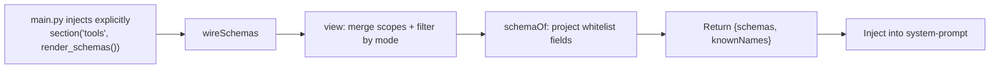
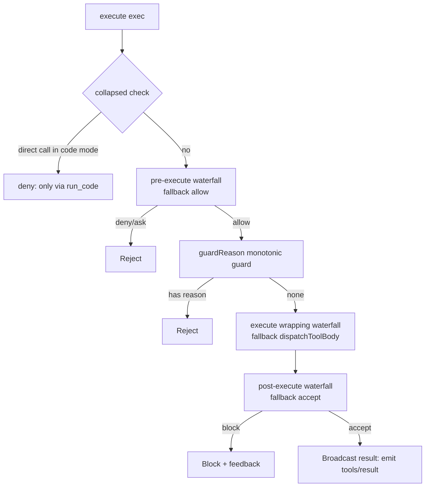

# Chapter 4: tools Registration and Execution Pipeline (Define First, Present Next, Guard at the Gate)

> Sign up your name first, then show your skills — someone is watching the gate.

## Questions this chapter answers

- How are tools "registered" into the container? How are multiple scopes isolated, hidden, or overridden?
- Where does the model learn what tools exist and what each tool's parameters look like?
- For a single tool call, from the moment the model says "I want to call X" to the result being written back, what checkpoints does it pass through?
- How do you intercept dangerous operations before the call, add a timeout during the call, and remind the user after the call?

Chapter 1 gave us the container foundation: **Context** provides `provide/on/emit/serial/waterfall/effect/plugin`, and **Service** registers itself the moment it is constructed. Chapter 2 built **sessions and prompts** on top of it: **Session** records the event stream, **SystemPromptService** stitches prompt sections together with `section`, and **LlmStub** simulates model output with `stream`. Chapter 3 filled in **persistence**: writing the event stream to disk and rebuilding it via cold reads.

But until now, the model has been "naked" — it can only generate text and cannot call any tool. This chapter fills the "no tools" gap left in Chapter 2's `SystemPromptService` prompt: it populates the prompt with **tool definitions**, then uses a **guarded execution pipeline** to receive the invocation intents the model emits.

Tools are not capabilities the model "is born with"; they are contracts the harness hands to the model — with a name, a parameter description, and an executable body. This chapter breaks that contract into three steps: first register tools into a scope (**definition facet**), then inject the tools' schemas into the system-prompt so the model can "see" them (**presentation facet**), and finally guard every call with a three-stage waterfall (**execution facet**).

Incremental reuse relationships:

- Reuses ch01's **Context / Service / effect**: `ToolRuntime` is a `Service`, registering itself as `ctx.tools` at construction; `register` uses `ctx.effect` to express "unload means remove".
- Reuses ch01's **on / emit**: `tools/change` and `tools/result` are read-only notifications that go straight through ch01's event mechanism.
- **Upgrades ch01's waterfall**: ch01's `ctx.waterfall` is a simplified "value-passing" version (`None` passes through). This chapter's execution pipeline needs a "middleware-style" waterfall (listeners wrap the `next` continuation), so a new `waterfall_wrap` is added to complete the real semantics.
- Reuses ch02's **SystemPromptService.section**: schema injection rides on this ready-made stitching point ([Teaching simplification]; the real code has a dedicated seam `systemPrompt.tools`).

One more note: `main.py` keeps Chapter 2's full container assembly — it imports `AgentLoop`, provides `LlmStub`, and constructs `Sessions(ctx)` — but this chapter's demo only uses `SystemPromptService` and the tool runtime; the rest of the assembly is not used in this chapter, kept as the complete container shape and reserved for later chapters (e.g., the multi-step loop, previewed in §7).

## 1. Hard-Coded Tool Calls: No Registration, No Presentation, No Guarding

First look at a counterexample, `ch04/code/bad_example.py` (the full file is shown below; the `sample.txt` it reads is a sample file in the same directory, containing a single line `hello from ch04`):

```python
"""Chapter 4 counterexample: hard-coded tool calls — no registration, no schema presentation, no guards.

Run: python3 bad_example.py (reads sample.txt in the same directory; fixed content, reproducible on any platform)
"""
import os


def read_file(path: str) -> str:
    """Read a file (the real tool body)."""
    with open(path, "r", encoding="utf-8") as f:
        return f.read()


def run_shell(cmd: str) -> str:
    """Run a shell command (a dangerous tool body that should be stopped by a guard)."""
    import subprocess

    return subprocess.run(cmd, shell=True, capture_output=True, text=True).stdout


# Problem 1: tools are scattered at the module top level; neither the model nor the container knows they exist.
# Problem 2: no schema is injected into the prompt — the model has no way to know what tools exist or what their parameters look like.
# Problem 3: call sites are hard-coded and unguarded — dangerous commands pass freely, and there is no timeout/reminders either.


def naive_agent_dispatch(intent: str):
    """Map the model's "intent" directly to Python functions: hard-coded dispatch with no pipeline."""
    if intent.startswith("read:"):
        return read_file(intent[len("read:"):])
    if intent.startswith("shell:"):
        return run_shell(intent[len("shell:"):])
    return "I don't recognize this intent"


if __name__ == "__main__":
    # Read the sample file in the same directory as the script: content is fixed to "hello from ch04", output reproducible on any platform.
    sample_path = os.path.join(os.path.dirname(os.path.abspath(__file__)), "sample.txt")
    # Model says "I want to read sample.txt" -> call the function directly; model says "I want to run a command" -> also call directly.
    print("[bad_example] read:", naive_agent_dispatch(f"read:{sample_path}").strip())
    print("[bad_example] shell:", naive_agent_dispatch("shell:echo hi").strip())
```

Running `python3 ch04/code/bad_example.py`:

```
[bad_example] read: hello from ch04
[bad_example] shell: hi
```

This example exposes three concrete problems:

1. **Tools scattered, no registration**: `read_file` and `run_shell` are just ordinary functions at the module top level; the container doesn't know they exist, and the model knows even less. There is no record of who registered which tool or into which scope.
2. **No schema presentation**: no mechanism injects tools' names, descriptions, and parameters into the system-prompt. The model has no way to know what tools are available or what each tool's parameters look like; the only option is hand-writing them into the prompt (which easily drifts out of sync with the real functions).
3. **No guards, hard-coded calls**: `naive_agent_dispatch` hard-codes the mapping from intent strings to functions, and dangerous commands (`shell`) pass freely; there is no pre-call interception, no timeout, no post-call reminder. Wanting to add "dangerous commands require approval first" means editing this if-else.

This chapter dissolves these three problems one by one in three steps: **definition facet** (registration) → **presentation facet** (schema injection) → **execution facet** (guard pipeline).

## 2. Mechanism 1: Scoped Registration via ctx.tools (Definition Facet)

### 2.1 Concept introduction

First introduce two terms:

- **Tool definition (ToolDefinition)**: one tool contract, containing at least four elements: `name`, `description`, `parameters` (parameter schema), and `execute` (execution body). The source code also carries `output`, `timeoutMs`, etc.; this chapter's teaching version trims it down to these four core fields.
- **Scoped layer (ToolLayer)**: a "drawer" that holds a collection of tools. The real implementation is **ScopedLayers** — one global layer plus several agent-scope layers, where a scope can "shadow" a global tool of the same name; this chapter's teaching version keeps only a single global layer, establishing the concept of "layer" first.

What `register` does is extremely simple: write one `ToolDefinition` into the `ToolLayer`, then **emit a `tools/change` event** to notify all observers, and finally return a `dispose` (unregister function). Returning `dispose` is the key — it turns "registration" into a **reversible effect**: when the registrant unloads, the tool is automatically removed from the layer.

### 2.2 Internal implementation

```mermaid
flowchart LR
    subgraph Registration side
        P[Plugin/app code] -->|register(def)| R[ToolRuntime.register]
        R --> W[Write into ToolLayer.tools]
        W --> E[emit tools/change]
        R -->|ctx.effect| D[Return dispose]
    end
    subgraph Observers
        E --> O1[Observer A: record registration]
        E --> O2[Observer B: refresh cache]
    end
    subgraph Unregistration
        D -->|call dispose| R2[Remove from ToolLayer.tools]
        R2 --> E2[emit tools/change remove]
    end
```

Key point: `register` itself does not "execute" any tool; it only **defines** tools and broadcasts "the definitions have changed". The execution facet (§4) is what actually calls `execute`.

### 2.3 Python reconstruction

The registration part of `ch04/code/tools.py` (`ToolDefinition`/`ToolLayer`/`ToolRuntime` construction and `register`):

```python
@dataclass(frozen=True)
class ToolDefinition:
    """One tool contract (index.ts:222): name + description + parameter schema + execution body.

    [Teaching simplification] The real execute signature is (args, exec) and returns an arbitrary value
    that goes through snapshot/validate/render; the teaching version degrades to execute(args) -> str,
    omitting the output contract.
    """

    name: str
    description: str
    parameters: dict
    execute: "callable"  # dict -> str
    timeout_ms: int | None = None


@dataclass
class ToolLayer:
    """Scoped layer (index.ts:714): tools + guards + presentation modes.

    [Teaching simplification] The real version is ScopedLayers' global layer + agent-scope layers
    (scopes shadow the global layer); the teaching version keeps only a single global layer.
    """

    tools: dict = field(default_factory=dict)
    guards: list = field(default_factory=list)
    modes: dict = field(default_factory=dict)  # name -> "native"|"code"|"both"
    # The guard_reason method is in §4.3 (monotonic guard; concept in §4.1)


class ToolRuntime(Service):
    """The ctx.tools service: definition facet + presentation facet + execution facet, three in one (index.ts:787)."""
    # ... Presentation facet members (view / wire_schemas etc.) in §3.3; execution facet members (guard / execute etc.) in §4.3 ...

    def __init__(self, ctx, config=None):
        super().__init__(ctx, "tools")
        self._layer = ToolLayer()
        self._pre_execute = []
        self._execute = []
        self._post_execute = []
        self._seq = 0

    # ---------- Definition facet: registration ----------

    def register(self, definition):
        """Write a tool into the scoped layer and emit tools/change; returns the unregister disposer (index.ts:1037)."""
        name = definition.name
        self._layer.tools[name] = definition
        self.ctx.emit("tools/change", {"name": name, "op": "add"})

        def dispose():
            self._layer.tools.pop(name, None)
            self.ctx.emit("tools/change", {"name": name, "op": "remove"})

        return self.ctx.effect(lambda: dispose, label=f"tool:{name}")
```

The two members newly appearing in the excerpt each deserve a sentence: `ToolRuntime.__init__` first completes Service registration with `super().__init__(ctx, "tools")` (ch01's "construction is registration"), then builds the single scoped layer `_layer` and the listener lists for the three waterfalls — the `on_pre_execute`/`on_execute`/`on_post_execute` registration calls in §4.3 simply append to these three lists (the `_seq` counter is not consumed in the teaching version). `ToolLayer`'s `guards` / `modes` fields are just placeholder containers at the registration stage: the semantics of guards (`guards`) and `guard_reason` are unfolded in §4.1 / §4.3, and the semantics of presentation modes (`modes`) are unfolded in §3.1.

The `dispose` returned by `register` goes through `ctx.effect`: it is ch01's "reversible effect" — when the current fiber unloads, `dispose` is called automatically and the tool is removed along with it. This is how "registration into a scope" is realized, as opposed to "global permanent registration".

One caveat: all four `register` calls in this chapter's demo happen at the root level (`main.py` does not activate any fiber/plugin), so the effect hangs on the container itself and there is no moment of "fiber unload" — which is why the manual `dispose()` in the fourth segment of §5's output (registering `temp_tool` and immediately unregistering it) is a direct demonstration of the "unload means remove" mechanism. In the real code, tool registration happens inside fibers in the agent scope; when the fiber unloads, the corresponding `dispose` is triggered automatically, no manual call needed.

The calling side of registration is simple — `ch04/code/main.py` constructs `ToolDefinition`s and hands them to `register` (excerpted from inside the `main()` function; `slow_echo`'s body deliberately sleeps 50ms to set up the timeout demo in §5):

```python
# Inside main() of ch04/code/main.py (segment 1, indentation omitted)
def slow_echo(args):
    time.sleep(0.05)  # 50ms, to trigger a timeout
    return args["text"]

# ...(the echo definition and the two register calls for read_file/shell are omitted here; same form)
ctx.tools.register(ToolDefinition("slow_echo", "Slow echo (timeout demo)", {"text": "string"}, slow_echo, timeout_ms=20))
```

The four arguments of `ToolDefinition` correspond one-to-one to the contract fields: name, description, parameter schema, execution body `execute` (passed in as an ordinary function); `timeout_ms=20` is the optional timeout budget — the 20ms in the §5 timeout demo's "50ms > 20ms budget" comes from here. The other three tools (`read_file`/`shell`/`echo`) are registered the same way (the four calls are concentrated at main.py:62–65), just without `timeout_ms`. Each time a `register` returns, the observer immediately prints a line `[tools/change] <name> add` (see segment 1 of §5's output).

### 2.4 Recap

`register` solves problem 1: tools are no longer scattered ordinary functions but **contract objects** explicitly written into the `ToolLayer`, and every register/unregister broadcasts `tools/change`, so the container and observers can both perceive it. But at this point the model still cannot "see" these tools — so we move to the next step.

## 3. Mechanism 2: Injecting Schemas into the system-prompt (Presentation Facet)

### 3.1 Concept introduction

Registration merely "stores" tools away; for the model to "use" them, it must first "see" them. The fields in a tool definition meant for the model (`name`/`description`/`parameters`) need to be **projected** into a schema and injected into the system-prompt. Two key terms here:

- **Schema projection (schemaOf)**: pick out the **whitelist fields** `{name, description, parameters}` from a `ToolDefinition`, discarding execution-facet fields like `execute` and `output`. The model should only see "how it is described, how to pass arguments", not the execution body itself.
- **Presentation mode**: each tool has three presentation modes, `native` / `code` / `both`. `native` writes the schema directly into the prompt; `code` does not expose the schema but collapses it into a `run_code` transport channel (the model calls it indirectly by writing code); `both` allows either. **The presentation facet and the execution facet are decided by the same mode** — if a tool in `code` mode is called directly by the model, the execution facet refuses (see the collapse check in §4).

`wireSchemas` aggregates the schemas of all visible tools in the scope and returns two things, `{schemas, knownNames}`, for the system-prompt injection.

### 3.2 Internal implementation



The starting point of the diagram is the teaching version's wiring: `main.py` explicitly calls `ctx.systemPrompt.section("tools", ctx.tools.render_schemas(), order=10)`, and `render_schemas()` internally calls `wire_schemas()` to get the aggregated result and renders it into text (see §3.3); in the real code this step is wired automatically when ToolRuntime is constructed, through the dedicated seam `ctx.systemPrompt.tools` (noted at the chapter opening). The teaching version's `view` only does "filtering by mode" (tools in `code` mode are not exposed); the real version first merges the global layer with agent-scope layers and applies `restrict` filtering, but the main line of "project whitelist → aggregate and inject" is the same.

### 3.3 Python reconstruction

```python
class ToolRuntime(Service):
    # ... register in §2.3; present_as / mode_for (presentation modes) in §3.1; render_schemas in §3.2; guard and execution facet members in §4.3 ...

    def view(self):
        """Visible tool set: only tools whose mode is not code have their schemas exposed to the model.

        [Teaching simplification] The real view(scope) merges via ScopedLayers + filters by restrictions (index.ts:1152);
        the teaching version only filters by mode.
        """
        return [d for d in self._layer.tools.values() if self.mode_for(d.name) != "code"]

    def schema_of(self, definition):
        """Project a definition into the whitelist the model sees: keep only {name, description, parameters}."""
        return {
            "name": definition.name,
            "description": definition.description,
            "parameters": definition.parameters,
        }

    def wire_schemas(self):
        """Aggregate visible tool schemas and known names (index.ts:980, returns {schemas, knownNames})."""
        visible = self.view()
        return {
            "schemas": [self.schema_of(d) for d in visible],
            "knownNames": [d.name for d in visible],
        }
```

In `main.py`, the `wireSchemas` result is injected into the system-prompt, and it demonstrates how `presentAs` changes the presentation facet:

```python
# Inside main() of ch04/code/main.py (segment 2, indentation omitted)
print(f"    {ctx.tools.wire_schemas()}")
print("  After presentAs('shell', 'code'), shell is hidden from the presentation facet:")
ctx.tools.present_as("shell", "code")
print(f"    knownNames = {ctx.tools.wire_schemas()['knownNames']}")
ctx.systemPrompt.section("tools", ctx.tools.render_schemas(), order=10)
```

Visible in the output: after `presentAs('shell', 'code')`, `shell` disappears from `knownNames` — the dangerous tool has gone "invisible" to the model.

### 3.4 Recap

Schema injection solves problem 2: tool definitions and the prompt are no longer hand-written and no longer drift out of sync; they are **projected from the same `ToolDefinition`**. Change a definition and `wireSchemas`'s output changes automatically; change a mode and the presentation facet expands or contracts accordingly. But "visible" does not mean "stoppable" — truly dangerous calls still need the execution facet to guard them.

## 4. Mechanism 3: The Guarded Execution Pipeline (Execution Facet)

### 4.1 Concept introduction

This is the core of the chapter. A single tool call is decomposed into **three waterfall stages**, each allowing any number of listeners to intervene:

- **Pre-execution decision (PreToolDecision)**: `allow` / `deny` / `ask` (ask is degraded to deny in the teaching version). Produced by the `tools/pre-execute` waterfall.
- **During execution (tools/execute)**: a **wrapping waterfall** — listeners wrap the function body, able to act before the call and after the call; only the innermost fallback is "actually call the tool body".
- **Post-execution decision (PostToolDecision)**: `accept` / `block` (block + feedback). Produced by the `tools/post-execute` waterfall.

And two more key concepts:

- **Middleware-style waterfall (waterfall_wrap)**: the listener signature is `listener(*args, next)`; only calling `next()` hands control to the inner layer. This is the real semantics simplified away in ch01's `ctx.waterfall` (ch01 is "value passing, `None` passes through").
- **Monotonic guard (guardReason)**: a guard registered via `guard` is a function with **veto power only**, with signature `exec -> rejection reason string | None`. For a given call it can take only two stances: returning a string means **rejecting** the call with that reason; returning `None` only means "I don't object", **not** "I approve" — a guard simply has no "approve" option; letting a call through is merely the natural result of "no guard objects". `guardReason` asks the guards one by one in registration order; **the first** guard to give a reason gets the call rejected with that reason (short-circuit; later guards are not asked); only when all guards return `None` is the call allowed. "Monotonic" means: guards can only stack rejections — adding guards can never flip a rejected call back to allowed. The difference from the `pre-execute` waterfall: listeners in the waterfall can explicitly return allow/deny to decide "whether to continue", while a monotonic guard can only "raise an objection".

The **fallback values of the three waterfall stages are exactly the historical behavior with no guards**: `pre-execute` falls back to `allow`, `execute` falls back to calling the function body directly, `post-execute` falls back to `accept`. This is precisely the design of "behavior changes only when guards are added; without guards it is as if nothing happened".

### 4.2 Internal implementation



A call enters through `execute` and passes in order: collapse check → `pre-execute` waterfall → monotonic guard → `execute` wrapping waterfall → `post-execute` waterfall → broadcast result (`tools/result`). The real code has one more step before broadcasting, "materialization": the result is considered materialized only after going through the tool's `output` contract snapshot/rendering, and only then handed to broadcasting; the teaching version has no `output` contract (see the [Teaching simplification] note on `ToolDefinition` in §2.3) and broadcasts directly after execution. If any stage rejects early, nothing downstream runs.

### 4.3 Python reconstruction

First look at `waterfall_wrap` — it is the foundation of the whole pipeline. It is a **module-level function** (defined at the top level of `tools.py`, belonging to no class):

```python
# Module-level function (top level of tools.py, belongs to no class)
def waterfall_wrap(listeners, args, fallback):
    """Middleware-style waterfall: listeners wrap from outer to inner, fallback is the innermost backstop.

    Listener signature listener(*args, next); calling next() hands control to the inner layer, not calling it short-circuits.
    Completes the real middleware semantics simplified away in Chapter 1 (events.ts:234 ↔ cordis.py:153–163).
    """

    def invoke(index):
        if index >= len(listeners):
            return fallback()
        return listeners[index](*args, lambda: invoke(index + 1))

    return invoke(0)
```

Next the monotonic guard — the concept from §4.1 lands here. Registration and decision live in two places: `guard` appends the guard function to `ToolLayer.guards` (the `guards` list from §2.3, whose semantics were not unfolded then); `guard_reason` is consumed by `_prepare` below — it asks guards one by one in registration order, and if any guard gives a rejection reason the call is rejected with that reason (short-circuit); only when all guards return `None` is the call allowed:

```python
class ToolRuntime(Service):
    # ... register in §2.3; presentation facet members in §3.3; execute pipeline later in this section ...

    def guard(self, guard_fn):
        """Register a monotonic guard: can only reject, never approve (index.ts:1110)."""
        self._layer.guards.append(guard_fn)


@dataclass
class ToolLayer:
    # ... tools / guards / modes fields in §2.3 ...

    def guard_reason(self, exec):
        """Monotonic guard: run guards in order and return the first non-None rejection reason (index.ts:1119–1127)."""
        for guard in self.guards:
            reason = guard(exec)
            if reason is not None:
                return reason
        return None
```

Then `execute` and the three-stage pipeline:

```python
class ToolRuntime(Service):
    # ... register in §2.3; guard earlier in this section; presentation facet members in §3.3 ...

    def execute(self, exec):
        """Run the full guard pipeline: prepare → dispatch → post → finish (index.ts:1342)."""
        gate = self._prepare(exec)
        if gate.kind != "allow":
            return ToolResult(content=gate.reason or f"{gate.kind}", is_error=True)

        result = self._dispatch(exec)
        decision = self._post(exec, result)
        if decision.kind == "block":
            result = ToolResult(content=decision.feedback or "blocked", is_error=True)

        self.ctx.emit("tools/result", exec, result)  # notify observers (read-only, index.ts:1657)
        return result

    def _prepare(self, exec):
        """Before the call: pre-execute waterfall + monotonic guard, returns a PreToolDecision.

        [Teaching simplification] The ask branch in the real version goes through the serviceAsk approval seam (index.ts:1689); the teaching version degrades it to deny.
        """
        if self.mode_for(exec.name) == "code":
            return PreToolDecision.deny("code-mode tools can only be invoked through the run_code transport")
        gate = waterfall_wrap(self._pre_execute, (exec,), fallback=PreToolDecision.allow)
        if gate.kind == "allow":
            reason = self._layer.guard_reason(exec)
            if reason is not None:
                return PreToolDecision.deny(reason)
        return gate

    def _dispatch(self, exec):
        """During the call: execute wrapping waterfall, fallback calls the function body directly (index.ts:1569–1595)."""
        return waterfall_wrap(self._execute, (exec,), fallback=lambda: self._dispatch_body(exec))

    def _dispatch_body(self, exec):
        """Actually call the user's tool body and wrap it into a ToolResult (index.ts:1532–1560)."""
        tool = self._layer.tools.get(exec.name)
        if tool is None:
            return ToolResult(content=f"unknown tool: {exec.name}", is_error=True)
        return ToolResult(content=str(tool.execute(exec.arguments)))

    def _post(self, exec, result):
        """After the call: post-execute waterfall, fallback accept (index.ts:1742–1781)."""
        return waterfall_wrap(self._post_execute, (exec, result), fallback=PostToolDecision.accept)
```

Note `_dispatch_body` inside `_dispatch`: it is the concrete implementation of what §4.1 called "`execute`'s fallback calls the function body directly" — when no listener in the wrapping waterfall intercepts, control falls all the way to the innermost layer, calls the `execute` function body passed in at registration (e.g., `slow_echo`), and wraps the return value into a `ToolResult`.

In `main.py`, guards are registered: one listener on each of the three extension points (`on_pre_execute` / `on_execute` / `on_post_execute`), plus one monotonic guard:

```python
# Inside main() of ch04/code/main.py (segment 3, indentation omitted)
def sensitive_path_guard(exec_, next):
    if exec_.name == "read_file" and exec_.arguments.get("path", "").startswith("/etc"):
        return PreToolDecision.deny("sensitive path /etc denied")
    return next()

ctx.tools.on_pre_execute(sensitive_path_guard)

ctx.tools.guard(lambda exec_: "reading /root/secret.txt is forbidden" if exec_.arguments.get("path") == "/root/secret.txt" else None)

def timeout_wrapper(exec_, next):
    tool = ctx.tools.get(exec_.name)
    budget = tool.timeout_ms if tool and tool.timeout_ms else None
    if budget is None:
        return next()
    start = time.monotonic()
    result = next()
    if (time.monotonic() - start) * 1000 > budget:
        return ToolResult(content=f"timeout: exceeded {budget}ms", is_error=True)
    return result

ctx.tools.on_execute(timeout_wrapper)

def secret_blocker(exec_, result, next):
    if "secret" in result.content:
        return PostToolDecision.block("result contains secret, blocked")
    return next()

ctx.tools.on_post_execute(secret_blocker)
```

Note the structure of `timeout_wrapper`: it first grabs the `budget`, then calls the function body with `next()`, and finally checks the elapsed time. This is exactly what "wrapping" means — logic can be added both before and after `next()`, corresponding to the deadline wrapping in the real `packages/guard/timeout-policy`. `secret_blocker` is a post-execute listener: at that point the tool body has already run and `result` is in hand; it checks `result.content`, and upon finding `secret` it `block`s with the feedback "result contains secret, blocked" — the error line for `echo 'my secret key'` in §5's output is exactly what it blocked.

### 4.4 Recap

The guard pipeline solves problem 3: dangerous calls are no longer hard-coded if-else but **pluggable listeners**. Want to add interception, timeouts, or reminders? Hang a listener on each of `on_pre_execute` / `on_execute` / `on_post_execute` — no need to touch the core dispatch code. The two guard packages in the real harness — `repeat-tool-reminder` (hung on `tools/post-execute`, observes only, never vetoes) and `timeout-policy` (hung as the `tools/execute` wrap) — are two instances of exactly this set of extension points.

## 5. Full Run Output

Run `python3 ch04/code/main.py` (the temp file path in the output varies by environment and run; the body uses `/tmp/tmpXXXXXX.txt` as a placeholder):

```
== 1. Assemble the container + register tools ==
  [tools/change] read_file add
  [tools/change] shell add
  [tools/change] slow_echo add
  [tools/change] echo add

== 2. Schema injection: wireSchemas whitelist projection ==
  Raw wireSchemas result:
    {'schemas': [{'name': 'read_file', 'description': 'Read a file', 'parameters': {'path': 'string'}}, {'name': 'shell', 'description': 'Run a shell command', 'parameters': {'cmd': 'string'}}, {'name': 'slow_echo', 'description': 'Slow echo (timeout demo)', 'parameters': {'text': 'string'}}, {'name': 'echo', 'description': 'Echo', 'parameters': {'text': 'string'}}], 'knownNames': ['read_file', 'shell', 'slow_echo', 'echo']}
  After presentAs('shell', 'code'), shell is hidden from the presentation facet:
    knownNames = ['read_file', 'slow_echo', 'echo']
  Section text injected into the system-prompt:
    Available tools:
    - read_file: Read a file
      parameters {'path': 'string'}
    - slow_echo: Slow echo (timeout demo)
      parameters {'text': 'string'}
    - echo: Echo
      parameters {'text': 'string'}

== 3. Guard pipeline: pre-execute / execute / post-execute ==
  read_file{'path': '/etc/hostname'} -> is_error=True content='sensitive path /etc denied'
  read_file{'path': '/root/secret.txt'} -> is_error=True content='reading /root/secret.txt is forbidden'
  shell{'cmd': 'ls'} -> is_error=True content='code-mode tools can only be invoked through the run_code transport'
  [tools/result] slow_echo is_error=True
  slow_echo{'text': 'hi'} -> is_error=True content='timeout: exceeded 20ms'
  [tools/result] echo is_error=True
  echo{'text': 'my secret key'} -> is_error=True content='result contains secret, blocked'
  [tools/result] read_file is_error=False
  read_file{'path': '/tmp/tmpXXXXXX.txt'} -> is_error=False content='hello from a safe file\n'
  [tools/result] echo is_error=False
  echo{'text': 'all good'} -> is_error=False content='all good'

== 4. Unregistration: unregister a tool definition ==
  [tools/change] temp_tool add
  temp_tool registered, knownNames=['read_file', 'slow_echo', 'echo', 'temp_tool']
  [tools/change] temp_tool remove
  knownNames after unregister=['read_file', 'slow_echo', 'echo']
```

Matching each line to its checkpoint:

- `read_file /etc/hostname` → rejected by the `pre-execute` guard (sensitive path).
- `read_file /root/secret.txt` → allowed by `pre-execute`, rejected by the **monotonic guard** `guardReason`.
- `shell` → after `presentAs('code')`, rejected by the collapse check (schema not exposed, direct calls not accepted either).
- `slow_echo` → the timeout guard in the `execute` wrapping waterfall: 50ms > 20ms budget, returns a timeout error.
- `echo 'my secret key'` → the `post-execute` guard blocks a result containing secret.
- `read_file` (temp file), `echo 'all good'` → all allowed, pass normally.
- `[tools/result]` only appears on calls that "reached the execution facet"; calls rejected by `pre-execute` never trigger a result notification at all.

## 6. Source Mapping

The correspondence between this chapter's teaching version and the real source code (`packages/core/tools/src/index.ts` and the two guard packages under `packages/guard/`) is collected here:

| Teaching version symbol | Real source code | Notes |
|---|---|---|
| `ToolRuntime` | `index.ts:787` (class body 787–1863) | The ctx.tools service |
| `ToolLayer` | `index.ts:714` | Four fields: tools/restrictions/guards/mode |
| `ToolDefinition` | `index.ts:222` | name/description/parameters/execute/output/timeoutMs |
| `PreToolDecision` / `PostToolDecision` | `index.ts:588–597` | allow/deny/ask and accept/block |
| `register` | `index.ts:1037–1062` | Write into layer + `tools/change` + return disposer |
| `guard` / `guard_reason` | `index.ts:1110` (guard) / `1119–1127` (guardReason definition) | Monotonic guard |
| `present_as` / `mode_for` | `index.ts:946` (presentAs) / `900–911` (modeFor) | Presentation modes native/code/both (`ToolPresentationMode` type at 651) |
| `schema_of` | `index.ts:1256` (ToolRuntime.schemaOf) | Project `{name, description, parameters}` |
| `wire_schemas` | `index.ts:980` | Returns `{schemas, knownNames}` |
| `execute` | `index.ts:1342` | Pipeline entry |
| `_prepare` (pre-execute waterfall) | `index.ts:1463` (waterfall at 1475) | Fallback allow |
| `guard_reason` call site | `index.ts:1487` (enclosing statement 1486–1488) | Runs after pre-execute allow |
| `_dispatch` (execute wrapping waterfall) | `index.ts:1569` (waterfall at 1573) | Fallback dispatchToolBody |
| `_dispatch_body` | `index.ts:1532–1560` | Actually calls the tool body |
| `_post` (post-execute waterfall) | `index.ts:1742–1781` | Fallback accept |
| Result notification `tools/result` | `index.ts:1657` (notifyResult) | Read-only broadcast |
| `serviceAsk` approval seam | `index.ts:1689` | Teaching version degrades ask to deny |
| `timeout-policy` wrap | `packages/guard/timeout-policy/src/index.ts:56` | Deadline wrapping (this chapter's `timeout_wrapper`) |
| `repeat-tool-reminder` | `packages/guard/repeat-tool-reminder/src/index.ts:213` | Hung on `tools/post-execute`, observes only, never vetoes |

## 7. Summary and Preview

This chapter split "tools" open into three facets: the **definition facet** uses `register` to write tools into the scoped layer and broadcast `tools/change`; the **presentation facet** uses `schemaOf` + `wireSchemas` to project whitelist fields into the system-prompt, with `presentAs` controlling the three modes native/code/both; the **execution facet** uses a three-stage middleware-style waterfall (`pre-execute` → `execute` wrap → `post-execute`) plus a monotonic guard to watch over every call.

Chapter 5 looks at the three roles of the capability seam — how one capability is decomposed into "defined, implemented, consumed" with three-way decoupling, walking through a complete seam contract using shell as the example. As for the multi-step loop of "model decides to call → execute → feed the result back to the model", it will be filled in by later chapters.

## 8. Appendix: Key Concepts Cheat Sheet

| Term | Meaning |
|---|---|
| **Tool definition (ToolDefinition)** | One tool contract: name/description/parameters/execute |
| **Scoped layer (ToolLayer)** | The drawer holding a tool collection; the real version is ScopedLayers (global layer + agent layers) |
| **Registration (register)** | Write the definition into the layer + broadcast `tools/change` + return dispose |
| **Schema projection (schemaOf)** | Pick out the whitelist fields `{name, description, parameters}` |
| **Presentation mode** | native / code / both; the presentation facet and the execution facet are decided by the same mode |
| **wireSchemas** | Aggregate visible tools and return `{schemas, knownNames}` |
| **Pre-execution decision (PreToolDecision)** | allow / deny / ask |
| **Post-execution decision (PostToolDecision)** | accept / block |
| **Middleware-style waterfall (waterfall_wrap)** | Listeners wrap the next continuation; outermost takes priority, fallback at the innermost |
| **Monotonic guard (guardReason)** | A list of guards that can only reject, never approve |
| **Three-stage pipeline** | pre-execute → execute (wrapping) → post-execute |
