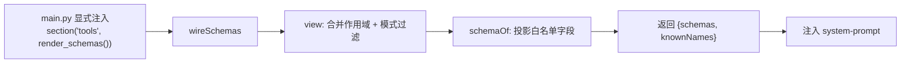
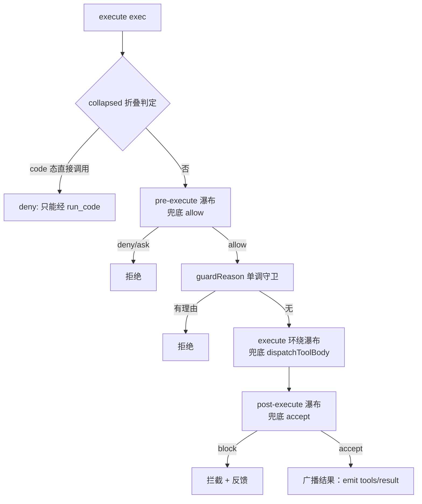

# 第 4 章 tools 注册与执行管线（先定义，再展示，最后把守）

> 先报名字，再亮本事，门口有人把守。

## 本章回答的问题

- 工具是怎么被"注册"进容器的？多个作用域之间如何隔离、隐藏、覆盖？
- 模型从哪里得知有哪些工具、每个工具的参数长什么样？
- 一次工具调用，从模型说出"我要调用 X"到结果写回，中间经过哪些关卡？
- 如何在调用前拦截危险操作、调用中加超时、调用后提醒用户？

第 1 章给了我们容器底座：**Context** 提供 `provide/on/emit/serial/waterfall/effect/plugin`，**Service** 构造即注册。第 2 章在它上面搭出**会话与提示词**：**Session** 记录事件流，**SystemPromptService** 用 `section` 缝合各段提示词，**LlmStub** 用 `stream` 模拟模型输出。第 3 章补齐**持久化**：事件流落盘、冷读重建。

但直到现在，模型始终是"裸"的——它只会生成文本，不会调用任何工具。本章把第 2 章 `SystemPromptService` 提示词里那段"无工具"的空缺补上：用**工具定义**填充提示词，再用一条**守卫执行管线**承接模型发出的调用意图。

工具不是模型"天生就会"的能力，而是 harness 交给模型的一份带名字、带参数说明、带执行体的契约。本章把这份契约拆成三步：先把工具注册进作用域（**定义面**），再把工具的 schema 注入 system-prompt 让模型"看得见"（**展示面**），最后用一条三段瀑布把每次调用把守起来（**执行面**）。

增量复用关系：

- 复用 ch01 的 **Context / Service / effect**：`ToolRuntime` 是 `Service`，构造即注册为 `ctx.tools`；`register` 用 `ctx.effect` 表达"卸载即移除"。
- 复用 ch01 的 **on / emit**：`tools/change`、`tools/result` 是只读通知，直接走 ch01 的事件机制。
- **升级 ch01 的 waterfall**：ch01 的 `ctx.waterfall` 是"值传递"简化版（`None` 放行）。本章执行管线需要"中间件式"瀑布（监听器包裹 `next` 续体），故新增 `waterfall_wrap` 补全真实语义。
- 复用 ch02 的 **SystemPromptService.section**：schema 注入借它这条现成缝合点承载（`[教学简化]`，真实代码另有 `systemPrompt.tools` 专用 seam）。

另需说明：`main.py` 保持了第 2 章的完整容器装配——import 了 `AgentLoop`、provide 了 `LlmStub`、构造了 `Sessions(ctx)`——但本章演示只用到 `SystemPromptService` 与工具运行时；其余装配本章不使用，保持完整容器形态，留待后续章节（如多步循环，见 §7 预告）。

## 1. 写死的工具调用，没有注册、没有展示、没有把守

先看一个反面示例 `ch04/code/bad_example.py`（下面给出完整文件；它读取的 `sample.txt` 是同目录下的样例文件，内容只有一行 `hello from ch04`）：

```python
"""第 4 章反面示例：写死的工具调用——没有注册、没有 schema 展示、没有守卫。

运行：python3 bad_example.py（读取同目录下的 sample.txt，内容固定，任何平台可复现）
"""
import os


def read_file(path: str) -> str:
    """读文件（真正的工具体）。"""
    with open(path, "r", encoding="utf-8") as f:
        return f.read()


def run_shell(cmd: str) -> str:
    """执行 shell 命令（危险工具体，应当被守卫拦截）。"""
    import subprocess

    return subprocess.run(cmd, shell=True, capture_output=True, text=True).stdout


# 问题 1：工具散落在模块顶层，模型和容器都不知道它们存在。
# 问题 2：没有任何 schema 注入 prompt——模型无从得知有哪些工具、参数长什么样。
# 问题 3：调用点写死、无守卫——危险命令畅通无阻，也无法超时/提醒。


def naive_agent_dispatch(intent: str):
    """把模型的「意图」直接映射到 Python 函数：写死的分发，没有管线。"""
    if intent.startswith("read:"):
        return read_file(intent[len("read:"):])
    if intent.startswith("shell:"):
        return run_shell(intent[len("shell:"):])
    return "我不认识这个意图"


if __name__ == "__main__":
    # 读脚本同目录下的样例文件：内容固定为「hello from ch04」，输出在任何平台可复现。
    sample_path = os.path.join(os.path.dirname(os.path.abspath(__file__)), "sample.txt")
    # 模型说出「我要读 sample.txt」→ 直接调函数；模型说出「我要跑命令」→ 也直接调。
    print("[bad_example] read:", naive_agent_dispatch(f"read:{sample_path}").strip())
    print("[bad_example] shell:", naive_agent_dispatch("shell:echo hi").strip())
```

运行 `python3 ch04/code/bad_example.py`：

```
[bad_example] read: hello from ch04
[bad_example] shell: hi
```

这个例子暴露出三个具体问题：

1. **工具散落、无注册**：`read_file`、`run_shell` 只是模块顶层的普通函数，容器不知道它们存在，模型更不知道。谁注册了工具、注册到了哪个作用域，没有任何记录。
2. **无 schema 展示**：没有任何机制把工具的名字、描述、参数注入到 system-prompt，模型无从得知有哪些工具可用、每个工具的参数长什么样，只能靠提示词里手写（极易与真实函数不同步）。
3. **无守卫、调用写死**：`naive_agent_dispatch` 把意图字符串硬编码映射到函数，危险命令（`shell`）畅通无阻；没有调用前拦截、没有超时、没有调用后提醒。想加一个"危险命令先审批"，只能改这段 if-else。

本章用三步逐一消解这三个问题：**定义面**（注册）→ **展示面**（schema 注入）→ **执行面**（守卫管线）。

## 2. 机制一：ctx.tools 作用域注册（定义面）

### 2.1 概念引入

先引入两个术语：

- **工具定义（ToolDefinition）**：一条工具契约，至少包含 `name`（名字）、`description`（描述）、`parameters`（参数 schema）、`execute`（执行体）四要素。源码里还带 `output`、`timeoutMs` 等，本章教学版精简为这四个核心字段。
- **作用域层（ToolLayer）**：一个承载工具集合的"抽屉"。真实实现里是 **ScopedLayers**——一个全局层加若干 agent 作用域层，作用域可以"遮蔽（shadow）"全局同名工具；本章教学版只维护单一全局层，把"层"这个概念先立起来。

`register` 做的事极其简单：把一条 `ToolDefinition` 写进 `ToolLayer`，然后**发一个 `tools/change` 事件**通知所有观察者，最后返回一个 `dispose`（注销函数）。返回 `dispose` 是关键——它让"注册"变成一个**可逆效应**：注册者卸载时，工具自动从层里移除。

### 2.2 内部实现

```mermaid
flowchart LR
    subgraph 注册面
        P[插件/应用代码] -->|register(def)| R[ToolRuntime.register]
        R --> W[写入 ToolLayer.tools]
        W --> E[emit tools/change]
        R -->|ctx.effect| D[返回 dispose]
    end
    subgraph 观察者
        E --> O1[观察者A：记录注册]
        E --> O2[观察者B：刷新缓存]
    end
    subgraph 反注册
        D -->|调用 dispose| R2[从 ToolLayer.tools 移除]
        R2 --> E2[emit tools/change remove]
    end
```

关键点：`register` 本身不"执行"任何工具，它只**定义**工具并广播"定义发生了变化"。执行面（第 4 节）才真正调用 `execute`。

### 2.3 Python 重构

`ch04/code/tools.py` 里的注册部分（`ToolDefinition`/`ToolLayer`/`ToolRuntime` 构造与 `register`）：

```python
@dataclass(frozen=True)
class ToolDefinition:
    """一条工具契约（index.ts:222）：名字 + 描述 + 参数 schema + 执行体。

    [教学简化] 真实版 execute 签名 (args, exec) 且返回任意值经 snapshot/validate/render；
    教学版退化为 execute(args) -> str，output 契约省略。
    """

    name: str
    description: str
    parameters: dict
    execute: "callable"  # dict -> str
    timeout_ms: int | None = None


@dataclass
class ToolLayer:
    """作用域层（index.ts:714）：工具 + 守卫 + 展示模式。

    [教学简化] 真实版是 ScopedLayers 的全局层 + agent 作用域层（作用域 shadow 全局）；
    教学版只维护单一全局层。
    """

    tools: dict = field(default_factory=dict)
    guards: list = field(default_factory=list)
    modes: dict = field(default_factory=dict)  # name -> "native"|"code"|"both"
    # guard_reason 方法见 §4.3（单调守卫，概念见 §4.1）


class ToolRuntime(Service):
    """ctx.tools 服务：注册面 + 展示面 + 执行面三合一（index.ts:787）。"""
    # ... 展示面成员（view / wire_schemas 等）见 §3.3；执行面成员（guard / execute 等）见 §4.3 ...

    def __init__(self, ctx, config=None):
        super().__init__(ctx, "tools")
        self._layer = ToolLayer()
        self._pre_execute = []
        self._execute = []
        self._post_execute = []
        self._seq = 0

    # ---------- 定义面：注册 ----------

    def register(self, definition):
        """把工具写入作用域层并触发 tools/change，返回注销 disposer（index.ts:1037）。"""
        name = definition.name
        self._layer.tools[name] = definition
        self.ctx.emit("tools/change", {"name": name, "op": "add"})

        def dispose():
            self._layer.tools.pop(name, None)
            self.ctx.emit("tools/change", {"name": name, "op": "remove"})

        return self.ctx.effect(lambda: dispose, label=f"tool:{name}")
```

摘录中新出现的两个成员各交代一句：`ToolRuntime.__init__` 先以 `super().__init__(ctx, "tools")` 完成 Service 注册（ch01「构造即注册」），再建好唯一的作用域层 `_layer` 与三条瀑布的监听器列表——§4.3 的 `on_pre_execute`/`on_execute`/`on_post_execute` 注册调用就是往这三个列表里 append（`_seq` 计数器教学版未消费）。`ToolLayer` 的 `guards` / `modes` 两个字段在注册阶段只是占位容器：守卫（`guards`）与 `guard_reason` 的语义在 §4.1 / §4.3 展开，展示模式（`modes`）的语义在 §3.1 展开。

`register` 返回的 `dispose` 走 `ctx.effect`：它是 ch01 的"可逆效应"——当前 fiber 卸载时，`dispose` 被自动调用，工具随之移除。这就是"注册进作用域"而非"全局永久注册"的落地方式。

需要说明：本章 demo 的四次 `register` 都发生在根级（`main.py` 没有激活任何 fiber/plugin），此时 effect 挂在容器自身上，不存在"fiber 卸载"的时刻——因此 §5 输出第 4 段里那次手动 `dispose()`（注册 `temp_tool` 后立即注销）正是对"卸载即移除"机制的直接演示。真实代码里工具注册发生在 agent 作用域的 fiber 内，fiber 卸载时对应的 `dispose` 会被自动触发，无需手动调用。

注册的调用侧很简单——`ch04/code/main.py` 构造 `ToolDefinition` 交给 `register`（摘录自 `main()` 函数内；`slow_echo` 的函数体故意睡 50ms，为 §5 的超时演示埋线）：

```python
# ch04/code/main.py 的 main() 内（第 1 段，缩进略）
def slow_echo(args):
    time.sleep(0.05)  # 50ms，制造超时
    return args["text"]

# ……（此处省略 echo 的定义与 read_file/shell 的两次 register 调用，形式相同）
ctx.tools.register(ToolDefinition("slow_echo", "慢速回声（演示超时）", {"text": "string"}, slow_echo, timeout_ms=20))
```

`ToolDefinition` 的四个实参与契约字段一一对应：名字、描述、参数 schema、执行体 `execute`（以普通函数传入）；`timeout_ms=20` 是可选的超时预算——§5 超时演示里"50ms > 20ms 预算"的 20ms 即来源于此。其余三个工具（`read_file`/`shell`/`echo`）同理注册（四次调用集中在 main.py:62–65），只是不带 `timeout_ms`。每次 `register` 返回，观察者随即打印一行 `[tools/change] <name> add`（见 §5 输出第 1 段）。

### 2.4 回溯

`register` 解决问题 1：工具不再是散落的普通函数，而是被显式写进 `ToolLayer` 的**契约对象**，并且每次注册/注销都广播 `tools/change`，容器和观察者都能感知。但此时模型仍然"看不见"这些工具——于是进入下一步。

## 3. 机制二：schema 注入 system-prompt（展示面）

### 3.1 概念引入

注册只是把工具"存"起来了，模型要"用"它，必须先"看见"它。工具定义里那些给模型看的字段（`name`/`description`/`parameters`）需要被**投影**成一段 schema，注入 system-prompt。这里有两个关键术语：

- **schema 投影（schemaOf）**：从 `ToolDefinition` 里挑出**白名单字段** `{name, description, parameters}`，丢弃 `execute`、`output` 等执行面字段。模型只该看到"怎么描述、怎么传参"，不该看到执行体本身。
- **展示模式（presentation mode）**：每个工具有三种展示方式 `native` / `code` / `both`。`native` 直接把 schema 写进 prompt；`code` 不暴露 schema，而是折叠成一个 `run_code` 传输通道（模型通过写代码间接调用）；`both` 两者皆可。**展示面与执行面由同一模式决定**——一个 `code` 态工具如果被模型直接调用，执行面会拒绝（见第 4 节折叠判定）。

`wireSchemas` 把作用域内所有可见工具的 schema 汇总，返回 `{schemas, knownNames}` 两样东西，供 system-prompt 注入。

### 3.2 内部实现



图的起点是教学版的接线方式：`main.py` 显式调用 `ctx.systemPrompt.section("tools", ctx.tools.render_schemas(), order=10)`，`render_schemas()` 内部调用 `wire_schemas()` 取汇总结果再渲染成文本（见 §3.3）；真实代码里这一步由 ToolRuntime 构造时自动接线，接缝是专用 seam `ctx.systemPrompt.tools`（章首已注明）。教学版 `view` 只做"按模式过滤"（`code` 态工具不暴露）；真实版还要先合并全局层与 agent 作用域层、应用 `restrict` 过滤，但"投影白名单 → 汇总注入"这条主线一致。

### 3.3 Python 重构

```python
class ToolRuntime(Service):
    # ... register 见 §2.3；present_as / mode_for（展示模式）见 §3.1；render_schemas 见 §3.2；guard 与执行面成员见 §4.3 ...

    def view(self):
        """可见工具集：模式非 code 的工具才向模型暴露 schema。

        [教学简化] 真实版 view(scope) 经 ScopedLayers 合并 + restrictions 过滤（index.ts:1152）；
        教学版只按模式过滤。
        """
        return [d for d in self._layer.tools.values() if self.mode_for(d.name) != "code"]

    def schema_of(self, definition):
        """把定义投影成给模型看的白名单：只留 {name, description, parameters}。"""
        return {
            "name": definition.name,
            "description": definition.description,
            "parameters": definition.parameters,
        }

    def wire_schemas(self):
        """汇总可见工具 schema 与已知名字（index.ts:980，返回 {schemas, knownNames}）。"""
        visible = self.view()
        return {
            "schemas": [self.schema_of(d) for d in visible],
            "knownNames": [d.name for d in visible],
        }
```

`main.py` 里把 `wireSchemas` 结果注入 system-prompt，并演示 `presentAs` 如何改变展示面：

```python
# ch04/code/main.py 的 main() 内（第 2 段，缩进略）
print(f"    {ctx.tools.wire_schemas()}")
print("  presentAs('shell', 'code') 后，shell 从展示面隐藏：")
ctx.tools.present_as("shell", "code")
print(f"    knownNames = {ctx.tools.wire_schemas()['knownNames']}")
ctx.systemPrompt.section("tools", ctx.tools.render_schemas(), order=10)
```

输出可见：`presentAs('shell', 'code')` 之后，`shell` 从 `knownNames` 里消失——危险工具对模型"隐身"了。

### 3.4 回溯

schema 注入解决问题 2：工具定义与 prompt 不再手写、不再不同步，而是**从同一个 `ToolDefinition` 投影**而来。定义一变，`wireSchemas` 输出自动跟着变；模式一改，展示面随之收放。但"看得见"不等于"拦得住"——真正危险的调用还需要执行面把守。

## 4. 机制三：守卫执行管线（执行面）

### 4.1 概念引入

这是本章的核心。一次工具调用被拆成**三段瀑布**，每段都允许任意数量的监听器介入：

- **调用前决策（PreToolDecision）**：`allow`（放行）/ `deny`（拒绝）/ `ask`（询问，教学版降级为 deny）。由 `tools/pre-execute` 瀑布产出。
- **调用中（tools/execute）**：一个**环绕瀑布**——监听器包裹函数体，可以在调用前做文章、调用后做文章，最内层的兜底才是"真正调用工具体"。
- **调用后决策（PostToolDecision）**：`accept`（接受）/ `block`（拦截 + 反馈）。由 `tools/post-execute` 瀑布产出。

还有两个关键概念：

- **中间件式瀑布（waterfall_wrap）**：监听器签名是 `listener(*args, next)`，只有调用 `next()` 才把控制权交给内层。这是 ch01 `ctx.waterfall` 被简化掉的真实语义（ch01 是"值传递、`None` 放行"）。
- **单调守卫（guardReason）**：`guard` 注册的守卫是一个**只有否决权**的函数，签名为 `exec -> 拒绝理由字符串 | None`。它对一次调用只能有两种表态：返回一个字符串，就是以该理由**拒绝**这次调用；返回 `None`，只表示「我不反对」，而**不是**「我批准」——守卫根本没有「放行」这个选项，放行只是「所有守卫都不反对」的自然结果。`guardReason` 按注册顺序逐个询问守卫，**第一个**给出理由的守卫就让调用以该理由被拒（短路，不再问后面的守卫）；所有守卫都返回 `None` 才放行。「单调」指：守卫只能叠加拒绝，加守卫永远不会把一次被拒的调用翻成放行。它与 `pre-execute` 瀑布的区别在于：瀑布里的监听器能显式返回 allow/deny 决定「是否继续」，而单调守卫只能「提反对意见」。

三段瀑布的**兜底值就是无守卫时的历史行为**：`pre-execute` 兜底 `allow`、`execute` 兜底直接调函数体、`post-execute` 兜底 `accept`。这正是"加了守卫才改变行为、不加守卫等于什么都没发生"的设计。

### 4.2 内部实现



一次调用从 `execute` 进入，依次经过：折叠判定 → `pre-execute` 瀑布 → 单调守卫 → `execute` 环绕瀑布 → `post-execute` 瀑布 → 广播结果（`tools/result`）。真实代码在广播前还有一步"物化"：结果先经工具的 `output` 契约快照/渲染才算物化完成，再交给广播；教学版没有 `output` 契约（见 §2.3 `ToolDefinition` 的 [教学简化] 注释），执行完直接广播。任意一段提前拒绝，后续都不再执行。

### 4.3 Python 重构

先看 `waterfall_wrap`——它是整条管线的地基。它是一个**模块级函数**（定义在 `tools.py` 顶层，不属于任何类）：

```python
# 模块级函数（tools.py 顶层，不属于任何类）
def waterfall_wrap(listeners, args, fallback):
    """中间件式瀑布：监听器从外到内包裹，fallback 最内层兜底。

    监听器签名 listener(*args, next)；调用 next() 才把控制权交给内层，不调则短路。
    补全第 1 章简化掉的真实中间件语义（events.ts:234 ↔ cordis.py:153–163）。
    """

    def invoke(index):
        if index >= len(listeners):
            return fallback()
        return listeners[index](*args, lambda: invoke(index + 1))

    return invoke(0)
```

再看单调守卫——§4.1 的概念在这里落地。注册与判定分在两处：`guard` 把守卫函数追加进 `ToolLayer.guards`（即 §2.3 的 `guards` 列表，其语义当时未展开）；`guard_reason` 由下文的 `_prepare` 消费——它按注册顺序逐个询问守卫，任一守卫给出拒绝理由就以该理由拒绝（短路），所有守卫都返回 `None` 才放行：

```python
class ToolRuntime(Service):
    # ... register 见 §2.3；展示面成员见 §3.3；execute 管线见本节下文 ...

    def guard(self, guard_fn):
        """注册单调守卫：只能拒绝、不能放行（index.ts:1110）。"""
        self._layer.guards.append(guard_fn)


@dataclass
class ToolLayer:
    # ... tools / guards / modes 字段见 §2.3 ...

    def guard_reason(self, exec):
        """单调守卫：顺序跑 guards，返回第一个非 None 的拒绝理由（index.ts:1119–1127）。"""
        for guard in self.guards:
            reason = guard(exec)
            if reason is not None:
                return reason
        return None
```

再看 `execute` 与三段管线：

```python
class ToolRuntime(Service):
    # ... register 见 §2.3；guard 见本节上文；展示面成员见 §3.3 ...

    def execute(self, exec):
        """跑完整守卫管线：prepare → dispatch → post → finish（index.ts:1342）。"""
        gate = self._prepare(exec)
        if gate.kind != "allow":
            return ToolResult(content=gate.reason or f"{gate.kind}", is_error=True)

        result = self._dispatch(exec)
        decision = self._post(exec, result)
        if decision.kind == "block":
            result = ToolResult(content=decision.feedback or "blocked", is_error=True)

        self.ctx.emit("tools/result", exec, result)  # 通知观察者（只读，index.ts:1657）
        return result

    def _prepare(self, exec):
        """调用前：pre-execute 瀑布 + 单调守卫，返回 PreToolDecision。

        [教学简化] ask 分支真实版走 serviceAsk 审批 seam（index.ts:1689），教学版降级为 deny。
        """
        if self.mode_for(exec.name) == "code":
            return PreToolDecision.deny("code 态工具只能经 run_code 传输调用")
        gate = waterfall_wrap(self._pre_execute, (exec,), fallback=PreToolDecision.allow)
        if gate.kind == "allow":
            reason = self._layer.guard_reason(exec)
            if reason is not None:
                return PreToolDecision.deny(reason)
        return gate

    def _dispatch(self, exec):
        """调用中：execute 环绕瀑布，兜底直接调函数体（index.ts:1569–1595）。"""
        return waterfall_wrap(self._execute, (exec,), fallback=lambda: self._dispatch_body(exec))

    def _dispatch_body(self, exec):
        """真正调用用户工具体，包装成 ToolResult（index.ts:1532–1560）。"""
        tool = self._layer.tools.get(exec.name)
        if tool is None:
            return ToolResult(content=f"unknown tool: {exec.name}", is_error=True)
        return ToolResult(content=str(tool.execute(exec.arguments)))

    def _post(self, exec, result):
        """调用后：post-execute 瀑布，兜底 accept（index.ts:1742–1781）。"""
        return waterfall_wrap(self._post_execute, (exec, result), fallback=PostToolDecision.accept)
```

注意 `_dispatch` 里的 `_dispatch_body`：它就是 §4.1 所说"`execute` 兜底直接调函数体"的具体实现——环绕瀑布没有监听器拦截时，控制权一路落到最内层，调用注册时传入的 `execute` 函数体（如 `slow_echo`），并把返回值包装成 `ToolResult`。

`main.py` 里注册守卫：三个扩展点（`on_pre_execute` / `on_execute` / `on_post_execute`）各挂一个监听器，外加一个单调守卫：

```python
# ch04/code/main.py 的 main() 内（第 3 段，缩进略）
def sensitive_path_guard(exec_, next):
    if exec_.name == "read_file" and exec_.arguments.get("path", "").startswith("/etc"):
        return PreToolDecision.deny("敏感路径 /etc 被拒绝")
    return next()

ctx.tools.on_pre_execute(sensitive_path_guard)

ctx.tools.guard(lambda exec_: "禁止读取 /root/secret.txt" if exec_.arguments.get("path") == "/root/secret.txt" else None)

def timeout_wrapper(exec_, next):
    tool = ctx.tools.get(exec_.name)
    budget = tool.timeout_ms if tool and tool.timeout_ms else None
    if budget is None:
        return next()
    start = time.monotonic()
    result = next()
    if (time.monotonic() - start) * 1000 > budget:
        return ToolResult(content=f"timeout: 超过 {budget}ms", is_error=True)
    return result

ctx.tools.on_execute(timeout_wrapper)

def secret_blocker(exec_, result, next):
    if "secret" in result.content:
        return PostToolDecision.block("结果包含 secret，已拦截")
    return next()

ctx.tools.on_post_execute(secret_blocker)
```

注意 `timeout_wrapper` 的结构：它先拿到 `budget`，再 `next()` 调用函数体，最后检查耗时。这正是"环绕"——`next()` 前后都可以加逻辑，对应真实 `packages/guard/timeout-policy` 的 deadline 环绕。`secret_blocker` 则是 post-execute 监听器：此时工具体已执行完、`result` 已在手，它检查 `result.content`，发现含 `secret` 就以「结果包含 secret，已拦截」为反馈 `block` 掉——§5 输出里 `echo 'my secret key'` 那行错误正是它拦截的。

### 4.4 回溯

守卫管线解决问题 3：危险调用不再是写死的 if-else，而是**可插拔的监听器**。想加拦截、超时、提醒，就 `on_pre_execute` / `on_execute` / `on_post_execute` 各挂一个监听器，不用改核心分发代码。真实 harness 的两个 guard 包——`repeat-tool-reminder`（挂在 `tools/post-execute`，只观察不否决）、`timeout-policy`（挂在 `tools/execute` 环绕）——就是这套扩展点的两个实例。

## 5. 完整运行输出

运行 `python3 ch04/code/main.py`（输出中临时文件路径因环境与运行而异，正文以 `/tmp/tmpXXXXXX.txt` 占位）：

```
== 1. 装配容器 + 注册工具 ==
  [tools/change] read_file add
  [tools/change] shell add
  [tools/change] slow_echo add
  [tools/change] echo add

== 2. schema 注入：wireSchemas 白名单投影 ==
  wireSchemas 原始结果：
    {'schemas': [{'name': 'read_file', 'description': '读文件', 'parameters': {'path': 'string'}}, {'name': 'shell', 'description': '执行 shell 命令', 'parameters': {'cmd': 'string'}}, {'name': 'slow_echo', 'description': '慢速回声（演示超时）', 'parameters': {'text': 'string'}}, {'name': 'echo', 'description': '回声', 'parameters': {'text': 'string'}}], 'knownNames': ['read_file', 'shell', 'slow_echo', 'echo']}
  presentAs('shell', 'code') 后，shell 从展示面隐藏：
    knownNames = ['read_file', 'slow_echo', 'echo']
  注入 system-prompt 的 section 文本：
    可用工具：
    - read_file: 读文件
      参数 {'path': 'string'}
    - slow_echo: 慢速回声（演示超时）
      参数 {'text': 'string'}
    - echo: 回声
      参数 {'text': 'string'}

== 3. 守卫管线：pre-execute / execute / post-execute ==
  read_file{'path': '/etc/hostname'} -> is_error=True content='敏感路径 /etc 被拒绝'
  read_file{'path': '/root/secret.txt'} -> is_error=True content='禁止读取 /root/secret.txt'
  shell{'cmd': 'ls'} -> is_error=True content='code 态工具只能经 run_code 传输调用'
  [tools/result] slow_echo is_error=True
  slow_echo{'text': 'hi'} -> is_error=True content='timeout: 超过 20ms'
  [tools/result] echo is_error=True
  echo{'text': 'my secret key'} -> is_error=True content='结果包含 secret，已拦截'
  [tools/result] read_file is_error=False
  read_file{'path': '/tmp/tmpXXXXXX.txt'} -> is_error=False content='hello from a safe file\n'
  [tools/result] echo is_error=False
  echo{'text': 'all good'} -> is_error=False content='all good'

== 4. 反注册：注销工具定义 ==
  [tools/change] temp_tool add
  temp_tool 已注册，knownNames=['read_file', 'slow_echo', 'echo', 'temp_tool']
  [tools/change] temp_tool remove
  注销后 knownNames=['read_file', 'slow_echo', 'echo']
```

逐条对号入座：

- `read_file /etc/hostname` → `pre-execute` 守卫拒绝（敏感路径）。
- `read_file /root/secret.txt` → `pre-execute` 放行，**单调守卫** `guardReason` 拒绝。
- `shell` → `presentAs('code')` 后折叠判定拒绝（不暴露 schema，也不接受直接调用）。
- `slow_echo` → `execute` 环绕瀑布的超时守卫，50ms > 20ms 预算，返回超时错误。
- `echo 'my secret key'` → `post-execute` 守卫拦截含 secret 的结果。
- `read_file`（临时文件）、`echo 'all good'` → 全部放行，正常通过。
- `[tools/result]` 只出现在"走到执行面之后"的调用上；被 `pre-execute` 拒绝的调用根本不会触发结果通知。

## 6. 源码对照

本章教学版与真实源码（`packages/core/tools/src/index.ts` 与 `packages/guard/` 下两个守卫包）的对应关系集中在此：

| 教学版符号 | 真实源码 | 说明 |
|---|---|---|
| `ToolRuntime` | `index.ts:787`（类体 787–1863） | ctx.tools 服务 |
| `ToolLayer` | `index.ts:714` | tools/restrictions/guards/mode 四字段 |
| `ToolDefinition` | `index.ts:222` | name/description/parameters/execute/output/timeoutMs |
| `PreToolDecision` / `PostToolDecision` | `index.ts:588–597` | allow/deny/ask 与 accept/block |
| `register` | `index.ts:1037–1062` | 写层 + `tools/change` + 返回 disposer |
| `guard` / `guard_reason` | `index.ts:1110`（guard）/ `1119–1127`（guardReason 定义） | 单调守卫 |
| `present_as` / `mode_for` | `index.ts:946`（presentAs）/ `900–911`（modeFor） | 展示模式 native/code/both（`ToolPresentationMode` 类型在 651） |
| `schema_of` | `index.ts:1256`（ToolRuntime.schemaOf） | 投影 `{name, description, parameters}` |
| `wire_schemas` | `index.ts:980` | 返回 `{schemas, knownNames}` |
| `execute` | `index.ts:1342` | 管线入口 |
| `_prepare`（pre-execute 瀑布） | `index.ts:1463`（瀑布 1475） | 兜底 allow |
| `guard_reason` 调用点 | `index.ts:1487`（所属语句 1486–1488） | pre-execute allow 后执行 |
| `_dispatch`（execute 环绕瀑布） | `index.ts:1569`（瀑布 1573） | 兜底 dispatchToolBody |
| `_dispatch_body` | `index.ts:1532–1560` | 真正调用工具体 |
| `_post`（post-execute 瀑布） | `index.ts:1742–1781` | 兜底 accept |
| 结果通知 `tools/result` | `index.ts:1657`（notifyResult） | 只读广播 |
| `serviceAsk` 审批 seam | `index.ts:1689` | 教学版 ask 降级为 deny |
| `timeout-policy` 环绕 | `packages/guard/timeout-policy/src/index.ts:56` | deadline 环绕（本章 `timeout_wrapper`） |
| `repeat-tool-reminder` | `packages/guard/repeat-tool-reminder/src/index.ts:213` | 挂 `tools/post-execute`，只观察不否决 |

## 7. 小结与预告

本章把"工具"从三个面拆开：**定义面**用 `register` 把工具写进作用域层并广播 `tools/change`；**展示面**用 `schemaOf` + `wireSchemas` 把白名单字段投影进 system-prompt，`presentAs` 控制 native/code/both 三种模式；**执行面**用三段中间件式瀑布（`pre-execute` → `execute` 环绕 → `post-execute`）加单调守卫，把每次调用把守起来。

第 5 章看 capability seam 的三角色——一个能力如何被"定义、实现、消费"三分解耦，以 shell 为例走一遍完整 seam 契约。至于"模型决定调用 → 执行 → 结果回喂模型"的多步循环，将在后续章节补齐。

## 8. 附录：关键概念速查表

| 术语 | 含义 |
|---|---|
| **工具定义（ToolDefinition）** | 一条工具契约：name/description/parameters/execute |
| **作用域层（ToolLayer）** | 承载工具集合的抽屉，真实版为 ScopedLayers（全局层 + agent 层） |
| **注册（register）** | 把定义写入层 + 广播 `tools/change` + 返回 dispose |
| **schema 投影（schemaOf）** | 挑出 `{name, description, parameters}` 白名单字段 |
| **展示模式（presentation mode）** | native / code / both，展示面与执行面由同一模式决定 |
| **wireSchemas** | 汇总可见工具，返回 `{schemas, knownNames}` |
| **调用前决策（PreToolDecision）** | allow / deny / ask |
| **调用后决策（PostToolDecision）** | accept / block |
| **中间件式瀑布（waterfall_wrap）** | 监听器包裹 next 续体，最外层优先，兜底在最内层 |
| **单调守卫（guardReason）** | 只能拒绝、不能放行的守卫列表 |
| **三段管线** | pre-execute → execute（环绕）→ post-execute |
