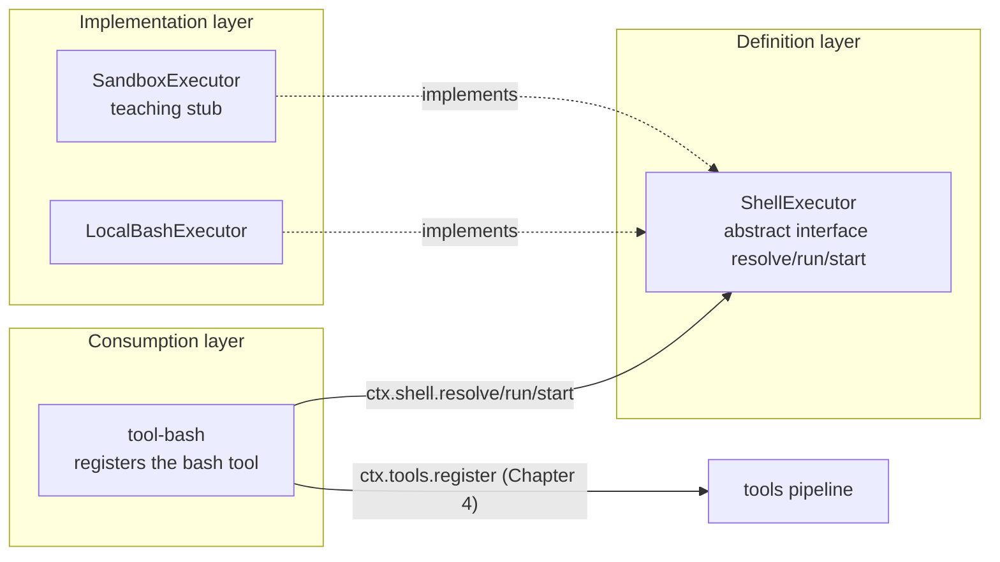

# Chapter 5: The Three Roles of the capability seam (Using shell as the Example)

> The seat stays, the actors may change; the audience watches the play and never asks about the backstage.

## Questions this chapter answers

- How is a capability (e.g., "which machine to run bash on") split into three mutually decoupled roles: definition, implementation, and consumption?
- What is the essential difference between a **method-call-style seam** (the three abstract methods `resolve`/`run`/`start`) and Chapter 4's **event-waterfall-style pipeline** (`tools/pre-execute → tools/execute → tools/post-execute`)?
- Why is it that when you "swap out `LocalBashExecutor`", neither the `ShellExecutor` definition nor the consumer `tool-bash` needs a single line changed?

In Chapter 4 we built the **tools guard pipeline**: `ctx.tools` chains `tools/pre-execute → tools/execute → tools/post-execute` with `waterfall`, letting guards insert interception before and after tool execution. But that pipeline's **fallback action** — actually executing some tool's body — was still just "a function the caller writes themselves". This chapter answers: how is a **capability** inside a tool body (e.g., "which machine to run bash on") split into three mutually decoupled roles: definition, implementation, and consumption. This chapter adds `ch05/code/`, reusing Chapter 1's `cordis.py` (`Context`/`Service`), Chapter 2's `SystemPromptService`, and Chapter 4's `ToolDefinition`/`ToolRuntime`.

## 1. Welding the "Capability" Shut Inside the Consumer

First look at a real scenario: you want to add a `bash` tool to the agent so it can run shell commands. The most direct way to write it is — `import subprocess` inside the tool body and run directly (`ch05/code/bad_example.py`, full file):

```python
# ch05/code/bad_example.py (new in this chapter, runnable)
"""Chapter 5 counterexample: the coupled way of writing without a capability seam.

Standard library only, Python 3.10+. Run: python3 bad_example.py

[Teaching positioning] The problem scenario for §1: if the consumer directly imports subprocess to run bash,
"which machine to run on" and "how to render the exit code" are all welded shut inside the consumer's body,
and swapping providers forces changes to the consumer.
Contrast with the correct solution: the consumer only faces the three methods of ctx.shell,
and swapping providers changes not a single line (see segment 4 of main.py).
"""
import subprocess


def run_bash_naive(command: str) -> str:
    """Hard-code the implementation details of "executing bash" directly inside the consumer.

    Problems:
    1. Swapping providers (local -> sandbox/remote) requires changing this line, and every caller changes along with it;
    2. The semantics of exit codes/timeouts/cancellation scatter across callers, with no unified marker contract;
    3. You cannot choose the provider at assembly time, nor mock it for testing.
    """
    p = subprocess.run(["bash", "-c", command], capture_output=True, text=True)
    return (p.stdout or "") + (p.stderr or "") + f"\n[exit code: {p.returncode}]"


if __name__ == "__main__":
    print(run_bash_naive("echo naive-no-seam"))
```

Running `python3 ch05/code/bad_example.py`, actual output:

```text
naive-no-seam

[exit code: 0]
```

This code runs, but "which machine to run bash on" and "how to render the exit code" are **all welded shut inside the consumer's body** — even the `[exit code: 0]` tail in the output is something the caller casually stitched together on its own, bringing three problems:

1. **Cannot swap the implementation**: one day you want to move commands into a sandbox (`bash-sandbox`) or switch to PowerShell (`pwsh-local`), and you must change this line in `run_bash_naive` — and every place that calls it must change along. There is no "choose one of two at composition time" seam anywhere; you can only invade the consumer.
2. **Exit-code semantics scattered**: the `[exit code: N]` marker is a string **you yourself** casually stitched together; switch to another tool (e.g., `pwsh`) and you must stitch it again; for edge cases like timeout, killed by signal, or cancelled, callers either ignore them or each invent their own representation.
3. **Cannot test in isolation**: to mock away the "execution" layer and test the upper logic, you can only monkey-patch `subprocess` — fragile and leaking implementation details.

This chapter uses the **three roles of the capability seam** to solve these three problems: split the **capability** of "running bash" into three parts — **definition** (Service Definition), **implementation** (Service Provider), and **consumption** (Consumer) — each independent, assembled at composition time.

## 2. Mechanism 1: Service Definition

> This chapter decomposes the three roles module by module: first the overall relationship diagram, then a breakdown one by one in the order "definition → implementation → consumption" (R9).



The diagram shows **three identities**: `ShellExecutor` defines "what can be done", `LocalBashExecutor`/`SandboxExecutor` each implement "how to do it", and `tool-bash` only cares about "using it". The consumer `tool-bash` only knows `ctx.shell` (pointing to the `ShellExecutor` abstraction) and **imports no concrete provider**; swapping providers only requires changing one line at the assembly site. Below we start with the definition layer.

### 2.1 Concept introduction: abstract interface + three methods

What is a **Service Definition**: the **contract face** a capability promises to the outside — it only declares "what methods exist and what type each returns", without writing any implementation. In this chapter it is the abstract class `ShellExecutor`, mounted on the one and only `ctx.shell` of each container context.

What problem does it solve: without it, consumers can only program against a **concrete implementation** (`LocalBashExecutor`), and swapping implementations forces changes to the consumer. With it, consumers program against an **abstract interface**, and any class that "implements these three methods" can replace it seamlessly.

Intuitive analogy: the definition layer is like **the standard for a power socket** — it only stipulates "two holes, 220V, live and neutral wires", not where the electricity comes from; the implementation layer is "coal power plant / solar PV / diesel generator", and the consumption layer is "the plug". Change the way you generate power, and neither the plug nor the socket standard needs a single line changed.

### 2.2 Internal implementation: three abstract methods make a "method-call-style" seam

The contract face of `ShellExecutor` is **three abstract methods** (`@abstractmethod`), which is exactly the "method-call-style seam" in this chapter's core assertion:

| Method | Input | Output | Semantics |
|---|---|---|---|
| `resolve(request)` | `ShellExecRequest` (only `command` required) | `ShellExecSpec` (all required) | Fill in defaults, cap the timeout |
| `run(spec)` | `ShellExecSpec` | `ShellRunResult` | Foreground execution, **never rejects** |
| `start(spec)` | `ShellExecSpec` | `ShellProcess` | Background execution, **returns a handle immediately** |

The key lies in the phrase "method-call-style": the consumer **directly calls** `ctx.shell.resolve(...)`, `ctx.shell.run(...)`, `ctx.shell.start(...)`, just like calling ordinary object methods. This forms an orthogonal contrast with Chapter 4's **event-waterfall-style** pipeline — Chapter 4's tools chain multiple listeners along event names via `waterfall('tools/pre-execute' ...)`, with the order decided by the "event chain"; this chapter's shell nails down three responsibilities via **abstract method signatures**, with the order hard-coded by the caller. One faces the "event stream", the other faces the "method interface", and the two can stack: this chapter's consumer happens to be a tool body inside Chapter 4's tools pipeline (see §4).

In addition, the definition layer provides two shared vocabularies: `ShellExecRequest` (the request) and `ShellExecSpec` (the full spec after resolve). The fields of `ShellExecRequest`, listed all at once: `command` is required; `workdir`/`timeout_ms`/`stdout_max_bytes`/`signal`/`stdin`/`env`/`dsh_env`/`sandbox_policy` are all optional — the job of `resolve` is to fill these optional fields into a fully-required spec (§3.2). The definition layer also provides a **shared marker contract** `parse_exit_status` (implementation in §2.3): it unifies the three exit-status markers at the tail of a command — `[exit code: N]` / `[killed by signal: X]` / `[timed out after Nms]` — into a single function for all consumers to reuse (solving half of problem 2, "exit-code semantics scattered").

### 2.3 Python reconstruction

```python
# ch05/code/shell.py (new in this chapter)
# ... s01's Service omitted (construction is registration, cordis.py) ...

class ShellExecutor(Service, ABC):
    def __init__(self, ctx):
        super().__init__(ctx, "shell")  # mount on ctx.shell (index.ts:66–68)

    @property
    def sandbox_mode(self):
        return None

    @abstractmethod
    def resolve(self, request: ShellExecRequest) -> ShellExecSpec:
        raise NotImplementedError

    @abstractmethod
    def run(self, spec: ShellExecSpec) -> ShellRunResult:
        raise NotImplementedError

    @abstractmethod
    def start(self, spec: ShellExecSpec) -> ShellProcess:
        raise NotImplementedError
```

Above is the interface skeleton (the remaining vocabulary types and `parse_exit_status` are in the §2.2 table and the full `shell.py`). Note `super().__init__(ctx, "shell")`: this is Chapter 1's `Service` base class "construction is registration" — whenever any subclass of `ShellExecutor` is instantiated, it automatically mounts itself on `ctx.shell`. Strictly speaking, Chapter 1's `provide` is a dict assignment with **silent overwrite of the same name** (cordis.py:92): constructing two providers one after another in the same context means the latter quietly replaces the former — ambiguous semantics. So the correct way to realize "one context has only one shell service" is not to cram two implementations into the same context, but to **assemble a fresh context for each provider** — §4.4's `ctx2` does exactly that. The consumer only needs `ctx.shell` and doesn't need to care which implementation is behind it.

The `ShellProcess` background handle returned by `start` in the table is also vocabulary of the definition layer (inside `shell.py`): its fields are `status` (enum `ShellProcessStatus`, values `running`/`completed`/`killed`), `exit_code`, `signal`; its methods are `done()` (wait for the terminal state and read back the result), `read_output()` (read output incrementally), `kill()` (terminate the process). What `proc.status.value` reads in §4.3 is the string value of this enum — the current state of the background handle.

The logic of `parse_exit_status` stripping the tail marker (corresponding to source `render.ts:36`, see the §6 source mapping table):

```python
# ch05/code/shell.py (module-level function)
def parse_exit_status(text: str) -> ParsedExitStatus:
    """Shared marker contract: strip the trailing [killed by signal: X] / [timed out after Nms] / [exit code: N] (render.ts:36–42).

    tool-pwsh and tool-bash reuse the same one, ensuring the presentation layer can read back the exit status.
    [Teaching decision] The teaching version adds a [timed out after Nms] parsing branch beyond the source's two branches,
    corresponding to render_result's independent timeout marker, closing the write-read contract.
    """
    import re

    m = re.search(r"\n\[killed by signal: ([^\]\n]+)\]$", text)
    if m is not None:
        return ParsedExitStatus(body=text[: m.start()], signal=m.group(1))
    m = re.search(r"\n\[timed out after \d+ms\]$", text)
    if m is not None:
        return ParsedExitStatus(body=text[: m.start()], timed_out=True)
    m = re.search(r"\n\[exit code: (\d+)\]$", text)
    if m is not None:
        return ParsedExitStatus(body=text[: m.start()], exit_code=int(m.group(1)))
    return ParsedExitStatus(body=text, exit_code=0)
```

It first matches "killed by signal", then "timed out", then "exit code"; if none matches, it defaults to `exit_code=0`. This way the presentation layer can always read back the exit status, and `tool-bash` and the future `tool-pwsh` share the same contract.

### 2.4 Recap: "cannot swap the implementation" is solved; what remains is "the implementation still has to be written out in full"

The definition layer has set up the abstract interface, and the consumer can now program against `ctx.shell` — but this only solves **half** of problem 1: the interface exists, yet someone still has to write the **concrete implementation**. `LocalBashExecutor` must handle `resolve`'s default-filling and capping, `run`'s timeout/cancellation, and `start`'s background handle on its own. If every provider writes this logic its own way, problem 2 (exit-code semantics scattered) still exists. This leads to mechanism 2.

## 3. Mechanism 2: Service Provider

### 3.1 Concept introduction: one interface, multiple implementations

What is a **Service Provider**: a **concrete class** that implements the three abstract methods of `ShellExecutor`, landing the "how to do it". This chapter's `LocalBashExecutor` is the provider for "executing with bash on the local machine".

What problem does it solve: the definition layer only gives the interface, not the behavior. The provider is the only role that knows "how a command actually gets running" — how `resolve` fills defaults, how `run` handles timeout and cancellation, how `start` manages background processes. Once this part is converged into the provider, the consumer **no longer touches** any stitching logic for exit codes/timeout/cancellation (the remaining part of problem 2).

Intuitive analogy: the provider is "a specific power plant" — it cares about how coal is burned, how electricity is generated, and how to shut down on failure, but externally it only obeys the three interfaces of the "socket standard".

### 3.2 Internal implementation: resolve fills defaults; run/start each take a spawn path

The key behaviors of `LocalBashExecutor` (four items):

- **`resolve`**: fills "a request with only command filled in" into "a fully-required spec" — `workdir` takes `request.workdir or config.cwd or current directory` (Python's `or` chain takes the first non-empty value), `timeout_ms` gets a `clamp` (default if not given, capped at the upper limit), `stdout_max_bytes` uses the default if not given and must be "positive and finite", otherwise an error is raised.
- **`run`** (foreground): `run_argv(spec, ['bash','-c', command])` → a single deadline fuses timeout and cancellation → `ctx.subprocess.spawn` → wait for `handle.done`. **Non-zero exit/timeout/abort all throw no exception**; they are resolved into a `ShellRunResult` (carrying `exit_code`/`timed_out`/`aborted`, etc.).
- **`start`** (background): `start_argv` → returns a `ShellProcess` handle **immediately** after spawn; the status goes `running → completed | killed`; the background **ignores `timeout_ms`** and stops only via `kill()`.
- **env merging**: `{**ENV_OVERRIDES, **spec.env, **spec.dsh_env}` — `ENV_OVERRIDES` (`NO_COLOR`/`TERM=dumb`, etc.) at the bottom, the caller's `spec.env` in the middle, and the trusted `dsh_env` with the highest priority.

The diagram below is the execution path of `run` (foreground), highlighting the key convention "resolve before run":


Note the **division of labor** between the two paths: `resolve` is responsible for "completing the spec"; `run`/`start` only consume the completed spec and **never take defaults a second time** (see §4.2). This guarantees that when "swapping providers", as long as `resolve`'s semantics are consistent, the spec received by `run`/`start` is consistent.

### 3.3 Python reconstruction

```python
# ch05/code/bash_local.py (new in this chapter)
# ... s01's Service, s05 shell.py's ShellExecutor/ShellExecSpec etc. omitted ...

class LocalBashExecutor(ShellExecutor):
    """Local bash implementation (index.ts:102).

    inject=['subprocess'] is injected by cordis in TS; the teaching version changes it
    to explicit injection via a constructor argument (notes §5 naming convention).
    """

    inject = ["subprocess"]

    def __init__(self, ctx, subprocess, config=None):
        super().__init__(ctx)  # mount on ctx.shell
        self._subprocess = subprocess
        self.config = config or Config()
        assert_serviceable_bash_config(self.config)

    # -- resolve: fill the request with defaults/cap into a spec (index.ts:146) --

    def resolve(self, request: ShellExecRequest) -> ShellExecSpec:
        timeout_ms = _clamp_timeout(request.timeout_ms, self.config)
        stdout_max_bytes = request.stdout_max_bytes if request.stdout_max_bytes is not None else self.config.max_output_bytes
        if stdout_max_bytes <= 0:
            raise ValueError("stdout_max_bytes must be positive and finite")  # assertPositiveFinite (:154)
        return ShellExecSpec(
            command=request.command,
            workdir=request.workdir or self.config.cwd or os.getcwd(),
            timeout_ms=timeout_ms,
            stdout_max_bytes=stdout_max_bytes,
            signal=request.signal,
            stdin=request.stdin,
            env=request.env,
            dsh_env=request.dsh_env,
            sandbox_policy=request.sandbox_policy,
        )
```

`resolve` fills the request into a full spec: the three defaults (`workdir`/`timeout_ms`/`stdout_max_bytes`) are all settled here, and an error is raised if `stdout_max_bytes` is invalid. Next let's see how `run` consumes the spec:

```python
# ch05/code/bash_local.py (methods of LocalBashExecutor)
    # -- run: foreground execution (index.ts:211 → runArgv :223) --

    def run(self, spec: ShellExecSpec) -> ShellRunResult:
        return self.run_argv(spec, ["bash", "-c", spec.command])

    def run_argv(self, spec: ShellExecSpec, argv) -> ShellRunResult:
        handle = self._subprocess.spawn(
            argv,
            workdir=spec.workdir,
            env=self._merged_env(spec),
            timeout_ms=spec.timeout_ms,
        )
        outcome = handle.done
        if outcome.get("killed"):
            # [Teaching simplification] When killed, exit_code is recorded as 0: a killed process has no normal exit code;
            # the real termination reason is carried by the signal field, and the presentation layer
            # distinguishes it by the [killed by signal: X] marker.
            return ShellRunResult(exit_code=0, signal="SIGKILL", aborted=True, timeout_ms=spec.timeout_ms)
        timed_out = outcome["timed_out"]
        # aborted: spec.signal.aborted and not timeout (index.ts:224)
        aborted = bool(spec.signal is not None and getattr(spec.signal, "aborted", False)) and not timed_out
        return ShellRunResult(
            exit_code=outcome["exit_code"] if outcome["exit_code"] is not None else 0,
            stdout=outcome["stdout"][: spec.stdout_max_bytes],
            stderr=outcome["stderr"][: spec.stdout_max_bytes],
            timed_out=timed_out,
            aborted=aborted,
            timeout_ms=spec.timeout_ms,
        )
```

`run` throws no exception; it folds "non-zero exit/timeout/cancellation" all into `ShellRunResult` (the `timed_out`/`aborted` fields) — this is exactly the "never rejects" in the §2.2 table.

`ctx.subprocess` is a seam that only unfolds in Chapter 6; this chapter uses a teaching stub `SubprocessStub` (inside `bash_local.py`) as a placeholder: its `spawn` executes synchronously using the standard library's `subprocess.run` and returns a handle with `done`/`read_output`/`kill`. The real behavior is asynchronous process-tree management; here only the mechanism face of "spawn→done" is kept (`[Teaching simplification]`, see §6 source mapping for details).

### 3.4 Recap: the implementation exists, but the consumer still doesn't know how to "use" it

Now both the interface (definition) and the implementation (provider) are in place, and `LocalBashExecutor` knows how to run bash. But **with just these two roles, the agent still cannot use it** — someone has to register "the bash tool" into Chapter 4's `ctx.tools` pipeline and render "the result after execution" into text the model can read. This is the real solution to problem 3 (cannot test in isolation + consumers each assembling their own logic), leading to mechanism 3.

## 4. Mechanism 3: Consumer

### 4.1 Concept introduction: facing the abstraction, not knowing the implementation

What is a **Consumer**: the party that uses this capability. This chapter's `tool-bash` is a **module-level plugin** — `name`, `inject`, `apply` are all module-level metadata and functions, belonging to the "apply object" form among Chapter 1's three plugin forms (function / class / apply object): the module itself is an object with an `apply` attribute. It does two things: injects a piece of guidance on "how to read exit markers" into the system-prompt, and registers a `bash` tool into `ctx.tools`. `[Teaching simplification]` In real cordis, after `ctx.plugin(tool_bash)` the container reads `inject` to auto-inject dependencies before activating; this chapter's teaching version manually calls `tool_bash.apply(ctx)` at the assembly site in `main.py`, and `inject` is only declarative metadata — but the dependency list it declares corresponds one-to-one with the services the plugin body actually consumes.

What problem does it solve: the consumer is the only role "facing the user/model" — it is responsible for rendering `ShellRunResult` into readable text with an `[exit code: N]` marker, and deciding "foreground `run` or background `start`". The key constraint is: **it only imports the `shell` abstraction and never imports `bash_local`**, so when swapping providers (e.g., replacing `LocalBashExecutor` with a sandbox implementation), the consumer **changes not a single line**.

Intuitive analogy: the consumer is "the plug" — it only recognizes the socket standard (the three methods of `ctx.shell`), not who the power plant is. Change the power plant, and the plug still plugs in just the same.

### 4.2 Internal implementation: execute is exactly the tool body inside the tools pipeline

The core of `tool-bash` is `execute(args, exec)` — this function **plays two orthogonal roles at the same time**:

- In the **tools pipeline** (Chapter 4), it is **a tool body** registered via `ctx.tools.register(defineTool(...))`, called by the `tools/execute` waterfall's fallback `dispatchToolBody`.
- In the **shell seam** (this chapter), it is **the consumer**: `resolve → run/start`, handing the result to `render_result` to render.

This is exactly the connection point between this chapter and Chapter 4 (expanded in §6): **the Consumer among the three shell roles happens to be a tool body inside the tools pipeline**. One faces the "method interface", the other faces the "event stream", stacked orthogonally.

The orchestration order of `execute`: validate arguments → assemble `ShellExecRequest` → **`resolve` first, then `run`/`start`** → render. The key convention is "resolve first, run after": the spec received by `run`/`start` already carries explicit defaults and never takes defaults a second time.

### 4.3 Python reconstruction

```python
# ch05/code/tool_bash.py (new in this chapter)
# ... s01's Context, s04's ToolDefinition, s05 shell.py's ShellExecRequest omitted ...
# The "consumer" of the three roles: only faces the ctx.shell abstraction, does not import any concrete provider.

name = "tool-bash"
inject = ["shell", "systemPrompt", "tools"]


def apply(ctx: Context):
    """tool-bash plugin body (index.ts:27): inject guidance + register the bash tool.

    The consumer's duties are only two:
    1. Inject a piece of guidance on "how to read exit markers" into the system-prompt;
    2. Register a tool body into ctx.tools (Chapter 4's pipeline); that tool body internally only calls the three methods of ctx.shell.
    """

    # 1. guidance: teach the model to read the [exit code: N] marker (index.ts:28-30)
    ctx.systemPrompt.section("tool:bash", _guidance_text(), order=10)

    # 2. Register the bash tool: execute is exactly a tool body inside Chapter 4's tools pipeline (index.ts:120)
    def bash_tool(args, exec):
        # Facing the abstraction: resolve → run; the consumer doesn't know LocalBashExecutor (index.ts:120-135)
        request = ShellExecRequest(command=args["command"], timeout_ms=args.get("timeout_ms"))
        spec = ctx.shell.resolve(request)
        if args.get("background"):
            proc = ctx.shell.start(spec)
            return f"[started in background, status={proc.status.value}]"
        result = ctx.shell.run(spec)
        return render_result(result)

    ctx.tools.register(
        ToolDefinition(
            name="bash",
            description="Execute bash commands (shell seam consumer)",
            parameters={"command": "string", "timeout_ms": "int?", "background": "bool?"},
            execute=bash_tool,
        )
    )
```

Note three places: inside `bash_tool` only `ctx.shell.resolve/run/start` appears — **the string `LocalBashExecutor` appears nowhere**, which is direct evidence of "the consumer doesn't know the implementation"; `ctx.systemPrompt.section` reuses Chapter 2; `ctx.tools.register` reuses Chapter 4. The `proc.status.value` in the background branch reads the string value of the `ShellProcess.status` enum (`running`/`completed`/`killed`; field description in §2.3). `render_result` is responsible for writing the markers:

```python
# ch05/code/tool_bash.py (module-level function)
def render_result(result: ShellRunResult) -> str:
    """Render ShellRunResult: append the shared marker at the tail (render.ts:58).

    The marker is the "exit-status contract" of the shell seam: the consumer is responsible for writing it,
    and parse_exit_status is responsible for reading it.
    [Teaching decision] Timeout is written as an independent [timed out after Nms] marker,
    corresponding to parse_exit_status's timeout branch.
    """
    body = result.stdout or ""
    if result.stderr:
        body += ("\n[stderr]\n" + result.stderr) if body else result.stderr
    if result.timed_out:
        # [Teaching decision] Render timeout as an independent marker, ensuring parse_exit_status can read it back (write-read closed loop)
        return body + f"\n[timed out after {result.timeout_ms}ms]"
    if result.signal:
        return body + f"\n[killed by signal: {result.signal}]"
    return body + f"\n[exit code: {result.exit_code}]"
```

The three markers `[timed out after Nms]` / `[killed by signal: X]` / `[exit code: N]` written by `render_result` can all be read back one by one by §2.3's `parse_exit_status` — writing and reading use **the same contract**, a write-read closed loop, ensuring exit-status semantics do not scatter (problem 2 fully solved).

### 4.4 Recap: swap the provider; the consumer changes not a single line

All three roles are in place. Now we cash in this chapter's core assertion (R28): **swap out `LocalBashExecutor`, and neither the `ShellExecutor` definition nor the consumer `tool-bash` changes a single line**. This chapter adds a second provider form `SandboxExecutor` (teaching stub) to demonstrate:

```python
# ch05/code/sandbox_executor.py (new in this chapter)
class SandboxExecutor(ShellExecutor):
    """Simulated sandbox implementation: same interface as LocalBashExecutor, different behavior.

    Provider-swap demo: neither the consumer tool-bash nor the definition ShellExecutor changes a single line;
    only at the assembly site is ctx.shell swapped from LocalBashExecutor to SandboxExecutor.
    """

    def __init__(self, ctx):
        super().__init__(ctx)  # mount on ctx.shell
        self.log = []  # record the commands "put into the sandbox"

    @property
    def sandbox_mode(self):
        return "sandbox"  # contrast with LocalBashExecutor's None

    def resolve(self, request):
        return ShellExecSpec(command=request.command, workdir="/sandbox", timeout_ms=request.timeout_ms or 30000, stdout_max_bytes=1024 * 1024)

    def run(self, spec):
        self.log.append(spec.command)
        return ShellRunResult(
            exit_code=0,
            stdout=f"[sandbox] command recorded: {spec.command}\n[sandbox] not actually executed (teaching stub)",
        )

    def start(self, spec):
        raise NotImplementedError("the teaching stub does not implement background execution")
```

Note that `SandboxExecutor` **implements all three methods** `resolve`/`run`/`start` — what is swapped is the implementation, not the interface; its `run` does not really spawn, but records the command into `self.log` and returns two lines of string "command recorded / not actually executed (teaching stub)", and then the same `render_result` appends `[exit code: 0]` (§5 output segment 4). In `main.py`, the assembly site swaps `ctx.shell` from `LocalBashExecutor` to `SandboxExecutor`, and neither the consumer `tool_bash.apply` nor the definition `ShellExecutor` changes a single line.

## 5. Full Run Output

How to run: `python3 ch05/code/main.py` (all mechanisms explained; only here is the end-to-end output shown, R17).

```text
== 1. Assemble the container + three roles in place ==
  ctx.shell = LocalBashExecutor
  ctx.shell.sandbox_mode = None
  tool-bash inject = ['shell', 'systemPrompt', 'tools']
  The tool:bash section of the system-prompt has been injected:
    bash tool: execute shell commands. A [exit code: N] marker is appended at the tail of the command output; N=0 means success, non-zero means failure; [killed by signal: X] means terminated by a signal. Judge whether the command succeeded accordingly.

== 2. Foreground run: resolve → run ==
hello-from-shell-seam

[exit code: 0]
  [parse marker] body='hello-from-shell-seam\n' exit_code=0

== 3. Background start: returns a running handle immediately ==
  [started in background, status=running]

== 4. Swap provider: ctx.shell swapped to SandboxExecutor ==
  ctx2.shell = SandboxExecutor
  ctx2.shell.sandbox_mode = sandbox
[sandbox] command recorded: rm -rf /tmp/dangerous
[sandbox] not actually executed (teaching stub)
[exit code: 0]
  Neither the same consumer tool_bash nor the definition ShellExecutor changed a single line.

== 5. Method-call-style seam vs event-waterfall-style pipeline ==
  shell seam: three abstract methods (resolve/run/start); the consumer calls methods directly
  tools pipeline: tools/pre-execute → tools/execute → tools/post-execute, event waterfall
  The two are orthogonal: the bash tool body's execute is exactly a tool body inside the tools pipeline
```

Segment-by-segment trace (R21):

- Segment 1: `main.py` prints the assembly result. `ctx.shell = LocalBashExecutor` comes from the provider passed into `_assemble`; `sandbox_mode = None` is `ShellExecutor`'s default; `inject` is `tool_bash`'s module-level metadata; the section text comes from `tool_bash._guidance_text()`.
- Segment 2: `echo hello-from-shell-seam` is really executed via `bash_tool → resolve → run`; `stdout` is the command output, and the trailing `[exit code: 0]` is appended by `render_result`; the `[parse marker]` line is `main.py` calling `parse_exit_status` to read back, proving the write-read contract is closed.
- Segment 3: background `start` returns immediately; `status=running` proves "start does not block".
- Segment 4: after swapping providers, `sandbox_mode = sandbox`; the `rm -rf` command is recorded by the sandbox without being actually executed, and the tail is still rendered by the same `render_result` — the consumer changed not a single line.
- Segment 5: `main.py` prints the orthogonal contrast between the two main lines.

## 6. Source Mapping

The mechanism explanations in this chapter do not insert source excerpts; the corresponding source locations and teaching-version differences are given collectively here (R18).

`packages/shell` and `packages/tool` are the two packages newly introduced in this chapter: the former carries the definition and each provider of the shell capability, and the latter carries the model-facing consumer plugin. They stand alongside `packages/core` used in previous chapters (Chapter 2's agent-loop/system-prompt, Chapter 3's session, and Chapter 4's tools are all under it) and `packages/llm` (Chapter 2's llm) — the container foundation is still Chapter 1's `Context`, and the new packages only carry the two roles of "implementation" and "consumption" of a capability.

| This chapter's mechanism | Corresponding source location | Summary of teaching-version differences |
|---|---|---|
| Three roles definition/implementation/consumption | `packages/shell/shell/src/index.ts:65`, `packages/shell/bash-local/src/index.ts:102`, `packages/tool/tool-bash/src/index.ts:190` | The three-role structure is consistent; Python uses `Service`'s construction-is-registration to replace cordis's composition-time assembly |
| `resolve/run/start` abstract methods | `shell/src/index.ts:85/:93/:100` | Same signatures; `abstract` → `abc.ABC` + `@abstractmethod` |
| `sandbox_mode` defaults to `None` | `shell/src/index.ts:75` | Same meaning; `get sandboxMode()` → `@property sandbox_mode` |
| `ShellExecRequest/Spec/RunResult` | `shell/src/types.ts:38/:86/:113` | Same fields; TS `z.object()` → Python `@dataclass`, no schemastery |
| `parse_exit_status` marker contract | `shell/src/render.ts:36` | `[Teaching decision]` The teaching version adds a `[timed out after Nms]` parsing branch beyond the source's two branches (corresponding to `render_result`'s independent timeout marker); the rest has the same regex semantics |
| `LocalBashExecutor`'s `resolve` default capping | `bash-local/src/index.ts:146`, `:154` | Same `clamp`/`assertPositiveFinite` semantics; the teaching version's `assert_serviceable_bash_config` only validates positivity and the grace upper limit |
| `run`/`runArgv` never reject | `bash-local/src/index.ts:211/:223` | Same "non-zero/timeout/abort all resolve"; the real version's `deadline(signal, timeoutMs, 'BASH_TIMEOUT')` fuses timeout and cancellation; the teaching version splits it into the `timed_out` inside `handle.done` + the `spec.signal.aborted` check |
| `start`/`startArgv` background handle | `bash-local/src/index.ts:242/:255` | Same "returns immediately, ignores timeout, stops only via kill"; the real version has asynchronous `readOutput` incremental reading + spill to disk; the teaching version is a synchronous stub returning once |
| `ctx.subprocess` dependency | `bash-local/src/index.ts:103` | The real version is the process-tree seam (unfolded in Chapter 6); the teaching version's `SubprocessStub` uses the standard library's `subprocess.run` for synchronous execution, keeping only the mechanism face of `spawn/done/read_output/kill` |
| `tool-bash`'s `execute` orchestration | `tool-bash/src/index.ts:330`, `:380` | Same "resolve first, then run/start"; in the real version's `execute(args, exec)`, `exec.signal` goes through the cancellation chain and `ctx.shellEnv.collect` takes a `DSH_*` snapshot; the teaching version omits these two places (the assertion that the consumer does not import the provider still holds) |
| `render_result` marker write side | `tool-bash/src/render.ts:28` | Same tail markers; `[Teaching decision]` the teaching version renders timeout as an independent `[timed out after Nms]` marker (ensuring `parse_exit_status` can read back); the real version also includes `render_process_read` (background incremental); the teaching version only keeps foreground rendering |

## 7. Summary and Preview

This chapter used the **three roles of the capability seam** to split a "capability" into three parts: **definition** (`ShellExecutor`: the three abstract methods `resolve`/`run`/`start`), **implementation** (`LocalBashExecutor` local bash), and **consumption** (`tool-bash` registers the bash tool), cashing in the core assertion "swap the implementation; neither the definition nor the consumer changes a single line" — this is the "method-call-style" seam, stacked orthogonally with Chapter 4 tools' "event-waterfall-style" pipeline.

The next chapter will unveil the foreshadowing buried in this chapter: what exactly is `ctx.subprocess`, the dependency of `LocalBashExecutor`'s `inject=['subprocess']` — Chapter 6 unfolds the **subprocess seam** (process tree / spawn / kill / signal), letting the agent actually do things on the machine.

## 8. Appendix: Key Concepts Cheat Sheet

Only concepts defined in this chapter are listed, layered by dependency (bottom → top).

| Concept | One-line explanation | Depends on |
|---|---|---|
| **Service Definition** | The contract face a capability promises to the outside; only declares methods, writes no implementation (this chapter's `ShellExecutor`) | — (bottom layer) |
| **Method-call-style seam** | The consumer directly calls abstract methods (`resolve/run/start`); the order is hard-coded by the caller | Service Definition |
| **Vocabulary types (DTO)** | The shared vocabulary between the definition layer and the implementation/consumption (`ShellExecRequest`/`ShellExecSpec`/`ShellRunResult`) | Service Definition |
| **Marker contract** | The write (`render_result`) and read (`parse_exit_status`) closed loop of exit-status tail markers | Vocabulary types |
| **Service Provider** | The concrete class implementing the abstract methods; the only one who knows "how to do it" (`LocalBashExecutor`) | Service Definition |
| **Consumer** | The party that uses the capability facing the `ctx.shell` abstraction; does not import concrete providers (`tool-bash`) | Service Definition, Service Provider |
| **Three roles of capability seam** | The organizational paradigm that decouples a capability into definition/implementation/consumption | All of the above |

| Python symbol | Source symbol |
|---|---|
| `ShellExecutor` | `ShellExecutor` |
| `ShellExecRequest` / `ShellExecSpec` / `ShellRunResult` | Same name (TS `camelCase` fields → `snake_case`) |
| `parse_exit_status` | `parseExitStatus` |
| `LocalBashExecutor` | `LocalBashExecutor` |
| `SandboxExecutor` | Teaching stub (the real version is `bash-sandbox` etc.) |
| `tool_bash` | `tool-bash` |
| `render_result` | `renderResult` |
