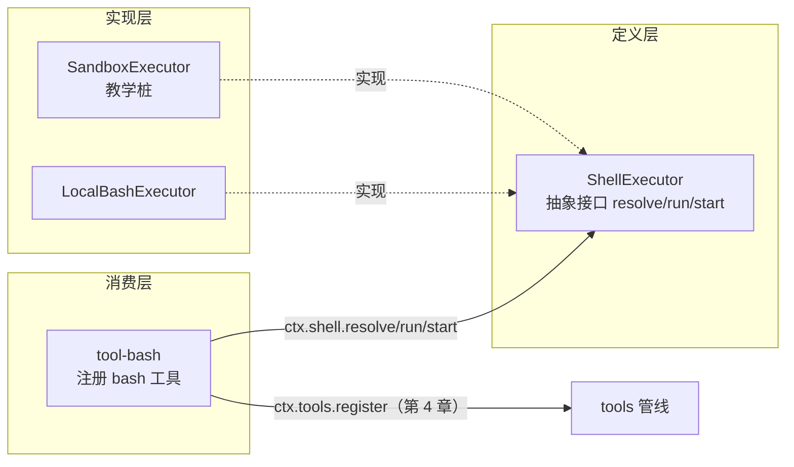
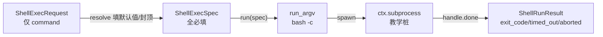

# 第 5 章 capability seam 三角色（以 shell 为例）

> 席位常在，演员可换；观众看戏，不问后台。

## 本章回答的问题

- 一个能力（比如「在哪台机器上跑 bash」）如何被拆成定义、实现、消费三个互不耦合的角色？
- **方法调用式 seam**（`resolve`/`run`/`start` 三个抽象方法）与第 4 章的**事件瀑布式管线**（`tools/pre-execute → tools/execute → tools/post-execute`）有何本质区别？
- 为什么「换掉 `LocalBashExecutor`」，`ShellExecutor` 定义与消费者 `tool-bash` 可以一行不改？

第 4 章我们建起了 **tools 守卫管线**：`ctx.tools` 用 `waterfall` 串联 `tools/pre-execute → tools/execute → tools/post-execute`，让守卫（guard）在工具执行前后插入拦截。但那条管线的**兜底动作**——真正执行某个工具的 body——还只是一个「调用方自己写的函数」。本章回答：一个工具 body 里的**能力**（比如「在哪台机器上跑 bash」）如何被拆成定义、实现、消费三个互不耦合的角色。本章新增 `ch05/code/`，复用第 1 章 `cordis.py`（`Context`/`Service`）、第 2 章 `SystemPromptService`、第 4 章 `ToolDefinition`/`ToolRuntime`。

## 1. 把「能力」焊死在消费者体内

先看一个真实场景：你要给 agent 加一个 `bash` 工具，让它能执行 shell 命令。最直接的写法是——在工具体里 `import subprocess` 直接跑（`ch05/code/bad_example.py`，完整文件）：

```python
# ch05/code/bad_example.py（本章新增，可运行）
"""第 5 章反面示例：没有 capability seam 时的耦合写法。

仅标准库，Python 3.10+。运行：python3 bad_example.py

[教学定位] 用于 §1 的问题场景：如果消费者直接 import subprocess 跑 bash，
「在哪台机器跑」「怎么渲染退出码」全焊死在消费者体内，换 provider 必须改消费者。
对比正解：消费者只面向 ctx.shell 三个方法，换 provider 一行不改（见 main.py 第 4 段）。
"""
import subprocess


def run_bash_naive(command: str) -> str:
    """把「执行 bash」的实现细节直接写死在消费者里。

    问题：
    1. 换 provider（本地 → 沙箱/远程）要改这一行，所有调用方跟着改；
    2. 退出码/超时/取消的语义散落调用方，没有统一 marker 契约；
    3. 无法在装配期选择 provider，也无法为测试 mock。
    """
    p = subprocess.run(["bash", "-c", command], capture_output=True, text=True)
    return (p.stdout or "") + (p.stderr or "") + f"\n[exit code: {p.returncode}]"


if __name__ == "__main__":
    print(run_bash_naive("echo naive-no-seam"))
```

运行 `python3 ch05/code/bad_example.py`，实际输出：

```text
naive-no-seam

[exit code: 0]
```

这段代码能跑，但「在哪台机器上跑 bash」「怎么渲染退出码」**全部焊死在消费者体内**——连输出里的 `[exit code: 0]` 尾巴都是调用方自己随手拼的，带来三个问题：

1. **换不了实现**：某天你要把命令挪进沙箱（`bash-sandbox`）或换成 PowerShell（`pwsh-local`），就必须改 `run_bash_naive` 这一行——而且每个调用它的地方都要跟着改。没有一处「组合期二选一」的接缝，只能侵入消费者。
2. **退出码语义散落**：`[exit code: N]` 这个标记是**你自己**随手拼的字符串，换一个工具（比如 `pwsh`）又得再拼一遍；超时、被信号杀、被取消这些边界，调用方要么不管、要么各自发明一套表达。
3. **无法隔离测试**：要 mock 掉「执行」这一层来测上层逻辑，只能 monkey-patch `subprocess`，脆弱且泄漏实现细节。

本章用 **capability seam 三角色**解决这三个问题：把「跑 bash」这个**能力**（capability）拆成**定义**（Service Definition）、**实现**（Service Provider）、**消费**（Consumer）三份，各自独立、组合期拼装。

## 2. 机制一：Service Definition

> 本章逐模块拆解三角色，先给整体关系图，再按「定义 → 实现 → 消费」逐一拆解（R9）。



图里是**三种身份**：`ShellExecutor` 定义「能做什么」，`LocalBashExecutor`/`SandboxExecutor` 各自实现「怎么做」，`tool-bash` 只管「拿来用」。消费者 `tool-bash` 只认识 `ctx.shell`（指向 `ShellExecutor` 抽象），**不 import 任何具体 provider**；换 provider 只需在装配处换一行。下面先讲定义层。

### 2.1 概念引入：抽象接口 + 三个方法

**Service Definition（服务定义）** 是什么：一个能力对外承诺的**契约面**——它只声明「有哪些方法、各返回什么类型」，不写任何实现。在本章它就是抽象类 `ShellExecutor`，挂在每个容器 context 唯一的一个 `ctx.shell` 上。

它解决什么问题：没有它，消费者只能对着**具体实现**（`LocalBashExecutor`）编程，换实现就得改消费者。有了它，消费者对着**抽象接口**编程，任何「实现这三个方法」的类都能无缝替换。

直觉类比：定义层像**电源插座的标准**——它只规定「两个孔、220V、零火线」，不规定电从哪来；实现层是「火电厂 / 光伏 / 柴油发电机」，消费层是「插头」。你换发电方式，插头和插座标准一行都不用改。

### 2.2 内部实现：三个抽象方法即「方法调用式」seam

`ShellExecutor` 的契约面是**三个抽象方法**（`@abstractmethod`），这就是本章核心论断里的「方法调用式 seam」：

| 方法 | 输入 | 输出 | 语义 |
|---|---|---|---|
| `resolve(request)` | `ShellExecRequest`（仅 `command` 必填） | `ShellExecSpec`（全必填） | 填默认值、封顶超时 |
| `run(spec)` | `ShellExecSpec` | `ShellRunResult` | 前台执行，**永不 reject** |
| `start(spec)` | `ShellExecSpec` | `ShellProcess` | 后台执行，**立即返回句柄** |

关键在「方法调用式」四个字：消费者**直接调用** `ctx.shell.resolve(...)`、`ctx.shell.run(...)`、`ctx.shell.start(...)`，像调普通对象方法一样。这与第 4 章的 **事件瀑布式** 管线形成正交对比——第 4 章 tools 是靠 `waterfall('tools/pre-execute' ...)` 沿事件名把多个监听器串起来，顺序由「事件链」决定；本章 shell 靠**抽象方法签名**把三种职责钉死，顺序由「调用者写死」。一个面向「事件流」，一个面向「方法接口」，二者可叠加：本章的消费者恰是第 4 章 tools 管线里的一个 tool body（见 §4）。

此外定义层还提供两个共享词汇表：`ShellExecRequest`（请求）与 `ShellExecSpec`（resolve 后的全量规格）。`ShellExecRequest` 的字段一次列全：`command` 必填；`workdir`/`timeout_ms`/`stdout_max_bytes`/`signal`/`stdin`/`env`/`dsh_env`/`sandbox_policy` 全部可选——`resolve` 的工作就是把这些可选字段填成一份全必填的 spec（§3.2）。定义层还提供一个**共享 marker 契约** `parse_exit_status`（实现见 §2.3）：它把命令尾部的三种退出状态标记——`[exit code: N]` / `[killed by signal: X]` / `[timed out after Nms]`——统一成一份函数，供所有消费者复用（解决问题 2「退出码语义散落」的一半）。

### 2.3 Python 重构

```python
# ch05/code/shell.py（本章新增）
# ... s01 的 Service 省略（构造即注册，cordis.py）...

class ShellExecutor(Service, ABC):
    def __init__(self, ctx):
        super().__init__(ctx, "shell")  # 挂到 ctx.shell（index.ts:66–68）

    @property
    def sandbox_mode(self):
        return None

    @abstractmethod
    def resolve(self, request: ShellExecRequest) -> ShellExecSpec:
        raise NotImplementedError

    @abstractmethod
    def run(self, spec: ShellExecSpec) -> ShellRunResult:
        raise NotImplementedError

    @abstractmethod
    def start(self, spec: ShellExecSpec) -> ShellProcess:
        raise NotImplementedError
```

上面是接口骨架（其余词汇类型与 `parse_exit_status` 见 §2.2 表格与 `shell.py` 全文）。注意 `super().__init__(ctx, "shell")`：这是第 1 章 `Service` 基类的「构造即注册」——`ShellExecutor` 的每个子类实例化时，自动把自己挂到 `ctx.shell`。严格说，第 1 章的 `provide` 是 dict 赋值，**同名静默覆盖**（cordis.py:92）：在同一 context 里先后构造两个 provider，后一个会悄悄顶掉前一个，语义含混。所以「一个 context 只有一个 shell 服务」的正确打开方式不是往同一 context 里塞两个实现，而是**为每个 provider 装配一个新 context**——§4.4 的 `ctx2` 正是如此。消费者只需 `ctx.shell`，不必关心背后是哪个实现。

表格里 `start` 返回的 `ShellProcess` 后台句柄也是定义层的词汇（`shell.py` 内）：字段为 `status`（枚举 `ShellProcessStatus`，取值 `running`/`completed`/`killed`）、`exit_code`、`signal`；方法为 `done()`（等待终态并回读结果）、`read_output()`（增量读输出）、`kill()`（终止进程）。§4.3 里 `proc.status.value` 读的就是这个枚举的字符串值——后台句柄的当前状态。

`parse_exit_status` 剥离尾部标记的逻辑（对应源码 `render.ts:36`，见 §6 源码对照表）：

```python
# ch05/code/shell.py（模块级函数）
def parse_exit_status(text: str) -> ParsedExitStatus:
    """共享 marker 契约：剥离尾部 [killed by signal: X] / [timed out after Nms] / [exit code: N]（render.ts:36–42）。

    tool-pwsh 与 tool-bash 复用同一份，保证展示层能回读退出状态。
    [教学决策] 教学版在源码两个分支之外补 [timed out after Nms] 解析分支，
    与 render_result 的独立超时 marker 对应，使写读契约闭合。
    """
    import re

    m = re.search(r"\n\[killed by signal: ([^\]\n]+)\]$", text)
    if m is not None:
        return ParsedExitStatus(body=text[: m.start()], signal=m.group(1))
    m = re.search(r"\n\[timed out after \d+ms\]$", text)
    if m is not None:
        return ParsedExitStatus(body=text[: m.start()], timed_out=True)
    m = re.search(r"\n\[exit code: (\d+)\]$", text)
    if m is not None:
        return ParsedExitStatus(body=text[: m.start()], exit_code=int(m.group(1)))
    return ParsedExitStatus(body=text, exit_code=0)
```

它先匹配「被信号杀」，再匹配「超时」，再匹配「退出码」，都没有则默认 `exit_code=0`。这样展示层永远能回读退出状态，且 `tool-bash` 与未来的 `tool-pwsh` 共用同一份契约。

### 2.4 回溯：解决了「换不了实现」，还剩「实现仍要自己写全」

定义层立起了抽象接口，消费者可以面向 `ctx.shell` 编程了——但这只解决了问题 1 的**一半**：接口有了，可**具体实现**还得有人写。`LocalBashExecutor` 要自己处理 `resolve` 的默认值封顶、`run` 的超时/取消、`start` 的后台句柄。如果这块逻辑每个 provider 各写各的，问题 2（退出码语义散落）依然存在。于是引出机制二。

## 3. 机制二：Service Provider

### 3.1 概念引入：一个接口，多个实现

**Service Provider（服务实现）** 是什么：实现了 `ShellExecutor` 三个抽象方法的**具体类**，把「怎么做」落实。本章的 `LocalBashExecutor` 是「在本地机器上用 bash 执行」的 provider。

它解决什么问题：定义层只给接口，不给行为。provider 是唯一知道「命令到底怎么跑起来」的角色——`resolve` 怎么填默认值、`run` 怎么处理超时与取消、`start` 怎么管理后台进程。把这块收敛进 provider 后，消费者**不再碰**任何退出码/超时/取消的拼接逻辑（问题 2 的剩余部分）。

直觉类比：provider 是「具体某个发电厂」——它关心煤怎么烧、电怎么发、出故障怎么停机，但对外只遵守「插座标准」那三个接口。

### 3.2 内部实现：resolve 填默认值、run/start 各走一条 spawn 路径

`LocalBashExecutor` 的关键行为（四项）：

- **`resolve`**：把「只填了 command 的请求」填成「全必填的 spec」——`workdir` 取 `request.workdir or config.cwd or 当前目录`（Python 的 `or` 链取第一个非空值），`timeout_ms` 做 `clamp`（未给用默认、超上限封顶），`stdout_max_bytes` 未给用默认且必须「正且有限」否则抛错。
- **`run`**（前台）：`run_argv(spec, ['bash','-c', command])` → 单一 deadline 融合超时与取消 → `ctx.subprocess.spawn` → 等 `handle.done`。**非零退出/超时/中止都不抛异常**，而是 resolve 成 `ShellRunResult`（携带 `exit_code`/`timed_out`/`aborted` 等）。
- **`start`**（后台）：`start_argv` → spawn 后**立即**返回 `ShellProcess` 句柄，状态走 `running → completed | killed`，后台**忽略 `timeout_ms`**，只靠 `kill()` 停止。
- **env 合并**：`{**ENV_OVERRIDES, **spec.env, **spec.dsh_env}`——`ENV_OVERRIDES`（`NO_COLOR`/`TERM=dumb` 等）垫底，调用方 `spec.env` 居中，受信 `dsh_env` 最高优先级。

下图是 `run`（前台）的执行路径，突出「resolve 先于 run」这一关键约定：



注意两条路径的**分工**：`resolve` 负责「把规格补齐」，`run`/`start` 只消费已补齐的 spec、**不再二次取默认**（见 §4.2）。这保证了「换 provider」时，只要 `resolve` 语义一致，`run`/`start` 收到的 spec 就一致。

### 3.3 Python 重构

```python
# ch05/code/bash_local.py（本章新增）
# ... s01 的 Service、s05 shell.py 的 ShellExecutor/ShellExecSpec 等省略 ...

class LocalBashExecutor(ShellExecutor):
    """本地 bash 实现（index.ts:102）。

    inject=['subprocess'] 在 TS 里由 cordis 注入；教学版改为构造参数显式注入（notes §5 命名通则）。
    """

    inject = ["subprocess"]

    def __init__(self, ctx, subprocess, config=None):
        super().__init__(ctx)  # 挂到 ctx.shell
        self._subprocess = subprocess
        self.config = config or Config()
        assert_serviceable_bash_config(self.config)

    # -- resolve：把请求填默认值/封顶成 spec（index.ts:146） --

    def resolve(self, request: ShellExecRequest) -> ShellExecSpec:
        timeout_ms = _clamp_timeout(request.timeout_ms, self.config)
        stdout_max_bytes = request.stdout_max_bytes if request.stdout_max_bytes is not None else self.config.max_output_bytes
        if stdout_max_bytes <= 0:
            raise ValueError("stdout_max_bytes 必须为正且有限")  # assertPositiveFinite (:154)
        return ShellExecSpec(
            command=request.command,
            workdir=request.workdir or self.config.cwd or os.getcwd(),
            timeout_ms=timeout_ms,
            stdout_max_bytes=stdout_max_bytes,
            signal=request.signal,
            stdin=request.stdin,
            env=request.env,
            dsh_env=request.dsh_env,
            sandbox_policy=request.sandbox_policy,
        )
```

`resolve` 把请求填成全量 spec：三处默认值（`workdir`/`timeout_ms`/`stdout_max_bytes`）都在这落定，`stdout_max_bytes` 非法时抛错。下面看 `run` 如何消费 spec：

```python
# ch05/code/bash_local.py（LocalBashExecutor 的方法）
    # -- run：前台执行（index.ts:211 → runArgv :223） --

    def run(self, spec: ShellExecSpec) -> ShellRunResult:
        return self.run_argv(spec, ["bash", "-c", spec.command])

    def run_argv(self, spec: ShellExecSpec, argv) -> ShellRunResult:
        handle = self._subprocess.spawn(
            argv,
            workdir=spec.workdir,
            env=self._merged_env(spec),
            timeout_ms=spec.timeout_ms,
        )
        outcome = handle.done
        if outcome.get("killed"):
            # [教学简化] killed 时 exit_code 记 0：被杀进程没有正常退出码，
            # 真实终止原因由 signal 字段承载，展示层靠 [killed by signal: X] marker 区分。
            return ShellRunResult(exit_code=0, signal="SIGKILL", aborted=True, timeout_ms=spec.timeout_ms)
        timed_out = outcome["timed_out"]
        # aborted: spec.signal.aborted and not timeout (index.ts:224)
        aborted = bool(spec.signal is not None and getattr(spec.signal, "aborted", False)) and not timed_out
        return ShellRunResult(
            exit_code=outcome["exit_code"] if outcome["exit_code"] is not None else 0,
            stdout=outcome["stdout"][: spec.stdout_max_bytes],
            stderr=outcome["stderr"][: spec.stdout_max_bytes],
            timed_out=timed_out,
            aborted=aborted,
            timeout_ms=spec.timeout_ms,
        )
```

`run` 不抛异常，而是把「非零退出/超时/取消」全部折叠进 `ShellRunResult`（`timed_out`/`aborted` 字段），这正是 §2.2 表格里的「永不 reject」。

`ctx.subprocess` 是第 6 章才展开的 seam，本章用一个教学桩 `SubprocessStub`（`bash_local.py` 内）占位：它的 `spawn` 用标准库 `subprocess.run` 同步执行、返回带 `done`/`read_output`/`kill` 的句柄。真实行为是异步进程树管理，这里只保留「spawn→done」的机制面（`[教学简化]`，详见 §6 源码对照）。

### 3.4 回溯：实现有了，但消费者还是不会「用」

现在接口（定义）与实现（provider）都齐了，`LocalBashExecutor` 知道怎么跑 bash。但**光有这两个角色，agent 还是用不上它**——得有人把「bash 这个工具」注册进第 4 章的 `ctx.tools` 管线，并把「跑完的结果」渲染成模型能读懂的文本。这是问题 3（无法隔离测试 + 消费者各自拼逻辑）的真正解法，引出机制三。

## 4. 机制三：Consumer

### 4.1 概念引入：面向抽象，不认识实现

**Consumer（消费者）** 是什么：使用这个能力的一方。本章的 `tool-bash` 是一个**模块级插件**（plugin）——`name`、`inject`、`apply` 全是模块级的元数据与函数，属第 1 章插件三形态（函数 / 类 / apply 对象）里的「apply 对象」形态：模块本身就是带 `apply` 属性的对象。它做两件事：往 system-prompt 注入一段「如何读退出标记」的指导，再把一个 `bash` 工具注册进 `ctx.tools`。`[教学简化]` 真实 cordis 里 `ctx.plugin(tool_bash)` 之后由容器读 `inject` 自动注入依赖再激活；本章教学版在 `main.py` 装配处手动调 `tool_bash.apply(ctx)`，`inject` 只是声明性元数据——但它声明的依赖清单与插件体实际消费的服务一一对应。

它解决什么问题：消费者是唯一「面向用户/模型」的角色——它负责把 `ShellRunResult` 渲染成带 `[exit code: N]` 标记的可读文本，并决定「前台 `run` 还是后台 `start`」。关键约束是：**它只 `import shell` 抽象，从不 `import bash_local`**，因此换 provider（比如把 `LocalBashExecutor` 换成沙箱实现）时，消费者**一行不改**。

直觉类比：消费者是「插头」——它只认插座标准（`ctx.shell` 三个方法），不认发电厂是谁。换个发电厂，插头照样插。

### 4.2 内部实现：execute 正是 tools 管线里的 tool body

`tool-bash` 的核心是 `execute(args, exec)`——这个函数**同时扮演两个正交角色**：

- 在 **tools 管线**（第 4 章）里，它是 `ctx.tools.register(defineTool(...))` 注册的**一个 tool body**，被 `tools/execute` 瀑布的兜底 `dispatchToolBody` 调用。
- 在 **shell seam**（本章）里，它是**消费者**：`resolve → run/start`，把结果交给 `render_result` 渲染。

这正是本章与第 4 章的衔接点（§6 会展开）：**shell 三角色里的 Consumer，恰好是 tools 管线里的一个 tool body**。一个面向「方法接口」，一个面向「事件流」，正交叠加。

`execute` 的编排顺序：校验参数 → 组装 `ShellExecRequest` → **先 `resolve` 后 `run`/`start`** → 渲染。关键约定是「先 resolve 后 run」：`run`/`start` 收到的 spec 已带显式默认值，不再二次取默认。

### 4.3 Python 重构

```python
# ch05/code/tool_bash.py（本章新增）
# ... s01 的 Context、s04 的 ToolDefinition、s05 shell.py 的 ShellExecRequest 省略 ...

# 三角色之「消费者」：只面向 ctx.shell 抽象，不 import 任何具体 provider。
name = "tool-bash"
inject = ["shell", "systemPrompt", "tools"]


def apply(ctx: Context, config=None):
    """tool-bash 插件体（index.ts:27）：注入 guidance + 注册 bash 工具。

    消费者职责只有两点：
    1. 往 system-prompt 注入一段「如何读退出标记」的指导；
    2. 把一个工具体注册进 ctx.tools（第 4 章管线），该工具体内部只调 ctx.shell 三个方法。
    """
    # 1. guidance：教育模型读 [exit code: N] 标记（index.ts:28-30）
    ctx.systemPrompt.section("tool:bash", _guidance_text(), order=20)

    # 2. 注册 bash 工具：execute 即第 4 章 tools 管线里的一个 tool body（index.ts:120）
    def bash_tool(args):
        # 面向抽象：resolve → run，消费者不认识 LocalBashExecutor（index.ts:120-135）
        request = ShellExecRequest(
            command=args["command"],
            workdir=args.get("workdir"),
            timeout_ms=args.get("timeout_ms"),
        )
        spec = ctx.shell.resolve(request)
        if args.get("run_in_background"):
            proc = ctx.shell.start(spec)
            return f"[started in background, status={proc.status.value}]"
        result = ctx.shell.run(spec)
        return render_result(result)

    ctx.tools.register(
        ToolDefinition(
            name="bash",
            description="执行 bash 命令（shell seam 消费者）",
            parameters={"command": "string", "workdir": "string?", "timeout_ms": "int?"},
            execute=bash_tool,
        )
    )
```

注意三处：`bash_tool` 里只出现 `ctx.shell.resolve/run/start`——**没有任何 `LocalBashExecutor` 字样**，这是「消费者不认识实现」的直接证据；`ctx.systemPrompt.section` 复用第 2 章；`ctx.tools.register` 复用第 4 章。后台分支的 `proc.status.value` 读的是 `ShellProcess.status` 枚举的字符串值（`running`/`completed`/`killed`，字段说明见 §2.3）。`render_result` 负责写 marker：

```python
# ch05/code/tool_bash.py（模块级函数）
def render_result(result) -> str:
    """渲染 ShellRunResult：尾部追加共享 marker（render.ts:58）。

    marker 即 shell seam 的「退出状态契约」：消费者负责写，parse_exit_status 负责读。
    [教学决策] 超时写成独立的 [timed out after Nms] marker，与 parse_exit_status 的超时分支对应。
    """
    out = result.stdout
    if result.stderr:
        out += ("\n" if out else "") + result.stderr
    if result.timed_out:
        # [教学决策] 超时渲染为独立 marker，保证 parse_exit_status 能回读（写读闭环）
        out += f"\n[timed out after {result.timeout_ms}ms]"
    elif result.signal:
        out += f"\n[killed by signal: {result.signal}]"
    elif result.aborted:
        out += "\n[aborted]"
    else:
        out += f"\n[exit code: {result.exit_code}]"
    return out
```

`render_result` 写下的 `[timed out after Nms]` / `[killed by signal: X]` / `[exit code: N]` 三种 marker，§2.3 的 `parse_exit_status` 都能逐一回读——写与读用**同一份契约**，写读闭环，保证了退出状态语义不散落（问题 2 彻底解决）。

### 4.4 回溯：换 provider，消费者一行不改

三个角色齐了。现在兑现本章核心论断（R28）：**换掉 `LocalBashExecutor`，`ShellExecutor` 定义与消费者 `tool-bash` 一行不改**。本章新增第二个 provider 形态 `SandboxExecutor`（教学桩）来演示：

```python
# ch05/code/sandbox_executor.py（本章新增，教学桩；完整类）
class SandboxExecutor(ShellExecutor):
    """模拟的 sandbox 实现：与 LocalBashExecutor 同接口、不同行为。

    换 provider 演示：消费者 tool-bash 与定义 ShellExecutor 都不改一行，
    只在装配处把 ctx.shell 从 LocalBashExecutor 换成 SandboxExecutor。
    """

    def __init__(self, ctx, config=None):
        super().__init__(ctx)  # 挂到 ctx.shell
        self.log = []  # 记录「放进沙箱」的命令

    @property
    def sandbox_mode(self):
        return "sandbox"  # 与 LocalBashExecutor 的 None 对照

    def resolve(self, request: ShellExecRequest) -> ShellExecSpec:
        return ShellExecSpec(
            command=request.command,
            workdir=request.workdir or os.getcwd(),
            timeout_ms=request.timeout_ms or 120_000,
            stdout_max_bytes=request.stdout_max_bytes or 64 * 1024,
            signal=request.signal,
            stdin=request.stdin,
            env=request.env,
            dsh_env=request.dsh_env,
            sandbox_policy=request.sandbox_policy,
        )

    def run(self, spec: ShellExecSpec) -> ShellRunResult:
        self.log.append(spec.command)
        return ShellRunResult(
            exit_code=0,
            stdout=f"[sandbox] 已记录命令：{spec.command}\n[sandbox] 未真正执行（教学桩）",
            timeout_ms=spec.timeout_ms,
        )

    def start(self, spec: ShellExecSpec) -> ShellProcess:
        self.log.append(spec.command)
        proc = ShellProcess(status=ShellProcessStatus.running)
        proc.status = ShellProcessStatus.completed
        proc.exit_code = 0

        def done():
            return proc

        proc.done = done
        return proc
```

注意 `SandboxExecutor` 把 `resolve`/`run`/`start` **三个方法全部实现**——换的是实现，不是接口；它的 `run` 不真 spawn，而是把命令记进 `self.log` 并返回两行字符串「已记录命令 / 未真正执行（教学桩）」，再由同一个 `render_result` 追加 `[exit code: 0]`（§5 输出第 4 段）。在 `main.py` 里，装配处把 `ctx.shell` 从 `LocalBashExecutor` 换成 `SandboxExecutor`，消费者 `tool_bash.apply` 与定义 `ShellExecutor` 均不改一行。

## 5. 完整运行输出

运行方式：`python3 ch05/code/main.py`（所有机制讲解完毕，此处才展示端到端输出，R17）。

```text
== 1. 装配容器 + 三角色就位 ==
  ctx.shell = LocalBashExecutor
  ctx.shell.sandbox_mode = None
  tool-bash inject = ['shell', 'systemPrompt', 'tools']
  system-prompt 的 tool:bash section 已注入：
    bash 工具：执行 shell 命令。命令输出尾部会追加 [exit code: N] 标记，N=0 表示成功，非零表示失败；[killed by signal: X] 表示被信号终止。请据此判断命令是否成功。

== 2. 前台 run：resolve → run ==
hello-from-shell-seam

[exit code: 0]
  [解析 marker] body='hello-from-shell-seam\n' exit_code=0

== 3. 后台 start：立即返回 running 句柄 ==
  [started in background, status=running]

== 4. 换 provider：ctx.shell 换成 SandboxExecutor ==
  ctx2.shell = SandboxExecutor
  ctx2.shell.sandbox_mode = sandbox
[sandbox] 已记录命令：rm -rf /tmp/dangerous
[sandbox] 未真正执行（教学桩）
[exit code: 0]
  同一消费者 tool_bash 与定义 ShellExecutor 均未改一行。

== 5. 方法调用式 seam vs 事件瀑布式管线 ==
  shell seam：三个抽象方法（resolve/run/start），消费者直接方法调用
  tools 管线：tools/pre-execute → tools/execute → tools/post-execute，事件瀑布
  二者正交：bash 工具体的 execute 正是 tools 管线里的一个 tool body
```

逐段溯源（R21）：

- 第 1 段：`main.py` 打印装配结果。`ctx.shell = LocalBashExecutor` 来自 `_assemble` 传入的 provider；`sandbox_mode = None` 是 `ShellExecutor` 默认值；`inject` 是 `tool_bash` 模块级元数据；section 文本来自 `tool_bash._guidance_text()`。
- 第 2 段：`echo hello-from-shell-seam` 经 `bash_tool → resolve → run` 真实执行，`stdout` 为命令输出，尾部 `[exit code: 0]` 由 `render_result` 追加；`[解析 marker]` 行是 `main.py` 调 `parse_exit_status` 回读，证明写读契约闭环。
- 第 3 段：后台 `start` 立即返回，`status=running` 证明「start 不阻塞」。
- 第 4 段：换 provider 后 `sandbox_mode = sandbox`，`rm -rf` 命令被沙箱记录而未真正执行，尾部仍由同一 `render_result` 渲染——消费者一行未改。
- 第 5 段：`main.py` 打印两条主线的正交对照。

## 6. 源码对照

> 本章机制讲解中不插源码摘录，此处集中给出对应源码位置与教学版差异（R18）。

`packages/shell` 与 `packages/tool` 是本章新引入的两个包：前者承载 shell 能力的定义与各 provider，后者承载面向模型的消费者插件。它们与前几章用到的 `packages/core`（第 2 章 agent-loop/system-prompt、第 3 章 session、第 4 章 tools 都在其下）与 `packages/llm`（第 2 章 llm）并列——容器底座仍是第 1 章的 `Context`，新包只承载一个能力的「实现」与「消费」两角。

| 本章机制 | 对应源码位置 | 教学版差异概括 |
|------|------|------|
| 三角色定义/实现/消费 | `packages/shell/shell/src/index.ts:65`、`packages/shell/bash-local/src/index.ts:102`、`packages/tool/tool-bash/src/index.ts:190` | 三角色结构一致；Python 用 `Service` 构造即注册替代 cordis 组合期装配 |
| `resolve/run/start` 抽象方法 | `shell/src/index.ts:85/:93/:100` | 同签名；`abstract` → `abc.ABC` + `@abstractmethod` |
| `sandbox_mode` 默认 `None` | `shell/src/index.ts:75` | 同义；`get sandboxMode()` → `@property sandbox_mode` |
| `ShellExecRequest/Spec/RunResult` | `shell/src/types.ts:38/:86/:113` | 同字段；TS `z.object()` → Python `@dataclass`，无 schemastery |
| `parse_exit_status` marker 契约 | `shell/src/render.ts:36` | `[教学决策]` 教学版在源码两个分支之外补 `[timed out after Nms]` 解析分支（与 `render_result` 的独立超时 marker 对应），其余同正则语义 |
| `LocalBashExecutor` 的 `resolve` 默认值封顶 | `bash-local/src/index.ts:146`、`:154` | 同 `clamp`/`assertPositiveFinite` 语义；教学版 `assert_serviceable_bash_config` 只校验正数与 grace 上限 |
| `run`/`runArgv` 永不 reject | `bash-local/src/index.ts:211/:223` | 同「非零/超时/中止都 resolve」；真实版 `deadline(signal, timeoutMs, 'BASH_TIMEOUT')` 融合超时与取消，教学版拆成 `handle.done` 里的 `timed_out` + `spec.signal.aborted` 判断 |
| `start`/`startArgv` 后台句柄 | `bash-local/src/index.ts:242/:255` | 同「立即返回、忽略 timeout、只靠 kill」；真实版异步 `readOutput` 增量读 + spill 落盘，教学版同步桩一次返回 |
| `ctx.subprocess` 依赖 | `bash-local/src/index.ts:103` | 真实版是进程树 seam（第 6 章展开）；教学版 `SubprocessStub` 用标准库 `subprocess.run` 同步执行，仅保留 `spawn/done/read_output/kill` 机制面 |
| `tool-bash` 的 `execute` 编排 | `tool-bash/src/index.ts:330`、`:380` | 同「先 resolve 后 run/start」；真实版 `execute(args, exec)` 里 `exec.signal` 走取消链、`ctx.shellEnv.collect` 采 `DSH_*` 快照，教学版省略这两处（消费者不 import provider 的论断仍成立） |
| `render_result` marker 写端 | `tool-bash/src/render.ts:28` | 同尾缀标记；`[教学决策]` 教学版把超时渲染成独立 `[timed out after Nms]` marker（保证 `parse_exit_status` 回读）；真实版还含 `render_process_read`（后台增量），教学版只保留前台渲染 |

## 7. 小结与预告

本章用 **capability seam 三角色**把一个「能力」拆成**定义**（`ShellExecutor`：`resolve`/`run`/`start` 三个抽象方法）、**实现**（`LocalBashExecutor` 本地 bash）、**消费**（`tool-bash` 注册 bash 工具）三份，兑现了「换掉实现、定义与消费者一行不改」的核心论断——这是「方法调用式」seam，与第 4 章 tools 的「事件瀑布式」管线正交叠加。

下一章将揭开本章埋下的伏笔：`LocalBashExecutor` 的 `inject=['subprocess']` 依赖的 `ctx.subprocess` 到底是什么——第 6 章展开 **subprocess seam**（进程树 / spawn / kill / signal），让 agent 真正在机器上做事。

## 8. 附录：关键概念速查表

> 只列本章定义的概念，按依赖关系分层（底层 → 上层）。

| 概念 | 一句话解释 | 依赖 |
|------|-----------|------|
| **Service Definition（服务定义）** | 能力对外承诺的契约面，只声明方法不写实现（本章 `ShellExecutor`） | —（底层） |
| **方法调用式 seam** | 消费者直接调抽象方法（`resolve/run/start`），顺序由调用者写死 | Service Definition |
| **词汇类型（DTO）** | 定义层与实现/消费共享的词表（`ShellExecRequest`/`ShellExecSpec`/`ShellRunResult`） | Service Definition |
| **marker 契约** | 退出状态尾缀标记的写（`render_result`）与读（`parse_exit_status`）闭环 | 词汇类型 |
| **Service Provider（服务实现）** | 实现抽象方法的具体类，唯一知道「怎么做」（`LocalBashExecutor`） | Service Definition |
| **Consumer（消费者）** | 面向 `ctx.shell` 抽象使用能力的一方，不 import 具体 provider（`tool-bash`） | Service Definition、Service Provider |
| **capability seam 三角色** | 定义/实现/消费三分解耦一个能力的组织范式 | 以上全部 |

| Python 符号 | 源符号 |
|------|------|
| `ShellExecutor` / `LocalBashExecutor` | `ShellExecutor` / `LocalBashExecutor` |
| `resolve` / `run` / `start` | `resolve` / `run` / `start` |
| `ShellExecRequest` / `ShellExecSpec` / `ShellRunResult` / `ShellProcess` | 同名（TS `camelCase` 字段 → `snake_case`） |
| `parse_exit_status` / `render_result` | `parseExitStatus` / `renderResult` |
| `tool_bash` / `apply` / `bash_tool` | `tool-bash` / `apply` / `execute` |
