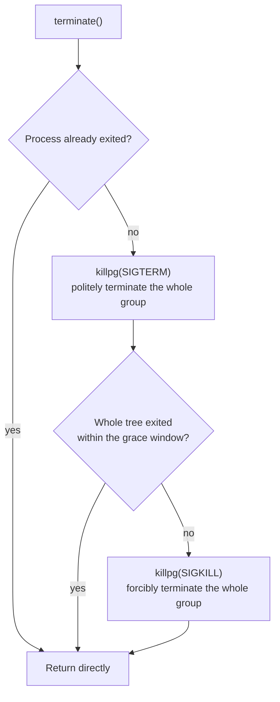
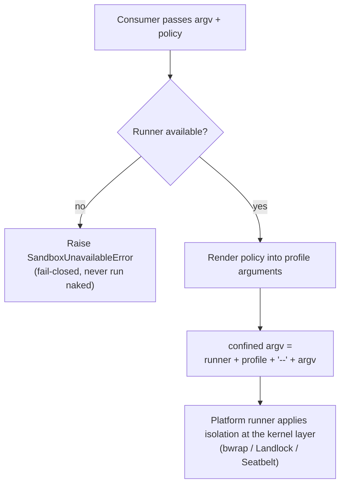

# Chapter 6: The Execution World of subprocess / shell / fs

> Life and death are on the ledger, overwrites leave traces, and there is a fence beyond the gate.

## Questions this chapter answers

- Why can't you hand the standard library's `subprocess` directly to the agent? What four things would be lost?
- What exactly does "process tree" mean? Why does terminate kill the entire tree rather than just the direct child?
- Why is the filesystem made into a seam instead of calling `os` / `open` directly?
- How does the sandbox manage to "wrap the runner without touching the tool layer"?

In the previous chapter we turned shell into a seam and got to know all three roles: `shell.py` is the definition, `bash_local.py` is the implementation, and `tool_bash.py` is the consumer. But if you open `bash_local.py`, you'll find it depends on a teaching stub `SubprocessStub`, whose docstring says it bluntly — "real process-tree management is deferred to Chapter 6". This chapter cashes in that promise.

shell is merely the "facade" of the execution world; what actually does the work is the trio:

- **`ctx.subprocess`**: the managed process tree. Spawning a process is not just calling `subprocess.run` once and being done — you also have to manage its entire tree, its exit semantics, its background registration, and its fallback reclamation.
- **`ctx.fs`**: the filesystem. Processes manage "motion", files manage "stillness" — versioned read / write / edit.
- **`ctx.sandbox`**: isolation. The first two let the agent act; the sandbox puts up a fence around it.

In terms of code relationships, this chapter **inherits** Chapter 5's `shell.py` / `bash_local.py` / `tool_bash.py` without changing a single line, and **adds** `subprocess_service.py` (replacing `SubprocessStub`), `fs_service.py`, `sandbox_service.py`, and `bash_sandbox.py` (the sandbox's consumer). Reuse approach: `main.py` reuses Chapter 5's `bash_local.py` / `tool_bash.py` and the existing modules from Chapters 1/2/4 via sys.path; the ch06 directory holds only the files newly added in this chapter. shell is touched on only briefly in this chapter — `bash-sandbox` appears only as the sandbox's consumer, demonstrating "whole-provider migration: swap the executor without touching the tool layer". The title is named after the three domains of the execution facet; the sandbox is a fence spanning the three domains, not a fourth domain.

## 1. If the agent uses the standard library directly, it steps on three pitfalls

Imagine the agent wants to do something very ordinary: run a command that spawns child processes, and edit a config file along the way. Without the execution-world trio, it can only reach for the standard library directly (`ch06/code/bad_example.py`):

```python
import subprocess

# Pitfall ① Processes are poorly managed: failure raises an exception, and the exit code is not treated as data
try:
    subprocess.run(["bash", "-c", "exit 3"], check=True, capture_output=True)
except subprocess.CalledProcessError as e:
    print(f"Pitfall ①: failure raises {type(e).__name__}, and the model cannot get a clean exit code")
# Moreover: when make spawns gcc/cc1, killing the direct child cannot kill the whole tree;
# background tasks are not registered, and unloading leaks them

# Pitfall ② Files are poorly managed: error formats are inconsistent, each its own exception
try:
    open("no_such_dir/config.json").read()
except OSError as e:
    print(f"Pitfall ②: {type(e).__name__}, not a unified [FS_NOT_FOUND] error code")

# Pitfall ③ No isolation: nobody guards against dangerous commands
print("Pitfall ③: without a sandbox, commands like rm -rf / have no fence")
```

Run output:

```text
Pitfall ①: failure raises CalledProcessError, and the model cannot get a clean exit code
Pitfall ②: FileNotFoundError, not a unified [FS_NOT_FOUND] error code
Pitfall ③: without a sandbox, commands like rm -rf / have no fence
```

Three pitfalls, corresponding exactly to what this chapter's trio is meant to solve:

| # | Problem | Mechanism in this chapter |
|---|---|---|
| ① | Processes poorly managed: no tree management, no background registration, failure raises exceptions, no incremental reads | `ctx.subprocess` managed process tree |
| ② | Files poorly managed: inconsistent error formats, no path safety, no version guard | `ctx.fs` filesystem seam |
| ③ | No isolation: both processes and files are touchable, dangerous operations have no fence | `ctx.sandbox` isolation |

Pitfall ① is the most fatal. The moment you call `subprocess.run`, four things are lost:

1. **Process-tree management** — `make` spawns `gcc`, `cc1`; killing only the direct child leaves the grandchildren running;
2. **Background registration** — background tasks have no roster; when the context unloads, processes leak;
3. **Unified exit semantics** — failure raises `CalledProcessError`, but what the model needs is "the exit code is data, never raise";
4. **Incremental reads** — large output can only be captured all at once; you can't read while it runs. Also, credential-like variables from the parent environment are passed through to the child as-is — they must be scrubbed before spawn.

Let's break them down one by one. Processes first.

## 2. ctx.subprocess: The Managed Process Tree

### 2.1 Concept introduction: minimal example

**What it is**: `ctx.subprocess` is the "managed process tree" seam. `spawn` returns a handle; `handle.done` blocks until **the entire tree** converges and returns a unified result (the exit code is data, never raises); `handle.terminate()` is the only termination verb — SIGTERM → grace window → SIGKILL, applied to **the entire process group**; when the context unloads, all managed processes are reclaimed as a fallback.

**What problem it solves**: the four things lost in problem ① — tree management, background registration, unified exit semantics, incremental reads.

**Analogy**: like a process shepherd. `subprocess.run` is "let one sheep out and wait for it to come back on its own"; `ctx.subprocess` is "build a roster for the whole flock, and at dusk (dispose) drive every single one back — and for any that ran off, tell you explicitly which one didn't come back".

**Minimal example** (minimal runnable example, same caliber as §3.1/§4.1): inline example, run under `ch06/code/`; import paths are assembled via the same sys.path scheme as main.py (reusing existing modules from Chapters 1/4/5):

```python
from cordis import Context
from subprocess_service import SubprocessService

ctx = Context()
SubprocessService(ctx)                    # construction registers it as ctx.subprocess
handle = ctx.subprocess.spawn(["echo", "hello"])
result = handle.done                      # block until the whole tree converges, return a unified result
print(result["exit_code"], repr(result["stdout"]))   # 0 'hello\n'
```

### 2.2 Internal implementation

At the macro level, one `spawn` to convergence goes through four things: **detached tree root → output collection → unified wait → three-stage termination**.

1. **Detached tree root**: on POSIX, `Popen(..., start_new_session=True)`; the child becomes its own process group, and the tree root's pid == the process group's pgid. This is the premise of "killing the whole tree" — with an independent process group, `killpg` can sweep them all up in one net.
2. **Output collection**: two reader threads push stdout/stderr into `OutputCollector`s for incremental reads via `read_output()` — reads do not clear the collector and can be repeated; tail takes the most recent N bytes, and offset (`read_delta`) takes the increment since the last read position.
3. **Unified wait**: `handle.done` blocks until the process exits (optionally with a timeout), collects the reader threads, and returns `{exit_code, stdout, stderr, timed_out, killed}` — the exit code is data, never raises.
4. **Three-stage termination**: `terminate()` first does `killpg(SIGTERM)`, waits one grace window, and if still alive does `killpg(SIGKILL)`; the grace value comes from the `main.py` assembly parameter `grace_ms=200` (the `_assemble` default).

Point 4 is the soul; the escalation chain is as follows:



Why "the whole group" rather than "the direct child"? Because **the leader exiting ≠ the tree exiting**: even if `make` exits, the `gcc`, `cc1` it spawned are still running; only `killpg` on the process group guarantees the whole tree converges. Why wait a grace window after SIGTERM? To give the processes a chance to clean up gracefully (flush to disk, release locks); only if they refuse to exit do we escalate to SIGKILL — this is exactly "courtesy first, force later".

Two accompanying things: **background registration** — every `spawn` issues a unique `spawn_id` recorded in the roster `_managed`, and `dispose` terminates them one by one, eliminating process leaks; **scrub_env** — before spawn, first strip credential-like variables from the parent environment (names containing KEY/TOKEN/SECRET/…) and `DSH_*`-prefixed variables, then merge the explicit env; sensitive values are never automatically passed through to the child.

### 2.3 Python reconstruction

The teaching version lands in `ch06/code/subprocess_service.py`: what is exposed to the consumer (`bash_local.py`) is still Chapter 5's four verbs `spawn/done/read_output/kill`, swappable without changing a single line; `terminate` is the internal termination verb newly added in this chapter — `kill()` marks killed and then delegates to `terminate()` for escalation (SIGTERM → grace → SIGKILL, whole group). The handle layer's `read_output()` internally delegates to the collector's `read_delta()` (offset-based incremental read). First look at environment scrubbing — the explicit env is merged only **after** scrubbing:

```python
def scrub_env(parent_env):
    """Strip credential-like variables and DSH_*-prefixed variables from the parent environment (index.ts:60 scrubbedParentEnv).

    The explicit env is merged after scrubbing — the parent environment contributes only basic variables like PATH;
    sensitive values are never automatically passed through to the child.
    """
    return {
        key: value
        for key, value in parent_env.items()
        if not _SENSITIVE_ENV_RE.search(key) and not key.startswith(DSH_ENV_PREFIX)
    }
```

`spawn`: detached tree root + output collection + background registration, all in one shot:

```python
    def spawn(self, argv, workdir=None, env=None, timeout_ms=None):
        """spawn is fully explicit, no defaults (index.ts:130): scrub the parent environment first, then merge the explicit env."""
        full_env = scrub_env(dict(os.environ))
        if env:
            full_env.update(env)
        proc = subprocess.Popen(
            argv,
            cwd=workdir,
            env=full_env,
            stdout=subprocess.PIPE,
            stderr=subprocess.PIPE,
            start_new_session=True,  # detached tree root: its own process group (spawn.ts:350-361)
        )
        stdout_c, stderr_c = OutputCollector(), OutputCollector()
        handle = SubprocessHandle(proc, stdout_c, stderr_c, self._grace_ms, timeout_ms)
        handle._threads = [
            threading.Thread(target=_pump, args=(proc.stdout, stdout_c), daemon=True),
            threading.Thread(target=_pump, args=(proc.stderr, stderr_c), daemon=True),
        ]
        for thread in handle._threads:
            thread.start()
        # Background registration: every managed process has a unique spawn_id, reclaimed together at dispose.
        handle.spawn_id = self._next_id
        self._managed[self._next_id] = handle
        self._next_id += 1
        return handle
```

`terminate`: the only termination verb, three-stage escalation, applied to the entire process group:

```python
    def terminate(self):
        """The only termination verb (spawn.ts:439): SIGTERM → grace window → SIGKILL.

        Applied to the entire process group (detached tree root), not just the direct child:
        the leader exiting ≠ the tree exiting; escalation must survive across the whole tree.
        """
        if self._proc.poll() is not None:
            return  # already exited
        try:
            pgid = os.getpgid(self._proc.pid)
        except (ProcessLookupError, PermissionError):
            return
        try:
            os.killpg(pgid, signal.SIGTERM)  # stage one: politely terminate the whole group
        except ProcessLookupError:
            return
        deadline = time.monotonic() + self._grace_ms / 1000  # grace window
        while time.monotonic() < deadline:
            if self._proc.poll() is not None:
                return
            time.sleep(0.01)
        try:
            os.killpg(pgid, signal.SIGKILL)  # stage two: forcibly terminate the whole group
        except ProcessLookupError:
            pass
```

Two closing things: `handle.done` (`_wait_for_exit`) blocks until exit, collects the reader threads, and folds the three paths exit/timeout/killed into a unified result dict `{exit_code, stdout, stderr, timed_out, killed}` — the exit code is data, never raises (implementation at `ch06/code/subprocess_service.py:126-150`); `SubprocessService.__init__` registers `_dispose_managed` via `ctx.effect`, and when the context unloads it terminates the managed processes in the roster `_managed` one by one, as a fallback against leaks.

[Teaching simplification] The real `OutputCollector` spills old output beyond maxBytes to an exclusive temporary file with 0600 (readable/writable only by the file owner); `waitForExit` uses `/proc` parsing + `kill(-pgid, 0)` to probe **whole-tree** liveness; the teaching version omits spill and approximates whole-tree state with the tree root's `poll()` inside the grace window — because SIGKILL acts on the whole group, convergence is still guaranteed.

### 2.4 Recap: processes are managed, files are not yet

All four things lost in problem ① are back: detached + `killpg` manages the tree, `_managed` + dispose manages registration, `done` manages unified exit semantics, and `read_output` manages incremental reads. But the agent doesn't just run commands — it also edits files — and using `open` directly is problem ②.

## 3. ctx.fs: The Other Half of the Execution World — the Filesystem

### 3.1 Concept introduction: minimal example

**What it is**: `ctx.fs` is the filesystem seam — a read/write interface with version tokens. `read` returns the content plus one opaque version token; `write`/`edit` on an existing file must carry `base_version`; all failures are unified into `FsError(code, path, message)`.

**What problem it solves**: problem ②. Concurrent file edits by the agent, blind overwrites, path escapes — under bare `open` all of these are silent accidents; `ctx.fs` turns "read before write" into a protocol and turns accidents into rejections with error codes.

**Analogy**: an archive-room clerk. Direct `open` is barging into the storage room and rummaging through files yourself; `ctx.fs` is a registration system — when you take a file you get a receipt (version token), and when you return it after editing you show the receipt: never taken out, no editing allowed; receipt expired, no editing allowed either.

**Minimal runnable example** (`ch06/code/fs_service.py`):

```python
from cordis import Context
from fs_service import FileSystem

ctx = Context()
FileSystem(ctx, root="/tmp/ch06-demo")  # construction registers it as ctx.fs
w = ctx.fs.write("a.txt", "v1")         # new file: write directly, no version needed
r = ctx.fs.read("a.txt")                # read returns content + version
ctx.fs.write("a.txt", "v2", base_version=r["version"])  # versioned write
```

### 3.2 Internal implementation

Four mechanisms, from outside in:

1. **Unified error format**: all failures raise `FsError` with stable error codes (`FS_NOT_FOUND`, `FS_IS_DIR`, `FS_PATH_ESCAPE`, `FS_NOT_OBSERVED`, `FS_STALE_VERSION`, `FS_EDIT_NO_MATCH`, `FS_NOT_DIR`). Consumers catch only one exception type and branch on the code, without parsing free text (the `read()`/`list()` implementations are omitted; see `fs_service.py`: FS_NOT_FOUND=read on a nonexistent file, FS_NOT_DIR=list on a non-directory).
2. **Path safety**: `_resolve` first normalizes with `realpath` (resolving symlinks and `..`), then verifies the result falls inside the workspace root — escape is rejected directly, no partial success.
3. **Atomic write**: first write a staging file in the same directory, then `rename` into place. rename is atomic; readers always see either the old full text or the new full text, never a half-written file.
4. **Version guard**: `_version_of` takes the first 16 chars of the content's sha256 as the opaque token. When writing an existing file: no `base_version` → `FS_NOT_OBSERVED` (trying to edit without reading); present but doesn't match the current version → `FS_STALE_VERSION` (you read an old version; someone edited in between).

[Teaching simplification] The real version's token is produced by `versionOf` (`fsio.ts:74`); the write path also has `withLock` serialization (`fs-local/src/index.ts:91`) and `glob`/`grep` search; the teaching version uses the sha256 prefix to illustrate token semantics and omits locking and search.

### 3.3 Python reconstruction

The teaching version lands in `ch06/code/fs_service.py`. First look at the unified error format:

```python
class FsError(Exception):
    """Unified error format: one error code + path + human-readable message (types.ts:175 FsErrorCode).

    Consumers only need to catch FsError and read .code; no need to distinguish a pile of
    standard-library exceptions like FileNotFoundError / PermissionError / IsADirectoryError.
    """

    def __init__(self, code, path, message):
        super().__init__(f"[{code}] {path}: {message}")
        self.code = code
        self.path = path
```

Path safety `_resolve` and atomic write + version guard `write`:

```python
    # -- Path safety: realpath identity + workspace containment (fsio.ts:146 resolveLocalTarget + containment.ts:58 isPathUnder) --

    def _resolve(self, path):
        """Anchor a relative path to the workspace root and reject escape (canonicalize-then-contain)."""
        resolved = os.path.realpath(os.path.join(self._root, path))
        if resolved != self._root and not resolved.startswith(self._root + os.sep):
            raise FsError("FS_PATH_ESCAPE", path, "path escapes the workspace boundary")
        return resolved
```

```python
    def write(self, path, content, base_version=None):
        target = self._resolve(path)
        if os.path.isdir(target):
            raise FsError("FS_IS_DIR", path, "target is a directory")
        if os.path.exists(target):
            # Existing files must be read-observed before writing, eliminating blind overwrites.
            if base_version is None:
                raise FsError("FS_NOT_OBSERVED", path, "must read-observe before writing")
            if self._version_of(target) != base_version:
                raise FsError("FS_STALE_VERSION", path, "version has changed, write rejected")
        # Atomic write: write to a temporary staging first, then rename into place, avoiding half-written files.
        staging = f"{target}.staging-{os.urandom(4).hex()}"
        try:
            with open(staging, "w", encoding="utf-8") as f:
                f.write(content)
            os.rename(staging, target)
        finally:
            if os.path.exists(staging):
                os.remove(staging)
        return {"version": self._version_of(target)}
```

`edit(path, old, new, base_version)` is a "read-modify-write" wrapper: first `read` to get the current content and version; if the carried `base_version` doesn't match the observed version, raise `FS_STALE_VERSION`; if `old` doesn't hit, raise `FS_EDIT_NO_MATCH`; if it hits, replace the first occurrence and write back with the version just read — the version guard takes effect naturally.

### 3.4 Recap: files are managed, but there is no fence

Problem ② solved: blind writes become `FS_NOT_OBSERVED`/`FS_STALE_VERSION` rejections, escapes become `FS_PATH_ESCAPE` rejections, and half-written files are eliminated by atomic writes. But having processes and files both under control doesn't mean safe — the agent can still run **arbitrary commands**; that's problem ③.

## 4. ctx.sandbox: Isolation

### 4.1 Concept introduction: minimal example

**What it is**: `ctx.sandbox` is the isolation seam; its core duty is `confine(argv, policy)` — wrapping the raw argv into "runner + profile + `--` + argv"; the accompanying approval facet `approve_escalation` manages the "widening ladder" of policy escalation. The actual isolation is applied by the platform runner at the kernel layer (Linux bwrap/Landlock, macOS Seatbelt); the provider itself executes no isolation logic.

**What problem it solves**: problem ③. The isolation policy travels with each call, fail-closed, escalation only widens — all three disciplines are baked into the seam contract; the consumer has no entry point to run naked even if it wanted to.

**Analogy**: an airport security checkpoint. The sandbox doesn't pat people down itself; it only escorts people to the checkpoint (runner) and hands over the boarding pass (profile); the checkpoint is where the actual pat-down happens. No checkpoint? Nobody gets in — better to refuse than to let through.

**Minimal runnable example** (`ch06/code/sandbox_service.py`; `landlock-run` is an illustrative runner name — the teaching version's real `runner_argv` is `[python3, mock_runner.py]`, see §4.3):

```python
from cordis import Context
from sandbox_service import SandboxProvider, SandboxPolicy, SandboxMode

ctx = Context()
SandboxProvider(ctx, runner_argv=["landlock-run"])  # construction registers it as ctx.sandbox
policy = SandboxPolicy(mode=SandboxMode.WORKSPACE_WRITE, workspace_root="/tmp/ws")
confined = ctx.sandbox.confine(["bash", "-c", "echo hi"], policy)
print(confined.argv)
# ['landlock-run', '--mode', 'workspace-write', '--workspace', '/tmp/ws', '--', 'bash', '-c', 'echo hi']
```

### 4.2 Internal implementation



Four key points:

1. **Wrapping structure**: `--` is the separator; after it is the argv executed as-is. The runner first parses the profile before `--`, then execs the command after it — isolation takes effect before business.
2. **Three modes + travel with the call**: `read-only` / `workspace-write` / `danger-full-access`. `SandboxPolicy` is given in full by the caller every time; the provider does not merge with defaults and does not take effect on its own — the policy is a parameter, not state.
3. **fail-closed**: when the runner is unavailable, raise `SandboxUnavailableError`; never fall back to unisolated execution.
4. **Escalation strictly widens**: `approve_escalation` only allows one-way widening along read-only → workspace-write → danger-full-access; narrowing or same-level is rejected; widening may skip levels (read-only can go directly to danger-full-access, as `_WIDER_MODES` faithfully lists).

Runner-side behavior (behavior cited, C implementation not expanded): `landlock-run` first restricts itself, then execs the target command; exit code 125 means the launcher itself failed; `--probe` returns a three-state capability report of full/partial/unusable.

### 4.3 Python reconstruction

The teaching version lands in `ch06/code/sandbox_service.py`. Three modes and the widening order:

```python
class SandboxMode(Enum):
    """Three modes (index.ts:29): read-only / workspace-write / full access."""

    READ_ONLY = "read-only"
    WORKSPACE_WRITE = "workspace-write"
    DANGER_FULL_ACCESS = "danger-full-access"


# Strict widening order (escalation.ts:28 WIDER_MODES): can only go wider.
_WIDER_MODES = {
    SandboxMode.READ_ONLY: {SandboxMode.WORKSPACE_WRITE, SandboxMode.DANGER_FULL_ACCESS},
    SandboxMode.WORKSPACE_WRITE: {SandboxMode.DANGER_FULL_ACCESS},
    SandboxMode.DANGER_FULL_ACCESS: set(),
}
```

The core verb `confine` and escalation approval (`available` is just runner_argv being non-empty; the real version relies on the `--probe` three-state probe, see §4.2):

```python
    def confine(self, argv, policy):
        """Wrap argv into "runner + profile + -- + argv" (index.ts:175).

        fail-closed: with no available runner, raise SandboxUnavailableError directly
        instead of degrading to a naked run.
        """
        if not self.available:
            raise SandboxUnavailableError(
                "SANDBOX_UNAVAILABLE: no available runner, execution refused (fail-closed)"
            )
        profile = self._render_profile(policy)
        return ConfinedArgv([*self._runner_argv, *profile, "--", *argv], policy)
```

```python
    def approve_escalation(self, key, current, requested):
        """Escalation strictly widens (escalation.ts:157): only approve requests to a wider mode."""
        if requested not in _WIDER_MODES[current]:
            raise ValueError(
                f"escalation refused: {current.value} → {requested.value} is not a strict widening"
            )
        self._approved[key] = requested
        return requested
```

[Teaching simplification] The real `LocalSandboxProvider` picks the bwrap/Landlock/Seatbelt runner by platform chain (`PLATFORM_CHAINS`, `sandbox-local/src/index.ts:159`); the policy is obtained from the `sandboxPolicy` service via `inject`; the teaching version simulates the runner with `mock_runner.py` (after parsing the profile, `os.execvp` the remaining argv; launcher failure exits 125), and the policy is fixed by a constructor parameter. `ConfinedArgv` has only two fields: `argv` (the wrapped argv) + `policy` (this call's policy).

### 4.4 Recap: the fence is up, who uses it

Problem ③ solved: wrapping structure, travel-with-call, fail-closed, strict widening — all four disciplines are inside the seam. The fence is standing — the first consumer is Chapter 5's bash executor.

## 5. shell connection: bash-sandbox whole-provider migration (touched on briefly)

The consumer of `ctx.sandbox` is `bash-sandbox`: it **inherits** Chapter 5's `LocalBashExecutor`, and its `inject` declares dependencies on `subprocess` and `sandbox` (the source version also injects `sandboxPolicy`); it overrides only the two entries `run_argv`/`start_argv`, first wrapping the argv through `ctx.sandbox.confine` before handing it to the parent class's spawn. The tool layer (`tool_bash`) and the seam definition (`shell.py`) are unchanged by a single line — this is "whole-provider migration": swap the executor without touching the tool layer.

```python
class SandboxBashExecutor(LocalBashExecutor):
    """bash-sandbox implementation (index.ts:44): consumer of the sandbox seam.

    inject=['subprocess','sandbox'] is injected by cordis in TS; the teaching version injects explicitly via the constructor.
    [Teaching simplification] The real version also injects sandboxPolicy (per-call policy); the teaching version uses a fixed workspace-write policy.
    """

    inject = ["subprocess", "sandbox"]

    def __init__(self, ctx, subprocess, sandbox, config=None):
        super().__init__(ctx, subprocess, config)  # reuse all of the parent class's mechanisms
        self._sandbox = sandbox
        self._policy = SandboxPolicy(
            mode=SandboxMode.WORKSPACE_WRITE,
            workspace_root=os.getcwd(),
        )

    def _confine(self, argv):
        """Wrap argv via ctx.sandbox.confine into "runner + profile + -- + argv".

        fail-closed: without ctx.sandbox, raise SandboxUnavailableError directly (sandbox/src/index.ts:124/:131);
        never degrade to a naked run.
        """
        if self._sandbox is None:
            raise SandboxUnavailableError("bash-sandbox requires ctx.sandbox (fail-closed)")
        return self._sandbox.confine(argv, self._policy).argv

    # -- Only override the argv assembly before spawn; all other mechanisms reuse the parent class --

    def run_argv(self, spec, argv):
        return super().run_argv(spec, self._confine(argv))

    def start_argv(self, spec, argv):
        return super().start_argv(spec, self._confine(argv))
```

## 6. Full Run Output

Run command: `python3 ch06/code/main.py` (pgid, pid, elapsed time, version token, and temp paths differ each run):

```text
== 1. ctx.subprocess: foreground execution (via the bash tool) ==
  ctx.subprocess = SubprocessService (replaces Chapter 5's SubprocessStub)
  hello-from-real-subprocess

  [exit code: 0]

== 2. ctx.subprocess: process-tree termination (kill the whole tree) ==
  spawn a tree root that ignores SIGTERM (with a background child), pgid=42788
  process group alive before terminate: True
  process group alive after terminate: False
  exit_code=-9, elapsed 212ms ≈ grace 200ms (SIGTERM ignored → SIGKILL the whole group)

== 3. ctx.subprocess: dispose fallback reclamation ==
  spawn a sleeping process (without waiting for done), process group alive before dispose: True
  process group alive after dispose: False (disposeManagedProcesses fallback)

== 4. ctx.subprocess: scrub_env strips credential-like variables ==
  parent env MY_API_TOKEN=secret-123
  token=<scrubbed>

  [exit code: 0]

== 5. ctx.fs: write + read + version guard ==
  write hello.txt → version=60329bc85480d3c6
  read hello.txt → content='v1 content' version=60329bc85480d3c6
  blind overwrite (without reading first) rejected: FS_NOT_OBSERVED
  stale-version write rejected: FS_STALE_VERSION
  edit v1→v2 (with correct version) → content='v2 content'

== 6. ctx.sandbox: confine wraps the argv ==
  original argv: ['bash', '-c', 'echo hi']
  confined.argv = runner + profile + '--' + argv:
    ['/Users/chenyu/anaconda3/bin/python3', '…/ch06/code/mock_runner.py', '--mode', 'workspace-write', '--workspace', '/var/folders/…/T/ch06-fs-txy34wgx', '--', 'bash', '-c', 'echo hi']
  fail-closed without a runner: SandboxUnavailableError

== 7. bash-sandbox: whole-provider migration (swap the executor without touching the tool layer) ==
  ctx7.shell = SandboxBashExecutor
  hello-from-sandbox

  [exit code: 0]
  The same consumer tool_bash and definition ShellExecutor are both unchanged by a single line.
```

The output bodies of segments 1 and 7 are exactly the same shape as Chapter 5's — this is exactly the evidence of whole-provider migration: the consumer cannot tell the executor was swapped. `run_bash` is the demo helper function at `main.py:63` (triggering Chapter 5's bash tool body through Chapter 4's tools pipeline); the trailing `[exit code: 0]` marker in the output is appended by `render_result` inside the tool body. Each segment assembles a fresh context independently; segment 7's ctx7 is additionally assembled with SandboxBashExecutor + mock runner. Segment 2's elapsed ≈ grace 200ms corroborates the escalation to SIGKILL after SIGTERM was ignored; segment 3's "without waiting for done" means not calling `handle.done` after spawn (distinct from Chapter 5's `start` background semantics); in segment 6's confined argv, before `--` is runner + profile and after is the argv as-is (machine paths elided with `…`).

## 7. Source Mapping

| Teaching symbol | Source symbol | Location |
| --- | --- | --- |
| `SubprocessService` (including `_dispose_managed`) | `LocalSubprocessRuntime`/`disposeManagedProcesses` | `subprocess-local/src/index.ts:37`/`:79` |
| `spawn` | `spawnSubprocess` (local implementation layer) | Service-level abstraction `subprocess/src/index.ts:130`; local implementation `subprocess-local/src/spawn.ts:326` |
| `SubprocessHandle` | `SubprocessHandle` | `subprocess/src/types.ts:167` (terminate:186 / waitForExit:193) |
| `read_output` (incremental read) | `OutputCollector` push/spill | `subprocess-local/src/spawn.ts:104/:131/:156` (teaching version's `read_output()` delegates to `read_delta()`) |
| detached tree root | `detached: platform !== 'win32'` | `subprocess-local/src/spawn.ts:350-361` |
| `terminate` | `terminate` | `subprocess-local/src/spawn.ts:439` |
| `done` | `waitForExit` | `subprocess-local/src/spawn.ts:507` |
| `OutputCollector` | `OutputCollector` | `subprocess-local/src/spawn.ts:104` |
| `scrub_env`/`_SENSITIVE_ENV_RE`/`DSH_ENV_PREFIX` | `scrubbedParentEnv`/`SENSITIVE_ENV_PATTERN`/`DSH_ENV_PREFIX` | `subprocess/src/index.ts:60`/`:44`, `types.ts:13` |
| `FileSystem` | `abstract FileSystem` | `fs/src/index.ts:86` |
| `_resolve` | `resolveLocalTarget`/`isPathUnder` | `fs-local/src/fsio.ts:146`, `fs-sandbox/src/containment.ts:58` |
| `write`/`edit` | `writeText`/`editText` | `fs/src/index.ts:222`/`:243` |
| `FsError` | `FsErrorCode` | `fs/src/types.ts:175` |
| Atomic write / version token | `writeFileAtomic`/`versionOf` | `fs-local/src/fsio.ts:533`/`:74` |
| Version guard | `FS_STALE_VERSION`/`FS_NOT_OBSERVED` | `fs-local/src/index.ts:178-187` |
| `SandboxMode`/`SandboxPolicy`/`ConfinedArgv` | Same name | `sandbox/src/index.ts:29`/`:69`/`:95` |
| `confine` | `SandboxProvider.confine` | `sandbox/src/index.ts:158`/`:175` |
| `SandboxUnavailableError` | `SANDBOX_UNAVAILABLE`/`SandboxUnavailableError` | `sandbox/src/index.ts:124`/`:131` |
| `_WIDER_MODES`/`approve_escalation` | `WIDER_MODES`/`approveEscalation` | `sandbox/src/escalation.ts:28`/`:157` |
| `mock_runner` | `PLATFORM_CHAINS`/`LocalSandboxProvider.confine` | `sandbox-local/src/index.ts:159`/`:316` |
| `SandboxBashExecutor`/`_confine` | `SandboxBashExecutor`/`confine` | `shell/bash-sandbox/src/index.ts:44`/`:177` |

Summary of teaching-version differences: omits `OutputCollector`'s disk spill and whole-tree treeAlive probing (approximated by the tree root's `poll`), omits `withLock` serialization and `glob`/`grep`; the platform runner chain is replaced by `mock_runner`; the `sandboxPolicy` inject is simplified to a policy fixed by constructor parameter.

## 8. Summary and Preview

This chapter completes the execution facet with the trio: `ctx.subprocess` manages processes (detached tree root, only termination verb, background registration, environment scrubbing), `ctx.fs` manages files (version guard, atomic write, path safety, unified error codes), and `ctx.sandbox` manages boundaries (confine wrapping, travel-with-call, fail-closed, strict widening); `bash-sandbox` demonstrates whole-provider migration — swap the executor without touching the tool layer. The next chapter enters the model layer: replacing Chapter 2's `LlmStub` with a real LLM adapter, covering replacement of the `ctx.llm` seam and streaming output.

## 9. Appendix: Key Concepts Cheat Sheet

| Layer | Concept | Python symbol | Source symbol | One-line semantics |
| --- | --- | --- | --- | --- |
| Base (reused) | Service registration/unload hook | `Service`/`ctx.effect` | `Service`/`ctx.effect` | Construction is registration, unload is cleanup |
| Middle | Managed subprocess seam | `SubprocessService` | `LocalSubprocessRuntime` | spawn fully explicit, dispose fallback reclamation |
| Middle | Process handle | `SubprocessHandle` | `SubprocessHandle` | Tree-root handle: done/read_output/kill (internally delegates to terminate) |
| Middle | Environment scrubbing | `scrub_env` | `scrubbedParentEnv` | Credential-likes and DSH_* not passed through; explicit env merged later |
| Middle | Filesystem seam | `FileSystem` | `abstract FileSystem` | Version-tokened read/write, unified FsError |
| Middle | Version guard | `FS_NOT_OBSERVED`/`FS_STALE_VERSION` | Same-name error codes | Read before write; stale writes rejected |
| Middle | Isolation seam | `SandboxProvider.confine` | `SandboxProvider.confine` | Wrap into runner + profile + `--` + argv |
| Middle | Sandbox policy | `SandboxPolicy`/`SandboxMode` | Same name | Policy travels with the call, not merged with defaults |
| Upper | Sandbox bash executor | `SandboxBashExecutor` | `SandboxBashExecutor` | Whole-provider migration: confine then spawn |
