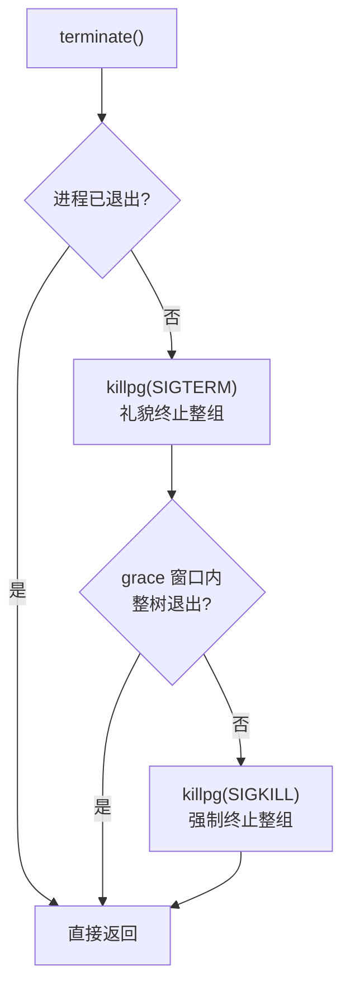
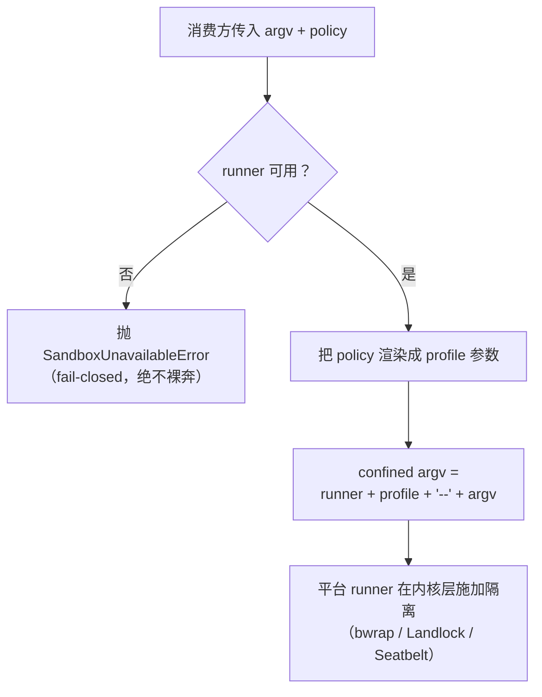

# 第 6 章 subprocess / shell / fs 执行世界

> 生死有簿，覆写留痕，门外有篱。

## 本章回答的问题

- 为什么不能直接拿标准库 `subprocess` 给 agent 用？会丢掉哪四样东西？
- 「进程树」到底指什么？为什么 terminate 要杀整棵树，而不是只杀直接子进程？
- 文件系统为什么要做成 seam，而不是直接调 `os` / `open`？
- sandbox 如何做到「包住 runner、却不碰工具层」？

上一章我们把 shell 做成了 seam，认全了三角色：`shell.py` 是定义、`bash_local.py` 是实现、`tool_bash.py` 是消费者。
但翻开 `bash_local.py` 会发现，它依赖一个教学桩 `SubprocessStub`，其 docstring 写得很直白——「真正进程树管理留到第 6 章」。这一章就来兑现这句话。

shell 只是执行世界的「门面」，真正动手干活的是三件套：

- **`ctx.subprocess`**：受管进程树。spawn 一个进程不是调一次 `subprocess.run` 就完事，
  还要管它的整棵树、它的退出语义、它的后台登记与兜底回收。
- **`ctx.fs`**：文件系统。进程管「动」，文件管「静」——带版本的读 / 写 / 编辑。
- **`ctx.sandbox`**：隔离。前两者让 agent 能动手，sandbox 给它圈一道围栏。

代码关系上，本章**继承**第 5 章的 `shell.py` / `bash_local.py` / `tool_bash.py` 一行不改，
**新增** `subprocess_service.py`（替换 `SubprocessStub`）、`fs_service.py`、`sandbox_service.py`、
`bash_sandbox.py`（sandbox 的消费方）。复用方式：`main.py` 经 sys.path 复用第 5 章 `bash_local.py` / `tool_bash.py`
与第 1/2/4 章既有模块，ch06 目录只放本章新增文件。shell 本章点到即止——`bash-sandbox` 只作为 sandbox 消费方出场，演示「整 provider 迁移：换执行器不动工具层」。
标题以执行面三领域取名；sandbox 是横跨三领域的围栏而非第四领域。

## 1. agent 直接上手标准库，会踩三个坑

设想 agent 要干一件很普通的事：跑一条会派生子进程的命令，顺手改一个配置文件。
没有执行世界三件套，它只能直接上手标准库（`ch06/code/bad_example.py`）：

```python
import subprocess

# 坑 ① 进程管不好：失败即异常，退出码没被当成数据
try:
    subprocess.run(["bash", "-c", "exit 3"], check=True, capture_output=True)
except subprocess.CalledProcessError as e:
    print(f"坑①: 失败抛 {type(e).__name__}，模型拿不到干净的退出码")
# 而且：make 派生 gcc/cc1 时，kill 直接子进程杀不掉整棵树；后台任务无登记，卸载即泄漏

# 坑 ② 文件管不好：错误格式不统一，各是各的异常
try:
    open("no_such_dir/config.json").read()
except OSError as e:
    print(f"坑②: {type(e).__name__}，而不是统一的 [FS_NOT_FOUND] 错误码")

# 坑 ③ 没有隔离：危险命令无人设防
print("坑③: 没有 sandbox，rm -rf / 这类命令没有围栏")
```

运行输出：

```text
坑①: 失败抛 CalledProcessError，模型拿不到干净的退出码
坑②: FileNotFoundError，而不是统一的 [FS_NOT_FOUND] 错误码
坑③: 没有 sandbox，rm -rf / 这类命令没有围栏
```

三个坑，正好对应本章三件套要解决的事：

| # | 问题 | 本章机制 |
|---|---|---|
| ① | 进程管不好：无树管理、无后台登记、失败即异常、无增量读 | `ctx.subprocess` 受管进程树 |
| ② | 文件管不好：错误格式不统一、无路径安全、无版本守卫 | `ctx.fs` 文件系统 seam |
| ③ | 没有隔离：进程 + 文件都能碰，危险操作无围栏 | `ctx.sandbox` 隔离 |

其中坑 ① 最要命。`subprocess.run` 一调，四样东西就丢了：

1. **进程树管理**——`make` 会派生 `gcc`、`cc1`，只 `kill` 直接子进程，孙进程还在跑；
2. **后台登记**——后台任务没有名册，context 卸载时进程泄漏；
3. **统一退出语义**——失败时抛 `CalledProcessError`，而模型需要的是「退出码是数据，永不抛异常」；
4. **增量读**——大输出只能一次性 capture，不能边跑边读。另外，父环境凭据变量会被原样透传给子进程——spawn 前必须清洗。

下面逐个拆。先看进程。

## 2. ctx.subprocess：受管进程树

### 2.1 概念引入：最小示例

**它是什么**：`ctx.subprocess` 是「受管进程树」seam。`spawn` 返回一个句柄；
`handle.done` 阻塞等**整棵树**收敛并返回统一结果（退出码是数据，永不抛异常）；
`handle.terminate()` 是唯一终止动词——SIGTERM → grace 窗口 → SIGKILL，作用于**整个进程组**；
context 卸载时兜底回收所有受管进程。

**解决什么问题**：问题 ① 丢掉的四样东西——树管理、后台登记、统一退出语义、增量读。

**类比**：像个进程牧羊人。`subprocess.run` 是「放一只羊出去，等它自己回来」；
`ctx.subprocess` 是「给整群羊建了名册，天黑（dispose）时一只不少地赶回来，
跑丢的也明确告诉你哪只没回来」。

**最简示例**（最小可运行示例，与 §3.1/§4.1 同口径）：内联示例，在 `ch06/code/` 下运行；import 路径由 main.py 同款 sys.path 拼装（复用第 1/4/5 章既有模块）：

```python
from cordis import Context
from subprocess_service import SubprocessService

ctx = Context()
SubprocessService(ctx)                    # 构造即注册到 ctx.subprocess
handle = ctx.subprocess.spawn(["echo", "hello"])
result = handle.done                      # 阻塞等整树收敛，返回统一结果
print(result["exit_code"], repr(result["stdout"]))   # 0 'hello\n'
```

### 2.2 内部实现

宏观上，一次 `spawn` 到收敛要经过四件事：**detached 树根 → 输出收集 → 统一等待 → 三段终止**。

1. **detached 树根**：POSIX 下 `Popen(..., start_new_session=True)`，子进程自成进程组，
   树根 pid == 进程组 pgid。这是「杀整棵树」的前提——有了独立进程组，`killpg` 才能一网打尽。
2. **输出收集**：两条读线程把 stdout/stderr 推入 `OutputCollector`，供 `read_output()` 增量读——
   读取不清空 collector、可反复读；tail 取最近 N 字节，offset（`read_delta`）从上次读位置取新增。
3. **统一等待**：`handle.done` 阻塞等进程退出（可带 timeout），收编读线程，返回
   `{exit_code, stdout, stderr, timed_out, killed}`——退出码是数据，永不抛异常。
4. **三段终止**：`terminate()` 先 `killpg(SIGTERM)`，等一个 grace 窗口，仍存活则 `killpg(SIGKILL)`；grace 取值来自 `main.py` 装配参数 `grace_ms=200`（`_assemble` 默认值）。

其中第 4 点是灵魂，升级链路如下：



为什么是「整组」而不是「直接子进程」？因为**领导者退出 ≠ 树退出**：`make` 退了，它派生的 `gcc`、`cc1` 还在跑，
只有对进程组 `killpg`，才能保证整棵树收敛。为什么 SIGTERM 之后还要等一个 grace 窗口？给进程体面清理的机会（落盘、释放锁），
只有拒不退出才升级到 SIGKILL——这正是「先礼后兵」。

配套两件事：**后台登记**——每次 `spawn` 发一个唯一 `spawn_id` 记入名册 `_managed`，`dispose` 时逐个 `terminate`，杜绝进程泄漏；
**scrub_env**——spawn 前先剔除父环境里的凭据形变量（名字含 KEY/TOKEN/SECRET/…）与 `DSH_*` 前缀变量，
再合并显式 env，敏感值绝不自动透传给子进程。

### 2.3 Python 重构

教学版落在 `ch06/code/subprocess_service.py`：对消费者（`bash_local.py`）暴露的仍是第 5 章
四动词 `spawn/done/read_output/kill`，一行不改即可换用；`terminate` 是本章新增的内部终止动词，`kill()` 标记 killed 后委托 `terminate()` 走升级（SIGTERM → grace → SIGKILL，整组）。
句柄层 `read_output()` 内部委托 collector 的 `read_delta()`（offset 增量读）。先看环境清洗——显式 env 在 scrub **之后**才合并：

```python
def scrub_env(parent_env):
    """剔除父环境里的凭据形变量与 DSH_* 前缀变量（index.ts:60 scrubbedParentEnv）。

    显式 env 在 scrub 之后合并——父环境只贡献 PATH 这类基础变量，
    敏感值一律不自动透传给子进程。
    """
    return {
        key: value
        for key, value in parent_env.items()
        if not _SENSITIVE_ENV_RE.search(key) and not key.startswith(DSH_ENV_PREFIX)
    }
```

`spawn`：detached 树根 + 输出收集 + 后台登记，一次到位：

```python
    def spawn(self, argv, workdir=None, env=None, timeout_ms=None):
        """spawn 全显式、无默认（index.ts:130）：先 scrub 父环境再合并显式 env。"""
        full_env = scrub_env(dict(os.environ))
        if env:
            full_env.update(env)
        proc = subprocess.Popen(
            argv,
            cwd=workdir,
            env=full_env,
            stdout=subprocess.PIPE,
            stderr=subprocess.PIPE,
            start_new_session=True,  # detached 树根：自成进程组（spawn.ts:350-361）
        )
        stdout_c, stderr_c = OutputCollector(), OutputCollector()
        handle = SubprocessHandle(proc, stdout_c, stderr_c, self._grace_ms, timeout_ms)
        handle._threads = [
            threading.Thread(target=_pump, args=(proc.stdout, stdout_c), daemon=True),
            threading.Thread(target=_pump, args=(proc.stderr, stderr_c), daemon=True),
        ]
        for thread in handle._threads:
            thread.start()
        # 后台登记：每个受管进程都有唯一 spawn_id，dispose 时统一回收。
        handle.spawn_id = self._next_id
        self._managed[self._next_id] = handle
        self._next_id += 1
        return handle
```

`terminate`：唯一终止动词，三段升级，作用于整个进程组：

```python
    def terminate(self):
        """唯一终止动词（spawn.ts:439）：SIGTERM → grace 窗口 → SIGKILL。

        作用于整个进程组（detached 树根），而非只杀直接子进程：
        领导者退出 ≠ 树退出，升级必须跨整树存活。
        """
        if self._proc.poll() is not None:
            return  # 已退出
        try:
            pgid = os.getpgid(self._proc.pid)
        except (ProcessLookupError, PermissionError):
            return
        try:
            os.killpg(pgid, signal.SIGTERM)  # 第一段：礼貌终止整组
        except ProcessLookupError:
            return
        deadline = time.monotonic() + self._grace_ms / 1000  # grace 窗口
        while time.monotonic() < deadline:
            if self._proc.poll() is not None:
                return
            time.sleep(0.01)
        try:
            os.killpg(pgid, signal.SIGKILL)  # 第二段：强制终止整组
        except ProcessLookupError:
            pass
```

收尾两件事：`handle.done`（`_wait_for_exit`）阻塞等退出、收编读线程，把 exit/timeout/killed 三路径折叠成统一结果字典 `{exit_code, stdout, stderr, timed_out, killed}`——退出码是数据，永不抛异常（实现见 `ch06/code/subprocess_service.py:126-150`）；
`SubprocessService.__init__` 里用 `ctx.effect` 注册 `_dispose_managed`，context 卸载时逐个 `terminate` 名册 `_managed` 里的受管进程，兜底防泄漏。

[教学简化] 真实版 `OutputCollector` 超出 maxBytes 的旧输出 spill 到 0600（仅文件属主可读写）独占临时文件，
`waitForExit` 用 `/proc` 解析 + `kill(-pgid, 0)` 探测**整树**存活；教学版省略 spill，
grace 窗口内以树根 `poll()` 近似整树状态——因为 SIGKILL 作用于整组，收敛性仍有保证。

### 2.4 回溯：进程管好了，文件还没管

问题 ① 丢掉的四样东西都补回来了：detached + `killpg` 管树，`_managed` + dispose 管登记，`done` 管统一退出语义，`read_output` 管增量读。
但 agent 不只会跑命令，还要改文件——直接上手 `open` 就是问题 ②。

## 3. ctx.fs：执行世界的另一半——文件系统

### 3.1 概念引入：最小示例

**是什么**：`ctx.fs` 是文件系统 seam——一个带版本令牌的读写接口。`read` 返回内容加一枚
不透明版本 token；`write`/`edit` 对已存在文件必须携带 `base_version`；所有失败统一为
`FsError(code, path, message)`。

**解决什么问题**：问题 ②。agent 并发改文件、盲写覆盖、路径逃逸，在裸 `open` 下全是静默事故；
`ctx.fs` 把「先读后写」变成协议，把事故变成带错误码的拒绝。

**类比**：档案室管理员。直接 `open` 是自己闯进库房翻文件；`ctx.fs` 是登记制——取文件时拿到
一张回执（版本 token），改完交回时出示回执：没领过文件不给改，回执过期也不给改。

**最小可运行示例**（`ch06/code/fs_service.py`）：

```python
from cordis import Context
from fs_service import FileSystem

ctx = Context()
FileSystem(ctx, root="/tmp/ch06-demo")  # 构造即注册为 ctx.fs
w = ctx.fs.write("a.txt", "v1")         # 新文件：无需版本直接写
r = ctx.fs.read("a.txt")                # 读返回 content + version
ctx.fs.write("a.txt", "v2", base_version=r["version"])  # 带版本写
```

### 3.2 内部实现

四个机制，从外到内：

1. **统一错误格式**：所有失败抛 `FsError`，带稳定错误码（`FS_NOT_FOUND`、`FS_IS_DIR`、
   `FS_PATH_ESCAPE`、`FS_NOT_OBSERVED`、`FS_STALE_VERSION`、`FS_EDIT_NO_MATCH`、
   `FS_NOT_DIR`）。消费方只 catch 一种异常，按码分支，不用解析自由文本（`read()`/`list()` 实现从略，见 `fs_service.py`：FS_NOT_FOUND=read 不存在文件、FS_NOT_DIR=list 非目录）。
2. **路径安全**：`_resolve` 先 `realpath` 归一化（消掉符号链接与 `..`），再校验结果必须
   落在 workspace 根内——逃逸直接拒绝，不给部分成功。
3. **原子写**：先写同目录 staging 文件，再 `rename` 落位。rename 是原子的，读者永远看到
   旧全文或新全文，不会看到半截文件。
4. **版本守卫**：`_version_of` 对内容取 sha256 前 16 位作为不透明 token。写已存在文件时：
   没带 `base_version` → `FS_NOT_OBSERVED`（没读过就想改）；带了但对不上当前版本
   → `FS_STALE_VERSION`（读的是旧版，中间有人改过）。

[教学简化] 真实版版本 token 由 `versionOf`（`fsio.ts:74`）产出，写路径还有 `withLock`
串行化（`fs-local/src/index.ts:91`）与 `glob`/`grep` 检索；教学版用 sha256 前缀示意
token 语义，省略锁与检索。

### 3.3 Python 重构

教学版落在 `ch06/code/fs_service.py`。先看统一错误格式：

```python
class FsError(Exception):
    """统一错误格式：一个错误码 + 路径 + 人话消息（types.ts:175 FsErrorCode）。

    消费者只需 catch FsError 读 .code，不必分辨 FileNotFoundError /
    PermissionError / IsADirectoryError 等一堆标准库异常。
    """

    def __init__(self, code, path, message):
        super().__init__(f"[{code}] {path}: {message}")
        self.code = code
        self.path = path
```

路径安全 `_resolve` 与原子写 + 版本守卫 `write`：

```python
    # -- 路径安全：realpath 身份 + workspace 包含（fsio.ts:146 resolveLocalTarget + containment.ts:58 isPathUnder） --

    def _resolve(self, path):
        """把相对路径锚定到 workspace 根，并拒绝逃逸（canonicalize-then-contain）。"""
        resolved = os.path.realpath(os.path.join(self._root, path))
        if resolved != self._root and not resolved.startswith(self._root + os.sep):
            raise FsError("FS_PATH_ESCAPE", path, "路径逃逸 workspace 边界")
        return resolved
```

```python
    def write(self, path, content, base_version=None):
        target = self._resolve(path)
        if os.path.isdir(target):
            raise FsError("FS_IS_DIR", path, "目标是目录")
        if os.path.exists(target):
            # 已存在的文件必须先 read 观察再写，杜绝盲覆盖。
            if base_version is None:
                raise FsError("FS_NOT_OBSERVED", path, "写入前必须先 read 观察")
            if self._version_of(target) != base_version:
                raise FsError("FS_STALE_VERSION", path, "版本已变化，写入被拒")
        # 原子写：先写临时 staging，再 rename 落位，避免半截文件。
        staging = f"{target}.staging-{os.urandom(4).hex()}"
        try:
            with open(staging, "w", encoding="utf-8") as f:
                f.write(content)
            os.rename(staging, target)
        finally:
            if os.path.exists(staging):
                os.remove(staging)
        return {"version": self._version_of(target)}
```

`edit(path, old, new, base_version)` 是「读-改-写」的封装：先 `read` 拿当前内容与版本，
携带的 `base_version` 与观察版本不符抛 `FS_STALE_VERSION`，`old` 未命中抛
`FS_EDIT_NO_MATCH`，命中则替换首次出现，再以刚读到的版本写回——版本守卫天然生效。

### 3.4 回溯：文件管好了，但没有围栏

问题 ② 解决：盲写变成 `FS_NOT_OBSERVED`/`FS_STALE_VERSION` 拒绝，逃逸变成 `FS_PATH_ESCAPE` 拒绝，半截文件被原子写消灭。
但进程与文件都受控，不代表安全——agent 还能跑**任意命令**，这是问题 ③。

## 4. ctx.sandbox：隔离

### 4.1 概念引入：最小示例

**是什么**：`ctx.sandbox` 是隔离 seam，核心职责是 `confine(argv, policy)`——把原始 argv 包成「runner + profile + `--` + argv」；
配套审批面 `approve_escalation` 管策略升级的「加宽阶梯」。真正的隔离动作由平台 runner 在内核层施加
（Linux bwrap/Landlock、macOS Seatbelt），provider 自己不执行任何隔离逻辑。

**解决什么问题**：问题 ③。隔离策略随每次调用携带、fail-closed、升级只许加宽，
三条纪律都固化在 seam 契约里，消费方想裸奔都没有入口。

**类比**：机场安检口。sandbox 不亲自搜身，它只负责把人带到安检口（runner）、
把登机牌（profile）递过去；安检口才是真正搜身的地方。没有安检口？谁也不许进——
宁可拒绝，不放行。

**最小可运行示例**（`ch06/code/sandbox_service.py`；`landlock-run` 为示意 runner 名，教学版真实 `runner_argv` 是 `[python3, mock_runner.py]`，见 §4.3）：

```python
from cordis import Context
from sandbox_service import SandboxProvider, SandboxPolicy, SandboxMode

ctx = Context()
SandboxProvider(ctx, runner_argv=["landlock-run"])  # 构造即注册为 ctx.sandbox
policy = SandboxPolicy(mode=SandboxMode.WORKSPACE_WRITE, workspace_root="/tmp/ws")
confined = ctx.sandbox.confine(["bash", "-c", "echo hi"], policy)
print(confined.argv)
# ['landlock-run', '--mode', 'workspace-write', '--workspace', '/tmp/ws', '--', 'bash', '-c', 'echo hi']
```

### 4.2 内部实现



四个要点：

1. **包裹结构**：`--` 是分隔符，其后是原样执行的 argv。runner 先解析 `--` 之前的
   profile，再 exec 之后的命令——隔离先于业务生效。
2. **三模式 + 随调用携带**：`read-only` / `workspace-write` / `danger-full-access`。
   `SandboxPolicy` 由调用方每次完整给出，provider 不与默认值合并、不自行生效——
   策略是参数，不是状态。
3. **fail-closed**：runner 不可用时抛 `SandboxUnavailableError`，绝不退回无隔离执行。
4. **升级严格加宽**：`approve_escalation` 只允许沿 read-only → workspace-write → danger-full-access
   单向加宽，收窄或平级都拒绝；放宽允许跳级（read-only 可直达 danger-full-access，`_WIDER_MODES` 如实列出）。

runner 侧行为（引用行为，不展开 C 实现）：`landlock-run` 先限制自身再 exec 目标命令；
退出码 125 表示 launcher 自身失败；`--probe` 返回 full/partial/unusable 三态能力报告。

### 4.3 Python 重构

教学版落在 `ch06/code/sandbox_service.py`。三模式与加宽序：

```python
class SandboxMode(Enum):
    """三模式（index.ts:29）：只读 / 工作区写 / 全放行。"""

    READ_ONLY = "read-only"
    WORKSPACE_WRITE = "workspace-write"
    DANGER_FULL_ACCESS = "danger-full-access"


# 严格加宽序（escalation.ts:28 WIDER_MODES）：只能往更宽走。
_WIDER_MODES = {
    SandboxMode.READ_ONLY: {SandboxMode.WORKSPACE_WRITE, SandboxMode.DANGER_FULL_ACCESS},
    SandboxMode.WORKSPACE_WRITE: {SandboxMode.DANGER_FULL_ACCESS},
    SandboxMode.DANGER_FULL_ACCESS: set(),
}
```

核心动词 `confine` 与升级审批（`available` 即 runner_argv 非空；真实版靠 `--probe` 三态探测，见 §4.2）：

```python
    def confine(self, argv, policy):
        """把 argv 包成「runner + profile + -- + argv」（index.ts:175）。

        fail-closed：没有可用 runner 直接抛 SandboxUnavailableError，
        而不是退化成裸跑。
        """
        if not self.available:
            raise SandboxUnavailableError(
                "SANDBOX_UNAVAILABLE: 无可用 runner，拒绝执行（fail-closed）"
            )
        profile = self._render_profile(policy)
        return ConfinedArgv([*self._runner_argv, *profile, "--", *argv], policy)
```

```python
    def approve_escalation(self, key, current, requested):
        """升级严格加宽（escalation.ts:157）：只批准往更宽模式的请求。"""
        if requested not in _WIDER_MODES[current]:
            raise ValueError(
                f"escalation 拒绝：{current.value} → {requested.value} 不是严格加宽"
            )
        self._approved[key] = requested
        return requested
```

[教学简化] 真实版 `LocalSandboxProvider` 按平台链（`PLATFORM_CHAINS`，
`sandbox-local/src/index.ts:159`）选 bwrap/Landlock/Seatbelt runner，policy 经
`inject` 从 `sandboxPolicy` 服务获取；教学版用 `mock_runner.py` 模拟 runner
（解析 profile 后 `os.execvp` 余下 argv，launcher 失败退出 125），policy 由构造参数固定。`ConfinedArgv` 仅两个字段：`argv`（包裹后 argv）+ `policy`（本次策略）。

### 4.4 回溯：围栏有了，谁来用

问题 ③ 解决：包裹结构、随调用携带、fail-closed、严格加宽，四条纪律都在 seam 里。
围栏已经立好——第一个消费方就是第 5 章的 bash 执行器。

## 5. shell 衔接：bash-sandbox 整 provider 迁移（点到即止）

`ctx.sandbox` 的消费方是 `bash-sandbox`：它**继承**第 5 章的 `LocalBashExecutor`，`inject` 声明依赖 `subprocess` 与 `sandbox`（源版还注入 `sandboxPolicy`），
只覆写 `run_argv`/`start_argv` 两个入口，把 argv 先经 `ctx.sandbox.confine` 包一层再交给父类 spawn。工具层（`tool_bash`）与 seam 定义（`shell.py`）一行不改——这就是「整 provider 迁移」：换执行器，不动工具层。

```python
class SandboxBashExecutor(LocalBashExecutor):
    """bash-sandbox 实现（index.ts:44）：sandbox seam 的消费方。

    inject=['subprocess','sandbox'] 在 TS 由 cordis 注入；教学版构造函数显式注入。
    [教学简化] 真实版还注入 sandboxPolicy（按次策略）；教学版用固定 workspace-write 策略。
    """

    inject = ["subprocess", "sandbox"]

    def __init__(self, ctx, subprocess, sandbox, config=None):
        super().__init__(ctx, subprocess, config)  # 复用父类全部机制
        self._sandbox = sandbox
        self._policy = SandboxPolicy(
            mode=SandboxMode.WORKSPACE_WRITE,
            workspace_root=os.getcwd(),
        )

    def _confine(self, argv):
        """把 argv 经 ctx.sandbox.confine 包成「runner + profile + -- + argv」。

        fail-closed：没有 ctx.sandbox 直接抛 SandboxUnavailableError（sandbox/src/index.ts:124/:131），
        绝不退化成裸跑。
        """
        if self._sandbox is None:
            raise SandboxUnavailableError("bash-sandbox 需要 ctx.sandbox（fail-closed）")
        return self._sandbox.confine(argv, self._policy).argv

    # -- 只覆写 spawn 前的 argv 组装，其余机制全部复用父类 --

    def run_argv(self, spec, argv):
        return super().run_argv(spec, self._confine(argv))

    def start_argv(self, spec, argv):
        return super().start_argv(spec, self._confine(argv))
```

## 6. 完整运行输出

运行命令：`python3 ch06/code/main.py`（pgid、pid、耗时、版本 token、临时路径每次运行不同）：

```text
== 1. ctx.subprocess：前台执行（经 bash 工具） ==
  ctx.subprocess = SubprocessService （替换第 5 章 SubprocessStub）
  hello-from-real-subprocess

  [exit code: 0]

== 2. ctx.subprocess：进程树终止（杀整棵树） ==
  spawn 忽略 SIGTERM 的树根（带后台子进程），pgid=42788
  terminate 前进程组存活: True
  terminate 后进程组存活: False
  exit_code=-9，耗时 212ms ≈ grace 200ms（SIGTERM 被忽略 → SIGKILL 整组）

== 3. ctx.subprocess：dispose 兜底回收 ==
  spawn 一个睡眠进程（不等待 done），dispose 前进程组存活: True
  dispose 后进程组存活: False（disposeManagedProcesses 兜底）

== 4. ctx.subprocess：scrub_env 剔除凭据形变量 ==
  父环境 MY_API_TOKEN=secret-123
  token=<scrubbed>

  [exit code: 0]

== 5. ctx.fs：写 + 读 + 版本守卫 ==
  write hello.txt → version=60329bc85480d3c6
  read hello.txt → content='v1 content' version=60329bc85480d3c6
  盲覆盖（未先 read）被拒: FS_NOT_OBSERVED
  过期版本写入被拒: FS_STALE_VERSION
  edit v1→v2（带正确版本）→ content='v2 content'

== 6. ctx.sandbox：confine 包裹 argv ==
  原 argv: ['bash', '-c', 'echo hi']
  confined.argv = runner + profile + '--' + argv:
    ['/Users/chenyu/anaconda3/bin/python3', '…/ch06/code/mock_runner.py', '--mode', 'workspace-write', '--workspace', '/var/folders/…/T/ch06-fs-txy34wgx', '--', 'bash', '-c', 'echo hi']
  无 runner 时 fail-closed: SandboxUnavailableError

== 7. bash-sandbox：整 provider 迁移（换执行器不动工具层） ==
  ctx7.shell = SandboxBashExecutor
  hello-from-sandbox

  [exit code: 0]
  同一消费者 tool_bash 与定义 ShellExecutor 均未改一行。
```

第 1、7 段的输出体与第 5 章完全同形——这正是整 provider 迁移的证据：消费方感知不到执行器换了。
`run_bash` 是 `main.py:63` 的演示辅助函数（经第 4 章 tools 管线触发第 5 章 bash 工具体），输出尾部 `[exit code: 0]` 标记
由工具体内 `render_result` 追加。每段独立装配新 context，第 7 段 ctx7 另以 SandboxBashExecutor + mock runner 装配。
第 2 段耗时 ≈ grace 200ms，印证 SIGTERM 被忽略后升级到 SIGKILL；第 3 段「不等待 done」指 spawn 后不调 `handle.done`
（区别于第 5 章 `start` 的后台语义）；第 6 段 confined argv 里 `--` 之前是 runner + profile，之后是原样 argv（机器路径以 `…` 省略）。

## 7. 源码对照

| 教学符号 | 源符号 | 位置 |
| --- | --- | --- |
| `SubprocessService`（含 `_dispose_managed`） | `LocalSubprocessRuntime`/`disposeManagedProcesses` | `subprocess-local/src/index.ts:37`/`:79` |
| `spawn` | `spawnSubprocess`（本地实现层） | 服务级抽象 `subprocess/src/index.ts:130`；本地实现 `subprocess-local/src/spawn.ts:326` |
| `SubprocessHandle` | `SubprocessHandle` | `subprocess/src/types.ts:167`（terminate:186 / waitForExit:193） |
| `read_output`（增量读） | `OutputCollector` push/spill | `subprocess-local/src/spawn.ts:104/:131/:156`（教学版 `read_output()` 委托 `read_delta()`） |
| detached 树根 | `detached: platform !== 'win32'` | `subprocess-local/src/spawn.ts:350-361` |
| `terminate` | `terminate` | `subprocess-local/src/spawn.ts:439` |
| `done` | `waitForExit` | `subprocess-local/src/spawn.ts:507` |
| `OutputCollector` | `OutputCollector` | `subprocess-local/src/spawn.ts:104` |
| `scrub_env`/`_SENSITIVE_ENV_RE`/`DSH_ENV_PREFIX` | `scrubbedParentEnv`/`SENSITIVE_ENV_PATTERN`/`DSH_ENV_PREFIX` | `subprocess/src/index.ts:60`/`:44`、`types.ts:13` |
| `FileSystem` | `abstract FileSystem` | `fs/src/index.ts:86` |
| `_resolve` | `resolveLocalTarget`/`isPathUnder` | `fs-local/src/fsio.ts:146`、`fs-sandbox/src/containment.ts:58` |
| `write`/`edit` | `writeText`/`editText` | `fs/src/index.ts:222`/`:243` |
| `FsError` | `FsErrorCode` | `fs/src/types.ts:175` |
| 原子写/版本 token | `writeFileAtomic`/`versionOf` | `fs-local/src/fsio.ts:533`/`:74` |
| 版本守卫 | `FS_STALE_VERSION`/`FS_NOT_OBSERVED` | `fs-local/src/index.ts:178-187` |
| `SandboxMode`/`SandboxPolicy`/`ConfinedArgv` | 同名 | `sandbox/src/index.ts:29`/`:69`/`:95` |
| `confine` | `SandboxProvider.confine` | `sandbox/src/index.ts:158`/`:175` |
| `SandboxUnavailableError` | `SANDBOX_UNAVAILABLE`/`SandboxUnavailableError` | `sandbox/src/index.ts:124`/`:131` |
| `_WIDER_MODES`/`approve_escalation` | `WIDER_MODES`/`approveEscalation` | `sandbox/src/escalation.ts:28`/`:157` |
| `mock_runner` | `PLATFORM_CHAINS`/`LocalSandboxProvider.confine` | `sandbox-local/src/index.ts:159`/`:316` |
| `SandboxBashExecutor`/`_confine` | `SandboxBashExecutor`/`confine` | `shell/bash-sandbox/src/index.ts:44`/`:177` |

教学版差异概括：省略 `OutputCollector` 落盘 spill 与整树 treeAlive 探测（以树根 `poll` 近似）、省略 `withLock` 串行化与 `glob`/`grep`；
平台 runner 链以 `mock_runner` 代替；`sandboxPolicy` inject 简化为构造参数固定 policy。

## 8. 小结与预告

本章给执行面补齐三件套：`ctx.subprocess` 管进程（detached 树根、唯一终止动词、后台登记、环境清洗），
`ctx.fs` 管文件（版本守卫、原子写、路径安全、统一错误码），`ctx.sandbox` 管边界（confine 包裹、随调用携带、fail-closed、严格加宽）；
`bash-sandbox` 示范整 provider 迁移——换执行器，不动工具层。下一章进入模型层：把第 2 章的 `LlmStub` 换成真实 LLM 适配器，讲 `ctx.llm` seam 的替换与流式输出。

## 9. 附录：关键概念速查表

| 层 | 概念 | Python 符号 | 源符号 | 一句话语义 |
| --- | --- | --- | --- | --- |
| 底层（复用） | 服务注册/卸载钩子 | `Service`/`ctx.effect` | `Service`/`ctx.effect` | 构造即注册，卸载即清理 |
| 中层 | 受管子进程 seam | `SubprocessService` | `LocalSubprocessRuntime` | spawn 全显式，dispose 兜底回收 |
| 中层 | 进程句柄 | `SubprocessHandle` | `SubprocessHandle` | 树根句柄：done/read_output/kill（内部委托 terminate） |
| 中层 | 环境清洗 | `scrub_env` | `scrubbedParentEnv` | 凭据形与 DSH_* 不透传，显式 env 后合并 |
| 中层 | 文件系统 seam | `FileSystem` | `abstract FileSystem` | 带版本令牌的读写，统一 FsError |
| 中层 | 版本守卫 | `FS_NOT_OBSERVED`/`FS_STALE_VERSION` | 同名错误码 | 先读后写，过期拒写 |
| 中层 | 隔离 seam | `SandboxProvider.confine` | `SandboxProvider.confine` | 包成 runner + profile + `--` + argv |
| 中层 | 沙箱策略 | `SandboxPolicy`/`SandboxMode` | 同名 | 策略随调用携带，不与默认合并 |
| 上层 | 沙箱 bash 执行器 | `SandboxBashExecutor` | `SandboxBashExecutor` | 整 provider 迁移：confine 后 spawn |
