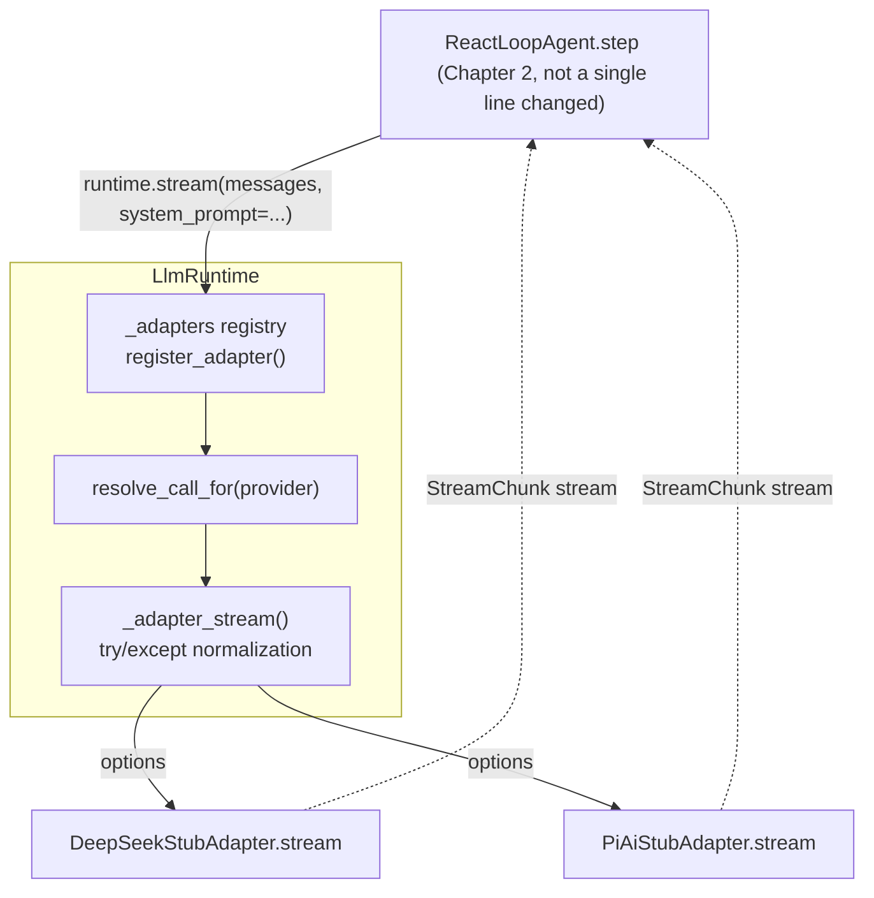
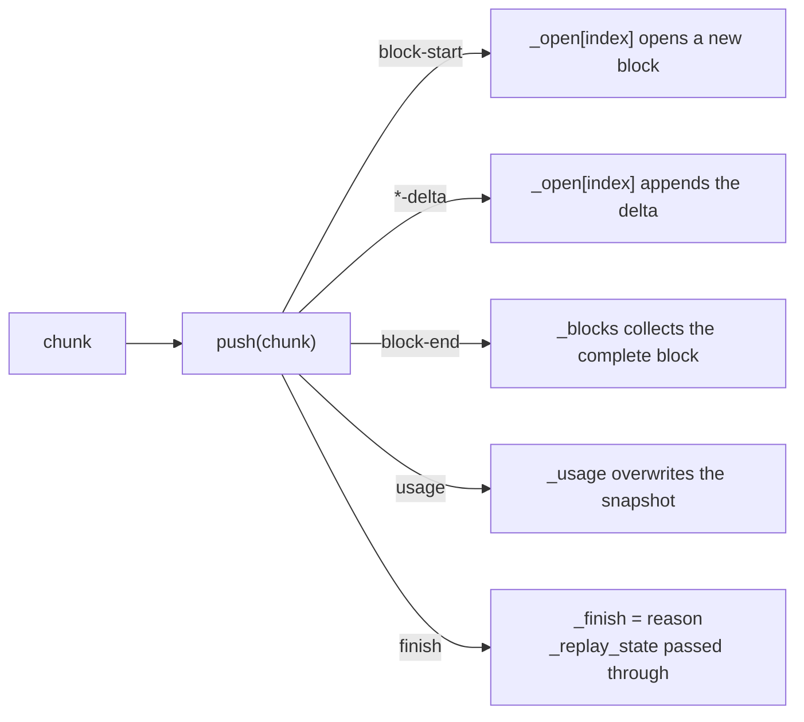
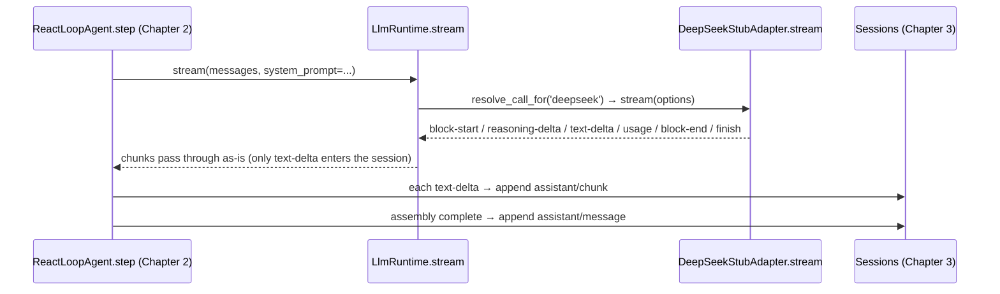

# Chapter 7: LLM Adaptation and Streaming

> Seats change often; the voice stays the same.

## Questions this chapter answers

- How do you replace the `LlmStub` placeholder left over from Chapter 2 with a real model without changing a single line on the caller side?
- Each provider's streaming protocol is different — how do you use one unified chunk protocol to shield the differences from upstream?
- How are streaming deltas accumulated into complete content blocks that downstream can consume directly?
- Where should secrets like API keys be placed so they don't enter business code and aren't passed as plaintext arguments?

In Chapter 2 §5.1, we placed a fake model in the model seat of the minimal closed loop: `LlmStub` yields 3 hard-coded text chunks plus 1 finish, letting `ReactLoopAgent.step` run through "consume chunk → append `assistant/chunk` → assemble `assistant/message`" without a real model. At the time we left a promise: **the stub is just a placeholder; in the future it will be replaced by a real model, and the caller won't change a single line**. This chapter cashes in that promise.

From Chapter 3 through Chapter 6, the loop kept getting thicker — persistence, tools pipeline, capability seam, execution world — but the model seat was always that stub. This chapter builds three things:

- **Adapter seam**: any provider can plug in; the caller only recognizes one `stream()`;
- **Unified streaming protocol**: differences in each provider's streaming format are absorbed inside the adapter; consumers only recognize one kind of chunk;
- **Credentials/settings seam**: secrets like API keys have a unified home and don't enter business code.

Once done, `ctx.provide("llm", runtime)` replaces Chapter 2's stub, and Chapter 2's AgentLoop runs through as-is.

Code relationships: this chapter reuses ch01's `Context` and ch02's `Sessions`/`SystemPromptService`/`AgentLoop` (via the `sys.path` insertion at the top of `ch07/code/main.py`, without copying files); all files newly added in this chapter land in `ch07/code/`.

## 1. Model Calls Welded Shut Inside Business Code

**Scenario**: the team first integrated Provider A (synchronous, whole-response), and business code called it directly; half a year later they need to integrate Provider B (HTTP + SSE streaming, completely different field names), and also support "streaming display + persisting complete blocks" at the same time.

First look at the counterexample without an adapter seam (`ch07/code/bad_example.py`, runnable with `python3 bad_example.py`):

```python
def answer_via_a(question):
    # Call site welded to Provider A: synchronous, whole text
    return provider_a_complete(question)


def answer_via_b(question):
    # Switching to Provider B: the call site must be rewritten; field names and assembly are completely different
    parts = []
    for event in provider_b_stream(question):
        parts.append(event["piece"])  # the field name is piece, not text
    return "".join(parts)
```

Output:

```text
Provider A: [A] answer to "What is an agent?"
Provider B: [B] answer to "What is an agent?" (arrived via streaming)
Problem: every new provider means writing a whole set of call code; switching provider = rewriting call sites
```

The problems boil down to four:

| # | Problem | Symptom |
|---|---|---|
| ① | Model calls welded shut | Switching providers requires rewriting call sites; N providers means N sets of call code |
| ② | Each provider's streaming protocol differs | SSE vs SDK events, field names all different; every consumer writes its own parsing |
| ③ | Deltas must be assembled into complete blocks | Every consumer writes "delta → complete block" on its own; behavior easily drifts |
| ④ | Secrets have no home | API keys passed as plaintext arguments, scattered across business code and logs |

This chapter solves them one by one: §2 solves ①, §3 solves the consumer side of ②③, §4 solves the producer side of ②, §5 solves ④.

## 2. Adapter seam: LlmAdapter + LlmRuntime

### 2.1 Concept introduction: minimal example

The **adapter seam** is a combination of "abstract interface + routing runtime": provider-private call logic is sealed inside adapters, and callers only get chunks through one unified entry. Without it, the pain is in §1 — every new provider means writing a set of call code. An analogy: a socket unifies the interface between appliances and the power grid; appliances just plug in, and whether the electricity is thermal or wind is decided on the grid side; the adapter seam is the socket for model calls.

The core idea is to split "model calls" into two roles:

- **LlmAdapter**: one implementation per provider, responsible for translating its own protocol into the unified form; the only abstract method is `stream`;
- **LlmRuntime**: holds the registry, exposes only one unified entry `stream()` externally, routing by provider.

Minimal example (run under `ch07/code/`):

```python
from llm_runtime import LlmRuntime


class EchoAdapter:  # minimal adapter: two things — provider_info + stream
    def provider_info(self):
        return {"id": "echo", "name": "Echo"}

    def stream(self, options):
        yield {"type": "text-delta", "index": 0, "text": f"echo: {options['messages'][-1]['content']}"}
        yield {"type": "finish", "reason": "stop"}


runtime = LlmRuntime()
runtime.register_adapter(EchoAdapter())
for chunk in runtime.stream([{"role": "user", "content": "hi"}]):
    print(chunk)
```

Output:

```text
{'type': 'text-delta', 'index': 0, 'text': 'echo: hi'}
{'type': 'finish', 'reason': 'stop'}
```

The caller only knows `runtime.stream(...)`; which adapter the chunks come from is decided by the registry — that's the seam.

### 2.2 Internal implementation: registry and unified entry



Broken down, three things:

1. **register_adapter**: uses `provider_info()["id"]` as the key to put the adapter instance into the `_adapters` registry; the first registrant becomes the default provider; returns a handle with `dispose`/`replace`, so swapping or removing an adapter doesn't touch the runtime body.
2. **resolve_call_for**: locates the adapter by provider; unregistered throws directly — routing errors surface at the entry, not rotting deep inside consumers.
3. **_adapter_stream**: wraps `adapter.stream(options)` with `try/except`; **any exception is normalized into one terminating chunk** `finish(reason=error)` — the consumer's loop never blows up, and error handling converges to one place.

**Numeric verification**: `main.py` segment 2 registers 3 adapters, and `list_providers()` returns exactly 3 metadata entries; the handle contains exactly the three keys `dispose`/`previous`/`replace`.

### 2.3 Python reconstruction

`ch07/code/llm_runtime.py` (excerpt):

```python
class LlmAdapter(ABC):
    """Adapter abstract base class: one implementation per provider; the only abstract method is stream.

    Corresponds to LlmAdapter (index.ts:180): all other methods have default implementations; subclasses override as needed.
    [Teaching decision G7] The real stream is an async generator; the teaching version uses a synchronous generator; the mechanism semantics are unchanged.
    """

    def provider_info(self):
        """provider metadata: routing key id + display name name (index.ts:186)."""
        return {"id": "unknown", "name": "unknown"}

    # ... provider_retry_policy / list_models / resolve_model all have default implementations; subclasses override as needed (omitted) ...

    @abstractmethod
    def stream(self, options):
        """Abstract method: receives GenerateOptions and yields StreamChunk one by one (index.ts:232)."""
```

```python
class LlmRuntime:
    # ... __init__ / register_adapter / list_providers / resolve_call_for see §2.2 ...

    def stream(self, messages, system_prompt=None, provider=None, model=None, **options):
        # ... docstring omitted: unified external entry (index.ts:913); signature compatible with Chapter 2's LlmStub.stream ...
        call_options = {
            "provider": provider or self._default,
            "model": model or "default",
            "messages": messages,
            "system": system_prompt,
        }
        call_options.update(options)
        return self._adapter_stream(call_options)

    def _adapter_stream(self, options):
        # ... docstring omitted: kernel of the unified streaming entry (index.ts:843); exceptions normalized into a terminating chunk ...
        adapter = self.resolve_call_for(options["provider"])
        try:
            yield from adapter.stream(options)
        except Exception as exc:  # normalization: exception → terminating chunk
            yield self._failure_chunk(exc)
```

Note the signature of `stream()`: `(messages, system_prompt=None, ...)` is **fully compatible** with Chapter 2's `LlmStub.stream` — this is not coincidence but deliberate design: only this way can the runtime directly replace the stub as `ctx.llm` (verified in §6).

### 2.4 Recap: the seam exists, but what flows through it

Problem ① solved: switching providers only changes the registry; call sites don't move a single line. But the chunk stream flowing inside the seam still has no unified "language" — each provider's streaming protocol differs (SSE vs SDK events, field names all different); if every consumer parses on its own, that's problems ②③. The next section unifies the chunk protocol and the consumer side.

## 3. Unified Streaming Protocol: StreamChunk + BlockAssembler

### 3.1 Concept introduction: the seven-variant protocol

The **unified streaming protocol** answers "what do the chunks flowing inside the seam look like": it prescribes a fixed set of chunk types; producers send accordingly, consumers receive accordingly, and neither side needs to know the specific provider. Without it, you get problems ②③ — every consumer writes parsing and assembly once per provider.

The real source defines the streaming protocol as a discriminated union `StreamChunk` (packages/llm/llm/src/types.ts:291), with 7 variants in total; the teaching version expresses them as dicts, discriminated by the `type` field (`STREAM_CHUNK_TYPES` in `llm_runtime.py`):

| Variant | Carries | Duty |
|---|---|---|
| `block-start` | `index`, `block_type` | Declares "a content block begins" |
| `text-delta` | `index`, `text` | Text delta |
| `reasoning-delta` | `index`, `text` | Reasoning delta |
| `tool-call-delta` | `index`, `id`/`name`/`arguments_delta` | Tool-call delta (arguments appended segment by segment) |
| `block-end` | `index`, `block` | Block ends, **carrying the complete block** |
| `usage` | `usage` (TokenUsage) | Token metering snapshot |
| `finish` | `reason` (FinishReason), optional `replay_state` | Call ends |

The consumer side doesn't need to implement "delta → complete block" itself: `BlockAssembler` does it. Minimal example (run under `ch07/code/`):

```python
from llm_runtime import BlockAssembler

assembler = BlockAssembler()
for chunk in (
    {"type": "block-start", "index": 0, "block_type": "text"},
    {"type": "text-delta", "index": 0, "text": "hello "},
    {"type": "text-delta", "index": 0, "text": "world"},
    {"type": "block-end", "index": 0, "block": {"type": "text", "text": "hello world"}},
    {"type": "finish", "reason": "stop"},
):
    assembler.push(chunk)
print(assembler.blocks)  # [{'type': 'text', 'text': 'hello world'}]
print(assembler.finish)  # stop
```

### 3.2 Internal implementation: push's dispatch table



Broken down, four states:

1. `_open`: a dict of "blocks being accumulated", keyed by `index`; `*-delta` appends deltas to the corresponding block;
2. `_blocks`: list of completed blocks; `block-end` carries the complete block into the queue — the protocol requires `block-end` to carry the complete block, and consumers can trust it directly;
3. `_usage`: the latest metering snapshot; a later `usage` chunk overwrites the earlier one (synchronously idempotent);
4. `_finish`/`_replay_state`: termination reason and the adapter-private replay state (opaque to consumers, only passed through).

The external observation points are four read-only properties (`blocks`/`usage`/`finish`/`replay_state`, assembler.ts:134-152) plus one `message()` (assembler.ts:161), which turns the accumulated result into one assistant message.

### 3.3 Python reconstruction

`BlockAssembler.push` in `ch07/code/llm_runtime.py` (excerpt):

```python
class BlockAssembler:
    # ... __init__ and observation points blocks/usage/finish/replay_state see §3.2 ...

    def push(self, chunk):
        """Consume one chunk and update internal state by type."""
        chunk_type = chunk["type"]
        if chunk_type == "block-start":
            # ... omitted: open a new block by block_type (text/reasoning/tool-call) ...
        elif chunk_type in ("text-delta", "reasoning-delta"):
            block = self._open.setdefault(
                chunk["index"], {"type": chunk_type.split("-")[0], "text": ""}
            )
            block["text"] += chunk["text"]
        # ... tool-call-delta branch omitted (id/name/arguments appended segment by segment) ...
        elif chunk_type == "block-end":
            self._open.pop(chunk["index"], None)
            self._blocks.append(chunk["block"])
        elif chunk_type == "usage":
            self._usage = chunk["usage"]
        elif chunk_type == "finish":
            self._finish = chunk["reason"]
            self._replay_state = chunk.get("replay_state")
```

### 3.4 Recap: the protocol is unified, but who produces the chunks

The consumer side is unified; the producer side still has to face each provider's private protocol head-on: DeepSeek is HTTP + SSE byte stream, Pi.AI is SDK events. How do adapters translate them into the seven-variant protocol? Let's dissect one real adapter.

## 4. A Real Adapter: DeepSeek's Three-Stage Pipeline

### 4.1 Concept introduction: what's inside an adapter

The real source's `DeepSeekAdapter.stream` (packages/llm/llm-deepseek/src/adapter.ts:214) is a three-stage pipeline: **serialize request → send request (fetch) → parse SSE and translate**. The teaching version replaces "send request" with a built-in sample (no network); the rest of the pipeline matches the real version.

### 4.2 Internal implementation: serialize → parse_sse → translate


Broken down, three stages:

1. **serialize_request** (serialize.ts:151): maps GenerateOptions to the DeepSeek request body — `system` occupies an independent slot and is not mixed into `messages`; `stream` is always True.
2. **parse_sse** (sse.ts:28): splits by line, recognizes only `data:` frames, terminates on `[DONE]`; each frame is `json.loads`'d into an event dict.
3. **translate** (translate.ts:86): event dict → StreamChunk. Two field-level mappings: `map_finish_reason` (translate.ts:31, `stop`/`tool_calls`/`length` → unified reason) and `map_usage` (translate.ts:53, `cached_tokens` goes into `cache_read_tokens`, and `input_tokens` counts only the cache-miss portion).

One detail: the protocol requires `block-end` to carry the **complete block**, but upstream SSE only has deltas — so `translate` is a **stateful generator**: it accumulates each block's text internally, emits `block-end` to close out on block switches, and spits out the last block whole at the termination point.

### 4.3 Python reconstruction

`ch07/code/deepseek_adapter.py` (excerpt):

```python
def translate(events):
    """Translate the DeepSeek event stream into unified StreamChunks (translate.ts:86)."""
    open_block = None  # block being accumulated: {"index", "block_type", "text"}
    for event in events:
        choice = (event.get("choices") or [{}])[0]
        delta = choice.get("delta") or {}
        for field, block_type, chunk_type in (
            ("reasoning_content", "reasoning", "reasoning-delta"),
            ("content", "text", "text-delta"),
        ):
            if field not in delta:
                continue
            if open_block is None or open_block["block_type"] != block_type:
                if open_block is not None:
                    yield _close_block(open_block)
                open_block = {"index": 0, "block_type": block_type, "text": ""}
                yield {"type": "block-start", "index": 0, "block_type": block_type}
            open_block["text"] += delta[field]
            yield {"type": chunk_type, "index": 0, "text": delta[field]}
        # ... usage / finish_reason branches omitted (mapped via map_usage / map_finish_reason) ...
```

```python
def map_usage(usage):
    """Field-level mapping: DeepSeek usage → TokenUsage (translate.ts:53)."""
    cached = usage.get("cached_tokens", 0)
    details = usage.get("completion_tokens_details") or {}
    return {
        "input_tokens": usage.get("prompt_tokens", 0) - cached,
        "output_tokens": usage.get("completion_tokens", 0),
        "cache_read_tokens": cached,
        "cache_write_tokens": 0,  # DeepSeek has no cache-write concept
        "reasoning_tokens": details.get("reasoning_tokens", 0),
    }
```

Comparing with `ch07/code/pi_adapter.py`, which shows another upstream form: Pi.AI goes through SDK events, and `to_stream_chunks` (stream.ts:124) normalizes SDK events into the same seven-variant protocol — **different upstream forms, same exit**, differences absorbed by the adapter.

### 4.4 Recap: the producer side is in place, but secrets still have no home

The three-stage pipeline is still missing one ingredient: the first step of the real `stream` is `resolveApiKey` (adapter.ts:221) — API keys can't be hard-coded and can't be passed as plaintext arguments. This is problem ④, solved by the credentials seam.

## 5. Infrastructure seams: credentials, settings, and token metering

### 5.1 CredentialProvider: the only channel for secrets

**CredentialProvider** is the only channel for reading and writing secrets: confidential material like API keys all goes through it for storage and retrieval; hard-coding and plaintext argument passing are forbidden. Without it, the pain is problem ④ — keys scattered across business code and logs.

The real source's `CredentialProvider` (packages/credentials/src/index.ts:60) defines five actions: `resolve` (:73, reads the secret and returns it with a source tag), `describe` (:81, **returns only metadata, not the secret**), `set` (:91), `unset` (:99), `notifyUpdated` (:115, broadcasts changes). Minimal example (run under `ch07/code/`):

```python
from credentials import InMemoryCredentialProvider

credentials = InMemoryCredentialProvider()
credentials.set("deepseek/api-key", "sk-demo-123")
print(credentials.describe("deepseek/api-key"))  # metadata does not contain the secret
print(credentials.resolve("deepseek/api-key"))   # only here is the secret taken out
```

Output:

```text
{'ref': 'deepseek/api-key', 'source': 'env'}
sk-demo-123
```

The adapter calls `resolve` only at the last step before constructing the request (`DeepSeekStubAdapter.resolve_api_key`); the key never enters business code. [Teaching simplification] The real `resolve` is async; the teaching version is synchronous.

### 5.2 SettingsProvider: non-secret configuration

Non-secret configuration (such as streaming's `idle_timeout_ms`) goes through `SettingsProvider` (packages/settings/src/index.ts:350): `register` (:435) declares setting items, `get` (:519) reads, `update` (:534) partially updates dict-typed setting values, `replace` (:548) replaces wholesale. The teaching version implements it with an in-memory dict (`InMemorySettingsProvider`). The division of labor between the two seams in one sentence: **secrets go through credentials, everything else goes through settings**.

### 5.3 TokenMeter: folding the chunk stream into usage

`TokenMeter` (packages/llm/token-meter/src/index.ts:74) folds the chunk stream into one `TokenUsage`: `measure` (:116) consumes the stream, `_fold_event` (:188) folds one by one — `usage` chunks **overwrite wholesale** (the precise metering reported by the adapter takes priority), `text-delta` **accumulates estimates** by character count (estimate.ts:26, char/token ratio 4:1; each message also has a fixed per-role overhead, estimate.ts:19). `main.py` segment 7 verifies: the estimate is ultimately overwritten by the usage reported by the adapter, and the result matches exactly the assembler's `usage` snapshot in §4.

## 6. Full Run Output

`cd ch07/code && python3 main.py`, seven segments of end-to-end output (consistent with actual runs; every line in this section is printed by `main.py`'s `print`, with no framework logs or third-party output):

```text
== 1. Credentials / settings seam ==
  describe(deepseek/api-key) -> {'ref': 'deepseek/api-key', 'source': 'env'}
  settings.get(llm/stream)   -> {'idle_timeout_ms': 30000}

== 2. Register adapters: the LlmRuntime registry ==
  list_providers() -> [{'id': 'deepseek', 'name': 'DeepSeek'}, {'id': 'pi-ai', 'name': 'Pi.AI'}, {'id': 'pi-fail', 'name': 'Pi.AI'}]
  keys of the handle returned by register -> ['dispose', 'previous', 'replace']

== 3. Unified streaming entry: the caller changes not a single line, only swaps the provider ==
  provider=deepseek: 10 chunks
    types=['block-start', 'reasoning-delta', 'reasoning-delta', 'block-end', 'block-start', 'text-delta', 'text-delta', 'usage', 'block-end', 'finish']
  provider=pi-ai: 6 chunks
    types=['block-start', 'text-delta', 'text-delta', 'usage', 'block-end', 'finish']

== 4. BlockAssembler: deltas accumulate into complete blocks ==
  blocks -> [{'type': 'reasoning', 'text': 'Break the problem down first, then give the conclusion.'}, {'type': 'text', 'text': 'DeepSeek is a model company.'}]
  usage  -> {'input_tokens': 8, 'output_tokens': 8, 'cache_read_tokens': 4, 'cache_write_tokens': 0, 'reasoning_tokens': 0}
  finish -> stop
  message() -> {'role': 'assistant', 'content': [{'type': 'reasoning', 'text': 'Break the problem down first, then give the conclusion.'}, {'type': 'text', 'text': 'DeepSeek is a model company.'}]}

== 5. Exception normalization: exception → finish(reason=error) ==
  chunk -> {'type': 'finish', 'reason': 'error', 'error': 'upstream unavailable (demo of exception normalization)'}

== 6. Cashing in Chapter 2's promise: the runtime replaces LlmStub ==
  2 assistant/chunk events; assistant message: DeepSeek is a model company.

== 7. TokenMeter: folding the chunk stream into usage ==
  measure(stream) -> {'input_tokens': 8, 'output_tokens': 8, 'cache_read_tokens': 4, 'cache_write_tokens': 0, 'reasoning_tokens': 0}
  estimate_message(user) -> 5 tokens
```

Segment 6 is this chapter's cash-in moment; the timeline is as follows:



**Line-by-line trace**:

| Segment | Mechanism | Source anchor |
|---|---|---|
| 1 credentials/settings | `set`/`describe`; `register`/`get` | credentials/src/index.ts:91/:81; settings/src/index.ts:435/:519 |
| 2 registration | registerAdapter → registry + handle | llm/src/index.ts:338 |
| 3 unified entry | stream → resolveCallFor → adapterStream | llm/src/index.ts:913/:734/:843 |
| 4 accumulation | push → blocks/usage/finish/message | assembler.ts:36/:134/:142/:147/:161 |
| 5 normalization | adapterFailureChunk | llm/src/index.ts:931 |
| 6 cash-in | runtime replaces LlmStub; Chapter 2's step unchanged by a single line | llm/src/index.ts:913 (the corresponding spot for Chapter 2's LlmStub) |
| 7 metering | measure/_foldEvent | token-meter/src/index.ts:116/:188 |

## 7. Source Mapping

| Teaching symbol | Real source | Teaching simplification |
| --- | --- | --- |
| `LlmAdapter` | `packages/llm/llm/src/index.ts:180` (providerInfo :186 / providerRetryPolicy :195 / listModels :206 / resolveModel :219 / stream :232) | stream is a synchronous generator (real version is async); other default implementations kept |
| `LlmRuntime` | `packages/llm/llm/src/index.ts:284` (registerAdapter :338 / listProviders :419 / resolveCallFor :734 / adapterStream :843 / stream :913 → streamWithRegistration :917 / adapterFailureChunk :931) | Omits the waterfall('llm/stream') event wrapping (:925), prepareCall config freezing (:779), and model discovery |
| `STREAM_CHUNK_TYPES` | `packages/llm/llm/src/types.ts:291` (StreamChunk seven variants; FinishReason :279; TokenUsage :264; ContentBlock :199) | TS discriminated union → dict + type field |
| `BlockAssembler` | `packages/llm/llm/src/assembler.ts:36` (blocks :134 / usage :142 / finish :147 / replayState :152 / message :161) | Semantics consistent |
| `DeepSeekStubAdapter` | `packages/llm/llm-deepseek/src/adapter.ts:158` (stream :214 / resolveApiKey :221 / request :271); serialize.ts:151; sse.ts:28; translate.ts:86 (mapFinishReason :31 / mapUsage :53) | fetch replaced with a built-in SSE sample (no network); omits abort signal and idle watchdog |
| `PiAiStubAdapter` | `packages/llm/llm-pi-ai/src/adapter.ts:186` (stream :276 / resolveModel :251); stream.ts:124 (mapStopReason :73) | SDK streamSimple replaced with a built-in event sample |
| `InMemoryCredentialProvider` | `packages/credentials/src/index.ts:60` (resolve :73 / describe :81 / set :91 / unset :99 / notifyUpdated :115) | resolve async → synchronous; in-memory storage replaces the system keychain |
| `InMemorySettingsProvider` | `packages/settings/src/index.ts:350` (register :435 / describe :479 / get :519 / update :534 / replace :548) | In-memory dict implementation |
| `TokenMeter` | `packages/llm/token-meter/src/index.ts:74` (measure :116 / _foldEvent :188); estimate.ts:19/:26/:56 | Omits per-provider estimation differentiation (_estimateProviderAssistant :277); unified char/token ratio |

## 8. Summary and Preview

| Problem | Solving mechanism | One-line principle |
|---|---|---|
| ① Model calls welded shut | LlmAdapter + LlmRuntime | A provider is just one entry in the registry; the caller only recognizes stream() |
| ② Streaming protocols differ | StreamChunk seven variants + adapter translation | Differences absorbed inside adapters; the exit is a unified protocol |
| ③ Delta assembly | BlockAssembler | push consumes one by one; blocks/usage/finish are read-only observation points |
| ④ Secrets have no home | CredentialProvider / SettingsProvider | Secrets go through credentials, everything else goes through settings |

The opening epigraph is cashed in here: "seats change often" is proven by segment 6 — the runtime replaces the stub, and Chapter 2's caller changes not a single line; "the voice stays the same" is proven by segments 3/4 — both providers' exits are the same seven-variant chunks, accumulated by the same assembler.

Chapter 2's `LlmStub` officially retires here: the model seat goes from "hard-coded stub" to "pluggable runtime", and the session starts receiving real-shaped streaming chunks. Once the model seat is in place, the next question is more fundamental: where exactly does the prompt sent to the model come from, and how is it assembled? Chapter 8 "system-prompt assembly and context" will answer this question: plugins register ordered sections via `ctx.systemPrompt.section()`, `assemble()` merges and sorts, `renderPrompt()` renders into system text, and tool schemas are an independent field parallel to it. As for the problem of conversations growing longer and longer, context approaching the window limit producing `finish(reason=max-tokens)` (types.ts:279), Chapter 10 "context compaction" will solve it along the `compaction` direction: when to compact, what to compact, and how to keep the compacted session traceable.

## 9. Appendix: Key Concepts Cheat Sheet

| Layer | Concept | One-line definition | First appearance |
| --- | --- | --- | --- |
| Vocabulary | ContentBlock | Union of five content block types (text/reasoning/tool-call/tool-result/image) | §3.1 |
| Vocabulary | FinishReason | Call termination reason (stop/tool-calls/max-tokens/error/aborted) | §3.1 |
| Vocabulary | TokenUsage | Metering snapshot (input/output/cache_read/cache_write/reasoning) | §3.1 |
| Protocol | StreamChunk | Seven-variant streaming protocol, the only language between adapter and consumer | §3.1 |
| seam | LlmAdapter | Provider adapter base class; the only abstract method is stream | §2.1 |
| seam | CredentialProvider | The only channel for reading and writing secrets | §5.1 |
| seam | SettingsProvider | Registration and read/write of non-secret configuration | §5.2 |
| Runtime | LlmRuntime | Unified entry of registry + routing + exception normalization | §2.2 |
| Runtime | BlockAssembler | Accumulates deltas into complete blocks | §3.2 |
| Runtime | TokenMeter | Folds the chunk stream into TokenUsage | §5.3 |
