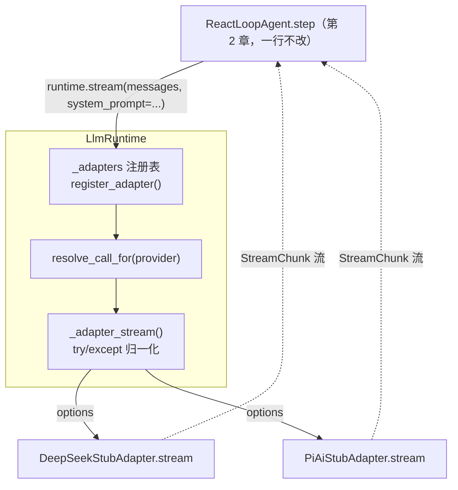
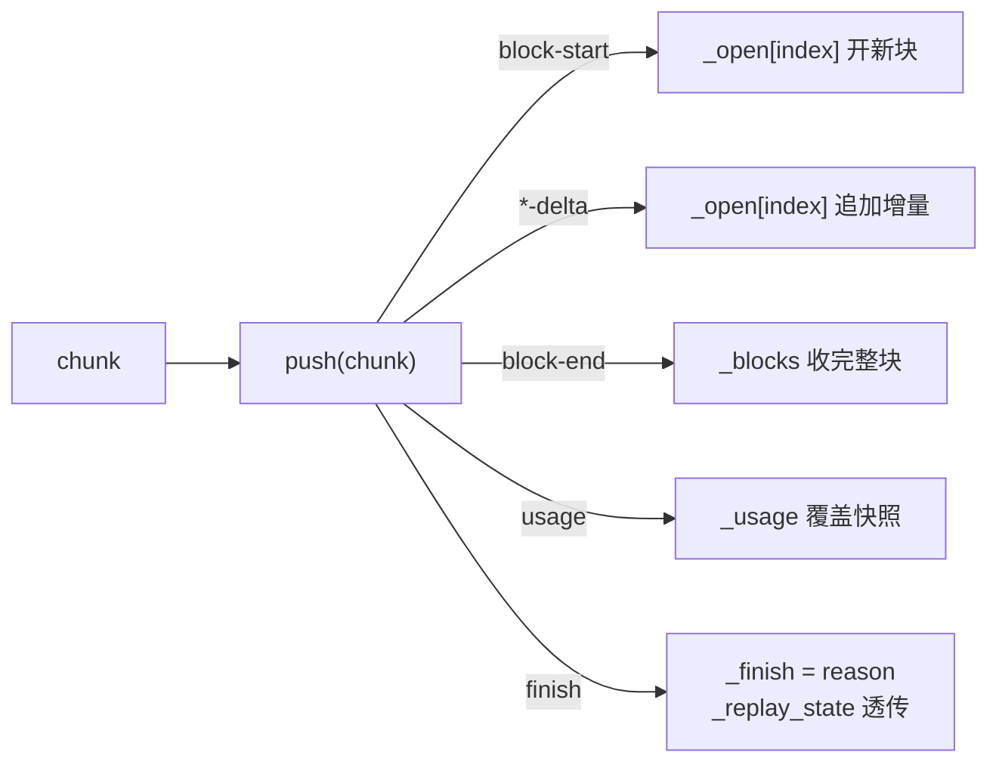
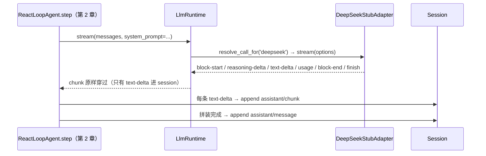

# 第 7 章 LLM 适配与流式

> 席位常换，声音如一。

## 本章回答的问题

- 第 2 章留下的 `LlmStub` 桩位，如何换成真实模型而调用方一行不改？
- 各家 provider 的流式协议各不相同，如何用一套统一的 chunk 协议对上屏蔽差异？
- 流式增量（delta）如何被累积成完整内容块，供下游直接消费？
- API Key 这类 secret 放在哪里，才能不进业务代码、不明文传参？

第 2 章 §5.1 里，我们在最小闭环的模型席位上放了一个假模型：`LlmStub` yield 3 个写死的文本 chunk 加 1 个 finish，让 `ReactLoopAgent.step` 在没有真实模型的情况下跑通「消费 chunk → 追加 `assistant/chunk` → 拼出 `assistant/message`」。当时留了一句承诺：**桩只是占位，将来要换成真实模型，且调用方一行不改**。本章兑现这个承诺。

第 3 章到第 6 章，循环一路加厚——持久化、工具管线、能力 seam、执行世界——但模型席位始终是那个桩。本章造三样东西：

- **适配器 seam**：任何 provider 都能挂进来，调用方只认一个 `stream()`；
- **统一流式协议**：各家流式格式的差异在适配器内部消化，消费者只认一种 chunk；
- **凭据/设置 seam**：API key 这类 secret 有统一去处，不进业务代码。

做完之后，`ctx.provide("llm", runtime)` 顶替第 2 章的桩，第 2 章的 AgentLoop 原样跑通。

代码关系：本章复用 ch01 的 `Context` 与 ch02 的 `Sessions`/`SystemPromptService`/`AgentLoop`（经 `ch07/code/main.py` 顶部 `sys.path` 插入，不复制文件）；本章新增文件全部落在 `ch07/code/`。

## 1. 模型调用焊死在业务代码里

**场景**：团队先接了 Provider A（同步、整段返回），业务代码直接调用；半年后要接 Provider B（HTTP + SSE 流式，字段名完全不同），还要同时支持「流式展示 + 完整块落库」。

先看没有适配器 seam 的反面示例（`ch07/code/bad_example.py`，`python3 bad_example.py` 可运行）：

```python
def answer_via_a(question):
    # 调用点焊死在 Provider A：同步、整段文本
    return provider_a_complete(question)


def answer_via_b(question):
    # 换到 Provider B：调用点必须重写，字段名、拼装方式全不同
    parts = []
    for event in provider_b_stream(question):
        parts.append(event["piece"])  # 字段名是 piece，不是 text
    return "".join(parts)
```

输出：

```text
Provider A: [A] 对「什么是 agent？」的回答
Provider B: [B] 对「什么是 agent？」的回答（流式到达）
问题：每接一家 provider 就写一套调用代码，换 provider = 重写调用点
```

问题归为四条：

| # | 问题 | 表现 |
|---|---|---|
| ① | 模型调用焊死 | 换 provider 要重写调用点；N 家 provider 就有 N 套调用代码 |
| ② | 各家流式协议不同 | SSE vs SDK 事件，字段名各异；每个消费者自己写解析 |
| ③ | 增量要拼成完整块 | 「delta → 完整块」每个消费者各写一遍，行为容易漂移 |
| ④ | secret 没地方放 | API key 明文传参，散落在业务代码与日志里 |

本章逐一解决：§2 解决 ①，§3 解决 ②③ 的消费端，§4 解决 ② 的生产端，§5 解决 ④。

## 2. 适配器 seam：LlmAdapter + LlmRuntime

### 2.1 概念引入：最小示例

**适配器 seam** 是一套「抽象接口 + 路由运行时」的组合：provider 私有的调用逻辑被封进适配器，调用方只经一个统一入口拿 chunk。没有它，痛在 §1——每接一家 provider 就写一套调用代码。打个比方：插座统一了电器与电网的接口，电器只管插电，电是火电还是风电由电网侧决定；适配器 seam 就是模型调用的插座。

核心思路是把「模型调用」拆成两个角色：

- **LlmAdapter**：每家 provider 实现一个，负责把自己的协议翻译成统一形态；唯一抽象方法是 `stream`；
- **LlmRuntime**：持有注册表，对外只暴露一个统一入口 `stream()`，按 provider 路由。

最小示例（在 `ch07/code/` 下运行）：

```python
from llm_runtime import LlmRuntime


class EchoAdapter:  # 最小适配器：provider_info + stream 两件事
    def provider_info(self):
        return {"id": "echo", "name": "Echo"}

    def stream(self, options):
        yield {"type": "text-delta", "index": 0, "text": f"echo: {options['messages'][-1]['content']}"}
        yield {"type": "finish", "reason": "stop"}


runtime = LlmRuntime()
runtime.register_adapter(EchoAdapter())
for chunk in runtime.stream([{"role": "user", "content": "hi"}]):
    print(chunk)
```

输出：

```text
{'type': 'text-delta', 'index': 0, 'text': 'echo: hi'}
{'type': 'finish', 'reason': 'stop'}
```

调用方只认识 `runtime.stream(...)`；chunk 从哪个适配器来，由注册表决定——这就是 seam。

### 2.2 内部实现：注册表与统一入口



拆开看是三件事：

1. **register_adapter**：以 `provider_info()["id"]` 为键把 adapter 实例放进 `_adapters` 注册表；首个注册者成为默认 provider；返回带 `dispose`/`replace` 的句柄，换掉或卸下某个适配器不动 runtime 本体。
2. **resolve_call_for**：按 provider 定位 adapter；未注册直接抛错——路由错误在入口处暴露，而不是烂在消费者深处。
3. **_adapter_stream**：用 `try/except` 包住 `adapter.stream(options)`，**任何异常都归一化为一条终止 chunk** `finish(reason=error)`——消费者的循环永不炸，错误处理收敛到一处。

**数字验证**：`main.py` 段落 2 注册 3 个适配器，`list_providers()` 恰好返回 3 条元数据；句柄恰好含 `dispose`/`previous`/`replace` 三个键。

### 2.3 Python 重构

`ch07/code/llm_runtime.py`（节选）：

```python
class LlmAdapter(ABC):
    """适配器抽象基类：每家 provider 实现一个，唯一抽象方法是 stream。

    对应 LlmAdapter（index.ts:180）：其余方法均有默认实现，子类按需覆写。
    [教学决策 G7] 真实版 stream 是 async 生成器；教学版用同步生成器，机制语义不变。
    """

    def provider_info(self):
        """provider 元数据：路由键 id + 展示名 name（index.ts:186）。"""
        return {"id": "unknown", "name": "unknown"}

    # ... provider_retry_policy / list_models / resolve_model 均有默认实现，子类按需覆写（略）...

    @abstractmethod
    def stream(self, options):
        """抽象方法：接收 GenerateOptions，逐条 yield StreamChunk（index.ts:232）。"""
```

```python
class LlmRuntime:
    # ... __init__ / register_adapter / list_providers / resolve_call_for 见 §2.2 ...

    def stream(self, messages, system_prompt=None, provider=None, model=None, **options):
        # ... docstring 略：对外统一入口（index.ts:913），签名与第 2 章 LlmStub.stream 兼容 ...
        call_options = {
            "provider": provider or self._default,
            "model": model or "default",
            "messages": messages,
            "system": system_prompt,
        }
        call_options.update(options)
        return self._adapter_stream(call_options)

    def _adapter_stream(self, options):
        # ... docstring 略：统一流式入口内核（index.ts:843），异常归一化为终止 chunk ...
        adapter = self.resolve_call_for(options["provider"])
        try:
            yield from adapter.stream(options)
        except Exception as exc:  # 归一化：异常 → 终止 chunk
            yield self._failure_chunk(exc)
```

注意 `stream()` 的签名：`(messages, system_prompt=None, ...)` 与第 2 章 `LlmStub.stream` **完全兼容**——这不是巧合而是刻意设计：只有这样，runtime 才能直接顶替桩成为 `ctx.llm`（§6 验证）。

### 2.4 回溯：seam 有了，流的是什么

问题 ① 解决：换 provider 只改注册表，调用点一行不动。但 seam 里流动的 chunk 流还没有统一「语言」——各家 provider 的流式协议不同（SSE vs SDK 事件，字段名各异），若每个消费者自己解析，就是问题 ②③。下一节统一 chunk 协议与消费端。

## 3. 统一流式协议：StreamChunk + BlockAssembler

### 3.1 概念引入：七变体协议

**统一流式协议**回答「seam 里流的 chunk 长什么样」：规定一组固定的 chunk 类型，生产者照此发、消费者照此收，双方都不必认识具体 provider。没有它，就是问题 ②③——每个消费者为每家 provider 各写一遍解析与拼装。

真实源码把流式协议定义为一个判别联合 `StreamChunk`（packages/llm/llm/src/types.ts:291），共 7 个变体；教学版用 dict 表达，靠 `type` 字段判别（`llm_runtime.py` 的 `STREAM_CHUNK_TYPES`）：

| 变体 | 携带 | 职责 |
|---|---|---|
| `block-start` | `index`、`block_type` | 声明「一个内容块开始」 |
| `text-delta` | `index`、`text` | 文本增量 |
| `reasoning-delta` | `index`、`text` | 推理增量 |
| `tool-call-delta` | `index`、`id`/`name`/`arguments_delta` | 工具调用增量（arguments 逐段追加） |
| `block-end` | `index`、`block` | 块结束，**携带完整块** |
| `usage` | `usage`（TokenUsage） | token 计量快照 |
| `finish` | `reason`（FinishReason）、可选 `replay_state` | 调用结束 |

消费端不用自己实现「增量 → 完整块」：`BlockAssembler` 代劳。最小示例（在 `ch07/code/` 下运行）：

```python
from llm_runtime import BlockAssembler

assembler = BlockAssembler()
for chunk in (
    {"type": "block-start", "index": 0, "block_type": "text"},
    {"type": "text-delta", "index": 0, "text": "hello "},
    {"type": "text-delta", "index": 0, "text": "world"},
    {"type": "block-end", "index": 0, "block": {"type": "text", "text": "hello world"}},
    {"type": "finish", "reason": "stop"},
):
    assembler.push(chunk)
print(assembler.blocks)  # [{'type': 'text', 'text': 'hello world'}]
print(assembler.finish)  # stop
```

### 3.2 内部实现：push 的分发表



拆开看是四个状态：

1. `_open`：「正在累积的块」字典，以 `index` 为键；`*-delta` 把增量追加到对应块上；
2. `_blocks`：已完成块列表；`block-end` 携带完整块入列——协议要求 `block-end` 必须带完整块，消费者可直接信任；
3. `_usage`：最近一次计量快照，后来的 `usage` chunk 覆盖前者（同步幂等）；
4. `_finish`/`_replay_state`：终止原因与 adapter 私有重放状态（对消费者不透明，只透传）。

对外观察点是四个只读属性（`blocks`/`usage`/`finish`/`replay_state`，assembler.ts:134-152）加一个 `message()`（assembler.ts:161），把累积结果转成一条 assistant 消息。

### 3.3 Python 重构

`ch07/code/llm_runtime.py` 的 `BlockAssembler.push`（节选）：

```python
class BlockAssembler:
    # ... __init__ 与观察点 blocks/usage/finish/replay_state 见 §3.2 ...

    def push(self, chunk):
        """消费一条 chunk，按类型更新内部状态。"""
        chunk_type = chunk["type"]
        if chunk_type == "block-start":
            # ... 略：按 block_type（text/reasoning/tool-call）开新块 ...
        elif chunk_type in ("text-delta", "reasoning-delta"):
            block = self._open.setdefault(
                chunk["index"], {"type": chunk_type.split("-")[0], "text": ""}
            )
            block["text"] += chunk["text"]
        # ... tool-call-delta 分支略（id/name/arguments 逐段追加）...
        elif chunk_type == "block-end":
            self._open.pop(chunk["index"], None)
            self._blocks.append(chunk["block"])
        elif chunk_type == "usage":
            self._usage = chunk["usage"]
        elif chunk_type == "finish":
            self._finish = chunk["reason"]
            self._replay_state = chunk.get("replay_state")
```

### 3.4 回溯：协议统一了，谁来生产 chunk

消费端统一了，生产端还要直面各家 provider 的私有协议：DeepSeek 是 HTTP + SSE 字节流，Pi.AI 是 SDK 事件。适配器如何把它们翻译成七变体协议？拆一个真实适配器看。

## 4. 一个真实适配器：DeepSeek 的三段流水线

### 4.1 概念引入：适配器内部长什么样

真实源码的 `DeepSeekAdapter.stream`（packages/llm/llm-deepseek/src/adapter.ts:214）是一条三段流水线：**序列化请求 → 发出请求（fetch）→ 解析 SSE 并翻译**。教学版把「发出请求」换成内置样例（无网络），其余流水线与真实版一致。

### 4.2 内部实现：serialize → parse_sse → translate


拆开看是三段：

1. **serialize_request**（serialize.ts:151）：把 GenerateOptions 映射为 DeepSeek 请求体——`system` 占独立槽位，不混入 `messages`；`stream` 恒为 True。
2. **parse_sse**（sse.ts:28）：按行切分，只认 `data:` 帧，`[DONE]` 终止；每帧 `json.loads` 成事件 dict。
3. **translate**（translate.ts:86）：事件 dict → StreamChunk。两个字段级映射：`map_finish_reason`（translate.ts:31，`stop`/`tool_calls`/`length` → 统一 reason）与 `map_usage`（translate.ts:53，`cached_tokens` 归入 `cache_read_tokens`，`input_tokens` 只计缓存未命中部分）。

一个细节：协议要求 `block-end` 携带**完整块**，而上游 SSE 只有增量——所以 `translate` 是**有状态生成器**：内部累积各块文本，块切换时发 `block-end` 收尾，终止点把最后的块整块吐出。

### 4.3 Python 重构

`ch07/code/deepseek_adapter.py`（节选）：

```python
def translate(events):
    """把 DeepSeek 事件流翻译为统一 StreamChunk（translate.ts:86）。"""
    open_block = None  # 正在累积的块：{"index", "block_type", "text"}
    for event in events:
        choice = (event.get("choices") or [{}])[0]
        delta = choice.get("delta") or {}
        for field, block_type, chunk_type in (
            ("reasoning_content", "reasoning", "reasoning-delta"),
            ("content", "text", "text-delta"),
        ):
            if field not in delta:
                continue
            if open_block is None or open_block["block_type"] != block_type:
                if open_block is not None:
                    yield _close_block(open_block)
                open_block = {"index": 0, "block_type": block_type, "text": ""}
                yield {"type": "block-start", "index": 0, "block_type": block_type}
            open_block["text"] += delta[field]
            yield {"type": chunk_type, "index": 0, "text": delta[field]}
        # ... usage / finish_reason 分支略（经 map_usage / map_finish_reason 映射）...
```

```python
def map_usage(usage):
    """字段级映射：DeepSeek usage → TokenUsage（translate.ts:53）。"""
    cached = usage.get("cached_tokens", 0)
    details = usage.get("completion_tokens_details") or {}
    return {
        "input_tokens": usage.get("prompt_tokens", 0) - cached,
        "output_tokens": usage.get("completion_tokens", 0),
        "cache_read_tokens": cached,
        "cache_write_tokens": 0,  # DeepSeek 无 cache-write 概念
        "reasoning_tokens": details.get("reasoning_tokens", 0),
    }
```

对照 `ch07/code/pi_adapter.py` 展示了另一种上游形态：Pi.AI 走 SDK 事件，`to_stream_chunks`（stream.ts:124）把 SDK 事件归一化为同一套七变体协议——**上游形态不同，出口相同**，差异被适配器吸收。

### 4.4 回溯：生产端就位，secret 还没地方放

三段流水线还差一味原料：真实版 `stream` 的第一步是 `resolveApiKey`（adapter.ts:221）——API key 不能写死，也不能明文传参。这是问题 ④，靠凭据 seam 解决。

## 5. 基础设施 seam：凭据、设置与 token 计量

### 5.1 CredentialProvider：secret 的唯一通道

**CredentialProvider** 是 secret 读写的唯一通道：API key 这类机密一律经它存取，禁止硬编码与明文传参。没有它，痛在问题 ④——key 散落在业务代码与日志里。

真实源码的 `CredentialProvider`（packages/credentials/src/index.ts:60）定义五个动作：`resolve`（:73，读 secret，带 source 标记返回）、`describe`（:81，**只回元数据，不含 secret**）、`set`（:91）、`unset`（:99）、`notifyUpdated`（:115，广播变更）。最小示例（在 `ch07/code/` 下运行）：

```python
from credentials import InMemoryCredentialProvider

credentials = InMemoryCredentialProvider()
credentials.set("deepseek/api-key", "sk-demo-001", source="env")
print(credentials.describe("deepseek/api-key"))  # 元数据不含 secret
print(credentials.resolve("deepseek/api-key"))   # 只有这里取出 secret
```

输出：

```text
{'ref': 'deepseek/api-key', 'source': 'env'}
{'secret': 'sk-demo-001', 'source': 'env'}
```

适配器只在构造请求前的最后一步调 `resolve`（`DeepSeekStubAdapter.resolve_api_key`），key 从不进入业务代码。[教学简化] 真实版 `resolve` 为 async，教学版同步。

### 5.2 SettingsProvider：非 secret 配置

非 secret 的配置（如流式的 `idle_timeout_ms`）走 `SettingsProvider`（packages/settings/src/index.ts:350）：`register`（:435）声明设置项，`get`（:519）读，`update`（:534）对 dict 型设置值部分更新，`replace`（:548）整体替换。教学版用内存 dict 实现（`InMemorySettingsProvider`）。两个 seam 的分工一句话：**secret 走 credentials，其余走 settings**。

### 5.3 TokenMeter：把 chunk 流折算成 usage

`TokenMeter`（packages/llm/token-meter/src/index.ts:74）把 chunk 流折叠成一份 `TokenUsage`：`measure`（:116）消费流，`_foldEvent`（:188）逐条折叠——`usage` chunk **整体覆盖**（adapter 上报的精确计量优先），`text-delta` 按字符数**累加估算**（estimate.ts:26，char/token 比 4:1；每条消息另有角色固定开销，estimate.ts:19）。`main.py` 段落 7 验证：估算最终被 adapter 上报的 usage 覆盖，结果与 §4 中 assembler 的 `usage` 快照完全一致。

## 6. 完整运行输出

`cd ch07/code && python3 main.py`，七段端到端输出（与实际运行一致；本节所有行均为 `main.py` 的 `print` 打印，无框架日志与第三方输出）：

```text
== 1. 凭据 / 设置 seam ==
  describe(deepseek/api-key) -> {'ref': 'deepseek/api-key', 'source': 'env'}
  settings.get(llm/stream)   -> {'idle_timeout_ms': 30000}

== 2. 注册适配器：LlmRuntime 注册表 ==
  list_providers() -> [{'id': 'deepseek', 'name': 'DeepSeek'}, {'id': 'pi-ai', 'name': 'Pi.AI'}, {'id': 'pi-fail', 'name': 'Pi.AI'}]
  register 返回句柄键 -> ['dispose', 'previous', 'replace']

== 3. 统一流式入口：调用方一行不改，只换 provider ==
  provider=deepseek: 10 chunks
    types=['block-start', 'reasoning-delta', 'reasoning-delta', 'block-end', 'block-start', 'text-delta', 'text-delta', 'usage', 'block-end', 'finish']
  provider=pi-ai: 6 chunks
    types=['block-start', 'text-delta', 'text-delta', 'usage', 'block-end', 'finish']

== 4. BlockAssembler：delta 累积成完整块 ==
  blocks -> [{'type': 'reasoning', 'text': '先拆解问题，再给结论。'}, {'type': 'text', 'text': 'DeepSeek 是一家模型公司。'}]
  usage  -> {'input_tokens': 8, 'output_tokens': 8, 'cache_read_tokens': 4, 'cache_write_tokens': 0, 'reasoning_tokens': 0}
  finish -> stop
  message() -> {'role': 'assistant', 'content': [{'type': 'reasoning', 'text': '先拆解问题，再给结论。'}, {'type': 'text', 'text': 'DeepSeek 是一家模型公司。'}]}

== 5. 异常归一化：异常 → finish(reason=error) ==
  chunk -> {'type': 'finish', 'reason': 'error', 'error': 'upstream unavailable（演示异常归一化）'}

== 6. 兑现第 2 章承诺：runtime 顶替 LlmStub ==
  assistant/chunk 事件 2 条；assistant 消息：DeepSeek 是一家模型公司。

== 7. TokenMeter：chunk 流折算 usage ==
  measure(stream) -> {'input_tokens': 8, 'output_tokens': 8, 'cache_read_tokens': 4, 'cache_write_tokens': 0, 'reasoning_tokens': 0}
  estimate_message(user) -> 5 tokens
```

段落 6 是本章的兑现时刻，时序如下：



**逐行溯源**：

| 段落 | 机制 | 源码锚点 |
|---|---|---|
| 1 凭据/设置 | `set`/`describe`；`register`/`get` | credentials/src/index.ts:91/:81；settings/src/index.ts:435/:519 |
| 2 注册 | registerAdapter → 注册表 + 句柄 | llm/src/index.ts:338 |
| 3 统一入口 | stream → resolveCallFor → adapterStream | llm/src/index.ts:913/:734/:843 |
| 4 累积 | push → blocks/usage/finish/message | assembler.ts:36/:134/:142/:147/:161 |
| 5 归一化 | adapterFailureChunk | llm/src/index.ts:931 |
| 6 兑现 | runtime 顶替 LlmStub，第 2 章 step 一行不改 | llm/src/index.ts:913（第 2 章 LlmStub 对应位） |
| 7 计量 | measure/_foldEvent | token-meter/src/index.ts:116/:188 |

## 7. 源码对照

| 教学符号 | 真实源码 | 教学简化 |
|---|---|---|
| `LlmAdapter` | `packages/llm/llm/src/index.ts:180`（providerInfo :186 / providerRetryPolicy :195 / listModels :206 / resolveModel :219 / stream :232） | stream 为同步生成器（真实版 async）；其余默认实现保留 |
| `LlmRuntime` | `packages/llm/llm/src/index.ts:284`（registerAdapter :338 / listProviders :419 / resolveCallFor :734 / adapterStream :843 / stream :913 → streamWithRegistration :917 / adapterFailureChunk :931） | 省略 waterfall('llm/stream') 事件包装（:925）、prepareCall 配置冻结（:779）与模型发现 |
| `STREAM_CHUNK_TYPES` | `packages/llm/llm/src/types.ts:291`（StreamChunk 七变体；FinishReason :279；TokenUsage :264；ContentBlock :199） | TS 判别联合 → dict + type 字段 |
| `BlockAssembler` | `packages/llm/llm/src/assembler.ts:36`（blocks :134 / usage :142 / finish :147 / replayState :152 / message :161） | 语义一致 |
| `DeepSeekStubAdapter` | `packages/llm/llm-deepseek/src/adapter.ts:158`（stream :214 / resolveApiKey :221 / request :271）；serialize.ts:151；sse.ts:28；translate.ts:86（mapFinishReason :31 / mapUsage :53） | fetch 换成内置 SSE 样例（无网络）；省略 abort 信号与 idle watchdog |
| `PiAiStubAdapter` | `packages/llm/llm-pi-ai/src/adapter.ts:186`（stream :276 / resolveModel :251）；stream.ts:124（mapStopReason :73） | SDK streamSimple 换成内置事件样例 |
| `InMemoryCredentialProvider` | `packages/credentials/src/index.ts:60`（resolve :73 / describe :81 / set :91 / unset :99 / notifyUpdated :115） | resolve async → 同步；内存存储替代系统钥匙串 |
| `InMemorySettingsProvider` | `packages/settings/src/index.ts:350`（register :435 / describe :479 / get :519 / update :534 / replace :548） | 内存 dict 实现 |
| `TokenMeter` | `packages/llm/token-meter/src/index.ts:74`（measure :116 / _foldEvent :188）；estimate.ts:19/:26/:56 | 省略按 provider 区分估算（_estimateProviderAssistant :277），统一 char/token 比 |

## 8. 小结与预告

| 问题 | 解决机制 | 一句话原理 |
|---|---|---|
| ① 模型调用焊死 | LlmAdapter + LlmRuntime | provider 是注册表里的一项，调用方只认 stream() |
| ② 流式协议各异 | StreamChunk 七变体 + 适配器翻译 | 差异在适配器内消化，出口是统一协议 |
| ③ 增量拼装 | BlockAssembler | push 逐条消费，blocks/usage/finish 是只读观察点 |
| ④ secret 没地方放 | CredentialProvider / SettingsProvider | secret 走 credentials，其余走 settings |

开篇题记在此兑现：「席位常换」由段落 6 证明——runtime 顶替桩，第 2 章调用方一行不改；「声音如一」由段落 3/4 证明——两家 provider 出口都是同一套七变体 chunk，同一台 assembler 累积。

第 2 章的 `LlmStub` 至此正式退休：模型席位从「写死的桩」变成「可插拔的运行时」，session 开始接收真实形态的流式 chunk。模型席位就位后，下一个问题更基础：发给模型的提示词究竟从哪来、如何组装？第 8 章「system-prompt 组装与 context」将回答这个问题：插件经 `ctx.systemPrompt.section()` 注册有序段，`assemble()` 合并排序，`renderPrompt()` 渲染成 system 文本，工具 schema 则是与之并列的独立字段。至于对话越来越长、上下文逼近窗口上限出现 `finish(reason=max-tokens)`（types.ts:279）的问题，将由第 10 章「上下文压缩」沿 `compaction` 方向解决：何时压、压什么、压完的 session 如何保持可追溯。

## 9. 附录：关键概念速查表

| 层 | 概念 | 一句话定义 | 首次出现 |
|---|---|---|---|
| 词汇 | ContentBlock | 五种内容块（text/reasoning/tool-call/tool-result/image）的联合 | §3.1 |
| 词汇 | FinishReason | 调用终止原因（stop/tool-calls/max-tokens/error/aborted） | §3.1 |
| 词汇 | TokenUsage | 计量快照（input/output/cache_read/cache_write/reasoning） | §3.1 |
| 协议 | StreamChunk | 七变体流式协议，adapter 与消费者之间的唯一语言 | §3.1 |
| seam | LlmAdapter | provider 适配基类，唯一抽象方法是 stream | §2.1 |
| seam | CredentialProvider | secret 读写的唯一通道 | §5.1 |
| seam | SettingsProvider | 非 secret 配置的注册与读写 | §5.2 |
| 运行时 | LlmRuntime | 注册表 + 路由 + 异常归一化的统一入口 | §2.2 |
| 运行时 | BlockAssembler | 把 delta 增量累积成完整块 | §3.2 |
| 运行时 | TokenMeter | 把 chunk 流折叠成 TokenUsage | §5.3 |
