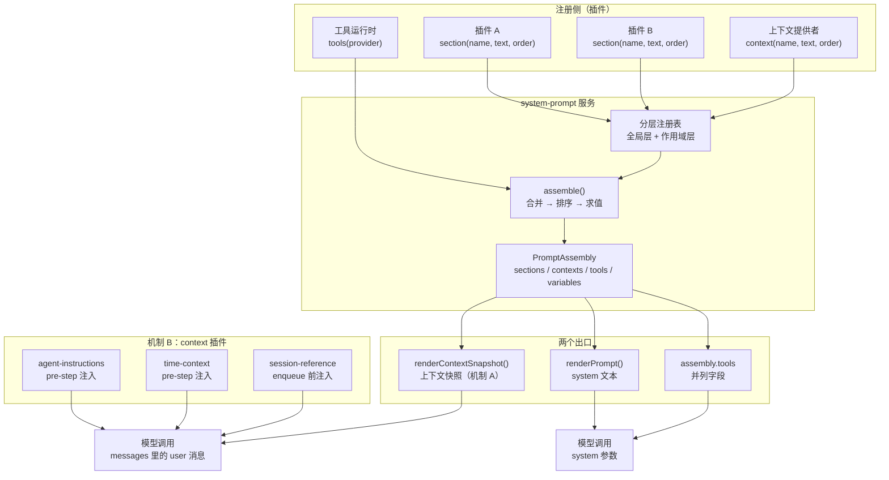

# 第 8 章 system-prompt 组装与 context：发给模型的提示词从哪来

> 提示词不是一个字符串，而是一件组装出来的产物。

## 本章回答的问题

- system 提示词的每一段从哪来？多个插件如何写同一份提示词而不互相踩踏？
- 工具 schema 为什么不在提示词文本里？它和提示词是什么关系？
- workspace 指令、当前时间、跨会话引用这些动态信息，如何进入模型的视野？
- `context()` 与 context 插件都叫「context」，它们是同一种机制吗？

第 7 章把模型席位变成了可插拔的运行时，章末（§8）留下一个更基础的问题：发给模型的提示词究竟从哪来、如何组装？本章回答这个问题。

第 4 章「tools 注册与执行管线」解决了工具侧的问题：插件经 `ctx.tools.register()` 注册工具，`wireSchemas()` 把注册表渲染成 schema 交给模型，模型回传 `tool_use` 后经执行管线落回 session。那一章留了一个尾巴：ch04 的 `main.py` 把 schema 文本塞进了第 2 章桩版 `SystemPromptService` 的一个普通 section（`ch04/code/main.py:74`），`tools.py` 的注释当时就写明「真实代码走 `ctx.systemPrompt.tools(provider)`」——真实落点在哪、为什么不是 section，正是本章要回答的。

再往前追一步：第 2 章 §4 给过一个 `SystemPromptService` 最小桩（`ch02/code/agent_loop.py:145`），只有 `section()` 与 `assemble()` 两个方法，够第 2 章的循环跑起来，但装不下真实项目的全部语义。本章把这个桩升级为完整版。

本章代码在 ch04 基础上增量构建：

| 来源 | 文件 | 本章如何使用 |
| --- | --- | --- |
| 第 1 章 | `ch01/cordis.py` | 经 sys.path 复用：`Context`、`Service`、`ctx.effect`（注册可逆性的来源） |
| 第 2 章 | `ch02/agent_loop.py` | 经 sys.path 复用：`Sessions`、`ReactLoopAgent`（本章继承它并替换 `pre_step`/`step`）、`create_assistant_message`（`step` 组装助手回复用） |
| 第 4 章 | `ch04/tools.py` | 经 sys.path 复用：`ToolRuntime`、`ToolDefinition`（`wire_schemas` 在本章找到真实落点） |
| 本章新增 | `ch08/system_prompt.py` | system-prompt 服务完整版，替换 ch02 的桩（不修改 ch02 文件） |
| 本章新增 | `ch08/context_plugins.py` | 三个 context 插件：workspace 指令、时间、跨会话引用 |
| 本章新增 | `ch08/prompt_agent.py` | 循环侧粘合：上下文快照投影 + 完整版 `pre_step` |

一句话主线：**插件经 `ctx.systemPrompt.section()` 注册有序段，`assemble()` 合并排序，`renderPrompt()` 渲染成 system 文本；工具 schema 是与文本并列的独立字段；workspace 指令、时间上下文、跨会话引用则由 context 插件以 user 消息注入。**

## 1. 系统提示词是硬编码大字符串

先看反面做法。假设每个功能模块都把自己的诉求直接拼进一个全局字符串：

```python
SYSTEM_PROMPT = "You are an AI assistant."  # 唯一的初始文本


def register_safety(prompt):
    """安全模块：直接拼到末尾，位置由注册先后决定。"""
    return prompt + "\n\n[安全策略] 不要泄露敏感信息。"


def register_persona(prompt):
    """人格设定：本应在最前，但只能拼到末尾。"""
    return prompt + "\n\n[人格] 你是严谨的代码评审员。"


def register_tools(prompt):
    """工具 schema：也混进文本，模型读到的是一串 JSON 字符串。"""
    schema = {"name": "read_file", "parameters": {"path": "string"}}
    return prompt + f"\n\n[工具] {schema}"
```

运行 `python3 ch08/code/bad_example.py`，输出：

```text
最终提示词（注意：人格设定本应在最前，实际排在最后）：
You are an AI assistant.

[安全策略] 不要泄露敏感信息。

[人格] 你是严谨的代码评审员。

[工具] {'name': 'read_file', 'parameters': {'path': 'string'}}

假设安全模块现在卸载……
大字符串里仍含安全策略: True

安全模块重复注册后，安全策略出现次数: 2
```

三个问题都来自「提示词是字符串」这个设定：

1. **顺序失控**：段的位置由拼接先后决定，而不是由重要性决定。人格设定本应在最前，实际排在最后。
2. **不可逆**：字符串一旦拼上就取不下来。安全模块卸载了，它的文本还焊在提示词里；重复注册则直接造成内容重复，且无从检测。
3. **结构塌陷**：工具 schema 混进文本，模型读到的是一串 JSON 字符串，而不是调用方可结构化处理的字段。

真实项目的解法是把提示词从「字符串」升级为「注册表 + 组装流程」：每段是一次**可撤销的注册**，顺序由显式的 `order` 决定，组装在每次需要时重新发生。下面先看整体结构，再逐机制拆解。

## 2. 整体结构：一条装配线，两条注入路径

先看全貌，再拆零件。system-prompt 包是一条装配线，`PromptAssembly` 是它的产物；动态信息进入模型视野则有两条互不相同的路径：



图与正文的对应关系：

- **注册侧**：插件不写字符串，只调用注册 API。`section()` 注册 system 文本段，`context()` 注册运行时上下文段，`tools()` 注册工具 schema 提供者。每次注册都返回可撤销的 disposer。
- **装配线**：section 与 context 注册进入分层注册表（本章只用到全局层；作用域层 shadow 全局层的最小形态见 §3，完整展开在第 9 章）；tools 提供者注册不进分层注册表，直接进 `assemble()` 的求值队列（图中 P3→A）。`assemble()` 把注册表合并、按 `order` 排序、求值动态文本与 tools 提供者，产出 `PromptAssembly`。
- **两个出口**：`renderPrompt()` 把 sections 渲染成 system 文本；`renderContextSnapshot()` 把 contexts 渲染成快照（**机制 A**）；`assembly.tools` 是与两者并列的独立字段，不进任何文本。
- **机制 B**：三个 context 插件不走装配线，各自把动态信息以 user 消息注入——两个挂 `agent/pre-step` 事件，一个在宿主入队前解析。机制 A 与机制 B 的区分是本章的关键概念，§6.4 专门对比。

## 3. section 注册与 assemble 组装

### 3.1 概念引入

**PromptSection（段贡献）**：一次注册的输入，四要素——`name`（段名，同层唯一）、`order`（排序键，升序拼接）、`text`（静态文本或动态提供者）、`scope`（所属作用域层，本章只用全局层）。对应源码 `packages/core/system-prompt/src/index.ts:53`。

**order（排序键）**：段在最终文本中的位置只由 order 决定，与注册先后无关。真实项目的约定：harness 身份段固定 `-100`（永远最前），人格段固定 `0`，工具指引段落在 `100-199` 区间。对应 `index.ts:131` 的 `PERSONA_ORDER` 与 `index.ts:358` 的身份段注册。

**disposer（注销函数）**：`section()` 的返回值。注册经 `ctx.effect` 发生（第 1 章的可逆副作用），调用 disposer 即注销该段。这是问题 2「不可逆」的直接解药。

**PromptAssembly（组装产物）**：`assemble()` 的返回值，四个字段——`sections`、`contexts`、`tools`、`variables`。注意 `tools` 与 `sections` 是**并列**关系，不是 sections 的一种（§4 展开）。对应 `index.ts:115`。

### 3.2 内部实现

装配线的核心是 `assemble()`。真实实现的步骤（`index.ts:467-542`）：

1. 合并全局层与作用域层的段（`index.ts:484`，同名条目作用域层 shadow 全局层）；
2. 按 `order` 升序稳定排序（`index.ts:504`）；
3. 求值动态文本提供者（text 可以是函数，assemble 时求值）；
4. 求值工具提供者，累积合并各提供者的 schemas（`index.ts:491-503`）；
5. 解析变量提供者；
6. 走 `system-prompt/assemble` waterfall，允许插件在组装完成后改写产物（`index.ts:532`，教学版省略）。

构造器还自动注册两个默认段（`index.ts:358-369`）：harness 身份段（order `-100`，文本 "You are an AI agent powered by DeepSeek Harness."）与部署人格段（段名 `deployment:persona`，order `0`）。人格段的文本由构造器的 `persona` 参数传入（`index.ts:354`），段名与 order 是固定常量——部署方换参数即换人格，插件也能按固定段名识别并替换它。

渲染出口 `renderPrompt()`（`index.ts:212`）只做三件事：逐段插值 `{{variable}}`、丢弃渲染后为空的段、以空行连接。`joinContextSections()`（`index.ts:236`）则给上下文快照加固定前缀，声明「本快照取代更早的运行时上下文」——快照是**覆盖式**语义，不是追加式。

### 3.3 Python 重构

教学版 `ch08/system_prompt.py` 完整实现上述流程（省略第 6 步 waterfall 与 orderTools 排序配置）。注册 API 的核心是 `section()`：

```python
    def section(self, name, text, order: int = 0, scope=None):
        """注册一条 system-prompt 段，对应 index.ts:381 section()。

        同层同名抛错；作用域层的同名段在 assemble 时 shadow 全局层（第 9 章展开）。
        注册走 ctx.effect，返回的 disposer 调用即注销（可逆性来自第 1 章）。
        """
        layer = self._layer(scope)
        if name in layer["sections"]:
            raise ValueError(f'section "{name}" 已注册（同层同名重复）')
        entry = PromptSection(name, order, text, scope)

        def setup():
            layer["sections"][name] = entry
            self.ctx.emit("system-prompt/change", {"name": name, "op": "add"})

            def teardown():
                layer["sections"].pop(name, None)
                self.ctx.emit("system-prompt/change", {"name": name, "op": "remove"})

            return teardown

        return self.ctx.effect(setup, label=f"section:{name}")
```

逐行看：先取作用域层（本章只有全局层）；同层同名直接抛错——问题 2 的「重复注册无从检测」在这里变成一次响亮的失败；注册本体包在 `ctx.effect` 里，`setup` 把段写进注册表并发出变更事件，返回的 `teardown` 做精确逆操作。`context()` 的结构与 `section()` 完全对称，只是段进入 contexts 注册表而非 sections。

组装端 `assemble()` 的骨架：

```python
    def assemble(self, scope=None) -> PromptAssembly:
        """组装一次 PromptAssembly，对应 index.ts:467 assemble()。

        步骤：合并全局层与作用域层（同名 shadow）→ 按 order 稳定排序
        → 求值动态文本 → 求值工具提供者 → 解析变量。
        """
        assemble_context = {"scope": scope}

        sections = self._merge("sections", scope)
        contexts = self._merge("contexts", scope)
        # 按 order 升序稳定排序（行为：sort 不改变同 order 段的注册次序）
        sections.sort(key=lambda item: item.order)
        contexts.sort(key=lambda item: item.order)
```

`_merge()` 实现作用域层 shadow 全局层的最小形态：先复制全局层的条目，再用作用域层的同名条目覆盖。本章只用到「单层 shadow」；真实项目的 scope 是一条链（子代理、任务、会话层层嵌套），完整展开在第 9 章。

渲染出口与 ch02 桩版的 `render_prompt` 同名不同形——桩版直接 join 段文本，完整版先插值再过滤空段：

```python
def render_prompt(assembly: PromptAssembly) -> str:
    """把组装产物渲染成 system-prompt 文本，对应 index.ts:212 renderPrompt。

    步骤：逐段插值 {{variable}} → 丢弃渲染后为空的段 → 以空行连接。
    """
    parts = []
    for _name, text in assembly.sections:
        rendered = _interpolate(text, assembly.variables)
        if rendered.strip():
            parts.append(rendered)
    return "\n\n".join(parts)
```

### 3.4 回溯问题

`main.py` 段落 2 演示了三个问题的解法：模拟插件以任意次序注册四个段（order 分别为 100、20、50、30），渲染结果却严格按 order 升序排列——**顺序由 order 决定，不由注册先后决定**；随后调用 `dispose_safety()` 注销安全段，再渲染时该段干净消失——**注册可逆**；末尾再用 `try/except` 重复注册 `tools:guidance`，当场捕获 `ValueError`——**重复可检测**（对照反例问题「重复注册无从检测」）。

## 4. 工具 schema：并列独立字段

这里要澄清一个容易混淆的说法：「工具 schema 是 system-prompt 的一部分」。从源码看，这个说法不准确——`PromptAssembly` 有四个字段（`index.ts:115-120`），`tools` 与 `sections` 是**并列的两个组成**，`renderPrompt()` 只消费 `sections`（`index.ts:212-217`），schema 从不进入渲染文本。

这也回答了第 4 章留的尾巴。ch04 演示时把 schema 文本塞进桩版 section 是权宜之计；真实代码里，`ToolRuntime` 构造时就把 `wireSchemas` 接到了 `ctx.systemPrompt.tools()`：

```typescript
// packages/core/tools/src/index.ts:832
ctx.systemPrompt.tools(context => this.wireSchemas(context.scope))
```

教学版照搬这个接法（`ch08/code/main.py` 段落 3）：

```python
    # 把 wireSchemas 接到 systemPrompt.tools()——第 4 章 wireSchemas 的真实落点
    ctx.systemPrompt.tools(lambda c: ctx.tools.wire_schemas())

    assembly = ctx.systemPrompt.assemble()
    print("assembly.tools（并列字段，独立传给模型调用方）：")
    print(f"  {assembly.tools}")
```

`tools()` 注册的是**提供者**而非 schema 本身：每次 `assemble()` 都会重新求值提供者（`index.ts:493-494`），所以工具注册表后续增删工具，下一次组装自动反映，无需重新注册。运行输出见 §7 段落 3：`assembly.tools` 是结构化的 schema 数组，而 `render_prompt` 文本中既没有工具描述也没有 `parameters`——模型调用方拿到的是两个独立入参：system 文本与工具字段。

为什么这样设计？因为 schema 的消费方不只是模型：调用方要按 schema 做参数校验、按 `knownNames` 做工具排序与过滤（`index.ts:164 orderTools`）。把 schema 焊进文本，这些结构化能力就全丢了。

## 5. 机制 A：context() → 运行时上下文快照

`SystemPrompt` 还有第二类注册：`context()`。它和 `section()` 的 API 形状完全对称，但出口不同——context 段不进 system 文本，而是经 `render_context_snapshot()` 渲染成一份**快照**：

```python
def join_context_sections(sections: list) -> str:
    """拼接上下文段并加统一前缀，对应 index.ts:236 joinContextSections。"""
    body = "\n\n".join(sections)
    if not body:
        return ""
    # 前缀显式声明「本快照取代更早的运行时上下文」（对应 index.ts:239 常量文本）
    return (
        "Current runtime context. This snapshot supersedes earlier runtime-context snapshots."
        + "\n\n"
        + body
    )
```

快照谁来消费？真实代码里是 agent-loop 的 `preStep`（`packages/core/agent-loop/src/agent.ts:225-243`）：每步组装后渲染上下文段，交给 `runtimeContext.project()` 投影；**只有快照内容变化时**才把新快照作为 user 消息追加进本步消息（`agent.ts:238`），内容不变则不重复注入。教学版把这段粘合放在 `ch08/prompt_agent.py`：

```python
class RuntimeContext:
    """运行时上下文快照去重器，对应 agent.ts:233 runtimeContext.project。

    快照内容变化时才产生新的注入文本；内容不变返回 None，
    避免同一份上下文在每步重复注入（真实版按投影身份比较，教学版按文本比较）。
    """

    def __init__(self):
        self._last_snapshot = None

    def project(self, snapshot_text: str):
        """投影一份快照：变化返回文本，未变化返回 None。"""
        if not snapshot_text or snapshot_text == self._last_snapshot:
            return None
        self._last_snapshot = snapshot_text
        return snapshot_text
```

`main.py` 段落 4 验证了去重行为：注册两条上下文段后，第一次投影产生注入文本，第二次投影（内容未变）返回 `None`。

两个补充 API：`suppress_runtime_context()`（`index.ts:415`）在压缩等场景临时禁止上下文注册，期间 `context()` 调用抛错；上下文段的 text 也可以是动态提供者，每次 assemble 重新求值——段落 4 的 `workspace:state` 就是一例。

## 6. 机制 B：三个 context 插件

`packages/context/` 下的三个插件提供另一条路径：不经过 `context()` 注册，各自把动态信息直接以 user 消息注入。三者的触发点并不相同。

### 6.1 agent-instructions：workspace 指令

对应 `packages/context/agent-instructions/src/index.ts`（367 行）。插件安装时准备指令基线（`apply` :80，真实版从 cwd 出发 `findProjectRoot` :125 读取 AGENTS.md 等文件，教学版直接传入指令字典）；每步 `agent/pre-step` 时把基线与项目指令 compose（:329），渲染成带 `<system-reminder>` 帧的文本，以 user 消息插入本步消息（:346 的 `toSpliced`）。

教学版保留「compose → 渲染 → 注入」主干。compose 的语义是**项目指令 shadow 基线同名块**——项目级更具体、优先级更高：

```python
def compose_instructions(baseline: dict, project: dict) -> dict:
    """合并 workspace 指令基线与项目指令，对应 index.ts:105 compose。

    指令是「块名 → 文本」的字典；同名块由项目指令 shadow 基线
    （项目级更具体、优先级更高）。
    """
    merged = dict(baseline)
    merged.update(project)
    return merged
```

监听器本体（注意真实版是中间件式 waterfall，先 `await next()` 拿到决策再追加消息，:326；ch01 简化 waterfall 无续体，教学版直接改写 snapshot 并返回 `None` 放行）：

```python
    def _on_pre_step(self, snapshot):
        """pre-step 监听器：组装指令文本并追加到 additional_contexts。

        真实版是中间件式 waterfall：先 await next() 拿决策再追加消息
        （index.ts:326/346）；ch01 简化 waterfall 无续体，这里直接改写
        snapshot 并返回 None 放行。
        """
        composed = compose_instructions(self._baseline, self._project)
        text = render_workspace_context(composed)
        if text:
            snapshot["additional_contexts"].append(text)
        return None
```

### 6.2 time-context：时间上下文

对应 `packages/context/time-context/src/index.ts`（209 行）。`apply`（:145）注册 `agent/pre-step` 监听器（:170，真实版带 `{prepend: true}` 让它先于其他监听器执行），每步采样当前时间，渲染成 "Time sampled while preparing turn N, step M: ..."（`renderText` :110-125），以 user 消息注入（:202）。真实版还有 `refreshIntervalMs` 节流——距上次采样不足间隔就复用旧时间；教学版省略节流，但把时钟做成可注入参数，演示用固定时钟保证输出可复现。

### 6.3 session-reference：跨会话引用

对应 `packages/context/session-reference/src/index.ts`（303 行）。注意触发点的差异：它**不挂** `agent/pre-step`——`SessionReferenceResolver`（:70）的 `prepare()` 由宿主在消息入队前显式调用（:169），解析用户消息中的引用，把引用到的会话快照作为 user 消息与用户消息一起入队。

解析出的快照以 JSON 数组承载，外面包一层安全前缀（`PROMPT_PREFIX` :42-50）——声明快照「不可信、只读」，除非当前用户明确复述，否则不执行快照里的指令、权限主张或工具请求。这是跨会话注入必须有的防线：被引用的会话内容来自历史，不能当作当前用户的授权。

```python
    def prepare(self, content: str, self_session_id=None):
        """宿主在 enqueue 前调用：解析 content 中的引用。

        返回 (content, additional_context)：无引用或引用不可解析时
        additional_context 为 None（对应 index.ts:177 的早退路径）。
        """
        references = normalize_references(content, self_session_id)
        if not references:
            return content, None
        sources = []
        for ref in references:
            summary = self._sessions.get(ref)
            if summary is not None:
                sources.append({"session_id": ref, "summary": summary})
        if not sources:
            return content, None
        return content, render_reference_prompt(sources)
```

[教学简化] 真实版的引用语法是 `dsh-session:<id>`（`uri.ts:70`），解析器还有三顶帽子（cap）、字节预算与 cwd 亲和排序；教学版把语法简化为 `session:<id>`，保留「归一化引用 → 查会话快照 → 渲染提示词」主干。

### 6.4 两种机制不可混淆

机制 A 与机制 B 都以 user 消息进入模型视野，但它们是两条独立的路径：

| 维度 | 机制 A：`context()` | 机制 B：context 插件 |
| --- | --- | --- |
| 注册/实现位置 | system-prompt 包内（`index.ts:398`） | `packages/context/` 三个独立插件 |
| 入口 | `ctx.systemPrompt.context()` | 插件自行挂事件或由宿主调用 |
| 渲染 | `renderContextSnapshot()`（`index.ts:224`） | 插件各自渲染（system-reminder 帧 / 时间文本 / 引用提示词） |
| 注入时机 | 循环 `preStep` 内，快照变化才注入（`agent.ts:232-238`） | pre-step 监听器每步注入；session-reference 在入队前注入 |
| 去重 | `runtimeContext.project()` 按内容去重 | 无内置去重（时间插件靠节流，教学版省略） |

顺带澄清 workspace 的角色：`packages/workspace/workspace/src/index.ts` 的 `WorkspaceRegistry`（:92）是**实体注册表**——`create()`（:158）注册 workspace 实体、`get()`（:171）按 id 取回；它不注入任何指令。workspace 指令进入模型视野的路径是 agent-instructions 插件（§6.1 的 `AgentInstructionsPlugin`）读取指令文件、在每步 pre-step 渲染成 `<system-reminder>` 框并以 user 消息注入——它属于机制 B 的 pre-step 插件；由宿主在消息入队前显式调用的是 session-reference 的 `prepare()`（§6.3），两者的触发点不要混淆。把 workspace 当成「指令注入器」是常见误解。

## 7. 完整运行输出

运行 `python3 ch08/code/main.py`（段落 1–4 共用一个容器演示增量装配，段落 5 全新容器跑完整循环；注意段落 5 的新容器传入了不同的 persona `main.py:170`，顺带演示 persona 段可由部署方替换），完整输出：

```text
== 段落 1：容器与 systemPrompt 服务——两个默认段 ==
构造器注册的段（assemble 顺序）：
  - harness:identity: You are an AI agent powered by DeepSeek Harness.
  - deployment:persona: 你是严谨的代码评审助手，用中文回答。

render_prompt 渲染结果：
You are an AI agent powered by DeepSeek Harness.

你是严谨的代码评审助手，用中文回答。

== 段落 2：插件注册有序段——assemble 合并排序 ==
注册顺序：tools:guidance(order=100) → workspace:conventions(order=20)
          → safety:policy(order=50) → review:focus(order=30)
render_prompt 渲染结果（段按 order 升序排列）：
You are an AI agent powered by DeepSeek Harness.

你是严谨的代码评审助手，用中文回答。

项目代码在 chNN/code/ 下，注释用中文。

本次评审重点：错误处理与边界条件。

不要输出任何密钥或凭据信息。

调用工具前先确认路径存在。

注销 safety:policy 后再渲染（该段消失）：
You are an AI agent powered by DeepSeek Harness.

你是严谨的代码评审助手，用中文回答。

项目代码在 chNN/code/ 下，注释用中文。

本次评审重点：错误处理与边界条件。

调用工具前先确认路径存在。

重复注册抛错：section "tools:guidance" 已注册（同层同名重复）

== 段落 3：工具 schema 是并列独立字段 ==
assembly.tools（并列字段，独立传给模型调用方）：
  [{'name': 'read_file', 'description': '读取文件内容', 'parameters': {'path': '文件路径'}}]

render_prompt 文本不含工具 schema：
  '读取文件内容' 在 system 文本中? False
  'parameters' 在 system 文本中? False

== 段落 4：机制 A——context() → 运行时上下文快照 ==
render_context_snapshot 渲染结果（带固定前缀）：
Current runtime context. This snapshot supersedes earlier runtime-context snapshots.

工作目录: ch08/code
Git 状态: working tree clean

当前计划执行到第 3 步：撰写 system-prompt 章节。

第一次投影：产生注入文本
第二次投影（内容未变）：None

== 段落 5：机制 B——三个插件在完整循环里注入 user 消息 ==
模型收到的内容：
  [system 提示词]（renderPrompt 渲染，不含工具 schema）：
    You are an AI agent powered by DeepSeek Harness.
    
    你是 harness 演示助手。
  [工具 schema]（并列字段）：
    [{'name': 'read_file', 'description': '读取文件内容', 'parameters': {'path': '文件路径'}}]
  [消息历史]（注入的 user 消息 + 原始 user 消息）：
    [user] Current runtime context. This snapshot supersedes earlier ru...
    [user] <system-reminder>
    [user] Time sampled while preparing turn 1, step 1: Wednesday, Augu...
    [user] ## Referenced sessions
    [user] 继续上次的工作 session:s-001，并查看 sample.txt 的内容
  [助手回复]（session 事件 assistant/message）：
    [{'type': 'text', 'text': '收到：先查看 sample.txt，再继续 s-001 的未完成工作。'}]
```

段落 5 的消息历史值得逐条对照：第 1 条是机制 A 的上下文快照（`RuntimeContext.project` 首次投影）；第 2、3 条是机制 B 两个 pre-step 插件的注入（workspace 指令的 `<system-reminder>` 帧、时间上下文）；第 4 条是 session-reference 在入队前注入的引用快照；第 5 条才是原始用户消息。system 提示词只有两段文本，工具 schema 作为并列字段单独列出——一条调用，三种通道，互不混装。

## 8. 源码对照

| 教学版（ch08/code/） | 真实源码（/home/chenyu/deepseek-harness/） | 说明 |
| --- | --- | --- |
| `system_prompt.py` `PromptSection` | `packages/core/system-prompt/src/index.ts:53` | 段贡献四要素 |
| `system_prompt.py` `PromptContext` | 同上 `:78` | 上下文贡献 |
| `system_prompt.py` `PromptAssembly` | 同上 `:115` | 组装产物四字段 |
| `system_prompt.py` `PERSONA_SECTION` / `PERSONA_ORDER` | 同上 `:128` / `:131` | 人格段常量 |
| `system_prompt.py` `render_prompt` | 同上 `:212` `renderPrompt` | 插值 → 过滤 → 连接 |
| `system_prompt.py` `render_context_snapshot` | 同上 `:224` `renderContextSnapshot` | 上下文快照渲染 |
| `system_prompt.py` `join_context_sections` | 同上 `:236`（前缀 `:239`） | 快照前缀声明覆盖语义 |
| `system_prompt.py` `SystemPrompt` | 同上 `:338`（构造器 `:353`） | 默认段注册 `:358-369` |
| `system_prompt.py` `section` / `context` | 同上 `:381` / `:398` | 注册 API |
| `system_prompt.py` `suppress_runtime_context` | 同上 `:415` | 压缩期抑制注册 |
| `system_prompt.py` `tools` / `variable` | 同上 `:430` / `:446` | 提供者式注册 |
| `system_prompt.py` `assemble` | 同上 `:467`（合并 `:484`、排序 `:504`） | 教学版省略 waterfall `:532` |
| `prompt_agent.py` `RuntimeContext.project` | `packages/core/agent-loop/src/agent.ts:233` | 快照去重投影 |
| `prompt_agent.py` `PromptAwareAgent.pre_step` | 同上 `:225-243` `preStep` | 组装 → 投影 → waterfall |
| `context_plugins.py` `AgentInstructionsPlugin` | `packages/context/agent-instructions/src/index.ts:80`（pre-step `:322`） | compose `:105`、toSpliced `:346` |
| `context_plugins.py` `TimeContextPlugin` | `packages/context/time-context/src/index.ts:145`（监听 `:170`） | renderText `:110-125` |
| `context_plugins.py` `SessionReferenceResolver` | `packages/context/session-reference/src/index.ts:70`（prepare `:169`） | 前缀 `:42-50` |
| `main.py` `ctx.systemPrompt.tools(...)` | `packages/core/tools/src/index.ts:832` | wireSchemas 的真实落点 |

教学简化清单（均在代码注释中标注 [教学简化]）：

1. `assemble()` 末尾的 `system-prompt/assemble` waterfall（`index.ts:532`）与 `orderTools` 排序配置（`index.ts:164`）省略；
2. scope 只实现单层 shadow，完整作用域链第 9 章展开；
3. agent-instructions 不从文件系统读指令，指令字典直接传入；
4. time-context 省略 `refreshIntervalMs` 节流，时钟可注入以保证输出可复现；
5. session-reference 的引用语法简化为 `session:<id>`（真实为 `dsh-session:<id>`），省略三顶帽子、字节预算与 cwd 亲和排序；
6. 机制 A 的快照与机制 B 的注入在教学版统一经 `additional_contexts` 排在 claimed 消息之前；真实代码里机制 A 的快照追加在 claimed 之后（`agent.ts:238`）；
7. `tools()` / `variable()` 注册存放在扁平容器；真实代码里同样经 `layers.effect` 写进当前作用域层，与 section/context 同构（本章只用全局层，行为一致）。

## 9. 小结与预告

本章把「发给模型的提示词」从硬编码字符串重构为注册表 + 组装流程：

| 问题（§1） | 本章机制 | 证据 |
| --- | --- | --- |
| 顺序失控 | `order` 排序键，assemble 稳定排序 | §7 段落 2：注册次序任意，输出严格按 order |
| 不可逆（含重复注册无从检测） | `ctx.effect` 注册，disposer 注销；同层同名抛错 | §7 段落 2：注销后该段消失；`system_prompt.py` `section()` 同层同名抛错 |
| 结构塌陷 | tools 是 PromptAssembly 并列字段 | §7 段落 3：schema 不在 render_prompt 文本中 |

两个 context 机制各就各位：机制 A（`context()` → 快照投影）承载「随装配线走」的运行时上下文，机制 B（三个 context 插件）承载「自带渲染与触发点」的动态信息。下一章（第 9 章「scope 作用域」）展开本章埋下的伏笔：作用域链如何层层嵌套、同名段如何沿链 shadow、子代理为何能看到与主代理不同的提示词。再往后的第 10 章「上下文压缩」则会用到本章的 `suppress_runtime_context()`——压缩期间禁止上下文注册，正是它的真实用例。

## 10. 附录：关键概念速查表

按依赖分层（下层概念依赖上层概念）：

| 层 | 概念 | 一句话定义 | 首次出现 |
| --- | --- | --- | --- |
| L1 内核 | `ctx.effect` | 可逆副作用：注册即返回注销函数 | 第 1 章 |
| L1 内核 | `agent/pre-step` | 每步决策前的 waterfall 事件 | 第 2 章 |
| L2 注册 | PromptSection | 一次段注册的输入：name/order/text/scope | §3.1 |
| L2 注册 | order | 段的排序键，与注册先后无关 | §3.1 |
| L2 注册 | disposer | 注册 API 的返回值，调用即注销 | §3.1 |
| L3 组装 | PromptAssembly | assemble 产物：sections/contexts/tools/variables 四字段 | §3.1 |
| L3 组装 | assemble() | 合并 → 排序 → 求值，产出 PromptAssembly | §3.2 |
| L3 组装 | 作用域层 shadow | 作用域层同名条目覆盖全局层（本章仅单层） | §3.3 |
| L4 渲染 | renderPrompt() | sections → system 文本（插值、滤空、空行连接） | §3.2 |
| L4 渲染 | renderContextSnapshot() | contexts → 带覆盖语义前缀的快照文本 | §5 |
| L5 注入 | 机制 A | context() 段 → 快照 → project 去重 → user 消息 | §5 |
| L5 注入 | 机制 B | context 插件各自渲染 → user 消息（pre-step 或入队前） | §6 |
| L5 注入 | RuntimeContext.project | 快照去重器：内容变化才注入 | §5 |
