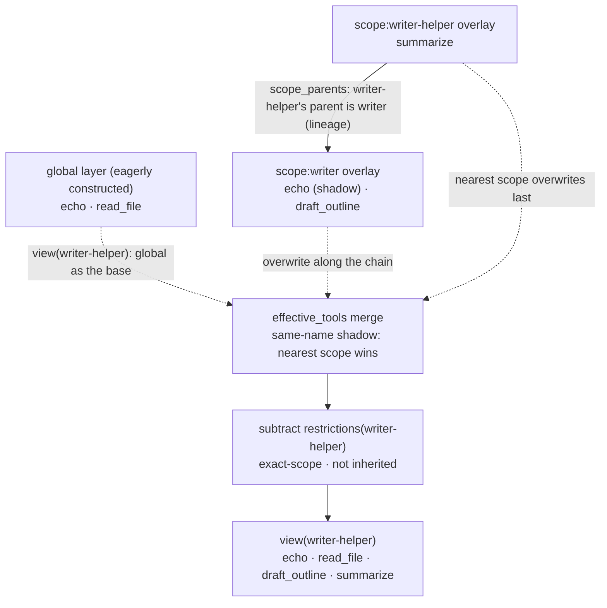

# Chapter 9: scope Scoped Registration: How Multiple Agents in the Same Process Isolate Their Own Capabilities

> Under the same roof, each has its own room.

## Questions this chapter answers

1. When multiple agents coexist in the same process, how do you prevent the tools they register from polluting each other? What is a "scope", and what does it mean to register a tool under a particular agent's name? (Such registration is likewise reversible)
2. If tools with the same name are registered globally and in a scope, which one does the agent ultimately use? (shadowing)
3. Why can a subagent see the tools registered by its parent agent? (the lineage scope chain)
4. How do you hide a tool from only one agent without affecting other agents? (restriction)

At the end of Chapter 8, some foreshadowing was left: how the scope chain nests layer by layer, how same-name content shadows along the chain, and why subagents can see things different from the main agent. The complete form of this mechanism lives in the `packages/core/scope` package; and its most concrete consumer is precisely Chapter 4's tool registry. This chapter returns to Chapter 4 and lands the general-purpose scope mechanism onto tools. First split the foreshadowing in two: "how the scope chain works" is the mechanism itself, and this chapter explains it thoroughly using tools; "why subagents see different prompts" is its application in the system-prompt domain — the real project's system-prompt registry uses the same `ScopedLayers`, and Chapter 8's `_merge` "single-layer shadow" is precisely its minimal form. At the end of §5, these two halves will be joined.

Recall Chapter 4: `ToolRuntime` maintains only a **single global `ToolLayer`** — all tools go into the same table, with no boundary on who registers and who can see. `ToolLayer`'s docstring already left a note for this upgrade at the time: "the real version is ScopedLayers' global layer + agent scope layer (scope shadows global)". This chapter lands this reserved note.

This chapter's code incrementally reuses the achievements of the previous two blocks:

| Dependency | Source | Usage in this chapter |
| --- | --- | --- |
| `Context` / `Service` / `effect` | `ch01/code/cordis.py` | Container assembly, registration-as-effect, disposer |
| `ToolDefinition` / `ToolExecution` / `ToolResult` / `ToolLayer` / `ToolRuntime` | `ch04/code/tools.py` | Tool definitions, execution requests and results, layer structure, execution pipeline |
| `ScopedLayers` / `ScopedToolRuntime` | `ch09/code/scope.py` (newly added in this chapter) | Scope layering and scope-aware runtime |

## 1. One Global Table, Multiple Agents Stepping on Each Other

First look at what it looks like without scopes. The following code simulates Chapter 4's tool table with one global dict, shared by three agents (main / writer / research):

```python
# ch09/code/bad_example.py (module-level global variables and functions)
GLOBAL_TOOLS = {}  # the only global tool table: no scope, no shadow, no restrict


def register(name, fn):
    """Register a tool: once registered, visible to all agents."""
    GLOBAL_TOOLS[name] = fn


def view():
    """Every agent sees the same table."""
    return dict(GLOBAL_TOOLS)


def main():
    # The main agent registers a generic echo
    register("echo", lambda args: f"[global] {args['text']}")
    print("After main registers echo, writer also sees it:", sorted(view()))

    # writer wants an echo with a writing tone, but can only overwrite the global one — main's echo disappears along with it
    register("echo", lambda args: f"[writer] {args['text']}")
    print("After writer overwrites echo, what gets executed is:", view()["echo"]({"text": "hi"}))

    # research wants to disable echo, but can only delete globally — writer's echo disappears along with it
    del GLOBAL_TOOLS["echo"]
    print("After research deletes echo globally:", sorted(view()))
    print("Conclusion: with one global table, there's no way for each agent to 'have its own tools'")


if __name__ == "__main__":
    main()
```

Run `python3 bad_example.py`:

```text
After main registers echo, writer also sees it: ['echo']
After writer overwrites echo, what gets executed is: [writer] hi
After research deletes echo globally: []
Conclusion: with one global table, there's no way for each agent to 'have its own tools'
```

Break the problems down one by one. The first three are directly exposed by bad_example; the latter two are hidden problems — problem 4 hides in multi-agent collaboration, problem 5 hides in lifecycle management, neither directly exposed by bad_example, but the real project hits them on day one:

1. **Registration without boundaries**: the `echo` registered by main is immediately visible to writer. The tool table is a global singleton; any agent's registration is visible to everyone.
2. **Same name means overwrite**: if writer wants its own `echo`, it can only write to the same key, displacing main's implementation — "I want a different version" and "I want to overwrite your version" get conflated.
3. **Hiding means global deletion**: if research wants to make `echo` unavailable to itself, it can only `del`, and writer's `echo` disappears along with it. There is no means of "hide only from me".
4. **Subagents must re-register parent tools** (hidden): this pain only appears after "wanting per-agent boundaries" — if you keep sharing the global table with everyone, subagents can indeed directly see the parent agent's tools, but that falls back to problem 1; if you want boundaries, you can only re-register a copy of the parent agent's tools for the subagent (which may also diverge from the parent agent's version). The global table has no third path called "inheritance".
5. **Registration is irreversible** (hidden): registration has no paired unregistration; to take back a tool you can only manually `del` the global table (falling back to problem 3 again), unable to achieve "whoever registers, reclaims".

There is only one root cause: **the tool table lacks the dimension of "who it belongs to"**. To solve it, you must add scopes to the registry.

## 2. Overall Structure: Global Layer + One Layer per Agent + One Lineage Chain

The root cause in §1 is "the tool table lacks the dimension of 'who it belongs to'". This section adds it back: first don't write code; set up the terms layer, scope, overlay, lineage and the action "registration" one by one, then look at the overall diagram.

**Step one: from one table to one table per agent — layer.** Chapter 4's `ToolLayer` is precisely one tool table (name → definition); bad_example's flaw is that three agents are crammed into the same table. The fix is direct: keep one shared table globally as the base, and issue one separate table to each agent. These tables are collectively called **layers** — the global one is called the global layer, and the one under each agent's name is its own layer. Layers have nothing new; each is just a `ToolLayer`; what's new is only "from one table to many".

**Step two: which table does registration write into — scope.** Once there are multiple tables, registration must specify "which table to write into". The method is to give each agent a name, pass it in at registration time, and find the corresponding table by name. This name is the **scope** — it is not a new mechanism, just a stand-in for "which agent", a key pointing from an agent to its table. The teaching version uses strings (`"writer"`) as scopes; in the real code, scope is usually the agent object itself (§8 simplification list item 1).

**Step three: your own table is laid over the global table — overlay.** An agent's own table is not used in isolation: when reading, it is **laid over** the global layer — global as the base, your own table stacked on top. So it is also called an **overlay**, emphasizing "stacked together with the global layer, merged when reading", not two unrelated tables.

**Step four: the relationship among the three in one sentence.** **Registration** is the action — writing a tool definition into some layer; **scope** is the name of "which agent", used to locate that layer; **overlay** is precisely that agent's own layer. "Register under writer's name" = take `scope="writer"`, find writer's overlay, and write into it; if no scope is passed, write into the global layer — this is precisely the entire difference between "scoped registration" and Chapter 4's "global registration".

**Step five: a child agent wants to use its parent agent's table — lineage.** A child agent (writer-helper) not only wants to use global tools, but also wants to directly use its parent agent's (writer's) tools. So record one more piece of information, "whose parent is whom"; when reading, the child agent follows this relationship and includes the parent's layer in the merge. This parent-child chain is the **lineage**.

**Now look at the whole picture.** With the concepts in place, land the structure on the example that runs through §3–§7: the global layer registers `echo`, `read_file`; writer registers a same-name `echo` in its own overlay (shadowing the global one) and an exclusive `draft_outline`; writer-helper is writer's child scope and has its own `summarize`. The formation process of `view(writer-helper)` (which tools writer-helper can ultimately see):



Every node in the diagram can now be matched: `GL`/`WL`/`HL` are three **layers** (`WL`, `HL` are the respective agents' **overlays**); the solid arrow `HL → WL` is the **lineage** (recording that writer-helper's parent is writer); the dashed lines from the three layers converging into `MG` are the **read merge** — global as the base, overwriting layer by layer from far to near along the lineage chain, with same-name tools won by the nearest scope (this "same-name overwrite" is called **shadow**, expanded in §4); `FT` then subtracts the tools blacklisted by that agent itself (**restriction**, expanded in §6); `VW` is writer-helper's final tool view.

Against this diagram, this chapter's three paths are clear at a glance:

- **Write path** `register(def, scope)`: write the definition into `scope`'s own overlay layer (write only to itself, don't mix in ancestors; `scope=None` writes to the global layer), and emit a `tools/change` event. Whomever the registration is hung under, it belongs only to them.
- **Lineage** `bind_scope_parent(key, parent)`: record "whose parent is whom", stored in `scope_parents`. When a child scope reads, it includes ancestors' layers as well.
- **Read path** `view(scope)`: first lay down global as the base, then overwrite layer by layer from far to near along the parent chain (same-name shadow, nearest wins), and finally subtract that scope's own restrictions.

`ScopedToolRuntime` is the scope-aware upgrade of Chapter 4's `ToolRuntime`: it holds one `ScopedLayers` (the container for the above "layer + scope + lineage" set; §3 gives its code), making registration / view / definition lookup / execution all scope-aware. Below, break it down one by one in the order "registration → shadow → lineage → restriction".

## 3. Mechanism One: ScopedLayers and per-agent Scoped Registration

**Concept introduction**. A scope is precisely one registration boundary: one per agent, registration hung under its own name. `ScopedLayers` expresses this with three things — one eagerly constructed global layer, one "scope → overlay" table, and one lineage table recording parent-child relationships:

```python
class ScopedLayers:
    # ... for_scope see below in this section; effective_tools see §4; the three lineage methods see §5; is_restricted see §6 ...

    def __init__(self, create_layer):
        self.create_layer = create_layer      # layer factory (tools passes ToolLayer)
        self.global_layer = create_layer()     # global layer (store.ts:161)
        self.scoped = {}                       # scope -> exact-scope overlay (store.ts:163)
        self.scope_parents = {}                # scope -> parent scope (lineage, index.ts:39)
        self.restrictions = {}                 # scope -> set(names); exact-scope, not inherited
```

Note that `create_layer` is a factory: `ScopedLayers` itself doesn't care what's inside a layer; tools passes `ToolLayer`, and other seams can pass their own layer types. This is precisely the division of labor of "general-purpose scope mechanism + concrete consumer".

**Layer retrieval is chain-blind**. The overlay retrieved at write time looks only at the exact scope and doesn't mix in ancestors — this guarantees "registration belongs only to yourself":

```python
class ScopedLayers:
    # ... __init__ see above in this section; effective_tools see §4; the three lineage methods see §5; is_restricted see §6 ...

    def for_scope(self, scope):
        """Get the exact-scope overlay: None returns the global layer; otherwise returns (creating if necessary) that scope's layer.

        Corresponds to store.ts:180 peek (deliberately chain-blind, does not inherit ancestors) + first-time creation.
        """
        if scope is None:
            return self.global_layer
        if scope not in self.scoped:
            self.scoped[scope] = self.create_layer()
        return self.scoped[scope]
```

**Registration is an effect**. `ScopedToolRuntime.register` writes the definition into the corresponding overlay, simultaneously emits a `tools/change` event, and returns a disposer via Chapter 1's `ctx.effect` — registration itself is a reversible effect:

```python
class ScopedToolRuntime:
    # ... __init__ see below in this section; view / get / defined_in / execute / _dispatch_body see §4; restrict see §6 ...

    def register(self, definition, scope=None):
        """Register a tool into the specified scope and return a disposer (registration is reversible, Chapter 1's ctx.effect).

        Corresponds to store.ts:226 effect: scope=None writes to the global layer; otherwise writes to that scope's exact overlay.
        Registration is an effect: write into the tools table + emit a tools/change event.
        """
        layer = self._layers.for_scope(scope)

        def setup():
            layer.tools[definition.name] = definition
            self.ctx.emit("tools/change",
                          {"name": definition.name, "scope": scope, "op": "add"})

            def teardown():
                layer.tools.pop(definition.name, None)
                self.ctx.emit("tools/change",
                              {"name": definition.name, "scope": scope, "op": "remove"})

            return teardown

        return self.ctx.effect(setup, label=f"tool:{scope or 'global'}:{definition.name}")
```

When `ScopedToolRuntime` is constructed, it directly reuses the global layer as the parent class's `_layer`, so registrations and executions "without passing scope" are completely identical to Chapter 4; scopes are purely incremental:

```python
class ScopedToolRuntime:
    # ... register see above in this section; view / get / defined_in / execute / _dispatch_body see §4; restrict see §6 ...

    def __init__(self, ctx, config=None):
        super().__init__(ctx, config)
        # Replace the "single global layer" perspective with ScopedLayers; the global layer directly reuses the parent class's _layer,
        # making "no scope passed" registration / execution behavior completely identical to ch04.
        self._layers = ScopedLayers(create_layer=ToolLayer)
        self._layers.global_layer = self._layer
```

**Problem retrospective**: problem 1 (registration without boundaries) thus disappears — writer's registration is written into `scoped["writer"]`, main's registration is written into the global layer, the two physically isolated, neither polluting the other. Problem 5 (registration irreversible) is also solved along the way: registration happens via `ctx.effect`, and the returned disposer is the paired unregistration switch (verified in §7 line 6).

## 4. Mechanism Two: shadowing and the Read Path

**Concept introduction**. Isolation is not the goal; "both sharing and having your own version" is. shadowing gives the answer: global layer as the base, scope layer stacked on top, **for same-name tools the nearest scope wins**. The merge logic is precisely "lay down global first, then overwrite along the chain":

```python
class ScopedLayers:
    # ... __init__ / for_scope see §3; chain_layers see §5; is_restricted see §6 ...

    def effective_tools(self, scope):
        """Effective tool set: global as the base + overwrite along the parent chain; same name won by the nearest scope (shadowing).

        Corresponds to store.ts:208 merge.
        """
        merged = dict(self.global_layer.tools)
        if scope is not None:
            for layer in self.chain_layers(scope):
                merged.update(layer.tools)  # same-name overwrite: nearest scope wins
        return merged
```

On top of the merge result, `view` further subtracts that scope's restrictions (restriction see §6), yielding the tool list actually visible to some agent:

```python
class ScopedToolRuntime:
    # ... __init__ / register see §3; get / defined_in / execute / _dispatch_body see this section; restrict see §6 ...

    def view(self, scope=None):
        """Tool definitions visible to some scope: effective layers (global + parent-chain shadow) → subtract exact-scope restrictions.

        [Teaching simplification] The real view also filters by mode at the end (presentAs, Chapter 4); this chapter focuses on scopes.
        """
        merged = self._layers.effective_tools(scope)
        return [definition for name, definition in merged.items()
                if not self._layers.is_restricted(scope, name)]
```

**Definition lookup and execution also go through the same shadow chain**. `get` searches in the order "exact scope → ancestors → global" and returns on the first hit; `defined_in` speaks out "which layer was hit", serving as evidence of shadow resolution:

```python
class ScopedToolRuntime:
    # ... __init__ / register see §3; view see above in this section; execute / _dispatch_body see below in this section; restrict see §6 ...

    def get(self, name, scope=None):
        """Get a tool definition by scope: exact scope -> ancestors -> global (the lookup side of shadow)."""
        if scope is not None:
            for key in self._layers.scope_chain_of(scope):  # exact -> ancestors
                layer = self._layers.scoped.get(key)
                if layer is not None and name in layer.tools:
                    return layer.tools[name]
        return self._layer.tools.get(name)

    def defined_in(self, name, scope=None):
        """The layer where the effective definition lives (evidence of shadow resolution): exact scope -> ancestors -> global."""
        if scope is not None:
            for key in self._layers.scope_chain_of(scope):
                layer = self._layers.scoped.get(key)
                if layer is not None and name in layer.tools:
                    return f"scope:{key}"
        if name in self._layer.tools:
            return "global"
        return None
```

How is the scope passed in on the execution side? `ScopedToolRuntime` overrides `execute`: before execution, write the scope into the instance attribute `_exec_scope`; after execution, reset it to `None` inside `finally` — whether success or exception, it doesn't leak into the next execution. After `_dispatch_body` reads it, it replaces "get the tool from the single global layer" with "get the tool along the chain by scope" (`get`), reusing Chapter 4's guard pipeline as-is:

```python
class ScopedToolRuntime:
    # ... __init__ / register see §3; view / get / defined_in see above in this section; restrict see §6 ...

    def execute(self, exec, scope=None):
        """Scope-aware execution: resolve the effective tool along the chain by scope, then go through ch04's guard pipeline.

        When scope=None, behavior is identical to ch04 (global layer).
        [Teaching simplification] Use an instance attribute to pass scope through to _dispatch_body; the real code puts scope
        into the execution context (AsyncLocalStorage).
        """
        self._exec_scope = scope
        try:
            return super().execute(exec)
        finally:
            self._exec_scope = None

    def _dispatch_body(self, exec):
        """Override ch04: resolve the tool from the effective layers (scope-chain shadow), not the single global layer."""
        scope = getattr(self, "_exec_scope", None)
        tool = self.get(exec.name, scope)
        if tool is None:
            return ToolResult(content=f"tool {exec.name} not registered", is_error=True)
        try:
            content = tool.execute(exec.arguments)
            return ToolResult(content=str(content))
        except Exception as e:  # noqa: BLE001  teaching version's unified fallback
            return ToolResult(content=f"tool execution failed: {e}", is_error=True)
```

So "an execution call with scope" looks like this — segment 3 of `ch09/code/main.py` is precisely these two calls (indentation omitted):

```python
# Inside main() of ch09/code/main.py (segment 3)
print("3. Global execution of echo:",
      runtime.execute(ToolExecution(call_id="e1", name="echo",
                                    arguments={"text": "hi"})).content)
print("   writer execution of echo:",
      runtime.execute(ToolExecution(call_id="e2", name="echo",
                                    arguments={"text": "hi"}),
                      scope="writer").content)
```

The two calls go through the same pipeline, the same tool name; the only difference is that the second one carries `scope="writer"`: `execute` first sets `_exec_scope` to `"writer"`, and `_dispatch_body` accordingly resolves along writer's chain to writer's own `echo`. The outputs are `[global] hi` and `[writer] hi` respectively (full output see §7 line 3).

Two notes. First, Python allows dynamically binding attributes to instances inside methods (not limited to `__init__`); this is a legitimate language feature; `_dispatch_body` uses `getattr(self, "_exec_scope", None)` to cover the case of "never executed with a scope". Production code usually declares this kind of state in `__init__` or puts it into an explicit context; the teaching version keeps the diagram simple. Second, the real code goes precisely the "explicit context" route: scope is put into Node.js's AsyncLocalStorage — a kind of context storage that propagates along the call chain, where each asynchronous call chain has its own copy, readable at any position on the chain, with no cross-talk between chains (§8 simplification list item 6).

**Problem retrospective**: problem 2 (same name means overwrite) is replaced by shadowing — writer registering its own `echo` no longer displaces the global `echo`; when writer calls, it hits its own version, and when main calls, it still hits the global version. Same name goes from "conflict" to "each takes what it needs".

## 5. Mechanism Three: the lineage Scope Chain

**Concept introduction**. There are often parent-child relationships between agents: the main agent spawns subagents to do work. Subagents should see the parent agent's tools — this is expressed by lineage: `bind_scope_parent(key, parent)` records "whose parent is whom", and when reading, collect upward along the chain.

Binding a parent is one-time, with cycle detection (otherwise reading along the chain would loop forever):

```python
class ScopedLayers:
    # ... scope_chain_of / chain_layers see this section; other members see §3, §4, §6 ...

    def bind_scope_parent(self, key, parent):
        """One-time binding of key's parent scope, with cycle detection. Corresponds to index.ts:72 bindScopeParent."""
        if key in self.scope_parents:
            raise ValueError(f"scope {key!r} already has a parent bound; rebinding must go through the rebind handle")
        cursor = parent
        while cursor is not None:  # walk upward along parent; encountering key means a cycle forms (index.ts:54)
            if cursor == key:
                raise ValueError("scope parent chain would form a cycle")
            cursor = self.scope_parents.get(cursor)
        self.scope_parents[key] = parent
```

The read chain is precisely going upward along `scope_parents`:

```python
class ScopedLayers:
    # ... bind_scope_parent / chain_layers see this section; other members see §3, §4, §6 ...

    def scope_chain_of(self, key):
        """The chain from key to root: [key, parent, grandparent, ...]. Corresponds to index.ts:98 scopeChainOf."""
        chain = []
        cursor = key
        while cursor is not None:
            chain.append(cursor)
            cursor = self.scope_parents.get(cursor)
        return chain
```

When merging, you must overwrite with "ancestors first, nearest last" so that the nearest scope wins; `chain_layers` reverses the chain and then filters out existing overlays:

```python
class ScopedLayers:
    # ... bind_scope_parent / scope_chain_of see above in this section; other members see §3, §4, §6 ...

    def chain_layers(self, scope):
        """Get existing overlays along the parent chain: farthest ancestor first, exact scope last.

        Corresponds to store.ts:192 chainLayers = scopeChainOf(scope).reverse() filtering existing overlays.
        """
        layers = []
        for key in reversed(self.scope_chain_of(scope)):  # ancestors -> nearest
            layer = self.scoped.get(key)
            if layer is not None:
                layers.append(layer)
        return layers
```

Thus §4's `effective_tools` naturally supports multi-level inheritance: `writer-helper`'s view = three-layer stack of global + writer + writer-helper. This answers the scope-chain mechanism in Chapter 8's foreshadowing: the reason subagents see content different from the main agent is that they stand on a different scope chain. The system-prompt domain is a direct application of the same mechanism — the real project's system-prompt registry likewise uses `ScopedLayers` (`system-prompt/src/index.ts:205-210`, with the scope chain likewise provided by `scopeChainOf`); replace "tools" here with Chapter 8's "prompt sections", and after shadowing along the chain, subagents naturally see prompts different from the main agent.

**Problem retrospective**: problem 4 (subagents must re-register parent tools) doesn't directly appear in bad_example; it is a hidden need of "multi-agent collaboration" — once you want per-agent boundaries, the global table can neither continue to be shared (otherwise fall back to problem 1) nor has "inheritance" available, so subagents must re-register the parent agent's tools all over again; with lineage, inheritance happens automatically, and subagents directly see the parent agent's registrations along the chain.

## 6. Mechanism Four: the restriction Monotonic Blacklist

**Concept introduction**. Sometimes you don't want to "switch to a different version" but to "hide some tool from some agent". restriction is a **monotonic** (only grows, never shrinks) blacklist, and is **exact-scope**: effective only for that scope, not inherited, and doesn't affect ancestors or siblings either.

When writing, specifying scope is mandatory — the real source code throws "context-global restriction would mask every agent" here; the teaching version likewise rejects global restrictions:

```python
class ScopedToolRuntime:
    # ... is_restricted belongs to ScopedLayers, see below in this section; other members see §3, §4 ...

    def restrict(self, names, scope):
        """Add several tools to some scope's monotonic blacklist (only grows, never shrinks).

        [Teaching restoration] The real restrict mandates that scope exists, otherwise throws
        "context-global restriction would mask every agent" (see §8 source mapping).
        Restricted tools disappear only from that exact scope's view; not inherited, not affecting ancestors or other scopes.
        """
        if scope is None:
            raise ValueError("context-global restriction would mask every agent; scope must be specified")
        self._layers.restrictions.setdefault(scope, set()).update(names)
        for name in names:
            self.ctx.emit("tools/change", {"name": name, "scope": scope, "op": "restrict"})
```

The check at read time looks only at that scope's own blacklist:

```python
class ScopedLayers:
    # ... restrict belongs to ScopedToolRuntime, see above in this section; other members see §3–§5 ...

    def is_restricted(self, scope, name):
        """Whether a tool is restricted at the exact scope (does not inherit ancestors' restrictions)."""
        return name in self.restrictions.get(scope, set())
```

"Not inherited" is a point easy to take for granted: writer restricted `read_file`, but its child scope writer-helper **still** can see `read_file` — restrictions are not registrations and don't propagate along the chain. This guarantees that "the parent agent's self-restraint" doesn't accidentally hurt subagents.

**Problem retrospective**: problem 3 (hiding means global deletion) is replaced by exact-scope restriction — if research wants to make some tool unavailable to itself, `restrict([...], scope="research")` suffices; the global table and other agents are untouched.

## 7. Full Run Output

Run the six segments in sequence. The full calling code is in `ch09/code/main.py` (the six segments correspond in order to the APIs of §3–§6; the calling form on the execution side has already been given in §4); every line of output can be matched:

```text
1. Global view: ['echo', 'read_file']
2. Global view: ['echo', 'read_file']
   writer view: ['echo', 'read_file', 'draft_outline']
3. Global execution of echo: [global] hi
   writer execution of echo: [writer] hi
   writer's echo is defined in: scope:writer
   writer's read_file is defined in: global
4. writer-helper lineage chain: ['writer-helper', 'writer']
   writer-helper view (inherits writer + global): ['echo', 'read_file', 'draft_outline', 'summarize']
5. writer view after restrict: ['echo', 'draft_outline']
   writer-helper view after restrict (not affected by parent's restriction): ['echo', 'read_file', 'draft_outline', 'summarize']
   Global view after restrict: ['echo', 'read_file']
6. writer view after registering temp_tool: ['echo', 'draft_outline', 'temp_tool']
   writer view after calling disposer: ['echo', 'draft_outline']
Number of tools/change events: 8
Global view after dispose: []
```

Line-by-line attribution:

- **Line 1**: `scope=None` registration goes into the global layer (§3); `view()` sees `echo`, `read_file`.
- **Line 2**: after writer registers a same-name `echo` and an exclusive `draft_outline`, the global view is unchanged (isolation effective), writer's view gains `draft_outline`, and `echo` is already its own version.
- **Line 3**: the same `echo`, global execution gets `[global] hi`, writer execution gets `[writer] hi` — shadow takes effect on the execution side; `defined_in` further gives evidence: writer's `echo` is at `scope:writer`, `read_file` falls back to `global` (§4).
- **Line 4**: `bind_scope_parent("writer-helper", "writer")` establishes the lineage; `scope_chain_of` reads out `['writer-helper', 'writer']`; writer-helper's view automatically inherits all tools of writer and global, plus its own `summarize` (§5).
- **Line 5**: after writer `restrict`s `read_file`, writer's view loses it, but writer-helper (child) and global are both unaffected — restriction is exact-scope, not inherited (§6).
- **Line 6**: the disposer returned by `register` is called, and `temp_tool` disappears from writer's view — registration is reversible (§3).
- **Event count 8**: five adds for echo/read_file/echo(writer)/draft_outline/summarize + one restrict + one add and one remove for temp_tool, totaling 8 `tools/change` entries.
- **Last line**: `ctx.dispose()` triggers all disposers collected in Chapter 1, and the global layer is cleared — scoped registrations are reclaimed wholesale along with the container lifecycle.

## 8. Source Mapping

The correspondence between the teaching code and `packages/core/scope` (package name `@deepseek-ai/dsh-scope`):

| Teaching code (`ch09/code/scope.py`) | Source code | Notes |
| --- | --- | --- |
| `ScopedLayers` (:29) | `src/store.ts:159` | Scope layering: global layer + per-scope overlay |
| `global_layer` (:44) | `store.ts:161 global` | Eagerly constructed global layer |
| `scoped` (:45) | `store.ts:163 scoped` | scope → exact-scope overlay |
| `for_scope` (:73) | `store.ts:180 peek` | Get the exact overlay (chain-blind) |
| `chain_layers` (:84) | `store.ts:192 chainLayers` | Get layers along the parent chain (ancestors first) |
| `effective_tools` (:98) | `store.ts:208 merge` | Global as the base + overwrite along the chain (shadow) |
| `register` (:143) | `store.ts:226 effect` | Registration is an effect, returns a disposer |
| `scope_parents` (:46) | `src/index.ts:39 scopeParents` | Lineage storage (WeakMap) |
| `bind_scope_parent` (:51) | `index.ts:72 bindScopeParent` | Bind parent (with cycle detection, :54 linkScopeParent) |
| `scope_chain_of` (:62) | `index.ts:98 scopeChainOf` | Read the lineage chain |
| `restrict` (:167) | `tools/index.ts:1071 restrict` | exact-scope monotonic blacklist |
| `is_restricted` (:111) | `tools/index.ts:714 ToolLayer.restrictions` | exact-scope restriction query (real restriction entries live on the layer; teaching version stores them centrally in `ScopedLayers`) |
| `ScopedToolRuntime` (:116) | `tools/index.ts:811` | Tool runtime consuming ScopedLayers |
| `ToolLayer` as layer | `tools/index.ts:714` | `class ToolLayer implements ScopeLayer` |
| — (cross-domain comparison) system-prompt registry | `system-prompt/src/index.ts:205-210` | The same `ScopedLayers` and scope chain, with the consumer swapped to prompt sections (§5 last paragraph) |

**Teaching simplification list** (all deliberate simplifications, already noted in the body):

1. **scope key uses strings**: real scope keys are opaque objects (usually the Agent itself, `index.ts:15`), compared by identity; the teaching version uses strings for easy printing.
2. **scope minting not implemented**: the real code uses `createScope` (`index.ts:133`) to mint a Scope for each agent, and `scopeOf` (`index.ts:164`) to read the nearest scope; the teaching version passes scope names directly.
3. **scoped event routing not implemented**: the real `scopeTarget` (`index.ts:178`) + carrier implements "ancestors can receive descendants' events, but not vice versa"; the teaching version only emits ordinary `tools/change`.
4. **restriction uses a name set**: the real one is compiled restriction entries; the teaching version's `set` is sufficient to express the monotonic blacklist.
5. **view omits mode filtering**: the real view filters by `presentAs`'s mode at the end (Chapter 4), orthogonal to scopes, omitted in this chapter.
6. **scope passed through via instance attribute**: the real one puts scope into the execution context (AsyncLocalStorage); the teaching version simplifies with `_exec_scope` (§4's `execute`).
7. **scope-invariant not implemented**: the real one has cross-layer consistency assertions at `invariant.ts:10`; the teaching version omits them.

## 9. Summary and Preview

This chapter upgrades Chapter 4's "one global tool table" to "global layer + one layer per agent + one lineage chain", with problems and mechanisms in one-to-one correspondence:

| Problem (§1) | Mechanism | Run evidence (§7) |
| --- | --- | --- |
| Problem 1: registration without boundaries, mutual pollution | per-agent scoped registration (`for_scope` exact overlay) | Line 2: after writer registers, the global view is unchanged |
| Problem 2: same name means overwrite | shadowing (`effective_tools` nearest scope wins) | Line 3: same-name echo executes to different implementations in two places |
| Problem 4: subagents must re-register parent tools | lineage (`bind_scope_parent` + `chain_layers`) | Line 4: writer-helper automatically inherits writer + global |
| Problem 3: hiding means global deletion | restriction (exact-scope monotonic blacklist, not inherited) | Line 5: writer restricted, child and global unaffected |
| Problem 5: registration irreversible | registration is an effect (`ctx.effect` returns a disposer) | Line 6: after disposer is called, temp_tool disappears |

One-sentence wrap-up: **scope = registration's ownership boundary + reading's merge rule**. When writing, hang it under whose name (exact overlay); when reading, merge along the lineage chain, shadow same names, then subtract your own restrictions — isolation and sharing are thus had at the same time.

The next chapter (Chapter 10 "compaction and token pressure") switches dimensions: this chapter solves "multiple agents not stepping on each other", and the next chapter solves "a single agent's own context growing longer and longer as the conversation goes on" — when the session approaches the token limit, how the harness triggers compaction, trims tool results, and frees up space to continue the conversation.

## 10. Appendix: Key Concepts Cheat Sheet

| Concept | Teaching symbol | Source symbol | One line |
| --- | --- | --- | --- |
| Scope | `scope` (string key) | `ScopeKey` / `Scoped<T>` | One registration boundary, one per agent |
| Scope layering | `ScopedLayers` | `ScopedLayers` | Global layer + per-scope overlay + lineage |
| exact-scope overlay | `for_scope` / `scoped` | `peek` / `scoped` | A layer belonging only to that scope; writes don't inherit |
| shadowing | `effective_tools` | `merge` | For same-name tools, the nearest scope wins |
| Lineage / scope chain | `bind_scope_parent` / `scope_chain_of` | `bindScopeParent` / `scopeChainOf` | Child scopes inherit ancestors' registrations |
| Scope restriction | `restrict` / `is_restricted` | `restrict` / `restrictions` | exact-scope monotonic blacklist, not inherited |
| Scope-aware runtime | `ScopedToolRuntime` | `ScopedToolRuntime` (tools) | Tool runtime consuming ScopedLayers |
| Registration is an effect | `register` returns a disposer | `ScopedLayers.effect` | Registration is reversible, reclaimed along with the container lifecycle |
