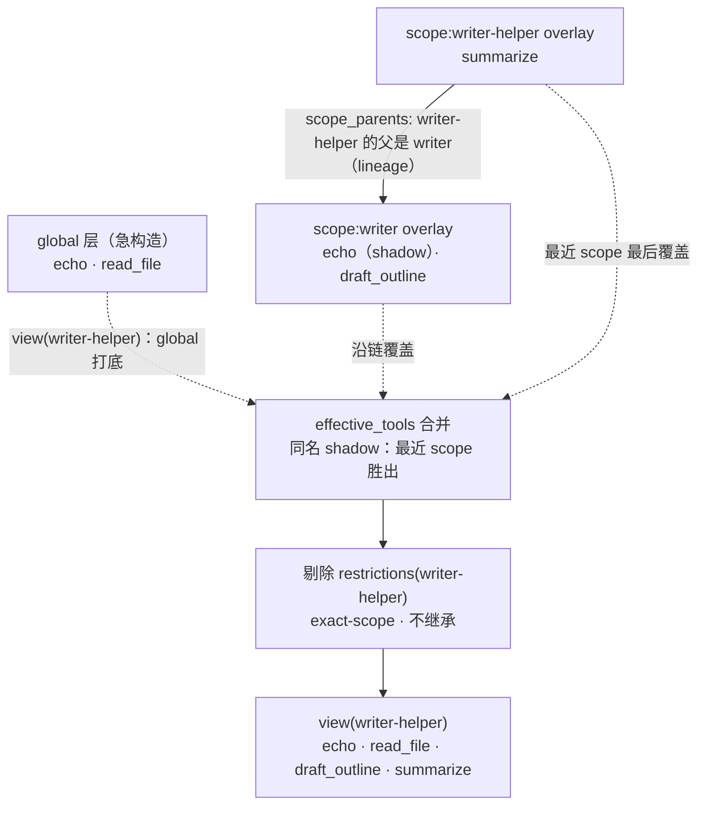

# 第 9 章 scope 作用域注册：同一进程里多个 agent 如何隔离各自能力

> 同一个屋檐下，各有各的房间。

## 本章回答的问题

1. 多个 agent 同进程共存时，如何避免它们注册的工具互相污染？「作用域」是什么、把工具注册到某个 agent 名下意味着什么？（这样的注册同样可逆）
2. 全局和作用域注册了同名工具，agent 最终用到哪一个？（shadowing）
3. 子代理为什么能看到父代理注册的工具？（lineage 作用域链）
4. 如何只对某个 agent 收起某工具，而不影响其它 agent？（restriction）

第 8 章末尾留了个伏笔：作用域链如何层层嵌套、同名内容如何沿链 shadow、子代理为何能看到与主代理不同的东西。这个机制的完整形态住在 `packages/core/scope` 包里；而它最具体的消费者，正是第 4 章的工具注册表。本章回到第 4 章，把通用作用域机制落地到工具上。先把伏笔拆成两半：「作用域链怎么工作」是机制本体，本章用工具把它讲透；「子代理为何看到不同提示词」是它在 system-prompt 域的应用——真实项目的 system-prompt 注册表用的是同一套 `ScopedLayers`，第 8 章 `_merge` 的「单层 shadow」就是其最小形态。§5 末尾会把这两半接上。

回忆第 4 章：`ToolRuntime` 只维护**单一全局 `ToolLayer`**——所有工具都进同一张表，谁注册、谁可见，没有边界。`ToolLayer` 的 docstring 当时就为本次升级留了话：「真实版是 ScopedLayers 的全局层 + agent 作用域层（作用域 shadow 全局）」。本章把这句预留落地。

本章代码增量复用前两块的成果：

| 依赖 | 来源 | 本章用法 |
| --- | --- | --- |
| `Context` / `Service` / `effect` | `ch01/code/cordis.py` | 装配容器、注册即效应、disposer |
| `ToolDefinition` / `ToolExecution` / `ToolResult` / `ToolLayer` / `ToolRuntime` | `ch04/code/tools.py` | 工具定义、执行请求与结果、层结构、执行管线 |
| `ScopedLayers` / `ScopedToolRuntime` | `ch09/code/scope.py`（本章新增） | 作用域分层与作用域感知运行时 |

## 1. 一张全局表，多个 agent 互相踩踏

先看没有作用域时的样子。下面这段代码用一张全局字典模拟第 4 章的工具表，三个 agent（main / writer / research）共享它：

```python
# ch09/code/bad_example.py（模块级全局变量与函数）
GLOBAL_TOOLS = {}  # 唯一的全局工具表：没有作用域、没有 shadow、没有 restrict


def register(name, fn):
    """注册工具：一旦注册，所有 agent 可见。"""
    GLOBAL_TOOLS[name] = fn


def view():
    """任何 agent 看到的都是同一张表。"""
    return dict(GLOBAL_TOOLS)


def main():
    # main agent 注册一个通用 echo
    register("echo", lambda args: f"[global] {args['text']}")
    print("main 注册 echo 后，writer 也看见了:", sorted(view()))

    # writer 想要一个带写作口吻的 echo，但只能覆盖全局——main 的 echo 一起没了
    register("echo", lambda args: f"[writer] {args['text']}")
    print("writer 覆盖 echo 后，执行到的是:", view()["echo"]({"text": "hi"}))

    # research 想禁用 echo，只能全局删除——writer 的 echo 也跟着消失
    del GLOBAL_TOOLS["echo"]
    print("research 全局删除 echo 后:", sorted(view()))
    print("结论：一张全局表，没法让每个 agent「有自己的工具」")


if __name__ == "__main__":
    main()
```

运行 `python3 bad_example.py`：

```text
main 注册 echo 后，writer 也看见了: ['echo']
writer 覆盖 echo 后，执行到的是: [writer] hi
research 全局删除 echo 后: []
结论：一张全局表，没法让每个 agent「有自己的工具」
```

问题逐条拆开。前三条 bad_example 直接暴露；后两条是隐藏问题——问题 4 藏在多 agent 协作里，问题 5 藏在生命周期管理里，bad_example 都没有直接暴露，真实项目第一天就会撞上：

1. **注册无边界**：main 注册的 `echo`，writer 立刻看见。工具表是全局单例，任何 agent 的注册都对所有人可见。
2. **同名即覆盖**：writer 想要自己的 `echo`，只能写同一个键，把 main 的实现顶掉——「我想要一个不同的版本」和「我要覆盖你的版本」被混为一谈。
3. **收起即全局删除**：research 想让 `echo` 对自己不可用，只能 `del`，结果 writer 的 `echo` 一起消失。没有「只对我收起」的手段。
4. **子代理要重注册父工具**（隐藏）：这条痛在「想要 per-agent 边界」之后才出现——继续全员共享全局表，子代理确实能直接看见父代理的工具，但那就退回问题 1；想要边界，就只能给子代理把父代理的工具重新注册一份（还可能与父代理的版本分叉）。全局表没有「继承」这第三条路。
5. **注册不可逆**（隐藏）：注册没有配套的注销，想收回某个工具只能手动 `del` 全局表（又退回问题 3），做不到「谁注册、谁回收」。

根因只有一个：**工具表没有「属于谁」这个维度**。要解决，就得给注册表加上作用域。

## 2. 整体结构：全局层 + 每 agent 一层 + 一条谱系链

§1 的根因是「工具表没有『属于谁』这个维度」。这一节把它补回去：先不写代码，把层、scope、overlay、谱系几个名词和「注册」这个动作逐个立起来，再看全貌图。

**第一步：从一张表到每个 agent 一张表——层。** 第 4 章的 `ToolLayer` 就是一张工具表（名字 → 定义），bad_example 的毛病是三个 agent 挤在同一张表里。修法很直接：全局留一张共享表打底，再给每个 agent 单独发一张。这些表统称**层（layer）**——全局那张叫全局层，每个 agent 名下那张是它自己的层。层没有新东西，每张就是一个 `ToolLayer`，新的只是「从一张变多张」。

**第二步：注册写进哪张表——scope。** 表一多，注册就得指明「写进哪张」。办法是给每个 agent 发个名字，注册时递进来，凭名字找到对应的表。这个名字就是 **scope（作用域）**——它不是新机制，就是「哪个 agent」的代称，一把从 agent 指向它那张表的钥匙。教学版用字符串（`"writer"`）当 scope；真实代码里 scope 通常就是 agent 对象本身（§8 简化清单第 1 条）。

**第三步：自己的表盖在全局表上——overlay。** agent 自己的表不是孤立用的：读取时它**盖在**全局层之上——全局打底、自己的表叠加。所以它又叫 **overlay（覆盖层）**，强调的是「与全局层叠在一起、读取时要合并」，而非两张互不相干的表。

**第四步：三者关系一句话。** **注册**是动作——把工具定义写进某一层；**scope** 是「哪个 agent」的名字，用来定位那层；**overlay** 就是那个 agent 自己的层。「注册到 writer 名下」= 拿 `scope="writer"` 找到 writer 的 overlay 写进去；不递 scope 就写进全局层——这正是「作用域注册」与第 4 章「全局注册」的全部差别。

**第五步：子 agent 想用父 agent 的表——谱系。** 子 agent（writer-helper）不仅想用全局工具，还想直接用父 agent（writer）的工具。于是再记一份「谁的父是谁」，读取时子 agent 顺这份关系把父的层一并纳入合并。这条父子链就是**谱系（lineage）**。

**现在看全貌。** 概念就位后，把结构落到贯穿 §3–§7 的例子上：全局层注册 `echo`、`read_file`；writer 在自己的 overlay 注册同名 `echo`（盖住全局）与专属 `draft_outline`；writer-helper 是 writer 的子作用域，有自己的 `summarize`。`view(writer-helper)`（writer-helper 最终能看到哪些工具）的形成过程：



图里每个节点现在都能对号入座：`GL`/`WL`/`HL` 是三张**层**（`WL`、`HL` 是各自 agent 的 **overlay**）；实线箭头 `HL → WL` 是**谱系**（记下 writer-helper 的父是 writer）；三张层汇入 `MG` 的虚线是**读取合并**——全局打底、沿谱系链从远到近逐层覆盖、同名工具由最近的 scope 胜出（这个「同名覆盖」叫 **shadow**，§4 展开）；`FT` 再剔除该 agent 自己拉黑的工具（**restriction**，§6 展开）；`VW` 就是 writer-helper 最终的工具视图。

对照这张图，本章的三条路径一目了然：

- **写路径** `register(def, scope)`：把定义写进 `scope` 自己的那层 overlay（只写它自己，不掺祖先；`scope=None` 写全局层），并发 `tools/change` 事件。注册挂到谁名下，就只属于谁。
- **谱系** `bind_scope_parent(key, parent)`：记录「谁的父是谁」，存进 `scope_parents`。子作用域读取时会把祖先的层一并纳入。
- **读路径** `view(scope)`：先用 global 打底，再沿父链从远到近逐层覆盖（同名 shadow，最近胜出），最后剔除该 scope 自己的 restrictions。

`ScopedToolRuntime` 则是第 4 章 `ToolRuntime` 的作用域感知升级：它持有一个 `ScopedLayers`（上面这套「层 + scope + 谱系」的容器，§3 给出它的代码），把注册 / 视图 / 取定义 / 执行全部改成作用域感知。下面按「注册 → shadow → lineage → restriction」逐个拆解。

## 3. 机制一：ScopedLayers 与 per-agent 作用域注册

**概念引入**。作用域（scope）就是一个注册边界：每个 agent 一个，注册挂到自己名下。`ScopedLayers` 用三样东西表达这件事——一个急构造的全局层、一张「scope → overlay」的表、一张记录父子关系的谱系表：

```python
class ScopedLayers:
    # ... for_scope 见本节下文；effective_tools 见 §4；lineage 三方法见 §5；is_restricted 见 §6 ...

    def __init__(self, create_layer):
        self.create_layer = create_layer      # 层工厂（tools 传 ToolLayer）
        self.global_layer = create_layer()     # 全局层（store.ts:161）
        self.scoped = {}                       # scope -> exact-scope overlay（store.ts:163）
        self.scope_parents = {}                # scope -> parent scope（lineage，index.ts:39）
        self.restrictions = {}                 # scope -> set(名字)；exact-scope，不继承
```

注意 `create_layer` 是个工厂：`ScopedLayers` 本身不关心层里装什么，tools 传 `ToolLayer`，别的 seam 可以传自己的层类型。这正是「通用作用域机制 + 具体消费者」的分工。

**取层是 chain-blind 的**。写入时取的 overlay 只看 exact scope，不掺祖先——这保证了「注册只属于自己」：

```python
class ScopedLayers:
    # ... __init__ 见本节上文；effective_tools 见 §4；lineage 三方法见 §5；is_restricted 见 §6 ...

    def for_scope(self, scope):
        """取 exact-scope overlay：None 返回全局层，否则返回（必要时创建）该 scope 的层。

        对应 store.ts:180 peek（刻意 chain-blind，不继承祖先）+ 首次创建。
        """
        if scope is None:
            return self.global_layer
        if scope not in self.scoped:
            self.scoped[scope] = self.create_layer()
        return self.scoped[scope]
```

**注册即效应**。`ScopedToolRuntime.register` 把定义写进对应 overlay，同时发 `tools/change` 事件，并通过第 1 章的 `ctx.effect` 返回一个 disposer——注册这件事本身是个可逆效应：

```python
class ScopedToolRuntime:
    # ... __init__ 见本节下文；view / get / defined_in / execute / _dispatch_body 见 §4；restrict 见 §6 ...

    def register(self, definition, scope=None):
        """注册工具到指定作用域，返回 disposer（注册即可逆，第 1 章 ctx.effect）。

        对应 store.ts:226 effect：scope=None 写全局层，否则写该 scope 的 exact overlay。
        注册即效应：写入 tools 表 + 发 tools/change 事件。
        """
        layer = self._layers.for_scope(scope)

        def setup():
            layer.tools[definition.name] = definition
            self.ctx.emit("tools/change",
                          {"name": definition.name, "scope": scope, "op": "add"})

            def teardown():
                layer.tools.pop(definition.name, None)
                self.ctx.emit("tools/change",
                              {"name": definition.name, "scope": scope, "op": "remove"})

            return teardown

        return self.ctx.effect(setup, label=f"tool:{scope or 'global'}:{definition.name}")
```

`ScopedToolRuntime` 在构造时把全局层直接复用为父类的 `_layer`，于是「不传 scope」的注册与执行跟第 4 章完全一致，作用域是纯增量：

```python
class ScopedToolRuntime:
    # ... register 见本节上文；view / get / defined_in / execute / _dispatch_body 见 §4；restrict 见 §6 ...

    def __init__(self, ctx, config=None):
        super().__init__(ctx, config)
        # 用 ScopedLayers 取代「单一全局层」的视角；全局层直接复用父类的 _layer，
        # 使「不传 scope」的注册 / 执行与 ch04 行为完全一致。
        self._layers = ScopedLayers(create_layer=ToolLayer)
        self._layers.global_layer = self._layer
```

**回溯问题**：问题 1（注册无边界）就此消失——writer 的注册写进 `scoped["writer"]`，main 的注册写进全局层，两者物理隔离，谁也不污染谁。问题 5（注册不可逆）也一并解决：注册经 `ctx.effect` 发生，返回的 disposer 就是配套的注销开关（§7 第 6 行验证）。

## 4. 机制二：shadowing 与读路径

**概念引入**。隔离不是目的，「既有共享、又有自己的版本」才是。shadowing（遮蔽）给出答案：全局层打底，作用域层叠加，**同名工具最近 scope 胜出**。合并逻辑就是「先铺全局，再沿链覆盖」：

```python
class ScopedLayers:
    # ... __init__ / for_scope 见 §3；chain_layers 见 §5；is_restricted 见 §6 ...

    def effective_tools(self, scope):
        """有效工具集：global 打底 + 沿父链覆盖，最近 scope 同名胜出（shadowing）。

        对应 store.ts:208 merge。
        """
        merged = dict(self.global_layer.tools)
        if scope is not None:
            for layer in self.chain_layers(scope):
                merged.update(layer.tools)  # 同名覆盖：最近 scope 胜出
        return merged
```

`view` 在合并结果上再剔除该作用域的限制（restriction 见 §6），得到某 agent 真正可见的工具列表：

```python
class ScopedToolRuntime:
    # ... __init__ / register 见 §3；get / defined_in / execute / _dispatch_body 见本节；restrict 见 §6 ...

    def view(self, scope=None):
        """某作用域可见的工具定义：有效层（global+父链 shadow）→ 剔除 exact-scope restrictions。

        [教学简化] 真实 view 末尾还按 mode 过滤（presentAs，第 4 章）；本章聚焦作用域。
        """
        merged = self._layers.effective_tools(scope)
        return [definition for name, definition in merged.items()
                if not self._layers.is_restricted(scope, name)]
```

**取定义与执行也走同一条 shadow 链**。`get` 按「exact scope → 祖先 → 全局」的顺序查找，第一个命中即返回；`defined_in` 则把「命中的是哪一层」说出来，作为 shadow 解析的证据：

```python
class ScopedToolRuntime:
    # ... __init__ / register 见 §3；view 见本节上文；execute / _dispatch_body 见本节下文；restrict 见 §6 ...

    def get(self, name, scope=None):
        """按作用域取工具定义：exact scope -> 祖先 -> 全局（shadow 的查找侧）。"""
        if scope is not None:
            for key in self._layers.scope_chain_of(scope):  # exact -> 祖先
                layer = self._layers.scoped.get(key)
                if layer is not None and name in layer.tools:
                    return layer.tools[name]
        return self._layer.tools.get(name)

    def defined_in(self, name, scope=None):
        """有效定义所在的层（shadow 解析的证据）：exact scope -> 祖先 -> global。"""
        if scope is not None:
            for key in self._layers.scope_chain_of(scope):
                layer = self._layers.scoped.get(key)
                if layer is not None and name in layer.tools:
                    return f"scope:{key}"
        if name in self._layer.tools:
            return "global"
        return None
```

执行侧的作用域怎么传进来？`ScopedToolRuntime` 覆盖了 `execute`：执行前把 scope 写进实例属性 `_exec_scope`，执行后在 `finally` 里复位为 `None`——无论成功还是异常都不泄漏给下一次执行。`_dispatch_body` 读到它后，把「从单一全局层取工具」换成「按 scope 沿链取工具」（`get`），第 4 章的守卫管线原样复用：

```python
class ScopedToolRuntime:
    # ... __init__ / register 见 §3；view / get / defined_in 见本节上文；restrict 见 §6 ...

    def execute(self, exec, scope=None):
        """作用域感知执行：按 scope 沿链解析有效工具后走 ch04 守卫管线。

        scope=None 时与 ch04 行为一致（全局层）。
        [教学简化] 用实例属性把 scope 透传给 _dispatch_body；真实代码把 scope
        放进执行上下文（AsyncLocalStorage）。
        """
        self._exec_scope = scope
        try:
            return super().execute(exec)
        finally:
            self._exec_scope = None

    def _dispatch_body(self, exec):
        """覆盖 ch04：从有效层（作用域链 shadow）解析工具，而非单一全局层。"""
        scope = getattr(self, "_exec_scope", None)
        tool = self.get(exec.name, scope)
        if tool is None:
            return ToolResult(content=f"工具 {exec.name} 未注册", is_error=True)
        try:
            content = tool.execute(exec.arguments)
            return ToolResult(content=str(content))
        except Exception as e:  # noqa: BLE001  教学版统一兜底
            return ToolResult(content=f"工具执行失败：{e}", is_error=True)
```

于是「带 scope 的执行调用」长这样——`ch09/code/main.py` 第 3 段正是这两次调用（缩进略）：

```python
# ch09/code/main.py 的 main() 内（第 3 段）
print("3. 全局执行 echo:",
      runtime.execute(ToolExecution(call_id="e1", name="echo",
                                    arguments={"text": "hi"})).content)
print("   writer 执行 echo:",
      runtime.execute(ToolExecution(call_id="e2", name="echo",
                                    arguments={"text": "hi"}),
                      scope="writer").content)
```

两次调用走同一条管线、同一个工具名，唯一区别是第二次带了 `scope="writer"`：`execute` 先把 `_exec_scope` 设为 `"writer"`，`_dispatch_body` 据此沿 writer 链解析到 writer 自己的 `echo`。输出分别是 `[global] hi` 与 `[writer] hi`（完整输出见 §7 第 3 行）。

两点说明。其一，Python 允许在方法里给实例动态绑定属性（不限于 `__init__`），这是合法的语言特性；`_dispatch_body` 用 `getattr(self, "_exec_scope", None)` 兜住「从未带 scope 执行过」的情况。生产代码通常把这类状态声明在 `__init__` 或放进显式上下文，教学版图简单。其二，真实代码正是走的「显式上下文」路线：scope 被放进 Node.js 的 AsyncLocalStorage——一种随调用链传播的上下文存储，每条异步调用链有自己的副本，链上任意位置可读、链间互不串扰（§8 简化清单第 6 条）。

**回溯问题**：问题 2（同名即覆盖）被 shadowing 取代——writer 注册自己的 `echo` 不再顶掉全局 `echo`；writer 调用时命中自己的版本，main 调用时仍命中全局版本。同名从「冲突」变成「各取所需」。

## 5. 机制三：lineage 作用域链

**概念引入**。agent 之间常有父子关系：主代理派生子代理去干活。子代理理应看到父代理的工具——这靠谱系（lineage）表达：`bind_scope_parent(key, parent)` 记下「谁的父是谁」，读取时沿链向上收集。

绑定父级是一次性的，且带环检测（否则沿链读取会死循环）：

```python
class ScopedLayers:
    # ... scope_chain_of / chain_layers 见本节；其余成员见 §3、§4、§6 ...

    def bind_scope_parent(self, key, parent):
        """一次性绑定 key 的父 scope，带环检测。对应 index.ts:72 bindScopeParent。"""
        if key in self.scope_parents:
            raise ValueError(f"scope {key!r} 已绑定父级，重链需走 rebind 句柄")
        cursor = parent
        while cursor is not None:  # 沿 parent 向上走，遇到 key 即成环（index.ts:54）
            if cursor == key:
                raise ValueError("scope 父链将成环")
            cursor = self.scope_parents.get(cursor)
        self.scope_parents[key] = parent
```

读链就是顺着 `scope_parents` 一路向上：

```python
class ScopedLayers:
    # ... bind_scope_parent / chain_layers 见本节；其余成员见 §3、§4、§6 ...

    def scope_chain_of(self, key):
        """从 key 到根的链：[key, parent, grandparent, ...]。对应 index.ts:98 scopeChainOf。"""
        chain = []
        cursor = key
        while cursor is not None:
            chain.append(cursor)
            cursor = self.scope_parents.get(cursor)
        return chain
```

合并时要「祖先在前、最近在后」地覆盖，才能让最近 scope 胜出；`chain_layers` 把链反转后过滤出已存在的 overlay：

```python
class ScopedLayers:
    # ... bind_scope_parent / scope_chain_of 见本节上文；其余成员见 §3、§4、§6 ...

    def chain_layers(self, scope):
        """沿父链取已存在的 overlay：最远祖先在前、exact scope 最后。

        对应 store.ts:192 chainLayers = scopeChainOf(scope).reverse() 过滤存在的 overlay。
        """
        layers = []
        for key in reversed(self.scope_chain_of(scope)):  # 祖先 -> 最近
            layer = self.scoped.get(key)
            if layer is not None:
                layers.append(layer)
        return layers
```

于是 §4 的 `effective_tools` 天然支持多级继承：`writer-helper` 的视图 = global + writer + writer-helper 三层叠加。这回答了第 8 章伏笔里的作用域链机制：子代理之所以看到与主代理不同的内容，是因为它站在一条不同的作用域链上。system-prompt 域是同一套机制的直接应用——真实项目的 system-prompt 注册表同样使用 `ScopedLayers`（`system-prompt/src/index.ts:205-210`，scope 链同样由 `scopeChainOf` 提供）；把这里的「工具」换成第 8 章的「提示词段」，沿链 shadow 之后，子代理自然看到与主代理不同的提示词。

**回溯问题**：问题 4（子代理要重注册父工具）在 bad_example 里没直接出现，是「多 agent 协作」的隐藏需求——一旦想要 per-agent 边界，全局表既不能继续共享（否则退回问题 1），又没有「继承」可用，子代理就得把父代理的工具重新注册一遍；有了 lineage，继承自动发生，子代理沿链直接看到父代理的注册。

## 6. 机制四：restriction 单调黑名单

**概念引入**。有时不是要「换一个版本」，而是要「对某个 agent 收起某工具」。restriction 是一张**单调**（只增不减）的黑名单，且是 **exact-scope** 的：只对该作用域生效，不继承、也不影响祖先和兄弟。

写入时强制要求指定 scope——真实源码在这里会 throw「context-global restriction would mask every agent」，教学版同样拒绝全局限制：

```python
class ScopedToolRuntime:
    # ... is_restricted 属 ScopedLayers，见本节下文；其余成员见 §3、§4 ...

    def restrict(self, names, scope):
        """把若干工具加入某作用域的单调黑名单（只增不减）。

        [教学还原] 真实 restrict 强制要求 scope 存在，否则 throw
        「context-global restriction would mask every agent」（见 §8 源码对照）。
        被限制的工具只从该 exact scope 的 view 里消失，不继承、不影响祖先与其它 scope。
        """
        if scope is None:
            raise ValueError("context-global restriction 会遮蔽所有 agent，必须指定 scope")
        self._layers.restrictions.setdefault(scope, set()).update(names)
        for name in names:
            self.ctx.emit("tools/change", {"name": name, "scope": scope, "op": "restrict"})
```

读取时的判断只看该 scope 自己的黑名单：

```python
class ScopedLayers:
    # ... restrict 属 ScopedToolRuntime，见本节上文；其余成员见 §3–§5 ...

    def is_restricted(self, scope, name):
        """工具在 exact scope 是否被限制（不继承祖先限制）。"""
        return name in self.restrictions.get(scope, set())
```

「不继承」是个容易想当然的点：writer 限制了 `read_file`，它的子作用域 writer-helper **仍然**能看到 `read_file`——限制不是注册，不沿链传播。这保证了「父代理的自我约束」不会误伤子代理。

**回溯问题**：问题 3（收起即全局删除）被 exact-scope restriction 取代——research 想让某工具对自己不可用，`restrict([...], scope="research")` 即可，全局表和其他 agent 分毫不动。

## 7. 完整运行输出

把六个片段串起来跑一遍。完整调用代码在 `ch09/code/main.py`（六个片段依次对应 §3–§6 的 API；执行侧的调用形态已在 §4 给出），每一行输出都能对号入座：

```text
1. 全局 view: ['echo', 'read_file']
2. 全局 view: ['echo', 'read_file']
   writer view: ['echo', 'read_file', 'draft_outline']
3. 全局执行 echo: [global] hi
   writer 执行 echo: [writer] hi
   writer 的 echo 定义在: scope:writer
   writer 的 read_file 定义在: global
4. writer-helper 谱系链: ['writer-helper', 'writer']
   writer-helper view（继承 writer + 全局）: ['echo', 'read_file', 'draft_outline', 'summarize']
5. restrict 后 writer view: ['echo', 'draft_outline']
   restrict 后 writer-helper view（不受父级限制影响）: ['echo', 'read_file', 'draft_outline', 'summarize']
   restrict 后全局 view: ['echo', 'read_file']
6. 注册 temp_tool 后 writer view: ['echo', 'draft_outline', 'temp_tool']
   调用 disposer 后 writer view: ['echo', 'draft_outline']
tools/change 事件数: 8
dispose 后全局 view: []
```

逐行归因：

- **第 1 行**：`scope=None` 注册进全局层（§3），`view()` 看到 `echo`、`read_file`。
- **第 2 行**：writer 注册同名 `echo` 与专属 `draft_outline` 后，全局视图不变（隔离生效），writer 视图多出 `draft_outline`，且 `echo` 已是自己的版本。
- **第 3 行**：同一个 `echo`，全局执行得到 `[global] hi`、writer 执行得到 `[writer] hi`——shadow 在执行侧生效；`defined_in` 进一步给出证据：writer 的 `echo` 在 `scope:writer`，`read_file` 回落到 `global`（§4）。
- **第 4 行**：`bind_scope_parent("writer-helper", "writer")` 建立谱系，`scope_chain_of` 读出 `['writer-helper', 'writer']`；writer-helper 的视图自动继承 writer 与全局的全部工具，外加自己的 `summarize`（§5）。
- **第 5 行**：writer `restrict` 掉 `read_file` 后，writer 视图少了它，但 writer-helper（子）与全局都不受影响——restriction 是 exact-scope、不继承（§6）。
- **第 6 行**：`register` 返回的 disposer 被调用，`temp_tool` 从 writer 视图消失——注册即可逆（§3）。
- **事件数 8**：echo/read_file/echo(writer)/draft_outline/summarize 五次 add + 一次 restrict + temp_tool 一次 add 一次 remove，共 8 条 `tools/change`。
- **末行**：`ctx.dispose()` 触发第 1 章收集的全部 disposer，全局层清空——作用域注册随容器生命周期整体回收。

## 8. 源码对照

教学代码与 `packages/core/scope`（包名 `@deepseek-ai/dsh-scope`）的对应关系：

| 教学代码（`ch09/code/scope.py`） | 源码 | 说明 |
| --- | --- | --- |
| `ScopedLayers`（:29） | `src/store.ts:159` | 作用域分层：全局层 + 每 scope overlay |
| `global_layer`（:44） | `store.ts:161 global` | 急构造的全局层 |
| `scoped`（:45） | `store.ts:163 scoped` | scope → exact-scope overlay |
| `for_scope`（:73） | `store.ts:180 peek` | 取 exact overlay（chain-blind） |
| `chain_layers`（:84） | `store.ts:192 chainLayers` | 沿父链取层（祖先在前） |
| `effective_tools`（:98） | `store.ts:208 merge` | global 打底 + 沿链覆盖（shadow） |
| `register`（:143） | `store.ts:226 effect` | 注册即效应，返回 disposer |
| `scope_parents`（:46） | `src/index.ts:39 scopeParents` | 谱系存储（WeakMap） |
| `bind_scope_parent`（:51） | `index.ts:72 bindScopeParent` | 绑定父级（带环检测，:54 linkScopeParent） |
| `scope_chain_of`（:62） | `index.ts:98 scopeChainOf` | 读谱系链 |
| `restrict`（:167） | `tools/index.ts:1071 restrict` | exact-scope 单调黑名单 |
| `is_restricted`（:111） | `tools/index.ts:714 ToolLayer.restrictions` | exact-scope 限制查询（真实限制条目存在层上；教学版集中存 `ScopedLayers`） |
| `ScopedToolRuntime`（:116） | `tools/index.ts:811` | 消费 ScopedLayers 的工具运行时 |
| `ToolLayer` 作为层 | `tools/index.ts:714` | `class ToolLayer implements ScopeLayer` |
| —（域外对照）system-prompt 注册表 | `system-prompt/src/index.ts:205-210` | 同一套 `ScopedLayers` 与 scope 链，消费者换成提示词段（§5 末段） |

**教学简化清单**（均为刻意简化，正文已标注）：

1. **scope key 用字符串**：真实 scope key 是不透明对象（通常就是 Agent 本身，`index.ts:15`），按身份比较；教学版用字符串便于打印。
2. **未实现 scope 铸造**：真实代码用 `createScope`（`index.ts:133`）为每个 agent 铸造 Scope、`scopeOf`（`index.ts:164`）读最近 scope；教学版直接传 scope 名。
3. **未实现作用域事件路由**：真实 `scopeTarget`（`index.ts:178`）+ carrier 实现「祖先收得到后代事件、反之不行」；教学版只发普通 `tools/change`。
4. **restriction 用名字集合**：真实是编译后的 restriction 条目；教学版用 `set` 表达单调黑名单足够。
5. **view 省略 mode 过滤**：真实 view 末尾按 `presentAs` 的 mode 过滤（第 4 章），与作用域正交，本章略去。
6. **scope 用实例属性透传**：真实把 scope 放进执行上下文（AsyncLocalStorage）；教学版用 `_exec_scope` 简化（§4 的 `execute`）。
7. **未实现 scope-invariant**：真实有 `invariant.ts:10` 的跨层一致性断言，教学版从略。

## 9. 小结与预告

本章把第 4 章「一张全局工具表」升级为「全局层 + 每 agent 一层 + 一条谱系链」，问题与机制一一对应：

| 问题（§1） | 机制 | 运行证据（§7） |
| --- | --- | --- |
| 问题 1：注册无边界，互相污染 | per-agent 作用域注册（`for_scope` exact overlay） | 第 2 行：writer 注册后全局视图不变 |
| 问题 2：同名即覆盖 | shadowing（`effective_tools` 最近 scope 胜出） | 第 3 行：同名 echo 两处执行到不同实现 |
| 问题 4：子代理要重注册父工具 | lineage（`bind_scope_parent` + `chain_layers`） | 第 4 行：writer-helper 自动继承 writer + 全局 |
| 问题 3：收起即全局删除 | restriction（exact-scope 单调黑名单，不继承） | 第 5 行：writer 受限，子与全局不受影响 |
| 问题 5：注册不可逆 | 注册即效应（`ctx.effect` 返回 disposer） | 第 6 行：disposer 调用后 temp_tool 消失 |

一句话收束：**作用域 = 注册的归属边界 + 读取的合并规则**。写的时候挂到谁名下（exact overlay），读的时候沿谱系链合并、同名 shadow、再剔除自己的限制——隔离与共享由此兼得。

下一章（第 10 章「compaction 与 token 压力」）换一个维度：本章解决的是「多个 agent 互不踩踏」，下一章解决「单个 agent 自己的上下文越聊越长」——当会话逼近 token 上限，harness 如何触发压缩、裁剪工具结果、腾出空间继续对话。

## 10. 附录：关键概念速查表

| 概念 | 教学符号 | 源码符号 | 一句话 |
| --- | --- | --- | --- |
| 作用域 | `scope`（字符串 key） | `ScopeKey` / `Scoped<T>` | 一个注册边界，每个 agent 一个 |
| 作用域分层 | `ScopedLayers` | `ScopedLayers` | 全局层 + 每 scope overlay + 谱系 |
| exact-scope overlay | `for_scope` / `scoped` | `peek` / `scoped` | 只属于该 scope 的层，写入不继承 |
| shadowing | `effective_tools` | `merge` | 同名工具最近 scope 胜出 |
| 谱系 / 作用域链 | `bind_scope_parent` / `scope_chain_of` | `bindScopeParent` / `scopeChainOf` | 子作用域继承祖先注册 |
| 作用域限制 | `restrict` / `is_restricted` | `restrict` / `restrictions` | exact-scope 单调黑名单，不继承 |
| 作用域感知运行时 | `ScopedToolRuntime` | `ScopedToolRuntime`（tools） | 消费 ScopedLayers 的工具运行时 |
| 注册即效应 | `register` 返回 disposer | `ScopedLayers.effect` | 注册可逆，随容器生命周期回收 |
