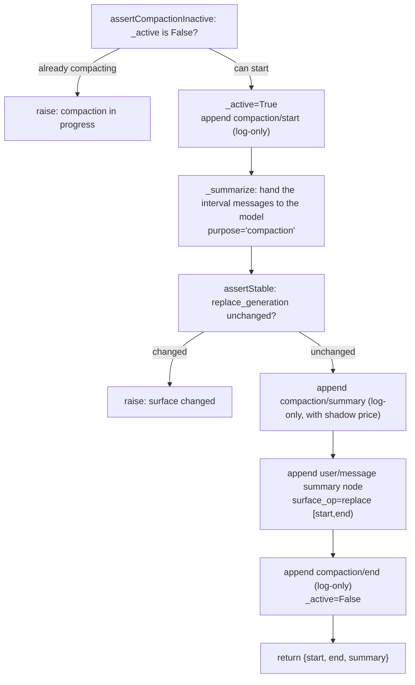

# Chapter 10: compaction and token pressure

> The window is finite, the conversation goes on; forgetting is not deletion, but summarization.

## Questions this chapter answers

1. Chapter 7's `estimate_message` can already fold history into a token count, but the conversation only grows, never shrinks — what happens when the accumulated tokens hit the window limit?
2. Chapter 3's persistence requires `log` to be complete and never deleted, yet the model can only see what fits inside the window — how does compaction make both true at once?
3. Chapter 4's tool pipeline already lets the model emit tool calls and receive their results — when compaction compresses a stretch of history, why can't it start compressing from an arbitrary position?

Chapter 9 solved "which tools each of multiple agents can see" — scope split a single global tool table into layered, inheritable, restrictable scopes. That is **horizontal** resource isolation: at the same moment, different agents see different tool sets.

This chapter turns to a **vertical** kind of finite resource: the context window. It treats all agents the same — no matter how scope is sliced, the total number of tokens a single session can stuff into the model has an upper limit. And conversation is, unfortunately, monotonically growing: every question asked, every tool called, makes the history a little thicker.

In fact, we planted the foreshadowing long ago. Chapter 7's `estimate_message` can already fold each message into tokens, and `TokenMeter.measure` can collapse a chunk stream into a single usage snapshot — but those numbers were merely **measured**; nobody **responded** to them. This chapter gives that string of numbers a pair of hands: when pressure approaches the window, automatically compress a stretch of old history into a summary so the conversation can continue.

This chapter's teaching code builds on **Chapter 7** (reusing `estimate_message` from `token_meter.py` and `LlmRuntime` / `LlmAdapter` / `BlockAssembler` from `llm_runtime.py`), and extends on top of Chapter 2's `Session` / `Sessions`. The new code lives in `ch10/code/`.

## 1. An Ever-Growing Session Inevitably Hits the Wall

The model has one hard constraint: the **context window**. The total number of input tokens a single call can receive must not exceed it. Yet the way an agent works is exactly "bring the entire history along every turn" — so token pressure only goes up, never down.

The following bad example does no compaction at all; it just honestly prints the accumulated token count of each turn (reusing Chapter 7's `estimate_message`). To make the process easy to see, `[teaching simplification]` shrinks the window to 500:

```python
# ch10/code/bad_example.py (excerpt)
def main():
    # ... banner and description output omitted ...
    context_window = 500  # the teaching example shrinks the window so the process is easy to see
    # ... two description output lines omitted ...

    total = 0
    turn = 0
    while total < context_window:
        turn += 1
        user_msg = {"role": "user", "content": f"Question {turn}: " + "details " * 20}
        assistant_msg = {"role": "assistant", "content": f"Answer {turn}: " + "analysis " * 20}
        total += estimate_message(user_msg) + estimate_message(assistant_msg)
        print(f"  turn {turn:>2}: accumulated tokens = {total:>4} / window = {context_window}")
    # ... closing output omitted (see the full output block below) ...
```

Run `python3 ch10/code/bad_example.py` (output excerpt, showing only head and tail):

```text
==============================================================
Bad example: an ever-growing session inevitably hits the context-window wall
==============================================================

Suppose the context window has only 500 tokens.
The conversation proceeds turn by turn, each turn appending a question and an answer:

  turn  1: accumulated tokens =   40 / window = 500
  ...
  turn 12: accumulated tokens =  486 / window = 500
  turn 13: accumulated tokens =  528 / window = 500

→ After turn 13, the accumulated 528 tokens already exceed the window of 500.
  At this point the model refuses to accept the input: the conversation can no longer continue past this turn.
  And everything said before can no longer be handed to the model, because it no longer fits in the window.

This is the problem compaction exists to solve:
  the context window is finite, but the conversation must continue.
```

The problem is exposed precisely: **the window is finite, but the conversation must continue.** We need a mechanism that, without losing history, shrinks "what the model will see" back inside the window.

Here a pair of contradictions immediately surfaces, and it is this chapter's design pivot:

- **`log` must be complete**: the session event stream is a factual record (Chapter 3 persists exactly this), and it cannot be genuinely deleted.
- **The model can only see what fits in the window**: the messages handed to the model must be few enough.

The solution is to split these two concerns into **two layers**: the append-only `log` stays untouched, and a **replaceable** `surface` is built on top — the view the model actually sees. The next section's mechanism unfolds from here.

## 2. Mechanism One: surface — a Replaceable Ordered View

### 2.1 Concept

`surface` is an **ordered view** of a session: it lists the sequence numbers of "events that produce LLM messages", and the model, when called, fetches messages in that order. Not all events go into surface — only three types do:

```python
# ch10/code/surface.py
SURFACE_EVENT_TYPES = ("user/message", "assistant/message", "tool/result")
```

Process events such as `compaction/*` do **not** enter surface (the model doesn't need to know "I am being compacted"); they only go into log.

By the way, one cross-chapter linkage is settled here (handled in this revision together): surface and `surface_op` are not a native ability of Chapter 2's `Session` — the `[teaching simplification]` comment in Chapter 2's `Session.append` omitted them wholesale at the time, deferring them to a later chapter, originally labeled "the Chapter 3 mechanism". But surface is actually a mechanism introduced in this chapter (Chapter 10); Chapter 3 is about persistence. This revision has corrected that chapter-number reference in Chapter 2's `agent_loop.py` to "the Chapter 10 mechanism". This chapter now fulfills that reserved slot.

The key difference between surface and log: log only appends, while surface can be **replaced wholesale**. A replacement is described by a `surface_op`:

```python
# ch10/code/surface.py
class SurfaceSession(Session):
    """A session with a surface: an ordered surface view layered on top of the ch02 Session.

    The two-layer structure (this is the key to understanding compaction):
    - log (inherited from Session): the append-only full history; compaction/* events go only here;
    - surface (new in this chapter): the ordered view of events that produce LLM messages,
      the content the model actually "sees".

    Compaction never touches log; it only replaces one interval on surface with a single
    summary node — history stays traceable (log complete), model context shrinks (surface shortens).
    """

    def __init__(self, ctx, session_id):
        super().__init__(ctx, session_id)
        self.surface = []            # the ordered surface node list; elements are event seq
        self.replace_generation = 0  # incremented per replace, used for the compaction transaction's stability assertion

    def append(self, type, payload=None, surface_op=None):
        """Append an event; if it is a surface event, update surface according to surface_op.

        surface_op has two forms (SurfaceOp, types.ts:372-374):
        - None (equivalent to 'append'): append to the tail of surface (default);
        - {'op': 'replace', 'start': i, 'end': j}: replace the whole interval surface[i:j]
          with this single node (the compaction summary lands through this path).
        """
        event = super().append(type, payload)
        if type in SURFACE_EVENT_TYPES:
            if isinstance(surface_op, dict) and surface_op.get("op") == "replace":
                start, end = surface_op["start"], surface_op["end"]
                # replace the [start, end) interval with this one node (the compaction summary node)
                self.surface[start:end] = [event.seq]
                self.replace_generation += 1
            else:
                self.surface.append(event.seq)
        # non-surface events (compaction/* etc.) go only into log, not surface
        return event
```

Note three design points:

1. **`super().append` runs first**: no matter how surface changes, the event always enters log first. This is the bottom-level guarantee of "log completeness".
2. **replace is a slice assignment**: `self.surface[start:end] = [event.seq]` swaps the old sequence numbers in `[start, end)` for the single sequence number of the new event — the view is "displaced", while those old events in log still lie there intact.
3. **the `replace_generation` counter**: incremented on every replace. Compaction is a multi-step transaction; if someone silently changes surface during it, the counter won't match — it is the basis for the **stability assertion** at transaction close (§4 uses it).

### 2.2 Wrap-up

surface decouples "historical completeness" from "model visibility": log is responsible for remembering everything, surface for deciding what the model sees right now. What compaction has to do is **safely replace one segment of surface**.

## 3. Mechanism Two: token-meter Pressure Measurement and Threshold Decision

### 3.1 Concept

To decide "should we compact?", we must first measure "how full are we right now?". This step reuses Chapter 7's measurement ability, folding the whole session's surface messages into tokens and keeping a per-node ledger:

```python
# ch10/code/compaction.py
def measure_session(session):
    """Measure the token pressure of a session's surface → TokenMeasurement.

    Extends Chapter 7's measurement seam: the real source tokenMeter.measure(session)
    (token-meter/src/index.ts:116) returns totalTokens + per-node pricing nodes;
    the teaching version reuses Chapter 7's estimate_message, pricing each surface node.
    Returns {'total_tokens': int, 'nodes': [{'seq': int, 'tokens': int}]}.
    """
    nodes = []
    total = 0
    for seq in session.surface:
        event = session.log[seq]
        message = event.payload.get("message", {})
        tokens = estimate_message(message)
        nodes.append({"seq": seq, "tokens": tokens})
        total += tokens
    return {"total_tokens": total, "nodes": nodes}
```

After measuring total pressure, we still need a **policy** to decide "when to trigger, how much to keep". `resolve_compact_spec` converts the window size into two thresholds:

```python
# ch10/code/compaction.py
def resolve_compact_spec(context_window, threshold_ratio=0.8, retain_ratio=0.16):
    """Resolve compaction parameters (resolveCompactSpec, compaction-basic/index.ts:110).

    - threshold: the pressure threshold that triggers compaction = context_window × threshold_ratio (default 0.8);
    - retain_tokens: the token count kept at the tail during compaction = context_window × retain_ratio (default 0.16).
    """
    return {
        "threshold": int(context_window * threshold_ratio),
        "retain_tokens": int(context_window * retain_ratio),
    }
```

The two ratios each do their own job: `threshold` answers "**when** to compact", `retain_tokens` answers "**how much to keep** after compacting". `[teaching simplification]` replaces the finer, per-model/config-adjustable strategy in the source with fixed ratios, but the "threshold + retain amount" pair of structure is the same.

### 3.2 Threshold Decision

With the spec in hand, `compact_if_needed` can make the decision — measure pressure, compare against the threshold, and only actually compact when it is reached:

```python
    # ch10/code/compaction.py (BasicCompactionEngine)
    def compact_if_needed(self, session, trigger="pressure"):
        """Pressure trigger: measure token pressure, compact only when the threshold is reached; return None if not reached."""
        measurement = measure_session(session)
        spec = resolve_compact_spec(self.context_window,
                                    self.threshold_ratio, self.retain_ratio)
        if measurement["total_tokens"] < spec["threshold"]:
            return None  # pressure not reached, do not compact
        return self._compact(session, measurement, spec, trigger)
```

The `trigger` parameter marks the origin of this compaction, and it gets recorded into the `compaction/start` event. The source distinguishes two trigger semantics: `'pressure'` (an **active** threshold strategy for when pressure approaches the window, slowing down before hitting the wall) and `'context-overflow'` (a **passive** recovery strategy after a call has already been rejected for being too long — the last line of defense). The teaching version demonstrates the threshold-decision path via `compact_if_needed`; overflow recovery reuses the same compaction transaction in the source, only the origin differs.

### 3.3 Wrap-up

token-meter turns "how full the context is" into a comparable number, `resolve_compact_spec` turns the window into the "when to compact, how much to keep" policy, and `compact_if_needed` makes the threshold decision on top of that. The number finally has an action that responds to it.

## 4. Mechanism Three: the compaction seam and the Compaction Transaction

### 4.1 The Seam's Three Roles

compaction is a standard capability seam (Chapter 5's three roles appear here again):

```mermaid
flowchart LR
    subgraph SD["Service Definition<br/>compaction/"]
        CE["CompactionEngine (abstract interface)<br/>compactIfNeeded / compactNow / compactRegion"]
    end
    subgraph SP["Service Provider<br/>compaction-basic/"]
        BCE["BasicCompactionEngine<br/>(implementation that calls the model to summarize)"]
    end
    subgraph CS["Consumer<br/>command-compact/"]
        CMD["/compact command"]
    end
    BCE -.implements.-> CE
    CMD -.consumes ctx.compactionEngine.-> CE
```

- **Service Definition**: the `CompactionEngine` abstract interface, defining three verbs.
- **Service Provider**: `BasicCompactionEngine`, the implementation that actually calls the model to generate a summary.
- **Consumer**: the `/compact` command (manual trigger) and the pressure trigger (automatic) both consume the same `ctx.compactionEngine`.

The three verbs correspond to three trigger postures:

| verb | semantics | triggerer |
|------|-----------|-----------|
| `compact_if_needed` | compact only when pressure is reached | automatic (pressure) |
| `compact_now` | compact now, ignoring pressure | manual (`/compact`) |
| `compact_region` | compact a specified region | precise control |

In the teaching code, `CompactionEngine` pins down these three verbs with an abstract base class:

```python
# ch10/code/compaction.py
class CompactionEngine(ABC):
    """compaction service definition (CompactionEngine, compaction/index.ts:19).

    Three verbs: compact_if_needed / compact_now / compact_region.
    The abstract class itself does not register the service — whether ctx.compactionEngine
    exists is decided by the provider, and consumers must check existence first
    (this is exactly the seam's "definition does not guarantee implementation").
    """

    @abstractmethod
    def compact_if_needed(self, session, trigger):
        """Pressure trigger: measure pressure, compact only when the threshold is reached (index.ts:21)."""

    @abstractmethod
    def compact_now(self, session, trigger):
        """Immediate compaction: the /compact command goes through this (index.ts:24)."""

    @abstractmethod
    def compact_region(self, session, region, trigger):
        """Compact a specified region (index.ts:27)."""
```

`BasicCompactionEngine` implements these three verbs one by one. Its `__init__` takes the context window and the two ratios, initializes the compaction lock, and calls `ctx.provide("compactionEngine", self)` to mount itself on the seam for consumers:

```python
    # ch10/code/compaction.py (BasicCompactionEngine)
    def __init__(self, ctx, context_window, threshold_ratio=0.8, retain_ratio=0.16):
        self.ctx = ctx
        self.context_window = context_window
        self.threshold_ratio = threshold_ratio
        self.retain_ratio = retain_ratio
        self._active = False  # compaction lock (assertCompactionInactive, index.ts:149)
        ctx.provide("compactionEngine", self)
```

Of the three verbs, `compact_if_needed` (already shown above) measures pressure first and compacts only when the threshold is reached; `compact_now` compacts directly **without looking at pressure** — the `/compact` command goes through this one, measuring then entering `_compact` straight away, with no threshold gate:

```python
    # ch10/code/compaction.py (BasicCompactionEngine)
    def compact_now(self, session, trigger="manual"):
        """Immediate compaction (the /compact command goes through this, command-compact/index.ts:13)."""
        measurement = measure_session(session)
        spec = resolve_compact_spec(self.context_window,
                                    self.threshold_ratio, self.retain_ratio)
        return self._compact(session, measurement, spec, trigger)
```

Placing the two side by side makes the difference visible: `compact_if_needed` has one more gate than `compact_now` — the `if measurement["total_tokens"] < spec["threshold"]: return None` line; `compact_now` has no such gate, so it "compacts now". The implementation of the third verb `compact_region` appears below in "the compaction transaction".

### 4.2 Choosing the Interval: the Cut Point Must Land on a Pairing Balance Point

The first step of compaction is to choose "which stretch to compact". Intuition says "keep the tail of `retain_tokens`, compact everything before it", but there is a trap: **the cut point cannot fall between a tool call and its result**. The model protocol requires tool-call and tool-result to appear in pairs — slicing them apart yields messages that are illegal to send to the model.

For this we introduce the **tool pairing balance**: scanning from the head of surface to some position, accumulate "tool calls encountered minus tool results encountered". A balance of 0 means every call up to this point has been paired, and this is a safe cut point.

```python
# ch10/code/compaction.py
def count_tool_calls(message):
    """Count the tool-call content blocks in one assistant message."""
    content = message.get("content")
    if not isinstance(content, list):
        return 0
    return sum(1 for block in content
               if isinstance(block, dict) and block.get("type") == "tool-call")


def tool_pairing_balanced_before(session, index):
    """Tool pairing balance (toolPairingBalancedBefore, session/surface.ts:114):
    within surface[:index], the count of assistant tool calls − the count of tool/result.

    == 0: every tool call before the cut point has a paired result, safe to cut here;
    != 0: the cut point falls in the middle of a tool call/result pair, must fall back.
    """
    balance = 0
    for seq in session.surface[:index]:
        event = session.log[seq]
        if event.type == "assistant/message":
            balance += count_tool_calls(event.payload.get("message", {}))
        elif event.type == "tool/result":
            balance -= 1
    return balance
```

With the balance check in place, `select_compactable_range` can pick a safe interval:

```python
# ch10/code/compaction.py
def select_compactable_range(session, measurement, retain_tokens):
    """Pick the compactable interval (selectCompactableRange, compaction-basic/index.ts:122).

    Steps:
    1. Keep the tail: accumulate nodes from the tail backward up to retain_tokens as the "kept tail";
    2. Fall the cut point back to a tool pairing balance point (balance == 0), avoiding slicing a tool call/result pair;
    3. Return the interval to compact {'start': 0, 'end': cut}; return None if there is nothing to compact.
    """
    nodes = measurement["nodes"]
    n = len(nodes)
    if n == 0:
        return None
    # 1. keep the tail: accumulate backward from the tail, stop when one more would exceed retain_tokens
    tail_tokens = 0
    cut = n
    for i in range(n - 1, -1, -1):
        if tail_tokens + nodes[i]["tokens"] > retain_tokens:
            break
        tail_tokens += nodes[i]["tokens"]
        cut = i
    # 2. fall back to a tool pairing balance point: keep falling back while balance(cut) != 0
    while cut > 0 and tool_pairing_balanced_before(session, cut) != 0:
        cut -= 1
    if cut <= 0:
        return None  # nothing to compact
    return {"start": 0, "end": cut}
```

The two loops each handle one thing: the `for` loop accumulates `retain_tokens` from the tail backward to get a tentative cut point; the `while` loop checks that cut point's pairing balance and keeps falling back until it lands on a balance point. Falling back means **compacting a little less** — better to keep more than to slice a tool pair apart.

### 4.3 The Compaction Transaction: One Atomic Replacement

Once the interval is chosen, we enter the compaction transaction. `_compact` is just a thin wrapper — pick the interval, then delegate to `compact_region`:

```python
    # ch10/code/compaction.py (BasicCompactionEngine)
    def _compact(self, session, measurement, spec, trigger):
        """Pick the interval and run the compaction transaction; return None if there is no compactable interval."""
        region = select_compactable_range(session, measurement, spec["retain_tokens"])
        if region is None:
            return None
        return self.compact_region(session, region, trigger)
```

The real transaction is in `compact_region`, the core flow of this chapter:



The corresponding code:

```python
    # ch10/code/compaction.py (BasicCompactionEngine)
    def compact_region(self, session, region, trigger):
        """A single compaction transaction (compactSurfaceRegion, compaction-basic/index.ts:144).

        Lock → compaction/start → summarize → stability assertion → compaction/summary
        → commit (user/message + surfaceOp replace) → compaction/end → unlock.

        Key protocol: all compaction/* events are log-only (they enter log but not surface);
        what actually replaces surface is the final user/message carrying the surfaceOp.
        """
        if self._active:
            raise RuntimeError("compaction already in progress (assertCompactionInactive)")
        start, end = region["start"], region["end"]
        self._active = True
        session.append("compaction/start", {"trigger": trigger})
        try:
            gen_before = session.replace_generation
            summary, shadow_price = self._summarize(session, region)
            # stability assertion (assertStable, compaction/index.ts:154): surface must not
            # be replaced during summarization. In the synchronous single-threaded teaching
            # version this always holds; in a real async scenario it is the line of defense.
            if session.replace_generation != gen_before:
                raise RuntimeError("surface changed during compaction (assertStable)")
            # compaction/summary: log-only, carries the summary text and the shadow price
            session.append("compaction/summary",
                           {"summary": summary, "shadowPrice": shadow_price})
            # commit: append the user/message carrying surfaceOp replace, which actually replaces surface
            checkpoint_message = {
                "role": "user",
                "content": f"[Conversation summary] {summary}",
                "checkpointSource": compact_checkpoint_source(),
            }
            session.append("user/message", {"message": checkpoint_message},
                           surface_op={"op": "replace", "start": start, "end": end})
        finally:
            session.append("compaction/end", {})
            self._active = False
        return {"start": start, "end": end, "summary": summary}
```

Stepping through a few non-obvious design points:

- **the `_active` lock (assertCompactionInactive)**: compaction is an exclusive operation; a second one starting mid-flight raises immediately, preventing two compactions from concurrently modifying surface. In `finally`, the lock is reset and a `compaction/end` is appended regardless of success or failure.
- **`compaction/*` events are log-only**: `compaction/start`, `compaction/summary`, `compaction/end` all go through `session.append`, but their types are not in `SURFACE_EVENT_TYPES`, so they enter only log, never surface. They are "records about compaction", not "conversation content", so the model should not see them; but the complete trail left in log lets you audit afterward "this stretch of history was compacted into what, when, and by whom".
- **`assertStable` (the `replace_generation` assertion)**: compaction is not instantaneous — `_summarize` has to wait for the model to stream back. If surface is changed by another writer during that window, the `[start, end)` computed from the stale view is no longer trustworthy — so we compare `replace_generation`, and raise if it changed, never replacing with an expired cut point.
- **`checkpointSource`**: the summary node's message carries a source marker `{kind:'plugin', plugin:'compact'}`, declaring that this user message was not written by a real human but is the product of compaction. Replay, debugging, and re-compaction can all recognize it.
- **shadow price (`shadowPrice`)**: the `compaction/summary` event records how many tokens this compaction "offset", for later cost accounting.

The transaction also uses two module-level helpers, given together:

```python
# ch10/code/compaction.py
COMPACTION_INSTRUCTION = (
    "Please compress the conversation above into a concise summary: keep the key decisions, "
    "conclusions, tool execution results, and unfinished tasks, so that the conversation "
    "can continue based on this summary."
)

# ... measure_session / resolve_compact_spec / pairing balance and interval selection omitted (see §3, §4) ...

def compact_checkpoint_source():
    """Checkpoint source marker (compactCheckpointSource, compaction-basic/index.ts:106)."""
    return {"kind": "plugin", "plugin": "compact"}
```

`COMPACTION_INSTRUCTION` pins down "what a summary must retain" — key decisions, conclusions, tool execution results, unfinished tasks; it is the instruction that `_summarize` appends for the model. `compact_checkpoint_source()` returns `{kind:'plugin', plugin:'compact'}`, the source marker used by `checkpointSource` above.

The summary itself reuses Chapter 7's streaming pipeline — the interval messages plus the compaction instruction are handed to `ctx.llm.stream` (`purpose="compaction"` is passed through `**options`), and `BlockAssembler` assembles the chunk stream into text:

```python
    # ch10/code/compaction.py (BasicCompactionEngine)
    def _summarize(self, session, region):
        """Generate a summary (summarizeWithLlm, compaction-basic/index.ts:230).

        Hand the compaction-interval messages + COMPACTION_INSTRUCTION to the LLM, purpose='compaction'.
        Returns (summary_text, shadow_price).

        [teaching simplification] the real source first replays the system/tools/messages
        prefix before appending the instruction (reusing the KV-cache to lower the summary
        call cost); the teaching version only sends the interval messages + the instruction.
        Shadow price = the token count of the compaction interval (the part the summary "offsets").
        """
        start, end = region["start"], region["end"]
        region_messages = []
        for seq in session.surface[start:end]:
            event = session.log[seq]
            message = event.payload.get("message")
            if message is not None:
                region_messages.append(message)
        shadow_price = sum(estimate_message(m) for m in region_messages)
        request_messages = region_messages + [
            {"role": "user", "content": COMPACTION_INSTRUCTION}
        ]
        assembler = BlockAssembler()
        for chunk in self.ctx.llm.stream(request_messages, purpose="compaction"):
            assembler.push(chunk)
        summary = "".join(
            block.get("text", "") for block in assembler.blocks
            if block.get("type") == "text"
        )
        return summary, shadow_price
```

The `purpose='compaction'` marker, in the real system, lets the provider do **KV-cache reuse** — the compaction call shares its prefix cache with the main conversation, saving money and time; in the teaching stub it is only used by `FakeCompactionAdapter` to decide "return a summary or an ordinary reply".

### 4.4 Wrap-up

The compaction seam pins down the trigger postures with three verbs; `select_compactable_range` uses the pairing balance to guarantee a safe cut point; `compact_region` uses one transaction — locked, stability-asserted, with complete log-only events — to atomically replace a stretch of surface with a summary. **Not a single word of log was deleted, yet what the model sees got slimmer** — the §1 contradiction is hereby resolved.

## 5. Mechanism Four: tool-result-pruner — Lightweight Pruning Without the Model

### 5.1 Concept

Not all slimming needs the model. One kind of token hog is especially common: **overlong tool results** — reading a big file or fetching a web page can make a single `tool/result` eat thousands of tokens. For content that is "redundant in the middle, useful at both ends", you can skip the model and prune at the character level:

```python
# ch10/code/compaction.py
PRUNE_MARKER = "\n…[middle pruned]…\n"


def prune_tool_result(text, keep_chars=20):
    """Model-free pruning (tool-result-pruner, compaction-tool-result-pruner/src/index.ts).

    What it is: without calling the LLM, directly "keep the head and tail, leave a middle marker"
    on an oversized tool/result text.
    What it solves: a single tool result (such as reading a big file) can blow up the context by itself;
    running a separate summary LLM call for it is expensive and slow; model-free pruning is zero-cost and instant.

    [teaching simplification] the real version measures by Unicode code point, evaluates per candidate node,
    and persists through the "compaction/prune shadow price + tool/result replace" protocol; the teaching
    version only demonstrates head-and-tail pruning on a single string, with the same protocol as the main
    compaction (log-only events + surface replacement).
    """
    if len(text) <= keep_chars * 2:
        return text  # not big enough, do not prune
    return text[:keep_chars] + PRUNE_MARKER + text[-keep_chars:]
```

**No model call, shrink a single tool result in place** — that is its essence. In the real system it is provided by a separate `compaction-tool-result-pruner`, emitting a `compaction/prune` event (also log-only) when triggered.

### 5.2 Division of Labor with compaction

| | tool-result-pruner | compaction |
|---|---|---|
| calls the model? | no (pure character-level) | yes (generates a summary) |
| operates on | a single tool result | a whole stretch of conversation history |
| cost | extremely low | one model call |
| how information is lost | truncates the middle | condenses into a summary |

In practice, prune first then compact: do the cheapest trimming first, and only escalate to a model summary if the pressure still exceeds the threshold.

### 5.3 Wrap-up

The pruner reminds us: **compression has degrees of severity.** If character-level pruning can solve it, don't escalate to a model summary. The seam's design lets these two means be registered independently and combined on demand.

## 6. Complete Run Output

Assemble the four mechanisms and run once. `main.py`'s assembly is exactly the seam's three roles from §4: `SurfaceSessions` provides the session, `LlmRuntime + FakeCompactionAdapter` provide the summarization ability, and `BasicCompactionEngine` serves as the provider of `ctx.compactionEngine`.

Two components that haven't appeared before need to be explained first:

- **`SurfaceSessions`**: a session **service** that inherits Chapter 2's `Sessions` and only overrides `create` — so the sessions it creates are `SurfaceSession` (with a surface) rather than plain `Session`. `main.py` uses its `create()` to produce the demo session; `SurfaceSession` is the session object that gets created (shown in §2).
- **`FakeCompactionAdapter`**: a fake implementation (stub) of Chapter 7's `LlmAdapter`. Its `stream` returns a piece of **fixed summary text** when the request carries `purpose='compaction'`, and an ordinary reply otherwise — so the summary in the demo is not produced by a real model, but emitted by the stub per contract, and the whole demo runs offline.

Run `python3 ch10/code/main.py` (output excerpt: the repeated pre-compaction messages and the middle of the log are omitted):

```text
==============================================================
Chapter 10: compaction and token pressure
==============================================================

Assembly: context_window=500  threshold=400  retain_tokens=80

[Before compaction: the session has grown]
  surface nodes=12  token pressure=456  replace_generation=0
  messages the model will see:
    - user: Question 0: please explain the design of module 0  details details details details details details details details details de
    - assistant: Answer 0: the design of module 0 is as follows  analysis analysis analysis analysis analysis analysis analysis analysis analysis analysis
    ...(12 in total, the middle 8 omitted here)...
    - user: Question 5: please explain the design of module 5  details details details details details details details details details de
    - assistant: Answer 5: the design of module 5 is as follows  analysis analysis analysis analysis analysis analysis analysis analysis analysis analysis

[Pressure trigger] engine.compact_if_needed(session, trigger='pressure')
  compaction done: interval [0, 10) replaced by a summary node
  summary content: Compressed 10 turns: discussed the project plan, confirmed the tech stack, and decided to keep pushing the task forward.

[After compaction: surface replaced]
  surface nodes=3  token pressure=91  replace_generation=1
  messages the model will see:
    - user: [Conversation summary] Compressed 10 turns: discussed the project plan, confirmed the tech stack, and decided to keep pushing the task forward
    - user: Question 5: please explain the design of module 5  details details details details details details details details details de
    - assistant: Answer 5: the design of module 5 is as follows  analysis analysis analysis analysis analysis analysis analysis analysis analysis analysis

[log complete] events in log (compaction/* goes only into log, not surface):
  seq= 0  user/message         (moved out of surface)
  seq= 1  assistant/message    (moved out of surface)
  ...(seq 2–9 are all old conversation moved out of surface)...
  seq=10  user/message         (surface)
  seq=11  assistant/message    (surface)
  seq=12  compaction/start     (log-only)
  seq=13  compaction/summary   (log-only)
  seq=14  user/message         (surface)
  seq=15  compaction/end       (log-only)

[tool pairing balance] the cut point must land on a balanced point
  surface has 4 nodes, node tokens=[6, 5, 10, 9]
  retain_tokens=19 → tentative cut=2 (between a tool call and its result)
  balance(2)=1 (≠0, lands inside a tool pair)
  after fallback, cut end=1, balance(1)=0 (safe)
  → compact [0, 1), keeping the tool call/result pair intact

==============================================================
run complete
```

The output confirms the chapter's mechanisms section by section:

- **Pressure trigger**: before compaction there are 12 nodes and 456 tokens, above `threshold=400`, so `compact_if_needed` fires; after compaction there are 3 nodes and 91 tokens, and `replace_generation` goes from 0 to 1.
- **Log completeness**: the old conversation at seq 0–9 is **moved out of surface** (but kept in log without a word deleted); the three process events `compaction/start|summary|end` are **log-only by type** (they never enter surface). These two kinds of "only in log" have different origins: the former are surface-type events replaced out, the latter are event types that never enter surface in the first place.
- **Pairing balance**: in the focused example the tentative cut=2 lands exactly between a tool call and its result (balance=1), so the algorithm falls back to end=1 (balance=0) — preferring to compact a little less than to slice a tool pair apart.

## 7. Source Code Mapping

| teaching code (`ch10/code/`) | source (`packages/compaction*`) | notes |
|---|---|---|
| `surface.py` `SurfaceSession` | core Session's surface projection | teaching version builds surface explicitly as a seq list |
| `SURFACE_EVENT_TYPES` | surface event-type check | the three events that produce LLM messages |
| `replace_generation` | surface stability assertion | compared at transaction close |
| `measure_session` | token-meter measurement | reuses Chapter 7's `estimate_message` |
| `resolve_compact_spec` | compaction policy resolution | teaching version uses fixed ratios `[teaching simplification]` |
| `CompactionEngine` (ABC) | `compaction/` Service Definition | three-verb interface |
| `BasicCompactionEngine` | `compaction-basic/` Provider | the implementation that calls the model to summarize |
| `select_compactable_range` / `tool_pairing_balanced_before` | compaction interval selection + tool pairing check | cut point falls back to a balance point |
| `compact_region` transaction | compaction transaction (compactSurfaceRegion) | `_active` lock / start / summarize / assertStable / summary / replace / end |
| shadow price `shadowPrice` | token count offset by compaction | recorded into the `compaction/summary` event |
| `purpose='compaction'` | compaction-call purpose marker | for KV-cache reuse |
| `compact_checkpoint_source` | summary-node `checkpointSource` | `{kind:'plugin', plugin:'compact'}` |
| `prune_tool_result` | `compaction-tool-result-pruner` | teaching version prunes by characters `[teaching simplification]` |

## 8. Summary and Preview

This chapter gave the token numbers buried in Chapter 7 a hand to respond to them. Core takeaways:

1. **Two-layer model**: log is append-only and remembers everything, surface is a replaceable ordered view. compaction only touches surface, never log.
2. **Pressure decision**: `measure_session` measures pressure, `resolve_compact_spec` converts the window into `threshold` and `retain_tokens`, `compact_if_needed` makes the threshold decision; the source additionally uses overflow triggering as the overflow fallback.
3. **Safe cut point**: the tool pairing balance guarantees the cut point doesn't fall between a tool-call and its result, falling back when necessary.
4. **Compaction transaction**: locked, with a `replace_generation` stability assertion, and `compaction/*` events log-only, atomically replacing a stretch of surface with a summary node.
5. **Division of labor**: tool-result-pruner handles overlong tool results with character-level pruning, so not everything has to call the model.

Next chapter (Chapter 11) enters **subagent delegation**: when a task is too big and too messy, the main agent no longer carries it alone, but spawns child agents to work on separate pieces. We will see how this chapter's surface/compaction mindset continues to work between "parent and child sessions" — a child agent has its own independent context window, which is yet another divide-and-conquer over token pressure.

## 9. Appendix: Key Concepts Cheat Sheet

| concept | one-liner | first appears |
|---|---|---|
| surface | the ordered view of "events that produce LLM messages" in a session, replaceable in whole stretches | §2 |
| log / surface two layers | log is append-only and kept complete, surface decides what the model sees right now | §2 |
| `replace_generation` | counter incremented on every surface replacement, used by the compaction transaction for the stability assertion | §2 |
| token pressure | the total token count folded from the session's surface messages | §3 |
| threshold / retain_tokens | the pressure threshold that triggers compaction / the tail tokens kept at minimum after compaction | §3 |
| pressure trigger | active compaction when pressure approaches the window (threshold strategy) | §3 |
| context-overflow trigger | passive recovery compaction after overflow has already happened | §3 |
| compaction seam | Service Definition (interface) / Provider (implementation) / Consumer (command) three roles | §4 |
| three verbs | `compact_if_needed` / `compact_now` / `compact_region` | §4 |
| tool pairing balance | "tool calls − tool results" when scanning to some position; 0 means a safe cut point | §4 |
| compaction transaction | `_active` lock → start → summarize → assertStable → summary → replace → end | §4 |
| shadow price shadowPrice | token count offset by compaction, recorded into compaction/summary | §4 |
| `compaction/*` log-only | compaction process events go only into log, never surface | §4 |
| `purpose='compaction'` | compaction-call purpose marker, for KV-cache reuse | §4 |
| checkpoint source | summary-node source marker `{kind:'plugin', plugin:'compact'}` | §4 |
| tool-result-pruner | no model call, character-level pruning of overlong tool results | §5 |
