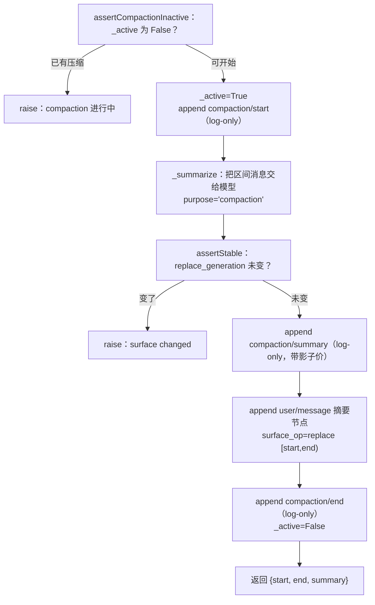

# 第 10 章 compaction 与 token 压力

> 窗口有限，对话不止；忘记不是删除，而是摘要。

## 本章回答的问题

- 第 7 章的 `estimate_message` 已经能把历史折算成 token 数，但对话只增不减——累计 token 撞上窗口上限时会发生什么？
- 第 3 章的持久化要求 `log` 完整、不能删除，模型却只能看见窗口内的内容——compaction 如何让两件事同时成立？
- 第 4 章的工具管线已经让模型发出工具调用、收回结果——compaction 压缩一段历史时，为什么不能从任意位置开始压？

第 9 章解决了「多个 agent 各自能看到哪些工具」——scope 把一张全局工具表拆成了分层、可继承、可限制的作用域。那是**横向**的资源隔离：同一时刻，不同 agent 看到的工具集合不同。

本章转向一种**纵向**的有限资源：上下文窗口。它对所有 agent 一视同仁——无论 scope 怎么切，单个会话能塞进模型的 token 总量是有上限的。而对话偏偏是单调增长的：每问一轮、每调一次工具，历史就厚一分。

其实我们早就埋好了伏笔。第 7 章的 `estimate_message` 已经能把每条消息折算成 token，`TokenMeter.measure` 能把一段 chunk 流折叠成一份 usage 快照——但那些数字只是被**计量**了，没有人**响应**它们。本章就是给这串数字装上一双手：当压力逼近窗口，自动把一段旧历史压缩成摘要，让对话得以继续。

本章教学代码以**第 7 章**为扩展基座（复用 `token_meter.py` 的 `estimate_message` 与 `llm_runtime.py` 的 `LlmRuntime`/`LlmAdapter`/`BlockAssembler`），并回到第 2 章的 `Session`/`Sessions` 之上做扩展。新增代码集中在 `ch10/code/`。

## 1. 无限增长的会话，必然撞墙

模型有一个硬性约束：**上下文窗口**。一次调用能接收的输入 token 总量不能超过它。而 agent 的工作方式恰恰是「每一轮都把全部历史带上」——于是 token 压力只涨不跌。

下面这个反面示例不做任何压缩，只是诚实地把每一轮的累计 token 数打印出来（复用第 7 章的 `estimate_message`）。为了看清过程，`[教学简化]` 把窗口缩小到 500：

```python
# ch10/code/bad_example.py（节选）
def main():
    # ... 横幅与说明输出省略 ...
    context_window = 500  # 教学示例把窗口缩小，便于看清过程
    # ... 两行说明输出省略 ...

    total = 0
    turn = 0
    while total < context_window:
        turn += 1
        user_msg = {"role": "user", "content": f"问题{turn}：" + "细节 " * 20}
        assistant_msg = {"role": "assistant", "content": f"回答{turn}：" + "分析 " * 20}
        total += estimate_message(user_msg) + estimate_message(assistant_msg)
        print(f"  第{turn:>2}轮：累计 tokens = {total:>4} / 窗口 = {context_window}")
    # ... 结尾输出省略（完整运行见下方输出块） ...
```

运行 `python3 ch10/code/bad_example.py`（输出节选，仅示首尾）：

```text
==============================================================
反面示例：无限增长的会话，必然撞上上下文窗口的墙
==============================================================

假设上下文窗口只有 500 tokens。
对话一轮轮进行，每轮追加一问一答：

  第 1轮：累计 tokens =   40 / 窗口 = 500
  ...
  第12轮：累计 tokens =  486 / 窗口 = 500
  第13轮：累计 tokens =  528 / 窗口 = 500

→ 第 13 轮后，累计 tokens 528 已超过窗口 500。
  此刻模型拒绝接收入输入：这一轮之后的对话再也进行不下去。
  而之前说过的所有内容，也因为装不进窗口而无法交给模型。

这就是 compaction 要解决的问题：
  上下文窗口是有限的，但对话必须继续。
```

问题被精确地暴露出来：**窗口有限，但对话必须继续。** 我们需要一种机制，在不丢失历史的前提下，把「模型将看到的内容」瘦回窗口之内。

这里立刻浮现出一对矛盾，也是本章的设计支点：

- **log 必须完整**：会话事件流是事实记录（第 3 章持久化的就是它），不能真的删。
- **模型只能看到窗口内的内容**：送进模型的消息必须足够少。

解法是把这两件事拆成**两层**：append-only 的 `log` 一层不动，另建一个**可以被替换**的 `surface`——模型真正看到的视图。下一章机制就从这里展开。

## 2. 机制一：surface——可被替换的有序视图

### 2.1 概念

`surface` 是会话的一个**有序视图**：它列出「会产生 LLM 消息的事件」的序号，模型调用时就按这个顺序取消息。并非所有事件都进 surface——只有三种类型会：

```python
# ch10/code/surface.py
SURFACE_EVENT_TYPES = ("user/message", "assistant/message", "tool/result")
```

`compaction/*` 这类过程性事件**不进** surface（模型不需要知道「我正在被压缩」），只进 log。

顺带交代一处跨章衔接（本次修订一并处理）：surface 与 `surface_op` 不是第 2 章 `Session` 的原生能力——第 2 章 `Session.append` 的 `[教学简化]` 注释当时把它们整体省略、留待后续章节，原标注为「第 3 章机制」。但 surface 实际是本章（第 10 章）引入的机制（第 3 章讲的是持久化）；本次修订已把第 2 章 `agent_loop.py` 该处章号引用更正为「第 10 章机制」。本章就来兑现这个预留的槽位。

surface 与 log 的关键差异在于：log 只追加，surface 可以被**整段替换**。替换通过一个 `surface_op` 描述：

```python
# ch10/code/surface.py
class SurfaceSession(Session):
    """带 surface 的会话：在 ch02 Session 之上加一层有序 surface 视图。

    两层结构（这是理解 compaction 的关键）：
    - log（继承自 Session）：追加式全量历史，compaction/* 事件只进这里；
    - surface（本章新增）：产生 LLM 消息的事件的有序视图，是模型真正「看到」的内容。

    压缩时不动 log，只在 surface 上把一段区间替换成一个摘要节点——
    历史可回溯（log 完整），模型上下文变小（surface 变短）。
    """

    def __init__(self, ctx, session_id):
        super().__init__(ctx, session_id)
        self.surface = []            # 有序 surface 节点列，元素是事件 seq
        self.replace_generation = 0  # 每次 replace +1，压缩事务的稳定性断言用

    def append(self, type, payload=None, surface_op=None):
        """追加事件；若是 surface 事件，按 surface_op 更新 surface。

        surface_op 两种形态（SurfaceOp，types.ts:372-374）：
        - None（等价 'append'）：追加到 surface 尾部（默认）；
        - {'op': 'replace', 'start': i, 'end': j}：用本事件这一个节点
          替换 surface[i:j] 整段区间（压缩摘要落盘就走这条）。
        """
        event = super().append(type, payload)
        if type in SURFACE_EVENT_TYPES:
            if isinstance(surface_op, dict) and surface_op.get("op") == "replace":
                start, end = surface_op["start"], surface_op["end"]
                # 把 [start, end) 区间替换为这一个节点（压缩摘要节点）
                self.surface[start:end] = [event.seq]
                self.replace_generation += 1
            else:
                self.surface.append(event.seq)
        # 非 surface 事件（compaction/* 等）只进 log、不进 surface
        return event
```

注意三个设计点：

1. **`super().append` 先执行**：无论 surface 怎么变，事件永远先进 log。这是「log 完整」的底层保证。
2. **replace 是切片赋值**：`self.surface[start:end] = [event.seq]` 把 `[start, end)` 这一段旧序号，换成新事件的单个序号——视图被「顶替」，log 里那些旧事件依然原样躺着。
3. **`replace_generation` 计数器**：每次替换自增。压缩是一个跨多步的事务，期间若有人偷偷改了 surface，计数就会对不上——它是事务收尾时的**稳定性断言**依据（§4 会用到）。

### 2.2 小结

surface 把「历史完整性」与「模型可见性」解耦：log 负责记住一切，surface 负责决定模型此刻看到什么。compaction 要做的，就是**安全地替换 surface 的一段**。

## 3. 机制二：token-meter 压力测量与阈值决策

### 3.1 概念

要决定「该不该压缩」，先得量出「现在有多满」。这一步复用第 7 章的计量能力，把整个会话的 surface 消息折算成 token，并给每个节点记账：

```python
# ch10/code/compaction.py
def measure_session(session):
    """测量会话 surface 的 token 压力 → TokenMeasurement。

    扩展第 7 章计量缝：真实源 tokenMeter.measure(session)
    （token-meter/src/index.ts:116）返回 totalTokens + 逐节点计价 nodes；
    教学版复用第 7 章 estimate_message，对每个 surface 节点逐一计价。
    返回 {'total_tokens': int, 'nodes': [{'seq': int, 'tokens': int}]}.
    """
    nodes = []
    total = 0
    for seq in session.surface:
        event = session.log[seq]
        message = event.payload.get("message", {})
        tokens = estimate_message(message)
        nodes.append({"seq": seq, "tokens": tokens})
        total += tokens
    return {"total_tokens": total, "nodes": nodes}
```

量出总压力后，还需要一条**策略**来决定「何时触发、保留多少」。`resolve_compact_spec` 把窗口大小换算成两个阈值：

```python
# ch10/code/compaction.py
def resolve_compact_spec(context_window, threshold_ratio=0.8, retain_ratio=0.16):
    """解析压缩参数（resolveCompactSpec，compaction-basic/index.ts:110）。

    - threshold：触发压缩的压力阈值 = context_window × threshold_ratio（默认 0.8）；
    - retain_tokens：压缩时尾部保留的 token 数 = context_window × retain_ratio（默认 0.16）。
    """
    return {
        "threshold": int(context_window * threshold_ratio),
        "retain_tokens": int(context_window * retain_ratio),
    }
```

两个比例各司其职：`threshold` 回答「**何时**压」，`retain_tokens` 回答「压完**留多少**」。`[教学简化]` 用固定比例代替源码里可按模型/配置调整的更细策略，但「阈值 + 保留量」这对结构是一致的。

### 3.2 阈值决策

有了 spec，`compact_if_needed` 就能做决策——测压力、比阈值，达标才真正去压：

```python
    # ch10/code/compaction.py（BasicCompactionEngine）
    def compact_if_needed(self, session, trigger="pressure"):
        """压力触发：测 token 压力，达阈值才压缩；未达返回 None。"""
        measurement = measure_session(session)
        spec = resolve_compact_spec(self.context_window,
                                    self.threshold_ratio, self.retain_ratio)
        if measurement["total_tokens"] < spec["threshold"]:
            return None  # 压力未达，不压
        return self._compact(session, measurement, spec, trigger)
```

`trigger` 参数标明这次压缩的来由，会被记进 `compaction/start` 事件。源码区分两种触发语义：`'pressure'`（压力逼近窗口的**主动**阈值策略，在撞墙前减速）与 `'context-overflow'`（调用已因超长被拒后的**被动**恢复策略，是最后的兜底）。教学版用 `compact_if_needed` 演示阈值决策这条常态路径；溢出恢复在源码里复用同一套压缩事务，只是来由不同。

### 3.3 小结

token-meter 把「上下文有多满」变成一个可比较的数字，`resolve_compact_spec` 把窗口换算成「何时压、留多少」的策略，`compact_if_needed` 据此做阈值决策。数字终于有了响应它的动作。

## 4. 机制三：compaction seam 与压缩事务

### 4.1 seam 三角色

compaction 是一个标准的 capability seam（第 5 章的三角色在这里再次登场）：

```mermaid
flowchart LR
    subgraph SD["Service Definition<br/>compaction/"]
        CE["CompactionEngine（抽象接口）<br/>compactIfNeeded / compactNow / compactRegion"]
    end
    subgraph SP["Service Provider<br/>compaction-basic/"]
        BCE["BasicCompactionEngine<br/>（调模型做摘要的实现）"]
    end
    subgraph CS["Consumer<br/>command-compact/"]
        CMD["/compact 命令"]
    end
    BCE -.实现.-> CE
    CMD -.消费 ctx.compactionEngine.-> CE
```

- **Service Definition**：`CompactionEngine` 抽象接口，定义三个动词。
- **Service Provider**：`BasicCompactionEngine`，真正调模型生成摘要的实现。
- **Consumer**：`/compact` 命令（手动触发）与压力触发（自动）都消费同一个 `ctx.compactionEngine`。

三个动词对应三种触发姿态：

| 动词 | 语义 | 触发方 |
|------|------|--------|
| `compact_if_needed` | 压力到了才压 | 自动（pressure） |
| `compact_now` | 现在就压，不看压力 | 手动（`/compact`） |
| `compact_region` | 压指定区间 | 精确控制 |

教学代码里，`CompactionEngine` 用抽象基类钉住这三个动词：

```python
# ch10/code/compaction.py
class CompactionEngine(ABC):
    """compaction 服务定义（CompactionEngine，compaction/index.ts:19）。

    三动词：compact_if_needed / compact_now / compact_region。
    抽象类自身不注册服务——ctx.compactionEngine 是否存在由提供者决定，
    消费者须先判存在（这正是 seam 三角色的「定义不保证实现」）。
    """

    @abstractmethod
    def compact_if_needed(self, session, trigger):
        """压力触发：测压力、达阈值才压（index.ts:21）。"""

    @abstractmethod
    def compact_now(self, session, trigger):
        """立即压缩：/compact 命令走这条（index.ts:24）。"""

    @abstractmethod
    def compact_region(self, session, region, trigger):
        """压缩指定区间（index.ts:27）。"""
```

`BasicCompactionEngine` 逐一实现这三个动词。`__init__` 收下上下文窗口与两个比例、初始化压缩锁，并 `ctx.provide("compactionEngine", self)` 把自己挂到 seam 上供消费者使用：

```python
    # ch10/code/compaction.py（BasicCompactionEngine）
    def __init__(self, ctx, context_window, threshold_ratio=0.8, retain_ratio=0.16):
        self.ctx = ctx
        self.context_window = context_window
        self.threshold_ratio = threshold_ratio
        self.retain_ratio = retain_ratio
        self._active = False  # 压缩锁（assertCompactionInactive，index.ts:149）
        ctx.provide("compactionEngine", self)
```

三个动词里，`compact_if_needed`（§4.1 已示）先测压力、达阈值才压；`compact_now` 则**不看压力、直接压**——`/compact` 命令走的就是这条，它测量后径直进 `_compact`，没有那道阈值闸：

```python
    # ch10/code/compaction.py（BasicCompactionEngine）
    def compact_now(self, session, trigger="manual"):
        """立即压缩（/compact 命令走这条，command-compact/index.ts:13）。"""
        measurement = measure_session(session)
        spec = resolve_compact_spec(self.context_window,
                                    self.threshold_ratio, self.retain_ratio)
        return self._compact(session, measurement, spec, trigger)
```

两段并排看即见差异：`compact_if_needed` 比 `compact_now` 多一道 `if measurement["total_tokens"] < spec["threshold"]: return None` 的闸；`compact_now` 没有这道闸，所以「现在就压」。第三个动词 `compact_region` 的实现见下文「压缩事务」。

### 4.2 选区间：切点必须落在配对平衡点

压缩第一步是选出「压哪一段」。直觉是「保留尾部 `retain_tokens`，前面全压」，但有一个陷阱：**切点不能落在一次工具调用和它的结果之间**。模型协议要求 tool-call 与 tool-result 成对出现——切开它们，送进模型的消息就是非法的。

为此引入**工具配对余额**：从 surface 头部扫到某个位置，累计「遇到的工具调用数 − 遇到的工具结果数」。余额为 0，说明到此处为止所有调用都已配对，是安全切点。

```python
# ch10/code/compaction.py
def count_tool_calls(message):
    """统计一条 assistant 消息里 tool-call 内容块的个数。"""
    content = message.get("content")
    if not isinstance(content, list):
        return 0
    return sum(1 for block in content
               if isinstance(block, dict) and block.get("type") == "tool-call")


def tool_pairing_balanced_before(session, index):
    """工具配对余额（toolPairingBalancedBefore，session/surface.ts:114）：
    surface[:index] 内 assistant 工具调用数 − tool/result 数。

    == 0：切点之前的工具调用都有成对结果，可在此安全切开；
    != 0：切点落在一对工具调用/结果中间，必须回退。
    """
    balance = 0
    for seq in session.surface[:index]:
        event = session.log[seq]
        if event.type == "assistant/message":
            balance += count_tool_calls(event.payload.get("message", {}))
        elif event.type == "tool/result":
            balance -= 1
    return balance
```

有了余额判定，`select_compactable_range` 就能选出安全区间：

```python
# ch10/code/compaction.py
def select_compactable_range(session, measurement, retain_tokens):
    """选出可压缩区间（selectCompactableRange，compaction-basic/index.ts:122）。

    步骤：
    1. 保留尾部：从尾向前累计 retain_tokens 的节点作为「保留尾」；
    2. 把切点回退到工具配对平衡点（balance == 0），避免切断工具调用/结果对；
    3. 返回待压缩区间 {'start': 0, 'end': cut}；无可压缩返回 None。
    """
    nodes = measurement["nodes"]
    n = len(nodes)
    if n == 0:
        return None
    # 1. 保留尾部：从尾向前累计，再加一个就超 retain_tokens 时停下
    tail_tokens = 0
    cut = n
    for i in range(n - 1, -1, -1):
        if tail_tokens + nodes[i]["tokens"] > retain_tokens:
            break
        tail_tokens += nodes[i]["tokens"]
        cut = i
    # 2. 回退到工具配对平衡点：balance(cut) != 0 就继续回退
    while cut > 0 and tool_pairing_balanced_before(session, cut) != 0:
        cut -= 1
    if cut <= 0:
        return None  # 无可压缩
    return {"start": 0, "end": cut}
```

两段循环各管一件事：`for` 从尾部往前凑够 `retain_tokens`，得到 tentative 切点；`while` 检查该切点的配对余额，不为 0 就继续回退，直到落在平衡点。回退意味着**少压一点**——宁可保留得多一些，也不能切开工具对。

### 4.3 压缩事务：一次原子的替换

选好区间后进入压缩事务。`_compact` 只是个薄封装——选区间、委托给 `compact_region`：

```python
    # ch10/code/compaction.py（BasicCompactionEngine）
    def _compact(self, session, measurement, spec, trigger):
        """选区间并执行压缩事务；无可压缩区间返回 None。"""
        region = select_compactable_range(session, measurement, spec["retain_tokens"])
        if region is None:
            return None
        return self.compact_region(session, region, trigger)
```

真正的事务在 `compact_region`，它是本章的核心流程：



对应代码：

```python
    # ch10/code/compaction.py（BasicCompactionEngine）
    def compact_region(self, session, region, trigger):
        """单次压缩事务（compactSurfaceRegion，compaction-basic/index.ts:144）。

        上锁 → compaction/start → 摘要 → 稳定性断言 → compaction/summary
        → 提交（user/message + surfaceOp replace）→ compaction/end → 解锁。

        关键协议：compaction/* 事件全部 log-only（只进 log、不进 surface），
        真正替换 surface 的是最后那条携带 surfaceOp 的 user/message。
        """
        if self._active:
            raise RuntimeError("compaction already in progress (assertCompactionInactive)")
        start, end = region["start"], region["end"]
        self._active = True
        session.append("compaction/start", {"trigger": trigger})
        try:
            gen_before = session.replace_generation
            summary, shadow_price = self._summarize(session, region)
            # 稳定性断言（assertStable，compaction/index.ts:154）：摘要期间
            # surface 不得发生 replace。教学版同步单线程恒成立，真实异步场景是防线。
            if session.replace_generation != gen_before:
                raise RuntimeError("surface changed during compaction (assertStable)")
            # compaction/summary：log-only，携带摘要文本与影子价
            session.append("compaction/summary",
                           {"summary": summary, "shadowPrice": shadow_price})
            # 提交：追加携带 surfaceOp replace 的 user/message，真正替换 surface
            checkpoint_message = {
                "role": "user",
                "content": f"[对话摘要] {summary}",
                "checkpointSource": compact_checkpoint_source(),
            }
            session.append("user/message", {"message": checkpoint_message},
                           surface_op={"op": "replace", "start": start, "end": end})
        finally:
            session.append("compaction/end", {})
            self._active = False
        return {"start": start, "end": end, "summary": summary}
```

逐步拆解几个不那么显然的设计：

- **`_active` 锁（assertCompactionInactive）**：压缩是独占操作，进行中再来一次直接 raise，防止两次压缩并发改 surface。`finally` 里无论成败都复位 `_active` 并补一条 `compaction/end`。
- **`compaction/*` 事件 log-only**：`compaction/start`、`compaction/summary`、`compaction/end` 都走 `session.append`，但它们的类型不在 `SURFACE_EVENT_TYPES` 里，于是只进 log、不进 surface。它们是「关于压缩的记录」，不是「对话内容」，模型不该看到；但 log 里留下完整痕迹，事后可审计「这段历史是什么时候、被谁、压成了什么」。
- **`assertStable`（`replace_generation` 断言）**：压缩不是瞬时完成的，`_summarize` 要等模型流式返回。这段时间里若 surface 被别的写入改动，基于旧视图算出的 `[start, end)` 就不再可信——于是比对 `replace_generation`，变了就 raise，绝不拿过期的切点去替换。
- **`checkpointSource`**：摘要节点的 message 带一个来源标记 `{kind:'plugin', plugin:'compact'}`，表明这条 user 消息不是真人说的，而是压缩产物。回放、调试、再次压缩时都能认出它。
- **影子价（shadowPrice）**：`compaction/summary` 事件记下这次压缩「对冲」掉的 token 数，供后续成本核算。

事务里还用到两个模块级助手，一并给出：

```python
# ch10/code/compaction.py
COMPACTION_INSTRUCTION = (
    "请把上面的对话压缩成一份简明摘要：保留关键决策、结论、工具执行结果与未完成任务，"
    "使对话可以基于这份摘要继续。"
)

# ... measure_session / resolve_compact_spec / 配对余额与区间选择等函数省略（见 §3、§4） ...

def compact_checkpoint_source():
    """检查点来源标记（compactCheckpointSource，compaction-basic/index.ts:106）。"""
    return {"kind": "plugin", "plugin": "compact"}
```

`COMPACTION_INSTRUCTION` 钉住了「摘要要保留什么」——关键决策、结论、工具执行结果、未完成任务，它就是 `_summarize` 追加给模型的那条指令；`compact_checkpoint_source()` 返回 `{kind:'plugin', plugin:'compact'}`，即上面 `checkpointSource` 用的来源标记。

摘要本身复用第 7 章的流式管线——把区间消息加上压缩指令，交给 `ctx.llm.stream`（`purpose="compaction"` 经 `**options` 传入），用 `BlockAssembler` 把 chunk 流组装成文本：

```python
    # ch10/code/compaction.py（BasicCompactionEngine）
    def _summarize(self, session, region):
        """生成摘要（summarizeWithLlm，compaction-basic/index.ts:230）。

        把压缩区间消息 + COMPACTION_INSTRUCTION 交给 LLM，purpose='compaction'。
        返回 (summary_text, shadow_price)。

        [教学简化] 真实源会先重放 system/tools/messages 前缀再追加指令（复用
        KV-cache，降低摘要调用成本）；教学版只发压缩区间消息 + 指令。
        影子价 = 压缩区间 token 数（摘要「对冲」掉的部分）。
        """
        start, end = region["start"], region["end"]
        region_messages = []
        for seq in session.surface[start:end]:
            event = session.log[seq]
            message = event.payload.get("message")
            if message is not None:
                region_messages.append(message)
        shadow_price = sum(estimate_message(m) for m in region_messages)
        request_messages = region_messages + [
            {"role": "user", "content": COMPACTION_INSTRUCTION}
        ]
        assembler = BlockAssembler()
        for chunk in self.ctx.llm.stream(request_messages, purpose="compaction"):
            assembler.push(chunk)
        summary = "".join(
            block.get("text", "") for block in assembler.blocks
            if block.get("type") == "text"
        )
        return summary, shadow_price
```

`purpose='compaction'` 这个用途标记在真实系统里供 provider 做 **KV-cache 复用**——压缩调用与主对话共享前缀缓存，省钱省时；教学桩里它只是被 `FakeCompactionAdapter` 用来区分「该返回摘要还是普通回复」。

### 4.4 小结

compaction seam 用三个动词钉住触发姿态；`select_compactable_range` 用配对余额保证切点安全；`compact_region` 用一次带锁、带稳定性断言、log-only 事件齐全的事务，把一段 surface 原子地替换成摘要。**log 一字未删，模型看到的内容却瘦了下来**——§1 的矛盾就此化解。

## 5. 机制四：tool-result-pruner——不调模型的轻量修剪

### 5.1 概念

并非所有瘦身都要请模型。有一类 token 大户特别常见：**超长的工具结果**——读一个大文件、抓一页网页，单次 `tool/result` 就能占掉几千 token。对这种「中段冗余、头尾有用」的内容，可以不调模型、直接做字符级修剪：

```python
# ch10/code/compaction.py
PRUNE_MARKER = "\n…[中段已修剪]…\n"


def prune_tool_result(text, keep_chars=20):
    """无模型修剪（tool-result-pruner，compaction-tool-result-pruner/src/index.ts）。

    是什么：不调用 LLM，直接把超大的 tool/result 文本「掐头去尾留中间标记」。
    解决什么：单个工具结果（如读一个大文件）就可能撑爆上下文，为它专门跑一次
    摘要 LLM 调用既贵又慢；无模型修剪零成本、即时生效。

    [教学简化] 真实版按 Unicode code point 计量、逐候选节点评估，并走
    「compaction/prune 影子价 + tool/result replace」协议落盘；教学版只对单个
    字符串演示掐头去尾，协议与主压缩一致（log-only 事件 + surface 替换）。
    """
    if len(text) <= keep_chars * 2:
        return text  # 不够大，不修剪
    return text[:keep_chars] + PRUNE_MARKER + text[-keep_chars:]
```

「**不调模型、就地缩短单个工具结果**」是它的本质。真实系统里它由独立的 `compaction-tool-result-pruner` 提供，触发时发出 `compaction/prune` 事件（同样 log-only）。

### 5.2 与 compaction 的分工

| | tool-result-pruner | compaction |
|---|---|---|
| 是否调模型 | 否（纯字符级） | 是（生成摘要） |
| 作用对象 | 单个工具结果 | 一整段对话历史 |
| 成本 | 极低 | 一次模型调用 |
| 信息损失方式 | 截断中段 | 摘要浓缩 |

实践中往往先 prune 再 compact：先把最廉价的修剪做掉，若压力仍超阈值，才动用模型摘要。

### 5.3 小结

pruner 提醒我们：**压缩有轻重之分**。能用字符级修剪解决的，就不必升级到模型摘要。seam 的设计让这两种手段可以独立注册、按需组合。

## 6. 完整运行输出

把四个机制装配起来跑一遍。`main.py` 的装配关系正是 §4 的 seam 三角色：`SurfaceSessions` 提供会话、`LlmRuntime + FakeCompactionAdapter` 提供摘要能力、`BasicCompactionEngine` 作为 `ctx.compactionEngine` 提供者。

装配里有两个此前未露面的组件，先交代清楚：

- **`SurfaceSessions`**：继承第 2 章 `Sessions`、只覆写 `create` 的会话**服务**——让它创建出来的会话是带 surface 的 `SurfaceSession`（而非普通 `Session`）。`main.py` 正是用它 `create()` 出演示会话的；`SurfaceSession` 则是被创建出来的那个会话对象（§2 已示）。
- **`FakeCompactionAdapter`**：第 7 章 `LlmAdapter` 的假实现（桩）。它的 `stream` 收到 `purpose='compaction'` 的请求就返回一段**固定摘要文本**，其余请求返回普通回复——所以演示里的摘要并非真实模型生成，而是桩按约定吐出来的，整个演示可离线运行。

运行 `python3 ch10/code/main.py`（输出节选：省略压缩前的重复消息与 log 中段）：

```text
==============================================================
第 10 章：compaction 与 token 压力
==============================================================

装配：context_window=500  threshold=400  retain_tokens=80

[压缩前：会话已增长]
  surface 节点数=12  token 压力=456  replace_generation=0
  模型将看到的消息：
    - user: 问题0：请讲解模块0的设计 细节 细节 细节 细节 细节 细节 细节 细节 细节 细
    - assistant: 回答0：模块0的设计如下 分析 分析 分析 分析 分析 分析 分析 分析 分析 分析
    ...（共 12 条，此处省略中间 8 条）...
    - user: 问题5：请讲解模块5的设计 细节 细节 细节 细节 细节 细节 细节 细节 细节 细
    - assistant: 回答5：模块5的设计如下 分析 分析 分析 分析 分析 分析 分析 分析 分析 分析

[压力触发] engine.compact_if_needed(session, trigger='pressure')
  压缩完成：区间 [0, 10) 被替换为摘要节点
  摘要内容：压缩了 10 条对话：讨论了项目方案，确认了技术选型，决定继续推进任务。

[压缩后：surface 被替换]
  surface 节点数=3  token 压力=91  replace_generation=1
  模型将看到的消息：
    - user: [对话摘要] 压缩了 10 条对话：讨论了项目方案，确认了技术选型，决定继续推进任务
    - user: 问题5：请讲解模块5的设计 细节 细节 细节 细节 细节 细节 细节 细节 细节 细
    - assistant: 回答5：模块5的设计如下 分析 分析 分析 分析 分析 分析 分析 分析 分析 分析

[log 完整] log 中的事件（compaction/* 只进 log、不进 surface）：
  seq= 0  user/message         (已移出 surface)
  seq= 1  assistant/message    (已移出 surface)
  ...（seq 2–9 均为已移出 surface 的旧对话）...
  seq=10  user/message         (surface)
  seq=11  assistant/message    (surface)
  seq=12  compaction/start     (log-only)
  seq=13  compaction/summary   (log-only)
  seq=14  user/message         (surface)
  seq=15  compaction/end       (log-only)

[工具配对余额] 切点必须落在配对平衡点
  surface 有 4 个节点，各节点 tokens=[6, 5, 10, 9]
  retain_tokens=19 → tentative 切点=2（工具调用与它的结果之间）
  balance(2)=1（≠0，落在工具对中间）
  回退后切点 end=1，balance(1)=0（安全）
  → 压缩 [0, 1)，保留工具调用/结果对完整

==============================================================
运行完成
```

输出逐段印证了本章机制：

- **压力触发**：压缩前 12 节点、456 token，超过 threshold=400，`compact_if_needed` 触发；压缩后 3 节点、91 token，`replace_generation` 从 0 变 1。
- **log 完整**：seq 0–9 的旧对话**已移出 surface**（但一字未删地留在 log 里）；`compaction/start|summary|end` 三条过程事件则是**类型 log-only**（从不进 surface）。两种「只在 log」来源不同：前者是 surface 类型事件被替换出去，后者是事件类型本就不进 surface。
- **配对余额**：聚焦示例里 tentative 切点=2 恰好落在工具调用与结果之间（balance=1），算法回退到 end=1（balance=0），宁可少压也不切开工具对。

## 7. 源码对照

| 教学代码（`ch10/code/`） | 源码（`packages/compaction*`） | 说明 |
|---|---|---|
| `surface.py` `SurfaceSession` | core Session 的 surface 投影 | 教学版把 surface 显式建成 seq 列表 |
| `SURFACE_EVENT_TYPES` | surface 事件类型判定 | 三种产生 LLM 消息的事件 |
| `replace_generation` | surface 稳定性断言 | 事务收尾比对 |
| `measure_session` | token-meter 测量 | 复用第 7 章 `estimate_message` |
| `resolve_compact_spec` | 压缩策略解析 | 教学版用固定比例 `[教学简化]` |
| `CompactionEngine`（ABC） | `compaction/` Service Definition | 三动词接口 |
| `BasicCompactionEngine` | `compaction-basic/` Provider | 调模型摘要的实现 |
| `select_compactable_range` / `tool_pairing_balanced_before` | 压缩区间选择 + 工具配对校验 | 切点回退到平衡点 |
| `compact_region` 事务 | compaction 事务（compactSurfaceRegion） | `_active` 锁 / start / summarize / assertStable / summary / replace / end |
| 影子价 `shadowPrice` | 压缩对冲掉的 token 数 | 记入 `compaction/summary` 事件 |
| `purpose='compaction'` | 压缩调用用途标记 | 供 KV-cache 复用 |
| `compact_checkpoint_source` | 摘要节点 `checkpointSource` | `{kind:'plugin', plugin:'compact'}` |
| `prune_tool_result` | `compaction-tool-result-pruner` | 教学版按字符修剪 `[教学简化]` |

## 8. 小结与预告

本章给第 7 章埋下的 token 数字装上了响应它的手。核心收获：

1. **两层模型**：log append-only 记住一切，surface 是可被替换的有序视图。compaction 只动 surface，不碰 log。
2. **压力决策**：`measure_session` 量出压力，`resolve_compact_spec` 换算出 threshold 与 retain_tokens，`compact_if_needed` 做阈值决策；源码另以 overflow 触发作溢出兜底。
3. **安全切点**：工具配对余额保证切点不落在 tool-call 与 tool-result 之间，必要时回退。
4. **压缩事务**：带锁、带 `replace_generation` 稳定性断言、`compaction/*` 事件 log-only，把一段 surface 原子地替换成摘要节点。
5. **轻重分工**：tool-result-pruner 用字符级修剪处理超长工具结果，不必事事都请模型。

下一章（第 11 章）进入 **subagent 委派**：当一个任务太大、太杂，主 agent 不再独自扛，而是派生出子 agent 分头去做。我们会看到本章的 surface/compaction 心智如何在「父子会话」之间继续发挥作用——子 agent 有自己独立的上下文窗口，正是对 token 压力的又一次分治。

## 9. 附录：关键概念速查表

| 概念 | 一句话 | 首次出现 |
|---|---|---|
| surface | 会话中「会产生 LLM 消息的事件」的有序视图，可被整段替换 | §2 |
| log / surface 两层 | log append-only 完整保留，surface 决定模型此刻看到什么 | §2 |
| `replace_generation` | 每次 surface 替换自增的计数，供压缩事务做稳定性断言 | §2 |
| token 压力 | 会话 surface 消息折算出的总 token 数 | §3 |
| threshold / retain_tokens | 触发压缩的压力阈值 / 压缩后至少保留的尾部 token | §3 |
| pressure 触发 | 压力逼近窗口的主动压缩（阈值策略） | §3 |
| context-overflow 触发 | 已溢出后的被动恢复压缩 | §3 |
| compaction seam | Service Definition（接口）/ Provider（实现）/ Consumer（命令）三角色 | §4 |
| 三动词 | `compact_if_needed` / `compact_now` / `compact_region` | §4 |
| 工具配对余额 | 扫描到某位置时「工具调用数 − 工具结果数」，为 0 才是安全切点 | §4 |
| 压缩事务 | `_active` 锁 → start → summarize → assertStable → summary → replace → end | §4 |
| 影子价 shadowPrice | 压缩对冲掉的 token 数，记入 compaction/summary | §4 |
| `compaction/*` log-only | 压缩过程事件只进 log、不进 surface | §4 |
| `purpose='compaction'` | 压缩调用用途标记，供 KV-cache 复用 | §4 |
| checkpoint source | 摘要节点的来源标记 `{kind:'plugin', plugin:'compact'}` | §4 |
| tool-result-pruner | 不调模型、字符级修剪超长工具结果 | §5 |
