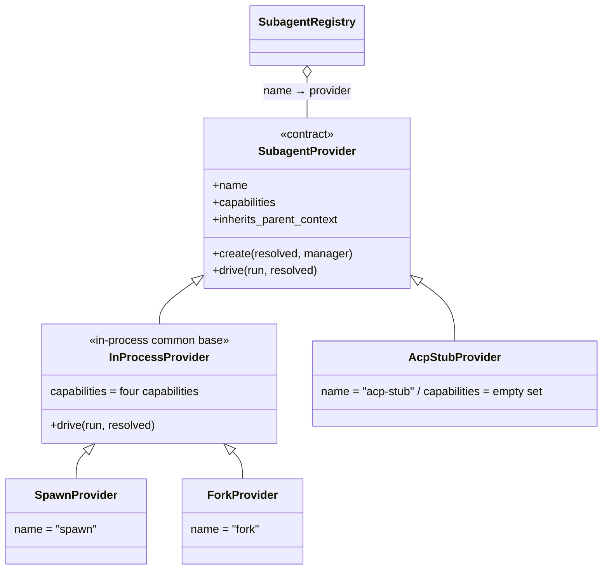
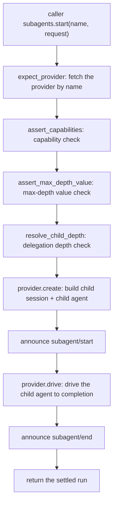

# Chapter 11: subagent Delegation: Giving a Subtask Its Own Session

> Delegate the task, not the conversation.

## Questions this chapter answers

1. Chapter 2's agent loop is a one-session-per-agent closed loop — why should a subtask run in its own session instead of directly inside the main agent's conversation?
2. Chapter 5's seam abstracts capabilities into contracts with implementations registered into them — how do multiple delegation transports share a single entry point?
3. Chapter 4's tools are all registered into `ctx.tools` and invoked by the model — how does the model trigger delegation on its own?

Chapter 2 built the minimal agent-loop: `Sessions` opens sessions, `AgentLoop` assembles a `ReactLoopAgent`, and the agent advances turn by turn in its own session. But that closed loop only serves **one** agent — when the main agent wants to hand off a subtask like "investigate module A", Chapter 2's code has no entry point for it.

This chapter adds that entry point: the main agent **delegates** a subtask to a **subagent** — the child agent executes independently in its own session, and only the result returns to the main conversation when done. The child agent's creation reuses Chapter 2's `AgentLoop.create` (one agent per session), the delegation tools register into Chapter 4's `ctx.tools`, and the seam's three roles (definition layer / implementation layer / consumer layer) reuse Chapter 5's terminology. This chapter reuses `ch01/cordis.py`, `ch02/agent_loop.py`, and `ch04/tools.py`; the new code lives in `ch11/code/`.

## 1. Three Pits of Inline Subtasks

First, the counter-example: the subtask is processed inline, directly in the main session.

```python
# ch11/code/bad_example.py (core part, full file in the code directory)
MAIN_SESSION = []  # the main session: globally unique, shared by the main conversation and all subtasks


def run_subtask_inline(task, depth=0):
    """Execute a subtask inline: process events append directly into the main session (pit ①), the call style is hard-wired (pit ②)."""
    pad = "  " * depth
    MAIN_SESSION.append(f"{pad}[subtask] start {task}")
    MAIN_SESSION.append(f"{pad}[subtask] explore step 1: read the logs...")
    MAIN_SESSION.append(f"{pad}[subtask] explore step 2: reproduce the failure...")
    if depth == 0:
        # a subtask nests another subtask: recursion has no depth bound (pit ③)
        run_subtask_inline(f"submodule investigation of {task}", depth + 1)
    result = f"conclusion of {task}"
    MAIN_SESSION.append(f"{pad}[subtask] end → {result}")
    return result


def main():
    MAIN_SESSION.append("[main conversation] user: summarize the project progress")
    answer = run_subtask_inline("investigate module A")
    MAIN_SESSION.append(f"[main conversation] assistant: project progress is normal ({answer})")
```

Run it:

```text
$ python3 bad_example.py
the main session has 10 events total, only 2 belong to the main conversation:
  [main conversation] user: summarize the project progress
  [subtask] start investigate module A
  ...(8 intermediate events: the explore steps, plus the whole nested "submodule investigation" process)
  [main conversation] assistant: project progress is normal (conclusion of investigate module A)
want to swap "investigation" for a separate-process execution? you can only edit every call site of run_subtask_inline.
```

Three pits:

1. **Context drowning**: only 2 of the main session's 10 events belong to the main conversation. The subtask's exploration process — in a real system, tool calls, intermediate output, and error retries too — all flood into the main conversation, and the main agent's context gets dirtier with every step. Yet all the main agent actually needs is that one "conclusion" line.
2. **Hard-wired execution style**: `run_subtask_inline` is a bare function call. To switch to "let the child agent carry the main conversation's history" or "throw it into a separate process", you'd have to edit the function body and every call site. What's missing is a replaceable abstraction for "how a child agent is created".
3. **Depth out of control**: a subtask can nest another subtask, with no bound on the recursion. In a real system a child agent can delegate again, and the delegation chain grows without limit — every layer consumes resources, yet nobody can say which layer we're on.

The three pits point at the same set of gaps: the delegation transport must be **registrable**, the subtask must be **isolatable**, and the delegation chain must be **countable**. The sections below fill them in that order.

## 2. SubagentRegistry: Delegation Transports Are Registered In, Not Hard-Coded

### 2.1 The provider Contract: First Define What a "Delegation Transport" Looks Like

Pit ② says the execution style is hard-wired. The cure is the same road as Chapter 5's capability seam: abstract "how a child agent is created" into a contract, have each concrete transport implement the contract and register in, and let callers face only a unified entry point. Each implementation of the contract is called a **provider** — reusing Chapter 5's usage: a named capability provider, except that what it provides here is not a shell command but a "transport for a child agent".

The contract itself (teaching symbol `SubagentProvider`, corresponding to `SubagentProvider` in `types.ts:285`):

```python
# ch11/code/subagent_runtime.py (module-level, full file in the code directory)
class SubagentProvider(ABC):
    """Transport provider contract: name + capabilities + inherits_parent_context + create/drive."""

    name = ""                          # transport name, the registry key (spawn/fork/...)
    capabilities = frozenset()         # the capability set this transport supports (detailed in 2.3)
    inherits_parent_context = False    # whether the child agent inherits the parent context

    @abstractmethod
    def create(self, resolved, manager):
        """Build the child session + child agent, return the run context (not yet driven)."""

    @abstractmethod
    def drive(self, run, resolved):
        """Drive the child agent to completion, return the settlement result."""
```

The four members each do one thing: `name` is the registry key; `capabilities` declares "which features this transport supports"; `inherits_parent_context` answers "whether the child agent inherits the parent conversation's history"; `create`/`drive` are two actions — create the child agent, drive the child agent. [teaching decision G1] The real contract is a single `start` (returning a run handle with a Promise); the teaching version synchronizes it by splitting into `create` + `drive`, and the seam broadcasts lifecycle events between the two steps, keeping the event order identical to the real version.

First look at what a concrete provider looks like: `SpawnProvider` declares `name="spawn"` and `inherits_parent_context=False` — the child agent starts from zero; its `create` is a single line calling `start_in_process_run(resolved, manager, self.name)` (full implementation in §3.3, where its two siblings `fork` and `acp-stub` also appear together). At that point this chapter's seam three-role mapping is complete: the definition layer is the `SubagentProvider` contract, the implementation layer is the three concrete providers `SpawnProvider`/`ForkProvider`/`AcpStubProvider`, and the consumer layer is the model-facing `SubagentTool` (§5).

### 2.2 Inside the Registry: Register by Name, Reject Duplicates, Roll Back the Effect

The **provider registry** (teaching symbol `SubagentRegistry`, corresponding to the `providers` Map inside `SubagentRuntime` at `index.ts:172`) is a "name → provider" table with three rules: register by name, reject duplicates, and registration is a reversible effect.

```python
# ch11/code/subagent_runtime.py (module-level)
class SubagentRegistry:
    """Provider registry (the providers Map of SubagentRuntime, index.ts:172)."""

    def __init__(self, ctx):
        self.ctx = ctx
        self._providers: dict[str, SubagentProvider] = {}

    def register_provider(self, provider):
        """Register by name + reject duplicates + effect rollback (registerProvider, index.ts:369)."""
        name = provider.name
        if name in self._providers:
            raise SubagentError("DUPLICATE_PROVIDER", f"duplicate provider name: {provider.name}")
        self._providers[name] = provider
        self.ctx.emit("subagent/provider-added", {"name": provider.name})

        def unregister():
            self._providers.pop(name, None)

        # effect runs the lambda immediately and collects its returned cleanup (cordis.py:167): unregistering = deregistering
        return self.ctx.effect(lambda: unregister, label=f"subagent-provider:{provider.name}")

    # ... expect_provider (fetch by name, raise UNKNOWN_PROVIDER if missing, expectProvider index.ts:449)
    # ... and list_providers (list by insertion order, list index.ts:400) omitted, see the code file ...
```

The registry family — one contract, three implementations — looks like this:



Two behaviors are worth demonstrating on the spot. A duplicate registration is rejected immediately (the error carries a machine-readable code):

```text
rejected: DUPLICATE_PROVIDER: duplicate provider name: spawn
```

Registration is a reversible effect: `register_provider` returns a disposer, and calling it deregisters — this is Chapter 1's effect paradigm (registration itself is a revocable effect):

```text
provider list after rollback: ['fork', 'spawn']   # acp-stub has been deregistered
```

### 2.3 Capability Whitelist: the First Gate Before start

The **capabilities** a provider declares are the set of features it supports. The source project defines four: `output_schema` (structured output), `depth_limit` (depth limiting), `tool_filter` (tool filtering), and `persona` (role persona). In-process transports support all four; out-of-process transports (the four siblings acp/codex/claude-code/dsh-sdk) launch a separate OS process via `ctx.subprocess.spawn` (the out-of-process world is Chapter 6), and precisely because they are not in this process, none of the in-process fine-grained controls are possible — all four capabilities are false.

The seam checks item by item before creating the child agent: whichever feature the request uses, the provider must declare the corresponding capability:

```python
# ch11/code/subagent_runtime.py (module-level)
ALL_CAPABILITIES = ("output_schema", "depth_limit", "tool_filter", "persona")

# request field -> required capability: output_schema→output_schema, max_depth→depth_limit,
# tool_filter→tool_filter, persona→persona (REQUEST_CAPABILITY, full dict in the code file)


def assert_capabilities(provider, request):
    """Capability check (assertCapabilities, index.ts:481): raise UNSUPPORTED_CAPABILITY when a capability is missing."""
    for field_name, capability in REQUEST_CAPABILITY.items():
        if field_name in request and capability not in provider.capabilities:
            raise SubagentError(
                "UNSUPPORTED_CAPABILITY",
                f"provider '{provider.name}' does not support capability '{capability}' (request used {field_name})")
```

The check happens before the child agent is created. Delegate a task carrying `persona` to the out-of-process transport `acp-stub`, and it is rejected immediately:

```text
rejected: UNSUPPORTED_CAPABILITY: provider 'acp-stub' does not support capability 'persona' (request used persona)
```

This is the design intent of the capability whitelist: not "fail after it starts running", but the seam rejects unsupported requests at the entry — the caller gets a clear error code, and the child agent is never created.

### 2.4 Wrap-up

Pit ② solved: delegation transports are registered in, the caller faces only the registry, and swapping a transport only swaps a name. But the entry point itself isn't built yet — how exactly does a subtask run in its own session, and how does the result come back? See §3.

## 3. One-Shot Delegation: SubagentManager.start

### 3.1 The start Pipeline at a Glance

First define two words used throughout the chapter. **One-shot**: the child agent finishes the task in one go, settles immediately, and the run ends — the simplest form of delegation (the "continuable" form is §5.3). **Settle**: a run reaches a terminal state (`completed`/`killed`), and its result is fixed.

The entry point is `SubagentManager` — the Service registered as `ctx.subagents` (the teaching version of `SubagentRuntime`, `index.ts:171`). From the user's perspective the minimal example is one line:

```python
# the main agent delegates the task to a spawn-transport child agent and gets back the settled run context
run = subagents.start("spawn", {"parent": main_agent, "prompt": "investigate why module A's test fails"})
print(run.result.text)   # the child's final reply
```

Behind this one line is the seam's start pipeline:



The division of labor is clear: everything before `provider.create` (fetch the provider, capability check, depth check) and the two lifecycle broadcasts are done by the seam; the provider only handles "create the child agent, drive the child agent". `subagent/start` and `subagent/end` are broadcast by the seam via `ctx.emit` (corresponding to `emitLifecycle`, `lifecycle.ts:100`), which any listener can subscribe to — the output in §6 shows these two events.

### 3.2 SubagentRunContext and the start Pipeline Code

The identity and settlement state of one delegation are carried by the **run context** (teaching symbol `SubagentRunContext`, the teaching version of `SubagentRun` + `SubagentRunInfo`, `types.ts:249/36`):

```python
# ch11/code/subagent_runtime.py (module-level)
class SubagentRunContext:
    """The identity and settlement state of one run."""

    def __init__(self, run_id, provider_name, parent_session, child_agent, depth):
        self.id = run_id
        self.provider = provider_name
        self.parent_session = parent_session
        self.child_agent = child_agent              # ↔ SubagentRun.localAgent
        self.child_session = child_agent.session.id
        self.depth = depth
        self.status = "running"                     # running -> completed | killed
        self.result = None                          # filled with SubagentResult after settlement
```

The pipeline itself:

```python
# ch11/code/subagent_runtime.py
class SubagentManager(Service):
    """ctx.subagents seam: registry + run lifecycle (the teaching version of SubagentRuntime, index.ts:171)."""

    inject = ["agent_loop"]

    def __init__(self, ctx, config=None):
        super().__init__(ctx, "subagents")
        self.registry = SubagentRegistry(ctx)
        self.runs = {}           # run_id -> SubagentRunContext
        self.session_meta = {}   # child session id -> lineage meta (§4.1)
        self._next_run_id = 0

    def start(self, provider_name, request):
        """One-shot delegation (start, index.ts:414): validate → build child → broadcast start → drive to completion → broadcast end."""
        provider, resolved = self._prepare(provider_name, request)
        run = provider.create(resolved, self)
        self.runs[run.id] = run
        self.announce("subagent/start", self._start_info(run))  # observeRun: broadcast start immediately
        try:
            run.result = provider.drive(run, resolved)
            run.status = "completed"
        finally:
            self.announce("subagent/end", self._end_info(run))  # observeRun: broadcast end after settlement
        return run

    # ... _prepare (four validation steps: expect_provider → assert_capabilities →
    # ... assert_max_depth_value → resolve_child_depth, index.ts:415-417)
    # ... announce (broadcast via ctx.emit, emitLifecycle lifecycle.ts:100)
    # ... make_run / start_continuable / followup / kill / wait_for_idle / list_children
    # ... see the code file, corresponding to §3.3, §4.2, §5.3 ...
```

[teaching simplification] The real version is an async pipeline: `start` returns a run handle with a Promise, and `observeRun` (`lifecycle.ts:133`) subscribes to settlement — the start event is broadcast immediately, the end event is broadcast only after the Promise resolves. The teaching version is synchronous: `start()` returns only after the child agent has settled, with the event order unchanged.

Note that `start` returns the run context rather than the result: the caller reads settlement from `run.result` (`SubagentResult`: the child's final assistant output + stop reason, read by `read_result` from the last `assistant/message` of the child session, corresponding to `readResult`, `subagent-in-process-driver/src/index.ts:208`). The run also carries identity — who the child agent is, how deep — and §4's depth check and lineage query both rely on it to locate the child agent.

### 3.3 How a provider "creates a child agent": the Only Difference Between spawn and fork

The child agent's creation reuses Chapter 2's `AgentLoop.create` — one agent per session, registered into `agent_loop.agents`, emitting `agent/session-start`. The child agent is therefore a complete agent-loop, not a bare function:

```python
# ch11/code/providers.py (module-level)
def start_in_process_run(resolved, manager, provider_name):
    """Build an in-process run (the teaching version of startInProcessRun, subagent-in-process-driver/src/index.ts:102)."""
    parent = resolved["parent"]
    # the child's options carry the depth: read by delegation_depth_of when the child delegates again (§4.1)
    child_options = dict(resolved.get("child_options", {}))
    child_options["subagent_depth"] = resolved["child_depth"]
    child = parent.ctx.agent_loop.create(**child_options)
    return manager.make_run(provider_name, parent, child, resolved["child_depth"])
```

The three sibling providers appear here, differing in only two places — whether they inherit the parent context, and whether they are in-process:

```python
# ch11/code/providers.py (module-level)
class InProcessProvider(SubagentProvider):
    """In-process transport common base: drive is uniformly "send task → sync to idle → read settlement"."""
    capabilities = frozenset(ALL_CAPABILITIES)

    def drive(self, run, resolved):
        # followup = send + wake_driver (ch02): send the task to the child agent as a user message
        run.child_agent.followup(resolved["prompt"])
        return read_result(run.child_agent.session)

class SpawnProvider(InProcessProvider):
    """spawn: the child session starts from zero (for investigations that don't need the parent context)."""
    name = "spawn"
    inherits_parent_context = False

    def create(self, resolved, manager):
        return start_in_process_run(resolved, manager, self.name)

class ForkProvider(InProcessProvider):
    """fork: the child session inherits the parent's completed-turn prefix (for follow-up tasks that need context)."""
    name = "fork"
    inherits_parent_context = True

    def create(self, resolved, manager):
        run = start_in_process_run(resolved, manager, self.name)
        seed_prefix(resolved["parent"].session, run.child_agent.session)
        return run

# AcpStubProvider is as sketched in §2.1: capabilities is an empty set; the real create launches a separate OS process via ctx.subprocess.spawn (Chapter 6)
```

fork inherits the **completed turn prefix**: all events of the parent session up to and including the last `turn/end` (corresponding to `completedTurnPrefix`, `index.ts:88`) — a half-finished turn is not inherited. Seeding is appending these events one by one into the child session:

```python
# ch11/code/providers.py (module-level)
def seed_prefix(parent_session, child_session):
    """Seed the parent session's completed-turn prefix into the child session (fork's seed)."""
    for ev in completed_turn_prefix(parent_session):
        child_session.append(ev.type, ev.payload)
```

[teaching simplification] The real version carries the prefix in `sessions.create({seed})`; ch02's `Sessions.create` takes no arguments, so the teaching version appends them one by one after creation and before the first turn drives, copying the payload as-is.

Look at the evidence: the main agent first completes one round of sync, then delegates via fork; the first 9 events of the child session are exactly the parent's completed turn (why one turn is 9 events, see Chapter 2):

```text
child session event sequence (18 events): ['turn/start', 'step/start', 'user/message', 'assistant/chunk', 'assistant/chunk', 'assistant/chunk', 'assistant/message', 'step/end', 'turn/end', 'turn/start', 'step/start', 'user/message', 'assistant/chunk', 'assistant/chunk', 'assistant/chunk', 'assistant/message', 'step/end', 'turn/end']
```

### 3.4 Wrap-up

Pit ① solved: the child agent has its own session — §6 segment 3 shows the main session has 0 events, the child session 9, and only the settlement result returns to the caller. But note how the child agent is created: `agent_loop.create` — the child agent is a complete agent-loop, and it can delegate too. When a child delegates again, who counts the depth?

## 4. Delegation Depth and Lineage

### 4.1 How Depth Is Computed: the Monotonic Lower Bound and "parent depth + 1"

Pit ③ says the delegation chain grows without limit and nobody can say which layer we're on. The cure needs two numbers: **which layer am I on**, and **can I create another child agent**.

```python
# ch11/code/subagent_runtime.py (module-level)
def delegation_depth_of(agent, session_meta):
    """The delegation depth an agent is on (delegationDepthOf, depth.ts:28): the larger of lineage meta and options.

    At runtime an agent's depth can only increase, never decrease (depth.ts:3).
    """
    meta = session_meta.get(agent.session.id, {})
    session_depth = meta.get("delegation_depth", 0)
    option_depth = agent.options.get("subagent_depth", 0)
    return max(session_depth, option_depth)


def resolve_child_depth(parent, max_depth, session_meta):
    """Child depth = parent depth + 1 (resolveChildDepth, child-agent.ts:48). Raise MAX_DEPTH when it exceeds max_depth."""
    child_depth = delegation_depth_of(parent, session_meta) + 1
    if child_depth > max_depth:
        raise SubagentDepthError(child_depth, max_depth)
    return child_depth
```

Two design points. First, **the monotonic lower bound**: the session lineage meta and the options carried at creation are two sources, and the larger wins — at runtime an agent's depth can only increase, never decrease. Second, **block before creation**: `resolve_child_depth` sits among the four validation steps of `_prepare` (§3.2), so a child agent that exceeds the limit is never created.

Where does lineage meta come from? `make_run` writes the child session's lineage — parent session / origin / depth (`childSessionMeta`, `child-agent.ts:102`) — into `manager.session_meta` when opening the run. [teaching simplification] The real version writes into the session's persistent meta (`session.header`); ch02's Session has no header field, so the teaching version stores it in a table keyed by session id.

Look at segment 5's evidence: the child (depth=1) delegates again, and the second-level child is created at depth=2; when that second-level child tries to delegate again, depth 3 is blocked:

```text
second-level child run: depth=2 child=session-0004
depth blocked: MAX_DEPTH: delegation depth 3 exceeds the limit max_depth=2
```

The delegation chain thereby becomes a countable, blockable lineage tree:

```text
session-0001 (main, depth=0)
├── session-0002 (spawn, depth=1) ── session-0004 (depth=2) ── ✗ depth=3 blocked
└── session-0003 (fork, depth=1)
```

### 4.2 Querying Child Sessions Along the Lineage

With the lineage table, any session can look up its children (`listChildren`, `index.ts:470`; the teaching version scans `session_meta` directly, the real version discovers along lineage within scope, see Chapter 9):

```text
children of the main session: ['session-0002', 'session-0003']
children of session-0002: ['session-0004']
```

### 4.3 Wrap-up

Pit ③ solved: depth is countable (monotonic lower bound), blockable (MAX_DEPTH), and queryable (the lineage table). One last question remains: everything above is invoked by code — the model doesn't write Python, so how does it trigger delegation on its own?

## 5. SubagentTool: a Delegation Tool for the Model

### 5.1 apply: Register "delegation" as a Tool

Chapter 4's tool pipeline gives the answer: register "delegation" as a tool in `ctx.tools`, and the model invokes it with a tool-call. The delegation tool is exactly the seam's consumer face (the teaching version of the `tool-subagent` package):

```python
# ch11/code/tool_subagent.py
class SubagentTool:
    name = "subagent"

    def apply(self):
        """Register the tool definition into ctx.tools (apply, index.ts:267), returning the deregister disposer."""
        definition = ToolDefinition(
            name=self.name,
            description="delegate a task to a child agent for independent execution and return its result",
            parameters={"provider": "transport name (spawn/fork)", "prompt": "task description"},
            execute=self.execute,
        )
        return self.ctx.tools.register(definition)
```

Note the tool parameters are only the transport name and the task description: the tool doesn't care how the child agent is created or driven, it only faces the seam's single entry point.

### 5.2 execute: Translate Tool Arguments into a start Request

The tool body is a one-line translation (`execute`, `index.ts:304`):

```python
def execute(self, args):
    provider_name = args.get("provider", "spawn")
    request = {"parent": args["parent"], "prompt": args["prompt"]}
    run = self.ctx.subagents.start(provider_name, request)
    return f"child agent ({run.result.stop_reason}): {run.result.text}"
```

The settlement text returns to the model context as the tool result — the main agent "gets only the result, not the process". Segment 7's output:

```text
tool result: child agent (end_turn): Received the question "verify the deployment script". This is a minimal closed loop: chunks arrive one by one and are assembled into a complete reply.
main session events still: 9 (delegation does not pollute the main session)
```

[teaching simplification] The real version validates tool arguments against a JSON schema and learns "which agent issued the call" from the execution context; ch04's ToolExecution carries no caller, so the teaching version passes it explicitly via `args["parent"]`.

### 5.3 Continuable Child Agents and the Control Tool

One-shot delegation isn't enough: sometimes you want the child agent to stay alive across multiple turns. `start_continuable` builds the child but doesn't drive it (`startContinuable`, `index.ts:430`), leaving the run in the runs table waiting for messages; `followup` drives one turn per message, and `kill` interrupts and settles:

```python
# ch11/code/subagent_runtime.py
def followup(self, run_id, message):
    """Send a message to an alive child agent and drive one turn (followup, index.ts:450)."""
    run = self._expect_run(run_id)
    run.child_agent.followup(message)      # ch02: send + wake_driver, drives synchronously to idle
    return read_result(run.child_agent.session)

def kill(self, run_id):
    """Interrupt and settle an alive child agent (interrupt, index.ts:460)."""
    run = self._expect_run(run_id)
    self.ctx.agent_loop.agents.pop(run.child_session, None)   # remove from the agent registry (corresponding to dispose)
    run.status = "killed"
    run.result = SubagentResult(text="", stop_reason="killed")
    self.announce("subagent/end", self._end_info(run))
```

[teaching simplification] The real interrupt goes through the driver's abort path, and `wait_for_idle` asynchronously waits for the child agent to stop; ch02 has no abort state and the teaching version is synchronous — kill is "remove from the agent registry + settle the run", and `wait_for_idle` always returns immediately.

Segment 6's output — the child agent survives two turns then gets interrupted:

```text
round 1 reply: Received the question "first count the number of test cases". This is a minimal closed loop: chunks arrive one by one and are assembled into a complete reply.
round 2 reply: Received the question "then list the failing cases". This is a minimal closed loop: chunks arrive one by one and are assembled into a complete reply.
alive and idle runs: ['subagent-run-4']
after kill: status=killed stop_reason=killed
```

The matching consumer tools are `send_message`/`interrupt_agent` (`SubagentControlTool`, `tool-subagent-control/src/index.ts:105/129`): the former translates to `followup`, the latter to `kill`.

### 5.4 Wrap-up

The full chain closes the loop: model → tool-call → `SubagentTool.execute` → `ctx.subagents.start` → provider builds and drives the child → settlement returns to the tool result → back to the model. All three pits are solved: registrable (§2), isolatable (§3), countable (§4).

## 6. Complete Run Output

Run `python3 ch11/code/main.py` (depends on the ch02/ch04 teaching code, no third-party libraries). Full output:

```text
=== segment 1: assembly ===
registered providers: ['acp-stub', 'fork', 'spawn']
main agent session: session-0001

=== segment 2: capability check and registration rollback ===
rejected: UNSUPPORTED_CAPABILITY: provider 'acp-stub' does not support capability 'persona' (request used persona)
rejected: DUPLICATE_PROVIDER: duplicate provider name: spawn
provider list after rollback: ['fork', 'spawn']

=== segment 3: one-shot delegation (spawn) ===
  [event] subagent/start subagent-run-1 provider=spawn parent=session-0001 child=session-0002 depth=1
  [event] subagent/end   subagent-run-1 stop_reason=end_turn
settled: status=completed stop_reason=end_turn
child's reply: Received the question "investigate why module A's test fails". This is a minimal closed loop: chunks arrive one by one and are assembled into a complete reply.
main session events: 0; child session session-0002 events: 9

=== segment 4: fork inherits history ===
  [event] subagent/start subagent-run-2 provider=fork parent=session-0001 child=session-0003 depth=1
  [event] subagent/end   subagent-run-2 stop_reason=end_turn
child session event sequence (18 events): ['turn/start', 'step/start', 'user/message', 'assistant/chunk', 'assistant/chunk', 'assistant/chunk', 'assistant/message', 'step/end', 'turn/end', 'turn/start', 'step/start', 'user/message', 'assistant/chunk', 'assistant/chunk', 'assistant/chunk', 'assistant/message', 'step/end', 'turn/end']
child's reply: Received the question "give a catch-up plan based on the synced context". This is a minimal closed loop: chunks arrive one by one and are assembled into a complete reply.

=== segment 5: delegation depth and lineage ===
  [event] subagent/start subagent-run-3 provider=spawn parent=session-0002 child=session-0004 depth=2
  [event] subagent/end   subagent-run-3 stop_reason=end_turn
second-level child run: depth=2 child=session-0004
depth blocked: MAX_DEPTH: delegation depth 3 exceeds the limit max_depth=2
children of the main session: ['session-0002', 'session-0003']
children of session-0002: ['session-0004']

=== segment 6: continuable delegation and control ===
  [event] subagent/start subagent-run-4 provider=spawn parent=session-0001 child=session-0005 depth=1
round 1 reply: Received the question "first count the number of test cases". This is a minimal closed loop: chunks arrive one by one and are assembled into a complete reply.
round 2 reply: Received the question "then list the failing cases". This is a minimal closed loop: chunks arrive one by one and are assembled into a complete reply.
alive and idle runs: ['subagent-run-4']
  [event] subagent/end   subagent-run-4 stop_reason=killed
after kill: status=killed stop_reason=killed

=== segment 7: model's perspective — delegation via tool call ===
  [event] subagent/start subagent-run-5 provider=spawn parent=session-0001 child=session-0006 depth=1
  [event] subagent/end   subagent-run-5 stop_reason=end_turn
tool result: child agent (end_turn): Received the question "verify the deployment script". This is a minimal closed loop: chunks arrive one by one and are assembled into a complete reply.
main session events still: 9 (delegation does not pollute the main session)
```

Read segment by segment: segments 1–2 are assembly and contract validation (§2); segments 3–4 are the two creation transports and isolation (§3); segment 5 is depth and lineage (§4); segment 6 is continuability and control (§5.3); segment 7 is the model's perspective (§5.2).

## 7. Source Code Mapping

| teaching symbol | real symbol | location |
|---|---|---|
| `SubagentRegistry` / `register_provider` | `SubagentRuntime.registerProvider` | index.ts:353/370 |
| `expect_provider` / `list_providers` | `expectProvider` / `listProviders` | index.ts:398/406 |
| `assert_capabilities` | `assertCapabilities` | index.ts:507 |
| `SubagentManager.start` | `SubagentRuntime.start` | index.ts:414 |
| `start_continuable` / `followup` / `kill` | `startContinuable` / `followup` / `interrupt` | index.ts:430/450/460 |
| `wait_for_idle` | `waitForIdle` | index.ts:490 |
| `delegation_depth_of` / `resolve_child_depth` | `delegationDepthOf` / `resolveChildDepth` | depth.ts:28 / child-agent.ts:48 |
| `child_session_meta` | `childSessionMeta` | child-agent.ts:102 |
| `completed_turn_prefix` / `read_result` | `completedTurnPrefix` / `readResult` | index.ts:88/197 |
| `SubagentTool.apply` / `execute` | tool-subagent `apply` / `execute` | index.ts:267/304 |
| `SubagentControlTool` | tool-subagent-control `send_message` / `interrupt_agent` | index.ts:105/129 |
| `subagent/start` / `subagent/end` | lifecycle events | lifecycle.ts:13 |

Teaching differences: ① synchronous driving instead of async (ch02's driver is synchronous); ② kill = deregister + settle (ch02 has no abort path); ③ lineage stored in the `session_meta` table (ch02 Session has no header); ④ capabilities use a string set (the real version is a structured declaration); ⑤ tool arguments pass parent explicitly (ch04 ToolExecution has no caller); ⑥ the provider contract splits into `create`+`drive` (the real AgentProvider is a single create).

## 8. Summary and Preview

Back to the opening question: "having someone else do it" is not a function call but a seam — the registry makes transports pluggable and failures rollback-able; the manager makes creation countable and runs controllable; the tool lets the model reach delegation.

| mechanism | problem it solves |
|---|---|
| registry + effect rollback | hard-wired transport, garbage left on failed registration |
| capability declaration + pre-consumption validation | consumer blindly calls an unsupported transport |
| independent session + read_result | child process drowns the main context |
| monotonic depth lower bound + MAX_DEPTH | delegation chain grows without limit |
| SubagentTool / ControlTool | the model can't delegate and control on its own |

This chapter is also the book's finale: starting from ch01's plugin kernel, we watched a Context grow a session loop (ch02), a tool pipeline (ch04), the seam's three roles (ch05), compaction (ch10), and now this chapter's subagent delegation — all of the harness's mechanisms are incarnations of one theme: "hand capabilities to the model within controlled boundaries".

## 9. Appendix: Key Concepts Cheat Sheet

| concept | one-liner | first appears | depends on |
|---|---|---|---|
| `SubagentProvider` | transport contract: `create` builds the child + `drive` drives it | §2/§3 | ch02 `AgentLoop` |
| capabilities | the capability set a provider declares, validated before consumption | §2 | registry |
| `SubagentRegistry` | provider registry: duplicate rejection, capability validation, effect rollback | §2 | ch01 `effect` |
| `SubagentRunContext` | the immutable creation snapshot of one delegation | §3 | — |
| `read_result` | extract the settlement text from the child session's last turn | §3 | ch02 event structure |
| `SubagentManager` | lifecycle service: start/followup/kill/wait_for_idle | §3 | registry + agent_loop |
| delegation depth | monotonic lower bound, child = parent + 1, MAX_DEPTH on exceed | §4 | lineage |
| lineage | parent session/origin/depth lineage, queryable for children | §4 | `session_meta` |
| `SubagentTool` | the consumer face that registers delegation as a tool | §5 | ch04 `ToolRuntime` |
| `SubagentControlTool` | the send_message/interrupt_agent control consumer face | §5.3 | manager |