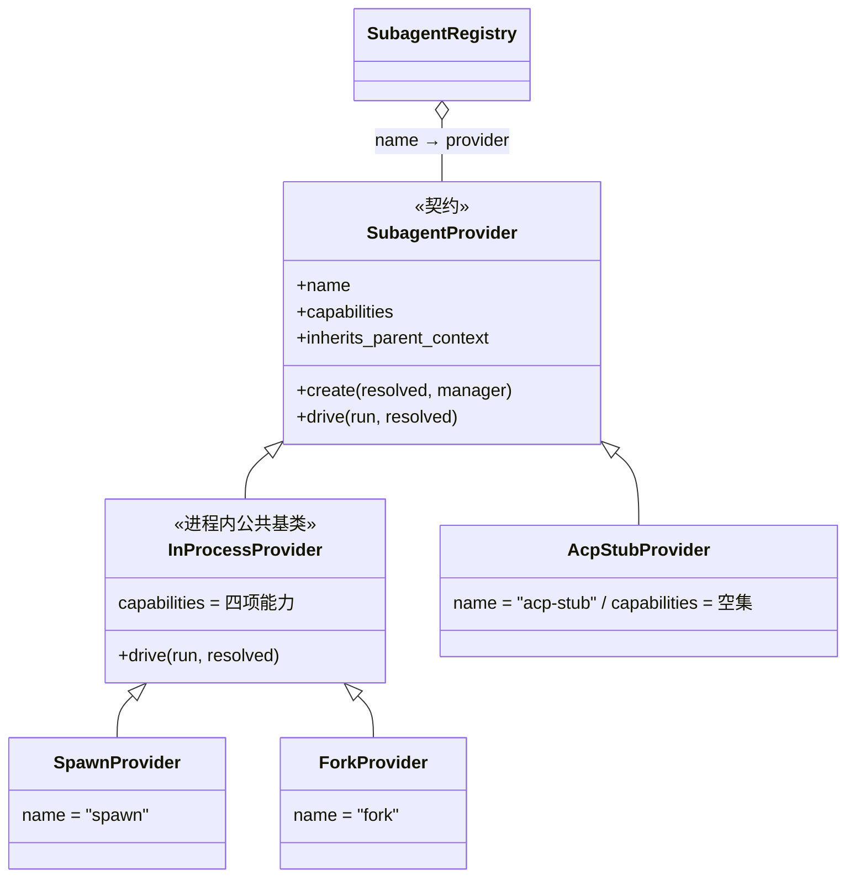
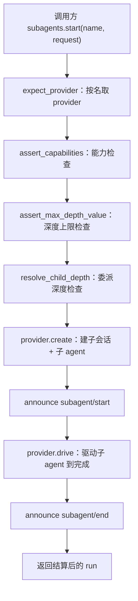

# 第 11 章 subagent 委派：让子任务拥有自己的会话

> 委派的是任务，不是对话。

## 本章回答的问题

- 第 2 章的 agent 循环是一人一个会话的闭环——子任务为什么要在自己的会话里跑，而不是直接在主 agent 的对话里做？
- 第 5 章的 seam 把能力抽象成契约、实现注册进契约——多种委派方式怎么共用同一个入口？
- 第 4 章的工具都注册进 `ctx.tools`、由模型调用——模型怎么自主触发委派？

第 2 章搭好了最小 agent-loop：`Sessions` 开会话，`AgentLoop` 装配 `ReactLoopAgent`，agent 在自己的会话里按回合推进。但那个闭环只服务「一个」agent ——主 agent 想把「排查模块 A」这样的子任务交出去时，第 2 章的代码没有入口。

本章补上这个入口：主 agent 把子任务**委派**给 **subagent**——子 agent 用自己的会话独立执行，完成后只有结果回到主对话。子 agent 的创建复用第 2 章的 `AgentLoop.create`（一人一个会话），委派工具注册进第 4 章的 `ctx.tools`，seam 三角色（定义层 / 实现层 / 消费层）沿用第 5 章的术语。本章代码复用 `ch01/cordis.py`、`ch02/agent_loop.py`、`ch04/tools.py`，新增代码在 `ch11/code/`。

## 1. 子任务内联的三个坑

先看反例：子任务直接在主会话里内联处理。

```python
# ch11/code/bad_example.py（核心部分，完整文件见代码目录）
MAIN_SESSION = []  # 主会话：全局唯一，主对话与所有子任务共用


def run_subtask_inline(task, depth=0):
    """内联执行子任务：过程事件直接追加进主会话（坑①），调用方式焊死（坑②）。"""
    pad = "  " * depth
    MAIN_SESSION.append(f"{pad}[子任务] 开始 {task}")
    MAIN_SESSION.append(f"{pad}[子任务] 探索步骤 1：读日志……")
    MAIN_SESSION.append(f"{pad}[子任务] 探索步骤 2：复现失败……")
    if depth == 0:
        # 子任务再嵌套子任务：递归没有任何深度约束（坑③）
        run_subtask_inline(f"{task} 的子模块排查", depth + 1)
    result = f"{task} 的结论"
    MAIN_SESSION.append(f"{pad}[子任务] 结束 → {result}")
    return result


def main():
    MAIN_SESSION.append("[主对话] user: 总结一下项目进展")
    answer = run_subtask_inline("排查模块 A")
    MAIN_SESSION.append(f"[主对话] assistant: 项目进展正常（{answer}）")
```

运行它：

```text
$ python3 bad_example.py
主会话共 10 条事件，属于主对话的只有 2 条：
  [主对话] user: 总结一下项目进展
  [子任务] 开始 排查模块 A
  ……（8 条中间事件：探索步骤，以及嵌套「子模块排查」的全过程）
  [主对话] assistant: 项目进展正常（排查模块 A 的结论）
想把「排查」换成独立进程执行？只能改 run_subtask_inline 的每一个调用点。
```

三个坑：

1. **上下文淹没**：主会话 10 条事件里只有 2 条属于主对话。子任务的探索过程——真实系统里还有工具调用、中间输出、报错重试——全部涌进主对话，主 agent 的上下文越跑越脏。可主 agent 需要的其实只有「结论」那一行。
2. **执行方式焊死**：`run_subtask_inline` 是裸函数调用。想换成「让子 agent 带上主对话的历史」或「扔到独立进程里跑」，就得改函数体和所有调用点。缺一层「怎么创建子 agent」可以替换的抽象。
3. **深度失控**：子任务还能嵌套子任务，递归没有任何上限。真实系统里子 agent 再委派，委派链会无限生长，每层都要消耗资源，却没人说得清当前是第几层。

三个坑指向同一组缺失：委派方式要**可注册**，子任务要**可隔离**，委派链要**可计数**。下面按这个顺序逐节补齐。

## 2. SubagentRegistry：委派方式是注册进来的，不是写死的

### 2.1 provider 契约：先定义「委派方式」长什么样

坑②说执行方式焊死。解法和第 5 章的 capability seam 同路：把「怎么创建子 agent」抽成契约，具体方式实现契约后注册进来，调用方只面对统一入口。契约的每个实现叫一个 **provider**——沿用第 5 章的用法：具名的能力提供者，只是这里提供的不是 shell 命令，而是一种「子 agent 的传输方式」。

契约本体（教学符号 `SubagentProvider`，对应 `types.ts:285` 的 `SubagentProvider`）：

```python
# ch11/code/subagent_runtime.py（模块级，完整文件见代码目录）
class SubagentProvider(ABC):
    """传输 provider 契约：name + capabilities + inherits_parent_context + create/drive。"""

    name = ""                          # 传输名，注册表的键（spawn/fork/……）
    capabilities = frozenset()         # 该传输支持的能力集合（2.3 详述）
    inherits_parent_context = False    # 子 agent 是否继承父上下文

    @abstractmethod
    def create(self, resolved, manager):
        """建子会话 + 子 agent，返回运行上下文（尚未驱动）。"""

    @abstractmethod
    def drive(self, run, resolved):
        """把子 agent 驱动到完成，返回结算结果。"""
```

四个成员各管一件事：`name` 是注册表的键；`capabilities` 声明「这种传输支持哪些特性」；`inherits_parent_context` 回答「子 agent 是否继承父对话的历史」；`create`/`drive` 是两个动作——创建子 agent、驱动子 agent。[教学决策 G1] 真实版契约是单个 `start`（返回带 Promise 的 run 句柄）；教学版同步化后拆成 `create` + `drive`，seam 在两步之间广播生命周期事件，事件次序与真实版一致。

先看一个具体 provider 长什么样：`SpawnProvider` 声明 `name="spawn"`、`inherits_parent_context=False`——子 agent 从零开始；它的 `create` 只有一行，调 `start_in_process_run(resolved, manager, self.name)`（完整实现见 §3.3，两个兄弟 `fork` 与 `acp-stub` 也在那里一起登场）。届时本章 seam 三角色的对应关系也就齐了：定义层是 `SubagentProvider` 契约，实现层是 `SpawnProvider`/`ForkProvider`/`AcpStubProvider` 三个具体 provider，消费层是面向模型的 `SubagentTool`（§5）。

### 2.2 注册表内部：按名注册、重名拒绝、效应回滚

**provider 注册表**（教学符号 `SubagentRegistry`，对应 `index.ts:172` `SubagentRuntime` 内的 `providers` Map）是一张「名字 → provider」表，规矩有三条：按名注册、重名拒绝、注册是可逆效应。

```python
# ch11/code/subagent_runtime.py（模块级）
class SubagentRegistry:
    """provider 注册表（SubagentRuntime 的 providers Map，index.ts:172）。"""

    def __init__(self, ctx):
        self.ctx = ctx
        self._providers: dict[str, SubagentProvider] = {}

    def register_provider(self, provider):
        """按名注册 + 重名拒绝 + 效应回滚（registerProvider，index.ts:369）。"""
        name = provider.name
        if name in self._providers:
            raise SubagentError("DUPLICATE_PROVIDER", f"provider 重名: {provider.name}")
        self._providers[name] = provider
        self.ctx.emit("subagent/provider-added", {"name": provider.name})

        def unregister():
            self._providers.pop(name, None)

        # effect 立即执行 lambda 并收集其返回的清理函数（cordis.py:167）：卸载即注销
        return self.ctx.effect(lambda: unregister, label=f"subagent-provider:{provider.name}")

    # ... expect_provider（按名取，缺失抛 UNKNOWN_PROVIDER，expectProvider index.ts:449）
    # ... 与 list_providers（按字典序列出，list index.ts:400）省略，见代码文件 ...
```

注册表家族——一份契约、三种实现——长这样：



两个行为值得当场演示。重名注册立刻被拒（错误带机器可读的 code）：

```text
被拒: DUPLICATE_PROVIDER: provider 重名: spawn
```

注册是可逆效应：`register_provider` 返回一个 disposer，调用它即注销——这是第 1 章的效应范式（注册本身就是可撤销的效应）：

```text
回滚后 provider 列表: ['fork', 'spawn']   # acp-stub 已被注销
```

### 2.3 能力白名单：start 之前的第一道闸

provider 声明的 **能力**（capability）是它支持的特性集合。源项目定义了四种：`output_schema`（结构化输出）、`depth_limit`（深度限制）、`tool_filter`（工具过滤）、`persona`（角色人格）。in-process 传输四种全支持；out-of-process 传输（acp/codex/claude-code/dsh-sdk 四兄弟）经 `ctx.subprocess.spawn` 起独立 OS 进程（进程外世界见第 6 章），正因为不在本进程，进程内的细粒度控制全都做不到，四种能力全为 false。

seam 在创建子 agent 之前逐项检查：请求用到哪个特性，provider 就必须声明对应能力：

```python
# ch11/code/subagent_runtime.py（模块级）
ALL_CAPABILITIES = ("output_schema", "depth_limit", "tool_filter", "persona")

# 请求字段 -> 所需能力：output_schema→output_schema、max_depth→depth_limit、
# tool_filter→tool_filter、persona→persona（REQUEST_CAPABILITY，完整字典见代码文件）


def assert_capabilities(provider, request):
    """能力检查（assertCapabilities，index.ts:481）：缺能力抛 UNSUPPORTED_CAPABILITY。"""
    for field_name, capability in REQUEST_CAPABILITY.items():
        if field_name in request and capability not in provider.capabilities:
            raise SubagentError(
                "UNSUPPORTED_CAPABILITY",
                f"provider '{provider.name}' 不支持能力 '{capability}'（请求使用了 {field_name}）")
```

检查发生在子 agent 创建之前。给 out-of-process 传输 `acp-stub` 委派一个带 `persona` 的任务，立刻被拒：

```text
被拒: UNSUPPORTED_CAPABILITY: provider 'acp-stub' 不支持能力 'persona'（请求使用了 persona）
```

这就是能力白名单的设计意图：不是「跑起来再失败」，而是 seam 在入口拒绝不支持的请求——调用方拿到明确的错误码，子 agent 根本不会被创建。

### 2.4 回溯

坑②解决：委派方式是注册进来的，调用方只面对注册表，换传输只换一个名字。但入口本身还没建——子任务到底怎么在自己的会话里跑起来、结果怎么回来？看 §3。

## 3. 一次性委派：SubagentManager.start

### 3.1 start 管线总览

先定义两个贯穿全章的词。**一次性委派**（one-shot）：子 agent 一口气把任务做完，立刻结算，运行随之结束——这是委派的最简形态（「可续」形态见 §5.3）。**结算**（settle）：一次运行到达终态（`completed`/`killed`），结果落定。

入口是 `SubagentManager`——注册为 `ctx.subagents` 的 Service（`SubagentRuntime` 的教学版，`index.ts:171`）。用户视角的最小示例只有一行：

```python
# 主 agent 把任务委派给 spawn 传输的子 agent，拿回结算后的运行上下文
run = subagents.start("spawn", {"parent": main_agent, "prompt": "排查模块 A 的测试为什么失败"})
print(run.result.text)   # 子的最终回复
```

这一行背后是 seam 的 start 管线：



分工很清晰：`provider.create` 之前的一切（取 provider、能力检查、深度检查）与两次生命周期广播都由 seam 完成；provider 只管「创建子 agent、驱动子 agent」两件事。`subagent/start` 与 `subagent/end` 由 seam 经 `ctx.emit` 广播（对应 `emitLifecycle`，`lifecycle.ts:100`），任何监听者都能订阅——§6 的输出里能看到这两条事件。

### 3.2 SubagentRunContext 与 start 管线代码

一次委派的身份与结算状态由**运行上下文**承载（教学符号 `SubagentRunContext`，`SubagentRun` + `SubagentRunInfo` 的教学版，`types.ts:249/36`）：

```python
# ch11/code/subagent_runtime.py（模块级）
class SubagentRunContext:
    """一次运行的身份与结算状态。"""

    def __init__(self, run_id, provider_name, parent_session, child_agent, depth):
        self.id = run_id
        self.provider = provider_name
        self.parent_session = parent_session
        self.child_agent = child_agent              # ↔ SubagentRun.localAgent
        self.child_session = child_agent.session.id
        self.depth = depth
        self.status = "running"                     # running -> completed | killed
        self.result = None                          # 结算后填入 SubagentResult
```

管线本体：

```python
# ch11/code/subagent_runtime.py
class SubagentManager(Service):
    """ctx.subagents seam：注册表 + 运行生命周期（SubagentRuntime 的教学版，index.ts:171）。"""

    inject = ["agent_loop"]

    def __init__(self, ctx, config=None):
        super().__init__(ctx, "subagents")
        self.registry = SubagentRegistry(ctx)
        self.runs = {}           # run_id -> SubagentRunContext
        self.session_meta = {}   # 子会话 id -> lineage meta（§4.1）
        self._next_run_id = 0

    def start(self, provider_name, request):
        """一次性委派（start，index.ts:414）：校验 → 建子 → 广播 start → 驱动到完成 → 广播 end。"""
        provider, resolved = self._prepare(provider_name, request)
        run = provider.create(resolved, self)
        self.runs[run.id] = run
        self.announce("subagent/start", self._start_info(run))  # observeRun：立即广播 start
        try:
            run.result = provider.drive(run, resolved)
            run.status = "completed"
        finally:
            self.announce("subagent/end", self._end_info(run))  # observeRun：结算后广播 end
        return run

    # ... _prepare（校验四步：expect_provider → assert_capabilities →
    # ... assert_max_depth_value → resolve_child_depth，index.ts:415-417）
    # ... announce（经 ctx.emit 广播，emitLifecycle lifecycle.ts:100）
    # ... make_run / start_continuable / followup / kill / wait_for_idle / list_children
    # ... 见代码文件，分别对应 §3.3、§4.2、§5.3 ...
```

[教学简化] 真实版是异步管线：`start` 返回带 Promise 的 run 句柄，`observeRun`（`lifecycle.ts:133`）订阅结算——start 事件立即广播，end 事件等 Promise 落定才广播；教学版同步，`start()` 在子 agent 结算后才返回，事件次序不变。

注意 `start` 返回的是运行上下文而不是结果：调用方从 `run.result` 取结算（`SubagentResult`：子的最终 assistant 输出 + 停止原因，由 `read_result` 从子会话的最后一条 `assistant/message` 读出，对应 `readResult`，`subagent-in-process-driver/src/index.ts:208`）。run 上还带着身份——子 agent 是谁、深度几层——§4 的深度检查与谱系查询都靠它定位子 agent。

### 3.3 provider 怎么「创建子 agent」：spawn 与 fork 的唯一差异

子 agent 的创建复用第 2 章的 `AgentLoop.create`——一人一个会话、注册进 `agent_loop.agents`、发 `agent/session-start`。子 agent 因此是完整的 agent-loop，不是一段裸函数：

```python
# ch11/code/providers.py（模块级）
def start_in_process_run(resolved, manager, provider_name):
    """建 in-process 运行（startInProcessRun 的教学版，subagent-in-process-driver/src/index.ts:102）。"""
    parent = resolved["parent"]
    # 子的 options 带上深度：子再委派时 delegation_depth_of 读得到（§4.1）
    child_options = dict(resolved.get("child_options", {}))
    child_options["subagent_depth"] = resolved["child_depth"]
    child = parent.ctx.agent_loop.create(**child_options)
    return manager.make_run(provider_name, parent, child, resolved["child_depth"])
```

三兄弟 provider 就此登场，差异只有两处——是否继承父上下文、是否 in-process：

```python
# ch11/code/providers.py（模块级）
class InProcessProvider(SubagentProvider):
    """in-process 传输公共基类：drive 统一为「发任务 → 同步到 idle → 读结算」。"""
    capabilities = frozenset(ALL_CAPABILITIES)

    def drive(self, run, resolved):
        # followup = send + wake_driver（ch02）：把任务作为 user 消息发给子 agent
        run.child_agent.followup(resolved["prompt"])
        return read_result(run.child_agent.session)

class SpawnProvider(InProcessProvider):
    """spawn：子会话从零开始（适合不需要父上下文的排查）。"""
    name = "spawn"
    inherits_parent_context = False

    def create(self, resolved, manager):
        return start_in_process_run(resolved, manager, self.name)

class ForkProvider(InProcessProvider):
    """fork：子会话继承父的已完成回合前缀（适合需要上下文的后续任务）。"""
    name = "fork"
    inherits_parent_context = True

    def create(self, resolved, manager):
        run = start_in_process_run(resolved, manager, self.name)
        seed_prefix(resolved["parent"].session, run.child_agent.session)
        return run

# AcpStubProvider 如 §2.1 骨架：capabilities 空集；真实版 create 经 ctx.subprocess.spawn 起独立 OS 进程（第 6 章）
```

fork 继承的是**已完成回合前缀**（completed turn prefix）：父会话截至（含）最后一个 `turn/end` 的全部事件（对应 `completedTurnPrefix`，`index.ts:88`）——没跑完的半截回合不继承。播种就是把这些事件逐条 `append` 进子会话：

```python
# ch11/code/providers.py（模块级）
def seed_prefix(parent_session, child_session):
    """把父会话的已完成回合前缀播种进子会话（fork 的 seed）。"""
    for ev in completed_turn_prefix(parent_session):
        child_session.append(ev.type, ev.payload)
```

[教学简化] 真实版在 `sessions.create({seed})` 时携带前缀；ch02 的 `Sessions.create` 不接受参数，教学版在创建后、首轮驱动前逐条补记，payload 原样复制。

看证据：主 agent 先完成一回合同步，再经 fork 委派，子会话的事件序列前 9 条正是父的已完成回合（一个回合为何是 9 条事件，见第 2 章）：

```text
子会话事件序列（18 条）: ['turn/start', 'step/start', 'user/message', 'assistant/chunk', 'assistant/chunk', 'assistant/chunk', 'assistant/message', 'step/end', 'turn/end', 'turn/start', 'step/start', 'user/message', 'assistant/chunk', 'assistant/chunk', 'assistant/chunk', 'assistant/message', 'step/end', 'turn/end']
```

### 3.4 回溯

坑①解决：子 agent 有自己的会话——§6 段 3 可见主会话事件数为 0，子会话 9 条，只有结算结果回到调用方。但注意子 agent 的创建方式：`agent_loop.create`——子 agent 是完整的 agent-loop，它也可以委派。子再委派时，深度谁来数？

## 4. 委派深度与谱系

### 4.1 深度怎么算：单调下界与「父深度 + 1」

坑③说委派链无限生长、没人说得清第几层。解法需要两个数：**我在第几层**、**能否再建子 agent**。

```python
# ch11/code/subagent_runtime.py（模块级）
def delegation_depth_of(agent, session_meta):
    """agent 所处委派深度（delegationDepthOf，depth.ts:28）：lineage meta 与 options 取大者。

    运行时只能加深、不能减小 agent 的深度（depth.ts:3）。
    """
    meta = session_meta.get(agent.session.id, {})
    session_depth = meta.get("delegation_depth", 0)
    option_depth = agent.options.get("subagent_depth", 0)
    return max(session_depth, option_depth)


def resolve_child_depth(parent, max_depth, session_meta):
    """子深度 = 父深度 + 1（resolveChildDepth，child-agent.ts:48）。超过 max_depth 抛 MAX_DEPTH。"""
    child_depth = delegation_depth_of(parent, session_meta) + 1
    if child_depth > max_depth:
        raise SubagentDepthError(child_depth, max_depth)
    return child_depth
```

两个设计点。其一，**单调下界**：会话 lineage meta 与创建时带的 options 两个来源取大者——运行时只能加深、不能减小 agent 的深度。其二，**创建前拦截**：`resolve_child_depth` 在 `_prepare` 的四步校验里（§3.2），超限的子 agent 根本不会被创建。

lineage meta 从哪来？`make_run` 开 run 时把子会话的谱系——父会话 / origin / 深度（`childSessionMeta`，`child-agent.ts:102`）——写进 `manager.session_meta`。[教学简化] 真实版写进会话持久 meta（`session.header`）；ch02 的 Session 没有 header 字段，教学版改存以会话 id 为键的表。

看段 5 的证据：子（depth=1）再委派，二级子创建时 depth=2；二级子再想委派，深度 3 被拦：

```text
二级子运行: depth=2 child=session-0004
深度拦截: MAX_DEPTH: 委派深度 3 超过上限 max_depth=2
```

委派链由此成为一棵可计数、可拦截的谱系树：

```text
session-0001（主，depth=0）
├── session-0002（spawn，depth=1）── session-0004（depth=2）── ✗ depth=3 被拦
└── session-0003（fork，depth=1）
```

### 4.2 沿 lineage 查子会话

有了 lineage 表，任一会话都能反查它的子会话（`listChildren`，`index.ts:470`；教学版直接扫 `session_meta`，真实版在 scope 内沿 lineage 发现，见第 9 章）：

```text
主会话的子会话: ['session-0002', 'session-0003']
session-0002 的子会话: ['session-0004']
```

### 4.3 回溯

坑③解决：深度可计数（单调下界）、可拦截（MAX_DEPTH）、可查询（lineage 表）。还剩最后一个问题：以上都是代码在调用——模型不会写 Python，它怎么自主触发委派？

## 5. SubagentTool：给模型的委派工具

### 5.1 apply：把「委派」注册成一个工具

第 4 章的工具管线给出答案：把「委派」注册成 `ctx.tools` 里的一个工具，模型以 tool-call 调用它。委派工具正是 seam 的消费面（`tool-subagent` 包的教学版）：

```python
# ch11/code/tool_subagent.py
class SubagentTool:
    name = "subagent"

    def apply(self):
        """把工具定义注册进 ctx.tools（apply，index.ts:267），返回注销 disposer。"""
        definition = ToolDefinition(
            name=self.name,
            description="把一个任务委派给子 agent 独立执行，返回它的结果",
            parameters={"provider": "传输名（spawn/fork）", "prompt": "任务描述"},
            execute=self.execute,
        )
        return self.ctx.tools.register(definition)
```

注意工具参数只有传输名与任务描述：工具不关心子 agent 怎么创建、怎么被驱动，只面对 seam 的唯一入口。

### 5.2 execute：工具参数翻译成 start 请求

工具体是一行翻译（`execute`，`index.ts:304`）：

```python
def execute(self, args):
    provider_name = args.get("provider", "spawn")
    request = {"parent": args["parent"], "prompt": args["prompt"]}
    run = self.ctx.subagents.start(provider_name, request)
    return f"子 agent（{run.result.stop_reason}）：{run.result.text}"
```

结算文本作为工具结果回到模型上下文——主 agent「只拿到结果，不沾过程」。段 7 输出：

```text
工具结果: 子 agent（end_turn）：收到问题「验证部署脚本」。这是一个最小闭环：chunk 逐条到达，拼成完整回复。
主会话事件数仍为: 9（委派不污染主会话）
```

[教学简化] 真实版工具参数经 JSON schema 校验，且从执行上下文得知「哪个 agent 发起了调用」；ch04 的 ToolExecution 不带调用者，教学版由 `args["parent"]` 显式传入。

### 5.3 可续子 agent 与控制工具

一次性委派不够：有时想让子 agent 存活、多轮对话。`start_continuable` 建子但不驱动（`startContinuable`，`index.ts:430`），run 留在 runs 表里等待消息；`followup` 每发一条消息驱动一轮，`kill` 中断并结算：

```python
# ch11/code/subagent_runtime.py
def followup(self, run_id, message):
    """向存活子 agent 发一条消息并驱动一轮（followup，index.ts:450）。"""
    run = self._expect_run(run_id)
    run.child_agent.followup(message)      # ch02：send + wake_driver，同步驱动到 idle
    return read_result(run.child_agent.session)

def kill(self, run_id):
    """中断并结算存活子 agent（interrupt，index.ts:460）。"""
    run = self._expect_run(run_id)
    self.ctx.agent_loop.agents.pop(run.child_session, None)   # 从 agent 注册表移除（对应 dispose）
    run.status = "killed"
    run.result = SubagentResult(text="", stop_reason="killed")
    self.announce("subagent/end", self._end_info(run))
```

[教学简化] 真实版 interrupt 走驱动器的 abort 路径，`wait_for_idle` 异步等待子 agent 停稳；ch02 没有 abort 态且教学版同步——kill 即「从 agent 注册表移除 + 结算 run」，`wait_for_idle` 总是立即返回。

段 6 输出——子 agent 存活两轮后被中断：

```text
第 1 轮回复: 收到问题「先统计测试用例数量」。这是一个最小闭环：chunk 逐条到达，拼成完整回复。
第 2 轮回复: 收到问题「再列出失败的用例」。这是一个最小闭环：chunk 逐条到达，拼成完整回复。
存活且 idle 的运行: ['subagent-run-4']
kill 之后: status=killed stop_reason=killed
```

配套的消费面工具是 `send_message`/`interrupt_agent`（`SubagentControlTool`，`tool-subagent-control/src/index.ts:105/129`）：前者翻译成 `followup`，后者翻译成 `kill`。

### 5.4 回溯

全链路闭环：模型 → tool-call → `SubagentTool.execute` → `ctx.subagents.start` → provider 建子并驱动 → 结算回到工具结果 → 回到模型。三个坑全部解决：可注册（§2）、可隔离（§3）、可计数（§4）。

## 6. 完整运行输出

运行 `python3 ch11/code/main.py`（依赖 ch02/ch04 教学代码，无第三方库）。完整输出：

```text
=== 段 1：装配 ===
已注册 provider: ['acp-stub', 'fork', 'spawn']
主 agent 会话: session-0001

=== 段 2：能力检查与注册回滚 ===
被拒: UNSUPPORTED_CAPABILITY: provider 'acp-stub' 不支持能力 'persona'（请求使用了 persona）
被拒: DUPLICATE_PROVIDER: provider 重名: spawn
回滚后 provider 列表: ['fork', 'spawn']

=== 段 3：一次性委派（spawn） ===
  [事件] subagent/start subagent-run-1 provider=spawn parent=session-0001 child=session-0002 depth=1
  [事件] subagent/end   subagent-run-1 stop_reason=end_turn
结算: status=completed stop_reason=end_turn
子的回复: 收到问题「排查模块 A 的测试为什么失败」。这是一个最小闭环：chunk 逐条到达，拼成完整回复。
主会话事件数: 0；子会话 session-0002 事件数: 9

=== 段 4：fork 继承历史 ===
  [事件] subagent/start subagent-run-2 provider=fork parent=session-0001 child=session-0003 depth=1
  [事件] subagent/end   subagent-run-2 stop_reason=end_turn
子会话事件序列（18 条）: ['turn/start', 'step/start', 'user/message', 'assistant/chunk', 'assistant/chunk', 'assistant/chunk', 'assistant/message', 'step/end', 'turn/end', 'turn/start', 'step/start', 'user/message', 'assistant/chunk', 'assistant/chunk', 'assistant/chunk', 'assistant/message', 'step/end', 'turn/end']
子的回复: 收到问题「基于同步的上下文给出追赶计划」。这是一个最小闭环：chunk 逐条到达，拼成完整回复。

=== 段 5：委派深度与谱系 ===
  [事件] subagent/start subagent-run-3 provider=spawn parent=session-0002 child=session-0004 depth=2
  [事件] subagent/end   subagent-run-3 stop_reason=end_turn
二级子运行: depth=2 child=session-0004
深度拦截: MAX_DEPTH: 委派深度 3 超过上限 max_depth=2
主会话的子会话: ['session-0002', 'session-0003']
session-0002 的子会话: ['session-0004']

=== 段 6：可续委派与控制 ===
  [事件] subagent/start subagent-run-4 provider=spawn parent=session-0001 child=session-0005 depth=1
第 1 轮回复: 收到问题「先统计测试用例数量」。这是一个最小闭环：chunk 逐条到达，拼成完整回复。
第 2 轮回复: 收到问题「再列出失败的用例」。这是一个最小闭环：chunk 逐条到达，拼成完整回复。
存活且 idle 的运行: ['subagent-run-4']
  [事件] subagent/end   subagent-run-4 stop_reason=killed
kill 之后: status=killed stop_reason=killed

=== 段 7：模型视角——经工具调用委派 ===
  [事件] subagent/start subagent-run-5 provider=spawn parent=session-0001 child=session-0006 depth=1
  [事件] subagent/end   subagent-run-5 stop_reason=end_turn
工具结果: 子 agent（end_turn）：收到问题「验证部署脚本」。这是一个最小闭环：chunk 逐条到达，拼成完整回复。
主会话事件数仍为: 9（委派不污染主会话）
```

逐段解读：段 1–2 是装配与契约校验（§2）；段 3–4 是两种创建方式与隔离（§3）；段 5 是深度与谱系（§4）；段 6 是续命与控制（§5.3）；段 7 是模型视角（§5.2）。

## 7. 源码对照

| 教学符号 | 真实符号 | 位置 |
|---|---|---|
| `SubagentRegistry` / `register_provider` | `SubagentRuntime.registerProvider` | index.ts:353/370 |
| `expect_provider` / `list_providers` | `expectProvider` / `listProviders` | index.ts:398/406 |
| `assert_capabilities` | `assertCapabilities` | index.ts:507 |
| `SubagentManager.start` | `SubagentRuntime.start` | index.ts:414 |
| `start_continuable` / `followup` / `kill` | `startContinuable` / `followup` / `interrupt` | index.ts:430/450/460 |
| `wait_for_idle` | `waitForIdle` | index.ts:490 |
| `delegation_depth_of` / `resolve_child_depth` | `delegationDepthOf` / `resolveChildDepth` | depth.ts:28 / child-agent.ts:48 |
| `child_session_meta` | `childSessionMeta` | child-agent.ts:102 |
| `completed_turn_prefix` / `read_result` | `completedTurnPrefix` / `readResult` | index.ts:88/197 |
| `SubagentTool.apply` / `execute` | tool-subagent `apply` / `execute` | index.ts:267/304 |
| `SubagentControlTool` | tool-subagent-control `send_message` / `interrupt_agent` | index.ts:105/129 |
| `subagent/start` / `subagent/end` | lifecycle 事件 | lifecycle.ts:13 |

教学差异：① 同步驱动代替异步（ch02 驱动器同步）；② kill = 注销 + 结算（ch02 无 abort 路径）；③ lineage 存 `session_meta` 表（ch02 Session 无 header）；④ capabilities 用字符串集合（真实版为结构化声明）；⑤ 工具参数显式传 parent（ch04 ToolExecution 无调用者）；⑥ provider 契约拆成 `create`+`drive`（真实版 AgentProvider 单体 create）。

## 8. 小结与预告

回到开篇问题：「让别人去做」不是一次函数调用，而是一条 seam——注册表让传输可插拔、失败可回滚；管理器让创建可计数、运行可控制；工具让模型够得着委派。

| 机制 | 解决的问题 |
|---|---|
| 注册表 + effect 回滚 | 传输写死、注册失败留垃圾 |
| 能力声明 + 消费前校验 | 消费者盲调不支持的传输 |
| 独立会话 + read_result | 子过程淹没主上下文 |
| 深度单调下界 + MAX_DEPTH | 委派链无限生长 |
| SubagentTool / ControlTool | 模型无法自主委派与控制 |

本章也是全书收尾：从 ch01 的插件内核出发，我们看着一个 Context 长出会话循环（ch02）、工具管线（ch04）、seam 三角色（ch05）、压缩（ch10），直到本章的子 agent 委派——harness 的全部机制，都是「在受控边界内把能力交给模型」这一主题的分身。

## 9. 附录：关键概念速查表

| 概念 | 一句话定义 | 首次出现 | 依赖 |
|---|---|---|---|
| `SubagentProvider` | 传输契约：`create` 建子 + `drive` 驱动 | §2/§3 | ch02 `AgentLoop` |
| capabilities | provider 声明的支持能力集合，消费前校验 | §2 | 注册表 |
| `SubagentRegistry` | provider 注册表：重名拒绝、能力校验、effect 回滚 | §2 | ch01 `effect` |
| `SubagentRunContext` | 一次委派的不可变创建快照 | §3 | — |
| `read_result` | 从子会话末轮提取结算文本 | §3 | ch02 事件结构 |
| `SubagentManager` | 生命周期服务：start/followup/kill/wait_for_idle | §3 | registry + agent_loop |
| 委派深度 | 单调下界，子 = 父 + 1，超限 MAX_DEPTH | §4 | lineage |
| lineage | 父会话/origin/深度谱系，可反查子会话 | §4 | `session_meta` |
| `SubagentTool` | 把委派注册成工具的消费面 | §5 | ch04 `ToolRuntime` |
| `SubagentControlTool` | send_message/interrupt_agent 控制消费面 | §5.3 | manager |
