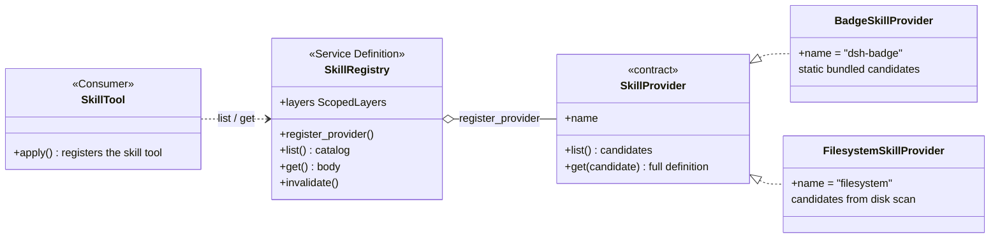

# Chapter 12: skill Loading: Capabilities Are Registered In, Loaded On Demand

> Skills hang on the wall, not welded into the body; take one down when needed, put it back when done.

## Questions this chapter answers

- Chapter 2's `SystemPromptService` assembles the system prompt sent to the model, but why can't a skill body just be welded straight into the system prompt?
- Chapter 5's shell seam picks one of two at composition time, but a skill's multiple sources must all be present at once — how does a seam accommodate "multiple implementations present simultaneously"?
- Chapter 4's tools pipeline lets the model call tools by name, but how can the model load a skill's body on demand?

Chapter 5 laid out the three-role skeleton of a seam and gave the first seam shape: the shell-style "method-call / pick-one-at-composition-time" — `createShell` selects a single implementation (`node` or `local`) at composition time, after which consumers only call the method. This chapter looks at the second shape: skill loading in `packages/skill`. A skill's source is not one but many (bundled badges, disk directories, third-party packages …), and they are **registered together** into a layered registry; reading merges them by scope layer and, within the same layer, dedupes by rank. This is the "provider registry" seam: implementations can coexist, stack, and shadow one another.

The teaching code for this chapter is in `ch12/code/`, run with `python3 ch12/code/main.py` (depends on ch01/ch02/ch04/ch09 teaching code, no third-party libraries).

The three seam roles established in Chapter 5 (Service Definition / Service Provider / Consumer) are all reused here, but the seam's **shape** changes:

| | Chapter 5 shell seam | This chapter's skill seam |
|---|---|---|
| Implementation count | pick one at composition time (node / local) | multiple providers registered side by side |
| Consumption style | direct method call (`shell.exec`) | read through the registry (`ctx.skills.list/get`) |
| Conflict problem | doesn't exist (only one implementation) | same name, who wins: same-layer rank, cross-layer shadowing |
| Lifecycle | assembled once with the Context | registration is an effect, returns a disposer to undo it |

Reuse list (no re-implementation; direct import or isomorphic borrowing):

- Chapter 1 `Service` (`ch01/code/cordis.py`): construction-is-registration, `SkillRegistry(ctx)` auto-binds `ctx.skills`;
- Chapter 2 `Session` (`ch02/code/agent_loop.py`): the skill catalog is injected into the session as an append-only event;
- Chapter 4 `ToolRuntime` / `ToolDefinition` (`ch04/code/tools.py`): the skill tool is an ordinary tool in the tools pipeline;
- Chapter 9 `ScopedLayers` (`ch09/code/scope.py`): the layered container of a global layer + per-scope overlay layers + the parent-chain lineage, imported and reused directly here.

All new code lives in `ch12/code/`: `skill_registry.py` (definition layer), `skill_providers.py` (implementation layer), `tool_skill.py` (consumer layer), `bad_example.py` (problem demonstration), `main.py` (staged demonstration).

## 1. Welding Skills into the System Prompt

First look at the counter-example `ch12/code/bad_example.py`: it concatenates the full bodies of three skills straight into the system prompt.

```python
# The bodies of three "skills": in a real project these specialized steps pile up over time.
SKILLS = {
    "commit-message": (
        "Steps: 1. read git diff and summarize the theme; 2. pick a type: feat/fix/docs/refactor;"
        "3. output type(scope): description, imperative mood, no more than 72 characters."
    ),
    "code-review": (
        "Review points: 1. is error handling complete; 2. are boundary conditions covered;"
        "3. does naming express intent; 4. is there duplicated code to extract."
    ),
    "release-notes": (
        "Steps: 1. summarize the PRs since the last tag; 2. classify by feat/fix/breaking;"
        "3. render user-facing release notes."
    ),
}


def build_system_prompt():
    """Weld every skill body into the system prompt: fully resident regardless of whether the current task needs it."""
    parts = ["You are a coding assistant. Here are all the professional skills you must remember at all times:"]
    for name, body in SKILLS.items():
        parts.append(f"[skill {name}] {body}")
    return "\n".join(parts)


def main():
    system_prompt = build_system_prompt()
    task = "Help me write a commit message for this change."

    print("=== counter-example: all skills welded into the system prompt ===")
    print(f"system prompt length: {len(system_prompt)} characters (including all {len(SKILLS)} skill bodies)")
    print(f"current task: {task}")
    print("→ the task only needs commit-message, but the code-review / release-notes bodies stay resident the whole time.")
    print()
    print("--- the actual system prompt sent to the model ---")
    print(system_prompt)
    print()
    print("Pits:")
    print("1. All-resident: unused skill bodies still occupy context; the more skills and the longer the session, the bigger it snowballs.")
    print("2. Undiscoverable: the model doesn't know what capabilities exist or when to use them, only hard-injected via the prompt.")
    print("3. Non-pluggable: adding / removing a skill means editing the system prompt (or even the code) and re-assembling.")
```

Run `python3 ch12/code/bad_example.py`:

```text
=== counter-example: all skills welded into the system prompt ===
system prompt length: 600 characters (including all 3 skill bodies)
current task: Help me write a commit message for this change.
→ the task only needs commit-message, but the code-review / release-notes bodies stay resident the whole time.

--- the actual system prompt sent to the model ---
You are a coding assistant. Here are all the professional skills you must remember at all times:
[skill commit-message] Steps: 1. read git diff and summarize the theme; 2. pick a type: feat/fix/docs/refactor; 3. output type(scope): description, imperative mood, no more than 72 characters.
[skill code-review] Review points: 1. is error handling complete; 2. are boundary conditions covered; 3. does naming express intent; 4. is there duplicated code to extract.
[skill release-notes] Steps: 1. summarize the PRs since the last tag; 2. classify by feat/fix/breaking; 3. render user-facing release notes.

Pits:
1. All-resident: unused skill bodies still occupy context; the more skills and the longer the session, the bigger it snowballs.
2. Undiscoverable: the model doesn't know what capabilities exist or when to use them, only hard-injected via the prompt.
3. Non-pluggable: adding / removing a skill means editing the system prompt (or even the code) and re-assembling.
```

Three skills already occupy 600 characters, and every turn pays that cost again. Three pits can be extracted:

1. **All-resident**: every skill body stays resident in context alongside the system prompt. The more skills and the longer their bodies, the greater the token cost, while a single task usually uses only one of them;
2. **Undiscoverable**: the skill list is a hard-coded dict; there is no mechanism outside the model that can enumerate "what skills exist right now"; adding or removing a skill requires editing this assembly code;
3. **Non-pluggable**: the skill source is welded in place — there is no place to hook in a "read skills from a disk directory" source, or to give a subagent its own set of skills.

The three pits all point to one missing set of mechanisms: sources must be **registerable** (fixes pit 3), the catalog must be **discoverable** (fixes pit 2), and bodies must be **loaded on demand** (fixes pit 1). These are exactly the three jobs of the skill seam.

## 2. Service Definition: Skill Sources Are Registered In

### 2.1 The Three Roles and the Contract

First the full picture (three files under `ch12/code/`):



- **Service Definition**: `SkillRegistry`, bound to `ctx.skills`. It does not produce skills; it only accepts registrations, merges the catalog, and fetches bodies on demand;
- **Service Provider**: sources implementing the `SkillProvider` contract. The teaching version gives two: `BadgeSkillProvider` (static bundled) and `FilesystemSkillProvider` (disk scan);
- **Consumer**: `SkillTool` — turns `ctx.skills` into a model-callable `skill` tool (via the Chapter 4 tools pipeline), plus `inject_catalog` to inject the catalog into the session.

The contract itself has only two methods (`ch12/code/skill_registry.py`, corresponding to skill/src/index.ts:248):

```python
class SkillProvider(ABC):
    """The skill provider contract (index.ts:248): list() returns candidates, get() loads the full body per candidate.

    This is the implementation-side interface of the "provider registry" seam: multiple
    implementations register side by side and the registry merges/dedupes on read; unlike
    Chapter 5's shell, which is a method-call seam that "picks a single implementation at
    composition time".
    [teaching simplification 1] The real contract also has a watch(callback) change subscription;
    the teaching version omits it and relies on manual invalidate.
    """

    name: str = ""

    @abstractmethod
    def list(self) -> list[SkillCandidate]:
        """List this provider's candidates (metadata, no body) (index.ts:252)."""
        raise NotImplementedError

    @abstractmethod
    def get(self, candidate: SkillCandidate) -> SkillDefinition | None:
        """Load the full definition (including the body) for a candidate (index.ts:258)."""
        raise NotImplementedError
```

Note the two methods return different types: `list()` returns only **metadata**, `get()` returns the **body**. This is not arbitrary — it bakes "catalog is cheap, body is expensive" into the contract. Around this dividing line, the definition layer gives three tiers of vocabulary types (skill/src/index.ts:56 / :74 / :86):

```python
@dataclass(frozen=True)
class SkillSummary:
    """A catalog entry: rendering metadata, no body (index.ts:56). list() returns this."""

    name: str
    description: str
    provider: str
    source: str


@dataclass(frozen=True)
class SkillCandidate(SkillSummary):
    """A candidate: Summary + same-layer priority rank (index.ts:74). provider.list() returns this.

    [teaching simplification 1] The real candidate also has an opaque locator (used by get to
    locate the body); the teaching version lets the provider hold the location itself.
    """

    rank: int = BUNDLED_SKILL_RANK


@dataclass(frozen=True)
class SkillDefinition:
    """The full definition: with body, loaded on demand (index.ts:86). provider.get() returns this."""

    name: str
    provider: str
    content: str
    source: str = "bundled"
    description: str = ""
    model_invocable: bool = True  # [teaching simplification 2] the real one is invocation.model ∈ allow/deny/ask
    user_invocable: bool = True   # [teaching simplification 2] the real one is invocation.user ∈ allow/deny/ask
```

The three tiers each handle one stretch: `SkillSummary` is the catalog entry (the menu shown to the model), `SkillCandidate` is the candidate (Summary plus same-layer priority rank, the internal shape a provider hands to the registry), and `SkillDefinition` is the full definition (the body is present, appearing only on `get`). The vocabulary types live in the definition-layer file so provider and consumer share the same word set — the same idea as putting `ToolDefinition`/`ToolResult` in `tools.py` back in Chapter 4.

### 2.2 register_provider: Registration Is an Effect

How does the registry accept a provider? (skill/src/index.ts:391)

```python
    def register_provider(self, provider: SkillProvider, scope=None):
        """Register a provider into the layer for scope (index.ts:391). Registration is an effect: it returns a disposer.

        scope=None lands in the global layer (host-level); otherwise it lands in that scope's overlay layer.
        """
        layer = self.layers.for_scope(scope)
        if provider.name in layer.providers:
            raise ValueError(f"skill provider already registered: {provider.name}")
        # Write the provider and immediately invalidate the cache: registration changes the result of later reads.
        layer.providers[provider.name] = provider
        self.invalidate()

        def dispose():
            # Undo the registration and invalidate again, mirroring the real disposer (undo insert + invalidateCache).
            layer.providers.pop(provider.name, None)
            self.invalidate()

        return dispose
```

Four details, each mapping to a real problem:

1. **Land by scope**: `scope=None` lands in the global layer (host-level, visible to all sessions), otherwise in that scope's overlay layer. The layered container `self.layers` reuses Chapter 9's `ScopedLayers` (`ch09/code/scope.py`) directly — a global layer + one layer per scope + the parent-chain lineage, i.e. what the real class docs call "the host+per-scope shape the tools registry established" (skill/src/index.ts:346-355);
2. **Same-layer duplicate name handling**: the real source does not uniformly throw on duplicates — `registerProvider` (index.ts:391) only throws when the name is the reserved name `runtime` (RUNTIME_PROVIDER:23); the runtime skill's `register` (index.ts:440) treats a same-layer duplicate as **warn+noop** (warn and skip, no throw). The teaching `register_provider` simplifies to "same-layer duplicate name throws", making explicit the rule "don't let one source silently replace another";
3. **Registration invalidates the cache**: right after writing it calls `invalidate()`, because registration changes the result of every subsequent read — without invalidation the new provider would hide behind the stale cache and never be seen. The notes record that the real invalidation is concentrated in the disposer undo and the provider's `control.invalidate` callback (index.ts:622 / :649), with no separate "invalidate immediately after registration" timing; the teaching version makes the immediate post-write invalidation explicit, a teaching simplification;
4. **Returns a disposer**: registration is an effect (Chapter 1 terminology) — the call returns an undo function; `dispose()` removes the provider and invalidates the cache again. Skills brought in by a third-party package take effect on assembly and vanish on teardown — this is the antidote to pit 3 "non-pluggable".

`SkillRegistry` itself subclasses Chapter 1's `Service`: `super().__init__(ctx, "skills")` registers onto `ctx.skills` at construction (cordis.py:271-284), corresponding to the real source's `declare('skills')` context extension (skill/src/index.ts:284-287). Same pattern as Chapter 4's `ToolRuntime(ctx)` and Chapter 9's `ScopedToolRuntime(ctx)`.

### 2.3 Two Provider Examples

The implementation layer `ch12/code/skill_providers.py` gives two providers with sharply different shapes. The simplest is the badge — a static candidate table + bundled bodies (corresponding to skill-badge/src/index.ts:36, the whole file is only 60 lines):

```python
class BadgeSkillProvider(SkillProvider):
    """The bundled minimal provider (skill-badge/src/index.ts:36): static candidates + bundled bodies.

    The real badge bundles only one skill dsh-badge (CANDIDATE:25, source='bundled',
    rank=BUNDLED_SKILL_RANK:27); list() statically returns [CANDIDATE], get() reads a resource file.
    [teaching decision 3] The teaching version bundles two skills; the bundled code-review shares its
    name with the filesystem project version to demonstrate same-layer rank tiebreak.
    """

    name = "dsh-badge"  # PROVIDER_NAME (skill-badge/src/index.ts:17)

    def __init__(self):
        # Bundled bodies written directly in code; the real badge reads from a resource URL (SKILL_BODY_URL:18).
        self._bodies = {
            "skill-creator": (
                "Steps to create a new skill:\n"
                "1. Create a directory and write SKILL.md (frontmatter declares name/description).\n"
                "2. The body spells out the trigger conditions and operation steps.\n"
                "3. Place it in a skill directory for the filesystem provider to scan and load."
            ),
            "code-review": (
                "General code review (bundled fallback version):\n"
                "1. Check syntax and obvious errors."
            ),
        }

    def list(self):
        """Statically return the bundled candidates (corresponds to list:()=>[CANDIDATE], skill-badge/src/index.ts:38)."""
        return [
            SkillCandidate(
                name="skill-creator",
                description="Guide on how to create a new skill package",
                provider=self.name,
                source="bundled",
                rank=BUNDLED_SKILL_RANK,
            ),
            SkillCandidate(
                name="code-review",
                description="General code review checklist (bundled fallback)",
                provider=self.name,
                source="bundled",
                rank=BUNDLED_SKILL_RANK,
            ),
        ]

    def get(self, candidate):
        """Read the bundled body for a candidate (corresponds to get:readFile, skill-badge/src/index.ts:39-49)."""
        content = self._bodies.get(candidate.name)
        if content is None:
            return None
        return SkillDefinition(
            name=candidate.name,
            provider=self.name,
            content=content,
            source="bundled",
            description=candidate.description,
        )
```

The disk provider adds one more parse step: a skill file is a `.md` file of "frontmatter metadata + Markdown body" (corresponding to skill-filesystem/src/index.ts:793 parseSkillFile):

```python
def parse_skill_file(path: Path):
    """Parse a SKILL.md: frontmatter (name/description) + body.

    Corresponds to parseSkillFile (skill-filesystem/src/index.ts:793) and
    parseFrontmatter (:909). Returns (name, description, content);
    returns None if there is no frontmatter or no name.
    [teaching simplification 6] The real parseFrontmatter supports arbitrary fields + invocation
    policy parsing (parseInvocationPolicy:992); the teaching version only takes name/description.
    """
    text = path.read_text(encoding="utf-8")
    if not text.startswith("---"):
        return None
    # Find the closing delimiter after the first ---, cutting out the frontmatter and body.
    end = text.find("\n---", 3)
    if end == -1:
        return None
    frontmatter = text[3:end].strip()
    content = text[end + 4:].strip()
    # Split key/value per line on the colon, building the frontmatter field table.
    fields = {}
    for line in frontmatter.splitlines():
        if ":" in line:
            key, _, value = line.partition(":")
            fields[key.strip()] = value.strip()
    name = fields.get("name")
    if not name:
        return None
    return name, fields.get("description", ""), content
```

`FilesystemSkillProvider` splits "scan the disk" and "read the body" into the contract's two methods (corresponding to skill-filesystem/src/index.ts:146):

```python
class FilesystemSkillProvider(SkillProvider):
    """The directory-scan provider (skill-filesystem/src/index.ts:146): scan *.md under root and parse them.

    The real filesystem discovers project/user/custom multi-level roots via discoverRoot:719,
    aggregates candidates in list:182, and reads + parses the body by locator in get:206.
    [teaching simplification 5] The teaching version only scans a single root, does not watch; body
    location uses the "name.md" convention instead of a locator.
    """

    name = "filesystem"  # Config.providerName defaults to 'filesystem' (skill-filesystem/src/index.ts:76)

    def __init__(self, root):
        self.root = Path(root)
        # A teaching counter: counts how many times list() actually scans the disk, to demonstrate cache hits.
        self.scan_count = 0

    def list(self):
        """Scan all *.md under root, parse them into candidates (corresponds to list:182 + roots:241)."""
        self.scan_count += 1  # every call actually scans the disk; on a cache hit the registry won't reach here
        candidates = []
        for path in sorted(self.root.glob("*.md")):
            parsed = parse_skill_file(path)
            if parsed is None:
                continue
            name, description, _content = parsed
            candidates.append(
                SkillCandidate(
                    name=name,
                    description=description,
                    provider=self.name,
                    source="project",
                    rank=PROJECT_SKILL_RANK,
                )
            )
        return candidates

    def get(self, candidate):
        """Read the file by the "name.md" convention and parse out the body (corresponds to get:206 + parseSkillFile:793)."""
        path = self.root / f"{candidate.name}.md"
        if not path.exists():
            return None
        parsed = parse_skill_file(path)
        if parsed is None:
            return None
        name, description, content = parsed
        return SkillDefinition(
            name=name,
            provider=self.name,
            content=content,
            source="project",
            description=description,
        )
```

Note that `list()` only parses the frontmatter into candidates; the body is read in full only when `get()` is called — the "catalog is cheap, body is expensive" dividing line in the contract is, in the implementation, two file reads of different granularity.

**Wrap-up**: pit 3 "non-pluggable" from §1 is now solved — a skill source is no longer a welded dict but a pluggable component that implements the `SkillProvider` contract and registers onto `ctx.skills` via `register_provider`; registration is an effect and can be undone. But the moment the registry opens up to multiple sources, a new problem appears: the badge has a `code-review` and the filesystem also has a `code-review` — which one should appear in the catalog?

## 3. Merging the Catalog: Same-Layer Rank Decides, Nearer Layer Shadows

### 3.1 The Main Merge Flow

`list()` is the registry's main read entry point (skill/src/index.ts:471): winners are projected into `SkillSummary`, sorted by name, and the result goes into the cache. The real merge logic lives in two internal methods — one handles cross-layer, the other handles within-a-layer (skill/src/index.ts:552-586):

```python
    def _layer_chain(self, scope):
        """The effective layer chain: global as the base + the scope's parent chain (ancestors first, nearest layer last) (index.ts:557)."""
        layers = [self.layers.global_layer]
        if scope is not None:
            layers.extend(self.layers.chain_layers(scope))
        return layers

    def _collect(self, scope) -> dict:
        """Cross-layer merge: walk the layer chain far to near; a nearer layer's same-name entry overwrites a farther layer (shadowing) (index.ts:552-566)."""
        merged: dict = {}
        for layer in self._layer_chain(scope):
            for name, entry in self._collect_layer(layer).items():
                merged[name] = entry  # the later-written nearer layer overwrites the earlier-written farther layer
        return merged

    def _collect_layer(self, layer: SkillLayer) -> dict:
        """Single layer: gather every provider's candidates, sort by rank (smallest wins), dedupe by name (index.ts:568-586)."""
        indexed = []
        for provider in layer.providers.values():
            for candidate in provider.list():
                indexed.append((candidate, provider))
        # Stable sort by rank ascending: smaller rank first, equal rank keeps registration order.
        indexed.sort(key=lambda pair: pair[0].rank)
        winning: dict = {}
        for candidate, provider in indexed:
            if candidate.name not in winning:  # same-layer same-name: the first (smallest rank) wins, the rest are dropped
                winning[candidate.name] = {"candidate": candidate, "provider": provider}
        return winning
```

The two rules each cure one kind of conflict, and their directions are exactly opposite:

- **Same-layer same name → rank decides (smallest wins)**: `_collect_layer` gathers every provider's candidates in a layer, stable-sorts by rank ascending, and the first wins while the rest are dropped. The rank ladder is taken from the real source ([teaching simplification 4] only the two ends): `PROJECT_SKILL_RANK = 100` (project skills, high priority), `BUNDLED_SKILL_RANK = 600` (bundled skills, low priority). The real ladder has 7 tiers: project-dsh(100) > project-agents(200) > runtime(250) > custom(300) > user-dsh(400) > user-agents(500) > bundled(600) (skill-filesystem/src/index.ts:36-40 + skill/src/index.ts:24,27);
- **Cross-layer same name → a nearer layer shadows the farther one wholesale**: `_collect` walks the layer chain far to near (global as base, scope overlay layers after); a nearer layer writing the same-name key directly overwrites the farther one — not a field merge but a wholesale winner replacement. This follows the same rule as Chapter 9's tools scope shadowing, because the layered container is the same `ScopedLayers`.

### 3.2 The Two Conflicts in Action

`main.py` stage 2 and stage 3 each demonstrate one. Stage 2: badge and filesystem both register in the global layer; their two `code-review`s meet in the **same layer** — filesystem's rank=100 beats badge's rank=600, so `code-review` in the catalog is provided by filesystem. Stage 3: register a `ReviewBotSkillProvider` into `scope="review-bot"`, which also provides `code-review` — this time they meet **across layers**; the review-bot layer's candidate shadows the global layer's winner wholesale, but reading the catalog from review-bot still sees the global layer's remaining skills (`skill-creator`, `commit-message`) inherited through.

**Wrap-up**: "which one wins when multiple sources coexist" now has a definite answer — same layer compares rank (smallest wins), cross-layer compares distance (nearer layer shadows). But note that `list()` always returns only `SkillSummary`: name, description, source, no body. Where is the body?

## 4. Loading On Demand: The Body Is Read Only When Needed

### 4.1 get: Delegate to the Winner's Provider to Load the Body

`get(name)` is the body's only entry point (skill/src/index.ts:501): first merge out the winning candidate by scope, then **delegate that candidate's own provider** to load the body:

```python
    def get(self, name: str, scope=None) -> SkillDefinition | None:
        """Load the winner's full definition (including the body) by name (index.ts:501), cached."""
        key = (scope, name)
        if key in self._get_cache:
            return self._get_cache[key]
        entry = self._collect(scope).get(name)
        # On hitting the winning candidate, delegate its provider to load the body; on a miss, None.
        definition = entry["provider"].get(entry["candidate"]) if entry else None
        self._get_cache[key] = definition
        return definition
```

The registry itself never reads a body: the badge's winner goes back to the bundled table, the filesystem's winner goes back to read the file on disk. "Which source a body comes from" is decided by the winning candidate's provider field — the merge rule (§3) and the load action (§4) are thereby decoupled.

### 4.2 Cache and Invalidation

Both the catalog and the body go through caches (`_list_cache` / `_get_cache` / `_snapshot_cache`); invalidation is concentrated in one method (skill/src/index.ts:622 + :649):

```python
    def invalidate(self):
        """Clear all read caches and broadcast skills/change (index.ts:622 + :649)."""
        self._revision += 1
        self._list_cache.clear()
        self._get_cache.clear()
        self._snapshot_cache.clear()
        self.ctx.emit("skills/change", {})
```

Three call sites trigger it: `register_provider` on registration, the disposer on undo, and external manual calls. Invalidation does two things: clears all read caches (the next `list`/`get` re-collects), and broadcasts the `skills/change` event — in the real source this event is dispatched by `notifyChange` (skill/src/index.ts:649, `dispatch('emit', ['skills/change'])`), for components that care about catalog changes to subscribe and consume on their own. `_revision` is an invalidation counter, corresponding to the real revision mechanism ([teaching simplification 1] the real version relies on the provider's watch callback to auto-trigger invalidation; the teaching version replaces it with manual `invalidate`).

`main.py` stage 7 uses filesystem's `scan_count` to turn cache behavior into visible numbers: the first `list()` actually scans the disk (+1), the second `list()` hits the cache (scan count unchanged); after adding a new skill file, calling `list()` directly still hits the stale cache — only after `invalidate()` does it re-scan and the new skill appears.

**Wrap-up**: pit 1 "all-resident" from §1 is now solved — the body is loaded by the winner's provider only when `get` is called; `list` always returns only metadata; the cache spares repeated disk scans, and invalidation makes registration changes immediately visible. But so far every call has been issued by this demo code — how does the model know what skills are available?

## 5. Model Consumption: the skill Tool + Catalog Injection

The consumer layer `ch12/code/tool_skill.py` does two things, corresponding to the real tool-skill's two consumption paths: inject the skill catalog into the session (the model "knows what exists"), and register the `skill` tool into the Chapter 4 tools pipeline (the model "fetches a body on demand").

### 5.1 The Two Render Functions

First prepare the two output shapes (corresponding to skill/src/index.ts:171 and tool-skill/src/index.ts:254):

```python
def render_skill_content(definition):
    """Render a skill body into the canonical <skill_content> block (skill/src/index.ts:171 renderSkillContent).

    When the model reads this block, "the skill is loaded"; the steps in the body become its next operating guide.
    """
    return (
        f'<skill_content name="{definition.name}" provider="{definition.provider}">\n'
        f"{definition.content}\n"
        f"</skill_content>"
    )


def render_catalog_message(summaries):
    """Render the skill catalog into the text injected into the session (tool-skill/src/index.ts:254 renderCatalogMessage).

    The catalog only contains name + description (metadata), no body; the body is left for the model to load on demand via the skill tool.
    """
    if not summaries:
        return ""
    lines = ["Available skills (use the skill tool to load a body by name):"]
    for summary in summaries:
        lines.append(f"- {summary.name}: {summary.description}")
    return "\n".join(lines)
```

### 5.2 SkillTool: the skill Tool Goes Through the tools Pipeline

`SkillTool.apply` registers a tool named `skill` into `ctx.tools` ([teaching decision 4] same shape as Chapter 5's tool-bash: a tool = the seam's model-side consumption surface); the executor reads `ctx.skills` back internally (corresponding to tool-skill/src/index.ts:77 apply / :81 defineTool / :127 execute / :161 register):

```python
class SkillTool:
    """Assembly and execution of the skill tool (tool-skill/src/index.ts:77 apply).

    Consumes ctx.skills: turns the skills in the registry into a model-callable skill tool.
    """

    def __init__(self, ctx):
        self.ctx = ctx

    def apply(self):
        """Register the skill tool into ctx.tools (index.ts:81 defineTool + :161 register)."""
        definition = ToolDefinition(
            name="skill",
            description="Load a skill's full guidance body by name",
            parameters={
                "type": "object",
                "properties": {
                    "name": {"type": "string", "description": "the skill name to load"},
                },
                "required": ["name"],
            },
            execute=self._execute,
        )
        return self.ctx.tools.register(definition)

    def _execute(self, arguments):
        """Load a skill by name (index.ts:127 execute): first list to verify existence, then get to load the body.

        The error branches (unknown skill / body load failure / not model-invocable) return error text:
        the real tool-skill throws on these branches and the execution pipeline renders them into an
        error result; the Chapter 4 teaching pipeline does not catch tool exceptions (tools.py:254-259
        directly str(execute(...))), so the teaching version returns error text instead — the shape the
        model sees is the same ([teaching simplification 8]).
        """
        name = arguments.get("name")
        # Find the skill in the catalog, corresponding to ctx.skills.list(...).find(name) (index.ts:131).
        summary = next((s for s in self.ctx.skills.list() if s.name == name), None)
        if summary is None:
            return f'error: skill "{name}" is unknown or no longer available'
        # Load the full definition, corresponding to ctx.skills.get(name) (index.ts:136).
        definition = self.ctx.skills.get(name)
        if definition is None:
            return f'error: skill "{name}" is unknown or no longer available'
        # Verify model-invocable, corresponding to isModelInvocable (index.ts:138).
        if not definition.model_invocable:
            return f'error: skill "{name}" is not available for model invocation'
        # Render into the canonical <skill_content> block and return it to the model.
        return render_skill_content(definition)
```

The executor follows the real execute's main path (list → get → invocability check → render): first `list` verifies the skill exists (index.ts:131), then `get` loads the body (index.ts:136), checks model-invocability (index.ts:138), and finally renders the canonical `<skill_content>` block. The real execute is heavier: at the entry there is also an `isSkillName` name-validity check, and `isModelInvocable` is called twice — once against the summary after list and once against the skill after get; the teaching version drops the entry check and only checks once. One tool call by the model exchanges for a full guide — the body goes from "resident in the prompt" to "enters context only when called".

### 5.3 inject_catalog: the Catalog Enters the Session

A tool alone is not enough — the model must first know what's on the menu. `inject_catalog` renders the catalog into a user message and appends it to the session (corresponding to pre-step #2 catalog publication, tool-skill/src/index.ts:213):

```python
def inject_catalog(session, summaries):
    """Inject the skill catalog into the session as a user message (pre-step #2 catalog publication, index.ts:213).

    Reuses Chapter 2's Session append-only event log (agent_loop.py:69 append):
    the catalog enters the session as a user/message event, with the message source
    marked 'skill-catalog' (SkillCatalogSource:34) to distinguish it from the user's
    real input. Returns the injected message dict; if the catalog is empty, does not
    inject and returns None.
    """
    text = render_catalog_message(summaries)
    if not text:
        return None
    message = {"role": "user", "content": text, "source": "skill-catalog"}
    session.append("user/message", {"message": message})
    return message
```

Reuses Chapter 2's `Session` append-only event log: the catalog enters the session as a `user/message` event with `source` marked `skill-catalog`, distinct from the user's real input. The model reads "Available skills (use the skill tool to load a body by name): …" in context, and gets both the menu and the way to order.

**Wrap-up**: pit 2 "undiscoverable" from §1 is now solved — catalog injection lets the model see what skills exist, and the skill tool lets it fetch a body by name. All three pits are closed: sources registerable (§2), catalog discoverable (§5), body loaded on demand (§4); the merge rule (§3) guarantees a definite result when multiple sources coexist.

## 6. Complete Run Output

Run `python3 ch12/code/main.py` (depends on ch01/ch02/ch04/ch09 teaching code, no third-party libraries); the stage numbers in the output correspond one-to-one with `main.py`'s stages:

```text
========================================================================
stage 1 — assembly: the ctx.skills provider registry
========================================================================
ctx.skills type: SkillRegistry (Service, registered at construction)
registered providers: ['dsh-badge', 'filesystem']
skills/change events triggered by registration: 2

========================================================================
stage 2 — catalog merge + same-layer rank tiebreak (smallest wins)
========================================================================
- code-review     provider=filesystem source=project
- commit-message  provider=filesystem source=project
- skill-creator   provider=dsh-badge  source=bundled
code-review winner: filesystem (project rank=100 < bundled rank=600, smallest wins)

========================================================================
stage 3 — layered shadowing: the review-bot scope shadows global
========================================================================
global reads code-review: filesystem
review-bot reads code-review: review-bot (this layer is nearer, shadows global wholesale)
review-bot catalog skill count: 3 (inherits global + this-layer override)

========================================================================
stage 4 — load the full body on demand: get('commit-message')
========================================================================
provider=filesystem source=project
# commit-message

1. Read git diff and summarize the theme of this change.
2. Pick a type: feat / fix / docs / refactor / test / chore.
3. Output `type(scope): description`, using imperative mood, no more than 72 characters.

========================================================================
stage 5 — tool-skill consumption: the skill tool (through the Chapter 4 tools pipeline)
========================================================================
ctx.tools visible tools: ['skill']
skill(commit-message) is_error=False:
<skill_content name="commit-message" provider="filesystem">
# commit-message

1. Read git diff and summarize the theme of this change.
2. Pick a type: feat / fix / docs / refactor / test / chore.
3. Output `type(scope): description`, using imperative mood, no more than 72 characters.
</skill_content>
skill(no-such-skill) → tool returns error text: error: skill "no-such-skill" is unknown or no longer available

========================================================================
stage 6 — session catalog injection: the skill-catalog message enters the session
========================================================================
injected message source=skill-catalog, session event count=1
Available skills (use the skill tool to load a body by name):
- code-review: Project code review checklist
- commit-message: Generate a commit message following Conventional Commits
- skill-creator: Guide on how to create a new skill package

========================================================================
stage 7 — cache and invalidation
========================================================================
first list(): 3 skills, scan +1 (real scan)
second list(): 3 skills, scan +1 (cache hit, nothing new)
after adding release-notes.md, direct list(): ['code-review', 'commit-message', 'skill-creator'] (still hits the stale cache)
after invalidate(), list(): ['code-review', 'commit-message', 'release-notes', 'skill-creator'] (re-scanned)
total skills/change events: 5
```

### 6.1 Stage-by-Stage Reading

- **stage 1**: `ctx.skills` is a `SkillRegistry` (Service, registered at construction). Registering two providers triggers 2 `skills/change` events — each `register_provider` invalidates the cache and broadcasts;
- **stage 2**: after the catalog merge there are 3 skills. The `code-review` name conflict is decided by rank: filesystem (project rank=100) beats badge (bundled rank=600); `skill-creator` is provided only by badge and is admitted directly;
- **stage 3**: after the `review-bot` scope registers its own `code-review`, reading from that scope has the nearer layer shadow the global winner wholesale; the catalog is still 3 — `skill-creator` and `commit-message` are inherited from global;
- **stage 4**: `get('commit-message')` delegates to the winner filesystem to read the disk and returns a `SkillDefinition` with the body;
- **stage 5**: the skill tool runs through Chapter 4's `ctx.tools.execute` — a successful call returns the canonical `<skill_content>` block; an unknown skill returns error text (the real version throws and the pipeline renders it into an error result, see [teaching simplification 8]);
- **stage 6**: the catalog enters the session as a user/message event with `source=skill-catalog`; the body has only name + description;
- **stage 7**: on a cache hit `scan_count` does not increase; a new file on disk is not automatically visible — only after `invalidate()` does a re-scan make the new skill appear. The "scan +1" printed by the second `list()` is the cumulative increment relative to the baseline (total +1), not a fresh scan this time — this call actually hits the cache and adds 0 new scans. Total 5 `skills/change` events: 2 registrations (stage 1) + 1 review-bot registration (stage 3) + 2 manual invalidations (stage 7).

## 7. Source Code Mapping

Symbol correspondence between the teaching code and the real source:

| Teaching symbol (ch12/code/) | Real symbol (packages/skill/) | Line |
|---|---|---|
| `skill_registry.py` `SkillSummary` / `SkillCandidate` / `SkillDefinition` | `SkillSummary` / `SkillCandidate` / `SkillDefinition` (skill/src/index.ts) | :56 / :74 / :86 |
| `SkillProvider` (contract) | `SkillProvider` | :248 |
| `SkillLayer` | `SkillLayer` | :328 |
| `SkillRegistry` (a `Service` subclass, bound to `ctx.skills`) | `SkillRegistry extends Service` + `declare('skills')` | :357 / :284-287 |
| `register_provider` (returns a disposer) | `registerProvider` | :391 |
| `list` / `snapshot` / `get` | `list` / `snapshot` / `get` | :471 / :482 / :501 |
| `_layer_chain` + `_collect` | `collectFresh` (cross-layer merge) + `collect` (cache wrapper) | `collectFresh`:552-566 / `collect`:520 |
| `_collect_layer` | `collectLayer` | :568-586 |
| `invalidate` (revision + skills/change) | `invalidateCache` + `notifyChange` | :622 / :649 |
| `PROJECT_SKILL_RANK` / `BUNDLED_SKILL_RANK` | the rank ladder constants | skill-filesystem/src/index.ts:36-40 + skill/src/index.ts:24,27 |
| `skill_providers.py` `BadgeSkillProvider` | `provider` (skill-badge/src/index.ts) | :36 (whole file 60 lines) |
| `FilesystemSkillProvider.list` / `.get` | `FileSystemSkillProvider.list` / `.get` | skill-filesystem/src/index.ts:182 / :206 |
| `parse_skill_file` | `parseSkillFile` + `parseFrontmatter` | :793 / :909 |
| `tool_skill.py` `SkillTool.apply` | `apply` | tool-skill/src/index.ts:77 |
| the `skill` tool definition | `skillTool` (`defineTool({name:'skill'})`) | :81 |
| `_execute` | `execute` | :127 |
| `ctx.tools.register` | `ctx.tools.register(skillTool)` | :161 |
| `inject_catalog` | pre-step #2 session catalog publication | :213 |
| `render_catalog_message` | `renderCatalogMessage` | :254 |
| `render_skill_content` | `renderSkillContent` (skill/src/index.ts) | :171 |

Teaching differences list (numbers correspond one-to-one with the code comments):

**Teaching decisions** (active choices, not made hard for the sake of it):

1. **[teaching decision 1]** The skill seam is positioned as a "provider registry" seam: multiple providers register side by side, and reads merge by layer + rank; contrasted with Chapter 5's shell "method-call / pick-one-at-composition-time". Layered shadowing reuses Chapter 9's `ScopedLayers` (skill_registry.py module docstring);
2. **[teaching decision 2]** badge and filesystem two providers co-exist, demonstrating multiple implementations side by side (skill_providers.py module docstring);
3. **[teaching decision 3]** The badge bundles two skills (`skill-creator` + the bundled `code-review`), making the bundled and project `code-review` share a name in the same layer to demonstrate rank tiebreak (skill_providers.py `BadgeSkillProvider` docstring);
4. **[teaching decision 4]** tool-skill is implemented as a tool in the Chapter 4 tools pipeline, same shape as Chapter 5's tool-bash (tool_skill.py module docstring).

**Teaching simplifications** (the real mechanism is more complex; the teaching version downgrades):

1. **[teaching simplification 1]** The real `SkillProvider` also has a `watch(callback)` change subscription and an opaque locator; the teaching version drops watch and uses manual `invalidate` to trigger refresh, and body location degrades to provider-held (skill_registry.py contract / candidate comments);
2. **[teaching simplification 2]** The real invocationPolicy is `{model, user}` each allow/deny/ask; the teaching version uses two booleans (skill_registry.py `SkillDefinition`);
3. **[teaching simplification 3]** The real `collectLayer` sort key is rank→providerOrder→localOrder→name; the teaching version sorts only by rank, and stable sorting makes registration order the implicit secondary key for equal rank (skill_registry.py module docstring);
4. **[teaching simplification 4]** The rank ladder takes only the two ends 100/600; the real one has 7 tiers (skill_registry.py constant comments);
5. **[teaching simplification 5]** The real filesystem scans project/user/custom multi-level roots + Chokidar watch; the teaching version only scans a single root, does not watch, and locates bodies by the "name.md" convention (skill_providers.py module docstring / `FilesystemSkillProvider` docstring);
6. **[teaching simplification 6]** The real `parseFrontmatter` supports arbitrary fields + invocation policy parsing; the teaching version only takes name/description (skill_providers.py `parse_skill_file`);
7. **[teaching simplification 7]** The real tool-skill also has the pre-step #1 `/name` gesture for explicit invocation (tool-skill/src/index.ts:177) and incremental catalog update `renderCatalogUpdate` (:279); the teaching version only does "one-shot catalog injection + skill tool loading" (tool_skill.py module docstring);
8. **[teaching simplification 8]** The real tool-skill throws on branches like unknown skill and lets the execution pipeline render it into an error result; the Chapter 4 teaching pipeline does not catch tool exceptions (tools.py:254-259), so the teaching version returns error text instead — the shape the model sees is the same (tool_skill.py `_execute`).

## 8. Summary and Preview

This chapter reconstructs "skills" from strings welded into the prompt into a three-role seam:

| Mechanism | Corresponding symbol | Which pit it cures |
|---|---|---|
| provider contract + registration is an effect | `SkillProvider` / `register_provider` | pit 3 non-pluggable |
| same-layer rank tiebreak + cross-layer nearer shadows | `_collect_layer` / `_collect` | determinism when multiple sources coexist |
| catalog returns only metadata, body delegated for loading | `list` / `get` | pit 1 all-resident |
| cache + invalidate + skills/change | `invalidate` | registration changes immediately visible |
| skill tool + catalog injection into the session | `SkillTool` / `inject_catalog` | pit 2 undiscoverable |

Compared with Chapter 5, this chapter gives the second seam shape: shell is "pick a single implementation at composition time, then only call its method", skill is "multiple implementations registered side by side, merged by rule on read". The latter splits "who can provide" from "who wins" — providing is a registered fact, winning is a result computed at read time.

The next chapter looks at the two big external capabilities of retrieval and code semantics: `ctx.web` (search/fetch) and `ctx.lsp` (normalized four-operation query), corresponding to `packages/web` and `packages/lsp`.

## 9. Appendix: Key Concepts Cheat Sheet

| Concept | One sentence | Teaching code | Real source |
|---|---|---|---|
| `ctx.skills` | the layered skill provider registry (Service Definition) | `skill_registry.py` `SkillRegistry` | skill/src/index.ts:357 |
| `SkillProvider` | source contract: `list()` returns candidates, `get()` returns the body | `skill_registry.py` | skill/src/index.ts:248 |
| `SkillSummary` / `SkillCandidate` / `SkillDefinition` | catalog entry / candidate (+rank) / full definition (+body) | `skill_registry.py` | skill/src/index.ts:56/:74/:86 |
| `register_provider` | register by scope into the layer, returns a disposer | `skill_registry.py` | skill/src/index.ts:391 |
| rank ladder | within a layer the smallest wins (teaching version takes the two ends 100 / 600) | `PROJECT_SKILL_RANK` etc. | skill-filesystem/src/index.ts:36-40 |
| cross-layer shadowing | a nearer layer's same-name entry overwrites the farther one wholesale (reuses `ScopedLayers`) | `_collect` | skill/src/index.ts:552-566 |
| `invalidate` | clears caches + revision + broadcasts skills/change | `skill_registry.py` | skill/src/index.ts:622/:649 |
| badge provider | static bundled candidates + bundled bodies | `skill_providers.py` `BadgeSkillProvider` | skill-badge/src/index.ts:36 |
| filesystem provider | scans the disk for candidates, reads bodies on demand | `skill_providers.py` `FilesystemSkillProvider` | skill-filesystem/src/index.ts:146 |
| `parse_skill_file` | frontmatter metadata + Markdown body | `skill_providers.py` | skill-filesystem/src/index.ts:793 |
| skill tool | a tool in the tools pipeline, fetches the body by name and renders `<skill_content>` | `tool_skill.py` `SkillTool` | tool-skill/src/index.ts:81/:127 |
| catalog injection | the catalog enters the session as a user message with source=skill-catalog | `tool_skill.py` `inject_catalog` | tool-skill/src/index.ts:213 |
| `render_skill_content` | renders the body into the canonical `<skill_content>` block | `tool_skill.py` | skill/src/index.ts:171 |
