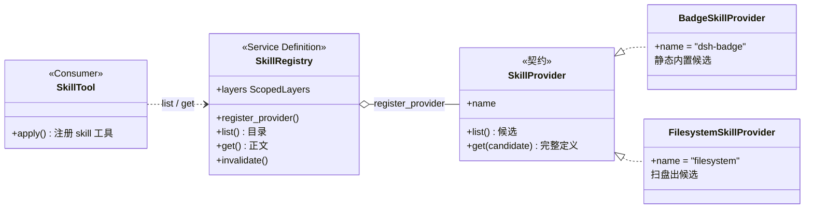

# 第 12 章 skill 加载：能力是注册进来的，按需加载的

> 技能挂在墙上，不焊进身体；用时取下，用完归位。

## 本章回答的问题

- 第 2 章的 `SystemPromptService` 组装出发给模型的系统提示词，但技能正文为什么不能直接焊进系统提示词？
- 第 5 章的 shell seam 在组合期二选一，但 skill 的多个来源要同时在场，seam 怎么容纳「多实现同时在场」？
- 第 4 章的 tools 管线让模型按名调用工具，但模型怎么才能按需加载一个技能的正文？

第 5 章讲了 seam 的三角色骨架，并给出第一种 seam 形态：shell 那种「方法调用式 / 组合期二选一」——`createShell` 在组合期从 `node` 与 `local` 里选定唯一实现，之后消费方只调方法。本章看第二种形态：`packages/skill` 的 skill 加载。技能来源不是一个而是多个（内置徽章、磁盘目录、第三方包……），它们**同时注册**进一张分层注册表，读取时按 scope 分层、同层按 rank 合并去重。这是「provider 注册表」型 seam：实现可并存、可叠加、可遮蔽。

本章教学代码在 `ch12/code/`，运行方式 `python3 ch12/code/main.py`（依赖 ch01/ch02/ch04/ch09 教学代码，无第三方库）。

第 5 章确立的 seam 三角色（Service Definition / Service Provider / Consumer）本章全部复用，但 seam 的**形态**换了：

| | 第 5 章 shell seam | 本章 skill seam |
|---|---|---|
| 实现数量 | 组合期二选一（node / local） | 多个 provider 并存注册 |
| 消费方式 | 直接方法调用（`shell.exec`） | 经注册表读取（`ctx.skills.list/get`） |
| 冲突问题 | 不存在（只有一个实现） | 同名谁赢：同层 rank、跨层遮蔽 |
| 生命周期 | 随 Context 装配一次 | 注册是 effect，返回 disposer 可撤销 |

复用清单（不重复实现，直接 import 或同构借用）：

- 第 1 章 `Service`（`ch01/code/cordis.py`）：构造即注册，`SkillRegistry(ctx)` 自动绑定 `ctx.skills`；
- 第 2 章 `Session`（`ch02/code/agent_loop.py`）：技能目录以一条 append-only 事件注入会话；
- 第 4 章 `ToolRuntime` / `ToolDefinition`（`ch04/code/tools.py`）：skill 工具是 tools 管线里的一个普通工具；
- 第 9 章 `ScopedLayers`（`ch09/code/scope.py`）：global 层 + 每作用域叠加层 + 父链 lineage 的分层容器，本章直接 import 复用。

新增代码全部在 `ch12/code/`：`skill_registry.py`（定义层）、`skill_providers.py`（实现层）、`tool_skill.py`（消费层）、`bad_example.py`（问题演示）、`main.py`（分段演示）。

## 1. 把技能焊进系统提示词

先看反面教材 `ch12/code/bad_example.py`：把三个技能的完整正文直接拼进系统提示词。

```python
# 三个「技能」的正文：真实项目里这类专门步骤会越积越多。
SKILLS = {
    "commit-message": (
        "步骤：1. 读 git diff 归纳主题；2. 选 type：feat/fix/docs/refactor；"
        "3. 输出 type(scope): 描述，祈使句、不超过 72 字符。"
    ),
    "code-review": (
        "评审要点：1. 错误处理是否完整；2. 边界条件是否覆盖；"
        "3. 命名是否表达意图；4. 是否有重复代码可抽取。"
    ),
    "release-notes": (
        "步骤：1. 汇总上次 tag 以来的 PR；2. 按 feat/fix/breaking 分类；"
        "3. 渲染成面向用户的 release notes。"
    ),
}


def build_system_prompt():
    """把全部技能正文焊进系统提示词：不管本次任务用不用得上，全量常驻。"""
    parts = ["你是一个编码助手。以下是你必须随时记住的全部专业技能："]
    for name, body in SKILLS.items():
        parts.append(f"[技能 {name}] {body}")
    return "\n".join(parts)


def main():
    system_prompt = build_system_prompt()
    task = "帮我把这次改动写一条提交信息。"

    print("=== 反例：技能全量焊进系统提示词 ===")
    print(f"系统提示词长度：{len(system_prompt)} 字符（含全部 {len(SKILLS)} 个技能正文）")
    print(f"本次任务：{task}")
    print("→ 任务只需要 commit-message，但 code-review / release-notes 的正文也全程常驻。")
    print()
    print("--- 实际发给模型的系统提示词 ---")
    print(system_prompt)
    print()
    print("坑：")
    print("1. 全量常驻：用不上的技能正文也占上下文，技能越多、会话越长，滚得越大。")
    print("2. 不可发现：模型不知道有哪些能力、何时该用，只能靠提示词硬灌。")
    print("3. 不可插拔：加 / 删一个技能要改系统提示词（甚至改代码）重新装配。")
```

运行 `python3 ch12/code/bad_example.py`：

```text
=== 反例：技能全量焊进系统提示词 ===
系统提示词长度：306 字符（含全部 3 个技能正文）
本次任务：帮我把这次改动写一条提交信息。
→ 任务只需要 commit-message，但 code-review / release-notes 的正文也全程常驻。

--- 实际发给模型的系统提示词 ---
你是一个编码助手。以下是你必须随时记住的全部专业技能：
[技能 commit-message] 步骤：1. 读 git diff 归纳主题；2. 选 type：feat/fix/docs/refactor；3. 输出 type(scope): 描述，祈使句、不超过 72 字符。
[技能 code-review] 评审要点：1. 错误处理是否完整；2. 边界条件是否覆盖；3. 命名是否表达意图；4. 是否有重复代码可抽取。
[技能 release-notes] 步骤：1. 汇总上次 tag 以来的 PR；2. 按 feat/fix/breaking 分类；3. 渲染成面向用户的 release notes。

坑：
1. 全量常驻：用不上的技能正文也占上下文，技能越多、会话越长，滚得越大。
2. 不可发现：模型不知道有哪些能力、何时该用，只能靠提示词硬灌。
3. 不可插拔：加 / 删一个技能要改系统提示词（甚至改代码）重新装配。
```

三个技能就占了 306 字符，而且每一轮对话都要重复付费。归纳出三个坑：

1. **全量常驻**：所有技能正文随系统提示词常驻上下文。技能越多、正文越长，token 开销越大，而单次任务往往只用其中一个；
2. **不可发现**：技能清单是硬编码字典，模型之外没有任何机制能列出「现在有哪些技能」；新增、删除技能都要改这段拼装代码；
3. **不可插拔**：技能来源被焊死——想加一个「从磁盘目录读技能」的来源，或让某个子代理带一套自己的技能，都无处下手。

三个坑指向同一组缺失的机制：来源要能**注册**（治坑 3）、目录要能**发现**（治坑 2）、正文要能**按需加载**（治坑 1）。这正是 skill seam 的三件事。

## 2. Service Definition：技能来源是注册进来的

### 2.1 三角色与契约

先看全景（对应 `ch12/code/` 三个文件）：



- **Service Definition**：`SkillRegistry`，绑定 `ctx.skills`。它不生产技能，只负责收注册、合并目录、按需取正文；
- **Service Provider**：实现 `SkillProvider` 契约的来源。教学版给两个：`BadgeSkillProvider`（静态内置）与 `FilesystemSkillProvider`（磁盘扫描）；
- **Consumer**：`SkillTool`——把 `ctx.skills` 变成模型可调用的 `skill` 工具（走第 4 章 tools 管线），外加把目录注入会话的 `inject_catalog`。

契约本身只有两个方法（`ch12/code/skill_registry.py`，对应 skill/src/index.ts:248）：

```python
class SkillProvider(ABC):
    """skill provider 契约（index.ts:248）：list() 出候选、get() 按候选加载全文。

    这是「provider 注册表」型 seam 的实现侧接口：多个实现并存注册，注册表读取时
    合并去重；而不是第 5 章 shell 那种「组合期选定唯一实现」的方法调用式 seam。
    [教学简化 1] 真实契约还有 watch(callback) 变更订阅；教学版省略，靠手动 invalidate。
    """

    name: str = ""

    @abstractmethod
    def list(self) -> list[SkillCandidate]:
        """列出本 provider 的候选（元数据，无正文）（index.ts:252）。"""
        raise NotImplementedError

    @abstractmethod
    def get(self, candidate: SkillCandidate) -> SkillDefinition | None:
        """按候选加载完整定义（含正文）（index.ts:258）。"""
        raise NotImplementedError
```

注意两个方法的返回类型不同：`list()` 只出**元数据**，`get()` 才出**正文**。这不是随意的——它把「目录便宜、正文昂贵」写进了契约。围绕这条分界线，定义层给了三级词汇类型（skill/src/index.ts:56 / :74 / :86）：

```python
@dataclass(frozen=True)
class SkillSummary:
    """目录条目：渲染用元数据，无正文（index.ts:56）。list() 返回它。"""

    name: str
    description: str
    provider: str
    source: str


@dataclass(frozen=True)
class SkillCandidate(SkillSummary):
    """候选：Summary + 同层优先级 rank（index.ts:74）。provider.list() 返回它。

    [教学简化 1] 真实候选还有不透明 locator（供 get 定位正文）；教学版由 provider 自持定位。
    """

    rank: int = BUNDLED_SKILL_RANK


@dataclass(frozen=True)
class SkillDefinition:
    """完整定义：带正文，按需加载（index.ts:86）。provider.get() 返回它。"""

    name: str
    provider: str
    content: str
    source: str = "bundled"
    description: str = ""
    model_invocable: bool = True  # [教学简化 2] 真实为 invocation.model ∈ allow/deny/ask
    user_invocable: bool = True   # [教学简化 2] 真实为 invocation.user ∈ allow/deny/ask
```

三级词汇各管一段：`SkillSummary` 是目录条目（给模型看的菜单），`SkillCandidate` 是候选（Summary 加同层优先级 rank，provider 交给注册表的内部形态），`SkillDefinition` 是完整定义（正文在场，只在 `get` 时出现）。词汇类型放在定义层文件里，让 provider 与消费者共享同一套词表——这与第 4 章 `ToolDefinition`/`ToolResult` 放在 `tools.py` 同出一辙。

### 2.2 register_provider：注册是 effect

注册表怎么收 provider？（skill/src/index.ts:391）

```python
    def register_provider(self, provider: SkillProvider, scope=None):
        """把 provider 注册进 scope 对应层（index.ts:391）。注册是 effect：返回 disposer。

        scope 为 None 落 global 层（宿主级）；否则落该作用域叠加层。
        """
        layer = self.layers.for_scope(scope)
        if provider.name in layer.providers:
            raise ValueError(f"skill provider already registered: {provider.name}")
        # 写入 provider 并立即失效缓存：注册改变了后续读取的结果。
        layer.providers[provider.name] = provider
        self.invalidate()

        def dispose():
            # 撤销注册并再次失效，对应真实 disposer（undo insert + invalidateCache）。
            layer.providers.pop(provider.name, None)
            self.invalidate()

        return dispose
```

四个细节，每个都对着一个真实问题：

1. **按 scope 落层**：`scope=None` 落 global 层（宿主级，所有会话可见），否则落该作用域的叠加层。分层容器 `self.layers` 直接复用第 9 章 `ScopedLayers`（`ch09/code/scope.py`）——global 层 + 每作用域一层 + 父链 lineage，即真实类文档所言「the host+per-scope shape the tools registry established」（skill/src/index.ts:346-355）；
2. **同层重名处理**：真实源码对重名并不一律抛错——`registerProvider`（index.ts:391）仅在名字是保留名 `runtime`（RUNTIME_PROVIDER:23）时 throw；runtime 技能的 `register`（index.ts:440）遇到同层同名是 **warn+noop**（告警并跳过，不抛错）。教学版 `register_provider` 简化为同层同名即抛错，把「避免一个来源悄悄顶掉另一个」这条规则做显式；
3. **注册即失效缓存**：写入后立即 `invalidate()`，因为注册改变了后续所有读取的结果——不失效，新 provider 就会藏在旧缓存里读不到。笔记记载的真实失效集中在 disposer 撤销与 provider 的 `control.invalidate` 回调（index.ts:622 / :649），未单列「注册后立即失效」的时机；教学版把写入后立即失效做显式，属教学简化；
4. **返回 disposer**：注册是一个 effect（第 1 章术语）——调用返回撤销函数，`dispose()` 移除 provider 并再次失效缓存。第三方包带来的技能随装配生效、随拆卸消失，这就是坑 3「不可插拔」的解药。

`SkillRegistry` 本身是第 1 章 `Service` 的子类：`super().__init__(ctx, "skills")` 构造即注册到 `ctx.skills`（cordis.py:271-284），对应真实源码的 `declare('skills')` 上下文扩展（skill/src/index.ts:284-287）。与第 4 章 `ToolRuntime(ctx)`、第 9 章 `ScopedToolRuntime(ctx)` 同一路数。

### 2.3 两个 provider 示例

实现层 `ch12/code/skill_providers.py` 给出两个形态截然不同的 provider。最简单的是 badge——静态候选表 + 内置正文（对应 skill-badge/src/index.ts:36，全文件仅 60 行）：

```python
class BadgeSkillProvider(SkillProvider):
    """内置最简 provider（skill-badge/src/index.ts:36）：静态候选 + 内置正文。

    真实 badge 只内置一个技能 dsh-badge（CANDIDATE:25，source='bundled'，
    rank=BUNDLED_SKILL_RANK:27），list() 静态返回 [CANDIDATE]，get() 读资源文件。
    [教学决策 3] 教学版内置两个技能，其中 code-review 的 bundled 版与 filesystem 的
    项目版同名，用于演示同层 rank 决胜。
    """

    name = "dsh-badge"  # PROVIDER_NAME（skill-badge/src/index.ts:17）

    def __init__(self):
        # 内置正文直接写在代码里；真实 badge 从资源 URL 读（SKILL_BODY_URL:18）。
        self._bodies = {
            "skill-creator": (
                "创建新技能的步骤：\n"
                "1. 新建目录并写 SKILL.md（frontmatter 声明 name/description）。\n"
                "2. 正文写清触发条件与操作步骤。\n"
                "3. 放进技能目录，由 filesystem provider 扫描加载。"
            ),
            "code-review": (
                "通用代码评审（内置兜底版）：\n"
                "1. 检查语法与明显错误。"
            ),
        }

    def list(self):
        """静态返回内置候选（对应 list:()=>[CANDIDATE]，skill-badge/src/index.ts:38）。"""
        return [
            SkillCandidate(
                name="skill-creator",
                description="指导如何创建一个新的技能包",
                provider=self.name,
                source="bundled",
                rank=BUNDLED_SKILL_RANK,
            ),
            SkillCandidate(
                name="code-review",
                description="通用代码评审清单（内置兜底）",
                provider=self.name,
                source="bundled",
                rank=BUNDLED_SKILL_RANK,
            ),
        ]

    def get(self, candidate):
        """按候选读内置正文（对应 get:readFile，skill-badge/src/index.ts:39-49）。"""
        content = self._bodies.get(candidate.name)
        if content is None:
            return None
        return SkillDefinition(
            name=candidate.name,
            provider=self.name,
            content=content,
            source="bundled",
            description=candidate.description,
        )
```

磁盘 provider 多一步解析：技能文件是「frontmatter 元数据 + Markdown 正文」的 `.md` 文件（对应 skill-filesystem/src/index.ts:793 parseSkillFile）：

```python
def parse_skill_file(path: Path):
    """parse 一个 SKILL.md：frontmatter（name/description）+ 正文。

    对应 parseSkillFile（skill-filesystem/src/index.ts:793）与
    parseFrontmatter（:909）。返回 (name, description, content)；
    无 frontmatter 或缺 name 则返回 None。
    [教学简化 6] 真实 parseFrontmatter 支持任意字段 + invocation policy 解析
    （parseInvocationPolicy:992）；教学版只取 name/description 两个字段。
    """
    text = path.read_text(encoding="utf-8")
    if not text.startswith("---"):
        return None
    # 从首个 --- 之后找闭合分隔线，切出 frontmatter 与正文两段。
    end = text.find("\n---", 3)
    if end == -1:
        return None
    frontmatter = text[3:end].strip()
    content = text[end + 4:].strip()
    # 逐行按冒号切键值，得到 frontmatter 字段表。
    fields = {}
    for line in frontmatter.splitlines():
        if ":" in line:
            key, _, value = line.partition(":")
            fields[key.strip()] = value.strip()
    name = fields.get("name")
    if not name:
        return None
    return name, fields.get("description", ""), content
```

`FilesystemSkillProvider` 把「扫盘」与「读正文」拆进契约的两个方法（对应 skill-filesystem/src/index.ts:146）：

```python
class FilesystemSkillProvider(SkillProvider):
    """目录扫描 provider（skill-filesystem/src/index.ts:146）：扫 root 下 *.md 并 parse。

    真实 filesystem 经 discoverRoot:719 发现 project/user/custom 多层目录，
    list:182 汇总候选、get:206 按 locator 读文件 parse 出正文。
    [教学简化 5] 教学版只扫单一 root、不 watch；正文定位用「name.md」约定代替 locator。
    """

    name = "filesystem"  # Config.providerName 默认 'filesystem'（skill-filesystem/src/index.ts:76）

    def __init__(self, root):
        self.root = Path(root)
        # 教学用计数器：统计 list() 真实扫盘次数，用于演示注册表缓存命中。
        self.scan_count = 0

    def list(self):
        """扫描 root 下全部 *.md，parse 出候选（对应 list:182 + roots:241）。"""
        self.scan_count += 1  # 每次被调用都真实扫盘；缓存命中时注册表不会调到这里
        candidates = []
        for path in sorted(self.root.glob("*.md")):
            parsed = parse_skill_file(path)
            if parsed is None:
                continue
            name, description, _content = parsed
            candidates.append(
                SkillCandidate(
                    name=name,
                    description=description,
                    provider=self.name,
                    source="project",
                    rank=PROJECT_SKILL_RANK,
                )
            )
        return candidates

    def get(self, candidate):
        """按「name.md」约定读文件并 parse 出正文（对应 get:206 + parseSkillFile:793）。"""
        path = self.root / f"{candidate.name}.md"
        if not path.exists():
            return None
        parsed = parse_skill_file(path)
        if parsed is None:
            return None
        name, description, content = parsed
        return SkillDefinition(
            name=name,
            provider=self.name,
            content=content,
            source="project",
            description=description,
        )
```

注意 `list()` 只解析 frontmatter 出候选，正文要等 `get()` 被调用才整体读入——契约里「目录便宜、正文昂贵」的分界线，在实现里就是两次粒度不同的文件读取。

**回溯**：§1 的坑 3「不可插拔」到此解决——技能来源不再是焊死的字典，而是实现 `SkillProvider` 契约、经 `register_provider` 注册进 `ctx.skills` 的可插拔组件，注册是 effect、可撤销。但注册表一旦向多个来源敞开，新问题立刻出现：badge 有一个 `code-review`，filesystem 也有一个 `code-review`，目录里该出现哪一个？

## 3. 目录合并：同层 rank 决胜，近层遮蔽

### 3.1 合并主流程

`list()` 是注册表的读取主入口（skill/src/index.ts:471）：取胜者投影成 `SkillSummary`、按名排序、结果进缓存。真正的合并逻辑在两个内部方法里——一个管跨层，一个管层内（skill/src/index.ts:552-586）：

```python
    def _layer_chain(self, scope):
        """生效层链：global 打底 + scope 父链（祖先在前、最近层在后）（index.ts:557）。"""
        layers = [self.layers.global_layer]
        if scope is not None:
            layers.extend(self.layers.chain_layers(scope))
        return layers

    def _collect(self, scope) -> dict:
        """跨层合并：层链由远及近遍历，近层同名覆盖远层（shadowing）（index.ts:552-566）。"""
        merged: dict = {}
        for layer in self._layer_chain(scope):
            for name, entry in self._collect_layer(layer).items():
                merged[name] = entry  # 后写的近层覆盖先写的远层
        return merged

    def _collect_layer(self, layer: SkillLayer) -> dict:
        """单层：汇齐各 provider 候选，按 rank 排序（小者胜），同名去重（index.ts:568-586）。"""
        indexed = []
        for provider in layer.providers.values():
            for candidate in provider.list():
                indexed.append((candidate, provider))
        # 按 rank 升序稳定排序：rank 小者排前，同 rank 保留注册序。
        indexed.sort(key=lambda pair: pair[0].rank)
        winning: dict = {}
        for candidate, provider in indexed:
            if candidate.name not in winning:  # 同层同名：首个（rank 最小）胜，其余丢弃
                winning[candidate.name] = {"candidate": candidate, "provider": provider}
        return winning
```

两条规则各治一种冲突，方向正好相反：

- **同层同名 → rank 决胜（小者胜）**：`_collect_layer` 把一层里所有 provider 的候选汇齐，按 rank 升序稳定排序，首个取胜、其余丢弃。rank 阶梯取自真实源码（[教学简化 4] 只取两端）：`PROJECT_SKILL_RANK = 100`（项目技能，高优先）、`BUNDLED_SKILL_RANK = 600`（内置技能，低优先）。真实阶梯共 7 级：project-dsh(100) > project-agents(200) > runtime(250) > custom(300) > user-dsh(400) > user-agents(500) > bundled(600)（skill-filesystem/src/index.ts:36-40 + skill/src/index.ts:24,27）；
- **跨层同名 → 近层整体遮蔽远层**：`_collect` 沿层链由远及近遍历（global 打底、scope 叠加层在后），近层写同名 key 直接覆盖远层——不是字段合并，是整个取胜者替换。这与第 9 章 tools 的 scope 遮蔽同规则，因为分层容器就是同一个 `ScopedLayers`。

### 3.2 两种冲突的现场

`main.py` 段 2 与段 3 各演示一种。段 2：badge 与 filesystem 都注册在 global 层，两者的 `code-review` 在**同层**相遇——filesystem 的 rank=100 胜过 badge 的 rank=600，目录里 `code-review` 的 provider 是 filesystem。段 3：再注册一个 `ReviewBotSkillProvider` 到 `scope="review-bot"`，它也提供 `code-review`——这次是**跨层**相遇，review-bot 层的候选整体遮蔽 global 层的取胜者，但从 review-bot 读目录仍能看到 global 层其余技能（`skill-creator`、`commit-message`）的继承。

**回溯**：「多来源并存谁赢」有了确定答案——同层比 rank（小者胜），跨层比远近（近层遮蔽）。但注意 `list()` 返回的始终只是 `SkillSummary`：名字、描述、来源，没有正文。正文在哪里？

## 4. 按需加载：正文只在需要时读

### 4.1 get：委托取胜者的 provider 加载正文

`get(name)` 是正文的唯一入口（skill/src/index.ts:501）：先按 scope 合并出取胜候选，再**委托该候选自己的 provider** 加载正文：

```python
    def get(self, name: str, scope=None) -> SkillDefinition | None:
        """按名加载取胜者的完整定义（含正文）（index.ts:501），带缓存。"""
        key = (scope, name)
        if key in self._get_cache:
            return self._get_cache[key]
        entry = self._collect(scope).get(name)
        # 命中取胜候选后，委托它的 provider 加载正文；未命中则为 None。
        definition = entry["provider"].get(entry["candidate"]) if entry else None
        self._get_cache[key] = definition
        return definition
```

注册表自己从不读正文：badge 的取胜者回内置表取，filesystem 的取胜者回磁盘读文件。正文「从哪个来源来」由取胜候选的 provider 字段决定——合并规则（§3）与加载动作（§4）由此解耦。

### 4.2 缓存与失效

目录与正文都走缓存（`_list_cache` / `_get_cache` / `_snapshot_cache`），失效集中在一个方法（skill/src/index.ts:622 + :649）：

```python
    def invalidate(self):
        """清空全部读缓存并广播 skills/change（index.ts:622 + :649）。"""
        self._revision += 1
        self._list_cache.clear()
        self._get_cache.clear()
        self._snapshot_cache.clear()
        self.ctx.emit("skills/change", {})
```

三个调用点会触发它：`register_provider` 注册时、disposer 撤销时、外部手动调用时。失效做两件事：清空全部读缓存（下次 `list`/`get` 重新收集），并广播 `skills/change` 事件——真实源码里该事件由 `notifyChange` 派发（skill/src/index.ts:649，`dispatch('emit', ['skills/change'])`），供关心目录变化的组件自行订阅消费。`_revision` 是失效计数器，对应真实的 revision 机制（[教学简化 1] 真实版靠 provider 的 watch 回调自动触发失效，教学版用手动 `invalidate` 代替）。

`main.py` 段 7 用 filesystem 的 `scan_count` 把缓存行为变成可见数字：第一次 `list()` 真实扫盘（+1），第二次 `list()` 命中缓存（扫盘数不变）；新增一个技能文件后直接 `list()` 仍命中旧缓存——直到 `invalidate()` 后才重新扫盘、新技能出现。

**回溯**：§1 的坑 1「全量常驻」到此解决——正文只在 `get` 被调用时由取胜者的 provider 加载，`list` 永远只出元数据；缓存让重复读取不再扫盘，失效让注册变化即时可见。但到目前为止，所有调用都是我们这段演示代码发出的——模型怎么知道有哪些技能可用？

## 5. 模型消费：skill 工具 + 目录注入

消费层 `ch12/code/tool_skill.py` 做两件事，对应真实 tool-skill 的两条消费路径：把技能目录注入会话（模型「知道有什么」），把 `skill` 工具注册进第 4 章 tools 管线（模型「按需取正文」）。

### 5.1 两个渲染函数

先准备两种输出形态（对应 skill/src/index.ts:171 与 tool-skill/src/index.ts:254）：

```python
def render_skill_content(definition):
    """把技能正文渲染成 <skill_content> 规范块（skill/src/index.ts:171 renderSkillContent）。

    模型读到这个块即「技能已加载」，正文里的步骤成为它接下来的操作指引。
    """
    return (
        f'<skill_content name="{definition.name}" provider="{definition.provider}">\n'
        f"{definition.content}\n"
        f"</skill_content>"
    )


def render_catalog_message(summaries):
    """把技能目录渲染成注入会话的文本（tool-skill/src/index.ts:254 renderCatalogMessage）。

    目录只含 name + description（元数据），不含正文；正文留到模型用 skill 工具按需加载。
    """
    if not summaries:
        return ""
    lines = ["可用技能（用 skill 工具按名加载正文）："]
    for summary in summaries:
        lines.append(f"- {summary.name}: {summary.description}")
    return "\n".join(lines)
```

### 5.2 SkillTool：skill 工具走 tools 管线

`SkillTool.apply` 把一个名为 `skill` 的工具注册进 `ctx.tools`（[教学决策 4] 与第 5 章 tool-bash 同型：工具 = seam 的模型侧消费面），执行体内部回读 `ctx.skills`（对应 tool-skill/src/index.ts:77 apply / :81 defineTool / :127 execute / :161 register）：

```python
class SkillTool:
    """skill 工具的装配与执行（tool-skill/src/index.ts:77 apply）。

    消费 ctx.skills：把注册表里的技能变成模型可调用的 skill 工具。
    """

    def __init__(self, ctx):
        self.ctx = ctx

    def apply(self):
        """注册 skill 工具进 ctx.tools（index.ts:81 defineTool + :161 register）。"""
        definition = ToolDefinition(
            name="skill",
            description="按名加载一个技能的完整指引正文",
            parameters={
                "type": "object",
                "properties": {
                    "name": {"type": "string", "description": "要加载的技能名"},
                },
                "required": ["name"],
            },
            execute=self._execute,
        )
        return self.ctx.tools.register(definition)

    def _execute(self, arguments):
        """按名加载技能（index.ts:127 execute）：先 list 校验存在，再 get 加载正文。

        出错分支（未知技能 / 正文加载失败 / 不可模型调用）返回错误文本：
        真实 tool-skill 在这些分支抛错、由执行管线渲染成错误结果；第 4 章
        教学管线不捕获工具异常（tools.py:254-259 直接 str(execute(...))），
        教学版改为返回错误文本，模型看到的形态一致（[教学简化 8]）。
        """
        name = arguments.get("name")
        # 在目录里找该技能，对应 ctx.skills.list(...).find(name)（index.ts:131）。
        summary = next((s for s in self.ctx.skills.list() if s.name == name), None)
        if summary is None:
            return f'error: skill "{name}" is unknown or no longer available'
        # 加载完整定义，对应 ctx.skills.get(name)（index.ts:136）。
        definition = self.ctx.skills.get(name)
        if definition is None:
            return f'error: skill "{name}" is unknown or no longer available'
        # 校验模型可调用，对应 isModelInvocable（index.ts:138）。
        if not definition.model_invocable:
            return f'error: skill "{name}" is not available for model invocation'
        # 渲染成 <skill_content> 规范块返回给模型。
        return render_skill_content(definition)
```

执行体走的是真实 execute 的主路径（list → get → 可调用校验 → 渲染）：先 `list` 校验技能存在（index.ts:131），再 `get` 加载正文（index.ts:136），校验模型可调用（index.ts:138），最后渲染成 `<skill_content>` 规范块。真实 execute 比这更繁：入口还有 `isSkillName` 名字合法性校验，且 `isModelInvocable` 调用了两次——list 之后查 summary、get 之后查 skill 各一次；教学版省了入口校验、只查一次。模型发起一次工具调用，换回一份完整指引——正文从「常驻提示词」变成「调用时才进上下文」。

### 5.3 inject_catalog：目录进会话

光有工具还不够——模型得先知道菜单上有什么。`inject_catalog` 把目录渲染成一条 user 消息追加进会话（对应 pre-step #2 目录发布，tool-skill/src/index.ts:213）：

```python
def inject_catalog(session, summaries):
    """把技能目录作为 user 消息注入会话（pre-step #2 目录发布，index.ts:213）。

    复用第 2 章 Session 的 append-only 事件日志（agent_loop.py:69 append）：
    目录以一条 user/message 事件进会话，消息源标记为 'skill-catalog'
    （SkillCatalogSource:34），与用户真实输入区分开。
    返回注入的消息 dict；目录为空则不注入并返回 None。
    """
    text = render_catalog_message(summaries)
    if not text:
        return None
    message = {"role": "user", "content": text, "source": "skill-catalog"}
    session.append("user/message", {"message": message})
    return message
```

复用第 2 章 `Session` 的 append-only 事件日志：目录以一条 `user/message` 事件进会话，`source` 标记为 `skill-catalog`，与用户真实输入区分开。模型在上下文里读到「可用技能（用 skill 工具按名加载正文）：……」，就同时拿到了菜单与点菜方式。

**回溯**：§1 的坑 2「不可发现」到此解决——目录注入让模型看见有哪些技能，skill 工具让模型按名取正文。三个坑全部闭环：来源可注册（§2）、目录可发现（§5）、正文按需加载（§4），合并规则（§3）保证多来源并存时结果确定。

## 6. 完整运行输出

运行 `python3 ch12/code/main.py`（依赖 ch01/ch02/ch04/ch09 教学代码，无第三方库），输出分段编号与 `main.py` 的段一一对应：

```text
========================================================================
段 1 —— 装配：ctx.skills provider 注册表
========================================================================
ctx.skills 类型：SkillRegistry（Service，构造即注册）
已注册 provider：['dsh-badge', 'filesystem']
注册触发的 skills/change 事件数：2

========================================================================
段 2 —— 目录合并 + 同层 rank 决胜（小者胜）
========================================================================
- code-review     provider=filesystem source=project
- commit-message  provider=filesystem source=project
- skill-creator   provider=dsh-badge  source=bundled
code-review 取胜者：filesystem（项目 rank=100 < 内置 rank=600，小者胜）

========================================================================
段 3 —— 分层 shadowing：review-bot 作用域遮蔽 global
========================================================================
global 读 code-review：filesystem
review-bot 读 code-review：review-bot（本层更近，整体遮蔽 global）
review-bot 目录技能数：3（继承 global + 本层覆盖）

========================================================================
段 4 —— 按需加载全文：get('commit-message')
========================================================================
provider=filesystem source=project
# commit-message

1. 读 git diff，归纳本次变更的主题。
2. 选择 type：feat / fix / docs / refactor / test / chore。
3. 输出 `type(scope): 描述`，描述用祈使句、不超过 72 字符。

========================================================================
段 5 —— tool-skill 消费：skill 工具（走第 4 章 tools 管线）
========================================================================
ctx.tools 可见工具：['skill']
skill(commit-message) is_error=False：
<skill_content name="commit-message" provider="filesystem">
# commit-message

1. 读 git diff，归纳本次变更的主题。
2. 选择 type：feat / fix / docs / refactor / test / chore。
3. 输出 `type(scope): 描述`，描述用祈使句、不超过 72 字符。
</skill_content>
skill(no-such-skill) → 工具返回错误文本：error: skill "no-such-skill" is unknown or no longer available

========================================================================
段 6 —— 会话目录注入：skill-catalog 消息进会话
========================================================================
注入消息 source=skill-catalog，会话事件数=1
可用技能（用 skill 工具按名加载正文）：
- code-review: 项目代码评审清单
- commit-message: 按 Conventional Commits 生成提交信息
- skill-creator: 指导如何创建一个新的技能包

========================================================================
段 7 —— 缓存与失效
========================================================================
第一次 list()：3 个技能，扫盘 +1（真实扫盘）
第二次 list()：3 个技能，扫盘 +1（缓存命中，未新增）
新增 release-notes.md 后直接 list()：['code-review', 'commit-message', 'skill-creator']（仍命中旧缓存）
invalidate() 后 list()：['code-review', 'commit-message', 'release-notes', 'skill-creator']（重新扫盘）
全程 skills/change 事件数：5
```

### 6.1 逐段解读

- **段 1**：`ctx.skills` 是 `SkillRegistry`（Service，构造即注册）。注册两个 provider 触发 2 次 `skills/change`——每次 `register_provider` 都失效缓存并广播；
- **段 2**：目录合并后共 3 个技能。`code-review` 同名冲突按 rank 决胜：filesystem（项目 rank=100）胜过 badge（内置 rank=600），`skill-creator` 只有 badge 提供、直接入选；
- **段 3**：`review-bot` scope 注册自己的 `code-review` 后，从该 scope 读取时近层整体遮蔽 global 的取胜者；目录仍是 3 个——`skill-creator` 与 `commit-message` 从 global 继承；
- **段 4**：`get('commit-message')` 委托取胜者 filesystem 读盘，返回带正文的 `SkillDefinition`；
- **段 5**：skill 工具经第 4 章 `ctx.tools.execute` 执行——成功调用返回 `<skill_content>` 规范块；未知技能返回错误文本（真实版抛错、由管线渲染成错误结果，见 [教学简化 8]）；
- **段 6**：目录以 `source=skill-catalog` 的 user/message 事件进会话，正文只有 name + description；
- **段 7**：缓存命中时 `scan_count` 不增；磁盘新增文件不会自动可见，`invalidate()` 后重新扫盘才出现新技能。第二次 `list()` 输出的「扫盘 +1」是相对基线的累计增量（累计 +1），不是本次新扫盘——本次实际命中缓存、新增扫盘 0 次。全程 5 次 `skills/change`：2 次注册（段 1）+ 1 次 review-bot 注册（段 3）+ 2 次手动失效（段 7）。

## 7. 源码对照

教学代码与真实源码的符号对应：

| 教学符号（ch12/code/） | 真实符号（packages/skill/） | 行号 |
|---|---|---|
| `skill_registry.py` `SkillSummary` / `SkillCandidate` / `SkillDefinition` | `SkillSummary` / `SkillCandidate` / `SkillDefinition`（skill/src/index.ts） | :56 / :74 / :86 |
| `SkillProvider`（契约） | `SkillProvider` | :248 |
| `SkillLayer` | `SkillLayer` | :328 |
| `SkillRegistry`（`Service` 子类，绑定 `ctx.skills`） | `SkillRegistry extends Service` + `declare('skills')` | :357 / :284-287 |
| `register_provider`（返回 disposer） | `registerProvider` | :391 |
| `list` / `snapshot` / `get` | `list` / `snapshot` / `get` | :471 / :482 / :501 |
| `_layer_chain` + `_collect` | `collectFresh`（跨层合并）+ `collect`（缓存包装） | `collectFresh`:552-566 / `collect`:520 |
| `_collect_layer` | `collectLayer` | :568-586 |
| `invalidate`（revision + skills/change） | `invalidateCache` + `notifyChange` | :622 / :649 |
| `PROJECT_SKILL_RANK` / `BUNDLED_SKILL_RANK` | rank 阶梯常量 | skill-filesystem/src/index.ts:36-40 + skill/src/index.ts:24,27 |
| `skill_providers.py` `BadgeSkillProvider` | `provider`（skill-badge/src/index.ts） | :36（全文件 60 行） |
| `FilesystemSkillProvider.list` / `.get` | `FileSystemSkillProvider.list` / `.get` | skill-filesystem/src/index.ts:182 / :206 |
| `parse_skill_file` | `parseSkillFile` + `parseFrontmatter` | :793 / :909 |
| `tool_skill.py` `SkillTool.apply` | `apply` | tool-skill/src/index.ts:77 |
| `skill` 工具定义 | `skillTool`（`defineTool({name:'skill'})`） | :81 |
| `_execute` | `execute` | :127 |
| `ctx.tools.register` | `ctx.tools.register(skillTool)` | :161 |
| `inject_catalog` | pre-step #2 会话目录发布 | :213 |
| `render_catalog_message` | `renderCatalogMessage` | :254 |
| `render_skill_content` | `renderSkillContent`（skill/src/index.ts） | :171 |

教学差异清单（编号与代码注释一一对应）：

**教学决策**（主动选择，不为难而难）：

1. **[教学决策 1]** skill seam 定位为「provider 注册表」型 seam：多 provider 并存注册、读取时分层 + rank 合并；对照第 5 章 shell 的「方法调用式 / 组合期二选一」。分层遮蔽复用第 9 章 `ScopedLayers`（skill_registry.py 模块 docstring）；
2. **[教学决策 2]** badge 与 filesystem 两个 provider 同现，展示多实现并存（skill_providers.py 模块 docstring）；
3. **[教学决策 3]** badge 内置两个技能（`skill-creator` + bundled 版 `code-review`），让 bundled 与项目版 `code-review` 同层同名，演示 rank 决胜（skill_providers.py `BadgeSkillProvider` docstring）；
4. **[教学决策 4]** tool-skill 实现为第 4 章 tools 管线里的一个工具，与第 5 章 tool-bash 同型（tool_skill.py 模块 docstring）。

**教学简化**（真实机制更复杂，教学版降级）：

1. **[教学简化 1]** 真实 `SkillProvider` 还有 `watch(callback)` 变更订阅与不透明 locator；教学版去掉 watch、用手动 `invalidate` 触发刷新，正文定位退化为 provider 自持（skill_registry.py 契约 / 候选注释）；
2. **[教学简化 2]** 真实 invocationPolicy 是 `{model, user}` 各 allow/deny/ask；教学版用两个布尔（skill_registry.py `SkillDefinition`）；
3. **[教学简化 3]** 真实 `collectLayer` 排序键为 rank→providerOrder→localOrder→name；教学版只按 rank，稳定排序使注册序成为同 rank 的隐式次级键（skill_registry.py 模块 docstring）；
4. **[教学简化 4]** rank 阶梯只取两端 100/600，真实共 7 级（skill_registry.py 常量注释）；
5. **[教学简化 5]** filesystem 真实实现扫 project/user/custom 多层目录 + Chokidar watch；教学版只扫单一 root、不 watch，正文定位用「name.md」约定（skill_providers.py 模块 docstring / `FilesystemSkillProvider` docstring）；
6. **[教学简化 6]** 真实 `parseFrontmatter` 支持任意字段 + invocation policy 解析；教学版只取 name/description（skill_providers.py `parse_skill_file`）；
7. **[教学简化 7]** 真实 tool-skill 还有 pre-step #1 的 `/name` 手势显式调用（tool-skill/src/index.ts:177）与目录增量更新 `renderCatalogUpdate`（:279）；教学版只做「目录一次性注入 + skill 工具加载」（tool_skill.py 模块 docstring）；
8. **[教学简化 8]** 真实 tool-skill 在未知技能等分支抛错、由执行管线渲染成错误结果；第 4 章教学管线不捕获工具异常（tools.py:254-259），教学版改为返回错误文本，模型看到的形态一致（tool_skill.py `_execute`）。

## 8. 小结与预告

本章把「技能」从焊死在提示词里的字符串，重构成一条三角色 seam：

| 机制 | 对应符号 | 治哪个坑 |
|---|---|---|
| provider 契约 + 注册是 effect | `SkillProvider` / `register_provider` | 坑 3 不可插拔 |
| 同层 rank 决胜 + 跨层近层遮蔽 | `_collect_layer` / `_collect` | 多来源并存的确定性 |
| 目录只出元数据、正文委托加载 | `list` / `get` | 坑 1 全量常驻 |
| 缓存 + invalidate + skills/change | `invalidate` | 注册变化即时可见 |
| skill 工具 + 目录注入会话 | `SkillTool` / `inject_catalog` | 坑 2 不可发现 |

与第 5 章对照，本章给出了 seam 的第二种形态：shell 是「组合期选定唯一实现、之后只调方法」，skill 是「多实现并存注册、读取时按规则合并」。后者把「谁能提供」与「谁取胜」拆开——提供是注册进来的事实，取胜是读取时算出的结果。

下一章看检索与代码语义两大外部能力：`ctx.web`（search/fetch）与 `ctx.lsp`（normalized 四操作查询），对应 `packages/web` 与 `packages/lsp`。

## 9. 附录：关键概念速查表

| 概念 | 一句话 | 教学代码 | 真实源码 |
|---|---|---|---|
| `ctx.skills` | 分层 skill provider 注册表（Service Definition） | `skill_registry.py` `SkillRegistry` | skill/src/index.ts:357 |
| `SkillProvider` | 来源契约：`list()` 出候选、`get()` 出正文 | `skill_registry.py` | skill/src/index.ts:248 |
| `SkillSummary` / `SkillCandidate` / `SkillDefinition` | 目录条目 / 候选（+rank）/ 完整定义（+正文） | `skill_registry.py` | skill/src/index.ts:56/:74/:86 |
| `register_provider` | 按 scope 落层注册，返回 disposer | `skill_registry.py` | skill/src/index.ts:391 |
| rank 阶梯 | 同层内小者胜（教学版 100 / 600 两端） | `PROJECT_SKILL_RANK` 等 | skill-filesystem/src/index.ts:36-40 |
| 跨层遮蔽 | 近层同名整体覆盖远层（复用 `ScopedLayers`） | `_collect` | skill/src/index.ts:552-566 |
| `invalidate` | 清缓存 + revision + 广播 skills/change | `skill_registry.py` | skill/src/index.ts:622/:649 |
| badge provider | 静态内置候选 + 内置正文 | `skill_providers.py` `BadgeSkillProvider` | skill-badge/src/index.ts:36 |
| filesystem provider | 扫盘出候选、按需读正文 | `skill_providers.py` `FilesystemSkillProvider` | skill-filesystem/src/index.ts:146 |
| `parse_skill_file` | frontmatter 元数据 + Markdown 正文 | `skill_providers.py` | skill-filesystem/src/index.ts:793 |
| skill 工具 | tools 管线里的工具，按名取正文渲染 `<skill_content>` | `tool_skill.py` `SkillTool` | tool-skill/src/index.ts:81/:127 |
| 目录注入 | 目录以 source=skill-catalog 的 user 消息进会话 | `tool_skill.py` `inject_catalog` | tool-skill/src/index.ts:213 |
| `render_skill_content` | 正文渲染成 `<skill_content>` 规范块 | `tool_skill.py` | skill/src/index.ts:171 |
