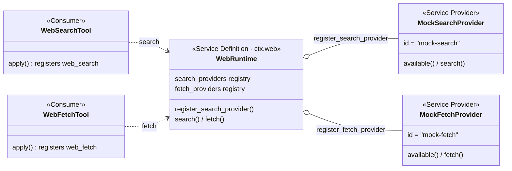
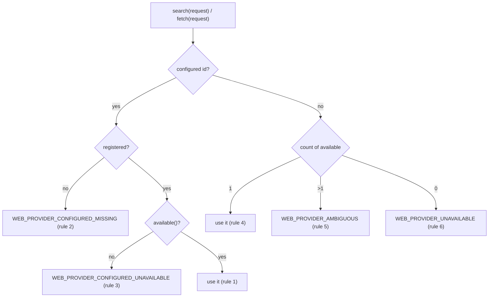
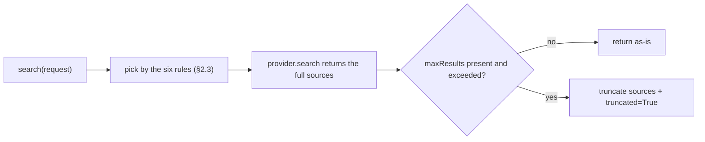
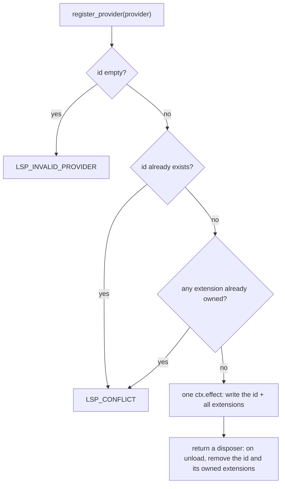
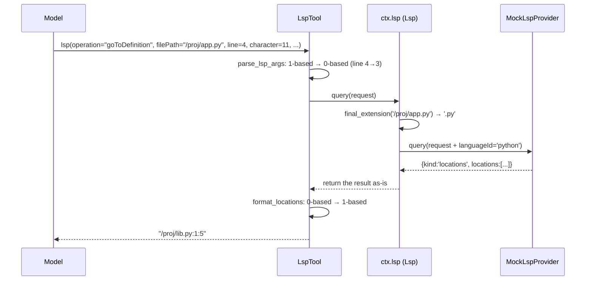

# Chapter 13: web / lsp Capabilities: Who Serves Is Decided at Execution Time

> Visitors check in first; who answers the call is decided at execution time.

## Questions this chapter answers

- Chapter 5 established that a capability's implementation is a registered provider, but why can't a search / fetch just write the specific engine call directly into the function?
- Chapter 12's skill merges multiple sources before reading them out, but web picks exactly one provider at execution time — which one?
- Chapter 12's `register_provider` registers one provider at a time, but one lsp provider covers multiple extensions — how do you avoid the "half-registered" intermediate state?

Chapter 5 set up the three-role skeleton of the capability seam and gave the first shape: shell's "pick-one-at-composition-time"; Chapter 12 gave the second shape: skill's provider registry — multiple sources registered side by side, merged by rule on read. This chapter looks at two more external-capability seams in the same provider-registry family: `ctx.web` (search / fetch) and `ctx.lsp` (code semantic query). They share the same origin as skill — implementations are all registered providers — but the "read" style changes: web picks **one** provider from the registry by rule on every execution and normalizes the result into a unified structure; lsp routes requests to the **single** provider by file extension and normalizes the results of four operations into a closed union.

The teaching code for this chapter is in `ch13/code/`, run with `python3 ch13/code/main.py` (depends on ch01/ch04 teaching code, no third-party libraries).

The three seam roles from Chapter 5 (Service Definition / Service Provider / Consumer) are all reused here; the seam shape advances one step further on top of Chapter 12:

| | Chapter 5 shell seam | Chapter 12 skill seam | This chapter's web / lsp seam |
|---|---|---|---|
| Implementation count | pick one at composition time | multiple providers registered side by side | multiple providers registered side by side |
| Consumption style | direct method call | read the registry, merge by rule | pick one by rule at execution time (web) / route by extension (lsp) |
| Result shape | provider returns as-is | merged catalog / body | normalized: unified structure + seam cap (web) / closed union (lsp) |
| Conflict handling | none | same-name same-layer side by side, cross-layer shadowing | web: multiple available → error, never implicitly pick; lsp: extension conflict → reject wholesale |

Reuse list (no re-implementation; direct import):

- Chapter 1 `Context` / `Service` (`ch01/code/cordis.py`): construction-is-registration — `WebRuntime(ctx)` auto-binds as `ctx.web`, `Lsp(ctx)` auto-binds as `ctx.lsp`; registration always goes through `ctx.effect`, teardown via the returned disposer;
- Chapter 4 `ToolRuntime` / `ToolDefinition` / `ToolExecution` (`ch04/code/tools.py`): the three tools `web_search` / `web_fetch` / `lsp` are all ordinary tools in the tools pipeline.

All new code lives in `ch13/code/`: `web_runtime.py` (web definition layer), `web_providers.py` (web implementation layer), `lsp_runtime.py` (lsp definition layer), `lsp_providers.py` (lsp implementation layer), `tool_web.py` / `tool_lsp.py` (consumer layer), `bad_example.py` (problem counter-example), `main.py` (staged demonstration).

## 1. Hard-Wiring the External Capability into the Caller

First the counter-example `ch13/code/bad_example.py` — for "search", the engine is written directly into the function body:

```python
def engine_brave_search(query):
    """Engine A (simulates a real search API): returns its own private format."""
    return {"links": [{"t": f"brave:{query}", "u": f"https://brave.example/{query}"}]}


def engine_mock_search(query):
    """Engine B (simulates a test stub): returns a different private format."""
    return {"sources": [{"title": f"mock:{query}", "url": f"https://mock.example/{query}"}]}


def web_search(query, engine="brave"):
    # pit 1: hard-wired implementation — the engine appears as branches inside the function body
    # pit 2: scattered choice — which engine to use is decided by caller args, with no unified rule
    if engine == "brave":
        return engine_brave_search(query)
    return engine_mock_search(query)


def render_for_model(raw):
    # pit 3: result not normalized — the caller must know every engine's format
    if "links" in raw:
        items = [(x["t"], x["u"]) for x in raw["links"]]
    else:
        items = [(x["title"], x["url"]) for x in raw["sources"]]
    return "\n".join(f"- {title} {url}" for title, url in items)
```

The file's `__main__` part has two callers each calling `web_search`; run `python3 ch13/code/bad_example.py` for output:

Note: the **return values** of the two calls are two completely different structures (`{'links': ...}` vs `{'sources': ...}`) — the two output segments below look identical precisely because `render_for_model` writes one format-recognition branch per engine; same output shape does not mean the structure is normalized.

```text
caller 1 (hard-wired brave):
- brave:seam https://brave.example/seam

caller 2 (wants mock, must edit the call args and confirm the format branch recognizes mock's format):
- mock:seam https://mock.example/seam

want to add a third engine? you must edit web_search's branches, render_for_model's format recognition,
and every call site — while all they ever wanted was just "do a search".
```

Three pits:

1. **Hard-wired implementation**: the engine appears as branches in `web_search`'s body. Swapping an engine = editing the function body, and every caller is affected;
2. **Scattered choice**: "which engine" is decided by each caller writing its own argument, with no unified rule. When multiple engines are available at once, different callers may make different choices, and behavior is inconsistent;
3. **Result not normalized**: engine A returns `links`, engine B returns `sources`, and `render_for_model` must recognize every format; adding an engine means adding a format-recognition branch.

The three pits point to one missing set of mechanisms: implementations should be **registered** rather than hard-wired (fixes pit 1), choice should be **concentrated into one set of rules** (fixes pit 2), and results should be **normalized into a unified structure** (fixes pit 3). These are exactly the three jobs of the web seam.

## 2. web seam: Registration Is an Effect, Selection Happens at Execution Time

### 2.1 The Three Roles: Assembly First

The overall assembly (corresponding to `ch13/code/web_runtime.py`, `web_providers.py`, `tool_web.py`):



- **Service Definition**: `WebRuntime`, bound as `ctx.web`. It never touches the network itself; it only manages two things: who is present (two registries) and who is picked (the selection rule at execution time). The set of methods it exposes — `search` / `fetch` — is called the **method surface** in the code comments, the concretization of Chapter 5's contract surface in this chapter;
- **Service Provider**: objects implementing the provider contract — the `id` + `available()` + `search()`/`fetch()` trio. The teaching version gives four deterministic mocks (`MockSearchProvider` / `EchoSearchProvider` / `PremiumSearchProvider` / `MockFetchProvider`);
- **Consumer**: `WebSearchTool` / `WebFetchTool` — register `web_search` / `web_fetch` into Chapter 4's `ctx.tools`; the execute body only calls `ctx.web`.

Before taking it apart, first run the minimal example (inline example, runnable in the `ch13/code/` directory):

```python
from web_runtime import WebRuntime          # importing also registers the ch01 path
from web_providers import MockSearchProvider
from cordis import Context                  # Chapter 1 context container

ctx = Context()
web = WebRuntime(ctx)                       # constructed-is-registered, ctx.web usable
web.register_search_provider(MockSearchProvider())
print(web.search({"query": "seam"})["sources"][0]["title"])
ctx.dispose()
# output: Capability seam
```

Register a provider, search once, get back a normalized `sources` — the rest of this chapter answers "what happens behind that one line".

### 2.2 Two Registries and the Registration Effect

Why two registries? Search and fetch are two completely independent capabilities: an engine that can search may not be able to fetch pages, and one that can fetch may not be able to search. So `WebRuntime` stores them in separate tables and picks from each separately (excerpt from `web_runtime.py`):

```python
class WebRuntime(Service):
    # ... class docstring omitted (its last line states the selection semantics: "resolved at execution time, never depending on registration order", index.ts:62-73) ...

    def __init__(self, ctx, config=None):
        super().__init__(ctx, "web")
        config = config or {}
        # the configured provider ids (index.ts:80-83); the real version can also be overridden by env vars (index.ts:92-93)
        self.configured_search = config.get("searchProvider")
        self.configured_fetch = config.get("fetchProvider")
        self.search_providers = {}  # the search registry (index.ts:85)
        self.fetch_providers = {}   # the fetch registry (index.ts:86)

    def register_search_provider(self, provider):
        """Register a search provider (index.ts:103-105)."""
        return self._register_provider(self.search_providers, provider)

    def register_fetch_provider(self, provider):
        """Register a fetch provider (index.ts:114-116)."""
        return self._register_provider(self.fetch_providers, provider)

    def _register_provider(self, registry, provider):
        """Registration is an effect: registration writes the table, teardown restores it (index.ts:118-129)."""
        if provider.id in registry:
            raise WebError("WEB_DUPLICATE_PROVIDER",
                           f"duplicate web provider id: {provider.id}")

        def setup():
            registry[provider.id] = provider  # the ctx.effect body (index.ts:122-125)

            def dispose():
                if registry.get(provider.id) is provider:
                    del registry[provider.id]

            return dispose

        return self.ctx.effect(setup, label=f"web-provider:{provider.id}")
```

Three details:

1. A duplicate id is rejected outright (`WEB_DUPLICATE_PROVIDER`) — one provider is not allowed to quietly replace another;
2. The registration action is wrapped in Chapter 1's `ctx.effect`: setup writes the table, dispose removes from the table, and on removal it first confirms the slot still holds itself (if the slot changed hands, don't wrongly delete);
3. The return value is a disposer — registration is undoable, same shape as Chapter 12's `SkillRegistry.register_provider`.

The provider contract's `available()` has one convention: **only do local checks, never make a network call** — it is called on every selection at execution time, so its cost must be bounded (types.ts:101). `PremiumSearchProvider` demonstrates this (excerpt from `web_providers.py`):

```python
class PremiumSearchProvider:
    """A provider simulating "API key not configured": registered but available() returns False.

    Used to demonstrate rules 3/6: the seam never hands a request to an unavailable provider.
    """

    id = "premium-search"

    def __init__(self, api_key=None):
        self.api_key = api_key

    def available(self):
        """Only checks local config (corresponding to the semantics of DeepSeekSearchProvider.available)."""
        return self.api_key is not None

    # ... search omitted: it is never reached, seam rules 3/6 filter first ...
```

**Review**: pit 1 "hard-wired implementation" is cured here — an engine is no longer branches in a function body but a provider registered into the registry. But once multiple providers coexist, "who to pick" becomes a new problem — exactly pit 2.

### 2.3 Selection at Execution Time: Six Rules

When `search` is called it does not look at the registry directly, but first picks a provider by rule. **Selection at execution time** means: on every call the seam picks one provider out of the registry by its own rules, independent of registration order — like a front desk dispatching visitors by the duty roster, not by familiarity.

```python
    def search(self, request):
        """the search method surface: pick by rule → provider.search → cap_sources (index.ts:140-147)."""
        provider = self._resolve_provider(self.search_providers,
                                          self.configured_search)
        result = provider.search(request)
        return cap_sources(result, request.get("maxResults"))

    def fetch(self, request):
        """the fetch method surface: pick by rule → provider.fetch (index.ts:157-163)."""
        provider = self._resolve_provider(self.fetch_providers,
                                          self.configured_fetch)
        return provider.fetch(request)

    def _resolve_provider(self, registry, configured_id):
        """Pick at execution time: six rules, never depending on registration order (index.ts:172-194)."""
        if configured_id is not None:
            provider = registry.get(configured_id)
            if provider is None:
                # rule 2: the configured id is not registered
                raise WebError("WEB_PROVIDER_CONFIGURED_MISSING",
                               f"configured provider not registered: {configured_id}")
            if not provider.available():
                # rule 3: the configured id is registered but unavailable
                raise WebError("WEB_PROVIDER_CONFIGURED_UNAVAILABLE",
                               f"configured provider unavailable: {configured_id}")
            return provider  # rule 1: the configured id is registered and available
        usable = [p for p in registry.values() if p.available()]
        if len(usable) == 1:
            return usable[0]  # rule 4: not configured and exactly one available
        if len(usable) > 1:
            # rule 5: multiple available → error, never implicitly pick "the first registered one"
            ids = ", ".join(sorted(p.id for p in usable))
            raise WebError("WEB_PROVIDER_AMBIGUOUS",
                           f"multiple providers available, configure one: {ids}")
        # rule 6: none available
        raise WebError("WEB_PROVIDER_UNAVAILABLE", "no web provider available")
```

The six rules fall into two halves: with a configured id, rules 1–3 apply (registered and available → use it; not registered → `CONFIGURED_MISSING`; registered but unavailable → `CONFIGURED_UNAVAILABLE`); without one, rules 4–6 apply (exactly one available → use it; multiple available → `AMBIGUOUS` error; none available → `UNAVAILABLE` error).



The most counter-intuitive is rule 5: when multiple providers are available at once, the seam does not pick one — it errors directly. Why not implicitly pick "the first registered one"? Because that would make behavior depend on registration order — an accidental factor invisible to the caller. Erroring forces the user to write the choice explicitly into config, making the choice deterministic from then on. `main.py` stage 2 runs all six rules one by one on an isolated `ctx`; for rule 4 it deliberately registers the unavailable `premium-search` first and then the available `mock-search`, and the picked one is still `mock-search` — the selection is independent of registration order.

**Review**: pit 2 "scattered choice" is cured here — the selection logic lives only in `_resolve_provider`, and all callers face the same set of rules. Pit 3 remains: each provider's returned result still has its own format.

## 3. Normalizing Results: the Cap Lives in the seam, the body Is a Union

### 3.1 capSources: Providers Don't Know the Cap

A search request can carry `maxResults`, but the seam does not pass it to the provider — instead it truncates after the provider returns the full set. The cap lives in the seam and every provider benefits uniformly (a module-level function, called at the end of §2.3's `search`):

```python
def cap_sources(result, max_results):
    """The seam enforces maxResults: truncates sources and sets truncated (index.ts:197-200).

    Providers need not know the cap — the cap lives in the seam, every provider benefits uniformly.
    """
    sources = result["sources"]
    if max_results is None or len(sources) <= max_results:
        return result
    return {
        "query": result["query"],
        "sources": sources[:max_results],
        "truncated": True,
    }
```



Two benefits: a new provider need not implement truncation and benefits automatically; the cap semantics are concentrated in one place, so providers can't implement it inconsistently. `main.py` stage 3: searching `"seam"` without `maxResults` returns 5 sources; `maxResults=3` returns 3 and `truncated=True`.

### 3.2 fetch Results: status Is Data, body Is a Union

The search result is already normalized (`{"query", "sources"}`, types.ts:34/:49); the fetch result also has a unified structure `{"url", "status", "body"}` (types.ts:73), where `body` is a union — either `{"kind": "text", "text"}` or `{"kind": "html", "html"}` (types.ts:93), and the consumer just branches on `kind`. Look at `MockFetchProvider` (excerpt from `web_providers.py`):

```python
class MockFetchProvider:
    """A deterministic fetch provider: a fixed URL→page table (corresponding to the role of HttpFetchProvider)."""

    id = "mock-fetch"

    # ... the PAGES page table omitted: three URLs for text / html / binary ...

    def available(self):
        return True

    def fetch(self, request):
        """Returns a WebFetchResult: url + status + body (types.ts:73); body is the html|text union (types.ts:93)."""
        url = request["url"]
        page = self.PAGES.get(url)
        if page is None:
            return {"url": url, "status": 404,
                    "body": {"kind": "text", "text": "not found"}}
        if page["kind"] == "binary":
            # the real HttpFetchProvider rejects unsupported content types here
            raise WebError("WEB_UNSUPPORTED_CONTENT_TYPE",
                           f"unsupported content: {url}")
        return {"url": url, "status": 200, "body": page}
```

Note the boundary between error and return value: 404 is not an exception but a normal return value (the `status` field) — "page does not exist" is one of the business outcomes; only contract violations like "unsupported content type" throw `WebError`. `main.py` stage 4 fetches four URLs in a row: a text page, an html page (`body.kind='html'`), a missing page (404), and a binary resource (throws `WEB_UNSUPPORTED_CONTENT_TYPE`, the caller catches it and prints the error code).

**Review**: pit 3 "result not normalized" is cured here — search returns the unified `{"query", "sources"}`, fetch returns the unified `{"url", "status", "body"}`, and the `render_for_model`-style format-recognition branches are gone. The web seam is closed; but external capability is not just "going online" — the model also needs to "understand code".

## 4. lsp seam: Extension Routing, Atomic Registration, and the Closed Union

Code-semantic queries (go-to-definition, find-references) depend on a language server, and a single language server only understands one language family. So the lsp seam's selection dimension differs from web's: it is not "pick one out of many by rule" but **routing by file extension** — a `.py` file goes to the Python provider, a `.ts` file goes to the TypeScript provider. Each extension belongs to at most one provider, so there is no ambiguity by construction. `Lsp` is likewise Chapter 1's `Service`, bound as `ctx.lsp`; the routing table is a map from extension → (provider, language_id) (index.ts:84).

### 4.1 Atomic Registration: Validate Everything First, Then Write the Table Once

A provider often covers multiple extensions (e.g. `.ts` + `.tsx`). If you write the routing table extension by extension, you might only discover a conflict on the second one after the first is already written in — leaving a "half-registered" intermediate state. The lsp seam's answer is **atomic registration** (all-or-nothing): finish all validation first, then write the table in one shot; like a bank transfer, the debit and credit sides either both succeed or both take no effect.

```python
class Lsp(Service):
    """The ctx.lsp service: extension → routing table + atomic registration (index.ts:82).

    The seam only manages "which extension belongs to which provider":
    - register_provider: validate everything first, then write the table once, leaving no trace on failure
    - query: route by file extension, passing languageId through to the provider
    """

    def __init__(self, ctx):
        super().__init__(ctx, "lsp")
        self.routes = {}  # extension -> (provider, language_id) (index.ts:84)
        self.provider_ids = set()

    def register_provider(self, provider):
        """Atomic registration: validate everything first, then write the table once (index.ts:90-141).

        Three checks: empty id → LSP_INVALID_PROVIDER; duplicate id or extension
        conflict → LSP_CONFLICT. Only after all pass does a single ctx.effect write
        the id + all extensions (index.ts:129-138), so there is no "half-registered"
        intermediate state.
        """
        if not provider.id:
            raise LspError("LSP_INVALID_PROVIDER", "provider id must be non-empty")
        if provider.id in self.provider_ids:
            raise LspError("LSP_CONFLICT", f"duplicate provider id: {provider.id}")
        for ext in provider.extensions:
            ext = normalize_extension(ext)
            owner = self.routes.get(ext)
            if owner is not None:
                raise LspError("LSP_CONFLICT",
                               f"extension {ext} already owned by provider {owner[0].id}")

        def setup():
            self.provider_ids.add(provider.id)
            for ext in provider.extensions:
                self.routes[normalize_extension(ext)] = (provider, provider.language_id)

            def dispose():
                self.provider_ids.discard(provider.id)
                owned = [e for e, route in self.routes.items() if route[0] is provider]
                for ext in owned:
                    del self.routes[ext]

            return dispose

        return self.ctx.effect(setup, label=f"lsp-provider:{provider.id}")
```



The three checks (empty id / duplicate id / extension conflict) all complete before any table-writing action; only after all pass does **one** `ctx.effect` write `provider_ids` and all extensions — either everything is written, or not a single extension is. `main.py` stage 5 verifies each case: duplicate id → `LSP_CONFLICT`; a new id but `.py` already owned → `LSP_CONFLICT`; the `rust-py` provider declares two extensions `(.rs, .py)` and `.py` conflicts → rejected wholesale, and afterwards `routes` has no `.rs` either; then registering the single-extension `mock-ts` succeeds, and calling the disposer rolls back `mock-ts` along with its extension.

### 4.2 query: Route by Extension, Pass languageId Through

```python
    def query(self, request):
        """Query entry: route by file extension, no match → LSP_UNAVAILABLE (index.ts:143-149)."""
        ext = final_extension(request["filePath"])
        route = self.routes.get(ext)
        if route is None:
            raise LspError("LSP_UNAVAILABLE",
                           f"no lsp provider for extension: {ext or '<none>'}")
        provider, language_id = route
        # the seam passes languageId through: the provider need not guess the language from the extension itself
        return provider.query({**request, "languageId": language_id})
```

Two module-level helper functions: `final_extension` takes the extension after the last path separator — `'a/b.py'` → `'.py'`; `'a.d/b'` → `''` (the dot is before the separator, so it does not count); `'.hidden'` → `''` (a leading dot is a hidden file, not an extension); `normalize_extension` lowercases uniformly, so `.PY` and `.py` route to the same provider. One detail: when routing, the seam injects `languageId` into the request before passing it through — the language attribution is already fixed at registration time, so the provider need not guess.

### 4.3 Four Operations and the Closed Union

lsp has four operations: `goToDefinition` / `findReferences` / `goToImplementation` / `hover` (types.ts:17). The results of the four operations are normalized into a **closed union** — a result can only fit into one of two drawers: `locations` (zero or more locations) or `hover` (hover information), with no third shape; a consumer branching on `kind` with two cases exhausts every possibility.

```python
class MockLspProvider:
    """A deterministic lsp provider: take the identifier at the position, then look up the symbol table.

    Keeps the real provider contract (types.ts:95-107): id, extensions, language_id, query.
    """

    # ... __init__ omitted: holds id / extensions / language_id / documents / symbols ...

    def query(self, request):
        """The four operations return the closed union (types.ts:85-87): locations or hover."""
        word = self._word_at(request["filePath"], request["position"])
        info = self.symbols.get(word) if word else None
        if request["operation"] == "hover":
            hover = ({"contents": info["hover"], "range": None} if info
                     else {"contents": None, "range": None})
            return {"kind": "hover", "hover": hover}
        if info is None:
            locations = []
        elif request["operation"] == "goToDefinition":
            locations = [info["definition"]]
        elif request["operation"] == "findReferences":
            locations = list(info["references"])
        elif request["operation"] == "goToImplementation":
            locations = [info["implementation"]]
        else:
            raise LspError("LSP_UNSUPPORTED_OPERATION",
                           f"unsupported operation: {request['operation']}")
        return {"kind": "locations", "locations": locations,
                "resolvedWorkspaceUri": request.get("workspaceUri")}
```

The semantics of the four operations: `goToDefinition` returns the single definition location; `findReferences` returns zero or more reference locations; `goToImplementation` returns the implementation location; `hover` returns the symbol's documentation info (may be empty). `locations` uniformly holds `{uri, range}` structures, where `range`'s line/column are **zero-based** UTF-16 coordinates (types.ts:28-31) — this is the LSP protocol convention, and the coordinate conversion on the model side is left to the tool layer (§5.2). The teaching provider uses `_word_at` to take the identifier at a position from a fixed document, then looks up a fixed symbol table, reproducing the two-step "locate → query" action; the real backend is a language-server process, see §7 Source Code Mapping.

## 5. The Consumption Layer: Three Tools Enter the tools Pipeline

The model never touches `ctx.web` / `ctx.lsp` directly — what it faces are three tools registered into Chapter 4's `ctx.tools`, all going through the same `ToolRuntime` pipeline.

### 5.1 tool-web: execute Only Calls the seam

```python
WEB_SEARCH_MAX_RESULTS = 8  # search.ts:20


class WebSearchTool:
    """The web_search tool: execute only calls ctx.web.search (search.ts:259-264)."""

    inject = ["tools", "web"]

    def __init__(self, ctx):
        self.ctx = ctx

    # ... apply() registers a ToolDefinition into ctx.tools, same shape as Chapter 12's SkillTool ...

    def _execute(self, args):
        query = args.get("query")
        if not query:
            return "web_search failed: query is required"
        max_results = args.get("maxResults") or WEB_SEARCH_MAX_RESULTS
        max_results = min(int(max_results), WEB_SEARCH_MAX_RESULTS)
        try:
            result = self.ctx.web.search({"query": query,
                                          "maxResults": max_results})
        except WebError as err:
            return f"web_search failed: {err.code}: {err}"
        return format_search_output(result)
```

(Module-level constant and class definition, excerpted from `tool_web.py`.) The `inject` declaration matches actual usage: `apply` reads `ctx.tools`, `_execute` reads `ctx.web`; the real version also injects `systemPrompt` to write a prompt section, but the teaching version does not introduce this ([teaching decision], see §7). Note the division of labor between the two caps: the tool layer clamps the model-supplied `maxResults` to ≤8, and the seam layer's `cap_sources` then truncates the provider's output — two checkpoints that do not trust each other. `format_search_output` renders the normalized result into plain text for the model (a numbered list + a truncation notice). `web_fetch` is isomorphic: `_execute` only calls `ctx.web.fetch`, then uses `render_body` to render `body` — text is returned as-is, html is naively tag-stripped ([teaching simplification], the real version uses turndown to convert to markdown, see §7).

### 5.2 tool-lsp: One Tool Carries Four Operations

The real source registers only one `lsp` tool, with the four operations distinguished by an `operation` parameter (render.ts:15). For the model, one tool + a parameter is cheaper than four tools — the tool description occupies only one share of context, and the four operations' parameters (file + position) are identical. The key at the tool layer is coordinate conversion: the line numbers the model sees when reading a file usually start at 1, while the LSP protocol uses 0-based, and `parse_lsp_args` does the conversion at the entry (excerpted from `tool_lsp.py`):

```python
LSP_OPERATIONS = ("goToDefinition", "findReferences",
                  "goToImplementation", "hover")  # render.ts:15


def parse_lsp_args(args):
    """Model-side 1-based line/column → protocol 0-based (render.ts:46-59, conversion at :51-52)."""
    operation = args.get("operation")
    if operation not in LSP_OPERATIONS:
        raise LspError("LSP_UNSUPPORTED_OPERATION",
                       f"unknown operation: {operation}")
    file_path = args.get("filePath")
    if not file_path:
        raise LspError("LSP_UNAVAILABLE", "filePath is required")
    line = args.get("line")
    character = args.get("character")
    if (not isinstance(line, int) or not isinstance(character, int)
            or line < 1 or character < 1):
        raise LspError("LSP_UNAVAILABLE",
                       "line/character must be 1-based positive integers")
    return {
        "operation": operation,
        "filePath": file_path,
        # 1-based → 0-based conversion (render.ts:51-52)
        "position": {"line": line - 1, "character": character - 1},
        "workspaceUri": args.get("workspaceUri"),
    }
```

(Module-level constant and function.) The three steps of `LspTool._execute`: first `parse_lsp_args` (argument validation + coordinate conversion), then check `workspaceUri` (no workspace → `LSP_WORKSPACE_REQUIRED`, index.ts:184), then `ctx.lsp.query` (index.ts:186-191), and finally render by `kind` — `locations` renders to `file:line:column` (adding 1 back to line/column), `hover` renders to documentation text. The complete path of one query:



**Review**: all three pits from §1 are closed — implementation registration (§2.2), centralized selection (§2.3), normalized results (§3, §4.3); the model faces three tools, and the seam and providers are completely invisible to the model.

## 6. Complete Run Output

Run `python3 ch13/code/main.py` (depends on ch01/ch04 teaching code, no third-party libraries); the stage numbers in the output correspond one-to-one with `main.py`'s seven stages:

```text
========================================================================
stage 1 — assembly: two seams + three tools
========================================================================
ctx.web providers: {'search': ['mock-search', 'premium-search'], 'fetch': ['mock-fetch']}
ctx.lsp providers: ['mock-python']
ctx.tools visible tools: ['web_search', 'web_fetch', 'lsp']

========================================================================
stage 2 — web selection at execution time: six rules
========================================================================
  rule 1: configured id registered and available -> normal return, 5 sources
  rule 2: configured id not registered -> WEB_PROVIDER_CONFIGURED_MISSING
  rule 3: configured id registered but unavailable -> WEB_PROVIDER_CONFIGURED_UNAVAILABLE
  rule 4: not configured, exactly one available (an unavailable one registered first is still not picked) -> normal return, 5 sources
  rule 5: not configured, multiple available -> WEB_PROVIDER_AMBIGUOUS
  rule 6: not configured, none available -> WEB_PROVIDER_UNAVAILABLE

========================================================================
stage 3 — the search method surface: capSources enforces maxResults
========================================================================
without maxResults: 5 sources, truncated=False
maxResults=3: 3 sources, truncated=True
first source: Capability seam

========================================================================
stage 4 — the fetch method surface: body is the html|text union
========================================================================
  https://docs.example/seam -> [200] body.kind=text
  https://docs.example/guide -> [200] body.kind=html
  https://docs.example/missing -> [404] body.kind=text
  https://docs.example/logo.png -> WEB_UNSUPPORTED_CONTENT_TYPE

========================================================================
stage 5 — lsp atomic registration: validate everything first, then write the table once
========================================================================
  duplicate id mock-python -> LSP_CONFLICT: duplicate provider id: mock-python
  extension .py conflict (id is new) -> LSP_CONFLICT: extension .py already owned by provider mock-python
  multiple extensions, .py conflict (should reject wholesale) -> LSP_CONFLICT: extension .py already owned by provider mock-python
  after rejection .rs not registered: routes=['.py']
  after registering mock-ts: providers=['mock-python', 'mock-ts']
  after disposer rollback: providers=['mock-python']

========================================================================
stage 6 — lsp query: extension routing + four-operation closed union
========================================================================
  goToDefinition     -> ['/proj/lib.py:0:4']
  findReferences     -> ['/proj/app.py:3:10']
  goToImplementation -> ['/proj/lib.py:0:4']
  hover              -> hover: 'def helper() -> str\nreturns a greeting'
  .rs has no provider -> LSP_UNAVAILABLE

========================================================================
stage 7 — the model's view: three tools through the Chapter 4 tools pipeline
========================================================================
web_search ->
search: seam
1. Capability seam
   https://docs.example/seam
   the seam defines the contract, not the implementation
2. Provider registry
   https://docs.example/registry
   providers register at runtime
(results truncated by maxResults)

web_fetch ->
[200] https://docs.example/guide
guide
register first, then select at execution time.

lsp (model-side 1-based line=4 character=11) ->
/proj/lib.py:1:5
```

Stage-by-stage reading:

- **stage 1**: `WebRuntime(ctx)` / `Lsp(ctx)` are registered at construction, bound as `ctx.web` / `ctx.lsp`; the three tools are already in `ctx.tools`;
- **stage 2**: the six rules each run through. Rule 4 registers the unavailable `premium-search` first, and the outcome is "normal return, 5 sources" — what gets picked is the only available one `mock-search`; an unavailable one registered first is still not picked;
- **stage 3**: `cap_sources` truncates at the seam; the provider is unaware of the cap;
- **stage 4**: 404 is a normal return value; only a contract violation (binary) goes through an error code;
- **stage 5**: atomic registration — if `.py` conflicts then `.rs` is not written either; the disposer rollback removes the extensions along with it;
- **stage 6**: four operations, one entry, and the result has only two shapes `locations` / `hover`; note the coordinates are 0-based (`/proj/lib.py:0:4`) — this is the seam's and provider's view;
- **stage 7**: the model passes 1-based coordinates (`line=4, character=11`), the tool layer converts then queries, and adds 1 back when rendering (`/proj/lib.py:1:5`) — for the same query, the coordinates in stage 6 and stage 7 differ by 1, which is exactly the round-trip conversion of `parse_lsp_args` and `format_locations`.

## 7. Source Code Mapping

The correspondence between this chapter's teaching code and the real source:

| Teaching code | Real source |
|---|---|
| `web_runtime.py` `WebRuntime` | `packages/web/web/src/index.ts:74` `WebRuntime` |
| `WebRuntime.__init__` the two registries | `index.ts:85-86` `searchProviders` / `fetchProviders` |
| `_register_provider` registration is an effect | `index.ts:118-129` `registerProvider` |
| `_resolve_provider` the six rules | `index.ts:172-194` `resolveProvider` |
| `cap_sources` | `index.ts:197-200` `capSources` |
| `WebError` + error codes | `types.ts:129` `WebError` (error codes in that line's comment) |
| `web_providers.py` the four mock providers | `packages/web/web-fetch-http/src/provider.ts:36` `HttpFetchProvider`, `packages/web/web-search-deepseek/src/provider.ts:177` `DeepSeekSearchProvider` |
| `lsp_runtime.py` `Lsp` | `packages/lsp/lsp/src/index.ts:82` `Lsp` |
| `Lsp.register_provider` atomic registration | `index.ts:90-141` |
| `Lsp.query` extension routing | `index.ts:143-149` |
| `final_extension` / `normalize_extension` | `index.ts:60-67` / `index.ts:153-156` |
| `LspError` + error codes | `index.ts:50` `LspError` (error codes in that line's comment) |
| `lsp_providers.py` `MockLspProvider` | `packages/lsp/lsp-stdio/src/index.ts:217` `LocalLspProvider` (class definition; query :260-303, enqueue :306-317) |
| `tool_web.py` `WebSearchTool` / `WebFetchTool` | `packages/web/tool-web/src/search.ts:259` / `fetch.ts:479-484` |
| `WEB_SEARCH_MAX_RESULTS` | `search.ts:20` (=8) |
| `tool_lsp.py` `LspTool` | `packages/lsp/tool-lsp/src/index.ts:98-229` (`applyLspTool`; `defineTool` :106-228) |
| `parse_lsp_args` 1-based → 0-based | `render.ts:46-59` (conversion at :51-52) |
| `LSP_OPERATIONS` the four operations | `render.ts:15`, `types.ts:17` `LspOperation` |
| `bad_example.py` | no correspondence (teaching counter-example) |

**Teaching decisions** (active choices):

1. All providers are deterministic mocks — no network requests, no language-server process, output reproducible (`main.py`, `web_providers.py`, `lsp_providers.py` docstrings);
2. `tool_web` / `tool_lsp` do not introduce `systemPrompt` injection, only registering the tools into `ctx.tools`, handled the same as Chapter 12's `tool_skill` (`tool_web.py`, `tool_lsp.py` docstrings);
3. Keep the model-side 1-based line/column ↔ protocol 0-based conversion — this is the real source's actual behavior, not a simplification (`tool_lsp.py` docstring).

**Teaching simplifications** (downgrades):

1. `render_body`: the real version uses turndown to convert HTML to markdown (`fetch.ts` renderBody), the teaching version naively strips tags (`tool_web.py` `render_body`);
2. `render_uri`: the real version has URI rendering logic (`render.ts:138-165`), the teaching version returns it as-is (`tool_lsp.py` `render_uri`).

## 8. Summary and Preview

| Mechanism | Symbol | Which pit it cures / what problem it solves |
|---|---|---|
| Implementation registration | `_register_provider` / `Lsp.register_provider` | pit 1: hard-wired implementation |
| Selection at execution time (six rules) | `_resolve_provider` | pit 2: scattered selection |
| Normalized result + seam cap | `cap_sources`, `{"url","status","body"}` | pit 3: non-normalized result |
| Atomic registration | `Lsp.register_provider` | the "half-registered" intermediate state of multi-extension registration |
| Extension routing + languageId pass-through | `Lsp.query` | multi-language providers each manage their own |
| Closed union | `MockLspProvider.query` | the result shapes of the four operations are bounded |
| Tool-layer coordinate conversion | `parse_lsp_args` | model 1-based vs protocol 0-based |

The web/lsp seams inherit Chapter 5's triple-role skeleton and Chapter 12's provider-registry shape, adding four mechanisms: **selection at execution time** (who is chosen is decided at call time, not registration time), **normalized results** (the seam unifies structure and cap), **atomic registration** (multi-extension registration has no intermediate state), and the **closed union** (multiple operations share one entry, result shapes are bounded). The next chapter will move from capability seams to the interaction layer, covering interaction, permission, goal, and plan.

## 9. Appendix: Key Concepts Cheat Sheet

Lower layer (contracts and errors):

| Concept | Location | One sentence |
|---|---|---|
| Provider contract | `web_providers.py` / `lsp_providers.py` | `id` + `available()` + capability methods; `available` only does local checks |
| `WebError` / `LspError` | `web_runtime.py` / `lsp_runtime.py` | unified errors with a machine-readable code |
| Closed union | `lsp_providers.py` `query` | the result has only two shapes: `locations` / `hover` |

Middle layer (seams, depend on the lower layer):

| Concept | Location | One sentence |
|---|---|---|
| `WebRuntime` (`ctx.web`) | `web_runtime.py` | two registries + six-rule selection at execution time + `cap_sources` |
| `Lsp` (`ctx.lsp`) | `lsp_runtime.py` | extension routing + atomic registration + `languageId` pass-through |
| The six rules | `WebRuntime._resolve_provider` | configured → rules 1-3, not configured → rules 4-6; multiple available always errors |
| Atomic registration | `Lsp.register_provider` | validate everything first, then write the table once, leaving no trace on failure |

Upper layer (tools, depend on the middle layer):

| Concept | Location | One sentence |
|---|---|---|
| `web_search` / `web_fetch` | `tool_web.py` | execute only calls `ctx.web`; the tool layer clamps `maxResults` ≤8 |
| `lsp` | `tool_lsp.py` | one tool carries four operations; 1-based ↔ 0-based conversion |
