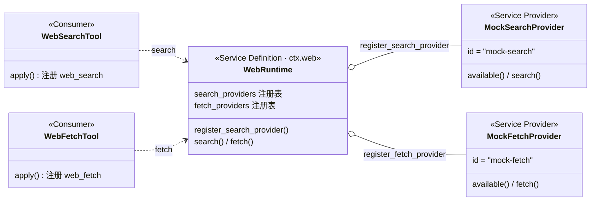
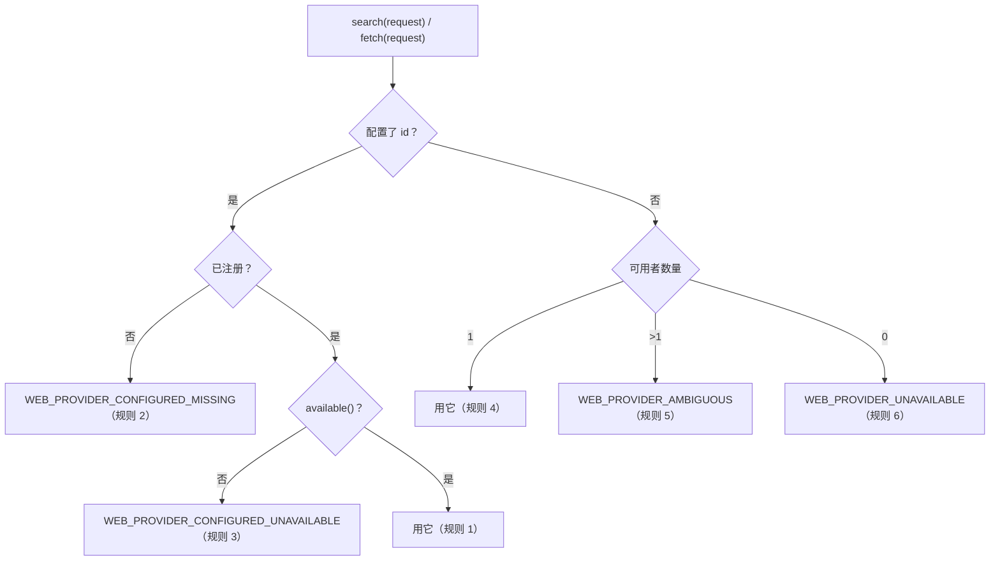
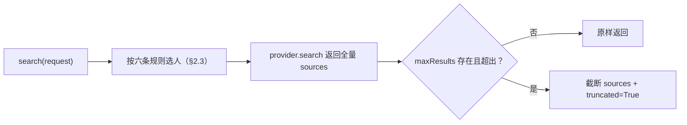
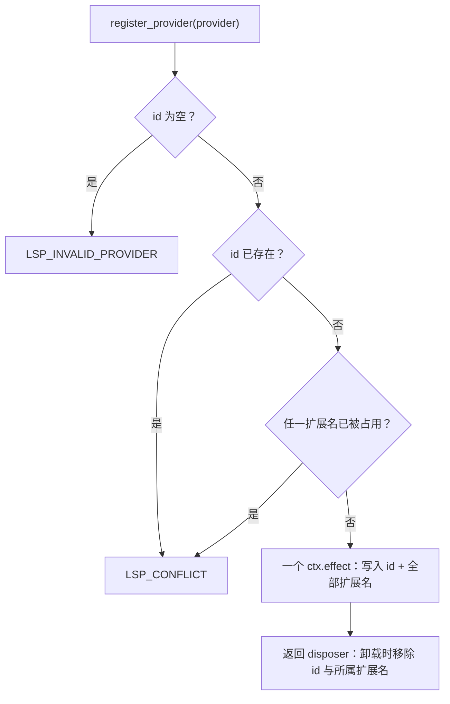
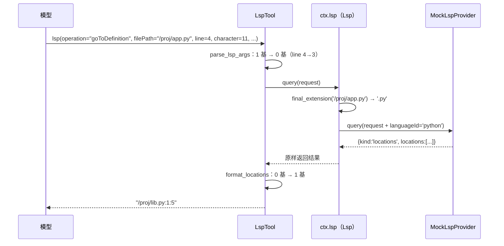

# 第 13 章 web / lsp 能力：选谁在执行时决定

> 来客先报名；谁来应差，执行时定。

## 本章回答的问题

- 第 5 章确立了能力实现是注册进来的提供者，但搜索 / 抓取为什么不能把具体引擎调用直接写进函数？
- 第 12 章的 skill 把多个来源合并后读出，但 web 在执行时只选一个提供者，选谁？
- 第 12 章的 `register_provider` 一次注册一个提供者，但一个 lsp 提供者覆盖多个扩展名，怎么避免「注册了一半」的中间态？

第 5 章立下了能力 seam 的三角色骨架，并给出第一种形态：shell 的「组合时二选一」；第 12 章给出第二种形态：skill 的 provider 注册表——多来源并存注册、读取时按规则合并。本章看同属 provider 注册表一族的另外两条外部能力 seam：`ctx.web`（搜索 / 抓页）与 `ctx.lsp`（代码语义查询）。它们与 skill 同源——实现都是注册进来的 provider——但「读取」的方式变了：web 在每次执行时按规则从注册表里选出**一个**提供者，并把结果归一化成统一结构；lsp 按文件扩展名把请求路由到**唯一**的提供者，并把四种操作的结果归一成一个闭并集。

本章教学代码在 `ch13/code/`，运行 `python3 ch13/code/main.py`（依赖 ch01/ch04 教学代码，无第三方库）。

第 5 章的能力 seam 三角色（Service Definition / Service Provider / Consumer）在本章全部复用；seam 形态在第 12 章的基础上再进一步：

| | 第 5 章 shell seam | 第 12 章 skill seam | 本章 web / lsp seam |
|---|---|---|---|
| 实现数量 | 组合时二选一 | 多提供者并存注册 | 多提供者并存注册 |
| 消费方式 | 直接方法调用 | 读注册表、按规则合并 | 执行时按规则选一个（web）/ 按扩展名路由（lsp） |
| 结果形态 | 提供者原样返回 | 合并后的目录 / 正文 | 归一化：统一结构 + seam 上限（web）/ 闭并集（lsp） |
| 冲突处理 | 无 | 同名同层并列、跨层遮蔽 | web：多个可用 → 报错，绝不隐式选；lsp：扩展名冲突 → 整体拒绝 |

复用清单（不重新实现，直接 import）：

- 第 1 章 `Context` / `Service`（`ch01/code/cordis.py`）：构造即注册——`WebRuntime(ctx)` 自动绑定为 `ctx.web`，`Lsp(ctx)` 自动绑定为 `ctx.lsp`；注册一律走 `ctx.effect`，卸载靠返回的 disposer；
- 第 4 章 `ToolRuntime` / `ToolDefinition` / `ToolExecution`（`ch04/code/tools.py`）：`web_search` / `web_fetch` / `lsp` 三个工具都是 tools 管线里的普通工具。

新代码全部位于 `ch13/code/`：`web_runtime.py`（web 定义层）、`web_providers.py`（web 实现层）、`lsp_runtime.py`（lsp 定义层）、`lsp_providers.py`（lsp 实现层）、`tool_web.py` / `tool_lsp.py`（消费层）、`bad_example.py`（问题反例）、`main.py`（分段演示）。

## 1. 把外部能力硬连线进调用方

先看反例 `ch13/code/bad_example.py`——「搜索」这件事，引擎直接写进了函数体：

```python
def engine_brave_search(query):
    """引擎 A（模拟真实搜索 API）：返回自己的私有格式。"""
    return {"links": [{"t": f"brave:{query}", "u": f"https://brave.example/{query}"}]}


def engine_mock_search(query):
    """引擎 B（模拟测试桩）：返回另一种私有格式。"""
    return {"sources": [{"title": f"mock:{query}", "url": f"https://mock.example/{query}"}]}


def web_search(query, engine="brave"):
    # 坑 1：实现写死 —— 引擎以分支形式出现在函数体里
    # 坑 2：选择分散 —— 用哪个引擎是调用方传参决定，没有统一规则
    if engine == "brave":
        return engine_brave_search(query)
    return engine_mock_search(query)


def render_for_model(raw):
    # 坑 3：结果不归一 —— 调用方必须认识每种引擎的格式
    if "links" in raw:
        items = [(x["t"], x["u"]) for x in raw["links"]]
    else:
        items = [(x["title"], x["url"]) for x in raw["sources"]]
    return "\n".join(f"- {title} {url}" for title, url in items)
```

文件的 `__main__` 部分以两个调用方分别调用 `web_search`，运行 `python3 ch13/code/bad_example.py` 输出：

注意：两次调用的**返回值**是两种完全不同的结构（`{'links': ...}` vs `{'sources': ...}`）——下面两段输出长得一样，恰是 `render_for_model` 为每种引擎各写一条格式识别分支的结果；输出同形，不等于结构归一。

```text
调用方 1（写死 brave）：
- brave:seam https://brave.example/seam

调用方 2（想换 mock，得改调用参数，并确认格式化分支认得 mock 的格式）：
- mock:seam https://mock.example/seam

想加第三个引擎？要改 web_search 的分支、render_for_model 的格式识别，
以及每一个调用点 —— 而它们本来只想要「搜一下」这件事。
```

三个坑：

1. **实现写死**：引擎以分支形式出现在 `web_search` 的函数体里。换引擎 = 改函数体，所有调用方跟着受影响；
2. **选择分散**：「用哪个引擎」由每个调用方各写各的参数决定，没有统一规则。多个引擎同时可用时，不同调用方可能做出不同选择，行为不一致；
3. **结果不归一**：引擎 A 返回 `links`，引擎 B 返回 `sources`，`render_for_model` 必须认识每一种格式；加一个引擎就要加一个格式识别分支。

三个坑指向同一组缺失的机制：实现应该**注册**而不是写死（治坑 1），选择应该**集中到一套规则**（治坑 2），结果应该**归一成统一结构**（治坑 3）。这正是 web seam 要做的三件事。

## 2. web seam：注册是 effect，选择在执行时

### 2.1 三角色：先看装配

整体装配（对应 `ch13/code/web_runtime.py`、`web_providers.py`、`tool_web.py` 三个文件）：



- **Service Definition**：`WebRuntime`，绑定为 `ctx.web`。它自己不碰网络，只管两件事：谁在场（两张注册表）、选谁（执行时的选择规则）。它对外暴露的方法集合——`search` / `fetch`——代码注释里称为**方法面**，是第 5 章契约面在本章的具体化；
- **Service Provider**：实现提供者契约的对象——`id` + `available()` + `search()`/`fetch()` 三件套。教学版给四个确定性 mock（`MockSearchProvider` / `EchoSearchProvider` / `PremiumSearchProvider` / `MockFetchProvider`）；
- **Consumer**：`WebSearchTool` / `WebFetchTool`——把 `web_search` / `web_fetch` 注册进第 4 章的 `ctx.tools`，execute 体只调 `ctx.web`。

拆开内部之前，先跑通最小例子（行内示例，在 `ch13/code/` 目录下可运行）：

```python
from web_runtime import WebRuntime          # import 时顺带注册 ch01 路径
from web_providers import MockSearchProvider
from cordis import Context                  # 第 1 章上下文容器

ctx = Context()
web = WebRuntime(ctx)                       # 构造即注册，ctx.web 可用
web.register_search_provider(MockSearchProvider())
print(web.search({"query": "seam"})["sources"][0]["title"])
ctx.dispose()
# 输出：Capability seam
```

注册一个提供者、搜一次、拿到归一化的 `sources`——本章剩余内容都在回答「这一行背后发生了什么」。

### 2.2 两张注册表与注册 effect

为什么是两张注册表？搜索与抓取是两种完全独立的能力：会搜索的引擎未必会抓页面，会抓页面的未必会搜索。所以 `WebRuntime` 分表存放、各自选人（摘录自 `web_runtime.py`）：

```python
class WebRuntime(Service):
    # ... 类 docstring 从略（其末行写明选择语义：「执行时解析，绝不依赖注册顺序」，index.ts:62-73）...

    def __init__(self, ctx, config=None):
        super().__init__(ctx, "web")
        config = config or {}
        # 配置的提供者 id（index.ts:80-83）；真实版还可被环境变量覆盖（index.ts:92-93）
        self.configured_search = config.get("searchProvider")
        self.configured_fetch = config.get("fetchProvider")
        self.search_providers = {}  # search 注册表（index.ts:85）
        self.fetch_providers = {}   # fetch 注册表（index.ts:86）

    def register_search_provider(self, provider):
        """注册 search 提供者（index.ts:103-105）。"""
        return self._register_provider(self.search_providers, provider)

    def register_fetch_provider(self, provider):
        """注册 fetch 提供者（index.ts:114-116）。"""
        return self._register_provider(self.fetch_providers, provider)

    def _register_provider(self, registry, provider):
        """注册是 effect：注册写表、卸载还原（index.ts:118-129）。"""
        if provider.id in registry:
            raise WebError("WEB_DUPLICATE_PROVIDER",
                           f"duplicate web provider id: {provider.id}")

        def setup():
            registry[provider.id] = provider  # ctx.effect 体（index.ts:122-125）

            def dispose():
                if registry.get(provider.id) is provider:
                    del registry[provider.id]

            return dispose

        return self.ctx.effect(setup, label=f"web-provider:{provider.id}")
```

三个细节：

1. 重复 id 直接拒绝（`WEB_DUPLICATE_PROVIDER`）——不允许一个提供者悄悄顶掉另一个；
2. 注册动作包在第 1 章的 `ctx.effect` 里：setup 写表，dispose 摘表，且摘表时先确认槽位里还是自己（槽位已易主就不误删）；
3. 返回值是 disposer——注册可撤销，与第 12 章 `SkillRegistry.register_provider` 同形态。

提供者契约里的 `available()` 有一条约定：**只做本地检查、绝不发网络调用**——它在每次执行时选择都会被调，代价必须可控（types.ts:101）。`PremiumSearchProvider` 演示这一点（摘录自 `web_providers.py`）：

```python
class PremiumSearchProvider:
    """模拟「API key 未配置」的提供者：已注册但 available() 返回 False。

    用于演示规则 3/6：seam 绝不把请求交给不可用提供者。
    """

    id = "premium-search"

    def __init__(self, api_key=None):
        self.api_key = api_key

    def available(self):
        """只查本地配置（对应 DeepSeekSearchProvider.available 的语义）。"""
        return self.api_key is not None

    # ... search 省略：永不到达这里，seam 规则 3/6 会先过滤 ...
```

**回顾**：坑 1「实现写死」在这里被治掉——引擎不再是函数体里的分支，而是注册进注册表的提供者。但多个提供者并存后，「选谁」成了新问题——正是坑 2。

### 2.3 执行时选择：六条规则

`search` 被调用时并不直接看注册表，而是先按规则选人。**执行时选择**指：每次调用时，seam 依据自身规则从注册表里选出一个提供者，与注册先后无关——就像前台按值班表分派来客，而不是凭脸熟。

```python
    def search(self, request):
        """search 方法面：按规则选人 → provider.search → cap_sources（index.ts:140-147）。"""
        provider = self._resolve_provider(self.search_providers,
                                          self.configured_search)
        result = provider.search(request)
        return cap_sources(result, request.get("maxResults"))

    def fetch(self, request):
        """fetch 方法面：按规则选人 → provider.fetch（index.ts:157-163）。"""
        provider = self._resolve_provider(self.fetch_providers,
                                          self.configured_fetch)
        return provider.fetch(request)

    def _resolve_provider(self, registry, configured_id):
        """执行时选人：六条规则，绝不依赖注册顺序（index.ts:172-194）。"""
        if configured_id is not None:
            provider = registry.get(configured_id)
            if provider is None:
                # 规则 2：配置 id 未注册
                raise WebError("WEB_PROVIDER_CONFIGURED_MISSING",
                               f"configured provider not registered: {configured_id}")
            if not provider.available():
                # 规则 3：配置 id 已注册但不可用
                raise WebError("WEB_PROVIDER_CONFIGURED_UNAVAILABLE",
                               f"configured provider unavailable: {configured_id}")
            return provider  # 规则 1：配置 id 已注册且可用
        usable = [p for p in registry.values() if p.available()]
        if len(usable) == 1:
            return usable[0]  # 规则 4：未配置且恰有一个可用
        if len(usable) > 1:
            # 规则 5：多个可用 → 报错，绝不隐式选「先注册的那个」
            ids = ", ".join(sorted(p.id for p in usable))
            raise WebError("WEB_PROVIDER_AMBIGUOUS",
                           f"multiple providers available, configure one: {ids}")
        # 规则 6：无可用
        raise WebError("WEB_PROVIDER_UNAVAILABLE", "no web provider available")
```

六条规则分两段：配置了 id 走规则 1–3（已注册且可用 → 用；未注册 → `CONFIGURED_MISSING`；已注册但不可用 → `CONFIGURED_UNAVAILABLE`）；没配置走规则 4–6（恰一个可用 → 用；多个可用 → `AMBIGUOUS` 报错；无可用 → `UNAVAILABLE` 报错）。



最反直觉的是规则 5：多个提供者同时可用时，seam 不挑一个，而是直接报错。为什么不隐式选「先注册的那个」？因为那会让行为依赖注册顺序——一个调用方看不见的偶然因素。报错逼迫使用者把选择显式写进配置，选择从此确定。`main.py` 段 2 在独立 `ctx` 上逐条跑通六条规则；其中规则 4 特意先注册不可用的 `premium-search`、再注册可用的 `mock-search`，选出的仍是 `mock-search`——选择与注册顺序无关。

**回顾**：坑 2「选择分散」在这里被治掉——选择逻辑只存在于 `_resolve_provider`，所有调用方面对同一套规则。还剩坑 3：各提供者返回的结果仍各有各的格式。

## 3. 归一化结果：上限写在 seam，body 是并集

### 3.1 capSources：提供者不知道上限

search 请求可以带 `maxResults`，但 seam 不把它转交给提供者——而是等提供者返回全量后再截断。上限写在 seam、所有提供者一律受益（模块级函数，在 §2.3 的 `search` 末尾调用）：

```python
def cap_sources(result, max_results):
    """seam 强制 maxResults：截断 sources 并置 truncated（index.ts:197-200）。

    提供者不必知道上限 —— 上限写在 seam，所有提供者一律受益。
    """
    sources = result["sources"]
    if max_results is None or len(sources) <= max_results:
        return result
    return {
        "query": result["query"],
        "sources": sources[:max_results],
        "truncated": True,
    }
```



两个好处：新加提供者不必实现截断，自动受益；上限语义集中在一处，不会各提供者实现得不一样。`main.py` 段 3：不带 `maxResults` 搜 `"seam"` 返回 5 条来源；`maxResults=3` 返回 3 条且 `truncated=True`。

### 3.2 fetch 结果：status 是数据，body 是并集

search 的结果已经归一（`{"query", "sources"}`，types.ts:34/:49）；fetch 的结果也有统一结构 `{"url", "status", "body"}`（types.ts:73），其中 `body` 是一个并集——要么 `{"kind": "text", "text"}`，要么 `{"kind": "html", "html"}`（types.ts:93），消费方按 `kind` 分支即可。看 `MockFetchProvider`（摘录自 `web_providers.py`）：

```python
class MockFetchProvider:
    """确定性 fetch 提供者：固定 URL→页面表（对应 HttpFetchProvider 的角色）。"""

    id = "mock-fetch"

    # ... PAGES 页面表省略：text / html / binary 三个 URL ...

    def available(self):
        return True

    def fetch(self, request):
        """返回 WebFetchResult：url + status + body（types.ts:73）；body 是 html|text 并集（types.ts:93）。"""
        url = request["url"]
        page = self.PAGES.get(url)
        if page is None:
            return {"url": url, "status": 404,
                    "body": {"kind": "text", "text": "not found"}}
        if page["kind"] == "binary":
            # 真实 HttpFetchProvider 在此拒绝不支持的内容类型
            raise WebError("WEB_UNSUPPORTED_CONTENT_TYPE",
                           f"unsupported content: {url}")
        return {"url": url, "status": 200, "body": page}
```

注意错误与返回值的分界：404 不是异常而是正常返回值（`status` 字段）——「页面不存在」是业务结局之一；只有「内容类型不支持」这类契约违反才抛 `WebError`。`main.py` 段 4 连抓四个 URL：text 页、html 页（`body.kind='html'`）、不存在的页（404）、二进制资源（抛 `WEB_UNSUPPORTED_CONTENT_TYPE`，调用方捕获后打印错误码）。

**回顾**：坑 3「结果不归一」在这里被治掉——search 返回统一 `{"query", "sources"}`，fetch 返回统一 `{"url", "status", "body"}`，`render_for_model` 式的格式识别分支消失了。web seam 闭环；但外部能力不止「上网」——模型还要「看懂代码」。

## 4. lsp seam：扩展名路由、原子注册与闭并集

代码语义查询（跳转定义、查找引用）依赖语言服务器，而一个语言服务器只懂一族语言。所以 lsp seam 的选择维度与 web 不同：不是「多个里按规则选一个」，而是**按文件扩展名路由**——`.py` 文件归 Python 提供者，`.ts` 文件归 TypeScript 提供者。每个扩展名至多归一个提供者，天然没有歧义。`Lsp` 同样是第 1 章的 `Service`，绑定为 `ctx.lsp`；路由表是 扩展名 → (provider, language_id) 的映射（index.ts:84）。

### 4.1 原子注册：先全量校验，再一次性写表

一个提供者常常覆盖多个扩展名（如 `.ts` + `.tsx`）。如果逐个扩展名写路由表，写到第二个才发现冲突，第一个已经写进去了——出现「注册了一半」的中间态。lsp seam 的答案是**原子注册**（all-or-nothing）：先做完全部校验，再一次性写表；就像银行转账，借贷两边要么都成功、要么都不生效。

```python
class Lsp(Service):
    """ctx.lsp 服务：扩展名 → 路由表 + 原子注册（index.ts:82）。

    seam 只管「哪个扩展名归哪个提供者」：
    - register_provider：先全量校验，再一次性写表，失败不留痕
    - query：按文件扩展名路由，透传 languageId 给提供者
    """

    def __init__(self, ctx):
        super().__init__(ctx, "lsp")
        self.routes = {}  # 扩展名 -> (provider, language_id)（index.ts:84）
        self.provider_ids = set()

    def register_provider(self, provider):
        """原子注册：先全量校验，再一次性写表（index.ts:90-141）。

        三项校验：空 id → LSP_INVALID_PROVIDER；重复 id 或扩展名冲突 →
        LSP_CONFLICT。全部通过后才用一个 ctx.effect 写入 id + 全部扩展名
        （index.ts:129-138），因此不存在「注册了一半」的中间态。
        """
        if not provider.id:
            raise LspError("LSP_INVALID_PROVIDER", "provider id must be non-empty")
        if provider.id in self.provider_ids:
            raise LspError("LSP_CONFLICT", f"duplicate provider id: {provider.id}")
        for ext in provider.extensions:
            ext = normalize_extension(ext)
            owner = self.routes.get(ext)
            if owner is not None:
                raise LspError("LSP_CONFLICT",
                               f"extension {ext} already owned by provider {owner[0].id}")

        def setup():
            self.provider_ids.add(provider.id)
            for ext in provider.extensions:
                self.routes[normalize_extension(ext)] = (provider, provider.language_id)

            def dispose():
                self.provider_ids.discard(provider.id)
                owned = [e for e, route in self.routes.items() if route[0] is provider]
                for ext in owned:
                    del self.routes[ext]

            return dispose

        return self.ctx.effect(setup, label=f"lsp-provider:{provider.id}")
```



三项校验（空 id / 重复 id / 扩展名冲突）全部在任何写表动作之前完成；全部通过后才用**一个** `ctx.effect` 写入 `provider_ids` 与全部扩展名——要么都写入，要么一个扩展名都没写。`main.py` 段 5 逐条验证：重复 id → `LSP_CONFLICT`；新 id 但 `.py` 已被占用 → `LSP_CONFLICT`；`rust-py` 提供者声明 `(.rs, .py)` 两个扩展名、`.py` 冲突 → 整体拒绝，事后 `routes` 里也没有 `.rs`；随后注册单扩展名的 `mock-ts` 成功，调用 disposer 后 `mock-ts` 连同扩展名一起回滚。

### 4.2 query：按扩展名路由，透传 languageId

```python
    def query(self, request):
        """查询入口：按文件扩展名路由，未命中 → LSP_UNAVAILABLE（index.ts:143-149）。"""
        ext = final_extension(request["filePath"])
        route = self.routes.get(ext)
        if route is None:
            raise LspError("LSP_UNAVAILABLE",
                           f"no lsp provider for extension: {ext or '<none>'}")
        provider, language_id = route
        # seam 透传 languageId：提供者不必自己从扩展名猜语言
        return provider.query({**request, "languageId": language_id})
```

两个模块级辅助函数：`final_extension` 取最后一个路径分隔符之后的扩展名——`'a/b.py'` → `'.py'`；`'a.d/b'` → `''`（点在分隔符前，不算）；`'.hidden'` → `''`（点开头是隐藏文件，不是扩展名）；`normalize_extension` 统一小写，`.PY` 与 `.py` 路由到同一个提供者。一个细节：seam 路由时把 `languageId` 注入请求再透传——语言归属在注册时就已确定，提供者不必自己猜。

### 4.3 四种操作与闭并集

lsp 有四种操作：`goToDefinition` / `findReferences` / `goToImplementation` / `hover`（types.ts:17）。四种操作的结果被归一成**闭并集**——结果只能装进两个抽屉：`locations`（零或多个位置）或 `hover`（悬停信息），没有第三种形态；消费方按 `kind` 分支两种写法就穷尽了所有可能。

```python
class MockLspProvider:
    """确定性 lsp 提供者：按位置取标识符，再查符号表。

    保留真实提供者契约（types.ts:95-107）：id、extensions、language_id、query。
    """

    # ... __init__ 省略：持有 id / extensions / language_id / documents / symbols ...

    def query(self, request):
        """四种操作返回闭并集（types.ts:85-87）：locations 或 hover。"""
        word = self._word_at(request["filePath"], request["position"])
        info = self.symbols.get(word) if word else None
        if request["operation"] == "hover":
            hover = ({"contents": info["hover"], "range": None} if info
                     else {"contents": None, "range": None})
            return {"kind": "hover", "hover": hover}
        if info is None:
            locations = []
        elif request["operation"] == "goToDefinition":
            locations = [info["definition"]]
        elif request["operation"] == "findReferences":
            locations = list(info["references"])
        elif request["operation"] == "goToImplementation":
            locations = [info["implementation"]]
        else:
            raise LspError("LSP_UNSUPPORTED_OPERATION",
                           f"unsupported operation: {request['operation']}")
        return {"kind": "locations", "locations": locations,
                "resolvedWorkspaceUri": request.get("workspaceUri")}
```

四种操作的语义：`goToDefinition` 返回唯一定义位置；`findReferences` 返回零或多个引用位置；`goToImplementation` 返回实现位置；`hover` 返回符号的文档信息（可为空）。`locations` 里统一是 `{uri, range}` 结构，`range` 的行列是**零基** UTF-16 坐标（types.ts:28-31）——这是 LSP 协议的约定，与模型侧的坐标换算留给工具层（§5.2）。教学版提供者用 `_word_at` 从固定文档里按位置取标识符、再查固定符号表，复现「定位 → 查询」的两步动作；真实后端是语言服务器进程，见 §7 源码对照。

## 5. 消费层：三个工具进 tools 管线

模型不直接碰 `ctx.web` / `ctx.lsp`——它面对的是注册进第 4 章 `ctx.tools` 的三个工具，走同一条 `ToolRuntime` 管线。

### 5.1 tool-web：execute 只调 seam

```python
WEB_SEARCH_MAX_RESULTS = 8  # search.ts:20


class WebSearchTool:
    """web_search 工具：execute 只调 ctx.web.search（search.ts:259-264）。"""

    inject = ["tools", "web"]

    def __init__(self, ctx):
        self.ctx = ctx

    # ... apply() 注册 ToolDefinition 进 ctx.tools，与第 12 章 SkillTool 同构 ...

    def _execute(self, args):
        query = args.get("query")
        if not query:
            return "web_search failed: query is required"
        max_results = args.get("maxResults") or WEB_SEARCH_MAX_RESULTS
        max_results = min(int(max_results), WEB_SEARCH_MAX_RESULTS)
        try:
            result = self.ctx.web.search({"query": query,
                                          "maxResults": max_results})
        except WebError as err:
            return f"web_search failed: {err.code}: {err}"
        return format_search_output(result)
```

（模块级常量与类定义，摘录自 `tool_web.py`。）`inject` 声明与实际使用一致：`apply` 读 `ctx.tools`，`_execute` 读 `ctx.web`；真实版还注入 `systemPrompt` 写 prompt section，教学版不引入（[教学决策]，见 §7）。注意两道上限的分工：工具层把模型传来的 `maxResults` 钳到 ≤8，seam 层的 `cap_sources` 再对提供者输出截断——两道关卡互不信任。`format_search_output` 把归一化结果渲染成给模型的纯文本（编号列表 + 截断提示）。`web_fetch` 同构：`_execute` 只调 `ctx.web.fetch`，再用 `render_body` 渲染 `body`——text 原样返回，html 朴素去标签（[教学简化]，真实版用 turndown 转 markdown，见 §7）。

### 5.2 tool-lsp：一个工具承载四种操作

真实源码只注册一个 `lsp` 工具，四种操作用 `operation` 参数区分（render.ts:15）。对模型来说，一个工具 + 参数比四个工具更省——工具描述只占一份上下文，且四种操作的参数（文件 + 位置）完全相同。工具层的关键是坐标换算：模型读文件时看到的行号通常从 1 开始，而 LSP 协议用 0 基，`parse_lsp_args` 在入口处完成换算（摘录自 `tool_lsp.py`）：

```python
LSP_OPERATIONS = ("goToDefinition", "findReferences",
                  "goToImplementation", "hover")  # render.ts:15


def parse_lsp_args(args):
    """模型侧 1 基行列 → 协议 0 基（render.ts:46-59，换算在 :51-52）。"""
    operation = args.get("operation")
    if operation not in LSP_OPERATIONS:
        raise LspError("LSP_UNSUPPORTED_OPERATION",
                       f"unknown operation: {operation}")
    file_path = args.get("filePath")
    if not file_path:
        raise LspError("LSP_UNAVAILABLE", "filePath is required")
    line = args.get("line")
    character = args.get("character")
    if (not isinstance(line, int) or not isinstance(character, int)
            or line < 1 or character < 1):
        raise LspError("LSP_UNAVAILABLE",
                       "line/character must be 1-based positive integers")
    return {
        "operation": operation,
        "filePath": file_path,
        # 1 基 → 0 基换算（render.ts:51-52）
        "position": {"line": line - 1, "character": character - 1},
        "workspaceUri": args.get("workspaceUri"),
    }
```

（模块级常量与函数。）`LspTool._execute` 的三步：先 `parse_lsp_args`（参数校验 + 坐标换算），再查 `workspaceUri`（无工作区 → `LSP_WORKSPACE_REQUIRED`，index.ts:184），然后 `ctx.lsp.query`（index.ts:186-191），最后按 `kind` 渲染——`locations` 渲染成 `文件:行:列`（行列加回 1 基），`hover` 渲染成文档文本。一次查询的完整路径：



**回顾**：§1 的三个坑全部闭环——实现注册（§2.2）、选择集中（§2.3）、结果归一（§3、§4.3）；模型面对的是三个工具，seam 与提供者对模型完全不可见。

## 6. 完整运行输出

运行 `python3 ch13/code/main.py`（依赖 ch01/ch04 教学代码，无第三方库），输出的段号与 `main.py` 的七段一一对应：

```text
========================================================================
段 1 —— 装配：两条 seam + 三个工具
========================================================================
ctx.web 提供者：{'search': ['mock-search', 'premium-search'], 'fetch': ['mock-fetch']}
ctx.lsp 提供者：['mock-python']
ctx.tools 可见工具：['web_search', 'web_fetch', 'lsp']

========================================================================
段 2 —— web 执行时选择：六条规则
========================================================================
  规则 1：配置 id 已注册且可用 -> 正常返回，5 条来源
  规则 2：配置 id 未注册 -> WEB_PROVIDER_CONFIGURED_MISSING
  规则 3：配置 id 已注册但不可用 -> WEB_PROVIDER_CONFIGURED_UNAVAILABLE
  规则 4：未配置，恰有一个可用（不可用者先注册也不选它） -> 正常返回，5 条来源
  规则 5：未配置，多个可用 -> WEB_PROVIDER_AMBIGUOUS
  规则 6：未配置，无可用 -> WEB_PROVIDER_UNAVAILABLE

========================================================================
段 3 —— search 方法面：capSources 强制 maxResults
========================================================================
不带 maxResults：5 条来源，truncated=False
maxResults=3：3 条来源，truncated=True
第一条来源：Capability seam

========================================================================
段 4 —— fetch 方法面：body 是 html|text 并集
========================================================================
  https://docs.example/seam -> [200] body.kind=text
  https://docs.example/guide -> [200] body.kind=html
  https://docs.example/missing -> [404] body.kind=text
  https://docs.example/logo.png -> WEB_UNSUPPORTED_CONTENT_TYPE

========================================================================
段 5 —— lsp 原子注册：先全量校验，再一次性写表
========================================================================
  重复 id mock-python -> LSP_CONFLICT: duplicate provider id: mock-python
  扩展名 .py 冲突（id 是新的） -> LSP_CONFLICT: extension .py already owned by provider mock-python
  多扩展名、.py 冲突（应整体拒绝） -> LSP_CONFLICT: extension .py already owned by provider mock-python
  拒绝后 .rs 未注册：routes=['.py']
  注册 mock-ts 后：providers=['mock-python', 'mock-ts']
  disposer 回滚后：providers=['mock-python']

========================================================================
段 6 —— lsp 查询：按扩展名路由 + 四种操作闭并集
========================================================================
  goToDefinition     -> ['/proj/lib.py:0:4']
  findReferences     -> ['/proj/app.py:3:10']
  goToImplementation -> ['/proj/lib.py:0:4']
  hover              -> hover: 'def helper() -> str\n返回问候语'
  .rs 无提供者 -> LSP_UNAVAILABLE

========================================================================
段 7 —— 模型视角：三个工具走第 4 章 tools 管线
========================================================================
web_search ->
search: seam
1. Capability seam
   https://docs.example/seam
   seam 定义契约，不定义实现
2. Provider registry
   https://docs.example/registry
   提供者运行时注册
（结果已按 maxResults 截断）

web_fetch ->
[200] https://docs.example/guide
guide
先注册，再在执行时选择。

lsp（模型侧 1 基 line=4 character=11） ->
/proj/lib.py:1:5
```

逐段对照：

- 段 1：`WebRuntime(ctx)` / `Lsp(ctx)` 构造即注册，绑定为 `ctx.web` / `ctx.lsp`；三个工具已进 `ctx.tools`；
- 段 2：六条规则逐条跑通。规则 4 先注册不可用的 `premium-search`，结局是「正常返回，5 条来源」——选出的是唯一可用者 `mock-search`，不可用者先注册也不选它；
- 段 3：`cap_sources` 在 seam 截断，提供者不感知上限；
- 段 4：404 是正常返回值，只有契约违反（binary）走错误码；
- 段 5：原子注册——`.py` 冲突则 `.rs` 也不写入；disposer 回滚连扩展名一起摘除；
- 段 6：四种操作一个入口，结果只有 `locations` / `hover` 两种形态；注意坐标是 0 基（`/proj/lib.py:0:4`）——这是 seam 与提供者的视角；
- 段 7：模型传 1 基坐标（`line=4, character=11`），工具层换算后查询，渲染时加回 1 基（`/proj/lib.py:1:5`）——同一次查询，段 6 与段 7 的坐标差 1，正是 `parse_lsp_args` 与 `format_locations` 的往返换算。

## 7. 源码对照

本章教学代码与真实源码的对应：

| 教学代码 | 真实源码 |
|---|---|
| `web_runtime.py` `WebRuntime` | `packages/web/web/src/index.ts:74` `WebRuntime` |
| `WebRuntime.__init__` 两张注册表 | `index.ts:85-86` `searchProviders` / `fetchProviders` |
| `_register_provider` 注册是 effect | `index.ts:118-129` `registerProvider` |
| `_resolve_provider` 六条规则 | `index.ts:172-194` `resolveProvider` |
| `cap_sources` | `index.ts:197-200` `capSources` |
| `WebError` + 错误码 | `types.ts:129` `WebError`（错误码在该行注释） |
| `web_providers.py` 四个 mock 提供者 | `packages/web/web-fetch-http/src/provider.ts:36` `HttpFetchProvider`、`packages/web/web-search-deepseek/src/provider.ts:177` `DeepSeekSearchProvider` |
| `lsp_runtime.py` `Lsp` | `packages/lsp/lsp/src/index.ts:82` `Lsp` |
| `Lsp.register_provider` 原子注册 | `index.ts:90-141` |
| `Lsp.query` 扩展名路由 | `index.ts:143-149` |
| `final_extension` / `normalize_extension` | `index.ts:60-67` / `index.ts:153-156` |
| `LspError` + 错误码 | `index.ts:50` `LspError`（错误码在该行注释） |
| `lsp_providers.py` `MockLspProvider` | `packages/lsp/lsp-stdio/src/index.ts:217` `LocalLspProvider`（类定义；query :260-303，enqueue :306-317） |
| `tool_web.py` `WebSearchTool` / `WebFetchTool` | `packages/web/tool-web/src/search.ts:259` / `fetch.ts:479-484` |
| `WEB_SEARCH_MAX_RESULTS` | `search.ts:20`（=8） |
| `tool_lsp.py` `LspTool` | `packages/lsp/tool-lsp/src/index.ts:98-229`（`applyLspTool`；`defineTool` :106-228） |
| `parse_lsp_args` 1 基 → 0 基 | `render.ts:46-59`（换算在 :51-52） |
| `LSP_OPERATIONS` 四种操作 | `render.ts:15`，`types.ts:17` `LspOperation` |
| `bad_example.py` | 无对应（教学反例） |

教学决策（主动选择）：

1. 全部提供者为确定性 mock——不发网络请求、不起语言服务器进程，输出可复现（`main.py`、`web_providers.py`、`lsp_providers.py` docstring）；
2. `tool_web` / `tool_lsp` 不引入 `systemPrompt` 注入，只把工具注册进 `ctx.tools`，与第 12 章 `tool_skill` 同处理（`tool_web.py`、`tool_lsp.py` docstring）；
3. 保留模型侧 1 基行列 ↔ 协议 0 基的换算——这是真实源码的真实行为，不是简化（`tool_lsp.py` docstring）。

教学简化（降级）：

1. `render_body`：真实版用 turndown 把 HTML 转 markdown（`fetch.ts` renderBody），教学版朴素去标签（`tool_web.py` `render_body`）；
2. `render_uri`：真实版有 URI 渲染逻辑（`render.ts:138-165`），教学版原样返回（`tool_lsp.py` `render_uri`）。

## 8. 小结与预告

| 机制 | 符号 | 治哪个坑 / 解什么问题 |
|---|---|---|
| 实现注册 | `_register_provider` / `Lsp.register_provider` | 坑 1：实现写死 |
| 执行时选择（六条规则） | `_resolve_provider` | 坑 2：选择分散 |
| 归一化结果 + seam 上限 | `cap_sources`、`{"url","status","body"}` | 坑 3：结果不归一 |
| 原子注册 | `Lsp.register_provider` | 多扩展名注册的「半注册」中间态 |
| 扩展名路由 + languageId 透传 | `Lsp.query` | 多语言提供者各管各的 |
| 闭并集 | `MockLspProvider.query` | 四种操作的结果形态有界 |
| 工具层坐标换算 | `parse_lsp_args` | 模型 1 基 vs 协议 0 基 |

web/lsp seam 承接了第 5 章的三角色骨架与第 12 章的 provider 注册表形态，新增四个机制：**执行时选择**（选谁在调用时决定，不在注册时决定）、**归一化结果**（seam 统一结构与上限）、**原子注册**（多扩展名注册没有中间态）、**闭并集**（多操作共用一个入口、结果形态有界）。下一章「总结与展望」将把全部章节的 seam 串成一张全景图。

## 9. 附录：关键概念速查表

底层（契约与错误）：

| 概念 | 位置 | 一句话 |
|---|---|---|
| 提供者契约 | `web_providers.py` / `lsp_providers.py` | `id` + `available()` + 能力方法；`available` 只做本地检查 |
| `WebError` / `LspError` | `web_runtime.py` / `lsp_runtime.py` | 带机器可读 code 的统一错误 |
| 闭并集 | `lsp_providers.py` `query` | 结果只有 `locations` / `hover` 两种形态 |

中层（seam，依赖底层）：

| 概念 | 位置 | 一句话 |
|---|---|---|
| `WebRuntime`（`ctx.web`） | `web_runtime.py` | 两张注册表 + 六规则执行时选择 + `cap_sources` |
| `Lsp`（`ctx.lsp`） | `lsp_runtime.py` | 扩展名路由 + 原子注册 + `languageId` 透传 |
| 六条规则 | `WebRuntime._resolve_provider` | 配置了走规则 1-3，没配置走规则 4-6；多可用必报错 |
| 原子注册 | `Lsp.register_provider` | 先全量校验，再一次性写表，失败不留痕 |

上层（工具，依赖中层）：

| 概念 | 位置 | 一句话 |
|---|---|---|
| `web_search` / `web_fetch` | `tool_web.py` | execute 只调 `ctx.web`；工具层钳 `maxResults` ≤8 |
| `lsp` | `tool_lsp.py` | 一个工具承载四种操作；1 基 ↔ 0 基换算 |
