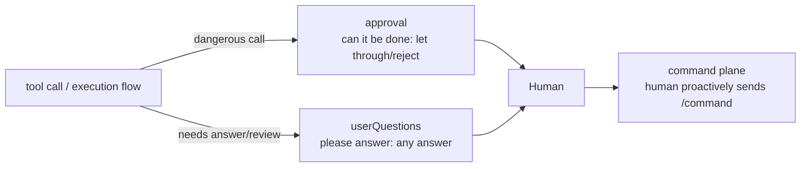
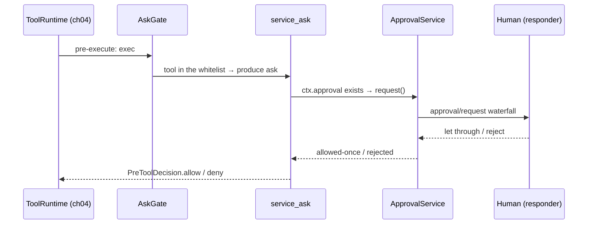

# Chapter 14: Interaction, Permission, and Collaborative Planning: Bringing the Human into the Loop

> Ask before doing, plan before proceeding.

## Questions this chapter answers

- Chapter 4's tools pipeline left an `ask` branch for "ask the human before executing", but in the teaching version there is no one to ask, so it could only degrade to `deny` — how should this branch be wired to a real "human"?
- Chapter 4's three-state decision already answered "let through or intercept" — but which calls need to ask the human, and who decides?
- If the goal only lives in the chat history, one compression in Chapter 10 could lose it — in multi-turn dialogue, how do you keep the goal from being "forgotten"?

A tools pipeline with no human involvement is a runaway car: the more capable it is, the more dangerous. This chapter fits the pipeline with three devices — the approval seam, permission presets, and goal state.

Chapter 4's tools pipeline has a three-state decision: `allow` lets through, `deny` intercepts, `ask` — "ask the human before executing". But Chapter 4's teaching version left a dangling tail: the `ask` branch has no one to ask, so it could only degrade to deny. This chapter wires this dangling branch to a real "human", and further answers two questions: **which calls need to ask** (authorization), and **what the multi-turn dialogue is asking for** (collaborative planning).

The relationship between this chapter's code and the extended foundation chapter (Chapter 4):

- Reuses `waterfall_wrap` (Chapter 4) to carry the approval waterfall — the middleware assembly is the same, but the fallback semantics differ: Chapter 4's tools waterfall falls back to letting through, while this chapter's approval waterfall falls back to rejecting;
- Reuses `PreToolDecision` / `ToolRuntime` (Chapter 4) — the ask branch is consumed at ch04's pre-execute listener seat;
- Reuses `Context` / `Service` (Chapter 1) — all services in this chapter follow the "construction-is-registration" convention.

## 1. What Happens Without These Mechanisms

### 1.1 Scenario One: Dangerous Calls Execute Directly

Without the approval seam, tool dispatch is "execute whatever comes in" (`ch14/code/bad_example.py` scenario one):

```python
tool_calls = [
    {"name": "shell", "args": {"cmd": "make build"}},
    {"name": "shell", "args": {"cmd": "rm -rf /"}},  # dangerous call
]
for call in tool_calls:
    # naive dispatch: execute the call as soon as it arrives, with no "ask the human" step
    print(f"  executing {call['name']}: {call['args']['cmd']} → done")
```

Run output:

```text
scenario one: no approval seam
  executing shell: make build → done
  executing shell: rm -rf / → done
  → the dangerous command executed directly, the human had no chance to intercept
```

`make build` and `rm -rf /` get exactly the same treatment — there is no "ask the human" seat in the pipeline.

### 1.2 Scenario Two: Multi-Turn Dialogue Loses Direction

Without goal state, the goal only lives in the chat history (`bad_example.py` scenario two):

```text
scenario two: no goal state
  user: finish refactoring the utils module
  agent: OK, starting...
  user: (interrupts) first help me look at a bug
  agent: the bug is fixed.
  user: continue the earlier task
  agent: what was the earlier task again? (the goal only lived in the chat history, lost after compression)
```

One interruption and the goal is lost — the pipeline does not know "what the multi-turn dialogue is for".

### 1.3 This Chapter's Three Groups of Mechanisms

| Mechanism | What it solves | Teaching entry |
| --- | --- | --- |
| approval seam (§2) | who decides on dangerous calls | `ApprovalService` |
| userQuestions seam (§2) | ask the human to answer/review | `UserQuestionService` |
| command plane (§2) | the human proactively issues commands | `CommandRuntime` |
| serviceAsk back-link + presets (§3) | how the ask branch is consumed, how wide the authorization scope is | `service_ask` / `presets` |
| goal event sourcing + continuation round + plan-mode (§4) | the direction of multi-turn dialogue | `GoalService` / `GoalRoundDriver` / `PlanMode` |

## 2. Mechanism One: Intervention — Two "Ask the Human" Channels

### 2.1 Overview of the Two Channels: "Can It Be Done" and "Please Answer/Review"

An **intervention channel** is the standardized path by which the harness asks the human a question during execution and collects the human's answer. Why two? Because there are two kinds of questions with different answer shapes:

- **approval** asks "**can it be done**": the answer is binary — let through or reject. Like the confirmation dialog before deleting a file, you can only click "confirm/cancel".
- **userQuestions** asks "**please answer/review**": the answer is arbitrary text or a selection. Like the IDE asking "which file do you want to refactor first?", waiting for open content.

The two channels are parallel and do not replace each other; there is also a third form — the **command plane**: the human does not wait to be asked, but proactively issues a command (such as `/permission`). The overall relationship:



### 2.2 The approval Waterfall: A fail-closed Approval Service

The **approval service** `ApprovalService` is registered as `ctx.approval` (user-approval/src/index.ts), responsible for receiving approval requests, asking the human, and returning the result. First the minimal loop (self-contained and runnable, path setup same as `main.py`):

```python
# inline example: the minimal loop of the approval service (from ch14/code/, depends on approval.py)
from cordis import Context
from approval import ApprovalService, ApprovalRequest, ALLOWED_ONCE

ctx = Context()
ApprovalService(ctx)  # construction-is-registration: ctx.approval is now usable

def respond(req, next):
    # the responder is a listener of the approval/request waterfall: renders the question, collects the answer
    print(f"approve `{req.tool_name}`?")
    return ALLOWED_ONCE  # simulate the human clicking "let through"

ctx.approval.on_request(respond)
print(ctx.approval.request(ApprovalRequest("shell")))
```

Call scenario: the caller just calls `request()`; "how to ask the human" is all inside the waterfall. Run output:

```text
approve `shell`?
allowed-once
```

**Inside request()**: the entry does only one thing — delegate to the private `decide()`; the adjudication steps (never short-circuit → audit asked → waterfall → fail-closed convergence → audit decided) are all inside `decide()`. The real version's entry also has a **turn-enclosure** check: an approval is enclosed within a single turn, and only one request is allowed per turn (L259); the teaching version omits this check (so request can be called repeatedly):

```python
# from ApprovalService in ch14/code/approval.py
# other members (set_policy/effective_policy/on_request) see this section and §3
class ApprovalService(Service):
    # ... other members of this class omitted ...

    def request(self, req):
        """Approval request (index.ts:257): the entry, delegates adjudication to the private _decide.

        [teaching simplification] the real version does a turn-enclosure check at L259 (only one request per turn);
        the teaching version omits this check, so request can be called repeatedly.
        """
        return self._decide(req)

    def _decide(self, req):
        """Private adjudication (index.ts:304): never short-circuit → audit asked → waterfall → fail-closed convergence → audit decided."""
        if self.effective_policy() == "never":
            return REJECTED  # never-policy short-circuit (L312): don't ask the human, reject directly
        self._seq += 1
        req.request_id = self._seq
        self.ctx.emit("approval/asked", req)  # audit event (paired with decided, turn-enclosure)
        try:
            outcome = waterfall_wrap(
                self._request_listeners, (req,), fallback=lambda: UNAVAILABLE
            )  # the approval/request surround waterfall (L317-321): hand adjudication to the downstream responder
        except Exception:
            outcome = UNAVAILABLE  # fail-closed: an exception must not produce an approval either
        # fail-closed folding: anything other than allowed-once becomes rejected
        result = outcome if outcome == ALLOWED_ONCE else REJECTED
        self.ctx.emit("approval/decided", {"request_id": req.request_id, "outcome": result})
        return result
```

The result has four values (`ApprovalOutcome`, types.ts:29): `allowed-once` (let through this once), `rejected` (reject), `cancelled` (the question was cancelled), `unavailable` (no one answered). The most critical design among these is **fail-closed** — when in doubt, reject: any exception, or any result other than `allowed-once`, is folded into `rejected`; the fallback value `unavailable` is no exception — it is not `allowed-once`, so it too is folded into `rejected`.

[teaching decision] The real source's approval/request waterfall hangs off the container event bus; the teaching version carries it with Chapter 4's `waterfall_wrap` and an internal listener list, with unchanged semantics.

**Who responds?** In the real project, the responder is a downstream authorizer registered into the approval/request waterfall (L317-321, such as the terminal UI) — a listener completes the response by directly returning an outcome; the teaching version uses a scripted "human" (`main.py`'s `ScriptedHuman`, [teaching decision]) as a pure waterfall listener. Every adjudication (whether or not anyone answers) drops a pair of audit events `approval/asked` + `approval/decided` (turn-enclosure). Stage 2's output shows the two policy states and three outcomes:

```text
── 2. approval waterfall: two policy states + fail-closed ───────────────────────
policy=never: short-circuit reject, no audit events
  result → rejected

policy=ask, human approves
  [audit] approval/asked #1 shell
  [human] approve `shell`? → allow
  [audit] approval/decided #1 → allowed-once
  result → allowed-once

policy=ask, human rejects
  [audit] approval/asked #2 shell
  [human] approve `shell`? → deny
  [audit] approval/decided #2 → rejected
  result → rejected

policy=ask, no one answers
  [audit] approval/asked #3 shell
  [audit] approval/decided #3 → rejected
  result → rejected (fail-closed)
```

Note three points: when `policy=never` there are no audit events — the request is intercepted at `decide()`'s never short-circuit (L312) and never reaches the human; only `policy=ask` asks the human, and the result is decided by the human; when no one answers the audit pair is still complete (asked #3 + decided #3), and the fallback `unavailable` is folded into `rejected` by fail-closed. The policy is set by `set_policy()` (index.ts:226), folded into the `approval/policy` fold; the effective policy is read via `effectivePolicy()` (index.ts:285).

### 2.3 userQuestions: A Single-Provider Seam

The **question service** `UserQuestionService` is registered as `ctx.userQuestions` (user-questions/src/index.ts), responsible for initiating open-ended questions. `ask()` (index.ts:92), after a live-root check (L100-113, i.e. confirming the service is still mounted on a living context) and intent validation (L121-135), delegates to the single UI provider; the teaching version's core has only two steps — emit an event, delegate to the provider:

```python
# from UserQuestionService in ch14/code/questions.py
# other members (__init__/set_provider) see this section
class UserQuestionService(Service):
    # ... other members of this class omitted ...

    def ask(self, content, intent="answer"):
        """Initiate a question (index.ts:92)."""
        self._seq += 1
        question = UserQuestion(id=self._seq, content=content, intent=intent)
        self.ctx.emit("userQuestions/asked", question)  # [teaching decision] event name
        if self._provider is None:
            raise UserQuestionError("no UI provider registered")  # [teaching decision]
        return self._provider(question)  # delegate to the single UI provider: render → collect the answer
```

**The provider is the only seam**: the service itself does not care how the question is rendered or where the answer comes from, delegating everything to a single UI provider — the real project has only one provider at any given moment, and the teaching version replaces it wholesale with `set_provider`; when the provider is missing, the teaching version throws `UserQuestionError` to explicitly expose an assembly omission ([teaching decision], the notes do not give the real behavior for this case). `intent` annotates the intent, the most important of which is `plan-review` (`AskUserQuestionItem`, types.ts) — plan review, which §4's plan-mode will reuse.

### 2.4 The Command Plane: The Human Intervenes Proactively

The third intervention form does not wait to be asked — the human proactively types a command starting with `/`. `parseCommand` (commands/src/index.ts:102) parses such input, and `CommandRuntime` handles registration (index.ts:245) and dispatch (index.ts:296):

```python
# inline example: the command plane (self-contained and runnable, from ch14/code/commands.py)
from cordis import Context
from commands import CommandRuntime

ctx = Context()
CommandRuntime(ctx)  # construction-is-registration: ctx.commands
ctx.commands.register("hello", lambda args: f"hello, {args or 'stranger'}")
print(ctx.commands.execute("/hello ch14"))
print(ctx.commands.execute("not a command"))
```

Run output:

```text
hello, ch14
not a command: 'not a command'
```

[teaching simplification] The real version also has idempotent ids (`mintCommandId`, index.ts:341) and one-shot commands; the teaching version only keeps register + parse → dispatch. §3 will show the first real command — `/permission`.

### 2.5 Wrap-up: What Is Still Missing

approval solved "how to ask the human", userQuestions solved "how to ask open questions", and the command plane gave the human the initiative. But looking back at question one: the reason dangerous calls execute directly is not "there is no way to ask the human", but that **no one calls `approval.request()` at the right moment** — ch04's ask branch is still dangling. Who picks it up?

## 3. Mechanism Two: Authorization — Wiring the ask Branch to a "Human"

### 3.1 serviceAsk: The Consumption Point of the ask Branch

Chapter 4 covered the three-state decision: allow / deny / ask. The `_prepare` comment in ch04's teaching code states: "the real version's ask branch goes through the serviceAsk approval seam (index.ts:1689); the teaching version degrades ask to deny". In other words, the real source has long reserved a consumption point for ask — **serviceAsk** (core/tools/index.ts:1689).

serviceAsk's behavior in one sentence: **opportunistic consumption** of `ctx.get('approval')`. Opportunistic consumption means the consumer does not require the service to exist — if it exists, use it; if not, degrade:

- `ctx.approval` exists (such as this chapter's registered `ApprovalService`) → hand the decision to `approval.request()`, letting the human decide;
- does not exist → degrade to deny — fail-closed, in the same vein as §2.

This is exactly what a seam means: ch04 does not know who will implement approval, and this chapter's ApprovalService is precisely that implementer.

```python
# from service_ask in ch14/code/ask_gate.py (module-level function)
def service_ask(ctx, exec):
    """serviceAsk (core/tools/index.ts:1689): opportunistic consumption of the approval seam."""
    approval = getattr(ctx, "approval", None)  # opportunistic consumption: may not exist
    if approval is None:
        return PreToolDecision.deny("approval service not implemented, degrade to deny")
    outcome = approval.request(
        ApprovalRequest(tool_name=exec.name, arguments=dict(exec.arguments))
    )
    if outcome == ALLOWED_ONCE:
        return PreToolDecision.allow()
    return PreToolDecision.deny(f"approval result: {outcome}")
```

### 3.2 AskGate: Completing the ask Path in the Teaching Version

[teaching decision] In the real source the ask decision is produced by guards/mode inside the pipeline; Chapter 4's teaching version has no ask producer, so the teaching version uses `AskGate` (a whitelist) to simulate the "ask decision point", registered as ch04's pre-execute listener:

```python
# from AskGate in ch14/code/ask_gate.py
class AskGate:
    """[teaching decision] the ask decision point: tool in the whitelist → produce ask, hand it to service_ask to consume."""

    def __init__(self, ctx, ask_tools=()):
        self._ctx = ctx
        self.ask_tools = set(ask_tools)

    def __call__(self, exec, next):
        if exec.name in self.ask_tools:
            return service_ask(self._ctx, exec)
        return next()
```

Stage 3's output shows the two situations of "no implementation" and "with implementation":

```text
── 3. ch04 back-link: serviceAsk consumes the ask branch ─────────────────────────
no approval service: degrade to deny
  result → approval service not implemented, degrade to deny (is_error=True)

with approval service, human approves
  [human] approve `shell`? → allow
  result → executed: make clean (is_error=False)

with approval service, human rejects
  [human] approve `shell`? → deny
  result → approval result: rejected (is_error=True)
```

The first container did not install ApprovalService — the ask branch degrades to deny, and the tool did not execute; the second container did — if the human approves it executes, if the human rejects it is intercepted. The ask branch is no longer dangling: **its endpoint is a real human**.



### 3.3 permission-presets: One Name, a Bundle of Policies

serviceAsk answered "how ask is consumed"; one question remains: **which calls need to ask**. The real project answers with **permission presets**: one preset name bundles the sandbox and approval policies together. `derive()` (permission-presets/src/index.ts:309) derives the bundle from the name, `apply()` (index.ts:380) applies the bundle; the config entry is `Config.presets` (index.ts:167), and `pinInitialPermission()` (index.ts:400) pins the initial permission at startup; preset names include `workspace-write` / `danger-full-access` (`PresetSpec`/`PermissionSelect`, types.ts).

```python
# from ch14/code/presets.py (module-level)
PRESETS = {
    # [teaching decision] the notes do not itemize each preset's derive output; the teaching version gives a self-consistent bundle shape:
    # the sandbox half is a mode string ([teaching simplification] does not connect to Chapter 6's SandboxProvider), the approval half is an ask/never policy.
    "workspace-write": {
        "sandbox": "workspace-write",
        "approval": "ask",
        "ask_tools": ("shell", "fs_write"),
    },
    "danger-full-access": {
        "sandbox": "off",
        "approval": "ask",
        "ask_tools": (),  # let everything through: no tool produces ask
    },
}

def apply(ctx, preset):
    """apply (index.ts:380): write the approval policy into ctx.approval, return the full bundle."""
    bundle = derive(preset)  # derive (index.ts:309): name → bundle, unknown raises ValueError
    ctx.approval.set_policy(bundle["approval"])
    return bundle
```

First a counter-intuitive point: `danger-full-access`'s `approval` policy is `ask`, yet it is named "full access" — because its `ask_tools` is empty, no tool produces ask, the approval adjudication is in fact never triggered, and the effect is equivalent to letting everything through.

[teaching simplification] The sandbox half in the teaching version is just a mode string, not connected to Chapter 6's SandboxProvider (the real behavior goes through the sandbox fence, see Chapter 6). The `/permission` command (index.ts:257-277) exposes preset switching to the human: no argument lists them, with an argument it switches. Stage 4's output:

```text
── 4. permission-presets: bundle derive/apply/pin + /permission ─
derive(workspace-write)    → {'sandbox': 'workspace-write', 'approval': 'ask', 'ask_tools': ('shell', 'fs_write')}
derive(danger-full-access) → {'sandbox': 'off', 'approval': 'ask', 'ask_tools': ()}
pinInitialPermission → pinned=workspace-write, approval=ask
/permission → available presets: workspace-write, danger-full-access
/permission danger-full-access → switched to danger-full-access: sandbox=off, approval=ask
after switching, executing shell → executed: echo full-access (is_error=False)
```

The last line is the evidence: after switching to `danger-full-access` the ask whitelist becomes empty, the shell call no longer produces ask, and executes directly — the bundle changed the behavior as a whole. This "one name determines a set of configuration" is precisely the precursor of ch15's bundle composition idea (bundling multiple capabilities into a unit that can be mounted as a whole, see Chapter 15).

### 3.4 Wrap-up: The Authorization Closed Loop

With this the authorization closed loop is complete: presets decide "which calls to ask" (the ask whitelist), serviceAsk decides "how the ask branch is consumed" (opportunistic consumption, degrade to deny without an implementation), and approval decides "how to ask the human" (waterfall + fail-closed). Question one is thoroughly solved. Looking back at question two: the goal of multi-turn dialogue is lost with one interruption — authorization cannot answer "what the dialogue is for", that is §4's job.

## 4. Mechanism Three: Collaborative Planning — Giving Multi-Turn Dialogue a Sense of Direction

### 4.1 goal Event Sourcing: State Is Folded Out

**Event sourcing** is a way of storing state: instead of storing the "current state", it stores the "history of events that happened", and the current state is folded out on the spot from the history. Like a bank statement — you don't directly modify the balance, you only append transaction records one by one, and the balance is always computed on the spot from the records. Why use it? The reason question two's goal is lost is that it lives in "a place that gets erased" (the chat history); event history is append-only, and can be re-folded to recover even on a cold start.

The three data structures of the goal domain (packages/goal/goal/src/):

- **GoalRef** (types.ts:19): the goal coordinates `{id, revision}`, where revision is the handle of the **CAS** optimistic lock — CAS means "compare before write": on write, first check whether the version number you hold matches the current version; a mismatch is a conflict.
- **GoalPhase** (types.ts:44): the four goal states `active/paused/blocked/complete`.
- **Whole-value event**: each event carries a complete snapshot (phase/text/revision), not a delta — folding needs no accumulated deltas, each event is self-contained.

Folding and committing:

```python
# from fold_goal (module-level) and GoalService in ch14/code/goal.py
# GoalService's other members (state/ref/render_activation/create/edit/pause/...) see this section and §4.2
def fold_goal(events):
    """foldGoal (fold.ts:339): re-fold the whole value from the event stream."""
    state = None
    for event in events:
        if event["kind"] == "cleared":
            state = None
        else:  # whole-value snapshot: directly overwrite the whole value
            state = GoalState(phase=event["phase"], text=event["text"], revision=event["revision"])
    return state


class GoalService(Service):
    # ... other members of this class omitted ...

    def _commit(self, kind, text, phase):
        """commit (index.ts:542): append a whole-value event → re-fold with foldGoal → emit goal/changed."""
        state = self.state()
        revision = (state.revision + 1) if state else 1
        event = {"kind": kind, "text": text, "phase": phase, "revision": revision}
        self._history.append(event)
        new_state = fold_goal(self._history)  # re-fold from the start, no caching
        self.ctx.emit("goal/changed", GoalRef(id=self.GOAL_ID, revision=revision))
        return new_state
```

The write-side operations create/edit/pause/resume/complete/block/clear (index.ts:251-376, with clear at index.ts:376) all go through commit to be recorded; single-step folding corresponds to `applyGoalEvent` (fold.ts:313). All write operations except create first pass the CAS check:

```python
# from ch14/code/goal.py
class GoalService(Service):
    # ... other members of this class (state/ref/write-side operations/_commit) see this section ...

    def _check_cas(self, ref):
        """CAS check: ref.revision must equal the current revision (types.ts:19)."""
        state = self.state()
        current = state.revision if state else 0
        if ref.id != self.GOAL_ID or ref.revision != current:
            raise GoalConflictError(ref, current)
```

Stage 5's output (first half):

```text
── 5. goal event sourcing: whole-value events + CAS + activation ────────────────────
  [event] goal/changed → GoalRef(id='goal-1', revision=1)
  [event] goal/changed → GoalRef(id='goal-1', revision=2)
  [CAS] goal conflict: ref revision 1 is stale, current is 2
  [event] goal/changed → GoalRef(id='goal-1', revision=3)
  [event] goal/changed → GoalRef(id='goal-1', revision=4)
current state → GoalState(phase='active', text='finish refactoring the utils module (with tests)', revision=4)
activation → [current goal] finish refactoring the utils module (with tests)
……(the four-line output of the complete/clear outcomes see §5 stage 5)
```

The third line is a CAS conflict: the ref in the caller's hand is still at revision 1, but edit has already pushed the version to 2 — the stale write is rejected, and both sides can re-coordinate. This is the point of the optimistic lock: no locking, only checking the version at write time.

### 4.2 activation Is Not Persisted

**activation** is the text that injects the goal into the systemPrompt. Note: activation is not persisted — it does not store separate state, but is folded on the spot from the history each time by `render_activation()`:

```python
# from ch14/code/goal.py
class GoalService(Service):
    # ... other members of this class see §4.1 ...

    def render_activation(self):
        """Render the goal activation text (injected into the systemPrompt)."""
        state = self.state()
        if state is None or state.phase != ACTIVE:
            return ""
        return f"[current goal] {state.text}"
```

The complete/clear outcomes in stage 5's output (the last four lines of §5 stage 5) confirm this: after `complete` the activation becomes an empty string (the phase is no longer active); after `clear` the state folds to None. activation is derived from the history, so a cold start needs no recovery — just re-fold to get it.

### 4.3 goal-round-driver: Event-Triggered Continuation Rounds

What if the goal is still active but a round of dialogue has ended? **Continuation round**: goal-round-driver (packages/goal/goal-round-driver/src/) is woken by goal events — the real version's event wiring (index.ts:245-331) listens to goal events and requests to continue running after "a round completes / is blocked"; the teaching version subscribes to goal/changed, checks whenever the goal changes, and automatically starts the next round if it is still active. The keyword is **event-triggered, not polling** — the driver does not check periodically, but is woken by events.

```python
# from ch14/code/goal_round.py
class GoalRoundDriver(Service):
    # ... other members of this class (__init__/_on_goal_changed/request_drive/render_round_prompt) omitted ...

    def drive(self, token):
        """drive (index.ts:138): reservation valid + goal active → start a new round."""
        if not self.valid_reservation(token):
            return False  # stale reservation: a newer driver has taken over
        state = self.ctx.goal.state()
        if state is None or state.phase != ACTIVE:
            return False  # goal does not exist or is not active: no continuation round
        self._round += 1
        self.ctx.emit("goal/round-start", {"round": self._round})  # [teaching decision] event name
        return True

    def valid_reservation(self, token):
        """validReservation (index.ts:334): only the latest reservation is valid — a race fence."""
        return token == self._reservation
```

**reservation** (a reservation token) is a race fence: when multiple drive requests are concurrent, only the token of the latest request is valid, and old tokens are naturally invalidated — `requestDrive()` (index.ts:208) is the drive entry, and `renderGoalRoundPrompt` (prompt.ts:12) renders the continuation-round prompt. [teaching simplification] The real version's event wiring only requests to continue running when "a round completes / is blocked" (index.ts:245-331); the teaching version only subscribes to goal/changed. [teaching decision] goal/round-start is the teaching version's event name.

Stage 6's scenario script has four steps: ① `create` sets the goal, the goal enters the active state → `goal/changed` wakes the driver, automatically starting round 1; ② `complete` completes that goal, the goal is no longer active → `goal/changed` is still emitted, but the driver sees the goal is not active and does not continue; ③ `create` a new goal again, re-activating → automatically starting round 2; ④ request the reservation token twice in a row, the new token supersedes the old — driving with the old token is blocked by the fence (returns False), and only driving with the new token starts round 3 (returns True). Stage 6's output:

```text
── 6. goal-round-driver: event-triggered continuation rounds + race fence ──────────────────────
  [round] automatically start round 1
after goal complete → goal/changed still emitted, not active so no continuation round
  [round] automatically start round 2
old reservation drive → False
  [round] automatically start round 3
new reservation drive → True
continuation-round prompt → continue advancing the current goal (round 3): new goal
```

"goal change → automatically start a round" is a complete event-driven closed loop; after goal complete, goal/changed is still emitted but no longer continues a round; after the old token is superseded by the new one, drive returns False — the fence blocked the stale drive. This "if the goal is not done, automatically come around for another round" form is precisely the local form of ch17's Ralph loop (a drive loop that makes the agent iterate continuously around a goal until completion, see Chapter 17).

### 4.4 plan-mode: Plan First, Reviewed by the Human, Then Execute

The last piece is **plan mode** (packages/plan/plan-mode/src/): the agent first produces a plan, and only exits the planning phase into execution after the human reviews and approves it. `exit_plan_mode` (index.ts:305-393) asks the human to review via the userQuestions channel with the `plan-review` intent — reusing exactly §2.3's question channel; `set()` (index.ts:425) sets plan mode, and `foldPlanMode()` (index.ts:129) folds the plan-mode state.

```python
# from PlanMode in ch14/code/plan_mode.py
# other members (__init__/set) see this section
class PlanMode(Service):
    # ... other members of this class omitted ...

    def exit_via_review(self, plan_text):
        """exit_plan_mode (index.ts:305-393): ask the human to review the plan via userQuestions."""
        answer = self.ctx.userQuestions.ask(plan_text, intent=INTENT_PLAN_REVIEW)
        approved = str(answer).strip().lower() in ("approve", "approved", "yes")
        if approved:
            self.set(False)
        return approved
```

[teaching simplification] The real version's foldPlanMode folds state from the event stream; the teaching version uses a single active flag. Stage 7's output:

```text
── 7. userQuestions and plan-review: the "please answer/review" channel ───────────────
  [event] userQuestions/asked #1 intent=answer
  [human] question #1 (answer) → utils.py
normal question → utils.py
  [event] userQuestions/asked #2 intent=plan-review
  [human] question #2 (plan-review) → reject
first review → approved=False, still in plan mode=True
  [event] userQuestions/asked #3 intent=plan-review
  [human] question #3 (plan-review) → approve
second review → approved=True, still in plan mode=False
```

The same userQuestions channel carries two intents: normal questions (intent=answer) and plan review (intent=plan-review). The first review is rejected — stay in the planning phase; the second is approved — exit plan mode. Question two is solved by now: the goal lives in the event history (cannot be lost), continuation rounds keep the dialogue circling the goal (no disconnection), and plan-mode lets the human decide at key nodes (no drifting off course).

## 5. Complete Run Output

`ch14/code/main.py` fits the three groups of mechanisms into the same cordis Context and runs through them once (stages 1-7: assembly, approval waterfall, serviceAsk back-link, presets, goal sourcing, continuation rounds, plan-review). Run `python ch14/code/main.py`:

```text
── 1. assembly ───────────────────────────────────────────────────
registered services: approval, commands, goal, goalRoundDriver, planMode, tools, userQuestions
two ask-the-human channels: approval="can it be done", userQuestions="please answer/review"

── 2. approval waterfall: two policy states + fail-closed ──(output same as §2.2 stage 2, omitted)

── 3. ch04 back-link: serviceAsk consumes the ask branch ──(output same as §3.2 stage 3, omitted)

── 4. permission-presets: bundle derive/apply/pin + /permission ──(output same as §3.3 stage 4, omitted)

── 5. goal event sourcing: whole-value events + CAS + activation ────────────────────
  [event] goal/changed → GoalRef(id='goal-1', revision=1)
  [event] goal/changed → GoalRef(id='goal-1', revision=2)
  [CAS] goal conflict: ref revision 1 is stale, current is 2
  [event] goal/changed → GoalRef(id='goal-1', revision=3)
  [event] goal/changed → GoalRef(id='goal-1', revision=4)
current state → GoalState(phase='active', text='finish refactoring the utils module (with tests)', revision=4)
activation → [current goal] finish refactoring the utils module (with tests)
  [event] goal/changed → GoalRef(id='goal-1', revision=5)
after complete, activation → ''
  [event] goal/changed → None
after clear, state → None

── 6. goal-round-driver: event-triggered continuation rounds + race fence ──(output same as §4.3 stage 6, omitted)

── 7. userQuestions and plan-review: the "please answer/review" channel ──(output same as §4.4 stage 7, omitted)
```

## 6. Source Code Mapping

All line numbers are based on the current source snapshot.

| Teaching code | Original project source | Description |
| --- | --- | --- |
| `ApprovalService` | user-approval/src/index.ts | registered as ctx.approval |
| `ApprovalService.request` / `_decide` | index.ts:257/304 | request entry (L259 turn-enclosure check); decide: never short-circuit L312 + approval/request waterfall L317-321 + audit event pair |
| `ApprovalService.effective_policy` / `set_policy` | index.ts:285/226 | effective policy; set folds into the approval/policy fold |
| `ALLOWED_ONCE` and the other four values / `INTENT_PLAN_REVIEW` | types.ts:29 / AskUserQuestionItem (types.ts) | ApprovalOutcome; the plan-review intent |
| `derive` / `apply` / `pin_initial_permission` / `/permission` | permission-presets/src/index.ts:309/380/400/257-277 | bundle derivation/application; pin the initial permission; the /permission command |
| `parse_command` / `CommandRuntime` | commands/src/index.ts:102 | the command plane (register :245, execute :296) |
| `UserQuestionService.ask` | user-questions/src/index.ts:92 | live-root check L100-113, intent validation L121-135, delegate to the single UI provider |
| `service_ask` | core/tools/index.ts:1689 | serviceAsk opportunistically consumes ctx.get('approval') |
| `fold_goal` / `GoalService._commit` | goal/src/fold.ts:339, index.ts:542 | foldGoal (single-step applyGoalEvent :313); commit (emits goal/changed, domain.ts:104-114) |
| `GoalService` write-side operations | index.ts:251-376 | create/edit/pause/resume/complete/block/clear |
| `GoalRef` / `GoalPhase` | types.ts:19/44 | CAS coordinates / four states |
| `GoalRoundDriver.drive` / `render_round_prompt` | goal-round-driver/src/index.ts:138, prompt.ts:12 | validReservation :334, requestDrive :208, event wiring :245-331; renderGoalRoundPrompt |
| `PlanMode.set` / `exit_via_review` | plan-mode/src/index.ts:425/305-393 | set / exit_plan_mode (foldPlanMode :129) |
| `ScriptedHuman` / `AskGate` | — ([teaching decision] newly created) | the scripted "human" / ask decision point simulation |

## 7. Summary and Preview

This chapter wired ch04's dangling ask branch to a "human", and fitted multi-turn dialogue with a sense of direction:

1. **Intervention**: two ask-the-human channels — approval asks "can it be done" (waterfall + fail-closed, four-value ApprovalOutcome), userQuestions asks "please answer/review" (single-provider seam); the command plane lets the human intervene proactively.
2. **Authorization**: serviceAsk (core/tools/index.ts:1689) opportunistically consumes `ctx.approval` — this chapter's ApprovalService is precisely the seam implementer, degrading to deny without an implementation; permission-presets bundles the sandbox and approval policies under one name.
3. **Collaborative planning**: goal event sourcing makes state append-only and re-foldable (whole-value events + CAS + activation not persisted); goal-round-driver triggers continuation rounds by events; plan-mode lets the plan execute only after human review.

The opening epigraph is fulfilled here: "ask before doing" — serviceAsk hands every dangerous call to the human to decide, and fail-closed guarantees rejection when in doubt; "plan before proceeding" — before plan-review approval it does not exit the planning phase, and goal continuation rounds circle the goal.

The next chapter (s15) enters bundle and capability composition: this chapter's preset bundle is already a precursor, see how the harness bundles more capabilities into units that can be mounted as a whole.

## 8. Appendix: Key Concepts Cheat Sheet

Layered by dependency (lower → upper):

| Layer | Concept | One-sentence definition | Code entry |
| --- | --- | --- | --- |
| lower | ApprovalOutcome | four approval result values, all rejected except allowed-once | `approval.py` constants |
| lower | fail-closed | when in doubt, reject: exceptions/non-let-through all fold to rejected | `ApprovalService._decide` |
| lower | whole-value event | an event carrying a complete snapshot, not a delta | `goal.py` `_commit` |
| lower | CAS | an optimistic lock that compares the version number before writing | `GoalService._check_cas` |
| middle | approval waterfall | the "can it be done" channel: policy gate → audit → waterfall → convergence | `ApprovalService` |
| middle | userQuestions seam | the "please answer/review" channel: single provider | `UserQuestionService` |
| middle | event sourcing | state is folded out on the spot from the event history | `fold_goal` |
| middle | permission preset | one name bundles the sandbox+approval policies | `presets.derive/apply` |
| upper | opportunistic consumption | use the service if it exists, degrade if not | `service_ask` |
| upper | continuation round | automatically start the next round when goal/changed arrives and the goal is still active | `GoalRoundDriver.drive` |
| upper | plan-review | the plan exits the planning phase only after human review approval | `PlanMode.exit_via_review` |
