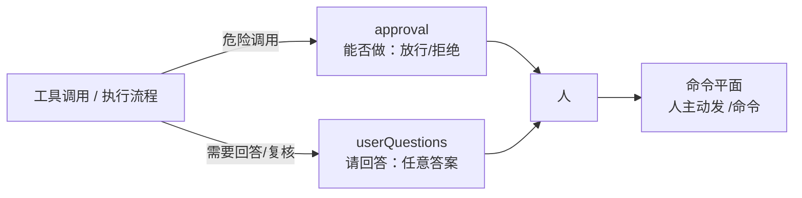
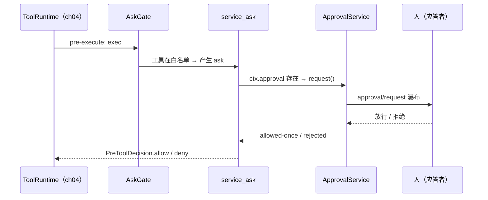

# 第 14 章 交互、权限与协同规划：让人进入回路

> 先问后做，先规划后推进。

## 本章回答的问题

- 第 4 章的工具流水线留了一条「问人后再执行」的 `ask` 分支，但教学版里没人可问，只能降级为 `deny`——这条分支该如何接到真实的「人」？
- 第 4 章的三态决策已经回答了「放行还是拦截」——但哪些调用需要问人，由谁决定？
- 如果 goal 只存在于聊天记录里，第 10 章的压缩一次就可能把它弄丢——多轮对话里，如何让 goal 不被「忘掉」？

没有人介入的工具流水线是一辆失控的车：能力越强，越危险。本章给流水线装上三套装置——审批接缝、授权预设、目标状态。

第 4 章的工具流水线有三态决策：`allow` 放行、`deny` 拦截、`ask`——「问人后再执行」。但第 4 章教学版留了个悬空的尾巴：`ask` 分支没人可问，只能降级为 deny。本章把这个悬空分支接到真实的「人」，并进一步回答两个问题：**哪些调用需要问**（授权），以及**多轮对话为了什么而问**（协同规划）。

本章代码与延伸基础章（第 4 章）的关系：

- 复用 `waterfall_wrap`（第 4 章）承载审批瀑布——中间件装配方式相同，兜底语义不同：第 4 章工具瀑布兜底放行，本章审批瀑布兜底拒绝；
- 复用 `PreToolDecision` / `ToolRuntime`（第 4 章）——ask 分支在 ch04 的 pre-execute 监听器席位上被消费；
- 复用 `Context` / `Service`（第 1 章）——本章所有服务遵循「构造即注册」约定。

## 1. 没有这些机制会发生什么

### 1.1 场景一：危险调用直接执行

没有审批接缝时，工具分派是「来什么执行什么」（`ch14/code/bad_example.py` 场景一）：

```python
tool_calls = [
    {"name": "shell", "args": {"cmd": "make build"}},
    {"name": "shell", "args": {"cmd": "rm -rf /"}},  # 危险调用
]
for call in tool_calls:
    # 朴素分派：拿到调用直接执行，没有「问人」这一步
    print(f"  执行 {call['name']}: {call['args']['cmd']} → 完成")
```

运行输出：

```text
场景一：没有审批接缝
  执行 shell: make build → 完成
  执行 shell: rm -rf / → 完成
  → 危险命令直接执行了，人没有机会拦
```

`make build` 与 `rm -rf /` 得到完全相同的待遇——流水线里没有「问人」的席位。

### 1.2 场景二：多轮对话失去方向

没有目标状态时，目标只存在于聊天记录里（`bad_example.py` 场景二）：

```text
场景二：没有 goal 状态
  用户：完成 utils 模块重构
  agent：好的，开始……
  用户：（打断）先帮我看个 bug
  agent：bug 修好了。
  用户：继续刚才的任务
  agent：刚才的任务是什么来着？（目标只存在于聊天记录，压缩后就丢了）
```

一次打断，目标就丢了——流水线不知道「多轮对话为了什么」。

### 1.3 本章的三组机制

| 机制 | 解决什么 | 教学入口 |
| --- | --- | --- |
| approval 接缝（§2） | 危险调用谁拍板 | `ApprovalService` |
| userQuestions 接缝（§2） | 请人回答/复核 | `UserQuestionService` |
| 命令平面（§2） | 人主动发指令 | `CommandRuntime` |
| serviceAsk 回链 + presets（§3） | ask 分支怎么被消费、授权范围多大 | `service_ask` / `presets` |
| goal 事件溯源 + 续轮 + plan-mode（§4） | 多轮对话的方向 | `GoalService` / `GoalRoundDriver` / `PlanMode` |

## 2. 机制一：介入——两条「问人」通道

### 2.1 两条通道总览：「能否做」与「请回答/复核」

**介入通道**指 harness 在执行过程中向人提问、并收集人的回答的标准化路径。为什么要分两条？因为有两类问题，答案形态不同：

- **approval** 问「**能否做**」：答案是二元的——放行或拒绝。像删除文件前的确认弹窗，只能点「确认/取消」。
- **userQuestions** 问「**请回答/复核**」：答案是任意文本或选择。像 IDE 问你「想先重构哪个文件？」，等待开放内容。

两条通道并列、互不替代；此外还有第三种形态——**命令平面**：人不等待被问，而是主动发出指令（如 `/permission`）。整体关系：



### 2.2 approval 瀑布：fail-closed 的审批服务

**审批服务** `ApprovalService` 注册为 `ctx.approval`（user-approval/src/index.ts），负责接收审批请求、问人、返回结果。先看最小循环（自包含可运行，路径设置同 `main.py`）：

```python
# 行内示例：审批服务的最小循环（出自 ch14/code/，依赖 approval.py）
from cordis import Context
from approval import ApprovalService, ApprovalRequest, ALLOWED_ONCE

ctx = Context()
ApprovalService(ctx)  # 构造即注册：ctx.approval 可用了

def respond(req, next):
    # 应答者是 approval/request 瀑布的监听器：渲染问题、收集回答
    print(f"批准 `{req.tool_name}`？")
    return ALLOWED_ONCE  # 模拟人点了「放行」

ctx.approval.on_request(respond)
print(ctx.approval.request(ApprovalRequest("shell")))
```

调用场景：调用方只管调 `request()`，「怎么问人」全在瀑布里。运行输出：

```text
批准 `shell`？
allowed-once
```

**request() 的内部**：入口只做一件事——转给私有 `decide()`；裁决步骤（never 短路 → 审计 asked → 瀑布 → fail-closed 收敛 → 审计 decided）全在 `decide()` 里。真实版入口还有一道**回合封装**（turn-enclosure）检查：审批被封装在单个回合（turn）内，一次 turn 只允许发起一次 request（L259），教学版省略该检查（故可重复调用 request）：

```python
# 出自 ch14/code/approval.py 的 ApprovalService
# 其余成员（set_policy/effective_policy/on_request）见本节与 §3
class ApprovalService(Service):
    # ... 本类其余成员省略 ...

    def request(self, req):
        """审批请求（index.ts:257）：入口，委托私有 _decide 裁决。

        [教学简化] 真实版在 L259 做回合封装检查（一个回合只允许发一次请求）；
        教学版省略该检查，故可重复调用 request。
        """
        return self._decide(req)

    def _decide(self, req):
        """私有裁决（index.ts:304）：never 短路 → 审计 asked → 瀑布 → fail-closed 收敛 → 审计 decided。"""
        if self.effective_policy() == "never":
            return REJECTED  # never 策略短路（L312）：不问人，直接拒绝
        self._seq += 1
        req.request_id = self._seq
        self.ctx.emit("approval/asked", req)  # 审计事件（与 decided 成对，回合封装）
        try:
            outcome = waterfall_wrap(
                self._request_listeners, (req,), fallback=lambda: UNAVAILABLE
            )  # approval/request 环绕瀑布（L317-321）：裁决权交给下游应答者
        except Exception:
            outcome = UNAVAILABLE  # fail-closed：异常也不能产生批准
        # fail-closed 折叠：除 allowed-once 外一律 rejected
        result = outcome if outcome == ALLOWED_ONCE else REJECTED
        self.ctx.emit("approval/decided", {"request_id": req.request_id, "outcome": result})
        return result
```

结果四值（`ApprovalOutcome`，types.ts:29）：`allowed-once`（放行这一次）、`rejected`（拒绝）、`cancelled`（提问被取消）、`unavailable`（无人应答）。其中最关键的设计是 **fail-closed**——存疑即拒绝：任何异常、或除 `allowed-once` 外的结果，一律折叠为 `rejected`；兜底值 `unavailable` 也不例外——它不是 `allowed-once`，同样折叠为 `rejected`。

[教学决策] 真实源码的 approval/request 瀑布挂在容器事件总线上；教学版用第 4 章的 `waterfall_wrap` 与内部监听器列表承载，语义不变。

**谁来应答？**真实项目里，应答者是注册进 approval/request 瀑布的下游授权器（L317-321，如终端 UI）——监听器直接返回 outcome 即完成应答；教学版用脚本化的「人」（`main.py` 的 `ScriptedHuman`，[教学决策]）做纯瀑布监听器。每次裁决（无论有无人应答）都落一对审计事件 `approval/asked` + `approval/decided`（回合封装）。段 2 输出展示策略两态与三种结局：

```text
── 2. approval 瀑布：策略两态 + fail-closed ───────────────────────
policy=never：短路拒绝，无审计事件
  结果 → rejected

policy=ask，人批准
  [审计] approval/asked #1 shell
  [人] 批准 `shell`？→ allow
  [审计] approval/decided #1 → allowed-once
  结果 → allowed-once

policy=ask，人拒绝
  [审计] approval/asked #2 shell
  [人] 批准 `shell`？→ deny
  [审计] approval/decided #2 → rejected
  结果 → rejected

policy=ask，无人应答
  [审计] approval/asked #3 shell
  [审计] approval/decided #3 → rejected
  结果 → rejected （fail-closed）
```

注意三点：`policy=never` 时没有审计事件——请求在 `decide()` 的 never 短路（L312）就被拦下，根本没到人；`policy=ask` 才会问人，结果由人决定；无人应答时审计对照样完整（asked #3 + decided #3），fallback `unavailable` 被 fail-closed 折叠为 `rejected`。策略由 `set_policy()`（index.ts:226）设置，折入 `approval/policy` 折叠；生效策略经 `effectivePolicy()`（index.ts:285）读取。

### 2.3 userQuestions：单一 provider 接缝

**提问服务** `UserQuestionService` 注册为 `ctx.userQuestions`（user-questions/src/index.ts），负责发起开放式提问。`ask()`（index.ts:92）经活根检查（L100-113，即确认服务仍挂载在存活的上下文上）与 intent 校验（L121-135）后委托唯一 UI provider；教学版核心只有两步——发事件、委托 provider：

```python
# 出自 ch14/code/questions.py 的 UserQuestionService
# 其余成员（__init__/set_provider）见本节
class UserQuestionService(Service):
    # ... 本类其余成员省略 ...

    def ask(self, content, intent="answer"):
        """发起提问（index.ts:92）。"""
        self._seq += 1
        question = UserQuestion(id=self._seq, content=content, intent=intent)
        self.ctx.emit("userQuestions/asked", question)  # [教学决策] 事件名
        if self._provider is None:
            raise UserQuestionError("未注册 UI provider")  # [教学决策]
        return self._provider(question)  # 委托唯一 UI provider：渲染→收集回答
```

**provider 是唯一接缝**：服务本身不关心问题怎么渲染、答案从哪来，全部委托给一个 UI provider——真实项目同一时刻只有一个 provider，教学版用 `set_provider` 整体替换；provider 缺失时教学版抛 `UserQuestionError` 显式暴露装配遗漏（[教学决策]，notes 未给出该情形的真实行为）。`intent` 标注意图，其中最重要的是 `plan-review`（`AskUserQuestionItem`，types.ts）——计划复核，§4 的 plan-mode 会复用它。

### 2.4 命令平面：人主动介入

第三种介入形态不等待被问——人主动输入以 `/` 开头的命令。`parseCommand`（commands/src/index.ts:102）解析这类输入，`CommandRuntime` 负责注册（index.ts:245）与分发（index.ts:296）：

```python
# 行内示例：命令平面（自包含可运行，出自 ch14/code/commands.py）
from cordis import Context
from commands import CommandRuntime

ctx = Context()
CommandRuntime(ctx)  # 构造即注册：ctx.commands
ctx.commands.register("hello", lambda args: f"hello, {args or 'stranger'}")
print(ctx.commands.execute("/hello ch14"))
print(ctx.commands.execute("not a command"))
```

运行输出：

```text
hello, ch14
不是命令：'not a command'
```

[教学简化] 真实版还有幂等 id（`mintCommandId`，index.ts:341）与一次性命令；教学版只保留 register + parse → dispatch。§3 会看到第一个真实命令——`/permission`。

### 2.5 回溯：还缺什么

approval 解决了「怎么问人」，userQuestions 解决了「怎么问开放问题」，命令平面给了人主动权。但回看问题一：危险调用之所以直接执行，不是因为「没有办法问人」，而是因为**没有人在正确的时机调用 `approval.request()`**——ch04 的 ask 分支还悬空着。谁来接？

## 3. 机制二：授权——把 ask 分支接到「人」

### 3.1 serviceAsk：ask 分支的消费点

第 4 章讲过三态决策：allow / deny / ask。ch04 教学代码的 `_prepare` 注释写明：「真实版的 ask 分支走 serviceAsk 审批接缝（index.ts:1689），教学版把 ask 降级为 deny」。也就是说，真实源码早已为 ask 预留了消费点——**serviceAsk**（core/tools/index.ts:1689）。

serviceAsk 的行为一句话：**机会消费** `ctx.get('approval')`。机会消费指消费方不要求服务必须存在——存在就用，不存在就降级：

- `ctx.approval` 存在（如本章注册的 `ApprovalService`）→ 把决策交给 `approval.request()`，由人拍板；
- 不存在 → 降级为 deny——fail-closed，与 §2 一脉相承。

这正是接缝的含义：ch04 不知道谁会实现 approval，本章的 ApprovalService 正是那个实现方。

```python
# 出自 ch14/code/ask_gate.py 的 service_ask（模块级函数）
def service_ask(ctx, exec):
    """serviceAsk（core/tools/index.ts:1689）：机会消费 approval 接缝。"""
    approval = getattr(ctx, "approval", None)  # 机会消费：可能不存在
    if approval is None:
        return PreToolDecision.deny("approval 服务未实现，降级为 deny")
    outcome = approval.request(
        ApprovalRequest(tool_name=exec.name, arguments=dict(exec.arguments))
    )
    if outcome == ALLOWED_ONCE:
        return PreToolDecision.allow()
    return PreToolDecision.deny(f"approval 结果：{outcome}")
```

### 3.2 AskGate：教学版里补全 ask 路径

[教学决策] 真实源码中 ask 决策由流水线内的 guards/mode 产生；第 4 章教学版没有 ask 产生方，故教学版用 `AskGate`（白名单）模拟「ask 决策点」，注册为 ch04 的 pre-execute 监听器：

```python
# 出自 ch14/code/ask_gate.py 的 AskGate
class AskGate:
    """[教学决策] ask 决策点：工具在白名单内 → 产生 ask，交给 service_ask 消费。"""

    def __init__(self, ctx, ask_tools=()):
        self._ctx = ctx
        self.ask_tools = set(ask_tools)

    def __call__(self, exec, next):
        if exec.name in self.ask_tools:
            return service_ask(self._ctx, exec)
        return next()
```

段 3 输出展示「无实现」与「有实现」两种局面：

```text
── 3. ch04 回链：serviceAsk 消费 ask 分支 ─────────────────────────
无 approval 服务：降级为 deny
  结果 → approval 服务未实现，降级为 deny (is_error=True)

有 approval 服务，人批准
  [人] 批准 `shell`？→ allow
  结果 → 已执行: make clean (is_error=False)

有 approval 服务，人拒绝
  [人] 批准 `shell`？→ deny
  结果 → approval 结果：rejected (is_error=True)
```

第一个容器没装 ApprovalService——ask 分支降级为 deny，工具没有执行；第二个容器装了——人批准则执行，人拒绝则拦截。ask 分支不再悬空：**它的终点是一个真实的人**。



### 3.3 permission-presets：一个名字，一捆策略

serviceAsk 回答了「ask 怎么被消费」，还差一个问题：**哪些调用需要问**。真实项目用**权限预设**回答：一个 preset 名字把 sandbox 与 approval 策略捆在一起。`derive()`（permission-presets/src/index.ts:309）由名字推导捆绑，`apply()`（index.ts:380）应用捆绑；配置入口是 `Config.presets`（index.ts:167），`pinInitialPermission()`（index.ts:400）在启动时钉住初始权限；preset 名含 `workspace-write` / `danger-full-access`（`PresetSpec`/`PermissionSelect`，types.ts）。

```python
# 出自 ch14/code/presets.py（模块级）
PRESETS = {
    # [教学决策] notes 未逐项给出各 preset 的 derive 输出；教学版给出自洽的捆绑形态：
    # sandbox 半为模式串（[教学简化] 不接第 6 章 SandboxProvider），approval 半为 ask/never 策略。
    "workspace-write": {
        "sandbox": "workspace-write",
        "approval": "ask",
        "ask_tools": ("shell", "fs_write"),
    },
    "danger-full-access": {
        "sandbox": "off",
        "approval": "ask",
        "ask_tools": (),  # 全放行：没有工具产生 ask
    },
}

def apply(ctx, preset):
    """apply（index.ts:380）：把 approval 策略写入 ctx.approval，返回完整捆绑。"""
    bundle = derive(preset)  # derive（index.ts:309）：名字 → 捆绑，未知抛 ValueError
    ctx.approval.set_policy(bundle["approval"])
    return bundle
```

先看一个反直觉处：`danger-full-access` 的 `approval` 策略是 `ask`，却名为「完全访问」——因为其 `ask_tools` 为空，没有任何工具会产生 ask，approval 裁决实际从不被触发，效果等价于全放行。

[教学简化] sandbox 半在教学版里只是模式串，不接第 6 章的 SandboxProvider（真实行为走 sandbox 围栏，详见第 6 章）。`/permission` 命令（index.ts:257-277）把 preset 切换暴露给人：无参列出、带参切换。段 4 输出：

```text
── 4. permission-presets：捆绑 derive/apply/pin + /permission ─
derive(workspace-write)    → {'sandbox': 'workspace-write', 'approval': 'ask', 'ask_tools': ('shell', 'fs_write')}
derive(danger-full-access) → {'sandbox': 'off', 'approval': 'ask', 'ask_tools': ()}
pinInitialPermission → pinned=workspace-write, approval=ask
/permission → 可用 presets: workspace-write, danger-full-access
/permission danger-full-access → 已切换 danger-full-access: sandbox=off, approval=ask
切换后执行 shell → 已执行: echo full-access (is_error=False)
```

最后一行是证据：切到 `danger-full-access` 后 ask 白名单变空，shell 调用不再产生 ask，直接执行——捆绑整体改变了行为。这种「一个名字决定一组配置」正是 ch15 bundle 组合思想的先导（把多项能力捆成一个可整体挂载的单元，详见第 15 章）。

### 3.4 回溯：授权闭环

至此授权闭环：presets 决定「哪些调用要问」（ask 白名单），serviceAsk 决定「ask 分支怎么被消费」（机会消费、无实现降级 deny），approval 决定「怎么问人」（瀑布 + fail-closed）。问题一彻底解决。回看问题二：多轮对话的目标一次打断就丢——授权回答不了「对话为了什么」，这是 §4 的事。

## 4. 机制三：协同规划——给多轮对话方向感

### 4.1 goal 事件溯源：状态是折出来的

**事件溯源**是一种状态存储方式：不存「当前状态」，而存「发生过的事件历史」，当前状态由历史现场折叠得出。像银行流水——不直接改余额，只追加一笔笔交易记录，余额永远从记录现场算出。为什么用它？问题二的目标之所以丢，是因为它存在「会被抹掉的地方」（聊天记录）；事件历史只追加，冷启动也能重折恢复。

goal 域（packages/goal/goal/src/）的三个数据结构：

- **GoalRef**（types.ts:19）：goal 坐标 `{id, revision}`，revision 是 **CAS** 乐观锁的把手——CAS 即「先比较再写」：写入时先核对自己持有的版本号与当前版本是否一致，不一致即冲突。
- **GoalPhase**（types.ts:44）：goal 四态 `active/paused/blocked/complete`。
- **整值事件**：每个事件携带完整快照（phase/text/revision），不是增量（delta）——折叠无需累积增量，每个事件自足。

折叠与提交：

```python
# 出自 ch14/code/goal.py 的 fold_goal（模块级）与 GoalService
# GoalService 其余成员（state/ref/render_activation/create/edit/pause/...）见本节与 §4.2
def fold_goal(events):
    """foldGoal（fold.ts:339）：从事件流重折整值。"""
    state = None
    for event in events:
        if event["kind"] == "cleared":
            state = None
        else:  # 整值快照：直接覆盖整值
            state = GoalState(phase=event["phase"], text=event["text"], revision=event["revision"])
    return state


class GoalService(Service):
    # ... 本类其余成员省略 ...

    def _commit(self, kind, text, phase):
        """commit（index.ts:542）：追加整值事件 → foldGoal 重折 → 发 goal/changed。"""
        state = self.state()
        revision = (state.revision + 1) if state else 1
        event = {"kind": kind, "text": text, "phase": phase, "revision": revision}
        self._history.append(event)
        new_state = fold_goal(self._history)  # 从头重折，不缓存
        self.ctx.emit("goal/changed", GoalRef(id=self.GOAL_ID, revision=revision))
        return new_state
```

写面操作 create/edit/pause/resume/complete/block/clear（index.ts:251-376，其中 clear 在 index.ts:376）都经 commit 落账；单步折叠对应 `applyGoalEvent`（fold.ts:313）。除 create 外的写操作都先过 CAS 校验：

```python
# 出自 ch14/code/goal.py
class GoalService(Service):
    # ... 本类其余成员（state/ref/写面操作/_commit）见本节 ...

    def _check_cas(self, ref):
        """CAS 校验：ref.revision 必须等于当前 revision（types.ts:19）。"""
        state = self.state()
        current = state.revision if state else 0
        if ref.id != self.GOAL_ID or ref.revision != current:
            raise GoalConflictError(ref, current)
```

段 5 输出（前半程）：

```text
── 5. goal 事件溯源：整值事件 + CAS + activation ────────────────────
  [事件] goal/changed → GoalRef(id='goal-1', revision=1)
  [事件] goal/changed → GoalRef(id='goal-1', revision=2)
  [CAS] goal 冲突：ref revision 1 已过期，当前 2
  [事件] goal/changed → GoalRef(id='goal-1', revision=3)
  [事件] goal/changed → GoalRef(id='goal-1', revision=4)
当前状态 → GoalState(phase='active', text='完成 utils 模块重构（含测试）', revision=4)
activation → [当前目标] 完成 utils 模块重构（含测试）
……（complete/clear 结局的四行输出见 §5 段 5）
```

第三行是 CAS 冲突：调用方手里的 ref 还停在 revision 1，而 edit 已把版本推到 2——过期写入被拒绝，双方可以重新协调。这就是乐观锁的意义：不加锁，只在写入时核对版本。

### 4.2 activation 不持久化

**activation** 是把 goal 注入 systemPrompt 的文本。注意：activation 不持久化——它不另存状态，每次由 `render_activation()` 从历史现场折叠：

```python
# 出自 ch14/code/goal.py
class GoalService(Service):
    # ... 本类其余成员见 §4.1 ...

    def render_activation(self):
        """渲染 goal activation 文本（注入 systemPrompt）。"""
        state = self.state()
        if state is None or state.phase != ACTIVE:
            return ""
        return f"[当前目标] {state.text}"
```

段 5 输出的 complete/clear 结局（§5 段 5 后四行）印证了这一点：`complete` 后 activation 变空串（phase 不再是 active）；`clear` 后状态折成 None。activation 由历史派生，冷启动无需恢复——重折即得。

### 4.3 goal-round-driver：事件触发续轮

goal 还 active、一轮对话却结束了，怎么办？**续轮**：goal-round-driver（packages/goal/goal-round-driver/src/）被 goal 事件唤醒——真实版的事件接线（index.ts:245-331）监听 goal 事件，在「一轮完成/被 block」后请求续跑；教学版订阅 goal/changed，goal 一变就检查，仍 active 就自动起下一轮。关键词是**事件触发，非轮询**——driver 不周期检查，而是被事件唤醒。

```python
# 出自 ch14/code/goal_round.py
class GoalRoundDriver(Service):
    # ... 本类其余成员（__init__/_on_goal_changed/request_drive/render_round_prompt）从略 ...

    def drive(self, token):
        """drive（index.ts:138）：reservation 有效 + goal active → 起新轮。"""
        if not self.valid_reservation(token):
            return False  # 过期 reservation：更新的驱动已接管
        state = self.ctx.goal.state()
        if state is None or state.phase != ACTIVE:
            return False  # goal 不存在或非 active：不续轮
        self._round += 1
        self.ctx.emit("goal/round-start", {"round": self._round})  # [教学决策] 事件名
        return True

    def valid_reservation(self, token):
        """validReservation（index.ts:334）：只有最新 reservation 有效——竞态围栏。"""
        return token == self._reservation
```

**reservation**（预约凭证）是竞态围栏：多个驱动请求并发时，只有最新申请的凭证有效，旧凭证天然失效——`requestDrive()`（index.ts:208）是驱动入口，`renderGoalRoundPrompt`（prompt.ts:12）渲染续轮 prompt。[教学简化] 真实版事件接线在「一轮完成/被 block」时才请求续跑（index.ts:245-331）；教学版只订阅 goal/changed。[教学决策] goal/round-start 为教学版事件名。

段 6 的场景脚本分四步：① `create` 设定目标、目标进入激活状态 → `goal/changed` 唤醒 driver，自动起第 1 轮；② `complete` 完成该目标、目标不再激活 → `goal/changed` 照发，但 driver 见目标非激活便不续轮；③ 再 `create` 一个新目标、重新激活 → 自动起第 2 轮；④ 连续申请两次预约凭证，新凭证顶掉旧凭证——用旧凭证驱动被围栏拦下（返回 False），用新凭证驱动才起第 3 轮（返回 True）。段 6 输出：

```text
── 6. goal-round-driver：事件触发续轮 + 竞态围栏 ──────────────────────
  [轮次] 自动起第 1 轮
goal complete 后 → goal/changed 仍发，非 active 不续轮
  [轮次] 自动起第 2 轮
旧 reservation drive → False
  [轮次] 自动起第 3 轮
新 reservation drive → True
续轮 prompt → 继续推进当前目标（第 3 轮）：新目标
```

「goal 变更 → 自动起轮」是事件驱动的完整闭环；goal complete 后 goal/changed 照发但不再续轮；旧凭证被新凭证顶掉后 drive 返回 False——围栏拦住了过期驱动。这个「目标未完成就自动再来一轮」的形态，正是 ch17 Ralph 循环（让 agent 围绕目标持续迭代直至完成的驱动循环，详见第 17 章）的局部形态。

### 4.4 plan-mode：先计划、经人复核、再执行

最后一块是**计划模式**（packages/plan/plan-mode/src/）：agent 先产出计划，经人复核批准后才退出计划阶段进入执行。`exit_plan_mode`（index.ts:305-393）经 userQuestions 通道、带 `plan-review` 意图请人复核——复用的正是 §2.3 的提问通道；`set()`（index.ts:425）设置 plan mode，`foldPlanMode()`（index.ts:129）折叠 plan-mode 状态。

```python
# 出自 ch14/code/plan_mode.py 的 PlanMode
# 其余成员（__init__/set）见本节
class PlanMode(Service):
    # ... 本类其余成员省略 ...

    def exit_via_review(self, plan_text):
        """exit_plan_mode（index.ts:305-393）：经 userQuestions 请人复核计划。"""
        answer = self.ctx.userQuestions.ask(plan_text, intent=INTENT_PLAN_REVIEW)
        approved = str(answer).strip().lower() in ("approve", "approved", "yes")
        if approved:
            self.set(False)
        return approved
```

[教学简化] 真实版 foldPlanMode 从事件流折叠状态；教学版用单个 active 标志。段 7 输出：

```text
── 7. userQuestions 与 plan-review：「请回答/复核」通道 ───────────────
  [事件] userQuestions/asked #1 intent=answer
  [人] 问题 #1（answer）→ utils.py
普通提问 → utils.py
  [事件] userQuestions/asked #2 intent=plan-review
  [人] 问题 #2（plan-review）→ reject
第一次复核 → 批准=False，仍在 plan mode=True
  [事件] userQuestions/asked #3 intent=plan-review
  [人] 问题 #3（plan-review）→ approve
第二次复核 → 批准=True，仍在 plan mode=False
```

同一个 userQuestions 通道承载两种意图：普通提问（intent=answer）与计划复核（intent=plan-review）。第一次复核被拒——留在计划阶段；第二次批准——退出 plan mode。问题二至此解决：目标活在事件历史里（丢不了），续轮让对话围着目标转（不断线），plan-mode 让人在关键节点拍板（不跑偏）。

## 5. 完整运行输出

`ch14/code/main.py` 把三组机制装进同一个 cordis Context 跑一遍（段 1-7：装配、approval 瀑布、serviceAsk 回链、presets、goal 溯源、续轮、plan-review）。运行 `python ch14/code/main.py`：

```text
── 1. 装配 ───────────────────────────────────────────────────
已注册服务: approval, commands, goal, goalRoundDriver, planMode, tools, userQuestions
两条问人通道：approval=「能否做」，userQuestions=「请回答/复核」

── 2. approval 瀑布：策略两态 + fail-closed ──（输出与 §2.2 段 2 相同，从略）

── 3. ch04 回链：serviceAsk 消费 ask 分支 ──（输出与 §3.2 段 3 相同，从略）

── 4. permission-presets：捆绑 derive/apply/pin + /permission ──（输出与 §3.3 段 4 相同，从略）

── 5. goal 事件溯源：整值事件 + CAS + activation ────────────────────
  [事件] goal/changed → GoalRef(id='goal-1', revision=1)
  [事件] goal/changed → GoalRef(id='goal-1', revision=2)
  [CAS] goal 冲突：ref revision 1 已过期，当前 2
  [事件] goal/changed → GoalRef(id='goal-1', revision=3)
  [事件] goal/changed → GoalRef(id='goal-1', revision=4)
当前状态 → GoalState(phase='active', text='完成 utils 模块重构（含测试）', revision=4)
activation → [当前目标] 完成 utils 模块重构（含测试）
  [事件] goal/changed → GoalRef(id='goal-1', revision=5)
complete 后 activation → ''
  [事件] goal/changed → None
clear 后状态 → None

── 6. goal-round-driver：事件触发续轮 + 竞态围栏 ──（输出与 §4.3 段 6 相同，从略）

── 7. userQuestions 与 plan-review：「请回答/复核」通道 ──（输出与 §4.4 段 7 相同，从略）
```

## 6. 源码对照

行号基于当前源码快照。

| 教学代码 | 原项目源码 | 说明 |
| --- | --- | --- |
| `ApprovalService` | user-approval/src/index.ts | 注册为 ctx.approval |
| `ApprovalService.request` / `_decide` | index.ts:257/304 | request 入口（L259 回合封装检查）；decide：never 短路 L312 + approval/request 瀑布 L317-321 + 审计事件对 |
| `ApprovalService.effective_policy` / `set_policy` | index.ts:285/226 | 生效策略；set 折入 approval/policy 折叠 |
| `ALLOWED_ONCE` 等四值 / `INTENT_PLAN_REVIEW` | types.ts:29 / AskUserQuestionItem（types.ts） | ApprovalOutcome；plan-review 意图 |
| `derive` / `apply` / `pin_initial_permission` / `/permission` | permission-presets/src/index.ts:309/380/400/257-277 | 捆绑推导/应用；钉住初始权限；/permission 命令 |
| `parse_command` / `CommandRuntime` | commands/src/index.ts:102 | 命令平面（register :245，execute :296） |
| `UserQuestionService.ask` | user-questions/src/index.ts:92 | 活根检查 L100-113，intent 校验 L121-135，委托唯一 UI provider |
| `service_ask` | core/tools/index.ts:1689 | serviceAsk 机会消费 ctx.get('approval') |
| `fold_goal` / `GoalService._commit` | goal/src/fold.ts:339，index.ts:542 | foldGoal（单步 applyGoalEvent :313）；commit（发 goal/changed，domain.ts:104-114） |
| `GoalService` 写面操作 | index.ts:251-376 | create/edit/pause/resume/complete/block/clear |
| `GoalRef` / `GoalPhase` | types.ts:19/44 | CAS 坐标 / 四态 |
| `GoalRoundDriver.drive` / `render_round_prompt` | goal-round-driver/src/index.ts:138，prompt.ts:12 | validReservation :334，requestDrive :208，事件接线 :245-331；renderGoalRoundPrompt |
| `PlanMode.set` / `exit_via_review` | plan-mode/src/index.ts:425/305-393 | set / exit_plan_mode（foldPlanMode :129） |
| `ScriptedHuman` / `AskGate` | —（[教学决策] 新造） | 脚本化的「人」/ ask 决策点模拟 |

## 7. 小结与预告

本章把 ch04 悬空的 ask 分支接到了「人」，并给多轮对话装上了方向感：

1. **介入**：两条问人通道——approval 问「能否做」（瀑布 + fail-closed，四值 ApprovalOutcome），userQuestions 问「请回答/复核」（单一 provider 接缝）；命令平面让人主动介入。
2. **授权**：serviceAsk（core/tools/index.ts:1689）机会消费 `ctx.approval`——本章的 ApprovalService 正是接缝实现方，无实现降级 deny；permission-presets 用一个名字捆绑 sandbox 与 approval 策略。
3. **协同规划**：goal 事件溯源让状态只追加、可重折（整值事件 + CAS + activation 不持久化）；goal-round-driver 事件触发续轮；plan-mode 让计划经人复核后才执行。

开篇题记在此兑现：「先问后做」——serviceAsk 把每次危险调用交给人拍板，fail-closed 保证存疑即拒；「先规划后推进」——plan-review 批准前不退出计划阶段，goal 续轮围着目标转。

下一章（s15）进入 bundle 与能力组合：本章的 preset 捆绑已是先导，看 harness 如何把更多能力捆成可整体挂载的单元。

## 8. 附录：关键概念速查表

按依赖分层（底层→上层）：

| 层 | 概念 | 一句话定义 | 代码入口 |
| --- | --- | --- | --- |
| 底层 | ApprovalOutcome | 审批结果四值，除 allowed-once 外皆拒绝 | `approval.py` 常量 |
| 底层 | fail-closed | 存疑即拒绝：异常/非放行一律折叠为 rejected | `ApprovalService._decide` |
| 底层 | 整值事件 | 携带完整快照的事件，非增量 | `goal.py` `_commit` |
| 底层 | CAS | 先比较版本号再写入的乐观锁 | `GoalService._check_cas` |
| 中层 | approval 瀑布 | 「能否做」通道：策略闸→审计→瀑布→收敛 | `ApprovalService` |
| 中层 | userQuestions 接缝 | 「请回答/复核」通道：单一 provider | `UserQuestionService` |
| 中层 | 事件溯源 | 状态由事件历史现场折叠得出 | `fold_goal` |
| 中层 | 权限预设 | 一个名字捆绑 sandbox+approval 策略 | `presets.derive/apply` |
| 上层 | 机会消费 | 服务存在就用、不存在就降级 | `service_ask` |
| 上层 | 续轮 | goal/changed 到来且 goal 仍 active 时自动起下一轮 | `GoalRoundDriver.drive` |
| 上层 | plan-review | 计划经人复核批准才退出计划阶段 | `PlanMode.exit_via_review` |
