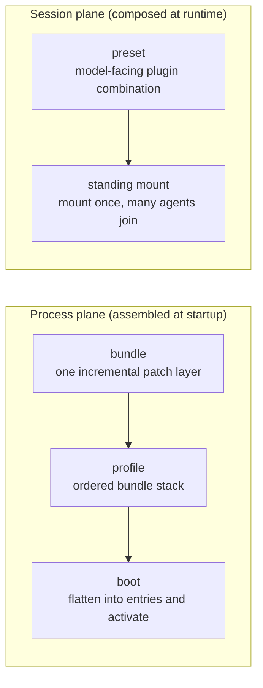
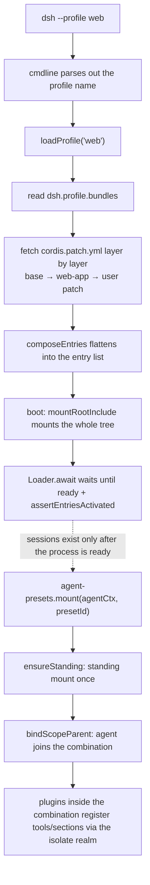

# Chapter 15: The preset / bundle / profile Combination — Assembling Loose Parts into Reusable Product Forms

> Assemble, not duplicate: sessions share one and the same mount; processes stack incremental patch layers one on top of another.

## Questions This Chapter Answers

- How can multiple agent sessions **reuse** the same model-facing plugin combination, instead of each session mounting its own copy?
- How can the process-startup service list be **incrementally customized** per product form (headless / web), instead of overwriting the whole configuration?
- Which layer does each of `preset`, `bundle`, and `profile` own? And why is the `preset` here not the same thing as Chapter 14's `permission-presets` despite the shared name?
- Why does mounting a preset need "double guards" to gate it?

In Chapter 1 we built the Cordis kernel: `Context` is the assembly container, and `Service` registers itself upon construction (`ch01/code/cordis.py`); Chapter 5 used the three roles of the capability seam to show "how one capability is defined, implemented, and consumed," making a single capability replaceable. This chapter **scales up composition** on top of those two chapters: instead of composing a single capability, we assemble **a whole batch of services/plugins** into named, reusable product forms. This chapter's teaching code reuses Chapter 1's `Context`/`Service` (`PresetService` in `ch15/code/preset.py` directly inherits from `cordis.Service`), and adds four new modules: `patch.py`/`bundle.py`/`profile.py`/`preset.py`.

This chapter uses **scope** — the name of "which agent," used to locate that agent's registry. The concept was defined in Chapter 9; here we only back-link to it and do not expand.

## 1. The Same Parts, Reassembled Every Time

You are maintaining a harness. It must run as different **product forms** (command-line headless, web UI) while simultaneously supporting **multiple agent sessions**, each of which needs a full set of model-facing plugins (persona, tools, prompt sections). Without a composition mechanism, you hit two dilemmas.

**Problem one (session level)**: every agent session needs that set of model plugins. If each session mounts its own copy, there are N plugin instances — updating the set means editing N places, and behavior consistency is hard to guarantee:

```python
# Inline example: no composition mechanism, each session mounts its own copy (illustrative, not this chapter's code)
for session in ("writer session", "reviewer session", "translator session"):
    mount_model_plugins(session)   # Result: 3 instances, 3 places to maintain
```

**Problem two (process level)**: you have a base configuration that runs well, and you want to derive a web variant — change the theme, add a server, turn off headless startup. The most intuitive approach is "whole-segment merge," but it is a pitfall at every turn (`ch15/code/bad_example.py`, new in this chapter, runnable):

```python
# ch15/code/bad_example.py (excerpt)
def merge_configs(base, overlay):
    """Whole-segment merge: for every key present in overlay, overwrite the value in base wholesale."""
    merged = dict(base)
    for key, value in overlay.items():
        merged[key] = value      # Whole-segment replacement: not incremental, and does not keep base's other fields
    return merged


def main():
    # base: a configuration that runs fine (each key is one service's config)
    base = {
        "settings": {"theme": "light", "lang": "zh"},
        "headless-startup": {"provider": "headless"},
    }

    # Goal: change theme to dark, add a server, turn off headless-startup.
    overlay = {
        "settings": {"theme": "dark"},     # Only theme is written; lang is not carried along
        "server": {"port": 8080},
        # merge has no way to express "turn off headless-startup"
    }

    merged = merge_configs(base, overlay)
    print("== Bad example: three pains of whole-segment merge ==")
    print(f"Pain 1: wanted to change only theme, but had to rewrite settings wholesale; forgot lang, and it is lost -> {merged['settings']}")
    print(f"Pain 2: merge has no 'disable'; headless-startup cannot be turned off, still present -> {'headless-startup' in merged}")
    print("Pain 3: settings was replaced wholesale; you cannot tell 'only theme changed' from 'the whole config was swapped'")
```

Running `python3 bad_example.py` prints:

```text
== Bad example: three pains of whole-segment merge ==
Pain 1: wanted to change only theme, but had to rewrite settings wholesale; forgot lang, and it is lost -> {'theme': 'dark'}
Pain 2: merge has no 'disable'; headless-startup cannot be turned off, still present -> True
Pain 3: settings was replaced wholesale; you cannot tell 'only theme changed' from 'the whole config was swapped'
```

The problems reduce to two: ① sessions each mount their own, so plugin instances number N and cannot be reused; ② deriving a product variant can only be done by whole-segment merge — change one thing, lose another; cannot disable; not traceable. This chapter introduces mechanisms one by one to solve them.

**Look at the overall map before decomposing**: this chapter's four concepts split into two planes — the **process plane** assembles at startup "which services the process loads," and the **session plane** composes at runtime "the model-facing plugins of a given agent session."



In the diagram: `bundle`/`profile`/`boot` feed one layer into the next, ultimately producing the process's service list; `preset` is shared by multiple agents via a **standing mount**. Below we decompose them one by one in the order `preset → bundle → profile → boot`; precise definitions of each concept are given in the corresponding subsections.

## 2. Mechanism One: preset — Session-Level Composition

### 2.1 First Distinguish: This preset Is Not Chapter 14's permission-presets

**preset (agent-presets)**: an agent session's **model-facing plugin combination** — one directory is one preset, carried by `agent.cordis.yml` (the composition list) plus `preset.yml` (metadata), managed by the `preset/agent-presets` package. It answers "which plugins should this session mount for the model."

Be sure to distinguish it from Chapter 14's **permission-presets**: those bundle **sandbox and approval policies** into named permission configurations, governing "what is allowed"; this chapter's preset governs "which plugins to install for the model." The two share the name `preset` and are both "a named set of presets," but one lives on the permission side and the other on the model side — **they are not the same thing**. Every `preset` in the rest of this chapter refers to agent-presets.

### 2.2 What a preset Is: One Directory = One Combination

`AgentPresets` is a Cordis service (`extends Service`, `packages/preset/agent-presets/src/index.ts:82`), injected with `loader` (`index.ts:83`), responsible for discovering, parsing, and mounting presets. Preset discovery is not cached and scans by root directory (`discovery.ts:139` `scanRoot`, `discovery.ts:177` `discoverPresets`): when the same id appears in multiple root directories, the one in the earlier root wins; the composition file is named `agent.cordis.yml` (`discovery.ts:26`). One more note: which preset a session uses is decided by `resolveSessionPreset` (`session.ts:48`), which walks the session's **event stream** (the log of events recorded while the session runs) in reverse and takes the most recent `agent-preset/selected` — because a **blank session** (one with no preset chosen at creation time) may pick or switch its preset midway, so reading only the declaration at the session head is not enough.

### 2.3 standing mount: One Preset Mounted Only Once, Many Agents Join (the crux)

The crux of preset is **standing mount**: each session starts from **one** preset's composition list and mounts that combination **only once** under a standing scope; afterwards every agent that names it **joins** the same instance instead of mounting its own copy. The benefit is that plugin instances, tools, and prompt sections all exist in exactly one copy; the session dimension is distinguished inside the plugins by scope keys; an agent uses `bindScopeParent` to hang its own scope key under the standing key (`index.ts:275–288`).

What supports "mount only once" is `standing`, a Map keyed by preset id (`index.ts:252`), together with `ensureStanding` (`index.ts:491`): the first request performs the real mount and writes the result into the cache; subsequent requests hit the cache directly. The three entry points `mount` (`index.ts:275`), `composeFrom` (`index.ts:316`), and `recompose` (`index.ts:458`) all call `ensureStanding` first and then bind the scope.

Python reconstruction (`ch15/code/preset.py`, new in this chapter; `Service` inherited from Chapter 1's `cordis.py`):

```python
# ch15/code/preset.py (PresetService's standing mount core)
class PresetService(Service):
    """Session-level preset service: standing mount + multi-agent join + double guards.

    [Teaching decision] The real AgentPresets also handles discovery/read-write/recomposition
    (list/read/copy/recompose, etc.); the teaching version keeps only mount / ensure_standing /
    the double guards, which are directly tied to this chapter's crux.
    """

    def __init__(self, ctx, presets, name="agentPresets"):
        super().__init__(ctx, name)      # Construction registers it: ctx.agentPresets points to this instance
        self._presets = presets          # preset_id -> list of plugin specs (each spec yields one service)
        self._standing = {}              # preset_id -> StandingMount (standing-mount cache, single-flight)
        self.mount_times = {}            # preset_id -> real mount count (for teaching observation)

    def ensure_standing(self, preset_id):
        """Standing mount: mount only once; on cache hit, reuse directly (mirrors ensureStanding, index.ts:491).

        Returns the same StandingMount instance — the root of "one preset mounted once, many agents join."
        """
        cached = self._standing.get(preset_id)
        if cached is not None:
            return cached                       # Cache hit: no remount, reuse directly
        specs = self._presets[preset_id]        # Cache miss: fetch this preset's plugin specs
        services = [self._mount_one(spec) for spec in specs]
        mount = StandingMount(preset_id, services)
        self._guard(mount)                      # Double guards: if either fails, raise; not cached
        self._standing[preset_id] = mount       # Only after passing the guards is it written to the standing cache
        self.mount_times[preset_id] = self.mount_times.get(preset_id, 0) + 1
        return mount

    def mount(self, agent_scope_key, preset_id):
        """Agent mount entry: ensureStanding + join (mirrors mount, index.ts:275).

        Multiple agents call it with their own scope keys and get the same StandingMount —
        this is exactly "standing mount: one preset mounted once, many agents join."
        """
        mount = self.ensure_standing(preset_id)
        mount.joined.append(agent_scope_key)    # This agent joins the same combination instance
        return mount
```

Consumer side (how an agent uses it): two agents each call `mount` with their own scope key. Output of running `main.py` segment 1 (full output in §7):

```text
agent-a and agent-b got the same combination instance: True
writer-preset real mount count: 1
```

`mount_a is mount_b` is `True` and the real mount count is `1` — precisely the evidence for "one preset mounted only once, many agents join": the second `mount` hit the cache inside `ensure_standing` and did not remount.

### 2.4 Single-Flight Cache and Generations (known boundary)

In the real code, the `standing` cache stores **Promises** — when two concurrent requests target the same preset, only the first performs the real mount; the second awaits the same Promise. This is called **single-flight**. Preset contents may change, so `compositionStamp` (`index.ts:546`) uses the composition file's `mtimeMs + size` as a fingerprint: when the fingerprint changes, new sessions trigger the next generation's mount, while the old generation is still held by old sessions and not reclaimed for now (reclamation, i.e. GC, is not yet implemented — the TODO at `index.ts:502–511`, marked in the main text as a **known boundary**). [Teaching simplification] The teaching version caches synchronous results rather than Promises and does not implement generational reclamation; it keeps only the observable behavior "cache hit means reuse."

### 2.5 Wrap-up

preset + standing mount solved Problem one: multiple sessions share one mount, and the plugin instance is unique. But a new question follows — mounting is the action of "loading a batch of plugins into a session"; what if some plugin was not loaded properly, or a service was registered at the wrong level? That is what the next section's guards answer.

## 3. Mechanism Two: Double Guards — Why Mounting Needs Guards

### 3.1 What Happens Without Guards

Mounting a preset actually runs a batch of plugins. Without checks: some plugins are **declared yet never activated**, so the session receives a broken combination and the problem is silently swallowed; some services should belong only to the current session but get registered at the **process level**, visible to every session, causing cross-session leakage. Both failures are insidious and must be stopped the moment mounting completes.

First define **realm**: Cordis's registration isolation boundary — the level at which a service is registered is exactly the level at which it is visible. The **ROOT realm** is process-level (shared by all sessions); the **isolate realm** is session-isolation-level. Plugins inside a combination should register their tools/sections into the isolate realm; registering into the ROOT realm is a leak. (realm/Loader/Include are Cordis kernel primitives not expanded in earlier chapters; a working definition is given at each one's first appearance below.)

### 3.2 Guard One: inactiveRows / Guard Two: leakedServices

`mountPreset` (`mount.ts:332–381`) runs two guards in order after mounting the subtree:

- **Guard one `inactiveRows`** (`mount.ts:283`): lists entries that are "declared but not activated"; non-empty means failure — the combination is incomplete.
- **Guard two `leakedServices`** (`mount.ts:189`): lists entries that "publish services to the ROOT realm"; non-empty means failure — session-level services leaked to the process level.

If either guard fails, the just-mounted subtree is disposed and a `PresetMountError` is thrown (`preset.ts:83`); only on pass is the mount recorded into the standing set. The `PresetTree` that carries the subtree inherits from `Include` (`mount.ts:57`) — `Include` is Cordis's mechanism for mounting a configuration subtree into a context; `PresetTree` also overrides `write()` to be empty (`mount.ts:110`) — `write()` is originally Include's entry point for writing configuration back, but a preset is read-only input and must never write back, so the subclass simply overrides it with an empty implementation, sealing off the write-back path entirely.

Python reconstruction (`ch15/code/preset.py`):

```python
# ch15/code/preset.py (PresetService's double guards)
    def _guard(self, mount):
        """Double guards (mirrors the two checks after mountPreset's mount, mount.ts:332–381).

        Guard one inactiveRows (mount.ts:283): entries declared but not activated -> incomplete combination.
        Guard two leakedServices (mount.ts:189): services registered at the process-level ROOT realm
        instead of the session-isolation level -> sessions would see each other; must be stopped.
        If either fails, raise PresetMountError; the teaching version does not cache failed mounts,
        so every attempt remounts and re-checks.
        """
        inactive = [s.id for s in mount.services if not s.activated]
        if inactive:
            raise PresetMountError(f"inactiveRows: {inactive} declared but not activated")
        leaked = [s.id for s in mount.services if s.realm == "ROOT"]
        if leaked:
            raise PresetMountError(f"leakedServices: {leaked} registered at the process-level ROOT realm")
```

Running `main.py` segment 2, the two broken presets are each stopped by one of the two guards (full output in §7):

```text
broken-inactive: stopped by the guard -> PresetMountError: inactiveRows: ['flaky-tool'] declared but not activated
broken-leak: stopped by the guard -> PresetMountError: leakedServices: ['global-cache'] registered at the process-level ROOT realm
```

[Teaching simplification] The real guards hang off the `PresetTree` subtree and dispose the subtree on failure; the teaching version expresses the same checks through each service's `activated`/`realm` fields and does not cache failed mounts, so every attempt remounts and re-checks.

### 3.3 Wrap-up

The double guards guarantee that "the combination a session receives is either complete and isolated, or the mount simply fails" — Problem one is now closed. Turning to Problem two: at process startup, how is the service list incrementally customized per product form?

## 4. Mechanism Three: bundle — Process-Level Incremental patch

### 4.1 What a bundle Is: "an npm Package with Only a Payload"

**bundle**: an **installable patch layer**. It is an npm package with "almost no code" — the TS entry is just a placeholder (`packages/bundle/base/src/index.ts` is only 10 lines of comments), and the real logic lives entirely in a single `cordis.patch.yml`; `package.json` declares it with `"dsh": {"bundle": {"patch": "./cordis.patch.yml"}}`. The `dsh.bundle.patch` field is the **sole contract** by which the boot side discovers a bundle (`profile.ts:344` `resolveBundleDir` locates the patch file through it).

### 4.2 patch, Not merge (the crux)

The crux of bundle is **patch, not merge**: `cordis.patch.yml` is not another standalone configuration but an **incremental modification** of the **existing configuration** — id-targeted overrides of config, disabling of entries, and insertion of new entries. The "entry" here is exactly an **entry**: one unit the process loads — a service/plugin together with its config and switch (id + config + disabled). This precisely addresses the three pains of §1's Problem two: write only increments (no field lost), able to disable, traceable.

The patch file is "a top-level YAML array whose elements are `PatchOptions`," parsed by `parsePatchList` (`app-boot/src/index.ts:320`). The teaching version models one patch as a dict with an `op` field, in three forms: `insert` / `override` / `disable`. Python reconstruction (`ch15/code/patch.py`, new in this chapter, module-level function):

```python
# ch15/code/patch.py (module-level function apply_entry_patches)
def apply_entry_patches(entries, patches):
    """Apply a batch of patches in order to an entry list and return a new list (the original is untouched).

    Mirrors the real code: include's applyEntryPatches — the final step that flattens the profile
    stack into an entry list (packages/boot/app-boot/src/profile.ts:413 composeEntries calls it).

    Implementation points:
    - Shallow-copy each entry first, so "patches act on copies" and the original list is not polluted;
    - Use a by_id index to locate targets, so override/disable are both "id-targeted";
    - insert appends to the list tail and syncs into the index, so later patches can target it too.
    """
    entries = [dict(e) for e in entries]          # Copies: do not touch the caller's list
    by_id = {e["id"]: e for e in entries}         # id -> entry index, for targeted lookup
    for patch in patches:
        op = patch["op"]
        if op == "insert":
            entry = dict(patch["entry"])          # Copy the new entry too, to avoid shared references
            entry.setdefault("config", {})
            entry.setdefault("disabled", False)
            entries.append(entry)                 # Append to the tail
            by_id[entry["id"]] = entry            # Into the index, so later patches can target it
        elif op == "override":
            target = by_id.get(patch["id"])
            if target is not None:                # No target found: skip (idempotent, no error)
                # Shallow-merge config: overwrite only the keys written; keep the rest —
                # this is exactly "incremental" rather than "whole-segment replacement"
                target["config"] = {**target["config"], **patch["config"]}
        elif op == "disable":
            target = by_id.get(patch["id"])
            if target is not None:
                target["disabled"] = True         # Flip only the disabled bit; do not delete the entry itself
    return entries
```

Running `main.py` segment 3, contrast with §1's merge bad example (full output in §7):

```text
override changes only theme; lang is kept: settings.config = {'theme': 'dark', 'lang': 'zh'}
disable flips only the disabled bit: headless-startup.disabled = True
after insert appends server: ['settings', 'headless-startup', 'server']
```

For the same "change theme, turn off headless, add server," the patch version keeps `lang`, cleanly disables `headless-startup`, and every entry is traceable — all three pains dissolved. [Teaching simplification] The real patches are YAML and allow `!!js` inline functions; the teaching version expresses the same semantics with dict + `op`.

### 4.3 Three Patch Layers: base / headless / web-app

There are really three bundles, each one patch layer (`packages/bundle/{base,headless,web-app}/cordis.patch.yml`). The source side uses **plane** to mean a group of services responsible for one aspect of concerns — unlike §1's lifecycle-based split into "process plane / session plane," here the split is by concern; the three bundles each own one plane:

- **base** (452 lines): the shared core layer, the first layer of every profile; inserts the harness-plane services (settings, scope, session, agent, system-prompt, etc.);
- **headless** (36 lines): inserts only the `headlessStartup` provider;
- **web-app** (425 lines): inserts the web-UI plane (server, api-proxy, sdk, etc.) and **disables headless's startup provider** — the core insight is that "the agent plane moves behind agent presets": the web UI no longer faces the model directly; the group of services responsible for facing the model is moved behind the presets, model capabilities are provided uniformly by presets, and the UI retreats to managing sessions/agents; the process layer only assembles, and the model side is handed to presets.

The teaching version expresses the three layers with a few representative patches (`ch15/code/bundle.py`, excerpt):

```python
# ch15/code/bundle.py (module-level variables, excerpt)
WEB_APP = Bundle("web-app", [
    {"op": "insert", "entry": make_entry("server", {"port": 8080})},
    {"op": "insert", "entry": make_entry("api-proxy")},
    # Key: a later layer precisely disables an entry inserted by an earlier layer —
    # merge cannot do this; patch can
    {"op": "disable", "id": "headless-startup"},
    # Key: id-targeted override of one config key of settings; the other keys stay untouched
    {"op": "override", "id": "settings", "config": {"theme": "dark"}},
])
```

### 4.4 Wrap-up

bundle solves Problem two's "change one thing, lose another; cannot disable" with "patch, not merge." But a single bundle is only one patch layer — how do multiple bundle layers compose into a product and actually get started? That is profile and boot.

## 5. Mechanism Four: profile + boot — Stack into a Stack, Flatten into Entries

### 5.1 profile: An Ordered bundle Stack

**profile**: the `$DSH_HOME/profiles/<name>` directory (`profile.ts:36` `PROFILES_DIR`; `$DSH_HOME` defaults to `~/.dsh` — the `~/.dsh` spelling in code comments refers to the same place). The `dsh.profile.bundles` in `package.json` is an **ordered list of bundles**, plus the user's own `cordis.patch.yml`. `loadProfile` (`profile.ts:371`) stacks each bundle's patches in order, with the user's patch placed at the **very top** — so the user can always override everything. Python reconstruction (`ch15/code/profile.py`, new in this chapter, module-level function):

```python
# ch15/code/profile.py (module-level function load_profile)
def load_profile(profile, bundle_registry):
    """Stack a profile into a sequence of patches: each bundle contributes one layer;
    the user's patch sits at the very top.

    Mirrors loadProfile (profile.ts:371): read dsh.profile.bundles, resolveBundleDir one by one
    to fetch each cordis.patch.yml, and stack them layer by layer; the user's
    ~/.dsh/profiles/<name>/cordis.patch.yml comes last.
    The returned list's order = application order (stack bottom -> stack top).
    """
    stacked = []
    for bundle_name in profile.bundles:
        bundle = bundle_registry[bundle_name]   # Discover the bundle by name (analogous to resolveBundleDir)
        stacked.extend(bundle.patches)          # Append this bundle's whole patch layer to the stack
    stacked.extend(profile.user_patches)        # The user's patch is always the top layer; it can override everything
    return stacked
```

### 5.2 boot: Flatten into an Entry List and Start

`composeEntries` (`profile.ts:413`) uses `applyEntryPatches` to **flatten** the stacked patches into the final entry list; `boot` (`app-boot/src/index.ts:757`) then mounts the entries into the container and asserts that all are activated. The real `boot` main chain is: `new Context()` and `provide('dshHomePath')` → `ctx.plugin(Loader)` → `mountRootInclude` (`index.ts:486`) mounts the whole tree → `loader.await()` waits until all are ready → `assertEntriesActivated` (`index.ts:692`) audits; on failure the entire fiber is disposed.

Here we complete the last Cordis kernel primitive: **Loader** is the service that registers and waits for all entries to load/activate (`loader.await()` waits until ready); Include is the mechanism already defined in §3.2 for "mounting a configuration subtree into a context" — `mountRootInclude` mounts the root tree, and §3's `PresetTree` mounts a preset subtree. Python reconstruction (`ch15/code/profile.py`):

```python
# ch15/code/profile.py (module-level functions compose_entries / boot)
def compose_entries(base_entries, stacked_patches):
    """First step of boot: flatten the stacked patches into the final entry list.

    Mirrors composeEntries (profile.ts:413): start from the base config and apply
    every patch in the stack in order.
    """
    return apply_entry_patches(base_entries, stacked_patches)


def boot(entries):
    """Second step of boot: load and activate the entries that are "not disabled"; return the activated ones.

    [Teaching simplification] The real boot (index.ts:757) is: new Context -> ctx.plugin(Loader) ->
    mountRootInclude mounts the whole tree -> loader.await() -> assertEntriesActivated asserts all activated.
    The teaching version keeps only the observable behavior "skip disabled, activate the rest."
    """
    activated = []
    for entry in entries:
        if entry["disabled"]:
            continue                            # Entries disabled by some patch layer are not loaded by boot
        activated.append(entry)                 # The remaining entries are activated one by one
    return activated
```

Running `main.py` segment 4: after the web stack is flattened, `headless-startup` is skipped and `settings.theme` is overridden (full output in §7). [Teaching simplification] The teaching boot keeps only the observable behavior "skip disabled, activate the rest," and does not implement Loader/Include's tree mounting or the `assertEntriesActivated` audit.

### 5.3 Wrap-up

profile stacks bundles into a stack, and boot flattens the stack into entries and activates them — Problem two is closed: product forms are customized by stacking patches, without touching base and without whole-segment overrides. Both planes are now covered; the next section ties them together with one data-flow diagram.

## 6. Data-Flow Panorama (closing)

The diagram below ties the two planes into one line: the upper half is process startup (boot flattens the profile stack into entries and mounts the tree); the lower half is the runtime session (preset standing mount, agent join). Details (per-step line numbers, guards, single-flight) were given in the corresponding subsections above; here we look only at the main trunk.



**[Teaching decision]** The diagram abbreviates the web stack as base → web-app: §7's actual run uses the three-layer stack `['base', 'headless', 'web-app']`, keeping the headless layer so that web-app's disabling of the earlier layer's headless-startup has a visible target (the real web profile's bundles list may differ); the "user patch" layer in the diagram is empty in this demo, so it does not appear in the output.

The process plane produces "which services the process loads," and the session plane produces "which plugins a given agent session mounts for the model"; the former is the stage for the latter — only after the process is ready do sessions mount presets on top of it.

## 7. Complete Run Output

The complete code for this chapter is in `ch15/code/`; run `python3 main.py` (depends on Chapter 1's `cordis.py`; `main.py` already adds `ch01` to `sys.path` automatically). All output below comes from the example code's `print` (no framework logs, no third-party output), and every line is traceable to one of `main.py`'s four demo segments:

```text
== Segment 1: preset standing mount — one preset mounted only once, many agents join ==
agent-a and agent-b got the same combination instance: True
writer-preset real mount count: 1
agents joined to this combination: ['agent-a', 'agent-b']
services inside the combination (single copy, shared across sessions): ['persona', 'tool-bash', 'system-prompt-section']

== Segment 2: double guards — why mounting needs guards ==
broken-inactive: stopped by the guard -> PresetMountError: inactiveRows: ['flaky-tool'] declared but not activated
broken-leak: stopped by the guard -> PresetMountError: leakedServices: ['global-cache'] registered at the process-level ROOT realm

== Segment 3: bundle — patch, not merge ==
override changes only theme; lang is kept: settings.config = {'theme': 'dark', 'lang': 'zh'}
disable flips only the disabled bit: headless-startup.disabled = True
after insert appends server: ['settings', 'headless-startup', 'server']

== Segment 4: profile stack + boot flattening ==
web profile's bundle stack (bottom → top): ['base', 'headless', 'web-app']
total stacked patches: 10
composed entries: ['settings', 'scope', 'session', 'agent', 'system-prompt', 'headless-startup', 'server', 'api-proxy']
boot activated (skipping disabled headless-startup): ['settings', 'scope', 'session', 'agent', 'system-prompt', 'server', 'api-proxy']
settings.config (theme overridden by web-app): {'theme': 'dark'}
```

Note that segment 4's final `settings.config` contains only `theme`: the teaching version's base-layer settings starts from an empty config (see BASE in `ch15/code/bundle.py`), so after layer-by-layer overrides only the theme written by web-app remains; in segment 3's output lang is kept because segment 3's demo base already wrote lang — the two are not contradictory.

Contrast with the opening epigraph: segment 1's "real mount count 1, unique combination instance" delivers "sessions share one and the same mount"; segments 3/4's "override keeps lang, disable cleanly disables, layer-by-layer stacking" delivers "processes stack incremental patch layers one on top of another" — assemble, not duplicate.

## 8. Source Code Mapping

| Mechanism in this chapter | Corresponding source location | Teaching-version difference in brief |
|------|------|------|
| preset service + standing mount | `packages/preset/agent-presets/src/index.ts:82` (`AgentPresets`), `:252` (standing Map), `:275` (mount), `:491` (ensureStanding) | The teaching `PresetService` caches synchronous results instead of Promises (no single-flight concurrency semantics) and does not implement generational reclamation (real GC is TODO, `index.ts:502–511`) |
| double guards | `packages/preset/agent-presets/src/mount.ts:332–381` (mountPreset), `:283` (inactiveRows), `:189` (leakedServices) | The teaching version expresses the checks through each service's `activated`/`realm` fields; it does not hang a `PresetTree` subtree and does not dispose on failure |
| patch application | `packages/boot/app-boot/src/index.ts:320` (parsePatchList), `profile.ts:413` (composeEntries calls applyEntryPatches) | The teaching version uses dict + `op`; the real one is YAML `PatchOptions` and allows `!!js` inline functions |
| three bundle layers | `packages/bundle/{base,headless,web-app}/cordis.patch.yml` (452/36/425 lines) | The teaching version excerpts only 2–5 representative patches per layer, not the full plugin list |
| profile stack | `packages/boot/app-boot/src/profile.ts:371` (loadProfile), `:344` (resolveBundleDir) | The teaching version fetches bundles by name from an in-memory registry; no directory discovery or `package.json` parsing |
| boot startup | `packages/boot/app-boot/src/index.ts:757` (boot), `:486` (mountRootInclude), `:692` (assertEntriesActivated) | The teaching boot only does "skip disabled, activate the rest"; no Loader/Include tree mounting or activation audit |

## 9. Summary and Preview

This chapter assembled loose parts into reusable product forms: **preset** (session level — standing mount lets multiple agents share one mount; the double guards gate completeness and isolation), **bundle** (process level — incremental patch layers, patch not merge), **profile + boot** (stack bundles into a stack, flatten into entries, and start). Chapter 16 enters typert — runtime types and object services — to see how these assembled services are safely read and invoked.

## 10. Appendix: Key Concepts Cheat Sheet

| Concept | One-line explanation | Depends on |
|------|-----------|------|
| **entry** | One service/plugin the process loads (id + config + disabled) | — (bottom layer) |
| **patch** | One incremental operation on the entry list (insert / override / disable) | entry |
| **realm** | Registration isolation boundary: ROOT = process level, isolate = session-isolation level | — (bottom layer) |
| **bundle** | One named patch layer ("an npm package with only a payload") | patch |
| **profile** | An ordered bundle stack + the user's top-layer patch | bundle |
| **boot** | Flattens the profile stack into an entry list and activates it | profile, patch |
| **preset** | Session-level model-facing plugin combination (agent-presets) | — (session plane) |
| **standing mount** | One preset mounted only once into a standing scope; many agents join | preset |
| **double guards** | inactiveRows + leakedServices; stop incomplete/leaking mounts | standing mount, realm |

> Layering: the process plane, bottom-up, is entry → patch → bundle → profile → boot; the session plane is preset → standing mount → double guards (realm supports the guard checks). Mapping between Python teaching symbols and source symbols: `PresetService`↔`AgentPresets`, `ensure_standing`↔`ensureStanding`, `_guard`↔`mountPreset`'s double guards, `apply_entry_patches`↔`applyEntryPatches`, `load_profile`↔`loadProfile`, `compose_entries`↔`composeEntries`.
