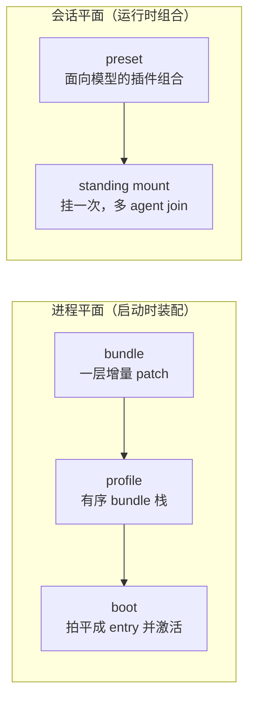
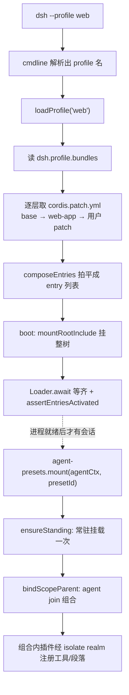

# 第 15 章 preset / bundle / profile 组合：把散装零件装配成可复用的产品形态

> 装配，而非复制：会话共享同一份挂载，进程叠加一层层增量 patch。

## 本章回答的问题

- 同一套面向模型的插件组合，怎么让多个 agent 会话**复用**，而不是每个会话各挂一遍？
- 进程启动时的服务清单，怎么按产品形态（headless / web）**增量定制**，而不是整段覆盖配置？
- `preset`、`bundle`、`profile` 各管哪一层？为什么同名 `preset` 与第 14 章的 `permission-presets` 不是一回事？
- 为什么挂载一个 preset 需要「双守卫」把关？

第 1 章我们搭好了 Cordis 内核：`Context` 是装配容器，`Service` 构造即注册（`ch01/code/cordis.py`）；第 5 章用 capability seam 三角色说明「一个能力如何被定义、实现、消费」，让单个能力可替换。本章在这两章之上**放大组合的尺度**：不再组合单个能力，而是把**一整批服务/插件**装配成可命名、可复用的产品形态。本章教学代码复用第 1 章的 `Context`/`Service`（`ch15/code/preset.py` 里 `PresetService` 直接继承 `cordis.Service`），新增 `patch.py`/`bundle.py`/`profile.py`/`preset.py` 四个模块。

本章会用到 **scope（作用域）**——「哪个 agent」的名字、用来定位它那张注册表，概念在第 9 章已定义，此处只做回链，不再展开。

## 1. 同一套零件，每次都要重新拼

你在维护一个 harness。它要跑成不同**产品形态**（命令行 headless、Web 界面），还要同时支撑**多个 agent 会话**，每个会话都需要一套面向模型的插件（persona、工具、prompt 段落）。没有组合机制时，你会撞上两个困境。

**问题一（会话级）**：每个 agent 会话都要那套模型插件。如果各会话各自挂载一遍，插件实例就有 N 份——更新一套要改 N 处，行为也难保一致：

```python
# 行内示例：没有组合机制，每个会话各挂一遍（示意，非本章代码）
for session in ("写手会话", "审稿会话", "翻译会话"):
    mount_model_plugins(session)   # 结果：3 份实例，3 处维护
```

**问题二（进程级）**：手头有一份跑得好好的 base 配置，想派生一个 Web 变体——改主题、加 server、关掉 headless 启动。最直觉的做法是「整段 merge」，但它处处是坑（`ch15/code/bad_example.py`，本章新增，可运行）：

```python
# ch15/code/bad_example.py（节选）
def merge_configs(base, overlay):
    """整段 merge：overlay 出现的每个 key，整段覆盖 base 里的值。"""
    merged = dict(base)
    for key, value in overlay.items():
        merged[key] = value      # 整段替换：不是增量，也不保留 base 的其余字段
    return merged


def main():
    # base：一份跑得好好的配置（每个 key 是一个服务的 config）
    base = {
        "settings": {"theme": "light", "lang": "zh"},
        "headless-startup": {"provider": "headless"},
    }

    # 目标：theme 改 dark、加 server、关掉 headless-startup。
    overlay = {
        "settings": {"theme": "dark"},     # 只写了 theme，没带 lang
        "server": {"port": 8080},
        # merge 没有办法表达「关掉 headless-startup」
    }

    merged = merge_configs(base, overlay)
    print("== 反例：整段 merge 的三个痛 ==")
    print(f"痛 1：只想改 theme，却得整段重写 settings；漏写 lang，它丢了 -> {merged['settings']}")
    print(f"痛 2：merge 没有『禁用』，headless-startup 关不掉，仍在 -> {'headless-startup' in merged}")
    print("痛 3：settings 被整段替换，看不出『只是改了 theme』还是『换掉了整个配置』")
```

运行 `python3 bad_example.py` 输出：

```text
== 反例：整段 merge 的三个痛 ==
痛 1：只想改 theme，却得整段重写 settings；漏写 lang，它丢了 -> {'theme': 'dark'}
痛 2：merge 没有『禁用』，headless-startup 关不掉，仍在 -> True
痛 3：settings 被整段替换，看不出『只是改了 theme』还是『换掉了整个配置』
```

问题归为两条：① 会话各挂各的，插件实例 N 份、无法复用；② 派生产品变体只能整段 merge，改一处丢一处、关不掉、不可追溯。本章逐个引入机制解决它们。

**先看整体地图再拆解**：本章的四个概念分成两个平面——**进程平面**在启动时装配「进程要加载哪些服务」，**会话平面**在运行时组合「某个 agent 会话面向模型的插件」。



图中：`bundle`/`profile`/`boot` 一层喂给一层，最终产出进程的服务清单；`preset` 经 **standing mount**（常驻挂载）被多个 agent 共享。下面按 `preset → bundle → profile → boot` 逐一拆解，各概念的准确定义见对应小节。

## 2. 机制一：preset —— 会话级组合

### 2.1 先分清：此 preset 非第 14 章的 permission-presets

**preset（agent-presets）**：一个 agent 会话**面向模型的插件组合**——一个目录就是一套 preset，载体是 `agent.cordis.yml`（组合清单）加 `preset.yml`（元数据），由 `preset/agent-presets` 包管理。它回答「这个会话要给模型挂哪些插件」。

务必与第 14 章的 **permission-presets（权限预设）** 区分：那是把**沙箱与审批策略**捆绑命名的权限配置，管的是「允许做什么」；本章的 preset 管的是「给模型装什么插件」。两者同名 `preset`、同为「可命名的一组预设」，但一个在权限面、一个在模型面，**不是同一个东西**。本章下文所有 `preset` 一律指 agent-presets。

### 2.2 preset 是什么：一个目录 = 一套组合

`AgentPresets` 是一个 Cordis 服务（`extends Service`，`packages/preset/agent-presets/src/index.ts:82`），注入 `loader`（`index.ts:83`），负责发现、解析、挂载 preset。preset 的发现不缓存、按根目录扫描（`discovery.ts:139` `scanRoot`、`discovery.ts:177` `discoverPresets`）：同一个 id 出现在多个根目录时，取排在前面的根目录中的那份；组合文件名为 `agent.cordis.yml`（`discovery.ts:26`）。顺带一提：会话用哪个 preset，由 `resolveSessionPreset`（`session.ts:48`）倒序遍历会话的**事件流**（会话运行中记录的事件日志）、取最近一次 `agent-preset/selected` 决定——因为**空白会话**（创建时还未选定 preset 的会话）可能中途才选定或切换 preset，不能只读会话头部的声明。

### 2.3 standing mount：一个 preset 只挂一次，多 agent join（题眼）

preset 的题眼是 **standing mount（常驻挂载）**：每个会话从**一个** preset 的组合清单出发，把这套组合**只挂载一次**到一个常驻 scope 下；之后所有点名它的 agent 都 **join（加入）** 同一个实例，而不是各挂一份。好处是插件实例、工具、prompt 段落都只有一份，会话维度在插件内部用 scope key 区分；agent 通过 `bindScopeParent` 把自己的 scope key 挂到常驻 key 之下（`index.ts:275–288`）。

支撑「只挂一次」的是 `standing` 这个按 preset id 缓存的 Map（`index.ts:252`）与 `ensureStanding`（`index.ts:491`）：第一个请求真正挂载并把结果写进缓存，后续请求直接命中缓存。`mount`（`index.ts:275`）、`composeFrom`（`index.ts:316`）、`recompose`（`index.ts:458`）三个入口都先 `ensureStanding` 再绑 scope。

Python 重构（`ch15/code/preset.py`，本章新增；`Service` 继承自第 1 章 `cordis.py`）：

```python
# ch15/code/preset.py（PresetService 的 standing mount 核心）
class PresetService(Service):
    """会话级 preset 服务：常驻挂载 + 多 agent join + 双守卫。

    [教学决策] 真实 AgentPresets 还负责发现/读写/重组合（list/read/copy/recompose 等），
    教学版只保留与本章题眼直接相关的 mount / ensure_standing / 双守卫。
    """

    def __init__(self, ctx, presets, name="agentPresets"):
        super().__init__(ctx, name)      # 构造即注册：ctx.agentPresets 指向本实例
        self._presets = presets          # preset_id -> 插件规格列表（每个规格产出一个服务）
        self._standing = {}              # preset_id -> StandingMount（常驻挂载缓存，单飞）
        self.mount_times = {}            # preset_id -> 真正挂载次数（教学观察用）

    def ensure_standing(self, preset_id):
        """常驻挂载：只挂一次，命中缓存直接复用（对应 ensureStanding，index.ts:491）。

        返回同一个 StandingMount 实例，是「一个 preset 只挂一次、多 agent join」的根。
        """
        cached = self._standing.get(preset_id)
        if cached is not None:
            return cached                       # 命中缓存：不再挂载，直接复用
        specs = self._presets[preset_id]        # 未命中：取出该 preset 的插件规格
        services = [self._mount_one(spec) for spec in specs]
        mount = StandingMount(preset_id, services)
        self._guard(mount)                      # 双守卫：任一不过即抛错，且不进缓存
        self._standing[preset_id] = mount       # 通过守卫才写入常驻缓存
        self.mount_times[preset_id] = self.mount_times.get(preset_id, 0) + 1
        return mount

    def mount(self, agent_scope_key, preset_id):
        """agent 挂载入口：ensureStanding + join（对应 mount，index.ts:275）。

        多个 agent 用各自 scope key 调它，拿到的是同一个 StandingMount——
        这就是「standing mount：一个 preset 只挂一次、多 agent join」。
        """
        mount = self.ensure_standing(preset_id)
        mount.joined.append(agent_scope_key)    # 该 agent join 到同一组合实例
        return mount
```

消费端（agent 怎么用）：两个 agent 各自用自己的 scope key 调 `mount`。运行 `main.py` 段 1 的输出（完整输出见 §7）：

```text
agent-a 与 agent-b 拿到同一个组合实例: True
writer-preset 真正挂载次数: 1
```

`mount_a is mount_b` 为 `True`、真正挂载次数为 `1`，正是「一个 preset 只挂一次、多 agent join」的证据：第二次 `mount` 命中的是 `ensure_standing` 里的缓存，没有重新挂载。

### 2.4 单飞缓存与代际（已知边界）

真实代码里 `standing` 缓存的是 **Promise**——两个并发请求同一 preset，只有第一个真正挂载，第二个等同一个 Promise，这叫**单飞（single-flight）**。preset 内容可能变化，`compositionStamp`（`index.ts:546`）用组合文件的 `mtimeMs + size` 当指纹：指纹变了，新会话触发下一代挂载，而旧代际仍被旧会话持有、暂不回收（回收即 GC 尚未实现，`index.ts:502–511` 的 TODO，正文标注为**已知边界**）。[教学简化] 教学版缓存同步结果而非 Promise，也不实现代际回收，只保留「命中缓存即复用」这一可观察行为。

### 2.5 回溯

preset + standing mount 解决了问题一：多个会话共享同一份挂载，插件实例唯一。但新的疑问随之而来——挂载是「把一批插件装进会话」的动作，如果某个插件没装好、或把服务装错了层级，会怎样？这就是下一节的守卫要回答的。

## 3. 机制二：双守卫 —— 为什么挂载要守卫

### 3.1 没有守卫会怎样

挂载 preset 会真正运行一批插件。若不加检查：有的插件**声明了却没被激活**，会话拿到的组合是残缺的，问题被静默吞掉；有的服务本应只属于当前会话，却被注册到了**进程级**，所有会话都看得见它，造成跨会话泄漏。这两种故障都隐蔽，必须在挂载完成的那一刻就拦下。

这里先定义 **realm（注册域）**：Cordis 的注册隔离边界——服务注册到哪一层，就只对哪一层可见。**ROOT realm** 是进程级（全体会话共享），**isolate realm** 是会话隔离级。组合里的插件应当把工具/段落注册进 isolate realm；注册到 ROOT realm 就是泄漏。（realm/Loader/Include 是 Cordis 内核原语，前章未展开，下文会在各自首次出现处给出工作级定义。）

### 3.2 守卫一 inactiveRows / 守卫二 leakedServices

`mountPreset`（`mount.ts:332–381`）挂完子树后依次跑两道守卫：

- **守卫一 `inactiveRows`**（`mount.ts:283`）：列出「声明了却未被激活」的条目，非空即失败——组合不完整。
- **守卫二 `leakedServices`**（`mount.ts:189`）：列出「把服务发到 ROOT realm」的条目，非空即失败——会话级服务泄漏到了进程级。

任一守卫不过，就 dispose 刚挂的子树并抛 `PresetMountError`（`preset.ts:83`）；通过才把挂载记入常驻集合。承载子树的 `PresetTree` 继承自 `Include`（`mount.ts:57`）——`Include` 是 Cordis 把一棵配置子树挂进 context 的机制；`PresetTree` 还覆写 `write()` 为空（`mount.ts:110`）——`write()` 本是 Include 回写配置的入口，而 preset 是只读输入、绝不回写，子类干脆把它覆写成空实现，堵死回写这条路。

Python 重构（`ch15/code/preset.py`）：

```python
# ch15/code/preset.py（PresetService 的双守卫）
    def _guard(self, mount):
        """双守卫（对应 mountPreset 挂载后的两道检查，mount.ts:332–381）。

        守卫一 inactiveRows（mount.ts:283）：有声明却未被激活的条目 → 组合不完整。
        守卫二 leakedServices（mount.ts:189）：有服务注册到进程级 ROOT realm
        而非会话隔离层 → 会话间会互相看见，必须拦下。
        任一不过即抛 PresetMountError；教学版不缓存失败挂载，故每次都会重挂并重检。
        """
        inactive = [s.id for s in mount.services if not s.activated]
        if inactive:
            raise PresetMountError(f"inactiveRows: {inactive} 声明了但未被激活")
        leaked = [s.id for s in mount.services if s.realm == "ROOT"]
        if leaked:
            raise PresetMountError(f"leakedServices: {leaked} 注册到了进程级 ROOT realm")
```

运行 `main.py` 段 2，两个坏 preset 分别被两道守卫拦下（完整输出见 §7）：

```text
broken-inactive: 被守卫拦下 -> PresetMountError: inactiveRows: ['flaky-tool'] 声明了但未被激活
broken-leak: 被守卫拦下 -> PresetMountError: leakedServices: ['global-cache'] 注册到了进程级 ROOT realm
```

[教学简化] 真实守卫挂在 `PresetTree` 子树上、失败时 dispose 子树；教学版用服务的 `activated`/`realm` 两个字段表达同一判定，且不缓存失败挂载，故每次都会重挂重检。

### 3.3 回溯

双守卫保证了「会话拿到的组合要么完整且隔离、要么干脆挂载失败」，问题一就此闭环。现在转向问题二：进程启动时，服务清单怎么按产品形态增量定制？

## 4. 机制三：bundle —— 进程级增量 patch

### 4.1 bundle 是什么：「只有一个 payload 的 npm 包」

**bundle**：一个**可安装的 patch 层**。它是个「几乎没有代码」的 npm 包——TS 入口只是占位（`packages/bundle/base/src/index.ts` 仅 10 行注释），真正的逻辑全在一份 `cordis.patch.yml` 里；`package.json` 用 `"dsh": {"bundle": {"patch": "./cordis.patch.yml"}}` 声明，`dsh.bundle.patch` 这个字段就是 boot 侧发现 bundle 的**唯一契约**（`profile.ts:344` `resolveBundleDir` 凭它定位 patch 文件）。

### 4.2 patch 而非 merge（题眼）

bundle 的题眼是 **patch 而非 merge**：`cordis.patch.yml` 不是另一份独立配置，而是对**已有配置**的**增量修改**——按 id 定向地覆盖 config、禁用条目、插入新条目。这里的「条目」就是 **entry**：进程要加载的一个单元——一个服务/插件连同它的配置与开关（id + config + disabled）。这正好对症 §1 问题二的三个痛：只写增量（不漏字段）、能禁用、可追溯。

patch 文件是「顶层 YAML 数组，元素为 `PatchOptions`」，由 `parsePatchList`（`app-boot/src/index.ts:320`）解析。教学版把一条 patch 建模为带 `op` 字段的 dict，三种形态：`insert` / `override` / `disable`。Python 重构（`ch15/code/patch.py`，本章新增，模块级函数）：

```python
# ch15/code/patch.py（模块级函数 apply_entry_patches）
def apply_entry_patches(entries, patches):
    """把一批 patch 依序作用到 entry 列表上，返回新列表（不改原列表）。

    对应真实代码：include 的 applyEntryPatches——profile 栈拍平成 entry 列表的最后一步
    （packages/boot/app-boot/src/profile.ts:413 composeEntries 调用它）。

    实现要点：
    - 先浅拷贝每个 entry，保证「patch 作用在副本上」，原列表不被污染；
    - 用 by_id 索引定位目标，所以 override/disable 都是「id 定向」的；
    - insert 追加到列表尾部，并同步进索引，供后续 patch 继续定向它。
    """
    entries = [dict(e) for e in entries]          # 副本：不动调用方传入的列表
    by_id = {e["id"]: e for e in entries}         # id -> entry 的索引，供定向查找
    for patch in patches:
        op = patch["op"]
        if op == "insert":
            entry = dict(patch["entry"])          # 新 entry 也拷一份，避免共享引用
            entry.setdefault("config", {})
            entry.setdefault("disabled", False)
            entries.append(entry)                 # 追加到尾部
            by_id[entry["id"]] = entry            # 进索引，后面的 patch 能定向它
        elif op == "override":
            target = by_id.get(patch["id"])
            if target is not None:                # 定向不到就跳过（幂等、不报错）
                # 浅合并 config：只覆盖写明的键，其余键保留——这正是「增量」而非「整段替换」
                target["config"] = {**target["config"], **patch["config"]}
        elif op == "disable":
            target = by_id.get(patch["id"])
            if target is not None:
                target["disabled"] = True         # 只翻禁用位，不删除条目本身
    return entries
```

运行 `main.py` 段 3，对照 §1 的 merge 反例（完整输出见 §7）：

```text
override 只改 theme，lang 保留: settings.config = {'theme': 'dark', 'lang': 'zh'}
disable 只翻禁用位: headless-startup.disabled = True
insert 追加 server 后: ['settings', 'headless-startup', 'server']
```

同样「改 theme、关 headless、加 server」，patch 版 `lang` 没丢、`headless-startup` 被干净禁用、条目可追溯——三个痛全部消解。[教学简化] 真实 patch 是 YAML 且允许 `!!js` 内联函数，教学版用 dict + `op` 表达同语义。

### 4.3 三层 patch：base / headless / web-app

真实有三个 bundle，各是一层 patch（`packages/bundle/{base,headless,web-app}/cordis.patch.yml`）。源码侧用**平面**（plane）指一组负责某一方面职责的服务——与 §1 按生命周期划分的「进程平面/会话平面」不同，这里按职责面划分；三个 bundle 各管一个平面：

- **base**（452 行）：共享核心层，是每个 profile 的第一层，插入 harness 平面服务（settings、scope、session、agent、system-prompt 等）；
- **headless**（36 行）：只插入 `headlessStartup` 提供者；
- **web-app**（425 行）：插入 Web 界面平面（server、api-proxy、sdk 等），并**禁用 headless 的启动提供者**——核心洞见是「agent 平面被移到了 agent presets 身后」（agent plane moves behind agent presets）：Web 界面不再直接面向模型，负责面向模型的那组服务被移到 presets 背后，模型能力统一由 preset 提供，界面退到只管会话/代理管理；进程层只管装配，模型面交给 preset。

教学版用少量代表 patch 表达三层（`ch15/code/bundle.py`，节选）：

```python
# ch15/code/bundle.py（模块级变量，节选）
WEB_APP = Bundle("web-app", [
    {"op": "insert", "entry": make_entry("server", {"port": 8080})},
    {"op": "insert", "entry": make_entry("api-proxy")},
    # 关键：后一层精确禁用前一层插入的条目——merge 做不到，patch 做得到
    {"op": "disable", "id": "headless-startup"},
    # 关键：id 定向覆盖 settings 的某个 config 键，其余键不动
    {"op": "override", "id": "settings", "config": {"theme": "dark"}},
])
```

### 4.4 回溯

bundle 用「patch 而非 merge」解决了问题二的「改一处丢一处、关不掉」。但单个 bundle 只是一层 patch——怎么把多层 bundle 组成一个产品、再真正启动起来？这就是 profile 与 boot。

## 5. 机制四：profile + boot —— 串成栈、拍平成 entry

### 5.1 profile：有序的 bundle 栈

**profile**：`$DSH_HOME/profiles/<name>` 目录（`profile.ts:36` `PROFILES_DIR`；`$DSH_HOME` 默认即 `~/.dsh`，代码注释里的 `~/.dsh` 写法与它指同一处），`package.json` 的 `dsh.profile.bundles` 是一份**有序的 bundle 名单**，外加用户自己的一份 `cordis.patch.yml`。`loadProfile`（`profile.ts:371`）按序把每个 bundle 的 patch 叠起来，用户 patch 压在**最上层**——所以用户总能覆盖一切。Python 重构（`ch15/code/profile.py`，本章新增，模块级函数）：

```python
# ch15/code/profile.py（模块级函数 load_profile）
def load_profile(profile, bundle_registry):
    """把 profile 叠成一串 patch：每个 bundle 贡献一层，用户 patch 压在最上层。

    对应 loadProfile（profile.ts:371）：读 dsh.profile.bundles，逐个 resolveBundleDir
    取出 cordis.patch.yml，层层叠加；用户 ~/.dsh/profiles/<name>/cordis.patch.yml 最后。
    返回的列表顺序 = 应用顺序（栈底 → 栈顶）。
    """
    stacked = []
    for bundle_name in profile.bundles:
        bundle = bundle_registry[bundle_name]   # 按名字发现 bundle（类比 resolveBundleDir）
        stacked.extend(bundle.patches)          # 该 bundle 的整层 patch 追加进栈
    stacked.extend(profile.user_patches)        # 用户 patch 永远是最上层，能覆盖一切
    return stacked
```

### 5.2 boot：拍平成 entry 列表并启动

`composeEntries`（`profile.ts:413`）用 `applyEntryPatches` 把叠好的 patch **拍平**成最终 entry 列表；`boot`（`app-boot/src/index.ts:757`）再把 entry 挂进容器并断言全部激活。真实 `boot` 主链是：`new Context()` 并 `provide('dshHomePath')` → `ctx.plugin(Loader)` → `mountRootInclude`（`index.ts:486`）挂整树 → `loader.await()` 等齐 → `assertEntriesActivated`（`index.ts:692`）审计，失败即 dispose 整个 fiber。

这里补最后一个 Cordis 内核原语：**Loader** 是登记并等待所有 entry 加载/激活的服务（`loader.await()` 等齐）；Include 是 §3.2 已定义过的「把一棵配置子树挂进 context」的机制——`mountRootInclude` 挂根树，§3 的 `PresetTree` 挂 preset 子树。Python 重构（`ch15/code/profile.py`）：

```python
# ch15/code/profile.py（模块级函数 compose_entries / boot）
def compose_entries(base_entries, stacked_patches):
    """boot 的第一步：把叠好的 patch 拍平成最终 entry 列表。

    对应 composeEntries（profile.ts:413）：从 base 配置出发，依次应用栈里全部 patch。
    """
    return apply_entry_patches(base_entries, stacked_patches)


def boot(entries):
    """boot 的第二步：加载并激活「未被禁用」的 entry，返回被激活的 entry。

    [教学简化] 真实 boot（index.ts:757）是：new Context → ctx.plugin(Loader) →
    mountRootInclude 挂整树 → loader.await() → assertEntriesActivated 断言全部激活。
    教学版只保留「跳过 disabled、激活其余」这一可观察行为。
    """
    activated = []
    for entry in entries:
        if entry["disabled"]:
            continue                            # 被某层 patch 禁用的条目，boot 不加载
        activated.append(entry)                 # 其余条目逐个激活
    return activated
```

运行 `main.py` 段 4：web 栈拍平后，`headless-startup` 被跳过、`settings.theme` 被覆盖（完整输出见 §7）。[教学简化] 教学版 boot 只保留「跳过 disabled、激活其余」这一可观察行为，不实现 Loader/Include 的树挂载与 `assertEntriesActivated` 审计。

### 5.3 回溯

profile 把 bundle 串成栈、boot 把栈拍平成 entry 并激活，问题二闭环：产品形态靠叠加 patch 定制，不碰 base、不整段覆盖。两个平面都讲完了，下一节用一张数据流图把它们串起来。

## 6. 数据流全景（收尾）

下图把两个平面串成一条线：上半是进程启动（boot 把 profile 栈拍平成 entry 并挂树），下半是运行时会话（preset 常驻挂载、agent join）。细节（各步行号、守卫、单飞）已在前文对应小节给出，此处只看主干。



**[教学决策]** 图中 web 栈简写为 base → web-app：§7 实跑用的是三层栈 `['base', 'headless', 'web-app']`，保留 headless 层是为了给 web-app 禁用前层插入的 headless-startup 提供可见目标（真实 web profile 的 bundles 列表可能不同）；图中的「用户 patch」层在本 demo 里为空，所以输出里不出现。

进程平面产出「进程加载哪些服务」，会话平面产出「某个 agent 会话给模型挂哪些插件」；前者是后者的舞台——进程就绪后，会话才在其上挂载 preset。

## 7. 完整运行输出

本章完整代码在 `ch15/code/`，运行 `python3 main.py`（依赖第 1 章 `cordis.py`，`main.py` 已自动把 `ch01` 加进 `sys.path`）。以下输出全部来自示例代码的 `print`（无框架日志、无第三方输出），逐行可溯源到 `main.py` 四个演示段：

```text
== 段 1：preset standing mount —— 一个 preset 只挂一次，多 agent join ==
agent-a 与 agent-b 拿到同一个组合实例: True
writer-preset 真正挂载次数: 1
join 到该组合的 agent: ['agent-a', 'agent-b']
组合内服务（唯一一份，会话间共享）: ['persona', 'tool-bash', 'system-prompt-section']

== 段 2：双守卫 —— 为什么挂载要守卫 ==
broken-inactive: 被守卫拦下 -> PresetMountError: inactiveRows: ['flaky-tool'] 声明了但未被激活
broken-leak: 被守卫拦下 -> PresetMountError: leakedServices: ['global-cache'] 注册到了进程级 ROOT realm

== 段 3：bundle —— patch 而非 merge ==
override 只改 theme，lang 保留: settings.config = {'theme': 'dark', 'lang': 'zh'}
disable 只翻禁用位: headless-startup.disabled = True
insert 追加 server 后: ['settings', 'headless-startup', 'server']

== 段 4：profile 栈 + boot 拍平 ==
web profile 的 bundle 栈（栈底→栈顶）: ['base', 'headless', 'web-app']
叠好的 patch 总数: 10
compose 出的 entry: ['settings', 'scope', 'session', 'agent', 'system-prompt', 'headless-startup', 'server', 'api-proxy']
boot 激活（跳过被禁用的 headless-startup）: ['settings', 'scope', 'session', 'agent', 'system-prompt', 'server', 'api-proxy']
settings.config（theme 被 web-app 覆盖）: {'theme': 'dark'}
```

注意段 4 最终的 `settings.config` 只剩 `theme`：教学版 base 层的 settings 从空 config 起步（见 `ch15/code/bundle.py` 的 BASE），逐层 override 之后自然只剩 web-app 写入的 theme；段 3 输出里 lang 能保留，是因为段 3 的演示 base 本来就写了 lang，两处并不矛盾。

对照开篇题记：段 1「真正挂载次数 1、组合实例唯一」兑现了「会话共享同一份挂载」；段 3/4「override 保留 lang、disable 干净禁用、逐层叠加」兑现了「进程叠加一层层增量 patch」——装配，而非复制。

## 8. 源码对照

| 本章机制 | 对应源码位置 | 教学版差异概括 |
|------|------|------|
| preset 服务 + standing mount | `packages/preset/agent-presets/src/index.ts:82`（`AgentPresets`）、`:252`（standing Map）、`:275`（mount）、`:491`（ensureStanding） | 教学版 `PresetService` 缓存同步结果而非 Promise（无单飞并发语义），不实现代际回收（真实 GC 为 TODO，`index.ts:502–511`） |
| 双守卫 | `packages/preset/agent-presets/src/mount.ts:332–381`（mountPreset）、`:283`（inactiveRows）、`:189`（leakedServices） | 教学版用服务的 `activated`/`realm` 字段表达判定，不挂 `PresetTree` 子树、失败不 dispose |
| patch 应用 | `packages/boot/app-boot/src/index.ts:320`（parsePatchList）、`profile.ts:413`（composeEntries 调 applyEntryPatches） | 教学版用 dict + `op`，真实是 YAML `PatchOptions` 且允许 `!!js` 内联函数 |
| bundle 三层 | `packages/bundle/{base,headless,web-app}/cordis.patch.yml`（452/36/425 行） | 教学版每层只摘 2–5 条代表 patch，不全列插件清单 |
| profile 栈 | `packages/boot/app-boot/src/profile.ts:371`（loadProfile）、`:344`（resolveBundleDir） | 教学版用内存注册表按名字取 bundle，不做目录发现与 `package.json` 解析 |
| boot 启动 | `packages/boot/app-boot/src/index.ts:757`（boot）、`:486`（mountRootInclude）、`:692`（assertEntriesActivated） | 教学版 boot 只做「跳过 disabled、激活其余」，不实现 Loader/Include 树挂载与激活审计 |

## 9. 小结与预告

本章把散装零件装配成了可复用的产品形态：**preset**（会话级，standing mount 让多 agent 共享一份挂载，双守卫把关完整性与隔离）、**bundle**（进程级，patch 而非 merge 的增量层）、**profile + boot**（把 bundle 串成栈、拍平成 entry 并启动）。第 16 章进入 typert——运行时类型与对象服务，看这些装配好的服务如何被安全地取值与调用。

## 10. 附录：关键概念速查表

| 概念 | 一句话解释 | 依赖 |
|------|-----------|------|
| **entry** | 进程要加载的一个服务/插件（id + config + disabled） | —（底层） |
| **patch** | 对 entry 列表的一次增量操作（insert / override / disable） | entry |
| **realm** | 注册隔离边界：ROOT=进程级，isolate=会话隔离级 | —（底层） |
| **bundle** | 一层命名的 patch（「只有一个 payload 的 npm 包」） | patch |
| **profile** | 有序的 bundle 栈 + 用户最上层 patch | bundle |
| **boot** | 把 profile 栈拍平成 entry 列表并激活 | profile、patch |
| **preset** | 会话级面向模型的插件组合（agent-presets） | —（会话平面） |
| **standing mount** | 一个 preset 只挂一次到常驻 scope，多 agent join | preset |
| **双守卫** | inactiveRows + leakedServices，拦不完整/泄漏的挂载 | standing mount、realm |

> 分层：进程平面自底向上为 entry → patch → bundle → profile → boot；会话平面为 preset → standing mount → 双守卫（realm 支撑守卫判定）。Python 教学符号与源符号映射：`PresetService`↔`AgentPresets`、`ensure_standing`↔`ensureStanding`、`_guard`↔`mountPreset` 双守卫、`apply_entry_patches`↔`applyEntryPatches`、`load_profile`↔`loadProfile`、`compose_entries`↔`composeEntries`。
