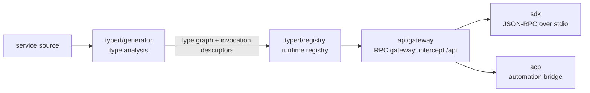
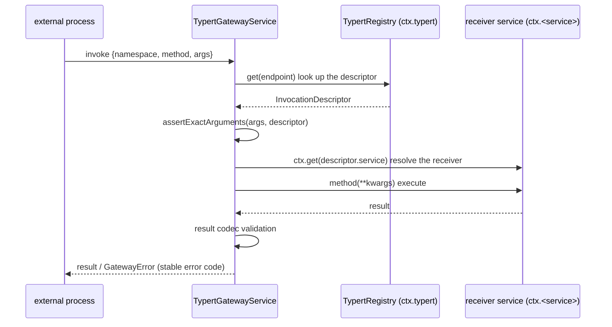

# Chapter 16: typert / api / sdk — The Cross-Process Typed RPC Runtime

> Only contracts cross the boundary, not objects; types are compiled into a graph, and calls are validated against the graph.

## Questions This Chapter Answers

- Chapter 5's capability seam solved in-process reuse — but how do consumers outside the process (CLI, web, automation scripts) call capabilities inside the host process?
- How does a method's type contract (what parameters it takes, what it returns) cross the process boundary and get validated at the boundary?
- When adding a new exported method, why is there no need to hand-write routing, serializers, or client stubs?
- What does each of `typert`, `api` (gateway), `sdk`, and `acp` own in this chain?

The end of Chapter 15 previewed it: the next stop is typert, to see how assembled services are safely read and invoked. This chapter pushes that sentence one step further — not just safe in-process reads, but **safe cross-process calls**.

This chapter depends on Chapters 1 and 5: Chapter 1's `Context` / `Service` (this chapter's teaching code continues to reuse `ch01/code/cordis.py` via `sys.path`); Chapter 5's three capability-seam roles — **provider, implementer, consumer** (see Chapter 5 for details). The seam solved "how one capability is defined, implemented, and consumed within a process"; this chapter extends the "consumer" role outside the process. The `service` field in the invocation descriptor below is exactly that `ctx.<key>` from Chapter 5's Service Definition.

This chapter adds five files under `ch16/code/`: `typert.py` (type graph + registry), `gateway.py` (RPC gateway), `sdk.py` (JSON-RPC SDK), `main.py` (runnable entry), and `bad_example.py` (bad example).

## 1. Capabilities Live Inside the Process; Callers Live Outside

A batch of services is assembled inside the harness host process: executing shell, managing sessions, calling models. But the consumers of these capabilities are often not inside the process — CLI tools, web backends, and automation scripts all want to call `shellExecutor.run`. Without a dedicated mechanism, the most intuitive approach is to hand-write a bridge (`ch16/code/bad_example.py`, runnable):

```python
class ShellHost:
    """A service inside the host process (the business side)."""

    def run(self, request):
        return {"exitCode": 0, "stdout": f"[stub] executed: {request['command']}"}


def hand_written_bridge(host, endpoint, payload):
    """Hand-written forwarding: one branch per method, no validation at all — the contract lives only in the author's head."""
    if endpoint == "/api/shell/run":
        return host.run(payload)   # payload is passed through as request: a wrong shape only blows up deep in business code
    raise KeyError(endpoint)       # Every new method must be synced by adding a branch here
```

Running `python3 bad_example.py` prints:

```text
== Bad example: three pains of hand-written cross-process bridging ==
Pain 1: a misspelled parameter name is not stopped at the boundary; it blows up deep in business code -> KeyError('command')
Pain 2: non-JSON values are not stopped at the boundary; they blow up only at serialization time -> TypeError: Object of type function is not JSON serializable
Pain 3: a new method not synced into the bridge is only discovered at call time -> KeyError('/api/shell/start')
```

Three pains: **the contract lives only in the author's head** — only the author knows what parameters a method takes; a misspelled parameter name is not stopped at the boundary and blows up only deep in business code (`KeyError('command')`); **no boundary validation** — values that cannot be JSON-serialized (say, a function) can sneak into the arguments and blow up only when serialization for transport happens; **hand-written one-to-one forwarding** — every new method must be synced by adding a branch on the bridge; forget it and you only find out at call time.

The root cause of all three pains is the same: **the method's type contract has not become data**. If the contract (parameter names, types, result shape) could be compiled into a serializable, queryable structure, the boundary could validate against it, and routing would not need to be hand-written. That is exactly what this chapter's mechanism chain does.

## 2. The Overall Map

**Look at the whole before decomposing**: this chapter's four source modules connect into one chain —



In the diagram: the generator compiles service contracts into a **type graph** and registers it into the registry; the gateway validates and dispatches every cross-process call against the registry; SDK and ACP are two transport forms through which the gateway's capabilities reach outside the process. Below we decompose them one by one in the order `typert → gateway → SDK → ACP`; each concept is defined in the subsection where it first appears.

## 3. The typert Type Graph: Compiling Contracts into a Carrier-Agnostic Model

### 3.1 What the Type Graph Is

**typert** is the source module responsible for "runtime types + object services," and its core artifact is the **type graph**: a carrier-agnostic intermediate model produced by type analysis, consisting of `TypeGraph` (the whole graph, `packages/typert/generator/src/model.ts:430`) and `TypeNodeModel` (nodes in the graph, `model.ts:350`, 18 variants in total: primitive/object/union/literal, etc.).

Why not use the source language's types directly? Because source-language types live only at compile time and inside the process: they cannot cross the process, cannot be looked up at runtime, and cannot be validated at the boundary. The type graph extracts types from the source code and solidifies them into **data** — and once it is data, it can be registered, transported, and validated. This is the first step of dissolving Problem 1: the contract moves out of the author's head and into a queryable table.

The component responsible for this step is the generator `WorkspaceTypertGenerator` (`packages/typert/generator/src/workspace.ts:20`): `discover` finds source files (:33), `generate` performs type analysis (:46), and `validateExport` validates `./typert` / `./remote` exports (:68). On the loader side, the typert-loader plugin scans `./typert` exports (`TYPERT_HOST_EXPORT = './typert'`, `packages/typert/loader/src/index.ts:39`), validates the manifest (`validateTypertManifest`, `index.ts:83`), and requires strict codecs (`requireStrictCodec`, `index.ts:264`).

**Two-sided compilation**: the same method contract compiles into two sides — the host side produces the **invocation descriptor** (how a host method is called), and the client side produces the Remote descriptor (`TypertClientRemote`, `packages/typert/protocol/src/types.ts:221`, which uses `$mount` to mount host-side contracts on the client); remote results are uniformly wrapped in `RemoteResult<T>` (`types.ts:60`). This chapter focuses on the host side; the client side is its mirror, and §6's SDK is one concrete client.

### 3.2 InvocationDescriptor: The Carrier-Agnostic Description of One Call

The minimal unit the type graph outputs is the **InvocationDescriptor**: the carrier-agnostic description of one exported method. The source excerpt is as follows (TS, `packages/typert/protocol/src/types.ts:172-211`; `readonly` means the field is read-only, and things like `kind: 'direct'` are TS literal types, meaning "this field can only take this string"):

```ts
export interface InvocationDescriptor {
  readonly id: string                 // Globally stable generated identifier
  readonly service: string            // The Cordis service key that owns this method
  readonly namespace: string          // Wire namespace, defaults to the service key
  readonly method: string             // Public instance method name
  readonly implementation?: string    // The actual member when the exported method name is an alias
  readonly invocation:
    | { readonly kind: 'direct' }
    | { readonly kind: 'context'; readonly context: string; readonly wire: string; readonly codec: TypertCodec }
  readonly scope?: { readonly context: string; readonly wire: string }  // One direct lookup parameter
  readonly parameters: readonly InvocationParameterDescriptor[]
  readonly cancellation?: { readonly parameter: 'signal' }              // Transport cancellation
  readonly result: TypertCodec
  readonly sourceLocation?: InvocationSourceLocation
}
```

Reading field by field: `service` is the Cordis service key that owns the method (corresponding to `ctx.<key>` in Chapter 5's Service Definition); `namespace` is the wire namespace, defaulting to the service key — **wire**: the serialization transmission line between two processes, on which only JSON text travels, never live objects; `method` is the public instance method name; `parameters` is the sequence of parameter descriptors; `result` is the encode/decode policy for the result; `invocation` distinguishes direct calls from context calls. A parameter's `lookup` marker means that parameter is a **host object** — a live instance living in the host process (such as a session object) that cannot be serialized; only its **identity field** (a string representing it) travels on the wire, and the gateway swaps it back to the object before calling (§5.4).

Two kinds of keys are easy to confuse, so we define them together: **typertKey** identifies a schema, shaped like `<pkg>#<name>` (`typertKey`, `packages/typert/registry/src/service.ts:48`); **typertEndpoint** identifies a callable endpoint, shaped like `<namespace>/<method>` (`typertEndpoint`, `service.ts:67`). The former answers "what type," the latter answers "whom to call."

The teaching version models descriptors as two frozen dataclasses, keeping 6 of the real 11 fields (`ch16/code/typert.py`):

```python
# ---------- Invocation descriptor: the carrier-agnostic description of one exported method ----------

@dataclass(frozen=True)
class InvocationParameterDescriptor:
    """A single parameter of an exported method: name + schema pointing into the type graph + whether it is a host object."""

    name: str
    schema: str                 # Points to a type node in the type graph (<pkg>#<name> form)
    lookup: str | None = None   # None = ordinary JSON parameter; otherwise a lookup kind (e.g. "agent"):
                                # only the identity field travels on the wire; the gateway swaps it back to the host object before calling


@dataclass(frozen=True)
class InvocationDescriptor:
    """The carrier-agnostic description of one exported RPC method ↔ InvocationDescriptor (types.ts:172-211).

    [Teaching simplification] The real fields also include implementation / invocation / scope /
    cancellation / sourceLocation; the teaching version keeps id / service / namespace / method /
    parameters / result.
    """

    id: str                    # Globally stable generated identifier
    service: str               # The Cordis service key that owns this method (corresponds to ctx.<key> in Chapter 5's Service Definition)
    namespace: str             # Wire namespace, defaults to the service key
    method: str                # Public instance method name
    parameters: tuple          # Sequence of InvocationParameterDescriptor
    result: str                # Result codec: CODEC_STRICT / CODEC_SRC_JSON
```

[Teaching simplification] The fields not kept are listed in the docstring above. The encode/decode policy corresponds to `TypertCodec` (`types.ts:139`); the teaching version defines it as two constants:

```python
# Encode/decode policy ↔ TypertCodec (types.ts:139)
CODEC_STRICT = "strict"        # Strict: validate against the schema (the real one uses Zod v4, loader/src/index.ts:264)
CODEC_SRC_JSON = "src-json"    # Weak parsing: only JSON-safety validation, for scenarios without a generator
```

### 3.3 The Generator: From Service Class to Type Graph

The real generator relies on the compiler to analyze TS source; the teaching version uses `inspect` to reflect Python signatures and treats the class attribute `typert_exports` as the "./typert export declaration" — corresponding to `validateExport`'s export validation (`workspace.ts:68`). The entry point and export validation of `generate_contribution` (`ch16/code/typert.py`, module-level function):

```python
def generate_contribution(cls, package, namespace=None):
    """Teaching-version generator: reflect a class's exported methods and produce the type graph + invocation descriptors.

    ↔ WorkspaceTypertGenerator: discover (workspace.ts:33) → generate (:46) →
    validateExport (:68, validates ./typert / ./remote exports).
    [Teaching simplification] The teaching version uses inspect to reflect Python signatures and
    treats the class attribute typert_exports as the "./typert export declaration": without the
    declaration, generation is refused — mirroring the real validateExport's check.
    Returns (contribution, graph): the former is submitted to the registry; the latter is for observing the type graph's shape.
    """
    exports = getattr(cls, "typert_exports", None)
    if not exports:
        raise TypertError(f"{cls.__name__} does not declare ./typert exports (missing typert_exports)")
```

After export validation, each method's signature is reflected one by one: each parameter gets a `TypeNode` inferred from its annotation (lookup parameters are recorded as host objects), the descriptor is assembled, and finally everything is returned together with the type graph (complete code in `typert.py`):

```python
        invocations.append(InvocationDescriptor(
            id=typert_key(package, f"{cls.__name__}.{method_name}"),
            service=service_key, namespace=namespace, method=method_name,
            parameters=tuple(params), result=CODEC_STRICT,
        ))
    return TypertContribution(package, dict(graph.declarations), invocations), graph
```

The `TypertContribution` in the return value is exactly the **contribution**: everything a package submits to the registry in one go (package record + schemas + descriptors). The producer side writes it like this (the consumer side is §4's registry and §5's gateway). `ShellExecutorStub` in `ch16/code/main.py` echoes Chapter 5's capability-seam shellExecutor:

```python
class ShellExecutorStub(Service):
    """Teaching stub for the shellExecutor in Chapter 5's capability seam.

    [Teaching decision] Does not import Chapter 5's code; the shell seam's vocabulary types
    (ShellExecRequest / ShellRunResult) are represented as plain dicts, keeping this chapter self-contained.
    """

    service_key = "shellExecutor"
    typert_exports = ("run",)  # ./typert export declaration: which methods go cross-process

    def __init__(self, ctx):
        super().__init__(ctx, self.service_key)

    def run(self, request: dict) -> dict:
        return {"exitCode": 0, "stdout": f"[stub] executed: {request['command']}"}
```

Running `main.py` segment 1, the generator's output (full output in §8):

```text
== Segment 1: generator — compiling the service contract into a type graph ==
type graph node count: 1, named declaration count: 1
invocation descriptor: id=demo-shell#ShellExecutorStub.run
  service=shellExecutor endpoint=shellExecutor/run
  parameters=[('request', 'demo-shell#ShellExecutorStub.run.request')] result codec=strict
```

The `request` parameter is compiled into a type-graph node, and its schema points to it in typertKey form (`demo-shell#ShellExecutorStub.run.request`); the endpoint is in typertEndpoint form (`shellExecutor/run`). [Teaching simplification] The real `TypeNodeModel` has 18 variants; the teaching `TypeNode`'s variants are only `primitive` / `object`, subdivided with `detail`.

The type graph solved the first half of Problem 1: the contract becomes data and can cross the process. But data does not enforce itself — at runtime, who holds these descriptors? When a plugin is unloaded, how do we guarantee "either all registered or none at all"? That is the registry.

## 4. TypertRegistry: The Runtime Registry

### 4.1 What the Registry Holds

**TypertRegistry (runtime registry)**: the runtime holder of the type graph, a Cordis service (`@typert service typert`, `packages/typert/registry/src/service.ts:446`). It holds: `packages` (package records), `schemas` (typertKey → type node), two `DescriptorStore`s for local/remote (`service.ts:107`, endpoint → descriptor); descriptor validation lives separately in `validateInvocation` (`service.ts:638`). Alongside are `RemoteStore` (`service.ts:182`), `LookupStore` (`service.ts:216`), and `ContextStore` (`service.ts:336`). [Teaching simplification] The teaching version keeps only the local set; lookup is deferred to §5.4.

### 4.2 Atomic Registration: Commit Inside an effect, Roll Back via the disposer

The key design of registration is **atomicity**: a contribution must be either wholly visible or wholly invisible — if registration is half done, the gateway might find a descriptor but not its schema. The real implementation puts the commit inside a Cordis effect (Chapter 1: a side effect that runs immediately and can register a cleanup function) and yields the cleanup function (`register`, `service.ts:499`):

```ts
register(contribution: TypertContribution): TypertDisposer {
  const packageRecord = this.validatePackage(contribution)
  const schemaRecords = this.validateSchemas(contribution)
  const invocations = contribution.invocations
  this.localStore.validate(invocations)
  const owner = {}
  const { schemas, packages, localStore } = this
  return this.ctx.effect(function* () {
    packages.set(packageRecord.key, packageRecord)
    for (const record of schemaRecords) schemas.set(record.key, record)
    localStore.commit(owner, invocations)
    yield () => { /* revoke all records of this contribution */ }
  })
}
```

(TS: `this.ctx.effect(function* () {...})` registers an immediately executed effect; the cleanup function the generator `yield`s is the disposer, called on unload.) Three validations — package record, schemas, local descriptors — must all pass before the effect commits. The teaching version replicates the same structure (`ch16/code/typert.py`, `TypertRegistry.register`, validation part):

```python
    def register(self, contribution):
        """Atomically register a generated contribution ↔ register (service.ts:499).

        First run three validations (corresponding to validatePackage / validateSchemas /
        localStore.validate); only after all pass does it commit inside ctx.effect: write
        packages / schemas / local in one go, and return the disposer — calling it revokes
        all records of this contribution (corresponding to the cleanup function yielded
        inside the real effect).
        """
        if contribution.package in self.packages:
            raise TypertError(f"package already registered: {contribution.package}")
        for descriptor in contribution.invocations:
            endpoint = typert_endpoint(descriptor.namespace, descriptor.method)
            if endpoint in self._local:
                raise TypertError(f"endpoint already occupied: {endpoint}")
            for param in descriptor.parameters:
                if param.schema not in contribution.schemas:
                    raise TypertError(f"missing schema: {param.schema}")
```

After validation passes comes `commit`: three tables are written in one go, and a **disposer** is returned (Chapter 1: the effect's cleanup function; calling it revokes this registration):

```python
        def commit():
            # Reaching here means all validations passed: write three tables in one go, never "half written"
            self.packages[contribution.package] = {
                "schemas": len(contribution.schemas),
                "invocations": len(contribution.invocations),
            }
            for key, node in contribution.schemas.items():
                self.schemas[key] = node
            for descriptor in contribution.invocations:
                endpoint = typert_endpoint(descriptor.namespace, descriptor.method)
                self._local[endpoint] = descriptor
                self._seen.add(endpoint)
```

The `dispose` returned by `commit` revokes this contribution's records table by table; the final line `return self.ctx.effect(commit, ...)` registers commit as an effect and hands the disposer to the caller. `main.py` segment 2 verifies "register — duplicate rejected — dispose rollback — re-register" (full output in §8):

```text
== Segment 2: registry — atomic registration and rollback ==
registered endpoints: ['sessionService/summarize', 'shellExecutor/run']
duplicate registration rejected: TypertError: package already registered: demo-shell
after dispose, shellExecutor/run -> None
hasSeen still remembers: True
after re-registration: ['sessionService/summarize', 'shellExecutor/run']
```

Note `hasSeen still remembers: True`: after dispose the descriptor is removed from local, but the fact that it "was once registered" is retained in `has_seen` — §5.1's claim decision consumes it.

### 4.3 The Dependency-Inverted Registry Contract

The registry has one more design worth naming: **the dependency-inverted registry contract**. Consumers like the gateway do not `import` the typert package; they depend only on a contract interface — `TypertRegistryContract` splits the capability into four segments: `local` (local descriptors), `remotes` (remote objects), `lookups` (host-object lookup), `contexts` (context calls), `packages/typert/protocol/src/types.ts:479-491`; then TS's `declare module` augmentation hangs the contract onto cordis's `ctx` (`types.ts:487-491`):

```ts
export interface TypertRegistryContract {
  readonly local: TypertLocalRegistry
  readonly remotes: TypertRemoteRegistry
  readonly lookups: TypertLookupRegistry
  readonly contexts: TypertContextRegistry
}

declare module '@deepseek-ai/cordis' {
  interface Context { typert: TypertRegistryContract }
}
```

(TS: `declare module '@deepseek-ai/cordis'` means "augment the `Context` type declared by the cordis package, adding a `typert` field pointing to the registry contract.") This means any service can read the registry via `ctx.typert` while nobody needs to depend on the typert package's implementation — consistent with Chapter 5's seam spirit of "the consumer depends only on the contract." The teaching gateway consumes only the `local` segment (`get` / `has_seen`); the lookup segment is held by the gateway itself (§5.4).

The registry solved the second half of Problem 1: the contract has a runtime holder, and registration is atomic and rollback-able. But the contract is still inert data — when a call truly crosses the process, who validates the arguments against the descriptor? Who swaps the identity field back to the host object? That is the gateway.

## 5. The RPC Gateway: One invoke

### 5.1 Intercepting /api

**RPC gateway**: `TypertGatewayService` of the `api/gateway` package (`packages/api/gateway/src/index.ts:90`), with `static inject = ['typert']` — what is injected is exactly §4.3's registry contract. At construction it intercepts all `/api` endpoints on `connection.rpc` (`index.ts:104-111`):

```ts
constructor(ctx: Context) {
  super(ctx, 'typertGateway')
  ctx.on('internal/service', () => { this.srcClaims = undefined })
  ctx.inject(['connection'], (connectionCtx) => {
    connectionCtx.connection.rpc.intercept(
      '/api',
      endpoint => this.claimsEndpoint(endpoint),
      (endpoint, payload, signal) => this.dispatchRpc(endpoint, payload, signal),
      { authority: 'trusted-host' },
    )
  })
}
```

(TS: arrow functions are anonymous functions; `intercept(prefix, claim, dispatch, options)` registers an interceptor.) Two details: `authority: 'trusted-host'` marks the interception authority as "trusted host side"; `claim` decides whether to claim, and `dispatch` decides how to handle — `claimsEndpoint` is the claim implementation: first check whether the descriptor is in the registry, or in `hasSeen` (the hook left in §4.2); only when neither matches does it fall back to SRC weak parsing (§5.3); `dispatchRpc` is the dispatch implementation, namely §5.2's `invoke`. The teaching `RpcConnection` (`gateway.py`) replicates exactly these two steps: `claim` first, then dispatch; endpoints nobody claims are rejected outright with `invocation-unavailable`. The gateway itself is also exposed to consumers in contract form (`TypertGateway` interface, `packages/api/gateway/src/types.ts:39`; `declare module` hangs `ctx.typertGateway`, `types.ts:49-53`).

### 5.2 The Five Steps of invoke

The gateway's dispatch is one `invoke` (`index.ts:145`), five steps: resolve the descriptor (`resolveDescriptor`, :224) → validate arguments (`assertExactArguments`, :586) → resolve the receiver (`resolveReceiverContext`, :359) → execute → validate the result codec. The sequence is as follows (the strict-path trunk; the SRC branch is in §5.3, the lookup branch in §5.4):



The teaching `invoke` (`ch16/code/gateway.py`, `TypertGatewayService` method):

```python
    def invoke(self, request):
        """↔ invoke (index.ts:145): resolve descriptor → validate arguments → resolve receiver → execute → validate result.

        Only when all five steps pass is the business result returned; any step's failure raises
        a GatewayError carrying a stable error code.
        """
        endpoint = typert_endpoint(request["namespace"], request["method"])
        descriptor = self._resolve_descriptor(endpoint)
        if descriptor is None:
            raise GatewayError("definition-unavailable", f"cannot resolve the descriptor for {endpoint}")
        self._assert_exact_arguments(request.get("args", {}), descriptor)
        receiver = self._resolve_receiver(descriptor)
        kwargs = {}
        for param in descriptor.parameters:
            kwargs[param.name] = self._resolve_parameter(param, request["args"])
        result = getattr(receiver, descriptor.method)(**kwargs)
        # Result codec validation: the teaching version unifies strict / src-json into a JSON-safety check
        self._assert_json_value(result, "result", code="result-invalid")
        return result
```

`main.py` segment 3 walks the strict path once (full output in §8):

```text
== Segment 3: gateway strict path — one /api call ==
calling /api/shellExecutor/run -> {'exitCode': 0, 'stdout': '[stub] executed: ls -l'}
misspelled parameter name stopped at the boundary -> arguments-invalid: expected parameters ['request'], actual ['reqeust']
extra parameter stopped at the boundary -> arguments-invalid: expected parameters ['request'], actual ['request', 'verbose']
the gateway error-code table has 17 entries in total (see GATEWAY_ERROR_CODES)
```

Both the misspelling (`reqeust`) and the extra argument (`verbose`) are stopped by `assertExactArguments` (`index.ts:586`) with `arguments-invalid`. Contrast with §1's Pain 1: the same error, under hand-written bridging, blows up as `KeyError('command')` only deep in business code; here it is caught at the boundary with a stable error code. The other half of this step is the **JSON-safety boundary** (`assertJsonValue`, `index.ts:640`; `decode`, `index.ts:614`): only JSON-serializable values can travel on the wire — Pain 2 is thus dissolved.

### 5.3 Two Descriptor-Resolution Paths: strict and src-json

The first step of `invoke` has two paths, for different scenarios:

- **strict path**: look up the registry's local (`resolveDescriptor`, `index.ts:224`). The descriptor comes from the generator, schemas are complete, and the result is validated with the strict codec. Segment 3's `shellExecutor/run` takes exactly this path:

```python
    result = connection.call("/api/shellExecutor/run", {"request": {"command": "ls -l"}})
```

- **SRC weak-parsing path**: when the registry lookup misses, take `resolveSrcDescriptor` (`index.ts:237`) + `srcDescriptor` (`index.ts:265`): find the object from the typertRemote binding, find methods marked with `@Remote`, and **reflect parameter names on the spot** to assemble a descriptor (the real code uses `Function.prototype.toString` to reflect parameter names — i.e., reading the function's source text to extract the parameter list; the teaching version uses `inspect.signature`); the result codec is downgraded to `src-json` (JSON-safety validation only). The src in the path name means source (source side): the descriptor is not precompiled by the generator but derived on the spot from the source-side binding. Segment 5's call:

```python
    result = connection.call("/api/diagnostics/ping", {"tag": "hello"})
```

Running segment 5 (full output in §8):

```text
== Segment 5: SRC weak parsing — no registry, descriptor reflected on the spot ==
calling /api/diagnostics/ping -> {'pong': 'hello'}
unmarked method rejected -> method-unavailable: diagnostics/internal is not marked @remote
```

`DiagnosticsBridge.internal` is not marked `@remote` (the teaching marker function `remote` attaches a `__typert_remote__` attribute to the method — attaching attributes to functions is legitimate Python usage), and the gateway rejects it with `method-unavailable`: the weak-parsing path's export boundary is equally strict.

### 5.4 lookup provider: Swapping the Identity Field Back to the Host Object

The `agent` parameter of `SessionService.summarize` is a host object — JSON cannot carry it. The gateway's approach: only the identity field travels on the wire, and before the call, `resolveParameter` (`index.ts:407`) swaps the identity back to the host object via the **lookup provider** (`LookupStore`, `service.ts:216`). A real wiring example: `createApiRemoteAgentResolver` (`packages/api/remotes/src/agent-lookup.ts:121`) uses `typert.lookups.configure('agent'/'session', ...)` to inject agent/session identity resolution into the gateway. The remotes package is also responsible for forwarding host events to the remote: `API_REMOTE_FORWARDED_EVENTS` (`packages/api/remotes/src/index.ts:41`), 11 forwardable events in total (`remote-events.ts:17-29`).

The teaching version does it in two steps. Registration (producer side, `main.py` assembly segment):

```python
    gateway.lookups.configure("agent", agent.identity, agent)
```

Resolution (gateway's `_resolve_parameter`):

```python
    def _resolve_parameter(self, param, args):
        """↔ resolveParameter (index.ts:407): ordinary parameters pass through; lookup parameters swap the identity back to the host object."""
        value = args[param.name]
        if param.lookup is not None:
            return self.lookups.resolve(param.lookup, value)
        return value
```

`main.py` segment 4 (full output in §8):

```text
== Segment 4: lookup provider — swapping the identity field back to the host object ==
only the identity on the wire: args = {'agent': 'agent-1', 'note': 'finished the first draft of chapter 16'}
gateway swaps back to the host object, then calls -> {'agent': 'writer', 'summary': 'writer: finished the first draft of chapter 16'}
unknown identity -> lookup-not-found: identity agent:agent-404 resolves to no host object
```

`args` contains only `'agent-1'` (the identity), yet the business method receives the host object with `name='writer'` — this is exactly the second half of the opening epigraph: objects stay in the host process; only identities travel on the wire.

### 5.5 17 Stable Error Codes

Every gateway failure carries a **stable error code**; consumers branch on the code without parsing message text (`TypertGatewayErrorCode`, `packages/api/gateway/src/types.ts:19-36`), 17 in total:

```ts
export type TypertGatewayErrorCode =
  | 'ambiguous-endpoint' | 'arguments-invalid' | 'binding-invalid'
  | 'context-failed' | 'context-not-found' | 'context-unavailable'
  | 'definition-unavailable' | 'input-invalid' | 'invocation-unavailable'
  | 'lookup-failed' | 'lookup-not-found' | 'lookup-unavailable'
  | 'method-unavailable' | 'provider-mismatch' | 'result-invalid'
  | 'service-unavailable' | 'signature-invalid'
```

The teaching version lists the same 17 codes one by one in `GATEWAY_ERROR_CODES` (`gateway.py`), and `GatewayError` refuses construction with unknown codes. In the outputs of segments 3/4/5, `arguments-invalid`, `lookup-not-found`, and `method-unavailable` have each appeared; failures are uniformly wrapped by `rpcFailure` (`index.ts:471`) into `TypertGatewayFailure`.

The gateway solved Pain 2 and Pain 3: argument validation is done against the descriptor (no hand-written validation), and routing claims by endpoint (no hand-written branches — a new method only needs one more descriptor registered). But so far, calls are still "simulated in-process" — how do we truly cross the process, letting a CLI or another process call in? That is the SDK.

## 6. The SDK: JSON-RPC over stdio

### 6.1 What the SDK Is

**SDK**: the `sdk` package (`packages/sdk/src/index.ts`), which packages the host's capabilities as a **JSON-RPC 2.0** service over stdio (JSON-RPC is a text protocol: one line of JSON is one request, and one line of JSON is one response; `jsonrpcVersion = '2.0'`, `index.ts:15`), aimed at CLI tools, web backends, and automation scripts. **stdio**: the process's standard input/output streams — the SDK process and the host process are connected by two pipes, and JSON-RPC messages travel on the pipes.

The SDK's internal structure is three layers: `SdkServer` (JSON-RPC server, `index.ts:29`) → `SdkRuntime` (runtime, `index.ts:122`) → `SdkHostBridge` (connection to the host, `index.ts:195`). The wire protocol is defined in `packages/sdk/src/types.ts:22-37` (`SdkWireRequest` / `SdkWireResponse`), and the method list in `packages/sdk/src/methods.ts:11` (`SDK_METHODS`, 10 in total: `version`, `status`, `session.start`, `session.stop`, `session.list`, `session.history`, `session.send`, `session.interrupt`, `agent.list`, `agent.select`).

The teaching version keeps the three-layer skeleton (`ch16/code/sdk.py`), with the transport replaced by in-process function calls:

```python
# ---------- Three-layer skeleton: SdkServer -> SdkRuntime -> SdkHostBridge ----------

class SdkServer:
    """JSON-RPC 2.0 server ↔ SdkServer (index.ts:29).

    [Teaching simplification] The real server reads JSON-RPC lines from stdio and writes
    responses back to stdio; the teaching version replaces the transport with in-process
    function calls, keeping the three-layer skeleton and method names.
    """

    def __init__(self, runtime):
        self._runtime = runtime

    def handle(self, line):
        """Parse one JSON-RPC request line and return one response line (JSON text)."""
        request = json.loads(line)
        method = request.get("method")
        if method not in SDK_METHODS:
            return self._error(request.get("id"), -32601, f"method not found: {method}")
```

`handle` first validates the method name (unknown methods return `-32601`, JSON-RPC's standard "method not found" code), then dispatches to the runtime; the runtime holds the bridge and routes by method name (`SdkRuntime.handle` in `sdk.py`); the bridge holds the host's `RpcConnection` and turns SDK methods into `/api` calls (`SdkHostBridge.call` in `sdk.py`).

### 6.2 One Call That Crosses the Process

The client's entry point is `createSdk` (`index.ts:416`), which returns a `DeepSeekSdk` (`types.ts:133`): `sessions` (session operations), `agents` (agent operations), `close`. The teaching version exposes `sessions.send` and `close`; `send` is exactly the chain "SDK method → JSON-RPC → bridge → gateway → business service."

`main.py` segment 6 (full output in §8):

```text
== Segment 6: SDK — JSON-RPC over stdio ==
request line: {"jsonrpc": "2.0", "id": 1, "method": "session.send", "params": {"text": "summarize this chapter"}}
response line: {"jsonrpc": "2.0", "id": 1, "result": {"agent": "writer", "summary": "writer: summarize this chapter"}}
unknown method -> {"jsonrpc": "2.0", "id": 2, "error": {"code": -32601, "message": "method not found: session.pause"}}
```

The request line and the response line are both single-line JSON — this is the shape of JSON-RPC 2.0 on the wire; the unknown method `session.pause` is rejected with the standard `-32601`. [Teaching simplification] The real transport is stdio pipes; the teaching version uses in-process calls, and the wire format is kept identical.

### 6.3 The SDK Does Not Define New Contracts

A point worth stressing: the SDK's `session.send` ultimately still goes through the gateway's `invoke`, and validation still relies on the registry's descriptors — **the SDK does not define new contracts; it is merely another transport form of the gateway's capabilities**. This is why the overall map in §2 draws SDK and ACP as two parallel exits of the gateway.

## 7. ACP: The Automation Bridge

**ACP (automation bridge)**: the `acp` package, which exposes the harness to automation clients (such as IDE plugins) via the **Agent Client Protocol**. **ACP (Agent Client Protocol)**: a JSON-RPC protocol for automation clients and agents — the client sends instructions, the agent reports progress and results; the real implementation is `packages/acp/src/acp-agent.ts:32` (`HarnessAcpAgent`, built on the `@zed-industries/agent-client-protocol` library).

Its relationship to the SDK: both are JSON-RPC, both go through the gateway, and both do not define new contracts. The differences lie in the audience and the protocol details — the SDK faces general external callers (CLI / web / scripts) with a fixed list of 10 methods; ACP faces automation clients with the Agent Client Protocol's session/turn model. [Teaching simplification] The teaching version does not implement ACP; it is listed here only to complete the map.

## 8. Complete Run Output

The complete code for this chapter is in `ch16/code/`; run `python3 main.py` (depends on Chapter 1's `cordis.py`; `main.py` already adds `ch01` to `sys.path` automatically). All output below comes from the example code's `print` (no framework logs, no third-party output), and every line is traceable to one of `main.py`'s six demo segments:

```text
== Segment 1: generator — compiling the service contract into a type graph ==
type graph node count: 1, named declaration count: 1
invocation descriptor: id=demo-shell#ShellExecutorStub.run
  service=shellExecutor endpoint=shellExecutor/run
  parameters=[('request', 'demo-shell#ShellExecutorStub.run.request')] result codec=strict

== Segment 2: registry — atomic registration and rollback ==
registered endpoints: ['sessionService/summarize', 'shellExecutor/run']
duplicate registration rejected: TypertError: package already registered: demo-shell
after dispose, shellExecutor/run -> None
hasSeen still remembers: True
after re-registration: ['sessionService/summarize', 'shellExecutor/run']

== Segment 3: gateway strict path — one /api call ==
calling /api/shellExecutor/run -> {'exitCode': 0, 'stdout': '[stub] executed: ls -l'}
misspelled parameter name stopped at the boundary -> arguments-invalid: expected parameters ['request'], actual ['reqeust']
extra parameter stopped at the boundary -> arguments-invalid: expected parameters ['request'], actual ['request', 'verbose']
the gateway error-code table has 17 entries in total (see GATEWAY_ERROR_CODES)

== Segment 4: lookup provider — swapping the identity field back to the host object ==
only the identity on the wire: args = {'agent': 'agent-1', 'note': 'finished the first draft of chapter 16'}
gateway swaps back to the host object, then calls -> {'agent': 'writer', 'summary': 'writer: finished the first draft of chapter 16'}
unknown identity -> lookup-not-found: identity agent:agent-404 resolves to no host object

== Segment 5: SRC weak parsing — no registry, descriptor reflected on the spot ==
calling /api/diagnostics/ping -> {'pong': 'hello'}
unmarked method rejected -> method-unavailable: diagnostics/internal is not marked @remote

== Segment 6: SDK — JSON-RPC over stdio ==
request line: {"jsonrpc": "2.0", "id": 1, "method": "session.send", "params": {"text": "summarize this chapter"}}
response line: {"jsonrpc": "2.0", "id": 1, "result": {"agent": "writer", "summary": "writer: summarize this chapter"}}
unknown method -> {"jsonrpc": "2.0", "id": 2, "error": {"code": -32601, "message": "method not found: session.pause"}}
```

Contrast with the opening epigraph: segments 3/4 show "only contracts cross the boundary, not objects" — the misspelled parameter name is stopped at the boundary, and only the identity `agent-1` travels on the wire; segments 1/2 show "types are compiled into a graph, and calls are validated against the graph" — the generator compiles the contract into a type graph, and the gateway validates against the registry.

## 9. Summary and Preview

This chapter built one cross-process typed RPC runtime: **typert** compiles method contracts into a type graph and invocation descriptors (the generator), and the **registry** holds them atomically at runtime (commit + disposer rollback); the **gateway** intercepts `/api`, validates arguments, swaps lookup identities, and returns stable error codes; the **SDK** and **ACP** are two transport forms of the same capability. Chapter 17 is the closing chapter of the whole book: workflow, ralph, and the Python end-to-end — tying the mechanisms of all chapters together into one complete run.

## Appendix: Key Concepts Cheat Sheet

| Concept | One-line explanation | Depends on |
|------|-----------|------|
| **type graph** | The carrier-agnostic intermediate model produced by type analysis (`TypeGraph` + `TypeNodeModel`) | — (bottom layer) |
| **InvocationDescriptor** | The carrier-agnostic description of one exported method | type graph |
| **typertKey / typertEndpoint** | Schema identifier `<pkg>#<name>` / endpoint identifier `<namespace>/<method>` | type graph |
| **contribution** | Everything a package submits to the registry in one go | InvocationDescriptor |
| **registry** | The runtime holder of the type graph; atomic registration + disposer rollback | contribution |
| **disposer** | The effect's cleanup function; calling it revokes this registration | registry |
| **lookup provider** | Swaps the identity field back to the host object | registry |
| **gateway** | Intercepts `/api`; validates against descriptors and dispatches | registry |
| **wire** | The serialization transmission line between two processes; only JSON text travels | gateway |
| **strict / src-json** | Two codec policies: schema validation / JSON-safety only | gateway |
| **SDK** | JSON-RPC 2.0 over stdio, 10 methods | gateway |
| **ACP** | The Agent Client Protocol automation bridge | gateway |

> Layering: type graph → InvocationDescriptor → contribution → registry → gateway → SDK/ACP. Mapping between Python teaching symbols and source symbols: `generate_contribution`↔`WorkspaceTypertGenerator`, `TypertRegistry.register`↔`register (service.ts:499)`, `TypertGatewayService.invoke`↔`invoke (index.ts:145)`, `RpcConnection`↔`connection.rpc.intercept`, `SdkServer/SdkRuntime/SdkHostBridge`↔the SDK's three layers of the same names.
