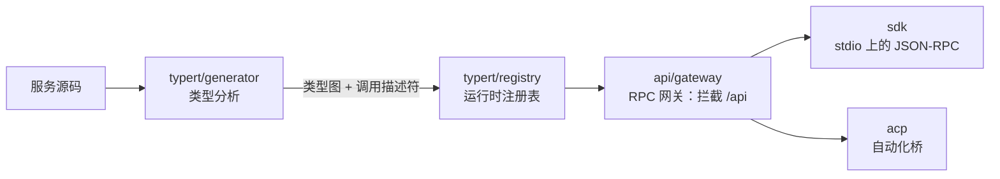
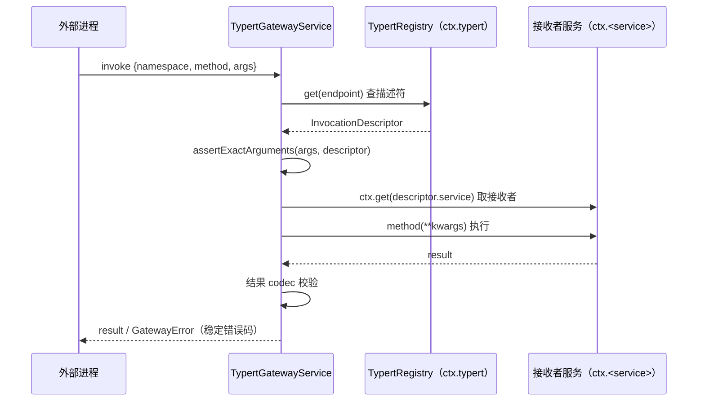

# 第 16 章 typert / api / sdk：跨进程类型化 RPC 运行时

> 过界的只有契约，不是对象；类型编译成图，调用按图校验。

## 本章回答的问题

- 第 5 章的 capability seam 解决了进程内复用——进程外的消费者（CLI、Web、自动化脚本）怎么调用宿主进程里的能力？
- 一个方法的类型契约（收什么参数、返回什么），怎么跨进程、并在边界上被校验？
- 新增一个导出方法，为什么不用手写路由、序列化器和客户端桩？
- `typert`、`api`（网关）、`sdk`、`acp` 在这条链路里各管什么？

第 15 章结尾预告过：下一站是 typert，看装配好的服务如何被安全地取值与调用。本章把这句话往前推一步——不只是进程内安全取值，而是**跨进程安全调用**。

本章依赖第 1、5 章：第 1 章的 `Context` / `Service`（本章教学代码继续经 `sys.path` 复用 `ch01/code/cordis.py`）；第 5 章的 capability seam 三角色——**提供者、实现者、消费者**（详见第 5 章）。seam 解决了「一个能力如何在进程内被定义、实现、消费」，本章把「消费」这一角色延伸到进程外。下文调用描述符里的 `service` 字段，正是第 5 章 Service Definition 里那个 `ctx.<key>`。

本章新增 `ch16/code/` 五个文件：`typert.py`（类型图 + 注册表）、`gateway.py`（RPC 网关）、`sdk.py`（JSON-RPC SDK）、`main.py`（可运行入口）、`bad_example.py`（反例）。

## 1. 能力在进程里，调用方在进程外

harness 宿主进程里装配好了一批服务：执行 shell、管理会话、调用模型。可这些能力的消费者往往不在进程里——CLI 工具、Web 后端、自动化脚本都想调 `shellExecutor.run`。没有专门机制时，最直觉的做法是手写一座桥（`ch16/code/bad_example.py`，可运行）：

```python
class ShellHost:
    """宿主进程里的一个服务（业务方）。"""

    def run(self, request):
        return {"exitCode": 0, "stdout": f"[stub] 执行: {request['command']}"}


def hand_written_bridge(host, endpoint, payload):
    """手写转发：一个方法一个分支，没有任何校验 —— 契约只在作者脑子里。"""
    if endpoint == "/api/shell/run":
        return host.run(payload)   # payload 原样当 request：形状错了要到业务代码才炸
    raise KeyError(endpoint)       # 新增方法必须同步在这里加分支
```

运行 `python3 bad_example.py` 输出：

```text
== 反例：手写跨进程桥接的三个痛 ==
痛 1：拼错参数名不被边界拦下，业务代码深处才炸 -> KeyError('command')
痛 2：非 JSON 值不被边界拦下，序列化时才炸 -> TypeError: Object of type function is not JSON serializable
痛 3：新增方法没同步到桥接，调用时才发现 -> KeyError('/api/shell/start')
```

三个痛：**契约只在作者脑子里**——方法收什么参数只有作者知道，拼错参数名不被边界拦下，要到业务代码深处才炸（`KeyError('command')`）；**没有边界校验**——不可 JSON 序列化的值（比如一个函数）能混进参数，直到要序列化传输时才炸；**手写转发一对一**——新增方法必须同步在桥上加一条分支，忘了就调用时才发现。

三个痛的根源相同：**方法的类型契约没有变成数据**。契约（参数名、类型、结果形状）若能被编译成可序列化、可查询的结构，边界就能照着它校验，路由也不用手写。这正是本章机制链要做的事。

## 2. 整体地图

**先看整体再拆解**：本章四个源模块连成一条链——



图中：生成器把服务契约编译成**类型图**并注册进注册表；网关对照注册表校验并派发每一次跨进程调用；SDK 与 ACP 是网关能力通向进程外的两种传输形态。下面按 `typert → 网关 → SDK → ACP` 逐一拆解，各概念在首次出现的小节给出定义。

## 3. typert 类型图：把契约编译成载体无关的模型

### 3.1 类型图是什么

**typert** 是负责「运行时类型 + 对象服务」的源模块，核心产物是**类型图**：类型分析产出的、与载体无关的中间模型，由 `TypeGraph`（图整体，`packages/typert/generator/src/model.ts:430`）与 `TypeNodeModel`（图中节点，`model.ts:350`，共 18 个 variant：primitive/object/union/literal 等）构成。

为什么不直接用源语言的类型？因为源语言类型只活在编译期与进程内：跨不了进程、运行时查不到、边界没法校验。类型图把类型从源码里抽出来、固化成**数据**——是数据，就能被注册、传输、校验。这是问题 1 的第一步消解：契约从作者脑子里搬进可查询的表。

负责这一步的是生成器 `WorkspaceTypertGenerator`（`packages/typert/generator/src/workspace.ts:20`）：`discover` 发现源文件（:33）、`generate` 做类型分析（:46）、`validateExport` 校验 `./typert` / `./remote` 导出（:68）。加载器侧由 typert-loader 插件扫描 `./typert` 导出（`TYPERT_HOST_EXPORT = './typert'`，`packages/typert/loader/src/index.ts:39`）、校验 manifest（`validateTypertManifest`，`index.ts:83`），并要求严格 codec（`requireStrictCodec`，`index.ts:264`）。

**双面编译**：同一份方法契约会编译出两面——宿主面产出**调用描述**（宿主方法怎么被调用），客户端面产出 Remote 描述（`TypertClientRemote`，`packages/typert/protocol/src/types.ts:221`，用 `$mount` 为客户端挂载宿主侧契约）；远端结果统一包在 `RemoteResult<T>`（`types.ts:60`）里。本章聚焦宿主面；客户端面是它的镜像，§6 的 SDK 就是一个具体的客户端。

### 3.2 InvocationDescriptor：一次调用的载体无关描述

类型图输出的最小单元是 **InvocationDescriptor（调用描述符）**：一个被导出方法的载体无关描述。源码摘录如下（TS，`packages/typert/protocol/src/types.ts:172-211`；`readonly` 表示字段只读，`kind: 'direct'` 这类是 TS 的字面量类型，意为「该字段只能取这个字符串」）：

```ts
export interface InvocationDescriptor {
  readonly id: string                 // 全局稳定生成标识
  readonly service: string            // 拥有该方法的 Cordis service key
  readonly namespace: string          // wire 命名空间，默认等于 service key
  readonly method: string             // 公共实例方法名
  readonly implementation?: string    // 导出方法名是别名时的实际成员
  readonly invocation:
    | { readonly kind: 'direct' }
    | { readonly kind: 'context'; readonly context: string; readonly wire: string; readonly codec: TypertCodec }
  readonly scope?: { readonly context: string; readonly wire: string }  // 一个直接 lookup 参数
  readonly parameters: readonly InvocationParameterDescriptor[]
  readonly cancellation?: { readonly parameter: 'signal' }              // 传输取消
  readonly result: TypertCodec
  readonly sourceLocation?: InvocationSourceLocation
}
```

逐字段读：`service` 是拥有该方法的 Cordis service key（对应第 5 章 Service Definition 的 `ctx.<key>`）；`namespace` 是 wire 命名空间，默认等于 service key——**wire**：两个进程之间的序列化传输线，上面只走 JSON 文本，不走活对象；`method` 是公共实例方法名；`parameters` 是参数描述符序列；`result` 是结果的编解码策略；`invocation` 区分直接调用与 context 调用。参数的 `lookup` 标记表示该参数是**宿主对象**——活在宿主进程里的活实例（如一个会话对象），无法序列化；wire 上只传它的**身份字段**（一个代表它的字符串），网关调用前再换回对象（§5.4）。

两种 key 容易混淆，一并定义：**typertKey** 是 schema 的标识，形如 `<pkg>#<name>`（`typertKey`，`packages/typert/registry/src/service.ts:48`）；**typertEndpoint** 是可调用端点的标识，形如 `<namespace>/<method>`（`typertEndpoint`，`service.ts:67`）。前者回答「什么类型」，后者回答「调用谁」。

教学版把描述符建模为两个 frozen dataclass，保留真实 11 个字段中的 6 个（`ch16/code/typert.py`）：

```python
# ---------- 调用描述符：一条导出方法的载体无关描述 ----------

@dataclass(frozen=True)
class InvocationParameterDescriptor:
    """导出方法的单个参数：名字 + 指向类型图的 schema + 是否为宿主对象。"""

    name: str
    schema: str                 # 指向类型图里的类型节点（<pkg>#<name> 形式）
    lookup: str | None = None   # None = 普通 JSON 参数；否则是 lookup 种类（如 "agent"）：
                                # wire 上只传身份字段，网关调用前换回宿主对象


@dataclass(frozen=True)
class InvocationDescriptor:
    """一条被导出的 RPC 方法的载体无关描述 ↔ InvocationDescriptor（types.ts:172-211）。

    [教学简化] 真实字段还有 implementation / invocation / scope / cancellation /
    sourceLocation；教学版保留 id / service / namespace / method / parameters / result。
    """

    id: str                    # 全局稳定生成标识
    service: str               # 拥有该方法的 Cordis service key（对应第 5 章 Service Definition 的 ctx.<key>）
    namespace: str             # wire 命名空间，默认等于 service key
    method: str                # 公共实例方法名
    parameters: tuple          # InvocationParameterDescriptor 序列
    result: str                # 结果 codec：CODEC_STRICT / CODEC_SRC_JSON
```

[教学简化] 未保留字段见上方 docstring 所列。编解码策略对应 `TypertCodec`（`types.ts:139`），教学版定义为两个常量：

```python
# 编解码策略 ↔ TypertCodec（types.ts:139）
CODEC_STRICT = "strict"        # 严格：按 schema 校验（真实用 Zod v4，loader/src/index.ts:264）
CODEC_SRC_JSON = "src-json"    # 弱解析：只做 JSON 安全校验，用于无生成器场景
```

### 3.3 生成器：从服务类到类型图

真实生成器靠编译器分析 TS 源码；教学版用 `inspect` 反射 Python 签名，并把类属性 `typert_exports` 当作「./typert 导出声明」——对应 `validateExport` 的导出校验（`workspace.ts:68`）。`generate_contribution` 的入口与导出校验（`ch16/code/typert.py`，模块级函数）：

```python
def generate_contribution(cls, package, namespace=None):
    """教学版生成器：反射类的导出方法，产出类型图 + 调用描述符。

    ↔ WorkspaceTypertGenerator：discover（workspace.ts:33）→ generate（:46）→
    validateExport（:68，校验 ./typert / ./remote 导出）。
    [教学简化] 教学版用 inspect 反射 Python 签名，并把类属性 typert_exports
    当作「./typert 导出声明」：没声明就拒绝生成，对应真实 validateExport 的校验。
    返回 (contribution, graph)：前者提交给注册表，后者供观察类型图形状。
    """
    exports = getattr(cls, "typert_exports", None)
    if not exports:
        raise TypertError(f"{cls.__name__} 未声明 ./typert 导出（缺 typert_exports）")
```

导出校验之后，逐个方法反射签名：每个参数按注解推一个 `TypeNode`（lookup 参数记为宿主对象），组装出描述符，最后连同类型图一起返回（完整代码在 `typert.py`）：

```python
        invocations.append(InvocationDescriptor(
            id=typert_key(package, f"{cls.__name__}.{method_name}"),
            service=service_key, namespace=namespace, method=method_name,
            parameters=tuple(params), result=CODEC_STRICT,
        ))
    return TypertContribution(package, dict(graph.declarations), invocations), graph
```

返回值里的 `TypertContribution` 即**贡献（contribution）**：一个包一次性提交给注册表的全部内容（包记录 + schemas + 描述符）。生产端这样写（消费端是 §4 的注册表与 §5 的网关）。`ch16/code/main.py` 里的 `ShellExecutorStub` 呼应第 5 章 capability seam 的 shellExecutor：

```python
class ShellExecutorStub(Service):
    """第 5 章 capability seam 里 shellExecutor 的教学 stub。

    [教学决策] 不 import 第 5 章代码；shell seam 的词汇类型
    （ShellExecRequest / ShellRunResult）用普通 dict 表示，保持本章自包含。
    """

    service_key = "shellExecutor"
    typert_exports = ("run",)  # ./typert 导出声明：哪些方法要跨进程

    def __init__(self, ctx):
        super().__init__(ctx, self.service_key)

    def run(self, request: dict) -> dict:
        return {"exitCode": 0, "stdout": f"[stub] 执行: {request['command']}"}
```

运行 `main.py` 段 1，生成器的产出（完整输出见 §8）：

```text
== 段 1：生成器 —— 把服务契约编译成类型图 ==
类型图节点数: 1，命名声明数: 1
调用描述符: id=demo-shell#ShellExecutorStub.run
  service=shellExecutor endpoint=shellExecutor/run
  参数=[('request', 'demo-shell#ShellExecutorStub.run.request')] 结果 codec=strict
```

`request` 参数被编译成类型图节点，schema 以 typertKey 形式（`demo-shell#ShellExecutorStub.run.request`）指向它；端点是 typertEndpoint 形式（`shellExecutor/run`）。[教学简化] 真实 `TypeNodeModel` 有 18 个 variant；教学版 `TypeNode` 的 variant 只取 `primitive` / `object`，用 `detail` 细分。

类型图解决了问题 1 的前一半：契约变成数据、可以跨进程。但数据不会自己生效——运行时谁持有这些描述符？插件卸载时怎么保证「要么全注册、要么全不注册」？这就是注册表。

## 4. TypertRegistry：运行时注册表

### 4.1 注册表持有什么

**TypertRegistry（运行时注册表）**：类型图的运行时持有者，是一个 Cordis 服务（`@typert service typert`，`packages/typert/registry/src/service.ts:446`）。它持有：`packages`（包记录）、`schemas`（typertKey → 类型节点）、local/remote 两套 `DescriptorStore`（`service.ts:107`，endpoint → 描述符）；描述符校验另有 `validateInvocation`（`service.ts:638`）。旁边还有 `RemoteStore`（`service.ts:182`）、`LookupStore`（`service.ts:216`）、`ContextStore`（`service.ts:336`）。[教学简化] 教学版只保留 local 一套，lookup 移到 §5.4 讲。

### 4.2 原子注册：effect 内提交，disposer 回滚

注册的关键设计是**原子性**：一条贡献要么整体可见、要么整体不可见——注册到一半，网关可能拿到描述符却查不到它的 schema。真实实现把提交放进 Cordis 的 effect（第 1 章：立即执行、可登记清理函数的副作用），并 yield 清理函数（`register`，`service.ts:499`）：

```ts
register(contribution: TypertContribution): TypertDisposer {
  const packageRecord = this.validatePackage(contribution)
  const schemaRecords = this.validateSchemas(contribution)
  const invocations = contribution.invocations
  this.localStore.validate(invocations)
  const owner = {}
  const { schemas, packages, localStore } = this
  return this.ctx.effect(function* () {
    packages.set(packageRecord.key, packageRecord)
    for (const record of schemaRecords) schemas.set(record.key, record)
    localStore.commit(owner, invocations)
    yield () => { /* 撤销本 contribution 的全部记录 */ }
  })
}
```

（TS：`this.ctx.effect(function* () {...})` 注册一个立即执行的 effect；生成器 `yield` 出的清理函数就是 disposer，卸载时调用。）三道校验——包记录、schemas、local 描述符——全部通过后才进 effect 提交。教学版同构复刻（`ch16/code/typert.py`，`TypertRegistry.register`，校验部分）：

```python
    def register(self, contribution):
        """原子注册一个 generated contribution ↔ register（service.ts:499）。

        先做三道校验（对应 validatePackage / validateSchemas / localStore.validate），
        全部通过后才进 ctx.effect 提交：一次性写入 packages / schemas / local，
        并返回 disposer——调用它即撤销本 contribution 的全部记录
        （对应真实 effect 里 yield 的清理函数）。
        """
        if contribution.package in self.packages:
            raise TypertError(f"包已注册: {contribution.package}")
        for descriptor in contribution.invocations:
            endpoint = typert_endpoint(descriptor.namespace, descriptor.method)
            if endpoint in self._local:
                raise TypertError(f"endpoint 已被占用: {endpoint}")
            for param in descriptor.parameters:
                if param.schema not in contribution.schemas:
                    raise TypertError(f"缺少 schema: {param.schema}")
```

校验通过后进入 `commit`：三张表一次性写入，并返回 **disposer**（第 1 章：effect 的清理函数，调用即撤销本次注册）：

```python
        def commit():
            # 走到这里说明校验全过：三张表一次性写入，不出现「写了一半」
            self.packages[contribution.package] = {
                "schemas": len(contribution.schemas),
                "invocations": len(contribution.invocations),
            }
            for key, node in contribution.schemas.items():
                self.schemas[key] = node
            for descriptor in contribution.invocations:
                endpoint = typert_endpoint(descriptor.namespace, descriptor.method)
                self._local[endpoint] = descriptor
                self._seen.add(endpoint)
```

`commit` 返回的 `dispose` 逐表撤销本贡献的记录；最后一行 `return self.ctx.effect(commit, ...)` 把 commit 登记为 effect，并把 disposer 交给调用方。`main.py` 段 2 验证「注册—重复拒绝—dispose 回滚—重新注册」（完整输出见 §8）：

```text
== 段 2：注册表 —— 原子注册与回滚 ==
在册 endpoint: ['sessionService/summarize', 'shellExecutor/run']
重复注册被拒: TypertError: 包已注册: demo-shell
dispose 后 shellExecutor/run -> None
hasSeen 仍记得: True
重新注册后: ['sessionService/summarize', 'shellExecutor/run']
```

注意 `hasSeen 仍记得: True`：dispose 后描述符从 local 移除，但「曾经注册过」的事实保留在 `has_seen` 里——§5.1 的认领判断会消费它。

### 4.3 依赖倒置的注册表契约

注册表还有一个值得点名的设计：**依赖倒置的注册表契约**。网关这类消费者不 `import` typert 包，只依赖一份契约接口——`TypertRegistryContract` 把能力分成四段：`local`（本地描述符）、`remotes`（远端对象）、`lookups`（宿主对象查找）、`contexts`（context 调用），`packages/typert/protocol/src/types.ts:479-491`；再用 TS 的 `declare module` 扩展把契约挂到 cordis 的 `ctx` 上（`types.ts:487-491`）：

```ts
export interface TypertRegistryContract {
  readonly local: TypertLocalRegistry
  readonly remotes: TypertRemoteRegistry
  readonly lookups: TypertLookupRegistry
  readonly contexts: TypertContextRegistry
}

declare module '@deepseek-ai/cordis' {
  interface Context { typert: TypertRegistryContract }
}
```

（TS：`declare module '@deepseek-ai/cordis'` 意为「给 cordis 包的 `Context` 类型声明扩展，补一个指向注册表契约的 `typert` 字段」。）这意味着任何服务都能经 `ctx.typert` 读注册表，而谁也不必依赖 typert 包的实现——与第 5 章 seam「消费者只依赖契约」的精神一致。教学版网关只消费 `local` 段（`get` / `has_seen`），lookup 段由网关自己持有（§5.4）。

注册表解决了问题 1 的后一半：契约有了运行时持有者，注册原子、可回滚。但契约仍是死数据——调用真正跨进程时，谁来对照描述符校验参数？谁把身份字段换回宿主对象？这就是网关。

## 5. RPC 网关：一次 invoke

### 5.1 拦截 /api

**RPC 网关**：`api/gateway` 包的 `TypertGatewayService`（`packages/api/gateway/src/index.ts:90`），带 `static inject = ['typert']`——注入的正是 §4.3 的注册表契约。构造时它在 `connection.rpc` 上拦截全部 `/api` 端点（`index.ts:104-111`）：

```ts
constructor(ctx: Context) {
  super(ctx, 'typertGateway')
  ctx.on('internal/service', () => { this.srcClaims = undefined })
  ctx.inject(['connection'], (connectionCtx) => {
    connectionCtx.connection.rpc.intercept(
      '/api',
      endpoint => this.claimsEndpoint(endpoint),
      (endpoint, payload, signal) => this.dispatchRpc(endpoint, payload, signal),
      { authority: 'trusted-host' },
    )
  })
}
```

（TS：箭头函数即匿名函数；`intercept(prefix, claim, dispatch, options)` 登记一个拦截器。）两个细节：`authority: 'trusted-host'` 把拦截权限标记为「可信宿主侧」；`claim` 决定是否认领、`dispatch` 决定如何处理——`claimsEndpoint` 就是 claim 的实现：先查描述符在不在注册表、或 `hasSeen`（§4.2 留的钩子），都不在才退回 SRC 弱解析（§5.3）；`dispatchRpc` 则是 dispatch 的实现，即 §5.2 的 `invoke`。教学版 `RpcConnection`（`gateway.py`）复刻的正是这两步：先 `claim` 后派发，无人认领的端点直接以 `invocation-unavailable` 拒绝。网关自己也以契约形式暴露给消费者（`TypertGateway` 接口，`packages/api/gateway/src/types.ts:39`；`declare module` 挂 `ctx.typertGateway`，`types.ts:49-53`）。

### 5.2 invoke 五步

网关的派发就是一次 `invoke`（`index.ts:145`），五步：解析描述符（`resolveDescriptor`，:224）→ 校验参数（`assertExactArguments`，:586）→ 取接收者（`resolveReceiverContext`，:359）→ 执行 → 校验结果 codec。时序如下（strict 路径主干；SRC 分支见 §5.3，lookup 分支见 §5.4）：



教学版 `invoke`（`ch16/code/gateway.py`，`TypertGatewayService` 方法）：

```python
    def invoke(self, request):
        """↔ invoke（index.ts:145）：解析描述符 → 校验参数 → 取接收者 → 执行 → 校验结果。

        五步全部通过才返回业务结果；任一步失败都抛带稳定错误码的 GatewayError。
        """
        endpoint = typert_endpoint(request["namespace"], request["method"])
        descriptor = self._resolve_descriptor(endpoint)
        if descriptor is None:
            raise GatewayError("definition-unavailable", f"解析不到 {endpoint} 的描述符")
        self._assert_exact_arguments(request.get("args", {}), descriptor)
        receiver = self._resolve_receiver(descriptor)
        kwargs = {}
        for param in descriptor.parameters:
            kwargs[param.name] = self._resolve_parameter(param, request["args"])
        result = getattr(receiver, descriptor.method)(**kwargs)
        # 结果 codec 校验：教学版 strict / src-json 统一为 JSON 安全检查
        self._assert_json_value(result, "结果", code="result-invalid")
        return result
```

`main.py` 段 3 走一遍 strict 路径（完整输出见 §8）：

```text
== 段 3：网关 strict 路径 —— 一次 /api 调用 ==
调用 /api/shellExecutor/run -> {'exitCode': 0, 'stdout': '[stub] 执行: ls -l'}
拼错参数名被边界拦下 -> arguments-invalid: 期望参数 ['request']，实际 ['reqeust']
多传参数被边界拦下 -> arguments-invalid: 期望参数 ['request']，实际 ['request', 'verbose']
网关错误码表共 17 个（见 GATEWAY_ERROR_CODES）
```

拼错（`reqeust`）与多传（`verbose`）都被 `assertExactArguments`（`index.ts:586`）以 `arguments-invalid` 拦下。对照 §1 痛 1：同样的错误，手写桥接要到业务代码深处才炸出 `KeyError('command')`，这里在边界就被稳定错误码接住。这一步的另一半是 **JSON 安全边界**（`assertJsonValue`，`index.ts:640`；`decode`，`index.ts:614`）：只有可 JSON 序列化的值能上 wire，痛 2 就此消解。

### 5.3 两条描述符解析路径：strict 与 src-json

`invoke` 的第一步有两条路径，适用场景不同：

- **strict 路径**：查注册表 local（`resolveDescriptor`，`index.ts:224`）。描述符来自生成器，schema 齐全，结果按严格 codec 校验。段 3 的 `shellExecutor/run` 走的就是它：

```python
    result = connection.call("/api/shellExecutor/run", {"request": {"command": "ls -l"}})
```

- **SRC 弱解析路径**：注册表查不到时，走 `resolveSrcDescriptor`（`index.ts:237`）+ `srcDescriptor`（`index.ts:265`）：从 typertRemote 绑定找到对象，找带 `@Remote` 标记的方法，**现场反射参数名**拼出描述符（真实代码用 `Function.prototype.toString` 反射参数名——即读函数源码文本提取参数列表；教学版用 `inspect.signature`），结果 codec 降为 `src-json`（只做 JSON 安全校验）。路径名里的 src 即 source（源码侧）：描述符不是生成器预编译的，而是从源码侧绑定现场推导的。段 5 的调用：

```python
    result = connection.call("/api/diagnostics/ping", {"tag": "hello"})
```

运行段 5（完整输出见 §8）：

```text
== 段 5：SRC 弱解析 —— 无注册表，现场反射出描述符 ==
调用 /api/diagnostics/ping -> {'pong': 'hello'}
未标记方法被拒 -> method-unavailable: diagnostics/internal 未标记 @remote
```

`DiagnosticsBridge.internal` 没标 `@remote`（教学版标记函数 `remote` 给方法挂 `__typert_remote__` 属性——给函数挂属性是合法的 Python 用法），网关以 `method-unavailable` 拒绝：弱解析路径的导出边界同样严格。

### 5.4 lookup provider：身份字段换回宿主对象

`SessionService.summarize` 的 `agent` 参数是宿主对象——JSON 带不上它。网关的做法：wire 上只传身份字段，调用前由 `resolveParameter`（`index.ts:407`）经 **lookup provider**（`LookupStore`，`service.ts:216`）把身份换回宿主对象。真实接线例子：`createApiRemoteAgentResolver`（`packages/api/remotes/src/agent-lookup.ts:121`）用 `typert.lookups.configure('agent'/'session', ...)` 为网关注入 agent/session 身份解析。remotes 包还负责把宿主事件转发给远端：`API_REMOTE_FORWARDED_EVENTS`（`packages/api/remotes/src/index.ts:41`），共 11 个可转发事件（`remote-events.ts:17-29`）。

教学版分两步。登记（生产端，`main.py` 装配段）：

```python
    gateway.lookups.configure("agent", agent.identity, agent)
```

解析（网关 `_resolve_parameter`）：

```python
    def _resolve_parameter(self, param, args):
        """↔ resolveParameter（index.ts:407）：普通参数直传；lookup 参数把身份换回宿主对象。"""
        value = args[param.name]
        if param.lookup is not None:
            return self.lookups.resolve(param.lookup, value)
        return value
```

`main.py` 段 4（完整输出见 §8）：

```text
== 段 4：lookup provider —— 身份字段换回宿主对象 ==
wire 上只有身份: args = {'agent': 'agent-1', 'note': '写完第 16 章初稿'}
网关换回宿主对象后调用 -> {'agent': 'writer', 'summary': 'writer: 写完第 16 章初稿'}
未知身份 -> lookup-not-found: 身份 agent:agent-404 查不到宿主对象
```

`args` 里只有 `'agent-1'`（身份），业务方法拿到的却是 `name='writer'` 的宿主对象——这正是开篇题记的后半句：对象留在宿主进程，wire 上只走身份。

### 5.5 17 个稳定错误码

网关的一切失败都带**稳定错误码**，消费端按码分支、不必解析消息文本（`TypertGatewayErrorCode`，`packages/api/gateway/src/types.ts:19-36`），共 17 个：

```ts
export type TypertGatewayErrorCode =
  | 'ambiguous-endpoint' | 'arguments-invalid' | 'binding-invalid'
  | 'context-failed' | 'context-not-found' | 'context-unavailable'
  | 'definition-unavailable' | 'input-invalid' | 'invocation-unavailable'
  | 'lookup-failed' | 'lookup-not-found' | 'lookup-unavailable'
  | 'method-unavailable' | 'provider-mismatch' | 'result-invalid'
  | 'service-unavailable' | 'signature-invalid'
```

教学版在 `GATEWAY_ERROR_CODES`（`gateway.py`）逐条列出同样的 17 个码，`GatewayError` 拒绝未知码构造。段 3/4/5 的输出里，`arguments-invalid`、`lookup-not-found`、`method-unavailable` 已分别露面；失败统一由 `rpcFailure`（`index.ts:471`）包装成 `TypertGatewayFailure`。

网关解决了痛 2 与痛 3：参数校验对照描述符完成（不用手写校验），路由按端点认领（不用手写分支——新增方法只需多注册一条描述符）。但到目前为止，调用还是「进程内模拟」——怎么真正跨进程，让 CLI 或另一个进程调进来？这就是 SDK。

## 6. JSON-RPC SDK：把网关搬出进程（简述）

**JSON-RPC**：一种轻量远程调用协议——请求是带 `method` 与 `params` 的 JSON 对象，响应按 `id` 匹配回来。`sdk` 包用它把宿主能力暴露给子进程外的世界，传输层是 stdio 上的换行分隔 JSON-RPC 2.0（`JsonRpcLineTransport`，`packages/sdk/protocol/src/transport.ts:62`）：一行一个 JSON 对象，带 `id` 的是请求，没有 `id` 的是通知。`request` 方法（`transport.ts:121`）发请求并等待按 `id` 匹配的响应，支持 AbortSignal 中止；无 handler 返回 `-32601`，handler 失败返回 `-32603`。源码摘录（TS；`AbortSignal` 是「可中止信号」对象，`signal.aborted` 为真时请求立即被拒；`randomUUID()` 生成唯一请求 `id`，用来匹配响应）：

```ts
export class JsonRpcLineTransport implements JsonRpcTransportPeer {
  ...
  request(method: string, params: object, signal?: AbortSignal): Promise<unknown> {
    const id = `req_${randomUUID().replaceAll('-', '')}`
    const message = { jsonrpc: '2.0', id, method, params }
    return new Promise((resolve, reject) => {
      let detach = (): void => {}
      if (signal !== undefined) {
        if (signal.aborted) { reject(abortError(signal.reason)); return }
        const onAbort = (): void => { this.pending.delete(id); reject(abortError(signal.reason)) }
        // ...
      }
      // ...
    })
  }
}
```

教学版 `JsonRpcLineTransport`（`ch16/code/sdk.py`）用两个进程内对象模拟这对 stdio 管道，保留协议三要素：行帧、id 匹配、稳定错误码。接收侧的分发逻辑：

```python
    def send_line(self, line):
        """收到对端一行 JSON，按形状分发。

        无 method → 响应（按 id 放进 _pending）；
        有 method 有 id → 请求；有 method 无 id → 通知。
        """
        message = json.loads(line)
        if "method" not in message:
            self._pending[message["id"]] = message
        elif "id" in message:
            self._handle_request(message)
        else:
            handler = self._notification_handlers.get(message["method"])
            if handler is not None:
                handler(message.get("params", {}))
```

[教学简化] 真实传输是 stdio 异步 I/O 且 `request` 支持 AbortSignal；教学版是进程内同步调用，没有超时与中止。

协议两端各有一个主角。**服务端** `HarnessSdkJsonRpcServer`（`packages/sdk/server/src/server.ts:53`）是 Cordis 插件，暴露三个请求（`HarnessSdkRequestMap`，`packages/sdk/protocol/src/types.ts:101`）：`initialize`（`server.ts:111`，挂载 fallback adapter）、`session.prompt`（:132）、`shutdown`（:150，优雅退出），外加 4 个通知（`HarnessSdkNotificationMap`，`types.ts:93`）。**客户端** `HarnessClient`（`packages/sdk/client/src/client.ts:184`）`start()` 时 spawn 子进程（`client.ts:203`），`destroy()` 按 **销毁阶梯** 收尾：EOF → SIGTERM → SIGKILL——先关输入流等子进程自己退出，不退再发终止信号，还不退才强杀，一级比一级强硬。高层 API 是 `DeepSeekHarness`（`packages/sdk/client/src/api.ts:22`，懒启动子进程）与 `HarnessSession`（`api.ts:132`），`finalResponse`（`api.ts:236`）聚合最终响应。

`main.py` 段 6 把三者串起来（完整输出见 §8）：

```text
== 段 6：JSON-RPC SDK —— 行帧 + 三请求 + 通知 ==
session.prompt 收到的 chunk: ['echo: 跨进程调用', '（完成）']
finalResponse: echo: 跨进程调用（完成）
销毁阶梯: ['EOF']（优雅退出，未升级）
```

`start()` 内部自动完成 `initialize`；`session.prompt` 先收到流式 chunk 通知，再由 `finalResponse` 聚合；`shutdown` 后子进程优雅退出，销毁阶梯停在第一级 `EOF`，没有升级到 SIGTERM/SIGKILL。[教学决策] 教学版不 spawn 真实子进程，用进程内管道模拟；`SERVER_NOTIFICATIONS` 的四个名字是教学示意名（笔记未枚举真实通知名）。这条 JSON-RPC 协议线还会在第 17 章继续用：Python SDK 驱动同一条协议做运行时端到端（详见第 17 章）。

## 7. ACP：自动化桥（简述）

**ACP（Agent Client Protocol）**：编辑器/自动化工具与 agent 之间的通信协议。`acp` 包把 harness 的 agent 桥接成 ACP 服务端：`apply()`（`packages/acp/acp/src/index.ts:105`）挂载自动化 ACP server，`makeAgent`（:231）把 harness agent 包装成 ACP agent；`AgentSideConnection` 实现 ACP 侧的 `initialize` / `authenticate` / `newSession` / `prompt` / `cancel`。生命周期上，`quiesce`（:356）负责安静退出，continuable-subagent 场景下先等子 agent drain（排空在途工作）。协议与 harness 语义之间靠 codec 翻译：`turnEndToStopReason`（`packages/acp/acp/src/codec.ts:14`）把 turn 结束原因映射为 ACP stop reason，`acpPromptToText`（:43）与 `promptHasUnsupportedContent`（:64）处理 prompt 内容。教学版不实现 ACP——它与 SDK 是同层的另一种传输形态，机制要点（契约翻译 + 生命周期收尾）与 §6 同构。

## 8. 完整运行输出

本章完整代码在 `ch16/code/`，运行 `python3 ch16/code/main.py`（依赖第 1 章 `cordis.py`，各模块已自动把 `ch01` 加进 `sys.path`）。以下输出全部来自示例代码的 `print`（无框架日志、无第三方输出），逐行可溯源到 `main.py` 六个演示段：

```text
== 段 1：生成器 —— 把服务契约编译成类型图 ==
类型图节点数: 1，命名声明数: 1
调用描述符: id=demo-shell#ShellExecutorStub.run
  service=shellExecutor endpoint=shellExecutor/run
  参数=[('request', 'demo-shell#ShellExecutorStub.run.request')] 结果 codec=strict

== 段 2：注册表 —— 原子注册与回滚 ==
在册 endpoint: ['sessionService/summarize', 'shellExecutor/run']
重复注册被拒: TypertError: 包已注册: demo-shell
dispose 后 shellExecutor/run -> None
hasSeen 仍记得: True
重新注册后: ['sessionService/summarize', 'shellExecutor/run']

== 段 3：网关 strict 路径 —— 一次 /api 调用 ==
调用 /api/shellExecutor/run -> {'exitCode': 0, 'stdout': '[stub] 执行: ls -l'}
拼错参数名被边界拦下 -> arguments-invalid: 期望参数 ['request']，实际 ['reqeust']
多传参数被边界拦下 -> arguments-invalid: 期望参数 ['request']，实际 ['request', 'verbose']
网关错误码表共 17 个（见 GATEWAY_ERROR_CODES）

== 段 4：lookup provider —— 身份字段换回宿主对象 ==
wire 上只有身份: args = {'agent': 'agent-1', 'note': '写完第 16 章初稿'}
网关换回宿主对象后调用 -> {'agent': 'writer', 'summary': 'writer: 写完第 16 章初稿'}
未知身份 -> lookup-not-found: 身份 agent:agent-404 查不到宿主对象

== 段 5：SRC 弱解析 —— 无注册表，现场反射出描述符 ==
调用 /api/diagnostics/ping -> {'pong': 'hello'}
未标记方法被拒 -> method-unavailable: diagnostics/internal 未标记 @remote

== 段 6：JSON-RPC SDK —— 行帧 + 三请求 + 通知 ==
session.prompt 收到的 chunk: ['echo: 跨进程调用', '（完成）']
finalResponse: echo: 跨进程调用（完成）
销毁阶梯: ['EOF']（优雅退出，未升级）
```

对照开篇题记：段 3「拼错/多传参数被 `arguments-invalid` 在边界拦下」兑现了「类型编译成图，调用按图校验」；段 4「wire 上只有身份 `'agent-1'`，宿主对象从未过线」兑现了「跨进程传的是契约，不是对象」。

## 9. 源码对照

| 本章机制 | 对应源码位置 | 教学版差异概括 |
|------|------|------|
| 类型图与生成器 | `packages/typert/generator/src/model.ts:350/:430`（TypeNodeModel/TypeGraph）、`workspace.ts:20/:33/:46/:68`（生成器四步） | 教学版用 `inspect` 反射 Python 签名代替编译器分析；TypeNode 只保留 primitive/object 两类（真实 18 variant） |
| 调用描述符与 codec | `packages/typert/protocol/src/types.ts:172-211`（InvocationDescriptor）、`:139`（TypertCodec） | 教学版保留 11 个字段中的 6 个，不实现 implementation/invocation/cancellation 等 |
| 运行时注册表 | `packages/typert/registry/src/service.ts:446`（TypertRegistry）、`:499`（register）、`:48/:67`（两种 key） | 教学版只保留 local 一套 DescriptorStore，不实现 remote/RemoteStore/ContextStore |
| 注册表契约 | `packages/typert/protocol/src/types.ts:479-491`（TypertRegistryContract + declare module） | 教学版网关经 `ctx.typert` 消费同一契约形状（get/has_seen） |
| RPC 网关 | `packages/api/gateway/src/index.ts:90/:104-111/:145/:224/:237/:359/:407/:586/:640`、`types.ts:19-36`（17 错误码） | 教学版用进程内 `RpcConnection` 模拟 HTTP/JSON-RPC 拦截；SRC 反射用 `inspect.signature` 代替 `Function.prototype.toString` |
| lookup provider | `packages/typert/registry/src/service.ts:216`（LookupStore）、`packages/api/remotes/src/agent-lookup.ts:121`、`remote-events.ts:17-29`（11 个可转发事件） | 教学版 lookup 由网关持有，只实现 agent 一种身份 |
| JSON-RPC SDK | `packages/sdk/protocol/src/transport.ts:62/:121`、`types.ts:101/:93`、`server.ts:53`、`client.ts:184/:203`、`api.ts:22/:132/:236` | 教学版不 spawn 子进程，用进程内管道模拟 stdio；销毁阶梯只保留「对端已退出即停止升级」 |
| ACP 桥 | `packages/acp/acp/src/index.ts:105/:231/:356`、`codec.ts:14/:43/:64` | 教学版不实现，仅正文简述 |

## 10. 小结与预告

本章把第 5 章 seam 的「消费」角色延伸到了进程外：**typert** 把方法契约编译成载体无关的类型图（生成器 → InvocationDescriptor），**TypertRegistry** 以原子注册持有这些契约（effect 提交、disposer 回滚），**RPC 网关**对照契约校验并派发每一次 `/api` 调用（strict / src-json 两条路径、lookup 换回宿主对象、17 个稳定错误码），**SDK** 与 **ACP** 再把这套能力分别经 JSON-RPC stdio 与 Agent Client Protocol 送出进程。第 17 章将用 Python SDK 驱动同一条 JSON-RPC 协议，做运行时端到端的完整走线。

## 11. 附录：关键概念速查表

| 概念 | 一句话解释 | 依赖 |
|------|-----------|------|
| **类型图** | 类型分析产出的载体无关中间模型（TypeGraph + TypeNode） | —（底层） |
| **InvocationDescriptor** | 一个被导出方法的载体无关描述（service/namespace/method/parameters/result） | 类型图 |
| **typertKey / typertEndpoint** | schema 标识 `<pkg>#<name>` / 可调用端点 `<namespace>/<method>` | —（底层） |
| **TypertCodec** | 结果编解码策略：strict（按 schema 校验）/ src-json（只做 JSON 安全校验） | 类型图 |
| **TypertRegistry** | 类型图的运行时持有者，原子注册（effect 提交、disposer 回滚） | InvocationDescriptor |
| **注册表契约** | TypertRegistryContract：消费者只依赖契约接口，不依赖 typert 包 | TypertRegistry |
| **RPC 网关** | TypertGatewayService：拦截 /api，按描述符校验并派发调用 | 注册表契约 |
| **lookup provider** | 把 wire 上的身份字段换回宿主对象 | RPC 网关 |
| **JSON-RPC SDK** | stdio 上的换行分隔 JSON-RPC 2.0：行传输 + 三请求 + 销毁阶梯 | RPC 网关 |
| **ACP** | Agent Client Protocol 自动化桥：契约翻译 + 生命周期收尾 | RPC 网关 |

> 分层：底层为类型图与两种 key → 中层为描述符、codec、注册表与注册表契约 → 上层为网关及其两种传输形态（SDK / ACP）。Python 教学符号与源符号映射：`generate_contribution`↔`WorkspaceTypertGenerator.generate`、`TypertRegistry`↔`TypertRegistry`、`typert_key`/`typert_endpoint`↔`typertKey`/`typertEndpoint`、`TypertGatewayService`↔`TypertGatewayService`、`RpcConnection`↔`connection.rpc`、`LookupStore`↔`LookupStore`、`JsonRpcLineTransport`↔`JsonRpcLineTransport`、`HarnessClient`↔`HarnessClient`、`remote`↔`@Remote`。
