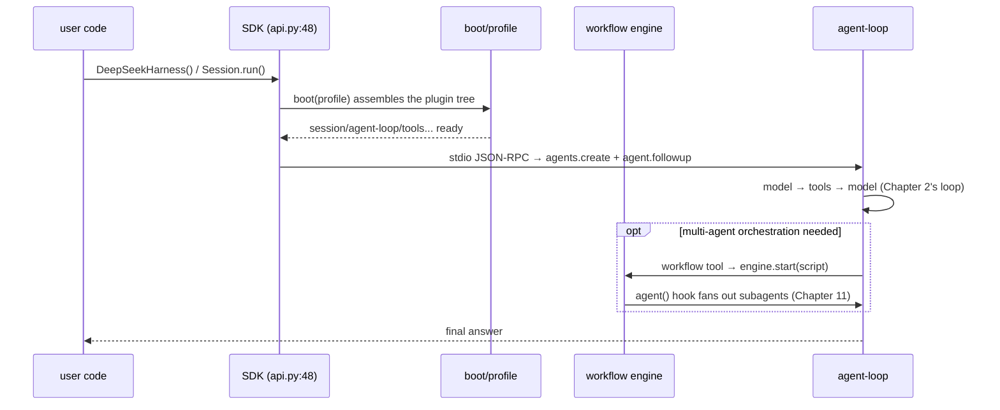

# Chapter 17: workflow / Ralph / python + apps-cli-web End-to-End

> The destination is not a stronger model, but a path that can be walked again.

## Questions This Chapter Answers

- Chapter 5 established the capability seam — so why is the workflow engine that orchestrates multiple agents also "just one seam"?
- Chapter 10 proved that compaction is lossy — so why does Ralph start a brand-new child agent every round?
- Chapter 16 gave us the high-level API `DeepSeekHarness` — so from constructing it to the model emitting its first token, which services does the request pass through?

In the previous 16 chapters we built this machine layer by layer: container, loop, session, tools, seam, execution world, model adaptation, prompt, scope, compaction, subagent, skill, Web/LSP, interaction and goal, preset/bundle/profile, typert RPC. This chapter is the final assembly: placing the two "multi-agent orchestration" pieces — the workflow engine and the Ralph loop — onto the kernel, then wiring the three startup surfaces, Python, CLI, and Web, onto the same plugin tree, and walking one end-to-end path from `import` / command line / browser all the way to the model's answer.

First, pin the previous 16 chapters to the wall with one table. This chapter will not expand them; it only back-links:

| Chapter | Mechanism | One line | How this chapter uses it |
|----|------|--------|-----------|
| 1 | cordis kernel | Context/Service/Fiber, construction registers | §4 the container assembled by the three surfaces |
| 2 | agent-loop | model → tools → model loop | §5 the execution core of the SDK surface |
| 3 | session persistence | persisting and restoring session state | §4 one of the base services |
| 4 | tools | tool registration and invocation protocol | §5 tool round trips |
| 5 | capability seam | capabilities injected via seams, not hardcoded | §2 workflow is a seam |
| 6 | execution world | boundary management of sync/async execution | §2 materializing script outputs out of the realm |
| 7 | LLM adaptation | unified access to multiple models | §5 FakeModel occupies the model slot |
| 8 | system-prompt | prompt assembly | §4 one of the base services |
| 9 | scope | scope isolation | Not expanded here (subagent fan-out depends on it implicitly) |
| 10 | compaction | context compaction | §3 the motivation for Ralph's fresh-every-round |
| 11 | subagent | subagent lifecycle | §2/§3 the receiver of fan-out |
| 12 | skill | skill-pack loading | Not expanded here (can be carried by a profile, see Chapter 15) |
| 13 | web/lsp | Web and language services | Not expanded here (Web surface = apps/web + packages/host) |
| 14 | interaction/goal | interaction and goal realm | §3 Ralph is independent of goal |
| 15 | preset/bundle/profile | three layers of assembly units | §4 profile decides the plugin list |
| 16 | typert/api/sdk | cross-process typed RPC | §5 the foundation of SDK communication |

```mermaid
flowchart TB
    subgraph SURFACES["three startup surfaces (§4/§5)"]
        PY["Python embedded<br/>dsh-sdk"]
        CLI["CLI<br/>apps/cli"]
        WEB["Web<br/>apps/web + packages/host"]
    end
    subgraph KERNEL["the same cordis plugin tree (Chapter 1)"]
        BOOT["boot + profile (Chapter 15)"]
        SEAM["session / agent-loop /<br/>system-prompt / tools"]
        WF["workflow engine seam (§2)"]
    end
    RALPH["Ralph fixed script (§3)"] --> WF
    WF -->|agent() hook| SUB["subagent (Chapter 11)"]
    PY --> BOOT
    CLI --> BOOT
    WEB --> BOOT
    BOOT --> SEAM
    SEAM --> WF
```

## 1. Without an Orchestration Layer, Glue Code Will Eat You Alive

Suppose you want multiple agents to collaborate on a task, and the same kernel must serve three kinds of users: scripts, command line, and web pages. Without a workflow engine and a shared boot, you can only hand-write:

```python
def orchestrate_manual(objective, workers):
    """The "orchestration" without a workflow engine: hand-written call order + hand-written error handling.

    Contrast with main.py segment 1: the real workflow engine folds failures into
    result.stopReason=error, and callers only inspect the result object; here exceptions
    are thrown straight out, every call site must wrap its own try/except, and there is
    no cancel/dispose/events to inspect.
    """
    plan = workers["planner"](f"decompose the objective: {objective}")
    code = workers["coder"](f"implement per [{plan}]: {objective}")
    # No materialize boundary: whatever dirty thing a worker returns flows downstream
    return {"plan": plan, "code": code}
```

And the three entry points each maintain their own startup list — drift is almost inevitable:

```python
PYTHON_SERVICES = ["session", "agent-loop", "system-prompt", "tools", "sdk-runtime"]
CLI_SERVICES = ["session", "agent-loop", "system-prompt", "tools", "terminal-ui"]
# In some iteration, someone forgot "system-prompt" in the web list — drift happens
WEB_SERVICES = ["session", "agent-loop", "tools", "server", "api-proxy"]
```

Actually running `python3 ch17/code/bad_example.py`:

```text
============================================================
Problem 1  manually orchestrating multiple agents
============================================================
  the exception blows straight up to the caller: subtask failed (simulated)
  -> no result object to collect into, no stopReason, no event trail,
     every call site must wrap its own try/except — this is the cost of missing the workflow seam.

============================================================
Problem 2  three entry points each write their own startup list
============================================================
  python-sdk: OK
         cli: OK
         web: missing ['system-prompt']
  -> the web list forgot system-prompt: three lists maintained separately will inevitably drift
  -> the right answer: one boot + profile (see main.py segment 3)
```

The two problems point to two mechanisms: a unified **orchestration seam** (§2), and one **shared startup assembly** (§4).

## 2. The workflow Engine: Script + agent() Hook

The positioning of the workflow engine is surprisingly restrained: it is an **abstract Service seam** — each context allows exactly one implementation, and the only abstract method is `start(request): WorkflowRun` (`packages/workflow/workflow/src/index.ts:157`, `:168`). It does not prescribe what a script looks like; it only prescribes the contract. The teaching version compresses this contract into about 130 lines:

```python
class WorkflowEngine:
    """The workflow engine seam, corresponding to the abstract WorkflowEngine Service (index.ts:157).

    Each context allows exactly one engine implementation (17a notes, "workflow seam").
    """

    def __init__(self, subagent_start):
        # subagent_start(prompt) -> result: corresponds to WorkerRun.startChild launching
        # a subagent via this.subagents.start(...) (host.ts:349, receiving from Chapter 11)
        self._subagent_start = subagent_start
        self.events = []  # workflow/* events (observe-only; listeners cannot get the live run)

    def start(self, request):
        """Corresponds to WorkerThreadWorkflowEngine.start() (index.ts:143): synchronous validation → execution.

        Violations throw synchronously; after validation passes, a run handle is returned,
        and execution results always go through run.result.
        """
        # Synchronous validation 1: meta must carry name/description (corresponds to validateMeta, meta.ts:76)
        meta = request.get("meta") or {}
        if not meta.get("name") or not meta.get("description"):
            raise ValueError("META_INVALID: meta.name / meta.description are required")
        # Synchronous validation 2: the script must be parseable (corresponds to assertBodyParses, index.ts:64)
        script = request.get("script")
        if not callable(script):
            raise ValueError("SCRIPT_PARSE: script must be callable")

        run = _WorkflowRun(self, script, meta, request.get("args") or {})
        self._emit("workflow/start", {"id": run.id, "meta": dict(meta)})
        run._drive()
        return run
```

The other half of the contract lives on the run handle: `WorkflowRun` (`runtime-types.ts:40`) promises **result never rejects**, and `cancel()`/`dispose()` are idempotent; `WorkflowResult` (`types.ts:72`)'s `stopReason` is a closed union: completed | cancelled | error. The teaching version's `_drive()` demonstrates "never rejects" for you:

```python
    def _drive(self):
        """Corresponds to the worker-side drive() (runtime.ts:162): never rejects.

        Whether the script throws or the final value cannot be materialized, everything is
        folded into a result object with stopReason=error, instead of throwing the exception
        to the caller — consumers only await result and then inspect stopReason.
        """
        agent = lambda prompt: self._engine._run_agent(self, prompt)  # noqa: E731
        try:
            value = self._script(agent, self._args)
            value = _materialize(value)  # corresponds to materializeFromRealm (realm.ts:66)
            self.result = {"value": value, "stopReason": STOP_COMPLETED,
                           "agentsStarted": self.agents_started}
        except Exception as e:  # every failure is collected into the result object
            self.result = {"value": None, "stopReason": STOP_ERROR, "error": str(e),
                           "agentsStarted": self.agents_started}
        finally:
            # workflow/end carries only id + stopReason, deliberately omitting the result value (17a notes §1)
            self._engine._emit("workflow/end",
                               {"id": self.id, "stopReason": self.result["stopReason"]})
```

[Teaching simplification] The real implementation `WorkerThreadWorkflowEngine` (`workflow-worker-thread/src/index.ts:112`) runs the script inside a worker thread + node:vm — the purpose is that synchronous scripts do not block the host event loop and can be forcibly terminated (note: not a security sandbox); the script's final value, when leaving the realm, is materialized into pure JSON by `materializeFromRealm` (`realm.ts:66`). The teaching version executes synchronously in the same process and simulates the materialization boundary with `json.dumps`.

Actually running `python3 ch17/code/main.py` segment 1 (full output in §7):

```text
Segment 1  workflow engine: script + agent() hook fanning out subagents
============================================================
result: {'value': {'plan': 'done(decompose the objective: implement weather...)', 'code': 'done(per [done(decompose the objective...)'}, 'stopReason': 'completed', 'agentsStarted': 2}
event trail (observe-only):
  workflow/start: {'id': 'run-1', 'meta': {'name': 'demo', 'description': 'two-step orchestration demo'}}
  workflow/agent-start: {'runId': 'run-1', 'prompt': 'decompose the objective: implement weather lookup'}
  workflow/agent-end: {'runId': 'run-1'}
  workflow/agent-start: {'runId': 'run-1', 'prompt': 'implement per [done(decompose the objective: implement weather...)]: implement weather lookup'}
  workflow/agent-end: {'runId': 'run-1'}
  workflow/end: {'id': 'run-1', 'stopReason': 'completed'}

-- the script returns an unserializable final value (set); watch how result collects it --
result.stopReason = error
result.error      = RESULT_UNSERIALIZABLE: Object of type se...
the caller received no exception — the failure was folded into the result object (result never rejects).
```

Note the event trail: workflow/* events have 6 types in total (`index.ts:94` defines start/phase/log/agent-start/agent-end/end); this example's trail shows 4 of them (no phase/log); events are **observe-only** — listeners cannot get the live run, they can only see events. Failures also do not travel through an exception channel inside events; they are collected into result.

**Source mapping** (all originals can be found in the 17a notes):

| Teaching symbol | Real source location |
|---------|-------------|
| `WorkflowEngine.start` | `workflow/src/index.ts:157`, `:168` |
| `WorkflowStartRequest` | `runtime-types.ts:19` |
| `WorkflowRun` contract | `runtime-types.ts:40` |
| `WorkflowResult` / stopReason | `types.ts:72` |
| synchronous validation (meta/script) | `meta.ts:76`, `index.ts:64` |
| `_drive` never rejects | `runtime.ts:162`, `host.ts:486` |
| agent() hook fan-out | `runtime.ts:250`, `host.ts:349` |
| materialization boundary | `realm.ts:66` |
| workflow/* events | `index.ts:94`, `:175` |

## 3. The Ralph Loop: A Fixed Script, a Fresh Child Agent Every Round

Ralph is not a new engine; it is one **fixed front-end workflow** on top of the workflow engine: hand the immutable objective, round after round, to a brand-new child agent, until it completes, gets blocked, or the round budget is exhausted. In the real implementation, `RALPH_SCRIPT` is a hard-coded script (`tool-ralph/src/index.ts:90`), and the ralph tool's `execute` (`:437`) merely calls `ctx.workflowEngine.start({script: RALPH_SCRIPT, ...})`. The teaching version compresses the skeleton into about 20 lines:

```python
def ralph_script(agent, args):
    """The skeleton of the RALPH_SCRIPT fixed script, corresponding to tool-ralph/src/index.ts:90.

    agent(prompt) starts a brand-new child agent every round (fresh provider,
    inheritsParentContext === false); the previous round's report is written into the prompt
    as previous — the only cross-round handoff.
    """
    objective = args["objective"]
    report = None
    for round_no in range(1, args["maxRounds"] + 1):
        previous = report
        prompt = f"objective: {objective}\n"
        if previous is None:
            prompt += "first round; there is no previous report."
        else:
            prompt += f"previous report: {previous['summary']}; todos: {previous.get('nextSteps', [])}"
        report = agent(prompt)
        _validate_report(report)  # in-script validation (corresponds to validateReport, 17a notes §3)
        if report["status"] == "complete":
            return {"outcome": "complete", "rounds": round_no, "report": report}
        if report["status"] == "blocked":
            return {"outcome": "blocked", "rounds": round_no, "report": report}
    # Round budget exhausted: corresponds to readRunResult's budget-limited final value (index.ts:283)
    return {"outcome": "budget-limited", "rounds": args["maxRounds"], "report": report}
```

Three design decisions are worth pausing on:

1. **A fresh child agent every round.** `requireFreshProvider` (`tool-ralph/src/index.ts:220`) requires the child-agent provider to have `inheritsParentContext === false`. Why? Back-link to Chapter 10: a long task's context bloats, and compaction is lossy; rather than letting one agent drag an ever-dirtier context to the finish line, start a clean one every round and hand over only the structured previous report.
2. **The previous report is the only cross-round handoff.** `RalphRoundReport` is a closed structure: `{status: continue|complete|blocked, summary, evidence[], nextSteps[], blocker}`, double-validated by the in-script validateReport and the consumer-side readReport (`:247`). Workspace files are the only long-term memory across rounds — the report is merely "an index for reading the workspace."
3. **Ralph adds no mode to agent-loop.** It is independent of Chapter 14's goal realm: goal governs "what the user wants"; Ralph governs "repeat one thing until it is done."

Actually running segment 2:

```text
Segment 2  Ralph loop: fixed script, a fresh child agent every round
============================================================
  [round 1] fresh child agent started -> status=continue (summary: skeleton in place, tests not passing)
  [round 2] fresh child agent started -> status=complete (summary: all tests pass)
final value: outcome=complete, took 2 rounds, stopReason=completed
the only cross-round handoff is the previous report — the workspace is the only long-term memory.
```

The final value is decoded by `readRunResult` (`tool-ralph/src/index.ts:283`) into four kinds: complete | blocked | budget-limited | round-failed. The teaching version demonstrates the complete kind; change round 2's report to continue and you can see budget-limited.

## 4. Three Startup Surfaces: One boot, Three profiles

Above the orchestration layer is the startup layer. In the real project, the three surfaces — Python embedded (dsh-sdk), CLI (apps/cli), Web (apps/web + packages/host) — **share the same boot library** (`boot()` in `packages/boot/app-boot/src/index.ts`); the difference lies only in the plugin list decided by the profile: the default list comes from `runtime/cordis.yml`, loading 8 ids in order: sdk-jsonrpc-server / agent-core / llm-deepseek / sessions / session-checkpoints / subprocess / bash / fs-local. The teaching version expresses it with one dict:

```python
# [Teaching decision] The base uses service names from earlier chapters for illustration;
# the real runtime/cordis.yml's 8 ids are in the module docstring
# (sdk-jsonrpc-server / agent-core / ...)
BASE_SERVICES = ["session", "agent-loop", "system-prompt", "tools"]

# The differentiated services each surface adds on top of the base
PROFILES = {
    "python-sdk": BASE_SERVICES + ["sdk-runtime"],          # the dsh-sdk embedded surface
    "cli": BASE_SERVICES + ["terminal-ui"],                 # the apps/cli surface
    "web": BASE_SERVICES + ["server", "api-proxy"],         # the apps/web + packages/host surface
}
```

```python
def boot(profile: str) -> Context:
    """Instantiate the plugin list per profile and return the assembled Context.

    Corresponds to the real `boot()` skeleton: parse config → instantiate in order → ready.
    [Teaching simplification] Omits the ready event and dispose ordering management.
    """
    if profile not in PROFILES:
        raise ValueError(f"unknown profile: {profile}")
    ctx = Context()
    for name in PROFILES[profile]:
        StubService(ctx, name)  # Service construction registers into ctx.<name>
    return ctx
```

Here we directly reuse Chapter 1's `Context`/`Service` (`ch01/code/cordis.py`): Service construction registers, and `booted_services()` enumerates via the service table. Actually running segment 3:

```text
Segment 3  three startup surfaces share the same boot
============================================================
python-sdk: ['session', 'agent-loop', 'system-prompt', 'tools', 'sdk-runtime']
       cli: ['session', 'agent-loop', 'system-prompt', 'tools', 'terminal-ui']
       web: ['session', 'agent-loop', 'system-prompt', 'tools', 'server', 'api-proxy']
common base: ['session', 'agent-loop', 'system-prompt', 'tools']
the three surfaces differ only in the services added after the base — the kernel is the same cordis plugin tree.
```

[Teaching decision] The base deliberately picks service names from earlier chapters (Chapter 3 session, Chapter 2 agent-loop, Chapter 8 system-prompt, Chapter 4 tools), so that "the same tree" is visible; the real `runtime/cordis.yml` uses a different set of ids (sdk-jsonrpc-server / agent-core etc., see above), but the structure of "one list, profile only appends" is the same. This is exactly the right answer to §1's Problem 2: there is only one list, and drift has nowhere to happen.

On the real chain, the convergence point of the three surfaces is `agents.create` + `agent.followup`: no matter which surface you come in from, you ultimately land on the same pair of operations.

## 5. End-to-End: Walking the Python Embedded Surface

We pick the Python embedded surface for the end-to-end demo because it is the thinnest: the `DeepSeekHarness` class (`python/sdk/src/deepseek_harness/api.py:48`) is the grand entry point; `Session.run()` (`api.py:132`) talks to the Node runtime (a single-file Node executable) over stdio JSON-RPC; `HarnessClient` (`client.py:37`) manages the connection — the typed foundation of this inter-process chain is exactly Chapter 16's typert/RPC gateway.

[Teaching simplification] The teaching version compresses "Python → stdio JSON-RPC → Node runtime → agent-loop" into same-process calls, but keeps Chapter 2 agent-loop's two-phase skeleton:

```python
def run(agent, user_input):
    """A mini Session.run(): run the "model → tools → model" loop until final text emerges.

    Corresponds to Chapter 2 agent-loop's skeleton:
    while True: response = model.generate(); if there is a tool_call, execute it and feed
    the result back; otherwise return the final text. [Teaching simplification] Omits
    stop_reason parsing and error retries.
    """
    agent["messages"].append({"role": "user", "content": user_input})
    while True:
        response = agent["model"].generate(agent["messages"])
        if response.get("tool_call"):
            name = response["tool_call"]["name"]
            args = response["tool_call"].get("args", {})
            tool = agent["tools"][name]
            result = tool(**args)
            agent["messages"].append({"role": "tool", "name": name, "content": result})
            continue
        agent["messages"].append({"role": "assistant", "content": response["text"]})
        return response["text"]
```

Actually running segment 4:

```text
Segment 4  Python embedded surface end-to-end: model → tools → model
============================================================
final answer: Beijing is sunny today, 25°C.
model call count: 2 (the 1st decides to call a tool, the 2nd wraps up)
message trail: ['user', 'tool', 'assistant']
```

Two details to explain: "model call count: 2" comes from `FakeModel`'s `calls` counter — `generate()` increments it once per call, and `main.py` prints it to make the two round trips visible; the message trail has only three entries because the teaching `run()` omits the assistant's intermediate tool_use message (in the real agent-loop, the model's decision to call a tool is itself recorded as one assistant message — see Chapter 2).

Stringing the four segments together, the complete path of one real request is:



## 6. Closing the Whole Book: One Startup Path + One Execution Loop

Looking back, all 17 chapters of this book actually tell only two things:

- **One startup path**: the profile (Chapter 15) decides the plugin list → boot assembles it in order into the cordis container (Chapter 1) → the three surfaces (this chapter) share this path.
- **One execution loop**: agent-loop (Chapter 2) turns inside the container; tools (Chapter 4), seams (Chapter 5), the execution world (Chapter 6), compaction (Chapter 10), subagent (Chapter 11), and workflow/Ralph (this chapter) are all mechanisms hung on this loop.

The remaining chapters support these two things: session/scope/compaction govern "memory and boundaries"; system-prompt/LLM adaptation govern "input and output"; typert/api/sdk govern "cross-process."

## 7. Complete Run Output

The complete actual run output of `python3 ch17/code/main.py` (segment 1 was already quoted in §2; here we start from segment 2 — for segment 1's output, §2 is authoritative):

```text
============================================================
Segment 2  Ralph loop: fixed script, a fresh child agent every round
============================================================
  [round 1] fresh child agent started -> status=continue (summary: skeleton in place, tests not passing)
  [round 2] fresh child agent started -> status=complete (summary: all tests pass)
final value: outcome=complete, took 2 rounds, stopReason=completed
the only cross-round handoff is the previous report — the workspace is the only long-term memory.

============================================================
Segment 3  three startup surfaces share the same boot
============================================================
python-sdk: ['session', 'agent-loop', 'system-prompt', 'tools', 'sdk-runtime']
       cli: ['session', 'agent-loop', 'system-prompt', 'tools', 'terminal-ui']
       web: ['session', 'agent-loop', 'system-prompt', 'tools', 'server', 'api-proxy']
common base: ['session', 'agent-loop', 'system-prompt', 'tools']
the three surfaces differ only in the services added after the base — the kernel is the same cordis plugin tree.

============================================================
Segment 4  Python embedded surface end-to-end: model → tools → model
============================================================
final answer: Beijing is sunny today, 25°C.
model call count: 2 (the 1st decides to call a tool, the 2nd wraps up)
message trail: ['user', 'tool', 'assistant']
```

## 8. Source Mapping Master Table

The provenance of every file:line reference in this chapter (17a = chapter-17a-notes.md, 17b = chapter-17b-notes.md):

| Mechanism | Real source location | Notes |
|------|-------------|------|
| WorkflowEngine abstract seam | `packages/workflow/workflow/src/index.ts:157`, `:168` | 17a |
| WorkflowStartRequest / WorkflowRun | `runtime-types.ts:19`, `:40` | 17a |
| WorkflowResult / stopReason | `types.ts:72` | 17a |
| WorkerThreadWorkflowEngine | `workflow-worker-thread/src/index.ts:112`, `:143` | 17a |
| synchronous validation validateMeta / assertBodyParses | `meta.ts:76`, `index.ts:64` | 17a |
| drive() never rejects / onResult | `runtime.ts:162`, `host.ts:486` | 17a |
| agent() hook / startChild | `runtime.ts:250`, `host.ts:349` | 17a |
| materializeFromRealm | `realm.ts:66` | 17a |
| workflow/* events | `index.ts:94`, `:175` | 17a |
| RALPH_SCRIPT / RALPH_META | `tool-ralph/src/index.ts:90`, `:80` | 17a |
| ralph tool apply / execute | `tool-ralph/src/index.ts:405`, `:437` | 17a |
| requireFreshProvider | `tool-ralph/src/index.ts:220` | 17a |
| readReport / readRunResult | `tool-ralph/src/index.ts:247`, `:283` | 17a |
| DeepSeekHarness / Session.run | `python/sdk/src/deepseek_harness/api.py:48`, `:132` | 17b |
| HarnessClient | `python/sdk/src/deepseek_harness/client.py:37` | 17b |
| boot() | `packages/boot/app-boot/src/index.ts` | 17b |
| composeProfile | `apps/cli/src/profile-boot.ts:142` | 17b |
| ApiProxyService | `packages/host/apiproxy/src/index.ts:69` | 17b |
| default plugin list | `runtime/cordis.yml` | 17b |

## 9. Summary

- The workflow engine is a **seam**: `start()` validates synchronously and then returns a run handle; result never rejects; stopReason is a closed union; events are observe-only. The script fans out subagents through the agent() hook.
- Ralph is a **fixed script** on top of the engine: a fresh child agent every round; the previous report is the only cross-round handoff; the workspace is the only long-term memory.
- The three startup surfaces share **one boot**; the profile only decides the appended plugin list; the convergence point is `agents.create` + `agent.followup`.
- The whole book closes into two things: one startup path, one execution loop.

## 10. Appendix: Key Concepts Cheat Sheet

| Concept | Teaching code | Real source | Key contract |
|------|---------|---------|---------|
| workflow seam | `workflow.py` `WorkflowEngine` | `workflow/src/index.ts:157` | one implementation per context |
| start() | `WorkflowEngine.start` | `index.ts:168` / worker `:143` | violations throw synchronously |
| run handle | `_WorkflowRun` | `runtime-types.ts:40` | result never rejects |
| stopReason | `STOP_*` constants | `types.ts:72` | completed/cancelled/error |
| agent() hook | `_run_agent` | `runtime.ts:250` | each call fans out one subagent |
| materialization boundary | `_materialize` | `realm.ts:66` | the final value must be pure JSON |
| Ralph script | `ralph.py` `ralph_script` | `tool-ralph/src/index.ts:90` | fixed; the model cannot rewrite it |
| round report | `_validate_report` | RalphRoundReport | continue/complete/blocked |
| fresh child agent | factory creates anew each time | `index.ts:220` | inheritsParentContext=false |
| boot | `boot.py` `boot()` | `boot/app-boot/src/index.ts` | profile → plugin list |
| three surfaces | `PROFILES` | dsh-sdk / apps/cli / apps/web | shared base; the difference is in the appends |
| SDK entry | `sdk.py` `run()` | `api.py:48`, `:132` | stdio JSON-RPC |

---

*This chapter's teaching code lives in `ch17/code/` (workflow.py 133 lines, ralph.py 77 lines, boot.py 73 lines, sdk.py 60 lines, main.py 147 lines, bad_example.py 71 lines, 561 lines in total); you can run `python3 ch17/code/main.py` and `python3 ch17/code/bad_example.py` directly.*
