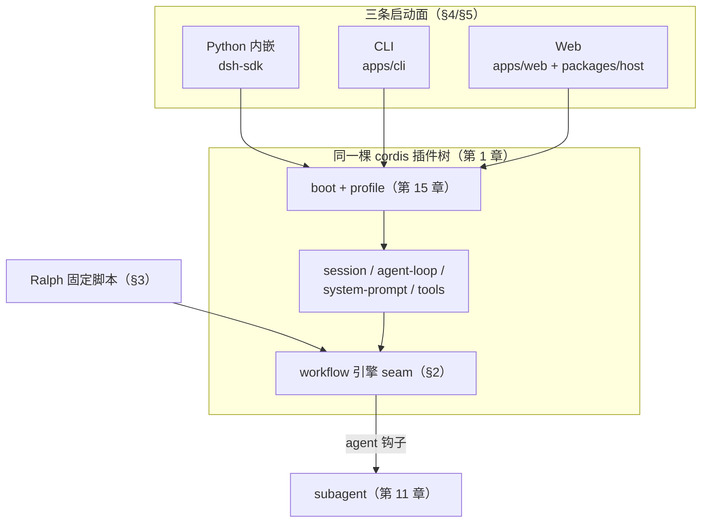
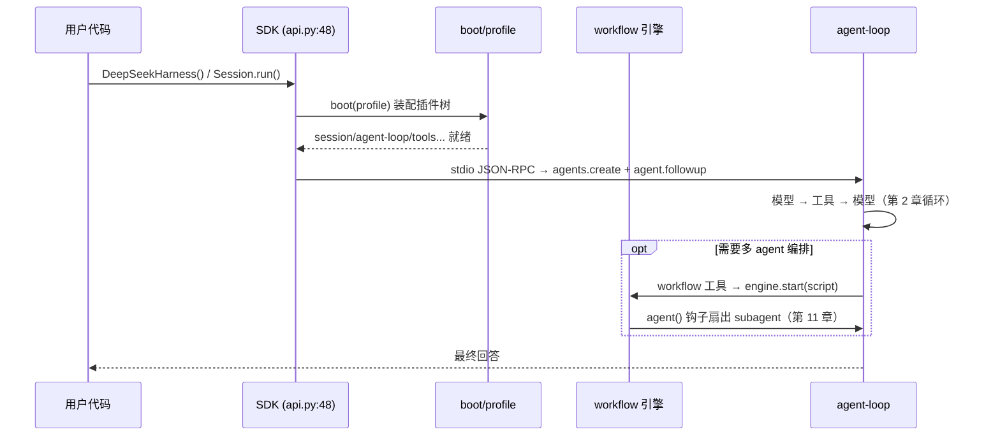

# 第 17 章 workflow / Ralph / python + apps-cli-web 端到端

> 终点不是更强的模型，而是一条可以重走的路。

## 本章回答的问题

- 第 5 章建立了 capability seam——那么，让多个 agent 协作的 workflow 引擎，为什么也只是「一个 seam」？
- 第 10 章证明了压缩是有损的——那么，Ralph 为什么每轮都开一个全新的子 agent？
- 第 16 章给出了高层 API `DeepSeekHarness`——那么，从它构造到模型吐出第一个字，请求穿过哪些服务？

前 16 章我们一层层搭起了这台机器：容器、循环、会话、工具、seam、执行世界、模型适配、提示词、作用域、压缩、子 agent、技能、Web/LSP、交互与 goal、preset/bundle/profile、typert RPC。本章是最后一次装配：把 workflow 引擎与 Ralph 循环这两块「多 agent 编排」拼图放上内核，再把 Python、CLI、Web 三条启动面接到同一棵插件树上，走完一条从 `import` / 命令行 / 浏览器到模型回答的端到端路径。

先用一张表把前 16 章钉在墙上。本章不再展开它们，只做回链：

| 章 | 机制 | 一句话 | 本章如何用 |
|----|------|--------|-----------|
| 1 | cordis 内核 | Context/Service/Fiber，构造即注册 | §4 三条表面装配的容器 |
| 2 | agent-loop | 模型→工具→模型循环 | §5 SDK 面的执行核心 |
| 3 | session 持久化 | 会话状态落盘与恢复 | §4 基座服务之一 |
| 4 | tools | 工具注册与调用协议 | §5 工具往返 |
| 5 | capability seam | 能力以 seam 注入而非硬编码 | §2 workflow 就是 seam |
| 6 | 执行世界 | 同步/异步执行的边界管理 | §2 脚本出 realm 实体化 |
| 7 | LLM 适配 | 多模型统一接入 | §5 以 FakeModel 占位模型槽 |
| 8 | system-prompt | 提示词组装 | §4 基座服务之一 |
| 9 | scope | 作用域隔离 | 本章不展开（子 agent 扇出隐含依赖） |
| 10 | compaction | 上下文压缩 | §3 Ralph 每轮全新的动机 |
| 11 | subagent | 子 agent 生命周期 | §2/§3 扇出的承接者 |
| 12 | skill | 技能包加载 | 本章不展开（可由 profile 携带，见第 15 章） |
| 13 | web/lsp | Web 与语言服务 | 本章不展开（Web 面 = apps/web + packages/host） |
| 14 | interaction/goal | 交互与目标领域 | §3 Ralph 与 goal 独立 |
| 15 | preset/bundle/profile | 装配单元三层 | §4 profile 决定插件清单 |
| 16 | typert/api/sdk | 跨进程类型化 RPC | §5 SDK 通信的底座 |



## 1. 没有编排层，胶水代码会吃掉你

假设你要让多个 agent 协作完成一个任务，并且同一套内核要服务脚本、命令行、
网页三种用户。没有 workflow 引擎和共享 boot，你只能手写：

```python
def orchestrate_manual(objective, workers):
    """没有 workflow 引擎时的「编排」：手写调用顺序 + 手写错误处理。

    对比 main.py 段 1：真实 workflow 引擎把失败折叠进
    result.stopReason=error，调用方只查结果对象；这里异常直接外抛，
    每个调用点都得自己包 try/except，也没有 cancel/dispose/事件可查。
    """
    plan = workers["planner"](f"拆解目标: {objective}")
    code = workers["coder"](f"按 [{plan}] 实现: {objective}")
    # 没有 materialize 边界：worker 返回什么脏东西都能流到下游
    return {"plan": plan, "code": code}
```

三条入口再各维护一份启动清单，漂移几乎是必然的：

```python
PYTHON_SERVICES = ["session", "agent-loop", "system-prompt", "tools", "sdk-runtime"]
CLI_SERVICES = ["session", "agent-loop", "system-prompt", "tools", "terminal-ui"]
# 某次迭代，有人在 web 清单里漏写了 "system-prompt" —— 漂移发生
WEB_SERVICES = ["session", "agent-loop", "tools", "server", "api-proxy"]
```

实跑 `python3 ch17/code/bad_example.py`：

```text
============================================================
问题 1  手工编排多 agent
============================================================
  异常直接炸给调用方: 子任务失败（模拟）
  -> 没有 result 对象收口，没有 stopReason，没有事件轨迹，
     每个调用点都得自己包 try/except——这就是缺 workflow seam 的代价。

============================================================
问题 2  三条入口各写一份启动清单
============================================================
  python-sdk: OK
         cli: OK
         web: 缺失 ['system-prompt']
  -> web 清单漏了 system-prompt：三份清单各自维护，必然漂移
  -> 正解：一份 boot + profile（见 main.py 段 3）
```

两个问题指向两个机制：一个统一的**编排 seam**（§2），和一份**共享的启动装配**
（§4）。

## 2. workflow 引擎：脚本 + agent() 钩子

workflow 引擎的定位出人意料地克制：它是一个**抽象 Service seam**，每个
context 只允许一个实现，唯一抽象方法是 `start(request): WorkflowRun`
（`packages/workflow/workflow/src/index.ts:157`、`:168`）。它不规定脚本长什么样，
只规定契约。教学版把这套契约压成约 130 行：

```python
class WorkflowEngine:
    """workflow 引擎 seam，对应抽象 WorkflowEngine Service（index.ts:157）。

    每个 context 只允许一个引擎实现（17a 笔记「workflow seam」）。
    """

    def __init__(self, subagent_start):
        # subagent_start(prompt) -> 结果：对应 WorkerRun.startChild 经
        # this.subagents.start(...) 启动子 agent（host.ts:349，承接第 11 章）
        self._subagent_start = subagent_start
        self.events = []  # workflow/* 事件（只观察，监听器拿不到 live run）

    def start(self, request):
        """对应 WorkerThreadWorkflowEngine.start()（index.ts:143）：同步校验 → 执行。

        违规同步 throw；校验通过后返回 run 句柄，执行结果一律走 run.result。
        """
        # 同步校验 1：meta 必须带 name/description（对应 validateMeta，meta.ts:76）
        meta = request.get("meta") or {}
        if not meta.get("name") or not meta.get("description"):
            raise ValueError("META_INVALID: meta.name / meta.description 必填")
        # 同步校验 2：脚本必须可解析（对应 assertBodyParses，index.ts:64）
        script = request.get("script")
        if not callable(script):
            raise ValueError("SCRIPT_PARSE: script 必须可调用")

        run = _WorkflowRun(self, script, meta, request.get("args") or {})
        self._emit("workflow/start", {"id": run.id, "meta": dict(meta)})
        run._drive()
        return run
```

契约的另一半在 run 句柄上：`WorkflowRun`（`runtime-types.ts:40`）承诺
**result 永不 reject**，`cancel()`/`dispose()` 幂等；`WorkflowResult`
（`types.ts:72`）的 `stopReason` 是封闭 union：completed | cancelled | error。
教学版的 `_drive()` 把「永不 reject」演给你看：

```python
    def _drive(self):
        """对应 worker 侧 drive()（runtime.ts:162）：永不 reject。

        脚本抛异常或终值不可实体化，都折叠成 stopReason=error 的结果对象，
        而不是把异常抛给调用方——消费方只需 await result 再查 stopReason。
        """
        agent = lambda prompt: self._engine._run_agent(self, prompt)  # noqa: E731
        try:
            value = self._script(agent, self._args)
            value = _materialize(value)  # 对应 materializeFromRealm（realm.ts:66）
            self.result = {"value": value, "stopReason": STOP_COMPLETED,
                           "agentsStarted": self.agents_started}
        except Exception as e:  # 一切失败都收口为结果对象
            self.result = {"value": None, "stopReason": STOP_ERROR, "error": str(e),
                           "agentsStarted": self.agents_started}
        finally:
            # workflow/end 只带 id + stopReason，刻意省略 result value（17a 笔记 §1）
            self._engine._emit("workflow/end",
                               {"id": self.id, "stopReason": self.result["stopReason"]})
```

[教学简化] 真实实装 `WorkerThreadWorkflowEngine`
（`workflow-worker-thread/src/index.ts:112`）把脚本放进 worker thread + node:vm
执行——目的是同步脚本不阻塞宿主事件循环且可强制终止（注意：不是安全沙箱）；
脚本终值出 realm 时经 `materializeFromRealm`（`realm.ts:66`）实体化为纯 JSON。
教学版在同进程同步执行，用 `json.dumps` 模拟实体化边界。

实跑 `python3 ch17/code/main.py` 段 1（完整输出见 §7）：

```text
段 1  workflow 引擎：脚本 + agent() 钩子扇出 subagent
============================================================
result: {'value': {'plan': '完成(拆解目标: 实现天气...)', 'code': '完成(按 [完成(拆解目标...)'}, 'stopReason': 'completed', 'agentsStarted': 2}
事件轨迹（只观察）:
  workflow/start: {'id': 'run-1', 'meta': {'name': 'demo', 'description': '两步编排演示'}}
  workflow/agent-start: {'runId': 'run-1', 'prompt': '拆解目标: 实现天气查询'}
  workflow/agent-end: {'runId': 'run-1'}
  workflow/agent-start: {'runId': 'run-1', 'prompt': '按 [完成(拆解目标: 实现天气...)] 实现: 实现天气查询'}
  workflow/agent-end: {'runId': 'run-1'}
  workflow/end: {'id': 'run-1', 'stopReason': 'completed'}

-- 脚本返回不可序列化的终值（set），看 result 如何收口 --
result.stopReason = error
result.error      = RESULT_UNSERIALIZABLE: Object of type se...
调用方没有接到异常——失败被折叠进结果对象（result 永不 reject）。
```

注意事件轨迹：workflow/* 事件共 6 种类型（`index.ts:94` 定义
start/phase/log/agent-start/agent-end/end），本例轨迹出现了其中 4 种
（没有 phase/log）；事件**只观察**——监听器拿不到 live run，只能看事件。
失败也不走事件里的异常通道，而是收口进 result。

**源码对照**（均可在 17a 笔记中找到原文）：

| 教学符号 | 真实源码位置 |
|---------|-------------|
| `WorkflowEngine.start` | `workflow/src/index.ts:157`、`:168` |
| `WorkflowStartRequest` | `runtime-types.ts:19` |
| `WorkflowRun` 契约 | `runtime-types.ts:40` |
| `WorkflowResult` / stopReason | `types.ts:72` |
| 同步校验（meta/script） | `meta.ts:76`、`index.ts:64` |
| `_drive` 永不 reject | `runtime.ts:162`、`host.ts:486` |
| agent() 钩子扇出 | `runtime.ts:250`、`host.ts:349` |
| 实体化边界 | `realm.ts:66` |
| workflow/* 事件 | `index.ts:94`、`:175` |

## 3. Ralph 循环：固定脚本，每轮全新子 agent

Ralph 不是新引擎，而是 workflow 引擎上的一个**固定前台工作流**：把不可变的
objective 依次交给全新子 agent，直到完成、被阻塞或轮数耗尽。真实实现里
`RALPH_SCRIPT` 是写死的脚本（`tool-ralph/src/index.ts:90`），ralph 工具的
`execute`（`:437`）只是调 `ctx.workflowEngine.start({script: RALPH_SCRIPT, ...})`。
教学版把骨架压成约 20 行：

```python
def ralph_script(agent, args):
    """RALPH_SCRIPT 固定脚本骨架，对应 tool-ralph/src/index.ts:90。

    agent(prompt) 每轮启动一个全新子 agent（fresh provider，
    inheritsParentContext === false）；上一轮 report 作为 previous 写进 prompt，
    是唯一的跨轮交接。
    """
    objective = args["objective"]
    report = None
    for round_no in range(1, args["maxRounds"] + 1):
        previous = report
        prompt = f"objective: {objective}\n"
        if previous is None:
            prompt += "首轮，没有上一轮报告。"
        else:
            prompt += f"上一轮报告: {previous['summary']}；待办: {previous.get('nextSteps', [])}"
        report = agent(prompt)
        _validate_report(report)  # 脚本内校验（对应 validateReport，17a 笔记 §3）
        if report["status"] == "complete":
            return {"outcome": "complete", "rounds": round_no, "report": report}
        if report["status"] == "blocked":
            return {"outcome": "blocked", "rounds": round_no, "report": report}
    # 轮数耗尽：对应 readRunResult 的 budget-limited 终值（index.ts:283）
    return {"outcome": "budget-limited", "rounds": args["maxRounds"], "report": report}
```

三个设计决策值得停下来看：

1. **每轮全新子 agent**。`requireFreshProvider`（`tool-ralph/src/index.ts:220`）
   要求子 agent 提供方 `inheritsParentContext === false`。为什么？回链第 10 章：
   长任务的上下文会膨胀，compaction 是有损的；与其让一个 agent 拖着越来越脏的
   上下文跑到底，不如每轮开一个干净的，只把结构化的上一轮报告递过去。
2. **previous 报告是唯一跨轮交接**。`RalphRoundReport` 是封闭结构：
   `{status: continue|complete|blocked, summary, evidence[], nextSteps[], blocker}`，
   脚本内 validateReport 与消费方 readReport（`:247`）双重校验。工作区文件才是
   唯一跨轮长期记忆——报告只是「读工作区的索引」。
3. **Ralph 不向 agent-loop 加模式**。它与第 14 章 goal 领域独立：goal 管
   「用户想要什么」，Ralph 管「把一件事重复做到完」。

实跑段 2：

```text
段 2  Ralph 循环：固定脚本，每轮全新子 agent
============================================================
  [第 1 轮] 全新子 agent 启动 -> status=continue（summary: 搭好骨架，测试未过）
  [第 2 轮] 全新子 agent 启动 -> status=complete（summary: 测试全过）
终值: outcome=complete，用了 2 轮，stopReason=completed
跨轮交接只有 previous 报告——工作区才是唯一长期记忆。
```

终值经 `readRunResult`（`tool-ralph/src/index.ts:283`）解码为四种：
complete | blocked | budget-limited | round-failed。教学版演示了 complete
这一种；把第 2 轮报告改成 continue 即可看到 budget-limited。

## 4. 三条启动面：一份 boot，三份 profile

编排层之上是启动层。真实项目里三条表面——Python 内嵌（dsh-sdk）、CLI
（apps/cli）、Web（apps/web + packages/host）——**共享同一个 boot 库**
（`packages/boot/app-boot/src/index.ts` 的 `boot()`），差异只在 profile 决定的
插件清单：默认清单来自 `runtime/cordis.yml`，依次装载 8 个 id：
sdk-jsonrpc-server / agent-core / llm-deepseek / sessions / session-checkpoints /
subprocess / bash / fs-local。教学版用一个字典表达：

```python
# [教学决策] 基座用前几章的服务名示意；真实 runtime/cordis.yml 的
# 8 个 id 见模块 docstring（sdk-jsonrpc-server / agent-core / ...）
BASE_SERVICES = ["session", "agent-loop", "system-prompt", "tools"]

# 每条表面在基座之上追加的差异化服务
PROFILES = {
    "python-sdk": BASE_SERVICES + ["sdk-runtime"],          # dsh-sdk 内嵌面
    "cli": BASE_SERVICES + ["terminal-ui"],                 # apps/cli 面
    "web": BASE_SERVICES + ["server", "api-proxy"],         # apps/web + packages/host 面
}
```

```python
def boot(profile: str) -> Context:
    """按 profile 实例化插件清单，返回装配好的 Context。

    对应真实 `boot()` 的骨架：解析配置 → 按序实例化 → ready。
    [教学简化] 省略 ready 事件与 dispose 顺序管理。
    """
    if profile not in PROFILES:
        raise ValueError(f"unknown profile: {profile}")
    ctx = Context()
    for name in PROFILES[profile]:
        StubService(ctx, name)  # Service 构造即注册到 ctx.<name>
    return ctx
```

这里直接复用了第 1 章的 `Context`/`Service`（`ch01/code/cordis.py`）：
Service 构造即注册，`booted_services()` 经服务表枚举。实跑段 3：

```text
段 3  三条启动面共享同一 boot
============================================================
python-sdk: ['session', 'agent-loop', 'system-prompt', 'tools', 'sdk-runtime']
       cli: ['session', 'agent-loop', 'system-prompt', 'tools', 'terminal-ui']
       web: ['session', 'agent-loop', 'system-prompt', 'tools', 'server', 'api-proxy']
公共基座: ['session', 'agent-loop', 'system-prompt', 'tools']
三条表面的差异只在基座之后的追加服务——内核是同一棵 cordis 插件树。
```

[教学决策] 基座刻意选前几章的服务名（第 3 章 session、第 2 章 agent-loop、
第 8 章 system-prompt、第 4 章 tools），让「同一棵树」看得见；真实
`runtime/cordis.yml` 用的是另一套 id（sdk-jsonrpc-server / agent-core 等，
见上），但「一份清单、profile 只追加」的结构相同。这正是 §1 问题 2 的正解：
清单只有一份，漂移无处发生。

真实链路上三条表面的收敛点是 `agents.create` + `agent.followup`：无论从哪个
表面进来，最终都落到同一对操作上。

## 5. 端到端：Python 内嵌面走一遍

选 Python 内嵌面做端到端演示，因为它最薄：`DeepSeekHarness` 类
（`python/sdk/src/deepseek_harness/api.py:48`）是总入口，`Session.run()`
（`api.py:132`）经 stdio JSON-RPC 与 Node runtime（单文件 Node 可执行）通信，
`HarnessClient`（`client.py:37`）管连接——这条进程间链路的类型化底座就是
第 16 章的 typert/RPC gateway。

[教学简化] 教学版把「Python → stdio JSON-RPC → Node runtime → agent-loop」
压成同进程调用，但保留第 2 章 agent-loop 的两段式骨架：

```python
def run(agent, user_input):
    """迷你版 Session.run()：跑完「模型 → 工具 → 模型」循环直到出最终文本。

    对应第 2 章 agent-loop 的骨架：
    while True: response = model.generate(); 有 tool_call 就执行并回填，
    否则返回最终文本。[教学简化] 省略 stop_reason 解析与错误重试。
    """
    agent["messages"].append({"role": "user", "content": user_input})
    while True:
        response = agent["model"].generate(agent["messages"])
        if response.get("tool_call"):
            name = response["tool_call"]["name"]
            args = response["tool_call"].get("args", {})
            tool = agent["tools"][name]
            result = tool(**args)
            agent["messages"].append({"role": "tool", "name": name, "content": result})
            continue
        agent["messages"].append({"role": "assistant", "content": response["text"]})
        return response["text"]
```

实跑段 4：

```text
段 4  Python 内嵌面端到端：模型 → 工具 → 模型
============================================================
最终回答: 北京今天晴，25°C。
模型调用次数: 2（第 1 次决定调工具，第 2 次收尾）
消息轨迹: ['user', 'tool', 'assistant']
```

两处细节说明：「模型调用次数: 2」来自 `FakeModel` 的 `calls` 计数器——
`generate()` 每被调用一次就加 1，`main.py` 打印它让两次往返可见；消息轨迹
只有三条，是因为教学版 `run()` 省略了 assistant 的 tool_use 中间消息（真实
agent-loop 里，模型决定调工具本身也会记一条 assistant 消息，见第 2 章）。

把四段串起来看，一次真实请求的完整路径是：



## 6. 全书收束：一条启动路径 + 一个执行循环

回头看，全书 17 章其实只讲了两件事：

- **一条启动路径**：profile（第 15 章）决定插件清单 → boot 按序装配进 cordis
  容器（第 1 章）→ 三条表面（本章）共享这条路径。
- **一个执行循环**：agent-loop（第 2 章）在容器里转，工具（第 4 章）、seam
  （第 5 章）、执行世界（第 6 章）、压缩（第 10 章）、subagent（第 11 章）、
  workflow/Ralph（本章）都是挂在这个循环上的机制。

其余章节是这两件事的支撑：session/scope/compaction 管「记忆与边界」，
system-prompt/LLM 适配管「输入输出」，typert/api/sdk 管「跨进程」。

## 7. 完整运行输出

`python3 ch17/code/main.py` 的完整实跑输出（段 1 已在 §2 引用，此处从段 2 起，
段 1 输出以 §2 为准）：

```text
============================================================
段 2  Ralph 循环：固定脚本，每轮全新子 agent
============================================================
  [第 1 轮] 全新子 agent 启动 -> status=continue（summary: 搭好骨架，测试未过）
  [第 2 轮] 全新子 agent 启动 -> status=complete（summary: 测试全过）
终值: outcome=complete，用了 2 轮，stopReason=completed
跨轮交接只有 previous 报告——工作区才是唯一长期记忆。

============================================================
段 3  三条启动面共享同一 boot
============================================================
python-sdk: ['session', 'agent-loop', 'system-prompt', 'tools', 'sdk-runtime']
       cli: ['session', 'agent-loop', 'system-prompt', 'tools', 'terminal-ui']
       web: ['session', 'agent-loop', 'system-prompt', 'tools', 'server', 'api-proxy']
公共基座: ['session', 'agent-loop', 'system-prompt', 'tools']
三条表面的差异只在基座之后的追加服务——内核是同一棵 cordis 插件树。

============================================================
段 4  Python 内嵌面端到端：模型 → 工具 → 模型
============================================================
最终回答: 北京今天晴，25°C。
模型调用次数: 2（第 1 次决定调工具，第 2 次收尾）
消息轨迹: ['user', 'tool', 'assistant']
```

## 8. 源码对照总表

本章全部 file:line 引用的出处（17a = chapter-17a-notes.md，17b = chapter-17b-notes.md）：

| 机制 | 真实源码位置 | 笔记 |
|------|-------------|------|
| WorkflowEngine 抽象 seam | `packages/workflow/workflow/src/index.ts:157`、`:168` | 17a |
| WorkflowStartRequest / WorkflowRun | `runtime-types.ts:19`、`:40` | 17a |
| WorkflowResult / stopReason | `types.ts:72` | 17a |
| WorkerThreadWorkflowEngine | `workflow-worker-thread/src/index.ts:112`、`:143` | 17a |
| 同步校验 validateMeta / assertBodyParses | `meta.ts:76`、`index.ts:64` | 17a |
| drive() 永不 reject / onResult | `runtime.ts:162`、`host.ts:486` | 17a |
| agent() 钩子 / startChild | `runtime.ts:250`、`host.ts:349` | 17a |
| materializeFromRealm | `realm.ts:66` | 17a |
| workflow/* 事件 | `index.ts:94`、`:175` | 17a |
| RALPH_SCRIPT / RALPH_META | `tool-ralph/src/index.ts:90`、`:80` | 17a |
| ralph 工具 apply / execute | `tool-ralph/src/index.ts:405`、`:437` | 17a |
| requireFreshProvider | `tool-ralph/src/index.ts:220` | 17a |
| readReport / readRunResult | `tool-ralph/src/index.ts:247`、`:283` | 17a |
| DeepSeekHarness / Session.run | `python/sdk/src/deepseek_harness/api.py:48`、`:132` | 17b |
| HarnessClient | `python/sdk/src/deepseek_harness/client.py:37` | 17b |
| boot() | `packages/boot/app-boot/src/index.ts` | 17b |
| composeProfile | `apps/cli/src/profile-boot.ts:142` | 17b |
| ApiProxyService | `packages/host/apiproxy/src/index.ts:69` | 17b |
| 默认插件清单 | `runtime/cordis.yml` | 17b |

## 9. 小结

- workflow 引擎是一个 **seam**：`start()` 同步校验后返回 run 句柄，result 永不
  reject，stopReason 封闭 union，事件只观察。脚本经 agent() 钩子扇出 subagent。
- Ralph 是引擎上的**固定脚本**：每轮全新子 agent，previous 报告是唯一跨轮交接，
  工作区是唯一长期记忆。
- 三条启动面共享**一份 boot**，profile 只决定追加的插件清单；收敛点是
  `agents.create` + `agent.followup`。
- 全书收束为两件事：一条启动路径，一个执行循环。

## 10. 附录：关键概念速查表

| 概念 | 教学代码 | 真实源码 | 关键契约 |
|------|---------|---------|---------|
| workflow seam | `workflow.py` `WorkflowEngine` | `workflow/src/index.ts:157` | 每 context 一个实现 |
| start() | `WorkflowEngine.start` | `index.ts:168` / worker `:143` | 违规同步 throw |
| run 句柄 | `_WorkflowRun` | `runtime-types.ts:40` | result 永不 reject |
| stopReason | `STOP_*` 常量 | `types.ts:72` | completed/cancelled/error |
| agent() 钩子 | `_run_agent` | `runtime.ts:250` | 每次扇出一个 subagent |
| 实体化边界 | `_materialize` | `realm.ts:66` | 终值必须纯 JSON |
| Ralph 脚本 | `ralph.py` `ralph_script` | `tool-ralph/src/index.ts:90` | 固定，不可由模型改写 |
| 轮报告 | `_validate_report` | RalphRoundReport | continue/complete/blocked |
| 全新子 agent | 工厂每次新建 | `index.ts:220` | inheritsParentContext=false |
| boot | `boot.py` `boot()` | `boot/app-boot/src/index.ts` | profile → 插件清单 |
| 三条表面 | `PROFILES` | dsh-sdk / apps/cli / apps/web | 共享基座，差异在追加 |
| SDK 入口 | `sdk.py` `run()` | `api.py:48`、`:132` | stdio JSON-RPC |

---

*本章教学代码位于 `ch17/code/`（workflow.py 133 行、ralph.py 77 行、
boot.py 73 行、sdk.py 60 行、main.py 147 行、bad_example.py 71 行，共 561 行），
可直接运行 `python3 ch17/code/main.py` 与 `python3 ch17/code/bad_example.py`。*
