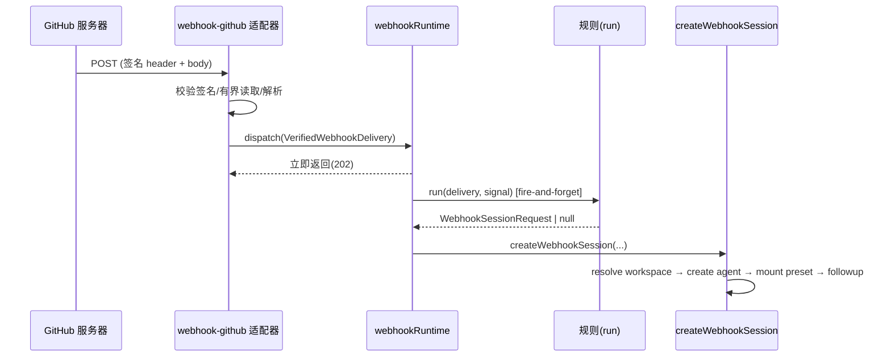

# 上游新机制候选勘探笔记（3 项）

> 产出角色：Explorer（Source Decomposition Expert Team）
> 目标仓库：/home/chenyu/deepseek-harness（HEAD=0a53fb55be）
> 对照大纲：/home/chenyu/learn-deepseek-harness/ch00/outline_zh.md（17 章递进图）
> 勘探方式：入口优先（README/.zh.md → index.ts 入口 → 符号级深入），不全文通读

---

## 候选 A：Agent Teams（隐式根团队域）

### A.0 结论（verdict）

**NEW chapter candidate** —— 一个与 ch11（subagent 委派）不同质的、自成闭环的「多主体协作持久域」机制簇：它在 subagent 的 transport 之上叠加了 Lead 日志投影出的 roster / mailbox / 任务 DAG 三套持久原语 + 一套 scoped 模型工具，足以撑起独立一章。
（⚠ 但它是 **experimental + private**，发布产物排除；是否成章取决于教程是否纳入「实验性扩展」卷。）

### A.1 核心概念清单

- **Implicit-root Team（隐式根团队）**：无需显式“创建团队”对象；每个顶层（root）Session 即是一个 Team，`TeamId` 就是 root `SessionId` 的品牌化（branded id）。
  - `TeamId` — `TeamId = Branded<'TeamId'>`，值等于 root SessionId（`packages/experimental/agent-team/src/types.ts:8,15`）
- **Lead / Teammate 与 roster（名册）**：Lead pseudo-row + 若干 teammate。teammate 是 Lead 派生的 **continuable 直接子 agent**（可续、有持久子 Session 身份）；`name` 是不可变模型/UI 标签，SessionId 是持久身份。
  - `TeamMembership`（`roster.ts:28`）、`TeamMemberPhase = 'provisioning' | 'active' | 'failed'`（`types.ts:44`）
- **Durable mailbox（持久邮箱）**：peer 消息先入 Lead 日志（`team/message/queued`），目标可持久化收录后写 `team/message/delivered` 回执；`queued − delivered` 即恢复用 mailbox。投递分 `quiet`（注入 inbox 不唤醒）/ `wakeup`（followup 启动轮次）。
- **Shared task DAG（共享任务有向无环图）**：`TeamTaskSnapshot` 全量快照 + `revision` 做 compare-and-set；`blockedBy` 维护无环依赖；`writeScopes` 是提示性路径前缀（非锁，仅用于重叠告警）。
- **Replay / fold（回放折叠）**：`foldTeam()` 概念 —— 用 `sessionProjections` 的 `agentTeam` 投影把 root Session 事件流增量折叠成 TeamState，按 `TeamId` 选取事件，普通 fork 继承的事件绝不进入新 root 状态。
- **Team-scoped 模型工具**：`spawn_teammate` / `list_agents` / `send_message` / `followup_task` / `wait_agent` / `interrupt_agent` / `team_task_*`，仅注册在“Team 成员”的 exact agent scope 内（区别于 ch11 的一次性 subagent 工具）。

### A.2 关键符号与位置

- `TeamService` — 门面服务，注册为 `ctx.agentTeams`，继承 `TypertRemoteService`：
  - 位置：`packages/experimental/agent-team/src/index.ts:59`
  - `static inject = ['agents','sessions','sessionPersistence','sessionProjections','subagents']`（`index.ts:60`）——证实它叠加在已有 session/subagent 服务之上
  - 默认限额：`DEFAULT_MAX_MEMBERS=8`（`:44`），`DEFAULT_MAX_TASKS=256`（`:45`），`DEFAULT_MAX_PENDING_MESSAGES=64`（`:46`），`DEFAULT_MAX_MESSAGE_BYTES=65536`（`:47`）
  - 构造时订阅事件：`ctx.on('session/event', …)` → mailbox 观察（`:110`）；`ctx.on('agent/session-start', …)` → 调度恢复（`:111`）；`ctx.on('agent/status', …)` → activity 通知（`:112`）；`ctx.effect(() => ctx.root.sessionProjections.register(teamProjectionDefinition))`（`:117`）
- 子组件（全部在 `packages/experimental/agent-team/src/` 内，一个包、一条主线）：
  - `TeamRoster`（`roster.ts:57`）：`tryMembership()`（`:91`，判定 lead/teammate/非成员的核心分支）、`spawn()`/`spawnAdmitted()`（`:167`/`:245`，provisioning→active/failed 生命周期 + 冲突处理）、`interrupt()`（`:203`）、`liveChildrenByRoot()`（`:220`）、`stopTeammates()`（`:240`）
  - `TeamJournal`（`journal.ts:12`）：`transact()`（`:42`，按 LeadId 串行化写事务）、`appendAndFlush()`（`:60`，append 团队事件并 flush 后才发布）
  - `TeamMailbox`（`mailbox.ts:24`）：`send()`→`sendAdmitted()`（`:53`/`:109`）、`observeSessionEvent()`（`:67`，目标侧回执观察）、`tryDispatch`/`serializeDispatch`/`dispatchOnce`（`:155`/`:200`/`:227`）、`checkpointDelivered`/`markDelivered`（`:280`/`:292`）
  - `TeamTaskBoard`（`task-board.ts:32`）：`create()`（`:48`）、`update()`（`:109`，一个 `switch` 覆盖 8 种 CAS action）、`taskView()`（`:271`，派生 ownerName/ready/writeScopeWarnings）
  - `TeamActivity`（`activity.ts:11`）：一次性静态 waiter 集（`wait`/`notify`/`close`），独立于持久投影
  - `TeamRuntimeLifecycle`（`lifecycle.ts:6`）：单一 AbortController 作为 runtime 准入截止 + 有界结算（`withTimeout`/`settle`）
  - `teamProjectionDefinition`（`projection.ts:308`）：`key:'agentTeam'`, `stateVersion:2`, `apply` 逐事件校验（member 只允许 provisioning→active/failed、task revision 必须连续、消息先 queue 后 deliver 等）
  - `assertTaskGraphCandidate`（`task-graph.ts:26`）：缺依赖/重复/自环/成环 校验；`messageAccepted`（`session-message.ts:25`）：折叠 inbox + history 判断消息是否已收录
- 类型/事件声明合并（对接点核心）：
  - `SessionEventMap` 新增 4 类 Team 事件（`types.ts:220-236`）：`team/member`、`team/task`、`team/message/queued`、`team/message/delivered` —— 这就是「Lead 日志即团队状态」的实现支点
  - `MessageSourceMap['team-message']`（`types.ts:124-128`）；`SessionProjectionStateMap['agentTeam']`（`projection.ts:158-162`）
- 模型工具层：`packages/experimental/tool-agent-team/src/index.ts`
  - `install()`（`:159`）：把 `team:policy` prompt section + 全部 Team 工具注册进**单个 agent 的 scope**（`scoped.systemPrompt.section` / `scoped.tools.register`）
  - `apply()`（`:398`）：`maybeInstall` 对 `ctx.agents.list()` 与 `agent/created` 事件按 `tryMembership` 门控安装；`agent/disposed` 卸载
  - `POLICY` 常量（`:31`）：模型可见协作策略（共享工作目录、write-scope 是建议非锁、CAS 冲突重试等）
- profile 组合层：`packages/experimental/agent-team-profile/cordis.patch.yml`
  - 禁掉 `tool-subagent-control`/`tool-subagent-list-agents`/`tool-subagent-report`，把 `tool-subagent`/`tool-subagent-fork` 设为 `one-shot`，再 `insert` `agent-team` 与 `tool-agent-team` 两行（`:5-41`）
  - `agent-team-profile/src/index.ts` 是空模块入口，patch 即运行时内容；`agent-team-web-profile/` 同理（Web 侧侧写变体）

### A.3 调用链 / 数据流

```
spawn_teammate 工具(tool-agent-team)
  → ctx.agentTeams.spawnTeammate (TeamService, index.ts:153)
    → TeamRoster.spawn → spawnAdmitted (roster.ts:245)
       1) 校验 lead-only + 名/限额
       2) journal.transact { team/member(provisioning) append+flush }  (roster.ts:268)
       3) ctx.subagents.startContinuable({childId,provider,prompt,parent:root})  ← 复用 ch11 subagent transport
       4) checkpointInitialPrompt：确认初始 prompt 被 durable 收录
       5) settleProvisioning → team/member(active|failed)
→ 事件 append 后 ctx.on('session/event') → sessionProjections 折叠 teamProjectionDefinition
   → journal.state(root) 读 TeamState（roster/tasks/messages/delivered）

send_message / followup_task 工具
  → TeamService.sendMessage → TeamMailbox.send → sendAdmitted (mailbox.ts:109)
       journal.transact{ team/message/queued } → tryDispatch → dispatchOnce
         quiet  → target.inject(createUserMessage(source.kind='team-message'))    ← 不唤醒
         wakeup → 若 target 存活 subagents.followup(root, target, content,{source})  ← 启动轮次
       → 目标侧 observeSessionEvent 见 team-message → markDelivered{ team/message/delivered }

team_task_update 工具
  → TeamService.updateTask → TeamTaskBoard.update (task-board.ts:109)
       journal.transact{ 校验 revision==expectedRevision (CAS) → switch(action) → 新 snapshot revision+1
                        → assertTaskGraphCandidate → team/task append }
```

建议 Mermaid（供 Writer）：

```mermaid
flowchart LR
  subgraph 模型可见
    T[tool-agent-team: spawn/send/list/wait/task_*]
  end
  T -->|scope 内| S[TeamService ctx.agentTeams]
  S --> R[TeamRoster]
  S --> M[TeamMailbox]
  S --> B[TeamTaskBoard]
  S --> A[TeamActivity]
  R & M & B -->|appendAndFlush| J[TeamJournal.transact 串行]
  J -->|session.append| E[(Lead Session 事件流)]
  A2[ctx.on session/event] --> E
  E --> P[teamProjectionDefinition 折叠]
  P -->|state(root)| R & M & B
  R -->|startContinuable/followup| SUB[ctx.subagents ch11]
```

### A.4 真实源码片段（摘录，注明位置）

```ts
// packages/experimental/agent-team/src/index.ts:59-62
/** Agent Teams service backed by the exact live Lead Session log. */
export class TeamService extends TypertRemoteService {
  static inject = ['agents', 'sessions', 'sessionPersistence', 'sessionProjections', 'subagents']
```

```ts
// packages/experimental/agent-team/src/roster.ts:91-121 （身份判定核心分支）
  tryMembership(agent: Agent): TeamMembership | undefined {
    if (this.ctx.agents.get(agent.id) !== agent) return undefined
    try {
      const parentId = agent.session.header.parentSession
      if (parentId !== undefined) {
        const root = this.ctx.agents.get(parentId)
        if (root !== undefined) {
          const member = this.journal.state(root).members.find(candidate => candidate.id === agent.id)
          if (member?.phase === 'active' || member?.phase === 'provisioning') {
            return { root, id: TeamId(root.id), role: 'teammate', name: member.name }
          }
          if (this.subagentDescriptor(agent)) return undefined
          return { root: agent, id: TeamId(agent.id), role: 'lead', name: 'lead' }
        }
      }
      if (this.subagentDescriptor(agent)) return undefined
      return { root: agent, id: TeamId(agent.id), role: 'lead', name: 'lead' }
    } catch { return undefined }
  }
```

```ts
// packages/experimental/agent-team/src/journal.ts:42-52 （按 Lead 串行化写事务）
  async transact<T>(rootId: SessionId, operation: () => Promise<T>): Promise<T> {
    const prior = this.tails.get(rootId) ?? Promise.resolve()
    const run = prior.then(operation, operation)
    const tail = run.then(() => undefined, () => undefined)
    this.tails.set(rootId, tail)
    try { return await run }
    finally { if (this.tails.get(rootId) === tail) this.tails.delete(rootId) }
  }
```

```ts
// packages/experimental/agent-team/src/types.ts:220-236 （Lead 日志即团队状态的 4 类事件）
declare module '@deepseek-ai/dsh-session/types' {
  interface SessionEventMap {
    'team/member': { version: 1; teamId: TeamId; member: TeamMemberSnapshot }
    'team/task': { version: 1; teamId: TeamId; task: TeamTaskSnapshot }
    'team/message/queued': { version: 1; teamId: TeamId; message: TeamMessageSnapshot }
    'team/message/delivered': { version: 1; teamId: TeamId; messageId: TeamMessageId; targetId: SessionId }
  }
}
```

```ts
// packages/experimental/agent-team/src/task-board.ts:119-124 （CAS 前置条件）
      if (current.revision !== request.expectedRevision) {
        throw new TeamError(
          `stale team task "${current.id}" revision ${request.expectedRevision}; current revision is ${current.revision}`,
          'TEAM_TASK_STALE_REVISION',
        )
      }
```

```yaml
# packages/experimental/agent-team-profile/cordis.patch.yml:5-24
- id: tool-subagent-control
  disabled: true
- id: tool-subagent-list-agents
  disabled: true
- id: tool-subagent-report
  disabled: true
- id: tool-subagent
  config: { provider: spawn, toolName: subagent, backgroundMode: one-shot }
- id: tool-subagent-fork
  config: { provider: fork, toolName: subagent_fork, backgroundMode: one-shot }
- insert:
    - id: agent-team
      name: '@deepseek-ai/dsh-experimental-agent-team'
      config: { maxMembers: 8, maxTasks: 256, ... }
    - id: tool-agent-team
      name: '@deepseek-ai/dsh-experimental-tool-agent-team'
      config: { freshProvider: spawn, forkProvider: fork }
```

### A.5 行为语义（供 Python 重构）

- **TeamService**：输入=单片装配的 Cordis Context；对外暴露一套以 `Agent`（exact live 凭据）为第一参数的成员操作；依赖 5 个既有服务。输出=TeamMembership/成员视图/任务视图/投递结果。
  - 状态迁移：`provisioning → active|failed`（成员，一次性终态，运行时 running/idle 另算不重写记录）；`pending → in_progress → completed/released`（任务，`revision` 每次 +1，`deleted` 是 tombstone）。
  - 边界：lead-only 才能 spawn/interrupt/reassign；名唯一且 lower-kebab-case（`roster.ts:25,451`）；消息不可自投递（`TEAM_SELF_MESSAGE`）；限额触发 `TEAM_MEMBER_LIMIT`/`TEAM_TASK_LIMIT`/`TEAM_MAILBOX_FULL`。
  - 意外行为：provisioning 冲突（creator 报失败但对方已 active → `TEAM_PROVISIONING_CONFLICT`）；恢复（`recoverFor`）从持久子 Session 重放判定 active/failed；disposal 时 `disposeRuntime` 停掉所有 Team 活分支。
- **符号映射建议（源 → Python 教学名）**：
  - `TeamService` → `TeamService`；`TeamRoster` → `TeamRoster`；`TeamMailbox` → `Mailbox`；`TeamTaskBoard` → `TaskBoard`；`TeamJournal.transact` → `transact`（tail-promise 串行器）；`teamProjectionDefinition` → `TeamProjection`（fold + apply）；`TeamMembership.role:'lead'|'teammate'` → `LEAD/TEAMMATE`；`team/message/queued|delivered` → `queued/delivered` 两张表；`revision` CAS → `expected_revision` 乐观锁；`writeScopes` → `write_scopes`（建议性、重叠告警）。

### A.6 衔接点

- **承接延伸基础章**：ch11（subagent 委派：`ctx.subagents.startContinuable` / `followup` 就是 Team 的 transport 底座）；ch3（session 事件流 + `sessionProjections` 投影，Team 状态正是被折叠的投影）；ch9（per-agent scope 注册，Team 工具装在 exact agent scope）；ch15（preset/bundle/profile —— `agent-team-profile` 用 `cordis.patch.yml` 叠层组合）。
- **为后一章铺垫**：若成章，可为「bundle patch 如何替换工具行（one-shot vs continuable）」与「TypertRemoteService 的 @Remote 方法（remoteView etc.）」铺垫。
- **判定理由（一句话）**：机制密度与自洽度（Lead-log 投影三原语 + CAS 任务 DAG + scoped 工具 + profile 组合）独立于 ch11 的一次性委派，是“多主体持久协作”这一新概念，而非 ch11/15 的增量。

---

## 候选 B：Webhook（fire-and-forget 规则运行时 + GitHub 适配器）

### B.0 结论（verdict）

**NEW chapter candidate** —— 「外部事件驱动的 Session 创建」是一个此前 17 章完全未覆盖的新机制簇：它把“已验证外部交付 → 可信规则 → 一次性 root Session”链路一手建立，且 seam 三角色清晰（runtime 定义 + 提供方适配器实现 `VerifiedWebhookDelivery` + 规则消费）。体量中等（~840 行源码 + GitHub 适配器），独立成章规模合适。

### B.1 核心概念清单

- **Fire-and-forget 分发（投后即忘）**：`dispatch()` 快照匹配规则、彼此独立调度、在任何回调结算前返回；runtime 不保留队列/重试/去重/执行状态——重复交付可能产生重复 Session（文档明确）
- **提供方适配器 / 规则 / runtime 三角色**：
  - 适配器拥有鉴权 + 通用无损 JSON 接收（如 GitHub 签名校验）
  - 受信任的程序化规则拥有“条件 + 外部调用”，`run(delivery, signal) → WebhookSessionRequest | null`
  - `ctx.webhookRuntime` 拥有回调生命周期 + 基于 Workspace 的 Session 创建
- **VerifiedWebhookDelivery**：`kind`（提供方家族）/`source`（配置的适配器实例）/`deliveryId`（仅来源信息，不去重）/`event`（规范化无损 JSON）/`receivedAt`；分发前 deep-freeze 快照。
- **WebhookEventMap 声明合并**：`WebhookEventOf<K>` 选已知提供方事件类型，否则接纳泛型无损 JSON——树外适配器无需改 runtime 包（`webhook/types.ts:7-11`）。
- **WebhookSessionRequest**：绝对 `workspacePath` + `title` + `prompt` + `agentPreset` + `permissionPreset` + 可选 `model`（显式路由或快照当前默认含 reasoning effort）。
- **Session 创建**：异步预检前先快照请求 → 校验 preset → 解析/创建 Workspace → 创建 Agent（cwd=workspace）→ 挂载 agent preset → apply permission → 标题 → followup（`source.kind:'webhook'` 携带 provenance）→ 之后普通 Session 生命周期接管。失败时回滚（detach workspace + dispose agent）。

### B.2 关键符号与位置

- `WebhookRuntime` — `ctx.webhookRuntime`，`packages/webhook/webhook/src/index.ts:58`
  - `static inject = ['agents','agentDefaultModel','agentPresets','permissionPresets','sessionTitle','workspaceRegistry']`（`:59-66`）
  - `register<K>(rule)`（`:89`）：效应作用域注册，返回 awaitable disposer；`ctx.effect` 内初始化（重 id 抛错、返回 `disposeRegistration`）
  - `dispatch<K>(delivery)`（`:126`）：`snapshotDelivery` 后遍历 rules，按 `kind` 匹配 + `startInvocation`
  - `startInvocation`（`:136`）：`Promise.resolve().then(async …)` 内跑 rule.run → 非 null 调 `createWebhookSession`；错误按 aborted/debug vs warn 记录
  - `disposeRegistration`（`:165`）：`closing→abort→drain` 三段卸载
  - `snapshotDelivery`（`:39`）：字段校验 + `snapshotJsonValue` + `deepFreeze`
- `createWebhookSession` — `packages/webhook/webhook/src/session.ts:120`
  - `resolveRequest`（`:43`）：同进程内校验 request 对象（`requiredString`/绝对路径/model 校验）
  - `installInitialModelSelection`（`:92`）：首请求 header 出现前，用 `agent/request` 拦截器保留创建时选型（incl. reasoning effort）
  - 主体（`:127-181`）：preset resolve → workspace create → agent create（`meta: {cwd, agentPreset}` + `setup` 挂载）→ attach → permission → title → `followup(createUserMessage({source:{kind:'webhook',…}}))`；catch 回滚
- 类型（`packages/webhook/webhook/src/types.ts`）：`WebhookEventMap`（`:7`）、`WebhookEventOf`（`:10`）、`VerifiedWebhookDelivery`（`:14`）、`WebhookModelSelection`（`:28`）、`WebhookSessionRequest`（`:38`）、`WebhookRule`（`:54`）、`MessageSourceMap['webhook']`（`:71-83`）
- 品牌 id（`packages/webhook/webhook/src/brand.ts`）：`WebhookRuleId`/`WebhookSourceId`/`WebhookDeliveryId`（`:6-12`）
- GitHub 适配器（`packages/webhook/webhook-github/src/`）：
  - `apply()`（`index.ts:47`）：在注入的 `webServer` 上注册 `exact` 路由，`createGitHubWebhookHandler`
  - `inject = ['webServer','webhookRuntime','credentials']`（`index.ts:14`）
  - `Config`（`index.ts:28`）：`source`/`path`/`secretEnv`(credential-ref)/`maxBodyBytes`
  - `createGitHubWebhookHandler`（`handler.ts:78`）：POST 校验 → content-type → `readBoundedUtf8Body` → 三必填 header（`x-hub-signature-256`/`x-github-delivery`/`x-github-event`）→ `credentials.resolve` → `new Webhooks({secret}).verify`（Octokit）→ `parsePayload`（无损 JSON object）→ 构造 `VerifiedWebhookDelivery<'github'>` → `dispatch` → 立即 `202`
  - `readBoundedUtf8Body`（`body.ts:36`）：有界 UTF-8 读取（Content-Length 预检 + 流式节流 + fatal TextDecoder）
  - `WebhookHttpError`（`body.ts:6`）：`status: 400|401|405|413|415|503`
  - `GitHubWebhookEvent`（`types.ts:9`）：`{ name, payload }`，`declare module WebhookEventMap` 增 `github`（`types.ts:16-20`）

### B.3 调用链 / 数据流

```
GitHub POST /webhook  （挂在独立第二个 WebServer，隔离浏览器 API）
  → createGitHubWebhookHandler (handler.ts:82)
      method/ctype → readBoundedUtf8Body → 必填 headers
      → credentials.resolve(secretEnv) → Webhooks.verify(signature)  [401 失败]
      → parsePayload → VerifiedWebhookDelivery<'github'>(event:{name,payload})
      → ctx.webhookRuntime.dispatch(delivery)  [503 若 runtime 不可用]
      → respond 202  （在规则结算前立即返回）

dispatch (webhook/index.ts:126)
  → snapshotDelivery(deepFreeze)
  → 遍历 rules，klind 匹配 → startInvocation
       rule.run(delivery, signal) → WebhookSessionRequest?
         → 非 null → createWebhookSession (webhook/session.ts:120)
             resolveRequest → permissionPresets.resolve →
             agentPresets.resolve → workspaceRegistry.create →
             agents.create({meta:{cwd:workspace.path,...}, setup: mount preset}) →
             attachSession → permissionPresets.set → sessionTitle.rename →
             agent.followup(userMessage source.kind='webhook')
         发生错误 → 回滚（detach + dispose），保留原始错误
```

建议 Mermaid：



### B.4 真实源码片段（摘录，注明位置）

```ts
// packages/webhook/webhook/src/index.ts:126-133 （fire-and-forget 核心）
  dispatch<K extends string>(delivery: VerifiedWebhookDelivery<K>): void {
    if (this.closing) throw new Error('webhook runtime is closing')
    const snapshot = snapshotDelivery(delivery)
    for (const registration of [...this.rules.values()]) {
      if (registration.closing || registration.rule.kind !== snapshot.kind) continue
      this.startInvocation(registration, snapshot)
    }
  }
```

```ts
// packages/webhook/webhook/src/types.ts:14-25 （提供方中立的已验证交付）
export interface VerifiedWebhookDelivery<K extends string = string> {
  readonly kind: K
  readonly source: WebhookSourceId
  readonly deliveryId: WebhookDeliveryId
  readonly event: WebhookEventOf<K>
  readonly receivedAt: number
}
```

```ts
// packages/webhook/webhook-github/src/handler.ts:107-120 （GitHub → dispatch → 202）
      const delivery: VerifiedWebhookDelivery<'github'> = {
        kind: 'github',
        source: WebhookSourceId(config.source),
        deliveryId: WebhookDeliveryId(deliveryId),
        event: { name: eventName, payload },
        receivedAt: Date.now(),
      }
      try {
        ctx.webhookRuntime.dispatch(delivery)
      } catch {
        ctx.logger.warn('webhook-github: dispatch unavailable')
        throw new WebhookHttpError(503, 'webhook runtime is unavailable')
      }
      respond(response, 202)
```

```ts
// packages/webhook/webhook/src/session.ts:155-166 （provenance 携带 + followup）
    handle.agent.followup(createUserMessage({
      content: [{ type: 'text', text: resolved.prompt }],
      source: {
        kind: 'webhook',
        provider: delivery.kind,
        source: delivery.source,
        deliveryId: delivery.deliveryId,
        ruleId,
        form: 'notice',
        summary: boundContextSummary(`${delivery.kind} webhook handled by ${ruleId}`),
      },
    }))
```

### B.5 行为语义（供 Python 重构）

- **WebhookRuntime.dispatch**：输入=已验证交付（先 deepFreeze 快照）；输出=void（同步返回）；语义=独立并发启动每个 kind 匹配规则，抛错/拒绝**按规则分别包含**，绝不冒泡整批。
- **register/dispose**：register 返回 awaitable disposer；卸载顺序=先移除规则→abort→排空 active 调用，后续交付无法进入正在卸载的代码。
- **createWebhookSession**：运行期状态迁移：预检（preset/workspace/permission）→ 创建 Agent → attach → title → followup → 普通 Session 生命周期接管。边界：workspacePath 必须绝对；model 省略时快照完整当前默认（含 reasoning effort）直到首个持久 header；回滚语义分层（attach 前失败仅 dispose；attach 后失败在 dispose 前 detach，不覆盖原始错误；自动创建的 workspace 因并发者可能复用而保留）。
- **GitHub handler 意外行为**：非 2xx 由 `WebhookHttpError(status)` 精确表达；签名校验失败吞掉 Octokit 细节统一回 401；runtime 不可用回 503；Event 侧字段校验**由规则自理**（适配器只保证签名对象无损）。
- **符号映射建议**：`WebhookRuntime` → `WebhookRuntime`；`WebhookRule` → `rule`（回调）；`VerifiedWebhookDelivery` → `Delivery`（dataclass，冻结）；`WebhookSessionRequest` → `SessionRequest`；`dispatch` → `dispatch`（fire-and-forget）；`createWebhookSession` → `create_session_from_delivery`；`WebhookHttpError` → `HttpError(status)`；`x-hub-signature-256` 校验 → `verify_signature(secret, body)`。

### B.6 衔接点

- **承接延伸基础章**：ch5（capability seam 三角色：runtime=定义方、webhook-github=提供方实现、rule=消费方）；ch7（LLM adapter，但 Webhook 不依赖它，仅最后 followup 交给普通 Session）；ch15（WebhookSessionRequest 里的 agentPreset/permissionPreset 消费 profile/preset）；ch6（Workspace/cwd）。
- **为后一章铺垫**：经典“外部触发入口 → 内部 agent 生命周期”桥接，为 apps/web、host webserver、credential-ref 等端点集成铺垫。
- **判定理由（一句话）**：外部事件→Session 的 fire-and-forget 链路是全新概念，且 seam 三角色完整、体量适配独立成章。

---

## 候选 C：DeepSeek LLM API wire extensions（请求扩展注册表）

### C.0 结论（verdict）

**merge into existing chapter #7 (LLM 适配与流式)** —— 它不是新 adapter 或新业务域，而是 `llm-deepseek` 官方 adapter 内“请求正文/头部如何被插件贡献字段扩展”的**一个 seam 细节**；机制本身精悍（register→prepare→accept 三段事务），作为 ch7 的「DeepSeek 官方适配器的扩展点」小节最合适，独立成章体量不足（核心注册表 ~130 行）。

### C.1 核心概念清单

- **扩展注册表（extension registry）**：`DeepSeekLlmApiExtensionRegistry`（`ctx.deepseekLlmApiExtensions`）——为每个顶层扩展字段保留唯一 provider；providers 通过**声明合并**（`DeepSeekLlmApiExtensionMap`）认领自己的字段名，包间零侵入。
- **三段事务（prepare → merge → accept）**：
  1. `prepare(request)`：对已注册 provider 取快照 → 并发 `prepare` → clone+freeze 返回值 → 返回 `{fields, accept}`；取消信号可中断等待（`abortable`）。
  2. 适配器把 `fields` 作为基础 body 的**顶层同级**合并（`{...body, ...extensions.fields}`），冲突（与 base 字段同名）在 HTTP 前抛错。
  3. HTTP 2xx 后跑 `accept()`（幂等，重复调用 join 同一结算；失败聚合 `AggregateError`），**在读取 SSE body 之前**执行。
- **命名空间**：HTTP header 用小写 kebab-case；body 扩展字段用 `dsh_` 前缀 snake case；嵌套 DSH 成员 camel case；tagged 值 kebab-case（`domain/action`）。
- **两个自带贡献者**：
  - `dsh_plugin_packages`（默认开）：完整存活 Loader 插件包清单（name+version），去重+排序，模型不可见元数据。
  - `dsh_session_log`（默认关）：会话日志的连续后缀增量上传，`afterSeq/throughSeq` 水位 + 2xx 后写 `session-log-deepseek/delivery-accepted` 事件做 at-least-once 游标。
- **请求头（4 个）**：`user-agent`（每个请求含 Files API）、`x-deepseek-harness-user-id`（匿名 home UUID）、`x-deepseek-harness-session-id`（有会话时）、`x-deepseek-harness-compact`（compaction 时 `1`）。

### C.2 关键符号与位置

- `DeepSeekLlmApiExtensionRegistry` — `packages/llm/deepseek-llm-api-extensions/src/index.ts:66`
  - `register(field, provider)`（`:79`）：效应作用域、字段校验（非空/无首尾空白）、重复同步抛错、disposer 释放后可再认领
  - `prepare(request)`（`:108`）：`entries= [...providers.entries()]` → `abortable(Promise.all(…prepare))` → 过滤 undefined → `freezeJson(structuredClone(value))` → `accept: () => acceptance ??= acceptAll(callbacks)`
  - `acceptAll`（`:41`）：`Promise.allSettled`，单失败抛出、多失败 `AggregateError`
  - `abortable`（`:51`）：`Promise.race([work, aborted.promise])`
- 类型（`packages/llm/deepseek-llm-api-extensions/src/types.ts`）：
  - `DeepSeekLlmApiExtensionMap`（`:16`）/ `DeepSeekLlmApiExtensionRequest`（`:19`，含 `body`/`sessionId?`/`purpose?`/`signal`）/ `DeepSeekLlmApiExtensionProvider`（`:39`，`prepare`）/ `PreparedDeepSeekLlmApiExtensions`（`:50`，`{fields, accept()}`）
- 适配器接入点（`packages/llm/llm-deepseek/`）：
  - 配置项 `prepareExtensions`（`adapter.ts:134`）
  - 头部组装（`adapter.ts:531-543`）：`authorization`/`content-type`/`accept`/`attributionHeaders()`/`x-deepseek-harness-user-id`/`session-id`/`compact`
  - 序列化后调用（`adapter.ts:619-637`）：`prepareExtensions({body,signal,sessionId?,purpose?})` → 冲突检查 `Object.hasOwn(body, field)`（`:631`）→ `payload = JSON.stringify({...body, ...extensions.fields})`（`:637`）
  - 2xx 后 `await extensions.accept()`（`adapter.ts:695`），失败转 `LlmError('REQUEST_EXTENSION')`（`:697`）
  - 注入接线（`index.ts:465-469`）：`ctx.get('deepseekLlmApiExtensions')?.prepare(request) ?? Promise.resolve({fields:{},accept:noop})`——**未挂注册表时发送未扩展 body**
- 贡献者 1：`packages/llm/plugin-package-inventory-deepseek/src/index.ts`
  - `apply()`（`:186`）：`inject=['agents','deepseekLlmApiExtensions','loader']`；`register('dsh_plugin_packages', {prepare: async request => ({value:{version:1,packages: await collectActivePluginPackages(...)}})})`
- 贡献者 2：`packages/session/session-log-deepseek/src/index.ts`
  - `inject=['deepseekLlmApiExtensions','sessions']`（`:20`）
  - `acceptedThrough(session)`（`:45`）：折叠 `session-log-deepseek/delivery-accepted` 事件得到最大已接受序号
  - `apply()`（`:70`）：无 session/空日志返回 `undefined`；`prepare` 返回 `{value:{version:1, session:header, afterSeq, throughSeq, events:suffix}, accept:()=>session.append('session-log-deepseek/delivery-accepted',{sessionId,throughSeq})}`
  - `DeepSeekLlmApiExtensionMap` 声明合并（`session-log-deepseek/src/types.ts:17-21`）+ `SessionEventMap['session-log-deepseek/delivery-accepted']`（`:23-33`）

### C.3 调用链 / 数据流

```
llm-deepseek request() (adapter.ts:522)
  ├─ 组装 headers(4 扩展头)                    (:531)
  ├─ serializeRequest → body (基础请求正文)
  ├─ prepareExtensions({body,signal,sessionId?,purpose?})  (:621)
  │     = ctx.get('deepseekLlmApiExtensions').prepare     (index.ts:466)
  │         → 快照 providers → 并发 provider.prepare(request)
  │         → {fields: frozen clone, accept: acceptAll}
  ├─ 冲突检查 Object.hasOwn(body, field)       (:631)
  ├─ JSON.stringify({...body, ...fields})      (:637)
  ├─ fetch POST /chat/completions
  └─ 2xx → await extensions.accept()           (:695)
            = 各贡献者 accept(run once, join same settlement)
              dsh_session_log.accept: append('session-log-deepseek/delivery-accepted')
```

建议 Mermaid：

```mermaid
flowchart LR
  A[llm-deepseek request] --> H[headers: user-agent/user-id/session-id/compact]
  A --> S[serialize base body]
  S --> P[registry.prepare]
  P --> P1[dsh_plugin_packages.prepare]
  P --> P2[dsh_session_log.prepare]
  P1 & P2 --> M[merge {...body, ...fields} + collision check]
  M --> F[fetch POST]
  F -- 2xx --> AC[extensions.accept]
  AC --> W[dsh_session_log.accept appends delivery-accepted watermark]
```

### C.4 真实源码片段（摘录，注明位置）

```ts
// packages/llm/deepseek-llm-api-extensions/src/index.ts:108-128
  async prepare(request: DeepSeekLlmApiExtensionRequest): Promise<PreparedDeepSeekLlmApiExtensions> {
    request.signal.throwIfAborted()
    const entries = [...this.providers.entries()]
    const prepared = await abortable(Promise.all(entries.map(async ([field, provider]) => ({
      field,
      result: await provider.prepare(request),
    }))), request.signal)
    const fields = Object.create(null)
    const callbacks = []
    for (const { field, result } of prepared) {
      if (result === undefined) continue
      fields[field] = freezeJson(structuredClone(result.value))
      if (result.accept !== undefined) callbacks.push(result.accept.bind(result))
    }
    Object.freeze(fields)
    return { fields, accept: () => acceptance ??= acceptAll(callbacks) }
  }
```

```ts
// packages/llm/llm-deepseek/src/adapter.ts:619-637 （merge + 冲突检查）
      extensions = await this.config.prepareExtensions({
        body: body as unknown as Readonly<Record<string, DeepSeekLlmApiJson>>,
        signal,
        ...options.sessionId === undefined ? {} : { sessionId: String(options.sessionId) },
        ...options.purpose === undefined ? {} : { purpose: options.purpose },
      })
      ...
      for (const field of Object.keys(extensions.fields)) {
        if (Object.hasOwn(body, field)) {
          throw new LlmError(`DeepSeek request extension field ${JSON.stringify(field)} collides with the base request`, 'REQUEST_EXTENSION')
        }
      }
      const payload = JSON.stringify({ ...body, ...extensions.fields })
```

```ts
// packages/llm/llm-deepseek/src/index.ts:465-469 （未挂注册表时退化为未扩展 body）
    prepareExtensions: (request) => {
      const extensions = ctx.get('deepseekLlmApiExtensions')
      return extensions?.prepare(request)
        ?? Promise.resolve({ fields: {}, accept: () => Promise.resolve() })
    },
```

```ts
// packages/session/session-log-deepseek/src/index.ts:79-98 （水位切片 + accept 落 events）
      const afterSeq = acceptedThrough(session)
      const snapshot = session.events
      const throughSeq = snapshot.length - 1
      if (throughSeq < 0) return undefined
      const suffix = snapshot.slice(afterSeq + 1)
      const value = { version: 1, session: session.header, afterSeq, throughSeq, events: suffix }
      return {
        value,
        accept: () => {
          session.append('session-log-deepseek/delivery-accepted', { sessionId: session.id, throughSeq })
        },
      }
```

### C.5 行为语义（供 Python 重构）

- **registry.register**：输入=`field`（声明合并 key）+`provider`；输出=disposer；语义=每字段唯一提供方，重复/空名同步抛错，dispose 后释放可再认领。
- **registry.prepare**：输入=不可变 base request + signal + 可选 sessionId/purpose；输出=`{fields（深冻结）, accept}`；provider 返回 `undefined` 则本轮省略该字段；取消后停止等待（即使 provider 忽略 signal）。
- **adapter 整合**：准备失败 → `LlmError('REQUEST_EXTENSION')` 阻止 HTTP；accept 失败（尽管 2xx）→ 同样失败模型请求；接受仅记录端点级 HTTP 成功，不保证 SSE 完成/远端持久化。
  - 意外行为：并发 accepted 请求水位折叠取最大（`throughSeq` 不回退）；崩溃可重发已接受区间（重复而非缺口）；fork 忽略父会话继承水位并先发完整继承前缀。
- **符号映射建议**：`DeepSeekLlmApiExtensionRegistry` → `ExtensionRegistry`；`register/prepare/accept` → `register`/`prepare`（并发 + 冻结）/`accept`（幂等合流）；`DeepSeekLlmApiExtensionMap` → `extension_map`（类型表）；`dsh_*` 字段 → 协议字段名不变；`delivery-accepted` 水位 → `accept_watermark`。

### C.6 衔接点

- **承接延伸基础章**：ch7（LLM 适配与流式——本章就是 `llm-deepseek` 官方适配器的一个扩展点机制，`prepareCall`/stream 结构已在 ch7）；ch1（声明合并 / `declare module` 扩展 Context、`Service` 注册）；ch3（`session-log-deepseek` 恰是 session 事件流在上传侧的投影复用）。
- **为后一章铺垫**：无独立后续；可作为 ch16（typert/api/sdk）中“协议层可扩展字段”的旁证。
- **判定理由（一句话）**：机制是 ch7 adapter 体内的一个可插拔 seam（register→prepare→accept），精悍、无独立业务域，并入 ch7 优于新开章。

---

## 附录：三项候选横向对照（供 Orchestrator/Architect 汇总）

| 维度 | A Agent Teams | B Webhook | C LLM wire extensions |
|---|---|---|---|
| 是否新概念/新域 | 是（多主体持久协作） | 是（外部事件→Session） | 否（ch7 adapter 扩展点） |
| 是否有独立 seam 三角色 | 无（域服务 + scoped 工具） | 有（runtime/adapter/rule） | 有（registry/provider/adapter） |
| 源码体量 | ~2500 行（1 域 + tool + 2 profile） | ~840 行 | ~220 行核心 + 2 贡献者 ~440 行 |
| 发布状态 | experimental + private，正式产物排除 | 正常 | 正常 |
| 建议 | NEW chapter candidate | NEW chapter candidate | merge into ch7 |
```